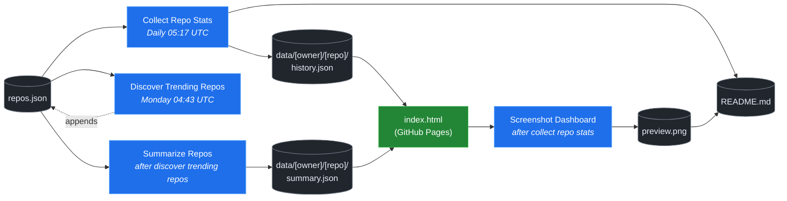

# 🚀 Rising Repos Tracker

> Automatically tracks daily GitHub stats (stars, forks, issues, velocity) for rising open source repos.

[](https://www.telosignal.com/)


**[→ View Live Dashboard](https://patrick-creates.github.io/rising-repos-tracker/)**

Built and maintained by [Telosignal](https://www.telosignal.com/).


<!-- AUTOGEN-STATS-START -->
## 📊 Current snapshot

> Auto-updated daily — last refreshed 2026-06-16

| Metric | Value |
|---|---|
| Repos tracked | **106** |
| Total stars | **6,025,295** |
| Total forks | **969,024** |
| Fastest growing | **hermes-agent** (+1377.2/day) |

### 🔥 Top 5 by velocity

| # | Repo | Stars | Stars/day |
|---|---|---:|---:|
| 1 | [NousResearch/hermes-agent](https://github.com/NousResearch/hermes-agent) | 194,869 | +1377.2 |
| 2 | [mvanhorn/last30days-skill](https://github.com/mvanhorn/last30days-skill) | 43,167 | +1312.0 |
| 3 | [elder-plinius/CL4R1T4S](https://github.com/elder-plinius/CL4R1T4S) | 40,191 | +1300.0 |
| 4 | [chopratejas/headroom](https://github.com/chopratejas/headroom) | 29,322 | +1159.0 |
| 5 | [affaan-m/ECC](https://github.com/affaan-m/ECC) | 216,417 | +1099.5 |

### 🆕 Recently added

- [elder-plinius/CL4R1T4S](https://github.com/elder-plinius/CL4R1T4S) — added 2026-06-15 — LEAKED SYSTEM PROMPTS FOR CHATGPT, CLAUDE, GEMINI, GROK, PERPLEXITY, CURSOR, LOVABLE, REPLIT, AND MORE! - AI SYSTEMS TRANSPARENCY FOR ALL! 👐
- [chopratejas/headroom](https://github.com/chopratejas/headroom) — added 2026-06-15 — Compress tool outputs, logs, files, and RAG chunks before they reach the LLM. 60-95% fewer tokens, same answers. Library, proxy, MCP server.
- [alibaba/page-agent](https://github.com/alibaba/page-agent) — added 2026-06-15 — JavaScript in-page GUI agent. Control web interfaces with natural language.
<!-- AUTOGEN-STATS-END -->

<!-- AUTOGEN-DIAGRAM-START -->
## 🔄 How it works


<!-- AUTOGEN-DIAGRAM-END -->

<!-- AUTOGEN-WORKFLOWS-START -->
## ⚙️ Workflows

| File | Schedule | Name |
|---|---|---|
| `collect.yml` | Daily 05:17 UTC | Collect Repo Stats |
| `discover.yml` | Monday 04:43 UTC | Discover Trending Repos |
| `screenshot.yml` | After Collect Repo Stats | Screenshot Dashboard |
| `summarize.yml` | After Discover Trending Repos | Summarize Repos |

> All workflows commit results directly back to the repo. Schedules are best-effort — GitHub Actions cron can drift by a few minutes.
<!-- AUTOGEN-WORKFLOWS-END -->

<!-- AUTOGEN-REPOS-START -->
## 📋 All tracked repos

| Repo | Stars | Forks | Stars/day |
|---|---:|---:|---:|
| [openclaw/openclaw](https://github.com/openclaw/openclaw) | 378,962 | 79,299 | +220.3 |
| [affaan-m/everything-claude-code](https://github.com/affaan-m/everything-claude-code) | 216,417 | 33,255 | +1040.3 |
| [affaan-m/ECC](https://github.com/affaan-m/ECC) | 216,417 | 33,255 | +1099.5 |
| [NousResearch/hermes-agent](https://github.com/NousResearch/hermes-agent) | 194,869 | 34,193 | +1377.2 |
| [Significant-Gravitas/AutoGPT](https://github.com/Significant-Gravitas/AutoGPT) | 184,970 | 46,139 | +20.3 |
| [f/prompts.chat](https://github.com/f/prompts.chat) | 163,804 | 21,244 | +48.0 |
| [microsoft/markitdown](https://github.com/microsoft/markitdown) | 154,367 | 10,678 | +922.3 |
| [langgenius/dify](https://github.com/langgenius/dify) | 145,439 | 22,875 | +123.9 |
| [open-webui/open-webui](https://github.com/open-webui/open-webui) | 141,755 | 20,373 | +143.0 |
| [langchain-ai/langchain](https://github.com/langchain-ai/langchain) | 139,441 | 23,112 | +82.5 |
| [github/spec-kit](https://github.com/github/spec-kit) | 112,500 | 9,931 | +430.6 |
| [microsoft/generative-ai-for-beginners](https://github.com/microsoft/generative-ai-for-beginners) | 112,040 | 60,169 | +37.9 |
| [farion1231/cc-switch](https://github.com/farion1231/cc-switch) | 102,284 | 6,766 | +973.8 |
| [nextlevelbuilder/ui-ux-pro-max-skill](https://github.com/nextlevelbuilder/ui-ux-pro-max-skill) | 92,314 | 9,644 | +424.1 |
| [ChatGPTNextWeb/NextChat](https://github.com/ChatGPTNextWeb/NextChat) | 88,254 | 59,563 | +7.5 |
| [vllm-project/vllm](https://github.com/vllm-project/vllm) | 83,024 | 18,112 | +92.4 |
| [thedotmack/claude-mem](https://github.com/thedotmack/claude-mem) | 82,655 | 7,152 | +214.0 |
| [lobehub/lobehub](https://github.com/lobehub/lobehub) | 78,727 | 15,444 | +50.9 |
| [OpenHands/OpenHands](https://github.com/OpenHands/OpenHands) | 77,306 | 9,824 | +116.3 |
| [dair-ai/Prompt-Engineering-Guide](https://github.com/dair-ai/Prompt-Engineering-Guide) | 75,669 | 8,223 | +33.4 |
| [openai/openai-cookbook](https://github.com/openai/openai-cookbook) | 74,192 | 12,561 | +20.1 |
| [ruvnet/RuView](https://github.com/ruvnet/RuView) | 74,117 | 9,889 | +373.8 |
| [JuliusBrussee/caveman](https://github.com/JuliusBrussee/caveman) | 73,251 | 4,133 | +404.8 |
| [shareAI-lab/learn-claude-code](https://github.com/shareAI-lab/learn-claude-code) | 66,863 | 10,876 | +199.5 |
| [unslothai/unsloth](https://github.com/unslothai/unsloth) | 66,615 | 5,972 | +72.9 |
| [xtekky/gpt4free](https://github.com/xtekky/gpt4free) | 66,337 | 13,574 | +3.3 |
| [nexu-io/open-design](https://github.com/nexu-io/open-design) | 65,736 | 7,370 | +743.5 |
| [ComposioHQ/awesome-claude-skills](https://github.com/ComposioHQ/awesome-claude-skills) | 64,784 | 7,168 | +151.6 |
| [rtk-ai/rtk](https://github.com/rtk-ai/rtk) | 62,760 | 3,875 | +454.6 |
| [code-yeongyu/oh-my-openagent](https://github.com/code-yeongyu/oh-my-openagent) | 62,419 | 5,058 | +141.1 |
| [datawhalechina/hello-agents](https://github.com/datawhalechina/hello-agents) | 59,615 | 7,339 | +308.8 |
| [shanraisshan/claude-code-best-practice](https://github.com/shanraisshan/claude-code-best-practice) | 57,904 | 5,817 | +151.9 |
| [koala73/worldmonitor](https://github.com/koala73/worldmonitor) | 56,544 | 9,041 | +75.0 |
| [MemPalace/mempalace](https://github.com/MemPalace/mempalace) | 55,707 | 7,222 | +114.0 |
| [Fission-AI/OpenSpec](https://github.com/Fission-AI/OpenSpec) | 55,055 | 3,859 | +216.1 |
| [santifer/career-ops](https://github.com/santifer/career-ops) | 54,059 | 10,738 | +303.9 |
| [FlowiseAI/Flowise](https://github.com/FlowiseAI/Flowise) | 53,633 | 24,522 | +25.3 |
| [ggml-org/whisper.cpp](https://github.com/ggml-org/whisper.cpp) | 50,767 | 5,667 | +32.4 |
| [BerriAI/litellm](https://github.com/BerriAI/litellm) | 50,553 | 8,910 | +109.1 |
| [tw93/Pake](https://github.com/tw93/Pake) | 50,527 | 10,356 | +60.3 |
| [hesreallyhim/awesome-claude-code](https://github.com/hesreallyhim/awesome-claude-code) | 46,599 | 4,060 | +86.3 |
| [Aider-AI/aider](https://github.com/Aider-AI/aider) | 46,292 | 4,595 | +45.9 |
| [zhayujie/CowAgent](https://github.com/zhayujie/CowAgent) | 45,343 | 10,204 | +27.2 |
| [Leonxlnx/taste-skill](https://github.com/Leonxlnx/taste-skill) | 44,898 | 3,128 | +965.7 |
| [HKUDS/nanobot](https://github.com/HKUDS/nanobot) | 44,276 | 7,827 | +55.0 |
| [ChromeDevTools/chrome-devtools-mcp](https://github.com/ChromeDevTools/chrome-devtools-mcp) | 43,737 | 2,815 | +132.9 |
| [mvanhorn/last30days-skill](https://github.com/mvanhorn/last30days-skill) | 43,167 | 3,536 | +1312.0 |
| [ZhuLinsen/daily_stock_analysis](https://github.com/ZhuLinsen/daily_stock_analysis) | 42,721 | 40,462 | +176.5 |
| [asgeirtj/system_prompts_leaks](https://github.com/asgeirtj/system_prompts_leaks) | 42,605 | 7,078 | +76.6 |
| [sickn33/antigravity-awesome-skills](https://github.com/sickn33/antigravity-awesome-skills) | 40,851 | 6,590 | +98.8 |
| [chatboxai/chatbox](https://github.com/chatboxai/chatbox) | 40,498 | 4,111 | +17.3 |
| [elder-plinius/CL4R1T4S](https://github.com/elder-plinius/CL4R1T4S) | 40,191 | 7,844 | +1300.0 |
| [danny-avila/LibreChat](https://github.com/danny-avila/LibreChat) | 39,262 | 8,056 | +81.5 |
| [QuantumNous/new-api](https://github.com/QuantumNous/new-api) | 39,017 | 8,866 | +166.4 |
| [chatanywhere/GPT_API_free](https://github.com/chatanywhere/GPT_API_free) | 38,462 | 2,649 | +13.9 |
| [Hmbown/CodeWhale](https://github.com/Hmbown/CodeWhale) | 38,457 | 3,308 | +172.1 |
| [router-for-me/CLIProxyAPI](https://github.com/router-for-me/CLIProxyAPI) | 37,644 | 6,203 | +131.8 |
| [google/langextract](https://github.com/google/langextract) | 36,896 | 2,545 | +15.5 |
| [wshobson/agents](https://github.com/wshobson/agents) | 36,821 | 3,982 | +40.2 |
| [Yeachan-Heo/oh-my-claudecode](https://github.com/Yeachan-Heo/oh-my-claudecode) | 36,486 | 3,312 | +75.5 |
| [kepano/obsidian-skills](https://github.com/kepano/obsidian-skills) | 35,794 | 2,537 | +127.3 |
| [github/awesome-copilot](https://github.com/github/awesome-copilot) | 35,108 | 4,329 | +59.2 |
| [songquanpeng/one-api](https://github.com/songquanpeng/one-api) | 34,985 | 6,633 | +35.2 |
| [PDFMathTranslate/PDFMathTranslate](https://github.com/PDFMathTranslate/PDFMathTranslate) | 34,879 | 3,113 | +39.3 |
| [AstrBotDevs/AstrBot](https://github.com/AstrBotDevs/AstrBot) | 34,751 | 2,393 | +77.5 |
| [coreyhaines31/marketingskills](https://github.com/coreyhaines31/marketingskills) | 33,539 | 5,509 | +140.1 |
| [rohitg00/ai-engineering-from-scratch](https://github.com/rohitg00/ai-engineering-from-scratch) | 33,482 | 5,461 | +474.6 |
| [zeroclaw-labs/zeroclaw](https://github.com/zeroclaw-labs/zeroclaw) | 31,921 | 4,720 | +16.3 |
| [Panniantong/Agent-Reach](https://github.com/Panniantong/Agent-Reach) | 31,315 | 2,515 | +979.8 |
| [anthropics/claude-plugins-official](https://github.com/anthropics/claude-plugins-official) | 30,236 | 3,277 | +81.7 |
| [jamiepine/voicebox](https://github.com/jamiepine/voicebox) | 30,036 | 3,714 | +67.6 |
| [chopratejas/headroom](https://github.com/chopratejas/headroom) | 29,322 | 1,977 | +1159.0 |
| [Gitlawb/openclaude](https://github.com/Gitlawb/openclaude) | 28,975 | 8,760 | +56.0 |
| [voideditor/void](https://github.com/voideditor/void) | 28,805 | 2,536 | — |
| [iOfficeAI/AionUi](https://github.com/iOfficeAI/AionUi) | 28,348 | 2,782 | +66.7 |
| [AlexsJones/llmfit](https://github.com/AlexsJones/llmfit) | 28,068 | 1,712 | +71.1 |
| [heygen-com/hyperframes](https://github.com/heygen-com/hyperframes) | 28,003 | 2,638 | +305.3 |
| [googleworkspace/cli](https://github.com/googleworkspace/cli) | 27,092 | 1,425 | +24.9 |
| [BloopAI/vibe-kanban](https://github.com/BloopAI/vibe-kanban) | 27,022 | 2,859 | +20.8 |
| [usestrix/strix](https://github.com/usestrix/strix) | 26,019 | 2,932 | +20.6 |
| [volcengine/OpenViking](https://github.com/volcengine/OpenViking) | 25,701 | 1,987 | +46.6 |
| [zai-org/Open-AutoGLM](https://github.com/zai-org/Open-AutoGLM) | 25,538 | 3,975 | +9.5 |
| [jarrodwatts/claude-hud](https://github.com/jarrodwatts/claude-hud) | 25,268 | 1,150 | +72.3 |
| [p-e-w/heretic](https://github.com/p-e-w/heretic) | 24,804 | 2,660 | +104.0 |
| [langchain-ai/deepagents](https://github.com/langchain-ai/deepagents) | 24,711 | 3,498 | +69.5 |
| [toon-format/toon](https://github.com/toon-format/toon) | 24,573 | 1,093 | +9.6 |
| [jackwener/OpenCLI](https://github.com/jackwener/OpenCLI) | 24,525 | 2,450 | +90.6 |
| [rohitg00/agentmemory](https://github.com/rohitg00/agentmemory) | 23,037 | 1,901 | +151.5 |
| [esengine/DeepSeek-Reasonix](https://github.com/esengine/DeepSeek-Reasonix) | 22,473 | 1,350 | +368.4 |
| [winfunc/opcode](https://github.com/winfunc/opcode) | 22,058 | 1,703 | +6.6 |
| [coze-dev/coze-studio](https://github.com/coze-dev/coze-studio) | 20,992 | 3,051 | +5.5 |
| [NirDiamant/agents-towards-production](https://github.com/NirDiamant/agents-towards-production) | 20,743 | 2,757 | +13.6 |
| [alibaba/page-agent](https://github.com/alibaba/page-agent) | 18,595 | 1,601 | +37.0 |
| [tirth8205/code-review-graph](https://github.com/tirth8205/code-review-graph) | 18,555 | 1,985 | +41.0 |
| [tanweai/pua](https://github.com/tanweai/pua) | 18,275 | 1,102 | +29.0 |
| [agentscope-ai/QwenPaw](https://github.com/agentscope-ai/QwenPaw) | 18,041 | 2,620 | +263.0 |
| [RightNow-AI/openfang](https://github.com/RightNow-AI/openfang) | 17,833 | 2,267 | +7.0 |
| [decolua/9router](https://github.com/decolua/9router) | 17,669 | 2,735 | +98.0 |
| [mksglu/context-mode](https://github.com/mksglu/context-mode) | 17,546 | 1,248 | +78.0 |
| [microsoft/agent-lightning](https://github.com/microsoft/agent-lightning) | 17,311 | 1,515 | — |
| [JCodesMore/ai-website-cloner-template](https://github.com/JCodesMore/ai-website-cloner-template) | 17,054 | 2,648 | +61.0 |
| [datawhalechina/easy-vibe](https://github.com/datawhalechina/easy-vibe) | 16,984 | 1,604 | +43.0 |
| [jundot/omlx](https://github.com/jundot/omlx) | 16,685 | 1,414 | +53.0 |
| [Tencent/WeKnora](https://github.com/Tencent/WeKnora) | 16,330 | 2,109 | +38.0 |
| [cft0808/edict](https://github.com/cft0808/edict) | 16,075 | 1,696 | +13.0 |
| [frankbria/ralph-claude-code](https://github.com/frankbria/ralph-claude-code) | 9,344 | 714 | +6.8 |
<!-- AUTOGEN-REPOS-END -->

---

## What it does

- Collects daily snapshots of stars, forks, watchers and open issues for every tracked repo
- Discovers new trending repos automatically every Monday using the GitHub Search API
- Generates AI summaries (use cases, similar tools, tags) for each tracked repo via GitHub Models
- Stores all history as plain JSON — no database, no backend
- Renders a live dashboard via GitHub Pages — updates daily, zero maintenance

## Tracked repos

Data lives in [`data/`](./data) — one folder per repo, one `history.json` per entry.  
The full watch list is in [`repos.json`](./repos.json).

## Fork & use it for yourself

This is my personal tracker — the watch list reflects what I find interesting. If you want to track different repos, the best path is to **fork this repo and run your own**.

### Setup

1. Fork this repo to your account
2. Replace the contents of [`repos.json`](./repos.json) with the repos you want to track (or just leave one entry — `discover.yml` will auto-add more every Monday)
3. Go to **Settings → Pages** and enable GitHub Pages from the `main` branch
4. Go to **Actions** and run **Collect Repo Stats** once manually to seed your first data point
5. Your dashboard will be live at `https://YOUR-USERNAME.github.io/rising-repos-tracker/`

That's it — daily collection and weekly discovery run automatically on schedule. Zero ongoing maintenance.

### Customizing what gets discovered

Edit [`scripts/discover.js`](./scripts/discover.js) to change:

- `MIN_STARS` — minimum star threshold for candidates
- `MAX_AGE_DAYS` — how recent a repo must be
- `MAX_NEW_REPOS` — how many to add per discovery run
- The `queries` array — GitHub Search API queries that define what "trending" means to you

### Adding a repo manually

Just edit `repos.json` directly:

```json
{
  "owner": "OWNER",
  "repo": "REPO",
  "added": "YYYY-MM-DD",
  "notes": "why you're tracking this"
}
```

The next daily collect run picks it up automatically.

## Stack

- **GitHub Actions** — scheduling and automation
- **GitHub Pages** — dashboard hosting
- **GitHub API** — data source
- **GitHub Models** — free AI summaries (gpt-4o-mini)
- **Chart.js** — star growth visualization
- **Mermaid** — architecture diagram (rendered by GitHub)
- No dependencies, no build step, no database

## License

MIT
