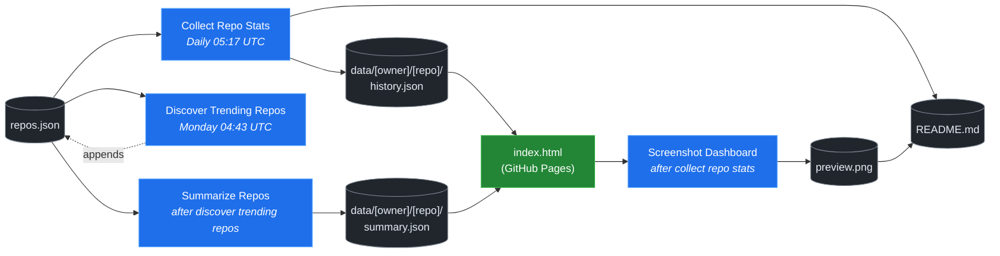

# 🚀 Rising Repos Tracker

> Automatically tracks daily GitHub stats (stars, forks, issues, velocity) for rising open source repos.

[](https://www.telosignal.com/)


**[→ View Live Dashboard](https://patrick-creates.github.io/rising-repos-tracker/)**

Built and maintained by [Telosignal](https://www.telosignal.com/).


<!-- AUTOGEN-STATS-START -->
## 📊 Current snapshot

> Auto-updated daily — last refreshed 2026-07-08

| Metric | Value |
|---|---|
| Repos tracked | **151** |
| Total stars | **7,402,618** |
| Total forks | **1,133,381** |
| Fastest growing | **ponytail** (+1826.4/day) |

### 🔥 Top 5 by velocity

| # | Repo | Stars | Stars/day |
|---|---|---:|---:|
| 1 | [DietrichGebert/ponytail](https://github.com/DietrichGebert/ponytail) | 77,241 | +1826.4 |
| 2 | [chopratejas/headroom](https://github.com/chopratejas/headroom) | 57,660 | +1282.5 |
| 3 | [NousResearch/hermes-agent](https://github.com/NousResearch/hermes-agent) | 211,192 | +1127.6 |
| 4 | [iOfficeAI/OfficeCLI](https://github.com/iOfficeAI/OfficeCLI) | 10,618 | +1110.5 |
| 5 | [Panniantong/Agent-Reach](https://github.com/Panniantong/Agent-Reach) | 52,894 | +980.6 |

### 🆕 Recently added

- [stablyai/orca](https://github.com/stablyai/orca) — added 2026-07-06 — Orca is the ADE for working with a fleet of parallel agents. Run any coding agent with your own subscription. Available on desktop and mobile.
- [ogulcancelik/herdr](https://github.com/ogulcancelik/herdr) — added 2026-07-06 — agent multiplexer that lives in your terminal.
- [diegosouzapw/OmniRoute](https://github.com/diegosouzapw/OmniRoute) — added 2026-07-06 — Never stop coding. Free AI gateway: one endpoint, 231+ providers (50+ free), connect Claude Code, Codex, Cursor, Cline & Copilot to FREE Claude/GPT/Gemini. RTK+Caveman stacked compression saves 15-95% tokens, smart auto-fallback, MCP/A2A, multimodal APIs, Desktop/PWA.
<!-- AUTOGEN-STATS-END -->

<!-- AUTOGEN-DIAGRAM-START -->
## 🔄 How it works


<!-- AUTOGEN-DIAGRAM-END -->

<!-- AUTOGEN-WORKFLOWS-START -->
## ⚙️ Workflows

| File | Schedule | Name |
|---|---|---|
| `collect.yml` | Daily 05:17 UTC | Collect Repo Stats |
| `discover.yml` | Monday 04:43 UTC | Discover Trending Repos |
| `screenshot.yml` | After Collect Repo Stats | Screenshot Dashboard |
| `summarize.yml` | After Discover Trending Repos | Summarize Repos |

> All workflows commit results directly back to the repo. Schedules are best-effort — GitHub Actions cron can drift by a few minutes.
<!-- AUTOGEN-WORKFLOWS-END -->

<!-- AUTOGEN-REPOS-START -->
## 📋 All tracked repos

| Repo | Stars | Forks | Stars/day |
|---|---:|---:|---:|
| [openclaw/openclaw](https://github.com/openclaw/openclaw) | 382,130 | 80,171 | +190.3 |
| [obra/superpowers](https://github.com/obra/superpowers) | 249,146 | 22,120 | +848.1 |
| [affaan-m/everything-claude-code](https://github.com/affaan-m/everything-claude-code) | 227,171 | 34,730 | +823.6 |
| [affaan-m/ECC](https://github.com/affaan-m/ECC) | 227,171 | 34,730 | +794.1 |
| [NousResearch/hermes-agent](https://github.com/NousResearch/hermes-agent) | 211,192 | 38,780 | +1127.6 |
| [Significant-Gravitas/AutoGPT](https://github.com/Significant-Gravitas/AutoGPT) | 185,433 | 46,123 | +20.6 |
| [f/prompts.chat](https://github.com/f/prompts.chat) | 165,061 | 21,363 | +51.6 |
| [microsoft/markitdown](https://github.com/microsoft/markitdown) | 163,856 | 11,639 | +729.4 |
| [langgenius/dify](https://github.com/langgenius/dify) | 148,128 | 23,332 | +123.3 |
| [open-webui/open-webui](https://github.com/open-webui/open-webui) | 144,665 | 20,921 | +138.8 |
| [langchain-ai/langchain](https://github.com/langchain-ai/langchain) | 141,274 | 23,481 | +82.8 |
| [github/spec-kit](https://github.com/github/spec-kit) | 118,665 | 10,513 | +371.5 |
| [farion1231/cc-switch](https://github.com/farion1231/cc-switch) | 114,570 | 7,651 | +794.6 |
| [microsoft/generative-ai-for-beginners](https://github.com/microsoft/generative-ai-for-beginners) | 112,751 | 60,570 | +35.7 |
| [nextlevelbuilder/ui-ux-pro-max-skill](https://github.com/nextlevelbuilder/ui-ux-pro-max-skill) | 102,529 | 10,817 | +439.9 |
| [ChatGPTNextWeb/NextChat](https://github.com/ChatGPTNextWeb/NextChat) | 88,410 | 59,489 | +7.3 |
| [JuliusBrussee/caveman](https://github.com/JuliusBrussee/caveman) | 86,442 | 4,822 | +488.8 |
| [thedotmack/claude-mem](https://github.com/thedotmack/claude-mem) | 86,374 | 7,473 | +196.3 |
| [vllm-project/vllm](https://github.com/vllm-project/vllm) | 85,661 | 19,105 | +103.2 |
| [OpenHands/OpenHands](https://github.com/OpenHands/OpenHands) | 79,931 | 10,193 | +117.6 |
| [lobehub/lobehub](https://github.com/lobehub/lobehub) | 79,598 | 15,565 | +46.4 |
| [ruvnet/RuView](https://github.com/ruvnet/RuView) | 78,718 | 10,589 | +291.5 |
| [DietrichGebert/ponytail](https://github.com/DietrichGebert/ponytail) | 77,241 | 4,122 | +1826.4 |
| [dair-ai/Prompt-Engineering-Guide](https://github.com/dair-ai/Prompt-Engineering-Guide) | 76,288 | 8,350 | +31.1 |
| [nexu-io/open-design](https://github.com/nexu-io/open-design) | 76,115 | 8,681 | +626.3 |
| [openai/openai-cookbook](https://github.com/openai/openai-cookbook) | 74,593 | 12,623 | +19.3 |
| [shareAI-lab/learn-claude-code](https://github.com/shareAI-lab/learn-claude-code) | 70,280 | 11,455 | +180.5 |
| [rtk-ai/rtk](https://github.com/rtk-ai/rtk) | 69,381 | 4,307 | +388.3 |
| [unslothai/unsloth](https://github.com/unslothai/unsloth) | 67,908 | 6,108 | +66.8 |
| [ComposioHQ/awesome-claude-skills](https://github.com/ComposioHQ/awesome-claude-skills) | 67,128 | 7,523 | +132.2 |
| [xtekky/gpt4free](https://github.com/xtekky/gpt4free) | 66,456 | 13,551 | +4.2 |
| [code-yeongyu/oh-my-openagent](https://github.com/code-yeongyu/oh-my-openagent) | 65,231 | 5,322 | +135.4 |
| [datawhalechina/hello-agents](https://github.com/datawhalechina/hello-agents) | 64,784 | 8,031 | +276.9 |
| [shanraisshan/claude-code-best-practice](https://github.com/shanraisshan/claude-code-best-practice) | 62,234 | 6,222 | +171.3 |
| [koala73/worldmonitor](https://github.com/koala73/worldmonitor) | 61,552 | 9,578 | +140.9 |
| [Leonxlnx/taste-skill](https://github.com/Leonxlnx/taste-skill) | 60,331 | 4,098 | +808.6 |
| [tw93/Pake](https://github.com/tw93/Pake) | 59,557 | 12,002 | +211.3 |
| [Fission-AI/OpenSpec](https://github.com/Fission-AI/OpenSpec) | 59,288 | 4,120 | +205.9 |
| [santifer/career-ops](https://github.com/santifer/career-ops) | 59,092 | 11,615 | +271.5 |
| [chopratejas/headroom](https://github.com/chopratejas/headroom) | 57,660 | 4,253 | +1282.5 |
| [headroomlabs-ai/headroom](https://github.com/headroomlabs-ai/headroom) | 57,660 | 4,253 | +734.8 |
| [MemPalace/mempalace](https://github.com/MemPalace/mempalace) | 57,094 | 7,376 | +92.0 |
| [ZhuLinsen/daily_stock_analysis](https://github.com/ZhuLinsen/daily_stock_analysis) | 55,694 | 48,059 | +383.1 |
| [FlowiseAI/Flowise](https://github.com/FlowiseAI/Flowise) | 54,414 | 24,669 | +29.7 |
| [asgeirtj/system_prompts_leaks](https://github.com/asgeirtj/system_prompts_leaks) | 53,393 | 8,702 | +255.1 |
| [BerriAI/litellm](https://github.com/BerriAI/litellm) | 52,927 | 9,554 | +108.6 |
| [Panniantong/Agent-Reach](https://github.com/Panniantong/Agent-Reach) | 52,894 | 4,253 | +980.6 |
| [ggml-org/whisper.cpp](https://github.com/ggml-org/whisper.cpp) | 51,450 | 5,745 | +31.8 |
| [mvanhorn/last30days-skill](https://github.com/mvanhorn/last30days-skill) | 50,426 | 4,206 | +591.8 |
| [hesreallyhim/awesome-claude-code](https://github.com/hesreallyhim/awesome-claude-code) | 49,369 | 4,295 | +103.4 |
| [Aider-AI/aider](https://github.com/Aider-AI/aider) | 47,169 | 4,710 | +43.3 |
| [ChromeDevTools/chrome-devtools-mcp](https://github.com/ChromeDevTools/chrome-devtools-mcp) | 46,300 | 3,021 | +125.8 |
| [zhayujie/CowAgent](https://github.com/zhayujie/CowAgent) | 45,865 | 10,258 | +25.7 |
| [HKUDS/nanobot](https://github.com/HKUDS/nanobot) | 45,120 | 7,966 | +47.8 |
| [elder-plinius/CL4R1T4S](https://github.com/elder-plinius/CL4R1T4S) | 45,012 | 9,153 | +266.1 |
| [sickn33/antigravity-awesome-skills](https://github.com/sickn33/antigravity-awesome-skills) | 42,580 | 6,777 | +88.7 |
| [QuantumNous/new-api](https://github.com/QuantumNous/new-api) | 41,482 | 9,598 | +139.2 |
| [chatboxai/chatbox](https://github.com/chatboxai/chatbox) | 40,907 | 4,141 | +17.9 |
| [danny-avila/LibreChat](https://github.com/danny-avila/LibreChat) | 40,423 | 8,280 | +67.1 |
| [kepano/obsidian-skills](https://github.com/kepano/obsidian-skills) | 40,195 | 2,856 | +170.6 |
| [Hmbown/CodeWhale](https://github.com/Hmbown/CodeWhale) | 39,573 | 3,412 | +111.4 |
| [router-for-me/CLIProxyAPI](https://github.com/router-for-me/CLIProxyAPI) | 39,485 | 6,516 | +107.8 |
| [usestrix/strix](https://github.com/usestrix/strix) | 38,756 | 3,936 | +352.6 |
| [chatanywhere/GPT_API_free](https://github.com/chatanywhere/GPT_API_free) | 38,709 | 2,665 | +12.6 |
| [jamiepine/voicebox](https://github.com/jamiepine/voicebox) | 38,578 | 4,651 | +258.3 |
| [wshobson/agents](https://github.com/wshobson/agents) | 37,647 | 4,038 | +38.9 |
| [rohitg00/ai-engineering-from-scratch](https://github.com/rohitg00/ai-engineering-from-scratch) | 37,611 | 6,267 | +304.0 |
| [Yeachan-Heo/oh-my-claudecode](https://github.com/Yeachan-Heo/oh-my-claudecode) | 37,550 | 3,385 | +62.0 |
| [coreyhaines31/marketingskills](https://github.com/coreyhaines31/marketingskills) | 37,186 | 5,981 | +155.4 |
| [google/langextract](https://github.com/google/langextract) | 37,087 | 2,562 | +12.1 |
| [langchain-ai/langgraph](https://github.com/langchain-ai/langgraph) | 36,768 | 6,167 | +84.3 |
| [github/awesome-copilot](https://github.com/github/awesome-copilot) | 36,314 | 4,523 | +57.0 |
| [AstrBotDevs/AstrBot](https://github.com/AstrBotDevs/AstrBot) | 35,995 | 2,494 | +65.0 |
| [songquanpeng/one-api](https://github.com/songquanpeng/one-api) | 35,570 | 6,725 | +30.9 |
| [PDFMathTranslate/PDFMathTranslate](https://github.com/PDFMathTranslate/PDFMathTranslate) | 35,471 | 3,167 | +33.1 |
| [calesthio/OpenMontage](https://github.com/calesthio/OpenMontage) | 35,268 | 4,059 | +824.1 |
| [heygen-com/hyperframes](https://github.com/heygen-com/hyperframes) | 33,687 | 3,145 | +270.9 |
| [zeroclaw-labs/zeroclaw](https://github.com/zeroclaw-labs/zeroclaw) | 32,191 | 4,801 | +13.9 |
| [anthropics/claude-plugins-official](https://github.com/anthropics/claude-plugins-official) | 31,773 | 3,500 | +74.6 |
| [Gitlawb/openclaude](https://github.com/Gitlawb/openclaude) | 29,868 | 8,858 | +46.8 |
| [iOfficeAI/AionUi](https://github.com/iOfficeAI/AionUi) | 29,502 | 2,947 | +58.2 |
| [googleworkspace/cli](https://github.com/googleworkspace/cli) | 29,501 | 1,699 | +75.2 |
| [AlexsJones/llmfit](https://github.com/AlexsJones/llmfit) | 29,204 | 1,787 | +59.5 |
| [voideditor/void](https://github.com/voideditor/void) | 28,820 | 2,576 | +0.4 |
| [DeusData/codebase-memory-mcp](https://github.com/DeusData/codebase-memory-mcp) | 28,220 | 2,103 | +843.3 |
| [BloopAI/vibe-kanban](https://github.com/BloopAI/vibe-kanban) | 27,302 | 2,895 | +16.0 |
| [JCodesMore/ai-website-cloner-template](https://github.com/JCodesMore/ai-website-cloner-template) | 26,538 | 3,751 | +415.0 |
| [volcengine/OpenViking](https://github.com/volcengine/OpenViking) | 26,421 | 2,057 | +36.4 |
| [esengine/DeepSeek-Reasonix](https://github.com/esengine/DeepSeek-Reasonix) | 26,379 | 1,644 | +228.4 |
| [jackwener/OpenCLI](https://github.com/jackwener/OpenCLI) | 26,272 | 2,594 | +82.4 |
| [jarrodwatts/claude-hud](https://github.com/jarrodwatts/claude-hud) | 26,239 | 1,207 | +51.6 |
| [langchain-ai/deepagents](https://github.com/langchain-ai/deepagents) | 25,914 | 3,633 | +58.6 |
| [p-e-w/heretic](https://github.com/p-e-w/heretic) | 25,904 | 2,807 | +64.4 |
| [zai-org/Open-AutoGLM](https://github.com/zai-org/Open-AutoGLM) | 25,721 | 4,004 | +8.6 |
| [alibaba/page-agent](https://github.com/alibaba/page-agent) | 25,034 | 2,142 | +281.6 |
| [mukul975/Anthropic-Cybersecurity-Skills](https://github.com/mukul975/Anthropic-Cybersecurity-Skills) | 24,895 | 2,853 | +423.3 |
| [toon-format/toon](https://github.com/toon-format/toon) | 24,801 | 1,101 | +10.2 |
| [rohitg00/agentmemory](https://github.com/rohitg00/agentmemory) | 24,801 | 2,045 | +99.2 |
| [winfunc/opcode](https://github.com/winfunc/opcode) | 22,160 | 1,708 | +5.2 |
| [agentscope-ai/QwenPaw](https://github.com/agentscope-ai/QwenPaw) | 21,381 | 2,745 | +156.7 |
| [coze-dev/coze-studio](https://github.com/coze-dev/coze-studio) | 21,130 | 3,073 | +6.1 |
| [NirDiamant/agents-towards-production](https://github.com/NirDiamant/agents-towards-production) | 20,935 | 2,783 | +10.0 |
| [decolua/9router](https://github.com/decolua/9router) | 20,866 | 3,383 | +143.3 |
| [tirth8205/code-review-graph](https://github.com/tirth8205/code-review-graph) | 19,305 | 2,064 | +34.4 |
| [tanweai/pua](https://github.com/tanweai/pua) | 18,686 | 1,122 | +19.1 |
| [mksglu/context-mode](https://github.com/mksglu/context-mode) | 18,685 | 1,309 | +52.9 |
| [HKUDS/Vibe-Trading](https://github.com/HKUDS/Vibe-Trading) | 18,612 | 3,093 | +430.4 |
| [pranshuparmar/witr](https://github.com/pranshuparmar/witr) | 18,183 | 566 | +16.8 |
| [RightNow-AI/openfang](https://github.com/RightNow-AI/openfang) | 17,982 | 2,275 | +6.8 |
| [Tencent/WeKnora](https://github.com/Tencent/WeKnora) | 17,937 | 2,441 | +71.5 |
| [datawhalechina/easy-vibe](https://github.com/datawhalechina/easy-vibe) | 17,923 | 1,700 | +42.7 |
| [jundot/omlx](https://github.com/jundot/omlx) | 17,635 | 1,483 | +43.6 |
| [microsoft/agent-lightning](https://github.com/microsoft/agent-lightning) | 17,378 | 1,519 | +2.9 |
| [steipete/CodexBar](https://github.com/steipete/CodexBar) | 17,129 | 1,395 | +120.4 |
| [jnMetaCode/agency-agents-zh](https://github.com/jnMetaCode/agency-agents-zh) | 16,840 | 2,874 | +89.6 |
| [can1357/oh-my-pi](https://github.com/can1357/oh-my-pi) | 16,643 | 1,480 | +165.4 |
| [danielmiessler/LifeOS](https://github.com/danielmiessler/LifeOS) | 16,467 | 2,252 | +25.1 |
| [cft0808/edict](https://github.com/cft0808/edict) | 16,173 | 1,701 | +4.8 |
| [browser-use/browser-harness](https://github.com/browser-use/browser-harness) | 15,809 | 1,469 | +36.7 |
| [nesquena/hermes-webui](https://github.com/nesquena/hermes-webui) | 15,641 | 2,057 | +50.2 |
| [MemoriLabs/Memori](https://github.com/MemoriLabs/Memori) | 15,548 | 2,783 | +12.8 |
| [kyegomez/OpenMythos](https://github.com/kyegomez/OpenMythos) | 14,646 | 3,295 | +30.7 |
| [xpzouying/xiaohongshu-mcp](https://github.com/xpzouying/xiaohongshu-mcp) | 14,571 | 2,163 | +17.8 |
| [yusufkaraaslan/Skill_Seekers](https://github.com/yusufkaraaslan/Skill_Seekers) | 14,393 | 1,470 | +10.4 |
| [NevaMind-AI/memU](https://github.com/NevaMind-AI/memU) | 13,995 | 1,038 | +5.9 |
| [ogulcancelik/herdr](https://github.com/ogulcancelik/herdr) | 13,808 | 795 | +705.5 |
| [stablyai/orca](https://github.com/stablyai/orca) | 13,775 | 929 | +596.0 |
| [diegosouzapw/OmniRoute](https://github.com/diegosouzapw/OmniRoute) | 13,309 | 1,938 | +578.5 |
| [wanshuiyin/Auto-claude-code-research-in-sleep](https://github.com/wanshuiyin/Auto-claude-code-research-in-sleep) | 13,118 | 1,184 | +38.2 |
| [superset-sh/superset](https://github.com/superset-sh/superset) | 12,310 | 1,064 | +16.7 |
| [xbtlin/ai-berkshire](https://github.com/xbtlin/ai-berkshire) | 11,859 | 1,538 | +541.0 |
| [XiaomiMiMo/MiMo-Code](https://github.com/XiaomiMiMo/MiMo-Code) | 11,608 | 1,138 | +64.9 |
| [sirmalloc/ccstatusline](https://github.com/sirmalloc/ccstatusline) | 11,545 | 501 | +29.4 |
| [ValueCell-ai/valuecell](https://github.com/ValueCell-ai/valuecell) | 10,919 | 1,807 | +5.2 |
| [aden-hive/hive](https://github.com/aden-hive/hive) | 10,644 | 5,649 | +3.6 |
| [iOfficeAI/OfficeCLI](https://github.com/iOfficeAI/OfficeCLI) | 10,618 | 713 | +1110.5 |
| [EverMind-AI/EverOS](https://github.com/EverMind-AI/EverOS) | 10,536 | 842 | +91.2 |
| [0x4m4/hexstrike-ai](https://github.com/0x4m4/hexstrike-ai) | 10,210 | 2,147 | +22.2 |
| [MemTensor/MemOS](https://github.com/MemTensor/MemOS) | 10,135 | 920 | +12.0 |
| [alibaba/open-code-review](https://github.com/alibaba/open-code-review) | 10,130 | 659 | +71.5 |
| [walkinglabs/learn-harness-engineering](https://github.com/walkinglabs/learn-harness-engineering) | 10,052 | 1,081 | +83.5 |
| [Kuberwastaken/claurst](https://github.com/Kuberwastaken/claurst) | 9,982 | 7,791 | +12.9 |
| [frankbria/ralph-claude-code](https://github.com/frankbria/ralph-claude-code) | 9,513 | 726 | +7.2 |
| [brokermr810/QuantDinger](https://github.com/brokermr810/QuantDinger) | 9,355 | 1,969 | +36.0 |
| [ConardLi/garden-skills](https://github.com/ConardLi/garden-skills) | 9,259 | 1,239 | +39.0 |
| [ykdojo/claude-code-tips](https://github.com/ykdojo/claude-code-tips) | 9,086 | 706 | +34.5 |
| [EKKOLearnAI/hermes-studio](https://github.com/EKKOLearnAI/hermes-studio) | 8,945 | 1,105 | +42.5 |
| [EvoMap/evolver](https://github.com/EvoMap/evolver) | 8,871 | 819 | +8.0 |
| [iflytek/astron-agent](https://github.com/iflytek/astron-agent) | 8,613 | 860 | +1.5 |
| [getagentseal/codeburn](https://github.com/getagentseal/codeburn) | 8,508 | 670 | +18.5 |
| [MiroMindAI/MiroThinker](https://github.com/MiroMindAI/MiroThinker) | 8,333 | 643 | +3.5 |
<!-- AUTOGEN-REPOS-END -->

---

## What it does

- Collects daily snapshots of stars, forks, watchers and open issues for every tracked repo
- Discovers new trending repos automatically every Monday using the GitHub Search API
- Generates AI summaries (use cases, similar tools, tags) for each tracked repo via GitHub Models
- Stores all history as plain JSON — no database, no backend
- Renders a live dashboard via GitHub Pages — updates daily, zero maintenance

## Tracked repos

Data lives in [`data/`](./data) — one folder per repo, one `history.json` per entry.  
The full watch list is in [`repos.json`](./repos.json).

## Fork & use it for yourself

This is my personal tracker — the watch list reflects what I find interesting. If you want to track different repos, the best path is to **fork this repo and run your own**.

### Setup

1. Fork this repo to your account
2. Replace the contents of [`repos.json`](./repos.json) with the repos you want to track (or just leave one entry — `discover.yml` will auto-add more every Monday)
3. Go to **Settings → Pages** and enable GitHub Pages from the `main` branch
4. Go to **Actions** and run **Collect Repo Stats** once manually to seed your first data point
5. Your dashboard will be live at `https://YOUR-USERNAME.github.io/rising-repos-tracker/`

That's it — daily collection and weekly discovery run automatically on schedule. Zero ongoing maintenance.

### Customizing what gets discovered

Edit [`scripts/discover.js`](./scripts/discover.js) to change:

- `MIN_STARS` — minimum star threshold for candidates
- `MAX_AGE_DAYS` — how recent a repo must be
- `MAX_NEW_REPOS` — how many to add per discovery run
- The `queries` array — GitHub Search API queries that define what "trending" means to you

### Adding a repo manually

Just edit `repos.json` directly:

```json
{
  "owner": "OWNER",
  "repo": "REPO",
  "added": "YYYY-MM-DD",
  "notes": "why you're tracking this"
}
```

The next daily collect run picks it up automatically.

## Stack

- **GitHub Actions** — scheduling and automation
- **GitHub Pages** — dashboard hosting
- **GitHub API** — data source
- **GitHub Models** — free AI summaries (gpt-4o-mini)
- **Chart.js** — star growth visualization
- **Mermaid** — architecture diagram (rendered by GitHub)
- No dependencies, no build step, no database

## License

MIT
