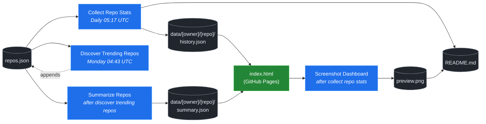

# 🚀 Rising Repos Tracker

> Automatically tracks daily GitHub stats (stars, forks, issues, velocity) for rising open source repos.

[](https://www.telosignal.com/)


**[→ View Live Dashboard](https://patrick-creates.github.io/rising-repos-tracker/)**

Built and maintained by [Telosignal](https://www.telosignal.com/).


<!-- AUTOGEN-STATS-START -->
## 📊 Current snapshot

> Auto-updated daily — last refreshed 2026-07-14

| Metric | Value |
|---|---|
| Repos tracked | **166** |
| Total stars | **7,730,365** |
| Total forks | **1,180,022** |
| Fastest growing | **ponytail** (+1570.7/day) |

### 🔥 Top 5 by velocity

| # | Repo | Stars | Stars/day |
|---|---|---:|---:|
| 1 | [DietrichGebert/ponytail](https://github.com/DietrichGebert/ponytail) | 82,575 | +1570.7 |
| 2 | [NousResearch/hermes-agent](https://github.com/NousResearch/hermes-agent) | 214,446 | +1071.0 |
| 3 | [chopratejas/headroom](https://github.com/chopratejas/headroom) | 59,028 | +1064.3 |
| 4 | [iOfficeAI/OfficeCLI](https://github.com/iOfficeAI/OfficeCLI) | 16,339 | +992.8 |
| 5 | [Panniantong/Agent-Reach](https://github.com/Panniantong/Agent-Reach) | 55,957 | +902.2 |

### 🆕 Recently added

- [sickn33/agentic-awesome-skills](https://github.com/sickn33/agentic-awesome-skills) — added 2026-07-13 — Installable GitHub library of 1,900+ agentic skills for Claude Code, Cursor, Codex CLI, Autohand Code, Gemini CLI, Antigravity, and more. Includes specialized plugins, installer CLI, bundles, workflows, and official/community skill collections.
- [mindsdb/mindshub](https://github.com/mindsdb/mindshub) — added 2026-07-13 — Make AI do actual work. Swap the model anytime — keep everything you've built.
- [re4/LibreCode](https://github.com/re4/LibreCode) — added 2026-07-13 — LibreCode - A Ollama cursor like coding / Reversing Interface
<!-- AUTOGEN-STATS-END -->

<!-- AUTOGEN-DIAGRAM-START -->
## 🔄 How it works


<!-- AUTOGEN-DIAGRAM-END -->

<!-- AUTOGEN-WORKFLOWS-START -->
## ⚙️ Workflows

| File | Schedule | Name |
|---|---|---|
| `collect.yml` | Daily 05:17 UTC | Collect Repo Stats |
| `discover.yml` | Monday 04:43 UTC | Discover Trending Repos |
| `screenshot.yml` | After Collect Repo Stats | Screenshot Dashboard |
| `summarize.yml` | After Discover Trending Repos | Summarize Repos |

> All workflows commit results directly back to the repo. Schedules are best-effort — GitHub Actions cron can drift by a few minutes.
<!-- AUTOGEN-WORKFLOWS-END -->

<!-- AUTOGEN-REPOS-START -->
## 📋 All tracked repos

| Repo | Stars | Forks | Stars/day |
|---|---:|---:|---:|
| [openclaw/openclaw](https://github.com/openclaw/openclaw) | 382,873 | 80,361 | +183.9 |
| [obra/superpowers](https://github.com/obra/superpowers) | 254,149 | 22,708 | +844.2 |
| [affaan-m/everything-claude-code](https://github.com/affaan-m/everything-claude-code) | 229,371 | 35,136 | +779.4 |
| [affaan-m/ECC](https://github.com/affaan-m/ECC) | 229,371 | 35,136 | +742.8 |
| [NousResearch/hermes-agent](https://github.com/NousResearch/hermes-agent) | 214,446 | 39,857 | +1071.0 |
| [Significant-Gravitas/AutoGPT](https://github.com/Significant-Gravitas/AutoGPT) | 185,519 | 46,084 | +20.0 |
| [microsoft/markitdown](https://github.com/microsoft/markitdown) | 165,683 | 11,850 | +688.3 |
| [f/prompts.chat](https://github.com/f/prompts.chat) | 165,670 | 21,438 | +56.4 |
| [langgenius/dify](https://github.com/langgenius/dify) | 148,763 | 23,429 | +121.6 |
| [open-webui/open-webui](https://github.com/open-webui/open-webui) | 145,349 | 21,043 | +136.4 |
| [langchain-ai/langchain](https://github.com/langchain-ai/langchain) | 141,720 | 23,545 | +82.0 |
| [github/spec-kit](https://github.com/github/spec-kit) | 120,845 | 10,748 | +370.7 |
| [farion1231/cc-switch](https://github.com/farion1231/cc-switch) | 116,969 | 7,826 | +753.1 |
| [microsoft/generative-ai-for-beginners](https://github.com/microsoft/generative-ai-for-beginners) | 112,968 | 60,697 | +35.7 |
| [nextlevelbuilder/ui-ux-pro-max-skill](https://github.com/nextlevelbuilder/ui-ux-pro-max-skill) | 105,298 | 11,171 | +442.0 |
| [JuliusBrussee/caveman](https://github.com/JuliusBrussee/caveman) | 89,223 | 5,117 | +486.2 |
| [ChatGPTNextWeb/NextChat](https://github.com/ChatGPTNextWeb/NextChat) | 88,459 | 59,438 | +7.4 |
| [thedotmack/claude-mem](https://github.com/thedotmack/claude-mem) | 87,144 | 7,538 | +189.7 |
| [vllm-project/vllm](https://github.com/vllm-project/vllm) | 86,200 | 19,379 | +101.9 |
| [DietrichGebert/ponytail](https://github.com/DietrichGebert/ponytail) | 82,575 | 4,481 | +1570.7 |
| [OpenHands/OpenHands](https://github.com/OpenHands/OpenHands) | 80,708 | 10,300 | +118.9 |
| [ruvnet/RuView](https://github.com/ruvnet/RuView) | 80,555 | 10,845 | +293.2 |
| [lobehub/lobehub](https://github.com/lobehub/lobehub) | 79,823 | 15,590 | +45.6 |
| [nexu-io/open-design](https://github.com/nexu-io/open-design) | 77,941 | 8,938 | +592.4 |
| [dair-ai/Prompt-Engineering-Guide](https://github.com/dair-ai/Prompt-Engineering-Guide) | 76,453 | 8,379 | +30.7 |
| [openai/openai-cookbook](https://github.com/openai/openai-cookbook) | 74,677 | 12,639 | +18.7 |
| [shareAI-lab/learn-claude-code](https://github.com/shareAI-lab/learn-claude-code) | 70,930 | 11,538 | +172.9 |
| [rtk-ai/rtk](https://github.com/rtk-ai/rtk) | 70,875 | 4,392 | +373.6 |
| [unslothai/unsloth](https://github.com/unslothai/unsloth) | 68,159 | 6,131 | +64.2 |
| [ComposioHQ/awesome-claude-skills](https://github.com/ComposioHQ/awesome-claude-skills) | 67,671 | 7,640 | +127.8 |
| [xtekky/gpt4free](https://github.com/xtekky/gpt4free) | 66,472 | 13,534 | +4.1 |
| [datawhalechina/hello-agents](https://github.com/datawhalechina/hello-agents) | 66,017 | 8,176 | +269.4 |
| [code-yeongyu/oh-my-openagent](https://github.com/code-yeongyu/oh-my-openagent) | 65,727 | 5,363 | +129.8 |
| [Leonxlnx/taste-skill](https://github.com/Leonxlnx/taste-skill) | 63,131 | 4,458 | +760.9 |
| [shanraisshan/claude-code-best-practice](https://github.com/shanraisshan/claude-code-best-practice) | 62,558 | 6,258 | +158.9 |
| [koala73/worldmonitor](https://github.com/koala73/worldmonitor) | 61,832 | 9,629 | +130.9 |
| [Fission-AI/OpenSpec](https://github.com/Fission-AI/OpenSpec) | 60,708 | 4,209 | +209.1 |
| [santifer/career-ops](https://github.com/santifer/career-ops) | 59,962 | 11,892 | +258.2 |
| [tw93/Pake](https://github.com/tw93/Pake) | 59,849 | 12,077 | +194.2 |
| [chopratejas/headroom](https://github.com/chopratejas/headroom) | 59,028 | 4,376 | +1064.3 |
| [headroomlabs-ai/headroom](https://github.com/headroomlabs-ai/headroom) | 59,028 | 4,376 | +596.6 |
| [asgeirtj/system_prompts_leaks](https://github.com/asgeirtj/system_prompts_leaks) | 57,461 | 9,498 | +299.6 |
| [MemPalace/mempalace](https://github.com/MemPalace/mempalace) | 57,308 | 7,391 | +86.1 |
| [ZhuLinsen/daily_stock_analysis](https://github.com/ZhuLinsen/daily_stock_analysis) | 57,115 | 49,122 | +365.5 |
| [Panniantong/Agent-Reach](https://github.com/Panniantong/Agent-Reach) | 55,957 | 4,611 | +902.2 |
| [FlowiseAI/Flowise](https://github.com/FlowiseAI/Flowise) | 54,591 | 24,709 | +29.7 |
| [BerriAI/litellm](https://github.com/BerriAI/litellm) | 53,524 | 9,742 | +107.6 |
| [mvanhorn/last30days-skill](https://github.com/mvanhorn/last30days-skill) | 52,049 | 4,520 | +538.3 |
| [ggml-org/whisper.cpp](https://github.com/ggml-org/whisper.cpp) | 51,777 | 5,905 | +34.2 |
| [hesreallyhim/awesome-claude-code](https://github.com/hesreallyhim/awesome-claude-code) | 49,976 | 4,359 | +103.2 |
| [Aider-AI/aider](https://github.com/Aider-AI/aider) | 47,358 | 4,728 | +42.1 |
| [ChromeDevTools/chrome-devtools-mcp](https://github.com/ChromeDevTools/chrome-devtools-mcp) | 46,884 | 3,218 | +122.8 |
| [zhayujie/CowAgent](https://github.com/zhayujie/CowAgent) | 45,968 | 10,265 | +24.8 |
| [HKUDS/nanobot](https://github.com/HKUDS/nanobot) | 45,487 | 8,022 | +49.2 |
| [elder-plinius/CL4R1T4S](https://github.com/elder-plinius/CL4R1T4S) | 45,379 | 9,242 | +223.7 |
| [sickn33/antigravity-awesome-skills](https://github.com/sickn33/antigravity-awesome-skills) | 43,126 | 6,850 | +89.0 |
| [sickn33/agentic-awesome-skills](https://github.com/sickn33/agentic-awesome-skills) | 43,126 | 6,850 | +84.0 |
| [QuantumNous/new-api](https://github.com/QuantumNous/new-api) | 42,158 | 9,760 | +136.0 |
| [kepano/obsidian-skills](https://github.com/kepano/obsidian-skills) | 41,768 | 2,980 | +183.3 |
| [router-for-me/CLIProxyAPI](https://github.com/router-for-me/CLIProxyAPI) | 41,680 | 6,688 | +138.7 |
| [usestrix/strix](https://github.com/usestrix/strix) | 41,305 | 4,344 | +362.7 |
| [jamiepine/voicebox](https://github.com/jamiepine/voicebox) | 41,101 | 4,971 | +280.9 |
| [chatboxai/chatbox](https://github.com/chatboxai/chatbox) | 40,997 | 4,147 | +17.6 |
| [danny-avila/LibreChat](https://github.com/danny-avila/LibreChat) | 40,694 | 8,348 | +64.5 |
| [Hmbown/CodeWhale](https://github.com/Hmbown/CodeWhale) | 39,758 | 3,424 | +101.8 |
| [mindsdb/mindshub](https://github.com/mindsdb/mindshub) | 39,422 | 6,223 | +21.0 |
| [coreyhaines31/marketingskills](https://github.com/coreyhaines31/marketingskills) | 38,889 | 6,224 | +173.3 |
| [chatanywhere/GPT_API_free](https://github.com/chatanywhere/GPT_API_free) | 38,773 | 2,667 | +12.3 |
| [rohitg00/ai-engineering-from-scratch](https://github.com/rohitg00/ai-engineering-from-scratch) | 38,219 | 6,400 | +275.7 |
| [calesthio/OpenMontage](https://github.com/calesthio/OpenMontage) | 38,179 | 4,611 | +688.5 |
| [wshobson/agents](https://github.com/wshobson/agents) | 37,886 | 4,071 | +39.0 |
| [Yeachan-Heo/oh-my-claudecode](https://github.com/Yeachan-Heo/oh-my-claudecode) | 37,735 | 3,409 | +58.2 |
| [langchain-ai/langgraph](https://github.com/langchain-ai/langgraph) | 37,252 | 6,239 | +83.3 |
| [google/langextract](https://github.com/google/langextract) | 37,146 | 2,562 | +11.8 |
| [github/awesome-copilot](https://github.com/github/awesome-copilot) | 36,546 | 4,569 | +54.8 |
| [AstrBotDevs/AstrBot](https://github.com/AstrBotDevs/AstrBot) | 36,308 | 2,524 | +63.2 |
| [songquanpeng/one-api](https://github.com/songquanpeng/one-api) | 35,700 | 6,737 | +29.8 |
| [PDFMathTranslate/PDFMathTranslate](https://github.com/PDFMathTranslate/PDFMathTranslate) | 35,557 | 3,174 | +30.9 |
| [heygen-com/hyperframes](https://github.com/heygen-com/hyperframes) | 34,848 | 3,269 | +258.0 |
| [zeroclaw-labs/zeroclaw](https://github.com/zeroclaw-labs/zeroclaw) | 32,255 | 4,793 | +13.5 |
| [anthropics/claude-plugins-official](https://github.com/anthropics/claude-plugins-official) | 32,104 | 3,565 | +71.9 |
| [DeusData/codebase-memory-mcp](https://github.com/DeusData/codebase-memory-mcp) | 31,250 | 2,491 | +708.0 |
| [iOfficeAI/AionUi](https://github.com/iOfficeAI/AionUi) | 30,004 | 3,007 | +61.8 |
| [Gitlawb/openclaude](https://github.com/Gitlawb/openclaude) | 29,977 | 8,863 | +42.8 |
| [googleworkspace/cli](https://github.com/googleworkspace/cli) | 29,674 | 1,724 | +68.7 |
| [AlexsJones/llmfit](https://github.com/AlexsJones/llmfit) | 29,409 | 1,789 | +56.0 |
| [voideditor/void](https://github.com/voideditor/void) | 28,834 | 2,586 | +0.7 |
| [JCodesMore/ai-website-cloner-template](https://github.com/JCodesMore/ai-website-cloner-template) | 28,179 | 4,136 | +385.7 |
| [BloopAI/vibe-kanban](https://github.com/BloopAI/vibe-kanban) | 27,373 | 2,906 | +15.4 |
| [esengine/DeepSeek-Reasonix](https://github.com/esengine/DeepSeek-Reasonix) | 26,901 | 1,692 | +204.9 |
| [volcengine/OpenViking](https://github.com/volcengine/OpenViking) | 26,706 | 2,087 | +38.3 |
| [jackwener/OpenCLI](https://github.com/jackwener/OpenCLI) | 26,621 | 2,617 | +78.4 |
| [alibaba/page-agent](https://github.com/alibaba/page-agent) | 26,510 | 2,432 | +274.2 |
| [jarrodwatts/claude-hud](https://github.com/jarrodwatts/claude-hud) | 26,389 | 1,213 | +47.2 |
| [p-e-w/heretic](https://github.com/p-e-w/heretic) | 26,255 | 2,857 | +63.4 |
| [langchain-ai/deepagents](https://github.com/langchain-ai/deepagents) | 26,209 | 3,666 | +57.1 |
| [zai-org/Open-AutoGLM](https://github.com/zai-org/Open-AutoGLM) | 25,768 | 4,008 | +8.5 |
| [mukul975/Anthropic-Cybersecurity-Skills](https://github.com/mukul975/Anthropic-Cybersecurity-Skills) | 25,525 | 3,098 | +336.5 |
| [rohitg00/agentmemory](https://github.com/rohitg00/agentmemory) | 25,106 | 2,079 | +91.1 |
| [toon-format/toon](https://github.com/toon-format/toon) | 24,857 | 1,103 | +10.0 |
| [manaflow-ai/cmux](https://github.com/manaflow-ai/cmux) | 24,429 | 1,973 | +73.0 |
| [agentscope-ai/QwenPaw](https://github.com/agentscope-ai/QwenPaw) | 22,303 | 2,794 | +156.0 |
| [winfunc/opcode](https://github.com/winfunc/opcode) | 22,173 | 1,707 | +4.7 |
| [HKUDS/Vibe-Trading](https://github.com/HKUDS/Vibe-Trading) | 22,173 | 3,825 | +495.7 |
| [decolua/9router](https://github.com/decolua/9router) | 22,107 | 3,737 | +156.4 |
| [MadsLorentzen/ai-job-search](https://github.com/MadsLorentzen/ai-job-search) | 22,056 | 6,767 | +473.0 |
| [coze-dev/coze-studio](https://github.com/coze-dev/coze-studio) | 21,161 | 3,079 | +5.9 |
| [NirDiamant/agents-towards-production](https://github.com/NirDiamant/agents-towards-production) | 20,979 | 2,793 | +9.6 |
| [tirth8205/code-review-graph](https://github.com/tirth8205/code-review-graph) | 19,498 | 2,082 | +33.9 |
| [mksglu/context-mode](https://github.com/mksglu/context-mode) | 18,912 | 1,329 | +49.8 |
| [tanweai/pua](https://github.com/tanweai/pua) | 18,790 | 1,131 | +18.8 |
| [stablyai/orca](https://github.com/stablyai/orca) | 18,617 | 1,464 | +754.3 |
| [Tencent/WeKnora](https://github.com/Tencent/WeKnora) | 18,256 | 2,512 | +67.7 |
| [pranshuparmar/witr](https://github.com/pranshuparmar/witr) | 18,228 | 570 | +13.1 |
| [steipete/CodexBar](https://github.com/steipete/CodexBar) | 18,166 | 1,492 | +134.7 |
| [datawhalechina/easy-vibe](https://github.com/datawhalechina/easy-vibe) | 18,160 | 1,730 | +42.0 |
| [RightNow-AI/openfang](https://github.com/RightNow-AI/openfang) | 18,008 | 2,278 | +6.3 |
| [jundot/omlx](https://github.com/jundot/omlx) | 17,810 | 1,507 | +40.6 |
| [can1357/oh-my-pi](https://github.com/can1357/oh-my-pi) | 17,658 | 1,596 | +166.5 |
| [microsoft/agent-lightning](https://github.com/microsoft/agent-lightning) | 17,385 | 1,521 | +2.6 |
| [jnMetaCode/agency-agents-zh](https://github.com/jnMetaCode/agency-agents-zh) | 17,268 | 2,930 | +84.6 |
| [diegosouzapw/OmniRoute](https://github.com/diegosouzapw/OmniRoute) | 16,998 | 2,577 | +605.8 |
| [danielmiessler/LifeOS](https://github.com/danielmiessler/LifeOS) | 16,685 | 2,273 | +28.1 |
| [iOfficeAI/OfficeCLI](https://github.com/iOfficeAI/OfficeCLI) | 16,339 | 1,101 | +992.8 |
| [ogulcancelik/herdr](https://github.com/ogulcancelik/herdr) | 16,233 | 1,102 | +479.5 |
| [cft0808/edict](https://github.com/cft0808/edict) | 16,200 | 1,703 | +4.8 |
| [nesquena/hermes-webui](https://github.com/nesquena/hermes-webui) | 16,009 | 2,136 | +53.2 |
| [browser-use/browser-harness](https://github.com/browser-use/browser-harness) | 15,951 | 1,488 | +31.5 |
| [MemoriLabs/Memori](https://github.com/MemoriLabs/Memori) | 15,581 | 2,816 | +10.8 |
| [kyegomez/OpenMythos](https://github.com/kyegomez/OpenMythos) | 14,677 | 3,299 | +23.7 |
| [xpzouying/xiaohongshu-mcp](https://github.com/xpzouying/xiaohongshu-mcp) | 14,661 | 2,172 | +17.0 |
| [yusufkaraaslan/Skill_Seekers](https://github.com/yusufkaraaslan/Skill_Seekers) | 14,453 | 1,473 | +10.3 |
| [NevaMind-AI/memU](https://github.com/NevaMind-AI/memU) | 14,022 | 1,041 | +5.5 |
| [wanshuiyin/Auto-claude-code-research-in-sleep](https://github.com/wanshuiyin/Auto-claude-code-research-in-sleep) | 13,377 | 1,208 | +40.2 |
| [xbtlin/ai-berkshire](https://github.com/xbtlin/ai-berkshire) | 13,063 | 1,883 | +285.8 |
| [superset-sh/superset](https://github.com/superset-sh/superset) | 12,403 | 1,076 | +16.2 |
| [XiaomiMiMo/MiMo-Code](https://github.com/XiaomiMiMo/MiMo-Code) | 12,010 | 1,195 | +65.7 |
| [sirmalloc/ccstatusline](https://github.com/sirmalloc/ccstatusline) | 11,712 | 508 | +28.8 |
| [EverMind-AI/EverOS](https://github.com/EverMind-AI/EverOS) | 10,957 | 854 | +82.8 |
| [ValueCell-ai/valuecell](https://github.com/ValueCell-ai/valuecell) | 10,936 | 1,812 | +4.3 |
| [aden-hive/hive](https://github.com/aden-hive/hive) | 10,690 | 5,653 | +5.2 |
| [alibaba/open-code-review](https://github.com/alibaba/open-code-review) | 10,503 | 701 | +64.5 |
| [walkinglabs/learn-harness-engineering](https://github.com/walkinglabs/learn-harness-engineering) | 10,357 | 1,111 | +59.0 |
| [0x4m4/hexstrike-ai](https://github.com/0x4m4/hexstrike-ai) | 10,301 | 2,159 | +19.4 |
| [MemTensor/MemOS](https://github.com/MemTensor/MemOS) | 10,193 | 928 | +11.1 |
| [Kuberwastaken/claurst](https://github.com/Kuberwastaken/claurst) | 10,066 | 7,779 | +13.3 |
| [brokermr810/QuantDinger](https://github.com/brokermr810/QuantDinger) | 9,586 | 2,015 | +37.9 |
| [frankbria/ralph-claude-code](https://github.com/frankbria/ralph-claude-code) | 9,532 | 727 | +6.8 |
| [ConardLi/garden-skills](https://github.com/ConardLi/garden-skills) | 9,489 | 1,263 | +38.5 |
| [ykdojo/claude-code-tips](https://github.com/ykdojo/claude-code-tips) | 9,243 | 729 | +28.3 |
| [EKKOLearnAI/hermes-studio](https://github.com/EKKOLearnAI/hermes-studio) | 9,091 | 1,127 | +28.9 |
| [EvoMap/evolver](https://github.com/EvoMap/evolver) | 8,896 | 815 | +5.1 |
| [TencentCloud/TencentDB-Agent-Memory](https://github.com/TencentCloud/TencentDB-Agent-Memory) | 8,778 | 805 | +60.0 |
| [getagentseal/codeburn](https://github.com/getagentseal/codeburn) | 8,650 | 678 | +22.4 |
| [iflytek/astron-agent](https://github.com/iflytek/astron-agent) | 8,617 | 861 | +0.9 |
| [MiroMindAI/MiroThinker](https://github.com/MiroMindAI/MiroThinker) | 8,335 | 642 | +1.1 |
| [1jehuang/jcode](https://github.com/1jehuang/jcode) | 8,321 | 946 | +16.0 |
| [mmulet/term.everything](https://github.com/mmulet/term.everything) | 8,033 | 192 | +2.0 |
| [ValueCell-ai/ClawX](https://github.com/ValueCell-ai/ClawX) | 7,546 | 1,122 | +5.0 |
| [modem-dev/hunk](https://github.com/modem-dev/hunk) | 6,808 | 192 | +103.0 |
| [StarTrail-org/PixelRAG](https://github.com/StarTrail-org/PixelRAG) | 6,622 | 553 | +37.0 |
| [steipete/summarize](https://github.com/steipete/summarize) | 6,417 | 439 | +7.0 |
| [Arthur-Ficial/apfel](https://github.com/Arthur-Ficial/apfel) | 6,126 | 234 | +11.0 |
| [UfoMiao/zcf](https://github.com/UfoMiao/zcf) | 6,074 | 425 | +4.0 |
| [microsoft/fara](https://github.com/microsoft/fara) | 6,003 | 582 | +4.0 |
| [re4/LibreCode](https://github.com/re4/LibreCode) | 72 | 3 | — |
<!-- AUTOGEN-REPOS-END -->

---

## What it does

- Collects daily snapshots of stars, forks, watchers and open issues for every tracked repo
- Discovers new trending repos automatically every Monday using the GitHub Search API
- Generates AI summaries (use cases, similar tools, tags) for each tracked repo via GitHub Models
- Stores all history as plain JSON — no database, no backend
- Renders a live dashboard via GitHub Pages — updates daily, zero maintenance

## Tracked repos

Data lives in [`data/`](./data) — one folder per repo, one `history.json` per entry.  
The full watch list is in [`repos.json`](./repos.json).

## Fork & use it for yourself

This is my personal tracker — the watch list reflects what I find interesting. If you want to track different repos, the best path is to **fork this repo and run your own**.

### Setup

1. Fork this repo to your account
2. Replace the contents of [`repos.json`](./repos.json) with the repos you want to track (or just leave one entry — `discover.yml` will auto-add more every Monday)
3. Go to **Settings → Pages** and enable GitHub Pages from the `main` branch
4. Go to **Actions** and run **Collect Repo Stats** once manually to seed your first data point
5. Your dashboard will be live at `https://YOUR-USERNAME.github.io/rising-repos-tracker/`

That's it — daily collection and weekly discovery run automatically on schedule. Zero ongoing maintenance.

### Customizing what gets discovered

Edit [`scripts/discover.js`](./scripts/discover.js) to change:

- `MIN_STARS` — minimum star threshold for candidates
- `MAX_AGE_DAYS` — how recent a repo must be
- `MAX_NEW_REPOS` — how many to add per discovery run
- The `queries` array — GitHub Search API queries that define what "trending" means to you

### Adding a repo manually

Just edit `repos.json` directly:

```json
{
  "owner": "OWNER",
  "repo": "REPO",
  "added": "YYYY-MM-DD",
  "notes": "why you're tracking this"
}
```

The next daily collect run picks it up automatically.

## Stack

- **GitHub Actions** — scheduling and automation
- **GitHub Pages** — dashboard hosting
- **GitHub API** — data source
- **GitHub Models** — free AI summaries (gpt-4o-mini)
- **Chart.js** — star growth visualization
- **Mermaid** — architecture diagram (rendered by GitHub)
- No dependencies, no build step, no database

## License

MIT
