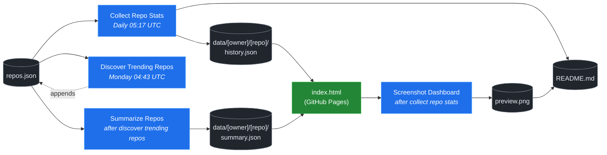

# 🚀 Rising Repos Tracker

> Automatically tracks daily GitHub stats (stars, forks, issues, velocity) for rising open source repos.

[](https://www.telosignal.com/)


**[→ View Live Dashboard](https://patrick-creates.github.io/rising-repos-tracker/)**

Built and maintained by [Telosignal](https://www.telosignal.com/).


<!-- AUTOGEN-STATS-START -->
## 📊 Current snapshot

> Auto-updated daily — last refreshed 2026-07-22

| Metric | Value |
|---|---|
| Repos tracked | **171** |
| Total stars | **7,955,312** |
| Total forks | **1,205,129** |
| Fastest growing | **ai-agent-book** (+4094.5/day) |

### 🔥 Top 5 by velocity

| # | Repo | Stars | Stars/day |
|---|---|---:|---:|
| 1 | [bojieli/ai-agent-book](https://github.com/bojieli/ai-agent-book) | 16,142 | +4094.5 |
| 2 | [DietrichGebert/ponytail](https://github.com/DietrichGebert/ponytail) | 87,502 | +1316.1 |
| 3 | [NousResearch/hermes-agent](https://github.com/NousResearch/hermes-agent) | 218,587 | +1007.7 |
| 4 | [chopratejas/headroom](https://github.com/chopratejas/headroom) | 61,089 | +889.9 |
| 5 | [Panniantong/Agent-Reach](https://github.com/Panniantong/Agent-Reach) | 59,308 | +814.3 |

### 🆕 Recently added

- [KKKKhazix/khazix-skills](https://github.com/KKKKhazix/khazix-skills) — added 2026-07-20 — 数字生命卡兹克开源的 AI Skills 合集 | Agent Skills: neat-freak 洁癖 (docs/memory closeout), hv-analysis, khazix-writer & more — Claude Code, Codex & 40+ agents
- [OpenByteInc/QuantDinger](https://github.com/OpenByteInc/QuantDinger) — added 2026-07-20 — AI quantitative trading platform for crypto, stocks, and forex with backtesting, live trading, market data, and multi-agent research.vibe-trading ,trading-agents,ai-trader,ai-trading
- [bojieli/ai-agent-book](https://github.com/bojieli/ai-agent-book) — added 2026-07-20 — 《深入理解 AI Agent：设计原理与工程实践》（李博杰 著）开源主仓库：全书正文、编译版 PDF 与按章配套代码
<!-- AUTOGEN-STATS-END -->

<!-- AUTOGEN-DIAGRAM-START -->
## 🔄 How it works


<!-- AUTOGEN-DIAGRAM-END -->

<!-- AUTOGEN-WORKFLOWS-START -->
## ⚙️ Workflows

| File | Schedule | Name |
|---|---|---|
| `collect.yml` | Daily 05:17 UTC | Collect Repo Stats |
| `discover.yml` | Monday 04:43 UTC | Discover Trending Repos |
| `screenshot.yml` | After Collect Repo Stats | Screenshot Dashboard |
| `summarize.yml` | After Discover Trending Repos | Summarize Repos |

> All workflows commit results directly back to the repo. Schedules are best-effort — GitHub Actions cron can drift by a few minutes.
<!-- AUTOGEN-WORKFLOWS-END -->

<!-- AUTOGEN-REPOS-START -->
## 📋 All tracked repos

| Repo | Stars | Forks | Stars/day |
|---|---:|---:|---:|
| [openclaw/openclaw](https://github.com/openclaw/openclaw) | 383,774 | 80,636 | +175.8 |
| [obra/superpowers](https://github.com/obra/superpowers) | 259,015 | 23,092 | +781.3 |
| [affaan-m/everything-claude-code](https://github.com/affaan-m/everything-claude-code) | 231,994 | 35,394 | +727.8 |
| [affaan-m/ECC](https://github.com/affaan-m/ECC) | 231,994 | 35,394 | +685.6 |
| [NousResearch/hermes-agent](https://github.com/NousResearch/hermes-agent) | 218,587 | 41,352 | +1007.7 |
| [Significant-Gravitas/AutoGPT](https://github.com/Significant-Gravitas/AutoGPT) | 185,648 | 46,068 | +19.5 |
| [microsoft/markitdown](https://github.com/microsoft/markitdown) | 168,071 | 12,118 | +643.8 |
| [f/prompts.chat](https://github.com/f/prompts.chat) | 166,179 | 21,474 | +57.2 |
| [langgenius/dify](https://github.com/langgenius/dify) | 149,724 | 23,592 | +121.4 |
| [open-webui/open-webui](https://github.com/open-webui/open-webui) | 146,284 | 21,219 | +134.2 |
| [langchain-ai/langchain](https://github.com/langchain-ai/langchain) | 142,305 | 23,675 | +81.0 |
| [github/spec-kit](https://github.com/github/spec-kit) | 123,160 | 10,980 | +361.4 |
| [farion1231/cc-switch](https://github.com/farion1231/cc-switch) | 119,934 | 8,056 | +706.0 |
| [microsoft/generative-ai-for-beginners](https://github.com/microsoft/generative-ai-for-beginners) | 113,352 | 60,840 | +37.1 |
| [nextlevelbuilder/ui-ux-pro-max-skill](https://github.com/nextlevelbuilder/ui-ux-pro-max-skill) | 108,692 | 11,560 | +440.0 |
| [JuliusBrussee/caveman](https://github.com/JuliusBrussee/caveman) | 91,873 | 5,216 | +467.1 |
| [ChatGPTNextWeb/NextChat](https://github.com/ChatGPTNextWeb/NextChat) | 88,531 | 59,383 | +7.6 |
| [thedotmack/claude-mem](https://github.com/thedotmack/claude-mem) | 88,179 | 7,655 | +182.8 |
| [DietrichGebert/ponytail](https://github.com/DietrichGebert/ponytail) | 87,502 | 4,790 | +1316.1 |
| [vllm-project/vllm](https://github.com/vllm-project/vllm) | 86,846 | 19,694 | +99.5 |
| [ruvnet/RuView](https://github.com/ruvnet/RuView) | 82,864 | 11,162 | +292.6 |
| [OpenHands/OpenHands](https://github.com/OpenHands/OpenHands) | 81,650 | 10,437 | +118.7 |
| [lobehub/lobehub](https://github.com/lobehub/lobehub) | 80,656 | 15,664 | +52.3 |
| [nexu-io/open-design](https://github.com/nexu-io/open-design) | 80,532 | 9,290 | +559.4 |
| [dair-ai/Prompt-Engineering-Guide](https://github.com/dair-ai/Prompt-Engineering-Guide) | 76,814 | 8,436 | +32.5 |
| [openai/openai-cookbook](https://github.com/openai/openai-cookbook) | 74,795 | 12,656 | +18.2 |
| [rtk-ai/rtk](https://github.com/rtk-ai/rtk) | 72,474 | 4,511 | +352.2 |
| [shareAI-lab/learn-claude-code](https://github.com/shareAI-lab/learn-claude-code) | 71,883 | 11,660 | +166.2 |
| [unslothai/unsloth](https://github.com/unslothai/unsloth) | 68,700 | 6,175 | +64.6 |
| [ComposioHQ/awesome-claude-skills](https://github.com/ComposioHQ/awesome-claude-skills) | 68,440 | 7,780 | +123.9 |
| [datawhalechina/hello-agents](https://github.com/datawhalechina/hello-agents) | 67,835 | 8,427 | +264.2 |
| [koala73/worldmonitor](https://github.com/koala73/worldmonitor) | 66,658 | 10,321 | +189.1 |
| [xtekky/gpt4free](https://github.com/xtekky/gpt4free) | 66,476 | 13,529 | +3.6 |
| [code-yeongyu/oh-my-openagent](https://github.com/code-yeongyu/oh-my-openagent) | 66,378 | 5,407 | +123.8 |
| [Leonxlnx/taste-skill](https://github.com/Leonxlnx/taste-skill) | 66,157 | 4,569 | +700.9 |
| [shanraisshan/claude-code-best-practice](https://github.com/shanraisshan/claude-code-best-practice) | 63,252 | 6,317 | +150.1 |
| [Fission-AI/OpenSpec](https://github.com/Fission-AI/OpenSpec) | 62,007 | 4,293 | +203.4 |
| [chopratejas/headroom](https://github.com/chopratejas/headroom) | 61,089 | 4,591 | +889.9 |
| [headroomlabs-ai/headroom](https://github.com/headroomlabs-ai/headroom) | 61,089 | 4,591 | +506.2 |
| [santifer/career-ops](https://github.com/santifer/career-ops) | 60,938 | 12,002 | +241.4 |
| [tw93/Pake](https://github.com/tw93/Pake) | 60,101 | 12,171 | +174.2 |
| [asgeirtj/system_prompts_leaks](https://github.com/asgeirtj/system_prompts_leaks) | 59,620 | 9,722 | +295.9 |
| [Panniantong/Agent-Reach](https://github.com/Panniantong/Agent-Reach) | 59,308 | 4,753 | +814.3 |
| [ZhuLinsen/daily_stock_analysis](https://github.com/ZhuLinsen/daily_stock_analysis) | 58,218 | 50,030 | +334.1 |
| [MemPalace/mempalace](https://github.com/MemPalace/mempalace) | 57,585 | 7,420 | +79.8 |
| [FlowiseAI/Flowise](https://github.com/FlowiseAI/Flowise) | 54,824 | 24,745 | +29.6 |
| [BerriAI/litellm](https://github.com/BerriAI/litellm) | 54,321 | 9,960 | +106.7 |
| [mvanhorn/last30days-skill](https://github.com/mvanhorn/last30days-skill) | 53,060 | 4,595 | +463.4 |
| [ggml-org/whisper.cpp](https://github.com/ggml-org/whisper.cpp) | 52,117 | 5,861 | +35.2 |
| [hesreallyhim/awesome-claude-code](https://github.com/hesreallyhim/awesome-claude-code) | 50,606 | 4,403 | +100.2 |
| [Aider-AI/aider](https://github.com/Aider-AI/aider) | 47,605 | 4,749 | +40.7 |
| [ChromeDevTools/chrome-devtools-mcp](https://github.com/ChromeDevTools/chrome-devtools-mcp) | 47,368 | 3,166 | +115.1 |
| [zhayujie/CowAgent](https://github.com/zhayujie/CowAgent) | 46,079 | 10,269 | +23.4 |
| [HKUDS/nanobot](https://github.com/HKUDS/nanobot) | 46,057 | 8,133 | +52.0 |
| [elder-plinius/CL4R1T4S](https://github.com/elder-plinius/CL4R1T4S) | 45,860 | 9,335 | +188.4 |
| [jamiepine/voicebox](https://github.com/jamiepine/voicebox) | 45,296 | 5,535 | +319.1 |
| [router-for-me/CLIProxyAPI](https://github.com/router-for-me/CLIProxyAPI) | 44,178 | 6,934 | +162.7 |
| [sickn33/antigravity-awesome-skills](https://github.com/sickn33/antigravity-awesome-skills) | 43,695 | 6,462 | +86.5 |
| [sickn33/agentic-awesome-skills](https://github.com/sickn33/agentic-awesome-skills) | 43,695 | 6,462 | +72.6 |
| [usestrix/strix](https://github.com/usestrix/strix) | 43,267 | 4,468 | +344.3 |
| [QuantumNous/new-api](https://github.com/QuantumNous/new-api) | 43,017 | 10,042 | +132.1 |
| [kepano/obsidian-skills](https://github.com/kepano/obsidian-skills) | 42,944 | 3,063 | +177.6 |
| [rohitg00/ai-engineering-from-scratch](https://github.com/rohitg00/ai-engineering-from-scratch) | 41,672 | 6,941 | +300.2 |
| [coreyhaines31/marketingskills](https://github.com/coreyhaines31/marketingskills) | 41,116 | 6,492 | +189.8 |
| [danny-avila/LibreChat](https://github.com/danny-avila/LibreChat) | 41,104 | 8,444 | +62.7 |
| [chatboxai/chatbox](https://github.com/chatboxai/chatbox) | 41,094 | 4,155 | +16.9 |
| [calesthio/OpenMontage](https://github.com/calesthio/OpenMontage) | 40,987 | 4,843 | +571.1 |
| [Hmbown/CodeWhale](https://github.com/Hmbown/CodeWhale) | 40,012 | 3,446 | +92.1 |
| [mindsdb/mindshub](https://github.com/mindsdb/mindshub) | 39,467 | 6,227 | +7.3 |
| [chatanywhere/GPT_API_free](https://github.com/chatanywhere/GPT_API_free) | 38,858 | 2,669 | +12.1 |
| [wshobson/agents](https://github.com/wshobson/agents) | 38,128 | 4,089 | +37.8 |
| [Yeachan-Heo/oh-my-claudecode](https://github.com/Yeachan-Heo/oh-my-claudecode) | 37,965 | 3,425 | +54.2 |
| [langchain-ai/langgraph](https://github.com/langchain-ai/langgraph) | 37,828 | 6,345 | +80.3 |
| [google/langextract](https://github.com/google/langextract) | 37,651 | 2,603 | +18.9 |
| [AstrBotDevs/AstrBot](https://github.com/AstrBotDevs/AstrBot) | 37,616 | 2,626 | +79.0 |
| [github/awesome-copilot](https://github.com/github/awesome-copilot) | 36,893 | 4,616 | +53.2 |
| [heygen-com/hyperframes](https://github.com/heygen-com/hyperframes) | 36,741 | 3,460 | +254.1 |
| [songquanpeng/one-api](https://github.com/songquanpeng/one-api) | 35,872 | 6,752 | +28.7 |
| [PDFMathTranslate/PDFMathTranslate](https://github.com/PDFMathTranslate/PDFMathTranslate) | 35,708 | 3,178 | +29.2 |
| [DeusData/codebase-memory-mcp](https://github.com/DeusData/codebase-memory-mcp) | 33,851 | 2,595 | +574.8 |
| [anthropics/claude-plugins-official](https://github.com/anthropics/claude-plugins-official) | 32,455 | 3,637 | +67.5 |
| [zeroclaw-labs/zeroclaw](https://github.com/zeroclaw-labs/zeroclaw) | 32,354 | 4,828 | +13.3 |
| [iOfficeAI/AionUi](https://github.com/iOfficeAI/AionUi) | 30,628 | 3,067 | +64.3 |
| [AlexsJones/llmfit](https://github.com/AlexsJones/llmfit) | 30,337 | 1,845 | +65.4 |
| [Gitlawb/openclaude](https://github.com/Gitlawb/openclaude) | 30,240 | 8,881 | +41.3 |
| [googleworkspace/cli](https://github.com/googleworkspace/cli) | 29,891 | 1,745 | +62.2 |
| [JCodesMore/ai-website-cloner-template](https://github.com/JCodesMore/ai-website-cloner-template) | 29,557 | 4,229 | +339.6 |
| [voideditor/void](https://github.com/voideditor/void) | 28,874 | 2,601 | +1.4 |
| [esengine/DeepSeek-Reasonix](https://github.com/esengine/DeepSeek-Reasonix) | 27,533 | 1,761 | +182.0 |
| [BloopAI/vibe-kanban](https://github.com/BloopAI/vibe-kanban) | 27,476 | 2,910 | +15.0 |
| [alibaba/page-agent](https://github.com/alibaba/page-agent) | 27,444 | 2,407 | +240.2 |
| [volcengine/OpenViking](https://github.com/volcengine/OpenViking) | 27,069 | 2,130 | +39.6 |
| [jackwener/OpenCLI](https://github.com/jackwener/OpenCLI) | 27,052 | 2,666 | +73.9 |
| [jarrodwatts/claude-hud](https://github.com/jarrodwatts/claude-hud) | 26,693 | 1,238 | +45.5 |
| [langchain-ai/deepagents](https://github.com/langchain-ai/deepagents) | 26,649 | 3,735 | +56.7 |
| [p-e-w/heretic](https://github.com/p-e-w/heretic) | 26,609 | 2,906 | +59.9 |
| [mukul975/Anthropic-Cybersecurity-Skills](https://github.com/mukul975/Anthropic-Cybersecurity-Skills) | 26,327 | 3,171 | +273.5 |
| [HKUDS/Vibe-Trading](https://github.com/HKUDS/Vibe-Trading) | 26,238 | 4,298 | +500.0 |
| [zai-org/Open-AutoGLM](https://github.com/zai-org/Open-AutoGLM) | 25,840 | 4,011 | +8.6 |
| [rohitg00/agentmemory](https://github.com/rohitg00/agentmemory) | 25,531 | 2,119 | +84.2 |
| [stablyai/orca](https://github.com/stablyai/orca) | 25,375 | 1,832 | +799.5 |
| [MadsLorentzen/ai-job-search](https://github.com/MadsLorentzen/ai-job-search) | 25,036 | 8,150 | +383.7 |
| [toon-format/toon](https://github.com/toon-format/toon) | 24,949 | 1,108 | +10.3 |
| [manaflow-ai/cmux](https://github.com/manaflow-ai/cmux) | 24,925 | 2,048 | +63.2 |
| [tirth8205/code-review-graph](https://github.com/tirth8205/code-review-graph) | 24,882 | 2,366 | +172.1 |
| [diegosouzapw/OmniRoute](https://github.com/diegosouzapw/OmniRoute) | 24,053 | 3,220 | +743.8 |
| [agentscope-ai/QwenPaw](https://github.com/agentscope-ai/QwenPaw) | 23,841 | 2,837 | +163.9 |
| [decolua/9router](https://github.com/decolua/9router) | 23,006 | 3,841 | +146.9 |
| [winfunc/opcode](https://github.com/winfunc/opcode) | 22,198 | 1,710 | +4.4 |
| [coze-dev/coze-studio](https://github.com/coze-dev/coze-studio) | 21,211 | 3,086 | +6.0 |
| [NirDiamant/agents-towards-production](https://github.com/NirDiamant/agents-towards-production) | 21,150 | 2,817 | +11.7 |
| [iOfficeAI/OfficeCLI](https://github.com/iOfficeAI/OfficeCLI) | 20,788 | 1,396 | +774.4 |
| [ogulcancelik/herdr](https://github.com/ogulcancelik/herdr) | 19,262 | 1,262 | +429.1 |
| [mksglu/context-mode](https://github.com/mksglu/context-mode) | 19,172 | 1,349 | +46.1 |
| [can1357/oh-my-pi](https://github.com/can1357/oh-my-pi) | 19,071 | 1,769 | +169.2 |
| [tanweai/pua](https://github.com/tanweai/pua) | 18,982 | 1,147 | +19.9 |
| [steipete/CodexBar](https://github.com/steipete/CodexBar) | 18,830 | 1,561 | +120.9 |
| [Tencent/WeKnora](https://github.com/Tencent/WeKnora) | 18,711 | 2,607 | +65.4 |
| [datawhalechina/easy-vibe](https://github.com/datawhalechina/easy-vibe) | 18,421 | 1,754 | +40.0 |
| [pranshuparmar/witr](https://github.com/pranshuparmar/witr) | 18,270 | 571 | +10.3 |
| [jnMetaCode/agency-agents-zh](https://github.com/jnMetaCode/agency-agents-zh) | 18,098 | 3,026 | +89.7 |
| [RightNow-AI/openfang](https://github.com/RightNow-AI/openfang) | 18,040 | 2,279 | +5.8 |
| [jundot/omlx](https://github.com/jundot/omlx) | 18,032 | 1,539 | +37.8 |
| [KKKKhazix/khazix-skills](https://github.com/KKKKhazix/khazix-skills) | 17,703 | 2,001 | +122.5 |
| [microsoft/agent-lightning](https://github.com/microsoft/agent-lightning) | 17,407 | 1,526 | +2.6 |
| [danielmiessler/LifeOS](https://github.com/danielmiessler/LifeOS) | 16,854 | 2,287 | +26.3 |
| [nesquena/hermes-webui](https://github.com/nesquena/hermes-webui) | 16,385 | 2,192 | +51.6 |
| [cft0808/edict](https://github.com/cft0808/edict) | 16,258 | 1,704 | +5.3 |
| [browser-use/browser-harness](https://github.com/browser-use/browser-harness) | 16,161 | 1,523 | +29.7 |
| [bojieli/ai-agent-book](https://github.com/bojieli/ai-agent-book) | 16,142 | 1,532 | +4094.5 |
| [MemoriLabs/Memori](https://github.com/MemoriLabs/Memori) | 15,641 | 2,869 | +9.9 |
| [xpzouying/xiaohongshu-mcp](https://github.com/xpzouying/xiaohongshu-mcp) | 14,801 | 2,184 | +17.1 |
| [kyegomez/OpenMythos](https://github.com/kyegomez/OpenMythos) | 14,737 | 3,301 | +19.4 |
| [yusufkaraaslan/Skill_Seekers](https://github.com/yusufkaraaslan/Skill_Seekers) | 14,523 | 1,474 | +9.9 |
| [NevaMind-AI/memU](https://github.com/NevaMind-AI/memU) | 14,051 | 1,042 | +5.0 |
| [wanshuiyin/Auto-claude-code-research-in-sleep](https://github.com/wanshuiyin/Auto-claude-code-research-in-sleep) | 13,686 | 1,224 | +39.7 |
| [xbtlin/ai-berkshire](https://github.com/xbtlin/ai-berkshire) | 13,645 | 1,909 | +179.3 |
| [superset-sh/superset](https://github.com/superset-sh/superset) | 12,543 | 1,108 | +16.7 |
| [XiaomiMiMo/MiMo-Code](https://github.com/XiaomiMiMo/MiMo-Code) | 12,316 | 1,250 | +56.2 |
| [sirmalloc/ccstatusline](https://github.com/sirmalloc/ccstatusline) | 11,902 | 522 | +27.0 |
| [EverMind-AI/EverOS](https://github.com/EverMind-AI/EverOS) | 11,417 | 864 | +74.0 |
| [ValueCell-ai/valuecell](https://github.com/ValueCell-ai/valuecell) | 10,943 | 1,813 | +3.1 |
| [alibaba/open-code-review](https://github.com/alibaba/open-code-review) | 10,890 | 750 | +56.4 |
| [aden-hive/hive](https://github.com/aden-hive/hive) | 10,753 | 5,669 | +6.1 |
| [walkinglabs/learn-harness-engineering](https://github.com/walkinglabs/learn-harness-engineering) | 10,599 | 1,152 | +44.6 |
| [1jehuang/jcode](https://github.com/1jehuang/jcode) | 10,507 | 1,149 | +244.7 |
| [0x4m4/hexstrike-ai](https://github.com/0x4m4/hexstrike-ai) | 10,428 | 2,171 | +18.2 |
| [MemTensor/MemOS](https://github.com/MemTensor/MemOS) | 10,321 | 943 | +12.8 |
| [Kuberwastaken/claurst](https://github.com/Kuberwastaken/claurst) | 10,117 | 7,783 | +10.9 |
| [brokermr810/QuantDinger](https://github.com/brokermr810/QuantDinger) | 9,888 | 2,079 | +37.8 |
| [OpenByteInc/QuantDinger](https://github.com/OpenByteInc/QuantDinger) | 9,888 | 2,079 | +43.0 |
| [ConardLi/garden-skills](https://github.com/ConardLi/garden-skills) | 9,710 | 1,283 | +33.1 |
| [frankbria/ralph-claude-code](https://github.com/frankbria/ralph-claude-code) | 9,558 | 730 | +6.4 |
| [iflytek/astron-agent](https://github.com/iflytek/astron-agent) | 9,490 | 871 | +55.0 |
| [EKKOLearnAI/hermes-studio](https://github.com/EKKOLearnAI/hermes-studio) | 9,393 | 1,150 | +33.3 |
| [ykdojo/claude-code-tips](https://github.com/ykdojo/claude-code-tips) | 9,391 | 746 | +23.4 |
| [TencentCloud/TencentDB-Agent-Memory](https://github.com/TencentCloud/TencentDB-Agent-Memory) | 9,210 | 856 | +54.7 |
| [EvoMap/evolver](https://github.com/EvoMap/evolver) | 8,866 | 823 | +0.7 |
| [getagentseal/codeburn](https://github.com/getagentseal/codeburn) | 8,828 | 691 | +22.3 |
| [MiroMindAI/MiroThinker](https://github.com/MiroMindAI/MiroThinker) | 8,345 | 642 | +1.2 |
| [mmulet/term.everything](https://github.com/mmulet/term.everything) | 8,047 | 192 | +1.8 |
| [modem-dev/hunk](https://github.com/modem-dev/hunk) | 7,571 | 212 | +96.2 |
| [ValueCell-ai/ClawX](https://github.com/ValueCell-ai/ClawX) | 7,551 | 1,128 | +1.1 |
| [StarTrail-org/PixelRAG](https://github.com/StarTrail-org/PixelRAG) | 7,042 | 586 | +50.8 |
| [steipete/summarize](https://github.com/steipete/summarize) | 6,468 | 438 | +6.4 |
| [opensquilla/opensquilla](https://github.com/opensquilla/opensquilla) | 6,234 | 467 | +12.5 |
| [Arthur-Ficial/apfel](https://github.com/Arthur-Ficial/apfel) | 6,180 | 234 | +7.2 |
| [UfoMiao/zcf](https://github.com/UfoMiao/zcf) | 6,077 | 424 | +0.8 |
| [microsoft/fara](https://github.com/microsoft/fara) | 6,017 | 586 | +2.0 |
| [Andyyyy64/whichllm](https://github.com/Andyyyy64/whichllm) | 5,936 | 316 | +34.5 |
| [re4/LibreCode](https://github.com/re4/LibreCode) | 77 | 4 | — |
<!-- AUTOGEN-REPOS-END -->

---

## What it does

- Collects daily snapshots of stars, forks, watchers and open issues for every tracked repo
- Discovers new trending repos automatically every Monday using the GitHub Search API
- Generates AI summaries (use cases, similar tools, tags) for each tracked repo via GitHub Models
- Stores all history as plain JSON — no database, no backend
- Renders a live dashboard via GitHub Pages — updates daily, zero maintenance

## Tracked repos

Data lives in [`data/`](./data) — one folder per repo, one `history.json` per entry.  
The full watch list is in [`repos.json`](./repos.json).

## Fork & use it for yourself

This is my personal tracker — the watch list reflects what I find interesting. If you want to track different repos, the best path is to **fork this repo and run your own**.

### Setup

1. Fork this repo to your account
2. Replace the contents of [`repos.json`](./repos.json) with the repos you want to track (or just leave one entry — `discover.yml` will auto-add more every Monday)
3. Go to **Settings → Pages** and enable GitHub Pages from the `main` branch
4. Go to **Actions** and run **Collect Repo Stats** once manually to seed your first data point
5. Your dashboard will be live at `https://YOUR-USERNAME.github.io/rising-repos-tracker/`

That's it — daily collection and weekly discovery run automatically on schedule. Zero ongoing maintenance.

### Customizing what gets discovered

Edit [`scripts/discover.js`](./scripts/discover.js) to change:

- `MIN_STARS` — minimum star threshold for candidates
- `MAX_AGE_DAYS` — how recent a repo must be
- `MAX_NEW_REPOS` — how many to add per discovery run
- The `queries` array — GitHub Search API queries that define what "trending" means to you

### Adding a repo manually

Just edit `repos.json` directly:

```json
{
  "owner": "OWNER",
  "repo": "REPO",
  "added": "YYYY-MM-DD",
  "notes": "why you're tracking this"
}
```

The next daily collect run picks it up automatically.

## Stack

- **GitHub Actions** — scheduling and automation
- **GitHub Pages** — dashboard hosting
- **GitHub API** — data source
- **GitHub Models** — free AI summaries (gpt-4o-mini)
- **Chart.js** — star growth visualization
- **Mermaid** — architecture diagram (rendered by GitHub)
- No dependencies, no build step, no database

## License

MIT
