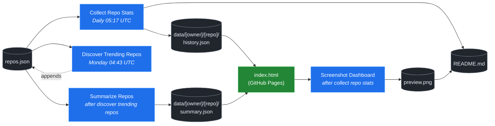

# 🚀 Rising Repos Tracker

> Automatically tracks daily GitHub stats (stars, forks, issues, velocity) for rising open source repos.

[](https://www.telosignal.com/)


**[→ View Live Dashboard](https://patrick-creates.github.io/rising-repos-tracker/)**

Built and maintained by [Telosignal](https://www.telosignal.com/).


<!-- AUTOGEN-STATS-START -->
## 📊 Current snapshot

> Auto-updated daily — last refreshed 2026-05-26

| Metric | Value |
|---|---|
| Repos tracked | **61** |
| Total stars | **4,596,723** |
| Total forks | **805,528** |
| Fastest growing | **hermes-agent** (+1522.8/day) |

### 🔥 Top 5 by velocity

| # | Repo | Stars | Stars/day |
|---|---|---:|---:|
| 1 | [NousResearch/hermes-agent](https://github.com/NousResearch/hermes-agent) | 167,842 | +1522.8 |
| 2 | [nexu-io/open-design](https://github.com/nexu-io/open-design) | 52,458 | +1035.5 |
| 3 | [affaan-m/everything-claude-code](https://github.com/affaan-m/everything-claude-code) | 193,148 | +930.8 |
| 4 | [affaan-m/ECC](https://github.com/affaan-m/ECC) | 193,148 | +919.0 |
| 5 | [farion1231/cc-switch](https://github.com/farion1231/cc-switch) | 81,250 | +900.8 |

### 🆕 Recently added

- [affaan-m/ECC](https://github.com/affaan-m/ECC) — added 2026-05-25 — The agent harness performance optimization system. Skills, instincts, memory, security, and research-first development for Claude Code, Codex, Opencode, Cursor and beyond.
- [ruvnet/RuView](https://github.com/ruvnet/RuView) — added 2026-05-25 — π RuView turns commodity WiFi signals into real-time spatial intelligence, vital sign monitoring, and presence detection — all without a single pixel of video.
- [ZhuLinsen/daily_stock_analysis](https://github.com/ZhuLinsen/daily_stock_analysis) — added 2026-05-25 — LLM驱动的 A/H/美股智能分析：多数据源行情 + 实时新闻 + LLM决策仪表盘 + 多渠道推送，零成本定时运行，纯白嫖. LLM-powered stock analysis system for A/H/US markets.
<!-- AUTOGEN-STATS-END -->

<!-- AUTOGEN-DIAGRAM-START -->
## 🔄 How it works


<!-- AUTOGEN-DIAGRAM-END -->

<!-- AUTOGEN-WORKFLOWS-START -->
## ⚙️ Workflows

| File | Schedule | Name |
|---|---|---|
| `collect.yml` | Daily 05:17 UTC | Collect Repo Stats |
| `discover.yml` | Monday 04:43 UTC | Discover Trending Repos |
| `screenshot.yml` | After Collect Repo Stats | Screenshot Dashboard |
| `summarize.yml` | After Discover Trending Repos | Summarize Repos |

> All workflows commit results directly back to the repo. Schedules are best-effort — GitHub Actions cron can drift by a few minutes.
<!-- AUTOGEN-WORKFLOWS-END -->

<!-- AUTOGEN-REPOS-START -->
## 📋 All tracked repos

| Repo | Stars | Forks | Stars/day |
|---|---:|---:|---:|
| [openclaw/openclaw](https://github.com/openclaw/openclaw) | 374,727 | 78,038 | +250.5 |
| [affaan-m/everything-claude-code](https://github.com/affaan-m/everything-claude-code) | 193,148 | 29,854 | +930.8 |
| [affaan-m/ECC](https://github.com/affaan-m/ECC) | 193,148 | 29,854 | +919.0 |
| [Significant-Gravitas/AutoGPT](https://github.com/Significant-Gravitas/AutoGPT) | 184,557 | 46,220 | +21.2 |
| [NousResearch/hermes-agent](https://github.com/NousResearch/hermes-agent) | 167,842 | 27,777 | +1522.8 |
| [f/prompts.chat](https://github.com/f/prompts.chat) | 162,835 | 21,174 | +51.0 |
| [langgenius/dify](https://github.com/langgenius/dify) | 142,673 | 22,444 | +111.4 |
| [open-webui/open-webui](https://github.com/open-webui/open-webui) | 138,682 | 19,843 | +137.7 |
| [langchain-ai/langchain](https://github.com/langchain-ai/langchain) | 137,678 | 22,796 | +80.2 |
| [microsoft/markitdown](https://github.com/microsoft/markitdown) | 125,215 | 8,521 | +169.8 |
| [microsoft/generative-ai-for-beginners](https://github.com/microsoft/generative-ai-for-beginners) | 111,383 | 59,755 | +48.5 |
| [github/spec-kit](https://github.com/github/spec-kit) | 105,971 | 9,379 | +623.8 |
| [ChatGPTNextWeb/NextChat](https://github.com/ChatGPTNextWeb/NextChat) | 88,083 | 59,682 | +5.8 |
| [nextlevelbuilder/ui-ux-pro-max-skill](https://github.com/nextlevelbuilder/ui-ux-pro-max-skill) | 82,849 | 8,527 | +381.2 |
| [farion1231/cc-switch](https://github.com/farion1231/cc-switch) | 81,250 | 5,304 | +900.8 |
| [vllm-project/vllm](https://github.com/vllm-project/vllm) | 81,036 | 17,239 | +88.6 |
| [thedotmack/claude-mem](https://github.com/thedotmack/claude-mem) | 78,237 | 6,746 | +219.8 |
| [lobehub/lobehub](https://github.com/lobehub/lobehub) | 77,717 | 15,290 | +55.3 |
| [dair-ai/Prompt-Engineering-Guide](https://github.com/dair-ai/Prompt-Engineering-Guide) | 74,974 | 8,117 | +34.1 |
| [OpenHands/OpenHands](https://github.com/OpenHands/OpenHands) | 74,901 | 9,490 | +121.1 |
| [openai/openai-cookbook](https://github.com/openai/openai-cookbook) | 73,788 | 12,479 | +22.4 |
| [xtekky/gpt4free](https://github.com/xtekky/gpt4free) | 66,264 | 13,588 | +2.9 |
| [ruvnet/RuView](https://github.com/ruvnet/RuView) | 66,034 | 8,738 | +141.0 |
| [unslothai/unsloth](https://github.com/unslothai/unsloth) | 65,139 | 5,781 | +79.9 |
| [JuliusBrussee/caveman](https://github.com/JuliusBrussee/caveman) | 64,851 | 3,665 | +417.4 |
| [shareAI-lab/learn-claude-code](https://github.com/shareAI-lab/learn-claude-code) | 62,697 | 10,246 | +202.5 |
| [ComposioHQ/awesome-claude-skills](https://github.com/ComposioHQ/awesome-claude-skills) | 61,850 | 6,765 | +182.8 |
| [code-yeongyu/oh-my-openagent](https://github.com/code-yeongyu/oh-my-openagent) | 59,546 | 4,847 | +152.3 |
| [shanraisshan/claude-code-best-practice](https://github.com/shanraisshan/claude-code-best-practice) | 54,931 | 5,510 | +179.1 |
| [koala73/worldmonitor](https://github.com/koala73/worldmonitor) | 54,927 | 8,835 | +69.9 |
| [rtk-ai/rtk](https://github.com/rtk-ai/rtk) | 54,295 | 3,337 | +589.6 |
| [datawhalechina/hello-agents](https://github.com/datawhalechina/hello-agents) | 53,558 | 6,525 | +362.3 |
| [FlowiseAI/Flowise](https://github.com/FlowiseAI/Flowise) | 53,080 | 24,395 | +22.5 |
| [MemPalace/mempalace](https://github.com/MemPalace/mempalace) | 52,850 | 6,965 | +56.3 |
| [nexu-io/open-design](https://github.com/nexu-io/open-design) | 52,458 | 5,969 | +1035.5 |
| [Fission-AI/OpenSpec](https://github.com/Fission-AI/OpenSpec) | 50,827 | 3,567 | +254.9 |
| [ggml-org/whisper.cpp](https://github.com/ggml-org/whisper.cpp) | 50,123 | 5,567 | +37.1 |
| [tw93/Pake](https://github.com/tw93/Pake) | 49,058 | 9,924 | +34.9 |
| [BerriAI/litellm](https://github.com/BerriAI/litellm) | 48,268 | 8,344 | +110.0 |
| [santifer/career-ops](https://github.com/santifer/career-ops) | 47,261 | 9,852 | +251.9 |
| [Aider-AI/aider](https://github.com/Aider-AI/aider) | 45,338 | 4,483 | +47.1 |
| [zhayujie/CowAgent](https://github.com/zhayujie/CowAgent) | 44,842 | 10,141 | +35.9 |
| [hesreallyhim/awesome-claude-code](https://github.com/hesreallyhim/awesome-claude-code) | 44,831 | 3,865 | +92.0 |
| [HKUDS/nanobot](https://github.com/HKUDS/nanobot) | 43,171 | 7,605 | +61.4 |
| [ChromeDevTools/chrome-devtools-mcp](https://github.com/ChromeDevTools/chrome-devtools-mcp) | 41,792 | 2,657 | +238.5 |
| [asgeirtj/system_prompts_leaks](https://github.com/asgeirtj/system_prompts_leaks) | 40,779 | 6,769 | +49.3 |
| [chatboxai/chatbox](https://github.com/chatboxai/chatbox) | 40,122 | 4,071 | +15.8 |
| [ZhuLinsen/daily_stock_analysis](https://github.com/ZhuLinsen/daily_stock_analysis) | 38,906 | 37,578 | +67.0 |
| [sickn33/antigravity-awesome-skills](https://github.com/sickn33/antigravity-awesome-skills) | 38,728 | 6,301 | +50.0 |
| [chatanywhere/GPT_API_free](https://github.com/chatanywhere/GPT_API_free) | 38,162 | 2,649 | +6.0 |
| [danny-avila/LibreChat](https://github.com/danny-avila/LibreChat) | 37,489 | 7,713 | +20.0 |
| [google/langextract](https://github.com/google/langextract) | 36,560 | 2,519 | +5.0 |
| [wshobson/agents](https://github.com/wshobson/agents) | 35,957 | 3,909 | +21.0 |
| [QuantumNous/new-api](https://github.com/QuantumNous/new-api) | 35,472 | 7,939 | +115.0 |
| [Hmbown/CodeWhale](https://github.com/Hmbown/CodeWhale) | 34,871 | 2,979 | +201.0 |
| [Yeachan-Heo/oh-my-claudecode](https://github.com/Yeachan-Heo/oh-my-claudecode) | 34,866 | 3,187 | +42.0 |
| [router-for-me/CLIProxyAPI](https://github.com/router-for-me/CLIProxyAPI) | 34,824 | 5,786 | +80.0 |
| [songquanpeng/one-api](https://github.com/songquanpeng/one-api) | 34,236 | 6,530 | +26.0 |
| [PDFMathTranslate/PDFMathTranslate](https://github.com/PDFMathTranslate/PDFMathTranslate) | 34,031 | 3,054 | +17.0 |
| [github/awesome-copilot](https://github.com/github/awesome-copilot) | 33,837 | 4,142 | +31.0 |
| [frankbria/ralph-claude-code](https://github.com/frankbria/ralph-claude-code) | 9,198 | 702 | +6.6 |
<!-- AUTOGEN-REPOS-END -->

---

## What it does

- Collects daily snapshots of stars, forks, watchers and open issues for every tracked repo
- Discovers new trending repos automatically every Monday using the GitHub Search API
- Generates AI summaries (use cases, similar tools, tags) for each tracked repo via GitHub Models
- Stores all history as plain JSON — no database, no backend
- Renders a live dashboard via GitHub Pages — updates daily, zero maintenance

## Tracked repos

Data lives in [`data/`](./data) — one folder per repo, one `history.json` per entry.  
The full watch list is in [`repos.json`](./repos.json).

## Fork & use it for yourself

This is my personal tracker — the watch list reflects what I find interesting. If you want to track different repos, the best path is to **fork this repo and run your own**.

### Setup

1. Fork this repo to your account
2. Replace the contents of [`repos.json`](./repos.json) with the repos you want to track (or just leave one entry — `discover.yml` will auto-add more every Monday)
3. Go to **Settings → Pages** and enable GitHub Pages from the `main` branch
4. Go to **Actions** and run **Collect Repo Stats** once manually to seed your first data point
5. Your dashboard will be live at `https://YOUR-USERNAME.github.io/rising-repos-tracker/`

That's it — daily collection and weekly discovery run automatically on schedule. Zero ongoing maintenance.

### Customizing what gets discovered

Edit [`scripts/discover.js`](./scripts/discover.js) to change:

- `MIN_STARS` — minimum star threshold for candidates
- `MAX_AGE_DAYS` — how recent a repo must be
- `MAX_NEW_REPOS` — how many to add per discovery run
- The `queries` array — GitHub Search API queries that define what "trending" means to you

### Adding a repo manually

Just edit `repos.json` directly:

```json
{
  "owner": "OWNER",
  "repo": "REPO",
  "added": "YYYY-MM-DD",
  "notes": "why you're tracking this"
}
```

The next daily collect run picks it up automatically.

## Stack

- **GitHub Actions** — scheduling and automation
- **GitHub Pages** — dashboard hosting
- **GitHub API** — data source
- **GitHub Models** — free AI summaries (gpt-4o-mini)
- **Chart.js** — star growth visualization
- **Mermaid** — architecture diagram (rendered by GitHub)
- No dependencies, no build step, no database

## License

MIT
