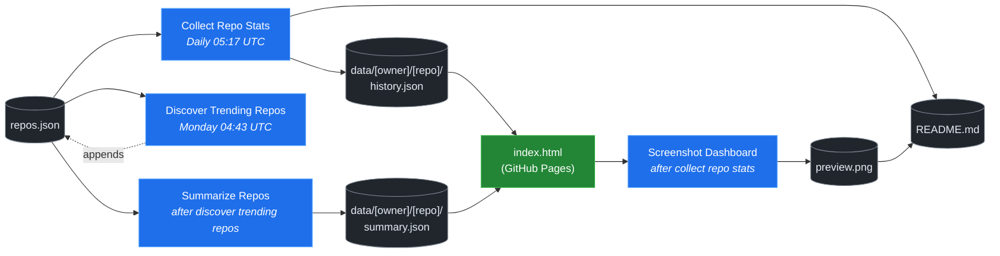

# 🚀 Rising Repos Tracker

> Automatically tracks daily GitHub stats (stars, forks, issues, velocity) for rising open source repos.

[](https://www.telosignal.com/)


**[→ View Live Dashboard](https://patrick-creates.github.io/rising-repos-tracker/)**

Built and maintained by [Telosignal](https://www.telosignal.com/).


<!-- AUTOGEN-STATS-START -->
## 📊 Current snapshot

> Auto-updated daily — last refreshed 2026-07-05

| Metric | Value |
|---|---|
| Repos tracked | **136** |
| Total stars | **7,179,270** |
| Total forks | **1,108,619** |
| Fastest growing | **ponytail** (+2011.3/day) |

### 🔥 Top 5 by velocity

| # | Repo | Stars | Stars/day |
|---|---|---:|---:|
| 1 | [DietrichGebert/ponytail](https://github.com/DietrichGebert/ponytail) | 74,166 | +2011.3 |
| 2 | [chopratejas/headroom](https://github.com/chopratejas/headroom) | 56,625 | +1423.1 |
| 3 | [NousResearch/hermes-agent](https://github.com/NousResearch/hermes-agent) | 209,358 | +1156.8 |
| 4 | [Panniantong/Agent-Reach](https://github.com/Panniantong/Agent-Reach) | 50,851 | +1013.9 |
| 5 | [DeusData/codebase-memory-mcp](https://github.com/DeusData/codebase-memory-mcp) | 26,347 | +952.8 |

### 🆕 Recently added

- [calesthio/OpenMontage](https://github.com/calesthio/OpenMontage) — added 2026-06-29 — World's first open-source, agentic video production system. 12 pipelines, 52 tools, 500+ agent skills. Turn your AI coding assistant into a full video production studio.
- [DeusData/codebase-memory-mcp](https://github.com/DeusData/codebase-memory-mcp) — added 2026-06-29 — High-performance code intelligence MCP server. Indexes codebases into a persistent knowledge graph — average repo in milliseconds. 158 languages, sub-ms queries, 99% fewer tokens. Single static binary, zero dependencies.
- [pranshuparmar/witr](https://github.com/pranshuparmar/witr) — added 2026-06-29 — Why is this running?
<!-- AUTOGEN-STATS-END -->

<!-- AUTOGEN-DIAGRAM-START -->
## 🔄 How it works


<!-- AUTOGEN-DIAGRAM-END -->

<!-- AUTOGEN-WORKFLOWS-START -->
## ⚙️ Workflows

| File | Schedule | Name |
|---|---|---|
| `collect.yml` | Daily 05:17 UTC | Collect Repo Stats |
| `discover.yml` | Monday 04:43 UTC | Discover Trending Repos |
| `screenshot.yml` | After Collect Repo Stats | Screenshot Dashboard |
| `summarize.yml` | After Discover Trending Repos | Summarize Repos |

> All workflows commit results directly back to the repo. Schedules are best-effort — GitHub Actions cron can drift by a few minutes.
<!-- AUTOGEN-WORKFLOWS-END -->

<!-- AUTOGEN-REPOS-START -->
## 📋 All tracked repos

| Repo | Stars | Forks | Stars/day |
|---|---:|---:|---:|
| [openclaw/openclaw](https://github.com/openclaw/openclaw) | 381,783 | 80,050 | +194.6 |
| [obra/superpowers](https://github.com/obra/superpowers) | 246,433 | 21,858 | +835.1 |
| [affaan-m/everything-claude-code](https://github.com/affaan-m/everything-claude-code) | 226,134 | 34,593 | +850.7 |
| [affaan-m/ECC](https://github.com/affaan-m/ECC) | 226,134 | 34,593 | +827.0 |
| [NousResearch/hermes-agent](https://github.com/NousResearch/hermes-agent) | 209,358 | 38,213 | +1156.8 |
| [Significant-Gravitas/AutoGPT](https://github.com/Significant-Gravitas/AutoGPT) | 185,363 | 46,118 | +20.4 |
| [f/prompts.chat](https://github.com/f/prompts.chat) | 164,740 | 21,313 | +48.5 |
| [microsoft/markitdown](https://github.com/microsoft/markitdown) | 163,024 | 11,531 | +755.0 |
| [langgenius/dify](https://github.com/langgenius/dify) | 147,713 | 23,256 | +122.4 |
| [open-webui/open-webui](https://github.com/open-webui/open-webui) | 144,239 | 20,840 | +138.6 |
| [langchain-ai/langchain](https://github.com/langchain-ai/langchain) | 140,957 | 23,411 | +81.5 |
| [github/spec-kit](https://github.com/github/spec-kit) | 118,048 | 10,443 | +380.9 |
| [farion1231/cc-switch](https://github.com/farion1231/cc-switch) | 113,306 | 7,540 | +818.0 |
| [microsoft/generative-ai-for-beginners](https://github.com/microsoft/generative-ai-for-beginners) | 112,657 | 60,502 | +35.9 |
| [nextlevelbuilder/ui-ux-pro-max-skill](https://github.com/nextlevelbuilder/ui-ux-pro-max-skill) | 100,917 | 10,633 | +434.4 |
| [ChatGPTNextWeb/NextChat](https://github.com/ChatGPTNextWeb/NextChat) | 88,387 | 59,501 | +7.3 |
| [thedotmack/claude-mem](https://github.com/thedotmack/claude-mem) | 85,885 | 7,428 | +198.2 |
| [vllm-project/vllm](https://github.com/vllm-project/vllm) | 85,395 | 18,945 | +104.0 |
| [JuliusBrussee/caveman](https://github.com/JuliusBrussee/caveman) | 84,273 | 4,703 | +474.2 |
| [lobehub/lobehub](https://github.com/lobehub/lobehub) | 79,467 | 15,553 | +46.6 |
| [OpenHands/OpenHands](https://github.com/OpenHands/OpenHands) | 79,461 | 10,123 | +115.2 |
| [ruvnet/RuView](https://github.com/ruvnet/RuView) | 76,486 | 10,256 | +258.4 |
| [dair-ai/Prompt-Engineering-Guide](https://github.com/dair-ai/Prompt-Engineering-Guide) | 76,218 | 8,339 | +31.6 |
| [nexu-io/open-design](https://github.com/nexu-io/open-design) | 75,044 | 8,575 | +643.1 |
| [openai/openai-cookbook](https://github.com/openai/openai-cookbook) | 74,548 | 12,613 | +19.6 |
| [DietrichGebert/ponytail](https://github.com/DietrichGebert/ponytail) | 74,166 | 3,899 | +2011.3 |
| [shareAI-lab/learn-claude-code](https://github.com/shareAI-lab/learn-claude-code) | 69,847 | 11,381 | +182.7 |
| [rtk-ai/rtk](https://github.com/rtk-ai/rtk) | 68,565 | 4,243 | +395.6 |
| [unslothai/unsloth](https://github.com/unslothai/unsloth) | 67,804 | 6,098 | +68.8 |
| [ComposioHQ/awesome-claude-skills](https://github.com/ComposioHQ/awesome-claude-skills) | 66,839 | 7,457 | +134.4 |
| [xtekky/gpt4free](https://github.com/xtekky/gpt4free) | 66,458 | 13,555 | +4.5 |
| [code-yeongyu/oh-my-openagent](https://github.com/code-yeongyu/oh-my-openagent) | 64,856 | 5,298 | +136.0 |
| [datawhalechina/hello-agents](https://github.com/datawhalechina/hello-agents) | 63,996 | 7,931 | +277.8 |
| [shanraisshan/claude-code-best-practice](https://github.com/shanraisshan/claude-code-best-practice) | 61,994 | 6,196 | +177.0 |
| [koala73/worldmonitor](https://github.com/koala73/worldmonitor) | 61,350 | 9,544 | +145.5 |
| [tw93/Pake](https://github.com/tw93/Pake) | 59,269 | 11,908 | +218.5 |
| [Fission-AI/OpenSpec](https://github.com/Fission-AI/OpenSpec) | 58,726 | 4,083 | +207.0 |
| [santifer/career-ops](https://github.com/santifer/career-ops) | 58,595 | 11,494 | +278.1 |
| [MemPalace/mempalace](https://github.com/MemPalace/mempalace) | 56,959 | 7,360 | +95.0 |
| [Leonxlnx/taste-skill](https://github.com/Leonxlnx/taste-skill) | 56,733 | 3,882 | +774.1 |
| [chopratejas/headroom](https://github.com/chopratejas/headroom) | 56,625 | 4,137 | +1423.1 |
| [headroomlabs-ai/headroom](https://github.com/headroomlabs-ai/headroom) | 56,625 | 4,137 | +824.8 |
| [ZhuLinsen/daily_stock_analysis](https://github.com/ZhuLinsen/daily_stock_analysis) | 54,431 | 47,136 | +380.3 |
| [FlowiseAI/Flowise](https://github.com/FlowiseAI/Flowise) | 54,285 | 24,643 | +28.9 |
| [BerriAI/litellm](https://github.com/BerriAI/litellm) | 52,627 | 9,481 | +109.1 |
| [ggml-org/whisper.cpp](https://github.com/ggml-org/whisper.cpp) | 51,289 | 5,720 | +30.5 |
| [Panniantong/Agent-Reach](https://github.com/Panniantong/Agent-Reach) | 50,851 | 4,074 | +1013.9 |
| [asgeirtj/system_prompts_leaks](https://github.com/asgeirtj/system_prompts_leaks) | 49,194 | 8,031 | +183.5 |
| [mvanhorn/last30days-skill](https://github.com/mvanhorn/last30days-skill) | 48,995 | 4,057 | +604.6 |
| [hesreallyhim/awesome-claude-code](https://github.com/hesreallyhim/awesome-claude-code) | 48,082 | 4,219 | +83.1 |
| [Aider-AI/aider](https://github.com/Aider-AI/aider) | 47,059 | 4,698 | +43.7 |
| [ChromeDevTools/chrome-devtools-mcp](https://github.com/ChromeDevTools/chrome-devtools-mcp) | 45,875 | 2,988 | +124.8 |
| [zhayujie/CowAgent](https://github.com/zhayujie/CowAgent) | 45,792 | 10,250 | +25.8 |
| [HKUDS/nanobot](https://github.com/HKUDS/nanobot) | 45,019 | 7,941 | +48.7 |
| [elder-plinius/CL4R1T4S](https://github.com/elder-plinius/CL4R1T4S) | 44,633 | 9,086 | +287.1 |
| [sickn33/antigravity-awesome-skills](https://github.com/sickn33/antigravity-awesome-skills) | 42,357 | 6,757 | +89.7 |
| [QuantumNous/new-api](https://github.com/QuantumNous/new-api) | 41,126 | 9,503 | +140.7 |
| [chatboxai/chatbox](https://github.com/chatboxai/chatbox) | 40,873 | 4,137 | +18.3 |
| [danny-avila/LibreChat](https://github.com/danny-avila/LibreChat) | 40,293 | 8,257 | +68.9 |
| [kepano/obsidian-skills](https://github.com/kepano/obsidian-skills) | 39,773 | 2,825 | +173.2 |
| [Hmbown/CodeWhale](https://github.com/Hmbown/CodeWhale) | 39,444 | 3,399 | +116.4 |
| [router-for-me/CLIProxyAPI](https://github.com/router-for-me/CLIProxyAPI) | 39,189 | 6,483 | +108.4 |
| [chatanywhere/GPT_API_free](https://github.com/chatanywhere/GPT_API_free) | 38,679 | 2,660 | +12.8 |
| [jamiepine/voicebox](https://github.com/jamiepine/voicebox) | 37,801 | 4,536 | +258.2 |
| [wshobson/agents](https://github.com/wshobson/agents) | 37,531 | 4,029 | +38.9 |
| [Yeachan-Heo/oh-my-claudecode](https://github.com/Yeachan-Heo/oh-my-claudecode) | 37,412 | 3,376 | +63.1 |
| [rohitg00/ai-engineering-from-scratch](https://github.com/rohitg00/ai-engineering-from-scratch) | 37,344 | 6,188 | +323.0 |
| [google/langextract](https://github.com/google/langextract) | 37,002 | 2,553 | +10.9 |
| [langchain-ai/langgraph](https://github.com/langchain-ai/langgraph) | 36,502 | 6,117 | +83.2 |
| [usestrix/strix](https://github.com/usestrix/strix) | 36,401 | 3,687 | +314.4 |
| [github/awesome-copilot](https://github.com/github/awesome-copilot) | 36,182 | 4,498 | +58.0 |
| [coreyhaines31/marketingskills](https://github.com/coreyhaines31/marketingskills) | 36,137 | 5,883 | +138.2 |
| [AstrBotDevs/AstrBot](https://github.com/AstrBotDevs/AstrBot) | 35,831 | 2,476 | +65.9 |
| [songquanpeng/one-api](https://github.com/songquanpeng/one-api) | 35,501 | 6,714 | +31.5 |
| [PDFMathTranslate/PDFMathTranslate](https://github.com/PDFMathTranslate/PDFMathTranslate) | 35,402 | 3,160 | +33.9 |
| [calesthio/OpenMontage](https://github.com/calesthio/OpenMontage) | 33,278 | 3,825 | +904.5 |
| [heygen-com/hyperframes](https://github.com/heygen-com/hyperframes) | 33,177 | 3,092 | +282.1 |
| [zeroclaw-labs/zeroclaw](https://github.com/zeroclaw-labs/zeroclaw) | 32,152 | 4,793 | +14.0 |
| [anthropics/claude-plugins-official](https://github.com/anthropics/claude-plugins-official) | 31,561 | 3,462 | +75.0 |
| [Gitlawb/openclaude](https://github.com/Gitlawb/openclaude) | 29,772 | 8,858 | +48.1 |
| [googleworkspace/cli](https://github.com/googleworkspace/cli) | 29,400 | 1,685 | +78.9 |
| [iOfficeAI/AionUi](https://github.com/iOfficeAI/AionUi) | 29,295 | 2,921 | +57.3 |
| [AlexsJones/llmfit](https://github.com/AlexsJones/llmfit) | 29,076 | 1,777 | +61.0 |
| [voideditor/void](https://github.com/voideditor/void) | 28,823 | 2,568 | +0.5 |
| [BloopAI/vibe-kanban](https://github.com/BloopAI/vibe-kanban) | 27,267 | 2,884 | +16.4 |
| [DeusData/codebase-memory-mcp](https://github.com/DeusData/codebase-memory-mcp) | 26,347 | 1,952 | +952.8 |
| [volcengine/OpenViking](https://github.com/volcengine/OpenViking) | 26,323 | 2,046 | +36.9 |
| [jarrodwatts/claude-hud](https://github.com/jarrodwatts/claude-hud) | 26,149 | 1,191 | +54.0 |
| [jackwener/OpenCLI](https://github.com/jackwener/OpenCLI) | 26,031 | 2,583 | +82.6 |
| [esengine/DeepSeek-Reasonix](https://github.com/esengine/DeepSeek-Reasonix) | 25,985 | 1,613 | +239.2 |
| [p-e-w/heretic](https://github.com/p-e-w/heretic) | 25,801 | 2,795 | +67.7 |
| [zai-org/Open-AutoGLM](https://github.com/zai-org/Open-AutoGLM) | 25,697 | 4,002 | +8.7 |
| [langchain-ai/deepagents](https://github.com/langchain-ai/deepagents) | 25,697 | 3,615 | +57.1 |
| [JCodesMore/ai-website-cloner-template](https://github.com/JCodesMore/ai-website-cloner-template) | 25,653 | 3,612 | +433.0 |
| [toon-format/toon](https://github.com/toon-format/toon) | 24,769 | 1,100 | +10.1 |
| [rohitg00/agentmemory](https://github.com/rohitg00/agentmemory) | 24,565 | 2,022 | +101.5 |
| [mukul975/Anthropic-Cybersecurity-Skills](https://github.com/mukul975/Anthropic-Cybersecurity-Skills) | 24,465 | 2,786 | +487.9 |
| [alibaba/page-agent](https://github.com/alibaba/page-agent) | 23,361 | 2,017 | +240.2 |
| [winfunc/opcode](https://github.com/winfunc/opcode) | 22,142 | 1,709 | +5.1 |
| [coze-dev/coze-studio](https://github.com/coze-dev/coze-studio) | 21,110 | 3,070 | +6.0 |
| [NirDiamant/agents-towards-production](https://github.com/NirDiamant/agents-towards-production) | 20,908 | 2,780 | +10.1 |
| [agentscope-ai/QwenPaw](https://github.com/agentscope-ai/QwenPaw) | 20,559 | 2,724 | +139.1 |
| [decolua/9router](https://github.com/decolua/9router) | 19,835 | 3,221 | +113.2 |
| [tirth8205/code-review-graph](https://github.com/tirth8205/code-review-graph) | 19,185 | 2,052 | +33.5 |
| [tanweai/pua](https://github.com/tanweai/pua) | 18,630 | 1,120 | +19.2 |
| [mksglu/context-mode](https://github.com/mksglu/context-mode) | 18,578 | 1,299 | +55.5 |
| [pranshuparmar/witr](https://github.com/pranshuparmar/witr) | 18,161 | 564 | +21.5 |
| [RightNow-AI/openfang](https://github.com/RightNow-AI/openfang) | 17,965 | 2,279 | +7.0 |
| [HKUDS/Vibe-Trading](https://github.com/HKUDS/Vibe-Trading) | 17,828 | 2,946 | +515.0 |
| [datawhalechina/easy-vibe](https://github.com/datawhalechina/easy-vibe) | 17,798 | 1,682 | +42.9 |
| [Tencent/WeKnora](https://github.com/Tencent/WeKnora) | 17,763 | 2,390 | +73.5 |
| [jundot/omlx](https://github.com/jundot/omlx) | 17,505 | 1,481 | +43.6 |
| [microsoft/agent-lightning](https://github.com/microsoft/agent-lightning) | 17,372 | 1,520 | +3.0 |
| [jnMetaCode/agency-agents-zh](https://github.com/jnMetaCode/agency-agents-zh) | 16,621 | 2,845 | +93.5 |
| [danielmiessler/LifeOS](https://github.com/danielmiessler/LifeOS) | 16,332 | 2,243 | +20.5 |
| [cft0808/edict](https://github.com/cft0808/edict) | 16,153 | 1,701 | +4.5 |
| [can1357/oh-my-pi](https://github.com/can1357/oh-my-pi) | 16,096 | 1,432 | +161.5 |
| [steipete/CodexBar](https://github.com/steipete/CodexBar) | 15,923 | 1,335 | +55.4 |
| [browser-use/browser-harness](https://github.com/browser-use/browser-harness) | 15,719 | 1,463 | +40.0 |
| [MemoriLabs/Memori](https://github.com/MemoriLabs/Memori) | 15,536 | 2,770 | +14.8 |
| [nesquena/hermes-webui](https://github.com/nesquena/hermes-webui) | 15,481 | 2,029 | +49.5 |
| [kyegomez/OpenMythos](https://github.com/kyegomez/OpenMythos) | 14,617 | 3,296 | +35.5 |
| [xpzouying/xiaohongshu-mcp](https://github.com/xpzouying/xiaohongshu-mcp) | 14,510 | 2,158 | +17.2 |
| [yusufkaraaslan/Skill_Seekers](https://github.com/yusufkaraaslan/Skill_Seekers) | 14,362 | 1,468 | +10.5 |
| [NevaMind-AI/memU](https://github.com/NevaMind-AI/memU) | 13,981 | 1,040 | +6.2 |
| [wanshuiyin/Auto-claude-code-research-in-sleep](https://github.com/wanshuiyin/Auto-claude-code-research-in-sleep) | 13,000 | 1,176 | +37.7 |
| [superset-sh/superset](https://github.com/superset-sh/superset) | 12,259 | 1,059 | +16.5 |
| [sirmalloc/ccstatusline](https://github.com/sirmalloc/ccstatusline) | 11,467 | 499 | +31.2 |
| [XiaomiMiMo/MiMo-Code](https://github.com/XiaomiMiMo/MiMo-Code) | 11,432 | 1,116 | +68.0 |
| [ValueCell-ai/valuecell](https://github.com/ValueCell-ai/valuecell) | 10,897 | 1,805 | +4.2 |
| [aden-hive/hive](https://github.com/aden-hive/hive) | 10,634 | 5,646 | +3.7 |
| [EverMind-AI/EverOS](https://github.com/EverMind-AI/EverOS) | 10,267 | 836 | +92.0 |
| [0x4m4/hexstrike-ai](https://github.com/0x4m4/hexstrike-ai) | 10,149 | 2,143 | +23.2 |
| [MemTensor/MemOS](https://github.com/MemTensor/MemOS) | 10,099 | 914 | +12.0 |
| [Kuberwastaken/claurst](https://github.com/Kuberwastaken/claurst) | 9,959 | 7,789 | +15.5 |
| [frankbria/ralph-claude-code](https://github.com/frankbria/ralph-claude-code) | 9,504 | 725 | +7.4 |
<!-- AUTOGEN-REPOS-END -->

---

## What it does

- Collects daily snapshots of stars, forks, watchers and open issues for every tracked repo
- Discovers new trending repos automatically every Monday using the GitHub Search API
- Generates AI summaries (use cases, similar tools, tags) for each tracked repo via GitHub Models
- Stores all history as plain JSON — no database, no backend
- Renders a live dashboard via GitHub Pages — updates daily, zero maintenance

## Tracked repos

Data lives in [`data/`](./data) — one folder per repo, one `history.json` per entry.  
The full watch list is in [`repos.json`](./repos.json).

## Fork & use it for yourself

This is my personal tracker — the watch list reflects what I find interesting. If you want to track different repos, the best path is to **fork this repo and run your own**.

### Setup

1. Fork this repo to your account
2. Replace the contents of [`repos.json`](./repos.json) with the repos you want to track (or just leave one entry — `discover.yml` will auto-add more every Monday)
3. Go to **Settings → Pages** and enable GitHub Pages from the `main` branch
4. Go to **Actions** and run **Collect Repo Stats** once manually to seed your first data point
5. Your dashboard will be live at `https://YOUR-USERNAME.github.io/rising-repos-tracker/`

That's it — daily collection and weekly discovery run automatically on schedule. Zero ongoing maintenance.

### Customizing what gets discovered

Edit [`scripts/discover.js`](./scripts/discover.js) to change:

- `MIN_STARS` — minimum star threshold for candidates
- `MAX_AGE_DAYS` — how recent a repo must be
- `MAX_NEW_REPOS` — how many to add per discovery run
- The `queries` array — GitHub Search API queries that define what "trending" means to you

### Adding a repo manually

Just edit `repos.json` directly:

```json
{
  "owner": "OWNER",
  "repo": "REPO",
  "added": "YYYY-MM-DD",
  "notes": "why you're tracking this"
}
```

The next daily collect run picks it up automatically.

## Stack

- **GitHub Actions** — scheduling and automation
- **GitHub Pages** — dashboard hosting
- **GitHub API** — data source
- **GitHub Models** — free AI summaries (gpt-4o-mini)
- **Chart.js** — star growth visualization
- **Mermaid** — architecture diagram (rendered by GitHub)
- No dependencies, no build step, no database

## License

MIT
