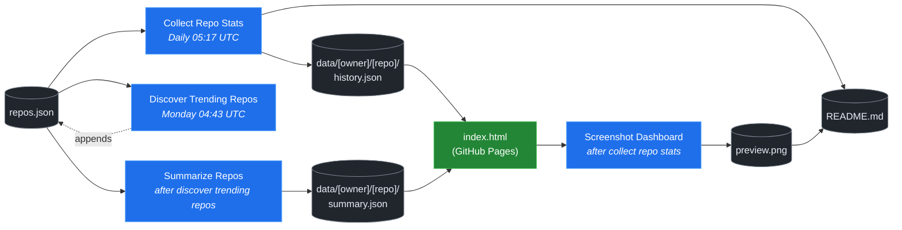

# 🚀 Rising Repos Tracker

> Automatically tracks daily GitHub stats (stars, forks, issues, velocity) for rising open source repos.

[](https://www.telosignal.com/)


**[→ View Live Dashboard](https://patrick-creates.github.io/rising-repos-tracker/)**

Built and maintained by [Telosignal](https://www.telosignal.com/).


<!-- AUTOGEN-STATS-START -->
## 📊 Current snapshot

> Auto-updated daily — last refreshed 2026-07-04

| Metric | Value |
|---|---|
| Repos tracked | **136** |
| Total stars | **7,160,517** |
| Total forks | **1,105,997** |
| Fastest growing | **ponytail** (+2107.3/day) |

### 🔥 Top 5 by velocity

| # | Repo | Stars | Stars/day |
|---|---|---:|---:|
| 1 | [DietrichGebert/ponytail](https://github.com/DietrichGebert/ponytail) | 73,307 | +2107.3 |
| 2 | [chopratejas/headroom](https://github.com/chopratejas/headroom) | 56,319 | +1481.9 |
| 3 | [NousResearch/hermes-agent](https://github.com/NousResearch/hermes-agent) | 208,859 | +1169.5 |
| 4 | [DeusData/codebase-memory-mcp](https://github.com/DeusData/codebase-memory-mcp) | 25,747 | +1023.4 |
| 5 | [Panniantong/Agent-Reach](https://github.com/Panniantong/Agent-Reach) | 50,034 | +1021.4 |

### 🆕 Recently added

- [calesthio/OpenMontage](https://github.com/calesthio/OpenMontage) — added 2026-06-29 — World's first open-source, agentic video production system. 12 pipelines, 52 tools, 500+ agent skills. Turn your AI coding assistant into a full video production studio.
- [DeusData/codebase-memory-mcp](https://github.com/DeusData/codebase-memory-mcp) — added 2026-06-29 — High-performance code intelligence MCP server. Indexes codebases into a persistent knowledge graph — average repo in milliseconds. 158 languages, sub-ms queries, 99% fewer tokens. Single static binary, zero dependencies.
- [pranshuparmar/witr](https://github.com/pranshuparmar/witr) — added 2026-06-29 — Why is this running?
<!-- AUTOGEN-STATS-END -->

<!-- AUTOGEN-DIAGRAM-START -->
## 🔄 How it works


<!-- AUTOGEN-DIAGRAM-END -->

<!-- AUTOGEN-WORKFLOWS-START -->
## ⚙️ Workflows

| File | Schedule | Name |
|---|---|---|
| `collect.yml` | Daily 05:17 UTC | Collect Repo Stats |
| `discover.yml` | Monday 04:43 UTC | Discover Trending Repos |
| `screenshot.yml` | After Collect Repo Stats | Screenshot Dashboard |
| `summarize.yml` | After Discover Trending Repos | Summarize Repos |

> All workflows commit results directly back to the repo. Schedules are best-effort — GitHub Actions cron can drift by a few minutes.
<!-- AUTOGEN-WORKFLOWS-END -->

<!-- AUTOGEN-REPOS-START -->
## 📋 All tracked repos

| Repo | Stars | Forks | Stars/day |
|---|---:|---:|---:|
| [openclaw/openclaw](https://github.com/openclaw/openclaw) | 381,639 | 80,013 | +195.5 |
| [obra/superpowers](https://github.com/obra/superpowers) | 245,757 | 21,789 | +848.3 |
| [affaan-m/everything-claude-code](https://github.com/affaan-m/everything-claude-code) | 225,784 | 34,532 | +860.3 |
| [affaan-m/ECC](https://github.com/affaan-m/ECC) | 225,784 | 34,532 | +838.9 |
| [NousResearch/hermes-agent](https://github.com/NousResearch/hermes-agent) | 208,859 | 38,056 | +1169.5 |
| [Significant-Gravitas/AutoGPT](https://github.com/Significant-Gravitas/AutoGPT) | 185,334 | 46,118 | +20.3 |
| [f/prompts.chat](https://github.com/f/prompts.chat) | 164,699 | 21,310 | +48.6 |
| [microsoft/markitdown](https://github.com/microsoft/markitdown) | 162,792 | 11,515 | +765.1 |
| [langgenius/dify](https://github.com/langgenius/dify) | 147,593 | 23,240 | +122.5 |
| [open-webui/open-webui](https://github.com/open-webui/open-webui) | 144,133 | 20,813 | +139.3 |
| [langchain-ai/langchain](https://github.com/langchain-ai/langchain) | 140,886 | 23,393 | +81.8 |
| [github/spec-kit](https://github.com/github/spec-kit) | 117,842 | 10,417 | +384.3 |
| [farion1231/cc-switch](https://github.com/farion1231/cc-switch) | 112,981 | 7,510 | +828.4 |
| [microsoft/generative-ai-for-beginners](https://github.com/microsoft/generative-ai-for-beginners) | 112,630 | 60,493 | +36.1 |
| [nextlevelbuilder/ui-ux-pro-max-skill](https://github.com/nextlevelbuilder/ui-ux-pro-max-skill) | 100,501 | 10,588 | +434.8 |
| [ChatGPTNextWeb/NextChat](https://github.com/ChatGPTNextWeb/NextChat) | 88,376 | 59,502 | +7.2 |
| [thedotmack/claude-mem](https://github.com/thedotmack/claude-mem) | 85,730 | 7,412 | +199.0 |
| [vllm-project/vllm](https://github.com/vllm-project/vllm) | 85,310 | 18,913 | +104.3 |
| [JuliusBrussee/caveman](https://github.com/JuliusBrussee/caveman) | 83,233 | 4,648 | +462.1 |
| [lobehub/lobehub](https://github.com/lobehub/lobehub) | 79,439 | 15,548 | +46.9 |
| [OpenHands/OpenHands](https://github.com/OpenHands/OpenHands) | 79,360 | 10,096 | +115.5 |
| [ruvnet/RuView](https://github.com/ruvnet/RuView) | 76,352 | 10,225 | +261.5 |
| [dair-ai/Prompt-Engineering-Guide](https://github.com/dair-ai/Prompt-Engineering-Guide) | 76,197 | 8,339 | +31.8 |
| [nexu-io/open-design](https://github.com/nexu-io/open-design) | 74,789 | 8,532 | +651.4 |
| [openai/openai-cookbook](https://github.com/openai/openai-cookbook) | 74,535 | 12,612 | +19.7 |
| [DietrichGebert/ponytail](https://github.com/DietrichGebert/ponytail) | 73,307 | 3,829 | +2107.3 |
| [shareAI-lab/learn-claude-code](https://github.com/shareAI-lab/learn-claude-code) | 69,777 | 11,368 | +185.1 |
| [rtk-ai/rtk](https://github.com/rtk-ai/rtk) | 68,363 | 4,224 | +399.7 |
| [unslothai/unsloth](https://github.com/unslothai/unsloth) | 67,794 | 6,095 | +70.1 |
| [ComposioHQ/awesome-claude-skills](https://github.com/ComposioHQ/awesome-claude-skills) | 66,760 | 7,446 | +135.6 |
| [xtekky/gpt4free](https://github.com/xtekky/gpt4free) | 66,457 | 13,558 | +4.6 |
| [code-yeongyu/oh-my-openagent](https://github.com/code-yeongyu/oh-my-openagent) | 64,761 | 5,292 | +136.9 |
| [datawhalechina/hello-agents](https://github.com/datawhalechina/hello-agents) | 63,850 | 7,908 | +280.6 |
| [shanraisshan/claude-code-best-practice](https://github.com/shanraisshan/claude-code-best-practice) | 61,943 | 6,191 | +179.7 |
| [koala73/worldmonitor](https://github.com/koala73/worldmonitor) | 61,291 | 9,538 | +147.3 |
| [tw93/Pake](https://github.com/tw93/Pake) | 59,225 | 11,886 | +222.3 |
| [Fission-AI/OpenSpec](https://github.com/Fission-AI/OpenSpec) | 58,606 | 4,077 | +208.9 |
| [santifer/career-ops](https://github.com/santifer/career-ops) | 58,447 | 11,465 | +280.9 |
| [MemPalace/mempalace](https://github.com/MemPalace/mempalace) | 56,930 | 7,355 | +96.4 |
| [chopratejas/headroom](https://github.com/chopratejas/headroom) | 56,319 | 4,102 | +1481.9 |
| [headroomlabs-ai/headroom](https://github.com/headroomlabs-ai/headroom) | 56,319 | 4,102 | +868.0 |
| [Leonxlnx/taste-skill](https://github.com/Leonxlnx/taste-skill) | 55,878 | 3,826 | +771.7 |
| [FlowiseAI/Flowise](https://github.com/FlowiseAI/Flowise) | 54,260 | 24,638 | +28.9 |
| [ZhuLinsen/daily_stock_analysis](https://github.com/ZhuLinsen/daily_stock_analysis) | 53,972 | 46,774 | +378.3 |
| [BerriAI/litellm](https://github.com/BerriAI/litellm) | 52,564 | 9,450 | +110.1 |
| [ggml-org/whisper.cpp](https://github.com/ggml-org/whisper.cpp) | 51,272 | 5,715 | +30.8 |
| [Panniantong/Agent-Reach](https://github.com/Panniantong/Agent-Reach) | 50,034 | 3,984 | +1021.4 |
| [mvanhorn/last30days-skill](https://github.com/mvanhorn/last30days-skill) | 48,767 | 4,035 | +619.1 |
| [asgeirtj/system_prompts_leaks](https://github.com/asgeirtj/system_prompts_leaks) | 48,324 | 7,884 | +168.9 |
| [hesreallyhim/awesome-claude-code](https://github.com/hesreallyhim/awesome-claude-code) | 47,934 | 4,196 | +81.7 |
| [Aider-AI/aider](https://github.com/Aider-AI/aider) | 47,015 | 4,692 | +43.7 |
| [zhayujie/CowAgent](https://github.com/zhayujie/CowAgent) | 45,780 | 10,248 | +26.1 |
| [ChromeDevTools/chrome-devtools-mcp](https://github.com/ChromeDevTools/chrome-devtools-mcp) | 45,575 | 2,964 | +121.1 |
| [HKUDS/nanobot](https://github.com/HKUDS/nanobot) | 44,996 | 7,938 | +49.3 |
| [elder-plinius/CL4R1T4S](https://github.com/elder-plinius/CL4R1T4S) | 44,551 | 9,062 | +297.9 |
| [sickn33/antigravity-awesome-skills](https://github.com/sickn33/antigravity-awesome-skills) | 42,312 | 6,755 | +90.8 |
| [QuantumNous/new-api](https://github.com/QuantumNous/new-api) | 41,049 | 9,480 | +142.3 |
| [chatboxai/chatbox](https://github.com/chatboxai/chatbox) | 40,859 | 4,136 | +18.4 |
| [danny-avila/LibreChat](https://github.com/danny-avila/LibreChat) | 40,255 | 8,247 | +69.7 |
| [kepano/obsidian-skills](https://github.com/kepano/obsidian-skills) | 39,648 | 2,810 | +174.7 |
| [Hmbown/CodeWhale](https://github.com/Hmbown/CodeWhale) | 39,411 | 3,402 | +118.5 |
| [router-for-me/CLIProxyAPI](https://github.com/router-for-me/CLIProxyAPI) | 39,123 | 6,469 | +109.5 |
| [chatanywhere/GPT_API_free](https://github.com/chatanywhere/GPT_API_free) | 38,665 | 2,658 | +12.7 |
| [wshobson/agents](https://github.com/wshobson/agents) | 37,496 | 4,022 | +39.0 |
| [jamiepine/voicebox](https://github.com/jamiepine/voicebox) | 37,413 | 4,499 | +254.3 |
| [Yeachan-Heo/oh-my-claudecode](https://github.com/Yeachan-Heo/oh-my-claudecode) | 37,381 | 3,373 | +63.9 |
| [rohitg00/ai-engineering-from-scratch](https://github.com/rohitg00/ai-engineering-from-scratch) | 37,270 | 6,174 | +330.5 |
| [google/langextract](https://github.com/google/langextract) | 36,994 | 2,553 | +11.0 |
| [langchain-ai/langgraph](https://github.com/langchain-ai/langgraph) | 36,441 | 6,105 | +85.1 |
| [github/awesome-copilot](https://github.com/github/awesome-copilot) | 36,159 | 4,493 | +58.8 |
| [coreyhaines31/marketingskills](https://github.com/coreyhaines31/marketingskills) | 36,012 | 5,868 | +138.6 |
| [AstrBotDevs/AstrBot](https://github.com/AstrBotDevs/AstrBot) | 35,791 | 2,472 | +66.7 |
| [songquanpeng/one-api](https://github.com/songquanpeng/one-api) | 35,480 | 6,715 | +31.8 |
| [PDFMathTranslate/PDFMathTranslate](https://github.com/PDFMathTranslate/PDFMathTranslate) | 35,389 | 3,159 | +34.4 |
| [usestrix/strix](https://github.com/usestrix/strix) | 35,158 | 3,592 | +286.3 |
| [heygen-com/hyperframes](https://github.com/heygen-com/hyperframes) | 33,017 | 3,068 | +286.8 |
| [calesthio/OpenMontage](https://github.com/calesthio/OpenMontage) | 32,651 | 3,724 | +960.0 |
| [zeroclaw-labs/zeroclaw](https://github.com/zeroclaw-labs/zeroclaw) | 32,144 | 4,796 | +14.2 |
| [anthropics/claude-plugins-official](https://github.com/anthropics/claude-plugins-official) | 31,521 | 3,454 | +76.1 |
| [Gitlawb/openclaude](https://github.com/Gitlawb/openclaude) | 29,753 | 8,856 | +49.0 |
| [googleworkspace/cli](https://github.com/googleworkspace/cli) | 29,369 | 1,681 | +80.3 |
| [iOfficeAI/AionUi](https://github.com/iOfficeAI/AionUi) | 29,261 | 2,917 | +58.0 |
| [AlexsJones/llmfit](https://github.com/AlexsJones/llmfit) | 29,051 | 1,777 | +62.1 |
| [voideditor/void](https://github.com/voideditor/void) | 28,827 | 2,569 | +0.7 |
| [BloopAI/vibe-kanban](https://github.com/BloopAI/vibe-kanban) | 27,257 | 2,880 | +16.6 |
| [volcengine/OpenViking](https://github.com/volcengine/OpenViking) | 26,302 | 2,043 | +37.5 |
| [jarrodwatts/claude-hud](https://github.com/jarrodwatts/claude-hud) | 26,124 | 1,191 | +55.2 |
| [jackwener/OpenCLI](https://github.com/jackwener/OpenCLI) | 25,969 | 2,577 | +83.4 |
| [esengine/DeepSeek-Reasonix](https://github.com/esengine/DeepSeek-Reasonix) | 25,887 | 1,601 | +244.7 |
| [p-e-w/heretic](https://github.com/p-e-w/heretic) | 25,778 | 2,794 | +69.5 |
| [DeusData/codebase-memory-mcp](https://github.com/DeusData/codebase-memory-mcp) | 25,747 | 1,907 | +1023.4 |
| [zai-org/Open-AutoGLM](https://github.com/zai-org/Open-AutoGLM) | 25,683 | 4,000 | +8.5 |
| [langchain-ai/deepagents](https://github.com/langchain-ai/deepagents) | 25,660 | 3,613 | +57.9 |
| [JCodesMore/ai-website-cloner-template](https://github.com/JCodesMore/ai-website-cloner-template) | 25,375 | 3,570 | +441.2 |
| [toon-format/toon](https://github.com/toon-format/toon) | 24,765 | 1,100 | +10.3 |
| [rohitg00/agentmemory](https://github.com/rohitg00/agentmemory) | 24,522 | 2,018 | +103.7 |
| [mukul975/Anthropic-Cybersecurity-Skills](https://github.com/mukul975/Anthropic-Cybersecurity-Skills) | 24,232 | 2,753 | +509.2 |
| [alibaba/page-agent](https://github.com/alibaba/page-agent) | 22,606 | 1,959 | +213.1 |
| [winfunc/opcode](https://github.com/winfunc/opcode) | 22,139 | 1,709 | +5.2 |
| [coze-dev/coze-studio](https://github.com/coze-dev/coze-studio) | 21,102 | 3,069 | +5.9 |
| [NirDiamant/agents-towards-production](https://github.com/NirDiamant/agents-towards-production) | 20,903 | 2,779 | +10.3 |
| [agentscope-ai/QwenPaw](https://github.com/agentscope-ai/QwenPaw) | 20,525 | 2,722 | +144.6 |
| [decolua/9router](https://github.com/decolua/9router) | 19,713 | 3,193 | +112.7 |
| [tirth8205/code-review-graph](https://github.com/tirth8205/code-review-graph) | 19,146 | 2,049 | +33.3 |
| [tanweai/pua](https://github.com/tanweai/pua) | 18,615 | 1,117 | +19.4 |
| [mksglu/context-mode](https://github.com/mksglu/context-mode) | 18,554 | 1,298 | +57.2 |
| [pranshuparmar/witr](https://github.com/pranshuparmar/witr) | 18,157 | 564 | +25.0 |
| [RightNow-AI/openfang](https://github.com/RightNow-AI/openfang) | 17,963 | 2,278 | +7.2 |
| [datawhalechina/easy-vibe](https://github.com/datawhalechina/easy-vibe) | 17,763 | 1,678 | +43.3 |
| [Tencent/WeKnora](https://github.com/Tencent/WeKnora) | 17,736 | 2,383 | +76.0 |
| [HKUDS/Vibe-Trading](https://github.com/HKUDS/Vibe-Trading) | 17,714 | 2,922 | +595.2 |
| [jundot/omlx](https://github.com/jundot/omlx) | 17,471 | 1,477 | +44.2 |
| [microsoft/agent-lightning](https://github.com/microsoft/agent-lightning) | 17,372 | 1,521 | +3.2 |
| [jnMetaCode/agency-agents-zh](https://github.com/jnMetaCode/agency-agents-zh) | 16,563 | 2,834 | +96.4 |
| [danielmiessler/LifeOS](https://github.com/danielmiessler/LifeOS) | 16,307 | 2,239 | +20.1 |
| [cft0808/edict](https://github.com/cft0808/edict) | 16,150 | 1,701 | +4.6 |
| [can1357/oh-my-pi](https://github.com/can1357/oh-my-pi) | 15,917 | 1,414 | +160.1 |
| [steipete/CodexBar](https://github.com/steipete/CodexBar) | 15,791 | 1,325 | +49.0 |
| [browser-use/browser-harness](https://github.com/browser-use/browser-harness) | 15,680 | 1,462 | +40.2 |
| [MemoriLabs/Memori](https://github.com/MemoriLabs/Memori) | 15,529 | 2,767 | +15.5 |
| [nesquena/hermes-webui](https://github.com/nesquena/hermes-webui) | 15,410 | 2,022 | +47.7 |
| [kyegomez/OpenMythos](https://github.com/kyegomez/OpenMythos) | 14,606 | 3,291 | +37.6 |
| [xpzouying/xiaohongshu-mcp](https://github.com/xpzouying/xiaohongshu-mcp) | 14,501 | 2,158 | +17.8 |
| [yusufkaraaslan/Skill_Seekers](https://github.com/yusufkaraaslan/Skill_Seekers) | 14,347 | 1,467 | +10.1 |
| [NevaMind-AI/memU](https://github.com/NevaMind-AI/memU) | 13,978 | 1,039 | +6.5 |
| [wanshuiyin/Auto-claude-code-research-in-sleep](https://github.com/wanshuiyin/Auto-claude-code-research-in-sleep) | 12,976 | 1,177 | +40.4 |
| [superset-sh/superset](https://github.com/superset-sh/superset) | 12,246 | 1,056 | +17.2 |
| [sirmalloc/ccstatusline](https://github.com/sirmalloc/ccstatusline) | 11,449 | 498 | +33.8 |
| [XiaomiMiMo/MiMo-Code](https://github.com/XiaomiMiMo/MiMo-Code) | 11,384 | 1,114 | +72.0 |
| [ValueCell-ai/valuecell](https://github.com/ValueCell-ai/valuecell) | 10,896 | 1,804 | +4.8 |
| [aden-hive/hive](https://github.com/aden-hive/hive) | 10,629 | 5,647 | +3.4 |
| [EverMind-AI/EverOS](https://github.com/EverMind-AI/EverOS) | 10,187 | 834 | +94.4 |
| [0x4m4/hexstrike-ai](https://github.com/0x4m4/hexstrike-ai) | 10,138 | 2,143 | +25.6 |
| [MemTensor/MemOS](https://github.com/MemTensor/MemOS) | 10,092 | 914 | +13.0 |
| [Kuberwastaken/claurst](https://github.com/Kuberwastaken/claurst) | 9,955 | 7,789 | +17.8 |
| [frankbria/ralph-claude-code](https://github.com/frankbria/ralph-claude-code) | 9,500 | 725 | +7.5 |
<!-- AUTOGEN-REPOS-END -->

---

## What it does

- Collects daily snapshots of stars, forks, watchers and open issues for every tracked repo
- Discovers new trending repos automatically every Monday using the GitHub Search API
- Generates AI summaries (use cases, similar tools, tags) for each tracked repo via GitHub Models
- Stores all history as plain JSON — no database, no backend
- Renders a live dashboard via GitHub Pages — updates daily, zero maintenance

## Tracked repos

Data lives in [`data/`](./data) — one folder per repo, one `history.json` per entry.  
The full watch list is in [`repos.json`](./repos.json).

## Fork & use it for yourself

This is my personal tracker — the watch list reflects what I find interesting. If you want to track different repos, the best path is to **fork this repo and run your own**.

### Setup

1. Fork this repo to your account
2. Replace the contents of [`repos.json`](./repos.json) with the repos you want to track (or just leave one entry — `discover.yml` will auto-add more every Monday)
3. Go to **Settings → Pages** and enable GitHub Pages from the `main` branch
4. Go to **Actions** and run **Collect Repo Stats** once manually to seed your first data point
5. Your dashboard will be live at `https://YOUR-USERNAME.github.io/rising-repos-tracker/`

That's it — daily collection and weekly discovery run automatically on schedule. Zero ongoing maintenance.

### Customizing what gets discovered

Edit [`scripts/discover.js`](./scripts/discover.js) to change:

- `MIN_STARS` — minimum star threshold for candidates
- `MAX_AGE_DAYS` — how recent a repo must be
- `MAX_NEW_REPOS` — how many to add per discovery run
- The `queries` array — GitHub Search API queries that define what "trending" means to you

### Adding a repo manually

Just edit `repos.json` directly:

```json
{
  "owner": "OWNER",
  "repo": "REPO",
  "added": "YYYY-MM-DD",
  "notes": "why you're tracking this"
}
```

The next daily collect run picks it up automatically.

## Stack

- **GitHub Actions** — scheduling and automation
- **GitHub Pages** — dashboard hosting
- **GitHub API** — data source
- **GitHub Models** — free AI summaries (gpt-4o-mini)
- **Chart.js** — star growth visualization
- **Mermaid** — architecture diagram (rendered by GitHub)
- No dependencies, no build step, no database

## License

MIT
