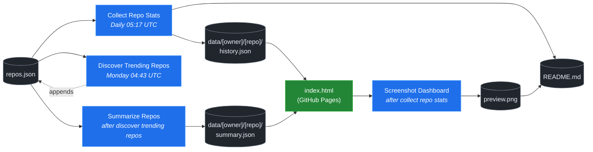

# 🚀 Rising Repos Tracker

> Automatically tracks daily GitHub stats (stars, forks, issues, velocity) for rising open source repos.

[](https://www.telosignal.com/)


**[→ View Live Dashboard](https://patrick-creates.github.io/rising-repos-tracker/)**

Built and maintained by [Telosignal](https://www.telosignal.com/).


<!-- AUTOGEN-STATS-START -->
## 📊 Current snapshot

> Auto-updated daily — last refreshed 2026-06-08

| Metric | Value |
|---|---|
| Repos tracked | **91** |
| Total stars | **5,593,617** |
| Total forks | **917,494** |
| Fastest growing | **hermes-agent** (+1485.4/day) |

### 🔥 Top 5 by velocity

| # | Repo | Stars | Stars/day |
|---|---|---:|---:|
| 1 | [NousResearch/hermes-agent](https://github.com/NousResearch/hermes-agent) | 186,666 | +1485.4 |
| 2 | [affaan-m/ECC](https://github.com/affaan-m/ECC) | 210,291 | +1290.1 |
| 3 | [affaan-m/everything-claude-code](https://github.com/affaan-m/everything-claude-code) | 210,290 | +1124.7 |
| 4 | [Leonxlnx/taste-skill](https://github.com/Leonxlnx/taste-skill) | 37,820 | +1058.1 |
| 5 | [farion1231/cc-switch](https://github.com/farion1231/cc-switch) | 94,794 | +988.1 |

### 🆕 Recently added

- [mvanhorn/last30days-skill](https://github.com/mvanhorn/last30days-skill) — added 2026-06-08 — AI agent skill that researches any topic across Reddit, X, YouTube, HN, Polymarket, and the web - then synthesizes a grounded summary
- [heygen-com/hyperframes](https://github.com/heygen-com/hyperframes) — added 2026-06-08 — Write HTML. Render video. Built for agents.
- [zai-org/Open-AutoGLM](https://github.com/zai-org/Open-AutoGLM) — added 2026-06-08 — An Open Phone Agent Model & Framework. Unlocking the AI Phone for Everyone
<!-- AUTOGEN-STATS-END -->

<!-- AUTOGEN-DIAGRAM-START -->
## 🔄 How it works


<!-- AUTOGEN-DIAGRAM-END -->

<!-- AUTOGEN-WORKFLOWS-START -->
## ⚙️ Workflows

| File | Schedule | Name |
|---|---|---|
| `collect.yml` | Daily 05:17 UTC | Collect Repo Stats |
| `discover.yml` | Monday 04:43 UTC | Discover Trending Repos |
| `screenshot.yml` | After Collect Repo Stats | Screenshot Dashboard |
| `summarize.yml` | After Discover Trending Repos | Summarize Repos |

> All workflows commit results directly back to the repo. Schedules are best-effort — GitHub Actions cron can drift by a few minutes.
<!-- AUTOGEN-WORKFLOWS-END -->

<!-- AUTOGEN-REPOS-START -->
## 📋 All tracked repos

| Repo | Stars | Forks | Stars/day |
|---|---:|---:|---:|
| [openclaw/openclaw](https://github.com/openclaw/openclaw) | 377,531 | 78,931 | +233.1 |
| [affaan-m/ECC](https://github.com/affaan-m/ECC) | 210,291 | 32,245 | +1290.1 |
| [affaan-m/everything-claude-code](https://github.com/affaan-m/everything-claude-code) | 210,290 | 32,245 | +1124.7 |
| [NousResearch/hermes-agent](https://github.com/NousResearch/hermes-agent) | 186,666 | 32,112 | +1485.4 |
| [Significant-Gravitas/AutoGPT](https://github.com/Significant-Gravitas/AutoGPT) | 184,843 | 46,189 | +21.6 |
| [f/prompts.chat](https://github.com/f/prompts.chat) | 163,442 | 21,227 | +48.8 |
| [microsoft/markitdown](https://github.com/microsoft/markitdown) | 147,884 | 10,143 | +956.8 |
| [langgenius/dify](https://github.com/langgenius/dify) | 144,392 | 22,730 | +121.8 |
| [open-webui/open-webui](https://github.com/open-webui/open-webui) | 140,574 | 20,178 | +141.6 |
| [langchain-ai/langchain](https://github.com/langchain-ai/langchain) | 138,806 | 22,999 | +83.5 |
| [microsoft/generative-ai-for-beginners](https://github.com/microsoft/generative-ai-for-beginners) | 111,765 | 59,998 | +39.0 |
| [github/spec-kit](https://github.com/github/spec-kit) | 110,319 | 9,737 | +479.2 |
| [farion1231/cc-switch](https://github.com/farion1231/cc-switch) | 94,794 | 6,212 | +988.1 |
| [nextlevelbuilder/ui-ux-pro-max-skill](https://github.com/nextlevelbuilder/ui-ux-pro-max-skill) | 88,721 | 9,200 | +416.5 |
| [ChatGPTNextWeb/NextChat](https://github.com/ChatGPTNextWeb/NextChat) | 88,190 | 59,633 | +7.3 |
| [vllm-project/vllm](https://github.com/vllm-project/vllm) | 82,211 | 17,792 | +89.5 |
| [thedotmack/claude-mem](https://github.com/thedotmack/claude-mem) | 81,190 | 6,993 | +223.5 |
| [lobehub/lobehub](https://github.com/lobehub/lobehub) | 78,352 | 15,383 | +52.1 |
| [OpenHands/OpenHands](https://github.com/OpenHands/OpenHands) | 76,216 | 9,684 | +108.8 |
| [dair-ai/Prompt-Engineering-Guide](https://github.com/dair-ai/Prompt-Engineering-Guide) | 75,398 | 8,193 | +33.2 |
| [openai/openai-cookbook](https://github.com/openai/openai-cookbook) | 74,065 | 12,539 | +21.7 |
| [ruvnet/RuView](https://github.com/ruvnet/RuView) | 71,821 | 9,577 | +423.4 |
| [JuliusBrussee/caveman](https://github.com/JuliusBrussee/caveman) | 69,956 | 3,945 | +402.1 |
| [xtekky/gpt4free](https://github.com/xtekky/gpt4free) | 66,311 | 13,575 | +3.3 |
| [unslothai/unsloth](https://github.com/unslothai/unsloth) | 66,030 | 5,911 | +72.9 |
| [shareAI-lab/learn-claude-code](https://github.com/shareAI-lab/learn-claude-code) | 65,366 | 10,650 | +204.2 |
| [ComposioHQ/awesome-claude-skills](https://github.com/ComposioHQ/awesome-claude-skills) | 63,691 | 7,008 | +157.3 |
| [code-yeongyu/oh-my-openagent](https://github.com/code-yeongyu/oh-my-openagent) | 61,476 | 4,972 | +149.9 |
| [nexu-io/open-design](https://github.com/nexu-io/open-design) | 61,311 | 6,875 | +816.0 |
| [rtk-ai/rtk](https://github.com/rtk-ai/rtk) | 59,947 | 3,689 | +493.8 |
| [datawhalechina/hello-agents](https://github.com/datawhalechina/hello-agents) | 57,444 | 7,017 | +323.0 |
| [shanraisshan/claude-code-best-practice](https://github.com/shanraisshan/claude-code-best-practice) | 56,877 | 5,713 | +160.9 |
| [koala73/worldmonitor](https://github.com/koala73/worldmonitor) | 56,047 | 8,981 | +80.0 |
| [MemPalace/mempalace](https://github.com/MemPalace/mempalace) | 54,663 | 7,140 | +107.8 |
| [Fission-AI/OpenSpec](https://github.com/Fission-AI/OpenSpec) | 53,469 | 3,743 | +222.9 |
| [FlowiseAI/Flowise](https://github.com/FlowiseAI/Flowise) | 53,424 | 24,503 | +25.0 |
| [ggml-org/whisper.cpp](https://github.com/ggml-org/whisper.cpp) | 50,556 | 5,629 | +34.8 |
| [tw93/Pake](https://github.com/tw93/Pake) | 50,147 | 10,219 | +65.1 |
| [santifer/career-ops](https://github.com/santifer/career-ops) | 49,941 | 10,283 | +223.6 |
| [BerriAI/litellm](https://github.com/BerriAI/litellm) | 49,625 | 8,686 | +106.5 |
| [hesreallyhim/awesome-claude-code](https://github.com/hesreallyhim/awesome-claude-code) | 45,952 | 4,007 | +88.4 |
| [Aider-AI/aider](https://github.com/Aider-AI/aider) | 45,885 | 4,569 | +44.0 |
| [zhayujie/CowAgent](https://github.com/zhayujie/CowAgent) | 45,149 | 10,176 | +28.3 |
| [HKUDS/nanobot](https://github.com/HKUDS/nanobot) | 43,855 | 7,755 | +56.0 |
| [ChromeDevTools/chrome-devtools-mcp](https://github.com/ChromeDevTools/chrome-devtools-mcp) | 43,108 | 2,764 | +153.5 |
| [asgeirtj/system_prompts_leaks](https://github.com/asgeirtj/system_prompts_leaks) | 41,408 | 6,861 | +48.7 |
| [ZhuLinsen/daily_stock_analysis](https://github.com/ZhuLinsen/daily_stock_analysis) | 41,291 | 39,427 | +175.1 |
| [chatboxai/chatbox](https://github.com/chatboxai/chatbox) | 40,365 | 4,095 | +17.6 |
| [sickn33/antigravity-awesome-skills](https://github.com/sickn33/antigravity-awesome-skills) | 40,052 | 6,482 | +98.1 |
| [danny-avila/LibreChat](https://github.com/danny-avila/LibreChat) | 38,609 | 7,915 | +81.4 |
| [chatanywhere/GPT_API_free](https://github.com/chatanywhere/GPT_API_free) | 38,371 | 2,650 | +15.4 |
| [Leonxlnx/taste-skill](https://github.com/Leonxlnx/taste-skill) | 37,820 | 2,699 | +1058.1 |
| [QuantumNous/new-api](https://github.com/QuantumNous/new-api) | 37,668 | 8,547 | +165.1 |
| [Hmbown/CodeWhale](https://github.com/Hmbown/CodeWhale) | 37,517 | 3,227 | +203.4 |
| [google/langextract](https://github.com/google/langextract) | 36,830 | 2,540 | +19.6 |
| [router-for-me/CLIProxyAPI](https://github.com/router-for-me/CLIProxyAPI) | 36,554 | 6,074 | +129.3 |
| [wshobson/agents](https://github.com/wshobson/agents) | 36,503 | 3,955 | +40.5 |
| [Yeachan-Heo/oh-my-claudecode](https://github.com/Yeachan-Heo/oh-my-claudecode) | 35,990 | 3,278 | +83.3 |
| [kepano/obsidian-skills](https://github.com/kepano/obsidian-skills) | 34,890 | 2,460 | +143.7 |
| [songquanpeng/one-api](https://github.com/songquanpeng/one-api) | 34,728 | 6,607 | +37.0 |
| [PDFMathTranslate/PDFMathTranslate](https://github.com/PDFMathTranslate/PDFMathTranslate) | 34,629 | 3,095 | +43.9 |
| [github/awesome-copilot](https://github.com/github/awesome-copilot) | 34,616 | 4,248 | +57.9 |
| [AstrBotDevs/AstrBot](https://github.com/AstrBotDevs/AstrBot) | 34,145 | 2,342 | +79.4 |
| [mvanhorn/last30days-skill](https://github.com/mvanhorn/last30days-skill) | 32,671 | 2,693 | +241.0 |
| [coreyhaines31/marketingskills](https://github.com/coreyhaines31/marketingskills) | 32,411 | 5,320 | +139.0 |
| [zeroclaw-labs/zeroclaw](https://github.com/zeroclaw-labs/zeroclaw) | 31,831 | 4,707 | +22.1 |
| [rohitg00/ai-engineering-from-scratch](https://github.com/rohitg00/ai-engineering-from-scratch) | 30,096 | 4,910 | +533.3 |
| [anthropics/claude-plugins-official](https://github.com/anthropics/claude-plugins-official) | 29,616 | 3,187 | +86.4 |
| [jamiepine/voicebox](https://github.com/jamiepine/voicebox) | 29,547 | 3,616 | +75.0 |
| [voideditor/void](https://github.com/voideditor/void) | 28,813 | 2,522 | +1.1 |
| [Gitlawb/openclaude](https://github.com/Gitlawb/openclaude) | 28,479 | 8,715 | +49.1 |
| [iOfficeAI/AionUi](https://github.com/iOfficeAI/AionUi) | 27,794 | 2,698 | +63.7 |
| [AlexsJones/llmfit](https://github.com/AlexsJones/llmfit) | 27,579 | 1,684 | +82.6 |
| [googleworkspace/cli](https://github.com/googleworkspace/cli) | 26,918 | 1,416 | +28.6 |
| [BloopAI/vibe-kanban](https://github.com/BloopAI/vibe-kanban) | 26,851 | 2,837 | +20.1 |
| [usestrix/strix](https://github.com/usestrix/strix) | 25,882 | 2,907 | +24.6 |
| [heygen-com/hyperframes](https://github.com/heygen-com/hyperframes) | 25,561 | 2,401 | +283.8 |
| [zai-org/Open-AutoGLM](https://github.com/zai-org/Open-AutoGLM) | 25,462 | 3,970 | +140.7 |
| [volcengine/OpenViking](https://github.com/volcengine/OpenViking) | 25,328 | 1,955 | +164.3 |
| [jarrodwatts/claude-hud](https://github.com/jarrodwatts/claude-hud) | 24,690 | 1,113 | +157.2 |
| [toon-format/toon](https://github.com/toon-format/toon) | 24,496 | 1,090 | +107.4 |
| [langchain-ai/deepagents](https://github.com/langchain-ai/deepagents) | 24,155 | 3,417 | +76.7 |
| [p-e-w/heretic](https://github.com/p-e-w/heretic) | 23,972 | 2,564 | +92.2 |
| [jackwener/OpenCLI](https://github.com/jackwener/OpenCLI) | 23,800 | 2,387 | +279.9 |
| [Panniantong/Agent-Reach](https://github.com/Panniantong/Agent-Reach) | 23,477 | 1,981 | +225.5 |
| [winfunc/opcode](https://github.com/winfunc/opcode) | 22,005 | 1,701 | +62.3 |
| [rohitg00/agentmemory](https://github.com/rohitg00/agentmemory) | 21,825 | 1,796 | +211.8 |
| [coze-dev/coze-studio](https://github.com/coze-dev/coze-studio) | 20,948 | 3,037 | +60.4 |
| [NirDiamant/agents-towards-production](https://github.com/NirDiamant/agents-towards-production) | 20,634 | 2,740 | +58.0 |
| [esengine/DeepSeek-Reasonix](https://github.com/esengine/DeepSeek-Reasonix) | 19,526 | 1,173 | +406.3 |
| [frankbria/ralph-claude-code](https://github.com/frankbria/ralph-claude-code) | 9,273 | 705 | +6.2 |
<!-- AUTOGEN-REPOS-END -->

---

## What it does

- Collects daily snapshots of stars, forks, watchers and open issues for every tracked repo
- Discovers new trending repos automatically every Monday using the GitHub Search API
- Generates AI summaries (use cases, similar tools, tags) for each tracked repo via GitHub Models
- Stores all history as plain JSON — no database, no backend
- Renders a live dashboard via GitHub Pages — updates daily, zero maintenance

## Tracked repos

Data lives in [`data/`](./data) — one folder per repo, one `history.json` per entry.  
The full watch list is in [`repos.json`](./repos.json).

## Fork & use it for yourself

This is my personal tracker — the watch list reflects what I find interesting. If you want to track different repos, the best path is to **fork this repo and run your own**.

### Setup

1. Fork this repo to your account
2. Replace the contents of [`repos.json`](./repos.json) with the repos you want to track (or just leave one entry — `discover.yml` will auto-add more every Monday)
3. Go to **Settings → Pages** and enable GitHub Pages from the `main` branch
4. Go to **Actions** and run **Collect Repo Stats** once manually to seed your first data point
5. Your dashboard will be live at `https://YOUR-USERNAME.github.io/rising-repos-tracker/`

That's it — daily collection and weekly discovery run automatically on schedule. Zero ongoing maintenance.

### Customizing what gets discovered

Edit [`scripts/discover.js`](./scripts/discover.js) to change:

- `MIN_STARS` — minimum star threshold for candidates
- `MAX_AGE_DAYS` — how recent a repo must be
- `MAX_NEW_REPOS` — how many to add per discovery run
- The `queries` array — GitHub Search API queries that define what "trending" means to you

### Adding a repo manually

Just edit `repos.json` directly:

```json
{
  "owner": "OWNER",
  "repo": "REPO",
  "added": "YYYY-MM-DD",
  "notes": "why you're tracking this"
}
```

The next daily collect run picks it up automatically.

## Stack

- **GitHub Actions** — scheduling and automation
- **GitHub Pages** — dashboard hosting
- **GitHub API** — data source
- **GitHub Models** — free AI summaries (gpt-4o-mini)
- **Chart.js** — star growth visualization
- **Mermaid** — architecture diagram (rendered by GitHub)
- No dependencies, no build step, no database

## License

MIT
