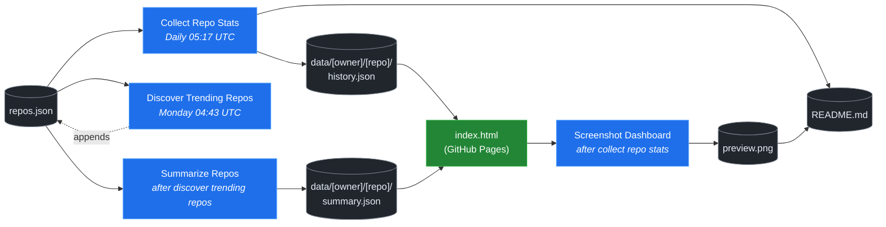

# 🚀 Rising Repos Tracker

> Automatically tracks daily GitHub stats (stars, forks, issues, velocity) for rising open source repos.

[](https://www.telosignal.com/)


**[→ View Live Dashboard](https://patrick-creates.github.io/rising-repos-tracker/)**

Built and maintained by [Telosignal](https://www.telosignal.com/).


<!-- AUTOGEN-STATS-START -->
## 📊 Current snapshot

> Auto-updated daily — last refreshed 2026-06-23

| Metric | Value |
|---|---|
| Repos tracked | **121** |
| Total stars | **6,695,009** |
| Total forks | **1,040,750** |
| Fastest growing | **ponytail** (+2787.0/day) |

### 🔥 Top 5 by velocity

| # | Repo | Stars | Stars/day |
|---|---|---:|---:|
| 1 | [DietrichGebert/ponytail](https://github.com/DietrichGebert/ponytail) | 50,806 | +2787.0 |
| 2 | [chopratejas/headroom](https://github.com/chopratejas/headroom) | 47,578 | +2426.9 |
| 3 | [headroomlabs-ai/headroom](https://github.com/headroomlabs-ai/headroom) | 47,578 | +1675.0 |
| 4 | [NousResearch/hermes-agent](https://github.com/NousResearch/hermes-agent) | 200,288 | +1274.2 |
| 5 | [Panniantong/Agent-Reach](https://github.com/Panniantong/Agent-Reach) | 38,179 | +980.1 |

### 🆕 Recently added

- [obra/superpowers](https://github.com/obra/superpowers) — added 2026-06-22 — An agentic skills framework & software development methodology that works.
- [DietrichGebert/ponytail](https://github.com/DietrichGebert/ponytail) — added 2026-06-22 — Makes your AI agent think like the laziest senior dev in the room. The best code is the code you never wrote.
- [headroomlabs-ai/headroom](https://github.com/headroomlabs-ai/headroom) — added 2026-06-22 — Compress tool outputs, logs, files, and RAG chunks before they reach the LLM. 60-95% fewer tokens, same answers. Library, proxy, MCP server.
<!-- AUTOGEN-STATS-END -->

<!-- AUTOGEN-DIAGRAM-START -->
## 🔄 How it works


<!-- AUTOGEN-DIAGRAM-END -->

<!-- AUTOGEN-WORKFLOWS-START -->
## ⚙️ Workflows

| File | Schedule | Name |
|---|---|---|
| `collect.yml` | Daily 05:17 UTC | Collect Repo Stats |
| `discover.yml` | Monday 04:43 UTC | Discover Trending Repos |
| `screenshot.yml` | After Collect Repo Stats | Screenshot Dashboard |
| `summarize.yml` | After Discover Trending Repos | Summarize Repos |

> All workflows commit results directly back to the repo. Schedules are best-effort — GitHub Actions cron can drift by a few minutes.
<!-- AUTOGEN-WORKFLOWS-END -->

<!-- AUTOGEN-REPOS-START -->
## 📋 All tracked repos

| Repo | Stars | Forks | Stars/day |
|---|---:|---:|---:|
| [openclaw/openclaw](https://github.com/openclaw/openclaw) | 380,045 | 79,580 | +209.1 |
| [obra/superpowers](https://github.com/obra/superpowers) | 236,407 | 20,980 | +830.0 |
| [affaan-m/everything-claude-code](https://github.com/affaan-m/everything-claude-code) | 220,106 | 33,731 | +952.6 |
| [affaan-m/ECC](https://github.com/affaan-m/ECC) | 220,106 | 33,731 | +961.3 |
| [NousResearch/hermes-agent](https://github.com/NousResearch/hermes-agent) | 200,288 | 35,681 | +1274.2 |
| [Significant-Gravitas/AutoGPT](https://github.com/Significant-Gravitas/AutoGPT) | 185,098 | 46,115 | +19.9 |
| [f/prompts.chat](https://github.com/f/prompts.chat) | 164,134 | 21,262 | +47.9 |
| [microsoft/markitdown](https://github.com/microsoft/markitdown) | 157,935 | 11,026 | +851.9 |
| [langgenius/dify](https://github.com/langgenius/dify) | 146,227 | 22,998 | +122.0 |
| [open-webui/open-webui](https://github.com/open-webui/open-webui) | 142,693 | 20,521 | +141.5 |
| [langchain-ai/langchain](https://github.com/langchain-ai/langchain) | 139,944 | 23,207 | +80.7 |
| [github/spec-kit](https://github.com/github/spec-kit) | 114,875 | 10,137 | +415.0 |
| [microsoft/generative-ai-for-beginners](https://github.com/microsoft/generative-ai-for-beginners) | 112,234 | 60,277 | +36.1 |
| [farion1231/cc-switch](https://github.com/farion1231/cc-switch) | 106,727 | 7,051 | +907.9 |
| [nextlevelbuilder/ui-ux-pro-max-skill](https://github.com/nextlevelbuilder/ui-ux-pro-max-skill) | 95,283 | 10,001 | +424.1 |
| [ChatGPTNextWeb/NextChat](https://github.com/ChatGPTNextWeb/NextChat) | 88,287 | 59,538 | +6.9 |
| [thedotmack/claude-mem](https://github.com/thedotmack/claude-mem) | 83,836 | 7,239 | +206.2 |
| [vllm-project/vllm](https://github.com/vllm-project/vllm) | 83,613 | 18,350 | +91.0 |
| [lobehub/lobehub](https://github.com/lobehub/lobehub) | 78,987 | 15,477 | +48.5 |
| [OpenHands/OpenHands](https://github.com/OpenHands/OpenHands) | 78,070 | 9,923 | +114.9 |
| [JuliusBrussee/caveman](https://github.com/JuliusBrussee/caveman) | 75,993 | 4,304 | +402.3 |
| [dair-ai/Prompt-Engineering-Guide](https://github.com/dair-ai/Prompt-Engineering-Guide) | 75,890 | 8,307 | +33.0 |
| [ruvnet/RuView](https://github.com/ruvnet/RuView) | 75,165 | 10,044 | +319.7 |
| [openai/openai-cookbook](https://github.com/openai/openai-cookbook) | 74,323 | 12,577 | +19.8 |
| [nexu-io/open-design](https://github.com/nexu-io/open-design) | 69,559 | 7,836 | +705.1 |
| [shareAI-lab/learn-claude-code](https://github.com/shareAI-lab/learn-claude-code) | 67,985 | 11,056 | +191.9 |
| [unslothai/unsloth](https://github.com/unslothai/unsloth) | 67,146 | 6,027 | +73.5 |
| [xtekky/gpt4free](https://github.com/xtekky/gpt4free) | 66,420 | 13,571 | +5.0 |
| [ComposioHQ/awesome-claude-skills](https://github.com/ComposioHQ/awesome-claude-skills) | 65,592 | 7,292 | +144.6 |
| [rtk-ai/rtk](https://github.com/rtk-ai/rtk) | 65,184 | 4,028 | +433.5 |
| [code-yeongyu/oh-my-openagent](https://github.com/code-yeongyu/oh-my-openagent) | 63,317 | 5,144 | +138.6 |
| [datawhalechina/hello-agents](https://github.com/datawhalechina/hello-agents) | 61,135 | 7,541 | +291.0 |
| [shanraisshan/claude-code-best-practice](https://github.com/shanraisshan/claude-code-best-practice) | 58,980 | 5,958 | +152.3 |
| [koala73/worldmonitor](https://github.com/koala73/worldmonitor) | 58,713 | 9,263 | +120.7 |
| [tw93/Pake](https://github.com/tw93/Pake) | 56,900 | 11,275 | +225.6 |
| [MemPalace/mempalace](https://github.com/MemPalace/mempalace) | 56,180 | 7,269 | +105.0 |
| [Fission-AI/OpenSpec](https://github.com/Fission-AI/OpenSpec) | 56,137 | 3,928 | +204.1 |
| [santifer/career-ops](https://github.com/santifer/career-ops) | 55,287 | 10,936 | +278.9 |
| [FlowiseAI/Flowise](https://github.com/FlowiseAI/Flowise) | 53,925 | 24,585 | +28.5 |
| [BerriAI/litellm](https://github.com/BerriAI/litellm) | 51,203 | 9,082 | +106.0 |
| [ggml-org/whisper.cpp](https://github.com/ggml-org/whisper.cpp) | 50,970 | 5,693 | +31.8 |
| [DietrichGebert/ponytail](https://github.com/DietrichGebert/ponytail) | 50,806 | 2,503 | +2787.0 |
| [Leonxlnx/taste-skill](https://github.com/Leonxlnx/taste-skill) | 49,314 | 3,417 | +859.1 |
| [chopratejas/headroom](https://github.com/chopratejas/headroom) | 47,578 | 3,318 | +2426.9 |
| [headroomlabs-ai/headroom](https://github.com/headroomlabs-ai/headroom) | 47,578 | 3,318 | +1675.0 |
| [hesreallyhim/awesome-claude-code](https://github.com/hesreallyhim/awesome-claude-code) | 47,104 | 4,117 | +83.6 |
| [Aider-AI/aider](https://github.com/Aider-AI/aider) | 46,591 | 4,643 | +45.3 |
| [ZhuLinsen/daily_stock_analysis](https://github.com/ZhuLinsen/daily_stock_analysis) | 46,318 | 42,123 | +257.9 |
| [mvanhorn/last30days-skill](https://github.com/mvanhorn/last30days-skill) | 45,923 | 3,812 | +883.5 |
| [zhayujie/CowAgent](https://github.com/zhayujie/CowAgent) | 45,571 | 10,228 | +28.2 |
| [asgeirtj/system_prompts_leaks](https://github.com/asgeirtj/system_prompts_leaks) | 45,181 | 7,442 | +133.2 |
| [HKUDS/nanobot](https://github.com/HKUDS/nanobot) | 44,620 | 7,876 | +53.9 |
| [ChromeDevTools/chrome-devtools-mcp](https://github.com/ChromeDevTools/chrome-devtools-mcp) | 44,230 | 2,858 | +120.7 |
| [elder-plinius/CL4R1T4S](https://github.com/elder-plinius/CL4R1T4S) | 43,501 | 8,802 | +576.3 |
| [sickn33/antigravity-awesome-skills](https://github.com/sickn33/antigravity-awesome-skills) | 41,443 | 6,653 | +95.3 |
| [chatboxai/chatbox](https://github.com/chatboxai/chatbox) | 40,605 | 4,117 | +16.9 |
| [QuantumNous/new-api](https://github.com/QuantumNous/new-api) | 39,727 | 9,068 | +150.7 |
| [danny-avila/LibreChat](https://github.com/danny-avila/LibreChat) | 39,666 | 8,134 | +75.8 |
| [Hmbown/CodeWhale](https://github.com/Hmbown/CodeWhale) | 38,879 | 3,352 | +145.1 |
| [chatanywhere/GPT_API_free](https://github.com/chatanywhere/GPT_API_free) | 38,539 | 2,652 | +13.2 |
| [Panniantong/Agent-Reach](https://github.com/Panniantong/Agent-Reach) | 38,179 | 3,030 | +980.1 |
| [router-for-me/CLIProxyAPI](https://github.com/router-for-me/CLIProxyAPI) | 38,147 | 6,306 | +117.3 |
| [wshobson/agents](https://github.com/wshobson/agents) | 37,070 | 4,003 | +39.1 |
| [kepano/obsidian-skills](https://github.com/kepano/obsidian-skills) | 37,067 | 2,628 | +144.7 |
| [google/langextract](https://github.com/google/langextract) | 36,943 | 2,550 | +13.4 |
| [Yeachan-Heo/oh-my-claudecode](https://github.com/Yeachan-Heo/oh-my-claudecode) | 36,812 | 3,330 | +68.6 |
| [rohitg00/ai-engineering-from-scratch](https://github.com/rohitg00/ai-engineering-from-scratch) | 35,783 | 5,833 | +428.2 |
| [github/awesome-copilot](https://github.com/github/awesome-copilot) | 35,562 | 4,388 | +60.6 |
| [langchain-ai/langgraph](https://github.com/langchain-ai/langgraph) | 35,492 | 5,955 | +72.0 |
| [songquanpeng/one-api](https://github.com/songquanpeng/one-api) | 35,173 | 6,664 | +33.2 |
| [AstrBotDevs/AstrBot](https://github.com/AstrBotDevs/AstrBot) | 35,167 | 2,428 | +71.7 |
| [PDFMathTranslate/PDFMathTranslate](https://github.com/PDFMathTranslate/PDFMathTranslate) | 35,093 | 3,134 | +37.2 |
| [coreyhaines31/marketingskills](https://github.com/coreyhaines31/marketingskills) | 34,652 | 5,675 | +146.1 |
| [jamiepine/voicebox](https://github.com/jamiepine/voicebox) | 32,689 | 3,962 | +166.7 |
| [zeroclaw-labs/zeroclaw](https://github.com/zeroclaw-labs/zeroclaw) | 32,005 | 4,752 | +15.0 |
| [anthropics/claude-plugins-official](https://github.com/anthropics/claude-plugins-official) | 30,661 | 3,353 | +75.0 |
| [heygen-com/hyperframes](https://github.com/heygen-com/hyperframes) | 30,335 | 2,836 | +318.3 |
| [Gitlawb/openclaude](https://github.com/Gitlawb/openclaude) | 29,287 | 8,802 | +52.4 |
| [voideditor/void](https://github.com/voideditor/void) | 28,816 | 2,551 | +0.5 |
| [iOfficeAI/AionUi](https://github.com/iOfficeAI/AionUi) | 28,682 | 2,828 | +60.6 |
| [AlexsJones/llmfit](https://github.com/AlexsJones/llmfit) | 28,502 | 1,749 | +68.2 |
| [googleworkspace/cli](https://github.com/googleworkspace/cli) | 27,225 | 1,431 | +23.0 |
| [BloopAI/vibe-kanban](https://github.com/BloopAI/vibe-kanban) | 27,105 | 2,864 | +18.0 |
| [usestrix/strix](https://github.com/usestrix/strix) | 26,119 | 2,938 | +18.6 |
| [volcengine/OpenViking](https://github.com/volcengine/OpenViking) | 25,944 | 2,010 | +41.1 |
| [jarrodwatts/claude-hud](https://github.com/jarrodwatts/claude-hud) | 25,619 | 1,169 | +61.9 |
| [zai-org/Open-AutoGLM](https://github.com/zai-org/Open-AutoGLM) | 25,581 | 3,989 | +7.9 |
| [p-e-w/heretic](https://github.com/p-e-w/heretic) | 25,382 | 2,732 | +94.0 |
| [jackwener/OpenCLI](https://github.com/jackwener/OpenCLI) | 25,038 | 2,490 | +82.5 |
| [langchain-ai/deepagents](https://github.com/langchain-ai/deepagents) | 24,989 | 3,530 | +55.6 |
| [toon-format/toon](https://github.com/toon-format/toon) | 24,641 | 1,093 | +9.7 |
| [esengine/DeepSeek-Reasonix](https://github.com/esengine/DeepSeek-Reasonix) | 23,998 | 1,464 | +298.1 |
| [rohitg00/agentmemory](https://github.com/rohitg00/agentmemory) | 23,760 | 1,956 | +129.0 |
| [winfunc/opcode](https://github.com/winfunc/opcode) | 22,084 | 1,707 | +5.3 |
| [coze-dev/coze-studio](https://github.com/coze-dev/coze-studio) | 21,023 | 3,056 | +5.0 |
| [NirDiamant/agents-towards-production](https://github.com/NirDiamant/agents-towards-production) | 20,832 | 2,769 | +13.2 |
| [agentscope-ai/QwenPaw](https://github.com/agentscope-ai/QwenPaw) | 19,881 | 2,663 | +262.9 |
| [alibaba/page-agent](https://github.com/alibaba/page-agent) | 19,117 | 1,649 | +69.9 |
| [mukul975/Anthropic-Cybersecurity-Skills](https://github.com/mukul975/Anthropic-Cybersecurity-Skills) | 19,072 | 2,236 | +950.0 |
| [tirth8205/code-review-graph](https://github.com/tirth8205/code-review-graph) | 18,814 | 2,012 | +37.5 |
| [tanweai/pua](https://github.com/tanweai/pua) | 18,383 | 1,105 | +17.1 |
| [decolua/9router](https://github.com/decolua/9router) | 18,277 | 2,886 | +88.3 |
| [JCodesMore/ai-website-cloner-template](https://github.com/JCodesMore/ai-website-cloner-template) | 18,084 | 2,768 | +136.4 |
| [mksglu/context-mode](https://github.com/mksglu/context-mode) | 17,986 | 1,270 | +64.8 |
| [RightNow-AI/openfang](https://github.com/RightNow-AI/openfang) | 17,888 | 2,268 | +7.8 |
| [microsoft/agent-lightning](https://github.com/microsoft/agent-lightning) | 17,331 | 1,517 | +2.5 |
| [datawhalechina/easy-vibe](https://github.com/datawhalechina/easy-vibe) | 17,238 | 1,633 | +37.1 |
| [jundot/omlx](https://github.com/jundot/omlx) | 16,996 | 1,440 | +45.5 |
| [Tencent/WeKnora](https://github.com/Tencent/WeKnora) | 16,980 | 2,205 | +86.0 |
| [cft0808/edict](https://github.com/cft0808/edict) | 16,109 | 1,697 | +5.9 |
| [danielmiessler/LifeOS](https://github.com/danielmiessler/LifeOS) | 16,087 | 2,215 | +21.0 |
| [jnMetaCode/agency-agents-zh](https://github.com/jnMetaCode/agency-agents-zh) | 15,457 | 2,689 | +51.0 |
| [MemoriLabs/Memori](https://github.com/MemoriLabs/Memori) | 15,352 | 2,629 | +9.0 |
| [steipete/CodexBar](https://github.com/steipete/CodexBar) | 15,262 | 1,258 | +59.0 |
| [nesquena/hermes-webui](https://github.com/nesquena/hermes-webui) | 14,892 | 1,896 | +54.0 |
| [xpzouying/xiaohongshu-mcp](https://github.com/xpzouying/xiaohongshu-mcp) | 14,303 | 2,137 | +16.0 |
| [yusufkaraaslan/Skill_Seekers](https://github.com/yusufkaraaslan/Skill_Seekers) | 14,233 | 1,460 | +7.0 |
| [can1357/oh-my-pi](https://github.com/can1357/oh-my-pi) | 14,215 | 1,246 | +219.0 |
| [kyegomez/OpenMythos](https://github.com/kyegomez/OpenMythos) | 14,171 | 3,184 | +16.0 |
| [NevaMind-AI/memU](https://github.com/NevaMind-AI/memU) | 13,906 | 1,035 | +6.0 |
| [frankbria/ralph-claude-code](https://github.com/frankbria/ralph-claude-code) | 9,445 | 723 | +8.1 |
<!-- AUTOGEN-REPOS-END -->

---

## What it does

- Collects daily snapshots of stars, forks, watchers and open issues for every tracked repo
- Discovers new trending repos automatically every Monday using the GitHub Search API
- Generates AI summaries (use cases, similar tools, tags) for each tracked repo via GitHub Models
- Stores all history as plain JSON — no database, no backend
- Renders a live dashboard via GitHub Pages — updates daily, zero maintenance

## Tracked repos

Data lives in [`data/`](./data) — one folder per repo, one `history.json` per entry.  
The full watch list is in [`repos.json`](./repos.json).

## Fork & use it for yourself

This is my personal tracker — the watch list reflects what I find interesting. If you want to track different repos, the best path is to **fork this repo and run your own**.

### Setup

1. Fork this repo to your account
2. Replace the contents of [`repos.json`](./repos.json) with the repos you want to track (or just leave one entry — `discover.yml` will auto-add more every Monday)
3. Go to **Settings → Pages** and enable GitHub Pages from the `main` branch
4. Go to **Actions** and run **Collect Repo Stats** once manually to seed your first data point
5. Your dashboard will be live at `https://YOUR-USERNAME.github.io/rising-repos-tracker/`

That's it — daily collection and weekly discovery run automatically on schedule. Zero ongoing maintenance.

### Customizing what gets discovered

Edit [`scripts/discover.js`](./scripts/discover.js) to change:

- `MIN_STARS` — minimum star threshold for candidates
- `MAX_AGE_DAYS` — how recent a repo must be
- `MAX_NEW_REPOS` — how many to add per discovery run
- The `queries` array — GitHub Search API queries that define what "trending" means to you

### Adding a repo manually

Just edit `repos.json` directly:

```json
{
  "owner": "OWNER",
  "repo": "REPO",
  "added": "YYYY-MM-DD",
  "notes": "why you're tracking this"
}
```

The next daily collect run picks it up automatically.

## Stack

- **GitHub Actions** — scheduling and automation
- **GitHub Pages** — dashboard hosting
- **GitHub API** — data source
- **GitHub Models** — free AI summaries (gpt-4o-mini)
- **Chart.js** — star growth visualization
- **Mermaid** — architecture diagram (rendered by GitHub)
- No dependencies, no build step, no database

## License

MIT
