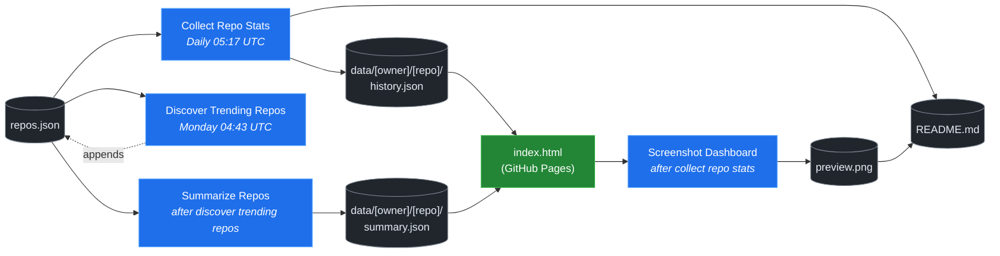

# 🚀 Rising Repos Tracker

> Automatically tracks daily GitHub stats (stars, forks, issues, velocity) for rising open source repos.

[](https://www.telosignal.com/)


**[→ View Live Dashboard](https://patrick-creates.github.io/rising-repos-tracker/)**

Built and maintained by [Telosignal](https://www.telosignal.com/).


<!-- AUTOGEN-STATS-START -->
## 📊 Current snapshot

> Auto-updated daily — last refreshed 2026-06-28

| Metric | Value |
|---|---|
| Repos tracked | **121** |
| Total stars | **6,810,503** |
| Total forks | **1,055,564** |
| Fastest growing | **ponytail** (+2388.2/day) |

### 🔥 Top 5 by velocity

| # | Repo | Stars | Stars/day |
|---|---|---:|---:|
| 1 | [DietrichGebert/ponytail](https://github.com/DietrichGebert/ponytail) | 62,348 | +2388.2 |
| 2 | [chopratejas/headroom](https://github.com/chopratejas/headroom) | 52,736 | +1890.2 |
| 3 | [NousResearch/hermes-agent](https://github.com/NousResearch/hermes-agent) | 204,534 | +1228.0 |
| 4 | [headroomlabs-ai/headroom](https://github.com/headroomlabs-ai/headroom) | 52,736 | +1138.8 |
| 5 | [Panniantong/Agent-Reach](https://github.com/Panniantong/Agent-Reach) | 43,786 | +1015.5 |

### 🆕 Recently added

- [obra/superpowers](https://github.com/obra/superpowers) — added 2026-06-22 — An agentic skills framework & software development methodology that works.
- [DietrichGebert/ponytail](https://github.com/DietrichGebert/ponytail) — added 2026-06-22 — Makes your AI agent think like the laziest senior dev in the room. The best code is the code you never wrote.
- [headroomlabs-ai/headroom](https://github.com/headroomlabs-ai/headroom) — added 2026-06-22 — Compress tool outputs, logs, files, and RAG chunks before they reach the LLM. 60-95% fewer tokens, same answers. Library, proxy, MCP server.
<!-- AUTOGEN-STATS-END -->

<!-- AUTOGEN-DIAGRAM-START -->
## 🔄 How it works


<!-- AUTOGEN-DIAGRAM-END -->

<!-- AUTOGEN-WORKFLOWS-START -->
## ⚙️ Workflows

| File | Schedule | Name |
|---|---|---|
| `collect.yml` | Daily 05:17 UTC | Collect Repo Stats |
| `discover.yml` | Monday 04:43 UTC | Discover Trending Repos |
| `screenshot.yml` | After Collect Repo Stats | Screenshot Dashboard |
| `summarize.yml` | After Discover Trending Repos | Summarize Repos |

> All workflows commit results directly back to the repo. Schedules are best-effort — GitHub Actions cron can drift by a few minutes.
<!-- AUTOGEN-WORKFLOWS-END -->

<!-- AUTOGEN-REPOS-START -->
## 📋 All tracked repos

| Repo | Stars | Forks | Stars/day |
|---|---:|---:|---:|
| [openclaw/openclaw](https://github.com/openclaw/openclaw) | 380,782 | 79,769 | +202.4 |
| [obra/superpowers](https://github.com/obra/superpowers) | 240,252 | 21,328 | +779.2 |
| [affaan-m/everything-claude-code](https://github.com/affaan-m/everything-claude-code) | 222,759 | 34,113 | +906.8 |
| [affaan-m/ECC](https://github.com/affaan-m/ECC) | 222,759 | 34,113 | +897.9 |
| [NousResearch/hermes-agent](https://github.com/NousResearch/hermes-agent) | 204,534 | 36,840 | +1228.0 |
| [Significant-Gravitas/AutoGPT](https://github.com/Significant-Gravitas/AutoGPT) | 185,188 | 46,126 | +19.7 |
| [f/prompts.chat](https://github.com/f/prompts.chat) | 164,447 | 21,288 | +49.5 |
| [microsoft/markitdown](https://github.com/microsoft/markitdown) | 160,237 | 11,249 | +809.3 |
| [langgenius/dify](https://github.com/langgenius/dify) | 146,800 | 23,127 | +121.2 |
| [open-webui/open-webui](https://github.com/open-webui/open-webui) | 143,276 | 20,649 | +138.8 |
| [langchain-ai/langchain](https://github.com/langchain-ai/langchain) | 140,363 | 23,298 | +81.0 |
| [github/spec-kit](https://github.com/github/spec-kit) | 115,983 | 10,247 | +394.0 |
| [microsoft/generative-ai-for-beginners](https://github.com/microsoft/generative-ai-for-beginners) | 112,350 | 60,376 | +34.7 |
| [farion1231/cc-switch](https://github.com/farion1231/cc-switch) | 109,681 | 7,268 | +869.2 |
| [nextlevelbuilder/ui-ux-pro-max-skill](https://github.com/nextlevelbuilder/ui-ux-pro-max-skill) | 97,266 | 10,253 | +421.2 |
| [ChatGPTNextWeb/NextChat](https://github.com/ChatGPTNextWeb/NextChat) | 88,321 | 59,512 | +6.9 |
| [thedotmack/claude-mem](https://github.com/thedotmack/claude-mem) | 84,782 | 7,322 | +204.4 |
| [vllm-project/vllm](https://github.com/vllm-project/vllm) | 84,619 | 18,596 | +102.9 |
| [lobehub/lobehub](https://github.com/lobehub/lobehub) | 79,172 | 15,489 | +47.3 |
| [OpenHands/OpenHands](https://github.com/OpenHands/OpenHands) | 78,533 | 9,997 | +112.2 |
| [JuliusBrussee/caveman](https://github.com/JuliusBrussee/caveman) | 77,481 | 4,388 | +389.5 |
| [dair-ai/Prompt-Engineering-Guide](https://github.com/dair-ai/Prompt-Engineering-Guide) | 76,041 | 8,330 | +32.7 |
| [ruvnet/RuView](https://github.com/ruvnet/RuView) | 75,732 | 10,126 | +289.4 |
| [openai/openai-cookbook](https://github.com/openai/openai-cookbook) | 74,444 | 12,596 | +20.4 |
| [nexu-io/open-design](https://github.com/nexu-io/open-design) | 72,142 | 8,170 | +682.1 |
| [shareAI-lab/learn-claude-code](https://github.com/shareAI-lab/learn-claude-code) | 68,724 | 11,191 | +186.5 |
| [unslothai/unsloth](https://github.com/unslothai/unsloth) | 67,500 | 6,067 | +73.2 |
| [rtk-ai/rtk](https://github.com/rtk-ai/rtk) | 66,642 | 4,120 | +416.2 |
| [xtekky/gpt4free](https://github.com/xtekky/gpt4free) | 66,466 | 13,570 | +5.5 |
| [ComposioHQ/awesome-claude-skills](https://github.com/ComposioHQ/awesome-claude-skills) | 66,164 | 7,354 | +140.9 |
| [code-yeongyu/oh-my-openagent](https://github.com/code-yeongyu/oh-my-openagent) | 63,824 | 5,216 | +134.0 |
| [DietrichGebert/ponytail](https://github.com/DietrichGebert/ponytail) | 62,348 | 3,206 | +2388.2 |
| [datawhalechina/hello-agents](https://github.com/datawhalechina/hello-agents) | 62,311 | 7,703 | +284.2 |
| [shanraisshan/claude-code-best-practice](https://github.com/shanraisshan/claude-code-best-practice) | 61,352 | 6,135 | +191.6 |
| [koala73/worldmonitor](https://github.com/koala73/worldmonitor) | 60,474 | 9,444 | +148.9 |
| [tw93/Pake](https://github.com/tw93/Pake) | 58,215 | 11,631 | +230.1 |
| [Fission-AI/OpenSpec](https://github.com/Fission-AI/OpenSpec) | 57,284 | 3,990 | +207.2 |
| [MemPalace/mempalace](https://github.com/MemPalace/mempalace) | 56,669 | 7,324 | +104.1 |
| [santifer/career-ops](https://github.com/santifer/career-ops) | 56,228 | 11,098 | +267.9 |
| [FlowiseAI/Flowise](https://github.com/FlowiseAI/Flowise) | 54,070 | 24,605 | +28.5 |
| [chopratejas/headroom](https://github.com/chopratejas/headroom) | 52,736 | 3,762 | +1890.2 |
| [headroomlabs-ai/headroom](https://github.com/headroomlabs-ai/headroom) | 52,736 | 3,762 | +1138.8 |
| [Leonxlnx/taste-skill](https://github.com/Leonxlnx/taste-skill) | 52,224 | 3,601 | +807.8 |
| [BerriAI/litellm](https://github.com/BerriAI/litellm) | 51,805 | 9,245 | +107.7 |
| [ggml-org/whisper.cpp](https://github.com/ggml-org/whisper.cpp) | 51,100 | 5,707 | +31.1 |
| [ZhuLinsen/daily_stock_analysis](https://github.com/ZhuLinsen/daily_stock_analysis) | 50,737 | 44,186 | +349.9 |
| [hesreallyhim/awesome-claude-code](https://github.com/hesreallyhim/awesome-claude-code) | 47,490 | 4,146 | +82.8 |
| [mvanhorn/last30days-skill](https://github.com/mvanhorn/last30days-skill) | 47,244 | 3,920 | +728.6 |
| [Aider-AI/aider](https://github.com/Aider-AI/aider) | 46,778 | 4,660 | +44.3 |
| [asgeirtj/system_prompts_leaks](https://github.com/asgeirtj/system_prompts_leaks) | 46,715 | 7,649 | +154.4 |
| [zhayujie/CowAgent](https://github.com/zhayujie/CowAgent) | 45,647 | 10,237 | +26.6 |
| [HKUDS/nanobot](https://github.com/HKUDS/nanobot) | 44,811 | 7,900 | +52.0 |
| [ChromeDevTools/chrome-devtools-mcp](https://github.com/ChromeDevTools/chrome-devtools-mcp) | 44,585 | 2,892 | +114.7 |
| [elder-plinius/CL4R1T4S](https://github.com/elder-plinius/CL4R1T4S) | 44,058 | 8,969 | +397.5 |
| [Panniantong/Agent-Reach](https://github.com/Panniantong/Agent-Reach) | 43,786 | 3,479 | +1015.5 |
| [sickn33/antigravity-awesome-skills](https://github.com/sickn33/antigravity-awesome-skills) | 41,902 | 6,704 | +94.8 |
| [chatboxai/chatbox](https://github.com/chatboxai/chatbox) | 40,688 | 4,126 | +16.9 |
| [QuantumNous/new-api](https://github.com/QuantumNous/new-api) | 40,356 | 9,264 | +147.0 |
| [danny-avila/LibreChat](https://github.com/danny-avila/LibreChat) | 39,919 | 8,171 | +72.1 |
| [Hmbown/CodeWhale](https://github.com/Hmbown/CodeWhale) | 39,103 | 3,373 | +130.4 |
| [chatanywhere/GPT_API_free](https://github.com/chatanywhere/GPT_API_free) | 38,606 | 2,653 | +13.2 |
| [kepano/obsidian-skills](https://github.com/kepano/obsidian-skills) | 38,606 | 2,733 | +174.9 |
| [router-for-me/CLIProxyAPI](https://github.com/router-for-me/CLIProxyAPI) | 38,580 | 6,373 | +112.8 |
| [wshobson/agents](https://github.com/wshobson/agents) | 37,274 | 4,008 | +39.4 |
| [Yeachan-Heo/oh-my-claudecode](https://github.com/Yeachan-Heo/oh-my-claudecode) | 37,090 | 3,350 | +66.6 |
| [google/langextract](https://github.com/google/langextract) | 36,964 | 2,552 | +12.0 |
| [rohitg00/ai-engineering-from-scratch](https://github.com/rohitg00/ai-engineering-from-scratch) | 36,624 | 6,039 | +380.0 |
| [langchain-ai/langgraph](https://github.com/langchain-ai/langgraph) | 35,924 | 6,013 | +84.0 |
| [github/awesome-copilot](https://github.com/github/awesome-copilot) | 35,838 | 4,427 | +59.8 |
| [AstrBotDevs/AstrBot](https://github.com/AstrBotDevs/AstrBot) | 35,480 | 2,452 | +70.0 |
| [songquanpeng/one-api](https://github.com/songquanpeng/one-api) | 35,309 | 6,678 | +32.3 |
| [PDFMathTranslate/PDFMathTranslate](https://github.com/PDFMathTranslate/PDFMathTranslate) | 35,254 | 3,150 | +36.5 |
| [coreyhaines31/marketingskills](https://github.com/coreyhaines31/marketingskills) | 35,252 | 5,761 | +141.3 |
| [jamiepine/voicebox](https://github.com/jamiepine/voicebox) | 35,072 | 4,217 | +224.1 |
| [zeroclaw-labs/zeroclaw](https://github.com/zeroclaw-labs/zeroclaw) | 32,074 | 4,775 | +14.7 |
| [heygen-com/hyperframes](https://github.com/heygen-com/hyperframes) | 31,842 | 2,966 | +314.1 |
| [anthropics/claude-plugins-official](https://github.com/anthropics/claude-plugins-official) | 31,229 | 3,405 | +82.1 |
| [Gitlawb/openclaude](https://github.com/Gitlawb/openclaude) | 29,475 | 8,830 | +49.6 |
| [googleworkspace/cli](https://github.com/googleworkspace/cli) | 29,008 | 1,640 | +84.8 |
| [iOfficeAI/AionUi](https://github.com/iOfficeAI/AionUi) | 28,975 | 2,875 | +60.3 |
| [voideditor/void](https://github.com/voideditor/void) | 28,818 | 2,564 | +0.5 |
| [AlexsJones/llmfit](https://github.com/AlexsJones/llmfit) | 28,690 | 1,764 | +62.6 |
| [BloopAI/vibe-kanban](https://github.com/BloopAI/vibe-kanban) | 27,184 | 2,871 | +17.6 |
| [usestrix/strix](https://github.com/usestrix/strix) | 26,328 | 2,963 | +22.9 |
| [volcengine/OpenViking](https://github.com/volcengine/OpenViking) | 26,119 | 2,028 | +39.5 |
| [jarrodwatts/claude-hud](https://github.com/jarrodwatts/claude-hud) | 25,853 | 1,180 | +58.1 |
| [zai-org/Open-AutoGLM](https://github.com/zai-org/Open-AutoGLM) | 25,627 | 3,993 | +8.3 |
| [p-e-w/heretic](https://github.com/p-e-w/heretic) | 25,552 | 2,756 | +79.0 |
| [jackwener/OpenCLI](https://github.com/jackwener/OpenCLI) | 25,491 | 2,528 | +84.5 |
| [langchain-ai/deepagents](https://github.com/langchain-ai/deepagents) | 25,212 | 3,560 | +52.9 |
| [esengine/DeepSeek-Reasonix](https://github.com/esengine/DeepSeek-Reasonix) | 25,162 | 1,532 | +281.8 |
| [toon-format/toon](https://github.com/toon-format/toon) | 24,702 | 1,094 | +10.3 |
| [rohitg00/agentmemory](https://github.com/rohitg00/agentmemory) | 24,174 | 1,989 | +117.5 |
| [JCodesMore/ai-website-cloner-template](https://github.com/JCodesMore/ai-website-cloner-template) | 22,375 | 3,200 | +414.0 |
| [mukul975/Anthropic-Cybersecurity-Skills](https://github.com/mukul975/Anthropic-Cybersecurity-Skills) | 22,338 | 2,553 | +702.7 |
| [winfunc/opcode](https://github.com/winfunc/opcode) | 22,122 | 1,713 | +5.8 |
| [coze-dev/coze-studio](https://github.com/coze-dev/coze-studio) | 21,063 | 3,064 | +5.8 |
| [NirDiamant/agents-towards-production](https://github.com/NirDiamant/agents-towards-production) | 20,869 | 2,770 | +11.8 |
| [alibaba/page-agent](https://github.com/alibaba/page-agent) | 20,411 | 1,761 | +142.5 |
| [agentscope-ai/QwenPaw](https://github.com/agentscope-ai/QwenPaw) | 20,234 | 2,689 | +188.9 |
| [tirth8205/code-review-graph](https://github.com/tirth8205/code-review-graph) | 18,961 | 2,033 | +34.4 |
| [decolua/9router](https://github.com/decolua/9router) | 18,643 | 3,008 | +82.5 |
| [tanweai/pua](https://github.com/tanweai/pua) | 18,482 | 1,112 | +18.2 |
| [mksglu/context-mode](https://github.com/mksglu/context-mode) | 18,276 | 1,284 | +62.2 |
| [RightNow-AI/openfang](https://github.com/RightNow-AI/openfang) | 17,940 | 2,273 | +8.8 |
| [Tencent/WeKnora](https://github.com/Tencent/WeKnora) | 17,432 | 2,288 | +87.7 |
| [datawhalechina/easy-vibe](https://github.com/datawhalechina/easy-vibe) | 17,393 | 1,639 | +34.8 |
| [microsoft/agent-lightning](https://github.com/microsoft/agent-lightning) | 17,351 | 1,521 | +3.1 |
| [jundot/omlx](https://github.com/jundot/omlx) | 17,179 | 1,458 | +42.1 |
| [danielmiessler/LifeOS](https://github.com/danielmiessler/LifeOS) | 16,159 | 2,222 | +15.5 |
| [cft0808/edict](https://github.com/cft0808/edict) | 16,126 | 1,698 | +4.9 |
| [jnMetaCode/agency-agents-zh](https://github.com/jnMetaCode/agency-agents-zh) | 15,767 | 2,728 | +60.2 |
| [MemoriLabs/Memori](https://github.com/MemoriLabs/Memori) | 15,481 | 2,740 | +23.0 |
| [steipete/CodexBar](https://github.com/steipete/CodexBar) | 15,466 | 1,278 | +43.8 |
| [nesquena/hermes-webui](https://github.com/nesquena/hermes-webui) | 15,116 | 1,941 | +46.3 |
| [can1357/oh-my-pi](https://github.com/can1357/oh-my-pi) | 14,922 | 1,324 | +154.3 |
| [xpzouying/xiaohongshu-mcp](https://github.com/xpzouying/xiaohongshu-mcp) | 14,398 | 2,148 | +18.5 |
| [yusufkaraaslan/Skill_Seekers](https://github.com/yusufkaraaslan/Skill_Seekers) | 14,288 | 1,464 | +10.3 |
| [kyegomez/OpenMythos](https://github.com/kyegomez/OpenMythos) | 14,277 | 3,199 | +20.3 |
| [NevaMind-AI/memU](https://github.com/NevaMind-AI/memU) | 13,940 | 1,037 | +6.7 |
| [frankbria/ralph-claude-code](https://github.com/frankbria/ralph-claude-code) | 9,471 | 723 | +7.8 |
<!-- AUTOGEN-REPOS-END -->

---

## What it does

- Collects daily snapshots of stars, forks, watchers and open issues for every tracked repo
- Discovers new trending repos automatically every Monday using the GitHub Search API
- Generates AI summaries (use cases, similar tools, tags) for each tracked repo via GitHub Models
- Stores all history as plain JSON — no database, no backend
- Renders a live dashboard via GitHub Pages — updates daily, zero maintenance

## Tracked repos

Data lives in [`data/`](./data) — one folder per repo, one `history.json` per entry.  
The full watch list is in [`repos.json`](./repos.json).

## Fork & use it for yourself

This is my personal tracker — the watch list reflects what I find interesting. If you want to track different repos, the best path is to **fork this repo and run your own**.

### Setup

1. Fork this repo to your account
2. Replace the contents of [`repos.json`](./repos.json) with the repos you want to track (or just leave one entry — `discover.yml` will auto-add more every Monday)
3. Go to **Settings → Pages** and enable GitHub Pages from the `main` branch
4. Go to **Actions** and run **Collect Repo Stats** once manually to seed your first data point
5. Your dashboard will be live at `https://YOUR-USERNAME.github.io/rising-repos-tracker/`

That's it — daily collection and weekly discovery run automatically on schedule. Zero ongoing maintenance.

### Customizing what gets discovered

Edit [`scripts/discover.js`](./scripts/discover.js) to change:

- `MIN_STARS` — minimum star threshold for candidates
- `MAX_AGE_DAYS` — how recent a repo must be
- `MAX_NEW_REPOS` — how many to add per discovery run
- The `queries` array — GitHub Search API queries that define what "trending" means to you

### Adding a repo manually

Just edit `repos.json` directly:

```json
{
  "owner": "OWNER",
  "repo": "REPO",
  "added": "YYYY-MM-DD",
  "notes": "why you're tracking this"
}
```

The next daily collect run picks it up automatically.

## Stack

- **GitHub Actions** — scheduling and automation
- **GitHub Pages** — dashboard hosting
- **GitHub API** — data source
- **GitHub Models** — free AI summaries (gpt-4o-mini)
- **Chart.js** — star growth visualization
- **Mermaid** — architecture diagram (rendered by GitHub)
- No dependencies, no build step, no database

## License

MIT
