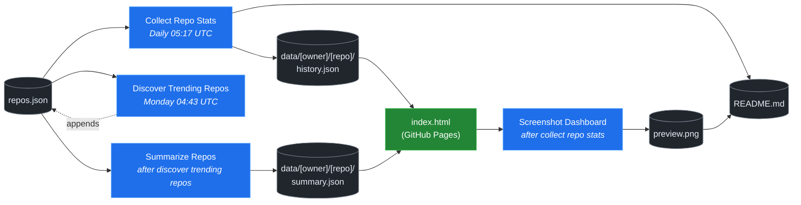

# 🚀 Rising Repos Tracker

> Automatically tracks daily GitHub stats (stars, forks, issues, velocity) for rising open source repos.

[](https://www.telosignal.com/)


**[→ View Live Dashboard](https://patrick-creates.github.io/rising-repos-tracker/)**

Built and maintained by [Telosignal](https://www.telosignal.com/).


<!-- AUTOGEN-STATS-START -->
## 📊 Current snapshot

> Auto-updated daily — last refreshed 2026-05-22

| Metric | Value |
|---|---|
| Repos tracked | **46** |
| Total stars | **3,832,307** |
| Total forks | **667,238** |
| Fastest growing | **hermes-agent** (+1568.7/day) |

### 🔥 Top 5 by velocity

| # | Repo | Stars | Stars/day |
|---|---|---:|---:|
| 1 | [NousResearch/hermes-agent](https://github.com/NousResearch/hermes-agent) | 162,163 | +1568.7 |
| 2 | [nexu-io/open-design](https://github.com/nexu-io/open-design) | 49,299 | +1281.3 |
| 3 | [farion1231/cc-switch](https://github.com/farion1231/cc-switch) | 77,756 | +928.0 |
| 4 | [affaan-m/everything-claude-code](https://github.com/affaan-m/everything-claude-code) | 188,312 | +807.1 |
| 5 | [github/spec-kit](https://github.com/github/spec-kit) | 104,669 | +756.4 |

### 🆕 Recently added

- [ChatGPTNextWeb/NextChat](https://github.com/ChatGPTNextWeb/NextChat) — added 2026-05-18 — ✨ Light and Fast AI Assistant. Support: Web | iOS | MacOS | Android |  Linux | Windows
- [dair-ai/Prompt-Engineering-Guide](https://github.com/dair-ai/Prompt-Engineering-Guide) — added 2026-05-18 — 🐙 Guides, papers, lessons, notebooks and resources for prompt engineering, context engineering, RAG, and AI Agents.
- [farion1231/cc-switch](https://github.com/farion1231/cc-switch) — added 2026-05-18 — A cross-platform desktop All-in-One assistant for Claude Code, Codex, OpenCode, OpenClaw, Gemini CLI & Hermes Agent. Only official website: ccswitch.io
<!-- AUTOGEN-STATS-END -->

<!-- AUTOGEN-DIAGRAM-START -->
## 🔄 How it works


<!-- AUTOGEN-DIAGRAM-END -->

<!-- AUTOGEN-WORKFLOWS-START -->
## ⚙️ Workflows

| File | Schedule | Name |
|---|---|---|
| `collect.yml` | Daily 05:17 UTC | Collect Repo Stats |
| `discover.yml` | Monday 04:43 UTC | Discover Trending Repos |
| `screenshot.yml` | After Collect Repo Stats | Screenshot Dashboard |
| `summarize.yml` | After Discover Trending Repos | Summarize Repos |

> All workflows commit results directly back to the repo. Schedules are best-effort — GitHub Actions cron can drift by a few minutes.
<!-- AUTOGEN-WORKFLOWS-END -->

<!-- AUTOGEN-REPOS-START -->
## 📋 All tracked repos

| Repo | Stars | Forks | Stars/day |
|---|---:|---:|---:|
| [openclaw/openclaw](https://github.com/openclaw/openclaw) | 373,843 | 77,673 | +263.6 |
| [affaan-m/everything-claude-code](https://github.com/affaan-m/everything-claude-code) | 188,312 | 29,149 | +807.1 |
| [Significant-Gravitas/AutoGPT](https://github.com/Significant-Gravitas/AutoGPT) | 184,448 | 46,228 | +18.6 |
| [f/prompts.chat](https://github.com/f/prompts.chat) | 162,652 | 21,164 | +53.3 |
| [NousResearch/hermes-agent](https://github.com/NousResearch/hermes-agent) | 162,163 | 26,433 | +1568.7 |
| [langgenius/dify](https://github.com/langgenius/dify) | 142,241 | 22,369 | +112.9 |
| [open-webui/open-webui](https://github.com/open-webui/open-webui) | 138,183 | 19,763 | +143.4 |
| [langchain-ai/langchain](https://github.com/langchain-ai/langchain) | 137,355 | 22,723 | +80.0 |
| [microsoft/markitdown](https://github.com/microsoft/markitdown) | 124,515 | 8,464 | +167.4 |
| [microsoft/generative-ai-for-beginners](https://github.com/microsoft/generative-ai-for-beginners) | 111,240 | 59,660 | +54.2 |
| [github/spec-kit](https://github.com/github/spec-kit) | 104,669 | 9,229 | +756.4 |
| [ChatGPTNextWeb/NextChat](https://github.com/ChatGPTNextWeb/NextChat) | 88,068 | 59,704 | +7.8 |
| [nextlevelbuilder/ui-ux-pro-max-skill](https://github.com/nextlevelbuilder/ui-ux-pro-max-skill) | 81,498 | 8,382 | +400.6 |
| [vllm-project/vllm](https://github.com/vllm-project/vllm) | 80,704 | 17,090 | +91.1 |
| [farion1231/cc-switch](https://github.com/farion1231/cc-switch) | 77,756 | 5,059 | +928.0 |
| [lobehub/lobehub](https://github.com/lobehub/lobehub) | 77,512 | 15,256 | +57.1 |
| [thedotmack/claude-mem](https://github.com/thedotmack/claude-mem) | 77,367 | 6,661 | +220.8 |
| [dair-ai/Prompt-Engineering-Guide](https://github.com/dair-ai/Prompt-Engineering-Guide) | 74,851 | 8,105 | +37.5 |
| [OpenHands/OpenHands](https://github.com/OpenHands/OpenHands) | 74,481 | 9,439 | +137.3 |
| [openai/openai-cookbook](https://github.com/openai/openai-cookbook) | 73,688 | 12,461 | +19.8 |
| [xtekky/gpt4free](https://github.com/xtekky/gpt4free) | 66,262 | 13,589 | +5.3 |
| [unslothai/unsloth](https://github.com/unslothai/unsloth) | 64,949 | 5,754 | +112.3 |
| [JuliusBrussee/caveman](https://github.com/JuliusBrussee/caveman) | 63,437 | 3,563 | +481.3 |
| [shareAI-lab/learn-claude-code](https://github.com/shareAI-lab/learn-claude-code) | 61,955 | 10,115 | +219.5 |
| [ComposioHQ/awesome-claude-skills](https://github.com/ComposioHQ/awesome-claude-skills) | 61,189 | 6,667 | +200.3 |
| [code-yeongyu/oh-my-openagent](https://github.com/code-yeongyu/oh-my-openagent) | 58,977 | 4,794 | +162.3 |
| [koala73/worldmonitor](https://github.com/koala73/worldmonitor) | 54,678 | 8,812 | +77.5 |
| [shanraisshan/claude-code-best-practice](https://github.com/shanraisshan/claude-code-best-practice) | 54,339 | 5,451 | +210.3 |
| [FlowiseAI/Flowise](https://github.com/FlowiseAI/Flowise) | 52,996 | 24,373 | +24.0 |
| [MemPalace/mempalace](https://github.com/MemPalace/mempalace) | 52,646 | 6,946 | +61.5 |
| [rtk-ai/rtk](https://github.com/rtk-ai/rtk) | 52,566 | 3,190 | +747.0 |
| [datawhalechina/hello-agents](https://github.com/datawhalechina/hello-agents) | 52,341 | 6,367 | +420.3 |
| [ggml-org/whisper.cpp](https://github.com/ggml-org/whisper.cpp) | 49,992 | 5,561 | +41.5 |
| [Fission-AI/OpenSpec](https://github.com/Fission-AI/OpenSpec) | 49,940 | 3,502 | +288.0 |
| [nexu-io/open-design](https://github.com/nexu-io/open-design) | 49,299 | 5,605 | +1281.3 |
| [tw93/Pake](https://github.com/tw93/Pake) | 48,878 | 9,881 | +24.8 |
| [BerriAI/litellm](https://github.com/BerriAI/litellm) | 47,909 | 8,250 | +130.3 |
| [santifer/career-ops](https://github.com/santifer/career-ops) | 46,601 | 9,743 | +338.8 |
| [Aider-AI/aider](https://github.com/Aider-AI/aider) | 45,136 | 4,457 | +43.8 |
| [zhayujie/CowAgent](https://github.com/zhayujie/CowAgent) | 44,708 | 10,121 | +38.3 |
| [hesreallyhim/awesome-claude-code](https://github.com/hesreallyhim/awesome-claude-code) | 44,496 | 3,828 | +100.3 |
| [HKUDS/nanobot](https://github.com/HKUDS/nanobot) | 42,974 | 7,571 | +73.5 |
| [ChromeDevTools/chrome-devtools-mcp](https://github.com/ChromeDevTools/chrome-devtools-mcp) | 40,677 | 2,579 | +198.3 |
| [asgeirtj/system_prompts_leaks](https://github.com/asgeirtj/system_prompts_leaks) | 40,582 | 6,741 | +49.3 |
| [chatboxai/chatbox](https://github.com/chatboxai/chatbox) | 40,054 | 4,067 | +14.5 |
| [frankbria/ralph-claude-code](https://github.com/frankbria/ralph-claude-code) | 9,180 | 699 | +7.6 |
<!-- AUTOGEN-REPOS-END -->

---

## What it does

- Collects daily snapshots of stars, forks, watchers and open issues for every tracked repo
- Discovers new trending repos automatically every Monday using the GitHub Search API
- Generates AI summaries (use cases, similar tools, tags) for each tracked repo via GitHub Models
- Stores all history as plain JSON — no database, no backend
- Renders a live dashboard via GitHub Pages — updates daily, zero maintenance

## Tracked repos

Data lives in [`data/`](./data) — one folder per repo, one `history.json` per entry.  
The full watch list is in [`repos.json`](./repos.json).

## Fork & use it for yourself

This is my personal tracker — the watch list reflects what I find interesting. If you want to track different repos, the best path is to **fork this repo and run your own**.

### Setup

1. Fork this repo to your account
2. Replace the contents of [`repos.json`](./repos.json) with the repos you want to track (or just leave one entry — `discover.yml` will auto-add more every Monday)
3. Go to **Settings → Pages** and enable GitHub Pages from the `main` branch
4. Go to **Actions** and run **Collect Repo Stats** once manually to seed your first data point
5. Your dashboard will be live at `https://YOUR-USERNAME.github.io/rising-repos-tracker/`

That's it — daily collection and weekly discovery run automatically on schedule. Zero ongoing maintenance.

### Customizing what gets discovered

Edit [`scripts/discover.js`](./scripts/discover.js) to change:

- `MIN_STARS` — minimum star threshold for candidates
- `MAX_AGE_DAYS` — how recent a repo must be
- `MAX_NEW_REPOS` — how many to add per discovery run
- The `queries` array — GitHub Search API queries that define what "trending" means to you

### Adding a repo manually

Just edit `repos.json` directly:

```json
{
  "owner": "OWNER",
  "repo": "REPO",
  "added": "YYYY-MM-DD",
  "notes": "why you're tracking this"
}
```

The next daily collect run picks it up automatically.

## Stack

- **GitHub Actions** — scheduling and automation
- **GitHub Pages** — dashboard hosting
- **GitHub API** — data source
- **GitHub Models** — free AI summaries (gpt-4o-mini)
- **Chart.js** — star growth visualization
- **Mermaid** — architecture diagram (rendered by GitHub)
- No dependencies, no build step, no database

## License

MIT
