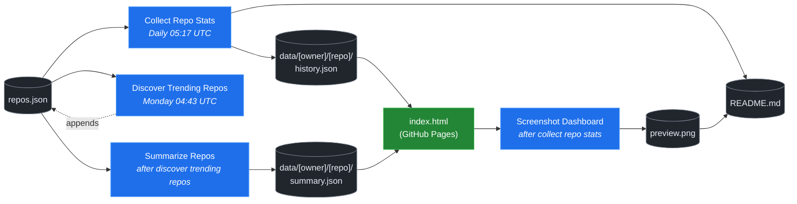

# 🚀 Rising Repos Tracker

> Automatically tracks daily GitHub stats (stars, forks, issues, velocity) for rising open source repos.

[](https://www.telosignal.com/)


**[→ View Live Dashboard](https://patrick-creates.github.io/rising-repos-tracker/)**

Built and maintained by [Telosignal](https://www.telosignal.com/).


<!-- AUTOGEN-STATS-START -->
## 📊 Current snapshot

> Auto-updated daily — last refreshed 2026-05-24

| Metric | Value |
|---|---|
| Repos tracked | **46** |
| Total stars | **3,848,469** |
| Total forks | **669,657** |
| Fastest growing | **hermes-agent** (+1525.0/day) |

### 🔥 Top 5 by velocity

| # | Repo | Stars | Stars/day |
|---|---|---:|---:|
| 1 | [NousResearch/hermes-agent](https://github.com/NousResearch/hermes-agent) | 164,820 | +1525.0 |
| 2 | [nexu-io/open-design](https://github.com/nexu-io/open-design) | 50,835 | +1110.2 |
| 3 | [farion1231/cc-switch](https://github.com/farion1231/cc-switch) | 79,204 | +860.0 |
| 4 | [affaan-m/everything-claude-code](https://github.com/affaan-m/everything-claude-code) | 189,450 | +763.8 |
| 5 | [github/spec-kit](https://github.com/github/spec-kit) | 105,383 | +683.8 |

### 🆕 Recently added

- [ChatGPTNextWeb/NextChat](https://github.com/ChatGPTNextWeb/NextChat) — added 2026-05-18 — ✨ Light and Fast AI Assistant. Support: Web | iOS | MacOS | Android |  Linux | Windows
- [dair-ai/Prompt-Engineering-Guide](https://github.com/dair-ai/Prompt-Engineering-Guide) — added 2026-05-18 — 🐙 Guides, papers, lessons, notebooks and resources for prompt engineering, context engineering, RAG, and AI Agents.
- [farion1231/cc-switch](https://github.com/farion1231/cc-switch) — added 2026-05-18 — A cross-platform desktop All-in-One assistant for Claude Code, Codex, OpenCode, OpenClaw, Gemini CLI & Hermes Agent. Only official website: ccswitch.io
<!-- AUTOGEN-STATS-END -->

<!-- AUTOGEN-DIAGRAM-START -->
## 🔄 How it works


<!-- AUTOGEN-DIAGRAM-END -->

<!-- AUTOGEN-WORKFLOWS-START -->
## ⚙️ Workflows

| File | Schedule | Name |
|---|---|---|
| `collect.yml` | Daily 05:17 UTC | Collect Repo Stats |
| `discover.yml` | Monday 04:43 UTC | Discover Trending Repos |
| `screenshot.yml` | After Collect Repo Stats | Screenshot Dashboard |
| `summarize.yml` | After Discover Trending Repos | Summarize Repos |

> All workflows commit results directly back to the repo. Schedules are best-effort — GitHub Actions cron can drift by a few minutes.
<!-- AUTOGEN-WORKFLOWS-END -->

<!-- AUTOGEN-REPOS-START -->
## 📋 All tracked repos

| Repo | Stars | Forks | Stars/day |
|---|---:|---:|---:|
| [openclaw/openclaw](https://github.com/openclaw/openclaw) | 374,247 | 77,828 | +252.4 |
| [affaan-m/everything-claude-code](https://github.com/affaan-m/everything-claude-code) | 189,450 | 29,306 | +763.8 |
| [Significant-Gravitas/AutoGPT](https://github.com/Significant-Gravitas/AutoGPT) | 184,490 | 46,225 | +19.0 |
| [NousResearch/hermes-agent](https://github.com/NousResearch/hermes-agent) | 164,820 | 27,105 | +1525.0 |
| [f/prompts.chat](https://github.com/f/prompts.chat) | 162,738 | 21,171 | +51.5 |
| [langgenius/dify](https://github.com/langgenius/dify) | 142,406 | 22,409 | +107.4 |
| [open-webui/open-webui](https://github.com/open-webui/open-webui) | 138,406 | 19,798 | +137.6 |
| [langchain-ai/langchain](https://github.com/langchain-ai/langchain) | 137,508 | 22,755 | +79.4 |
| [microsoft/markitdown](https://github.com/microsoft/markitdown) | 124,882 | 8,493 | +170.4 |
| [microsoft/generative-ai-for-beginners](https://github.com/microsoft/generative-ai-for-beginners) | 111,325 | 59,702 | +52.1 |
| [github/spec-kit](https://github.com/github/spec-kit) | 105,383 | 9,305 | +683.8 |
| [ChatGPTNextWeb/NextChat](https://github.com/ChatGPTNextWeb/NextChat) | 88,071 | 59,699 | +5.7 |
| [nextlevelbuilder/ui-ux-pro-max-skill](https://github.com/nextlevelbuilder/ui-ux-pro-max-skill) | 82,091 | 8,459 | +381.6 |
| [vllm-project/vllm](https://github.com/vllm-project/vllm) | 80,840 | 17,150 | +86.9 |
| [farion1231/cc-switch](https://github.com/farion1231/cc-switch) | 79,204 | 5,171 | +860.0 |
| [thedotmack/claude-mem](https://github.com/thedotmack/claude-mem) | 77,732 | 6,695 | +213.8 |
| [lobehub/lobehub](https://github.com/lobehub/lobehub) | 77,613 | 15,271 | +55.9 |
| [dair-ai/Prompt-Engineering-Guide](https://github.com/dair-ai/Prompt-Engineering-Guide) | 74,913 | 8,114 | +35.3 |
| [OpenHands/OpenHands](https://github.com/OpenHands/OpenHands) | 74,690 | 9,460 | +126.3 |
| [openai/openai-cookbook](https://github.com/openai/openai-cookbook) | 73,731 | 12,471 | +20.3 |
| [xtekky/gpt4free](https://github.com/xtekky/gpt4free) | 66,276 | 13,591 | +5.8 |
| [unslothai/unsloth](https://github.com/unslothai/unsloth) | 65,046 | 5,768 | +91.0 |
| [JuliusBrussee/caveman](https://github.com/JuliusBrussee/caveman) | 64,108 | 3,610 | +432.7 |
| [shareAI-lab/learn-claude-code](https://github.com/shareAI-lab/learn-claude-code) | 62,243 | 10,168 | +194.3 |
| [ComposioHQ/awesome-claude-skills](https://github.com/ComposioHQ/awesome-claude-skills) | 61,495 | 6,710 | +184.5 |
| [code-yeongyu/oh-my-openagent](https://github.com/code-yeongyu/oh-my-openagent) | 59,196 | 4,825 | +144.7 |
| [koala73/worldmonitor](https://github.com/koala73/worldmonitor) | 54,822 | 8,820 | +75.7 |
| [shanraisshan/claude-code-best-practice](https://github.com/shanraisshan/claude-code-best-practice) | 54,594 | 5,473 | +182.7 |
| [rtk-ai/rtk](https://github.com/rtk-ai/rtk) | 53,375 | 3,261 | +632.8 |
| [FlowiseAI/Flowise](https://github.com/FlowiseAI/Flowise) | 53,039 | 24,386 | +23.2 |
| [datawhalechina/hello-agents](https://github.com/datawhalechina/hello-agents) | 52,783 | 6,426 | +353.8 |
| [MemPalace/mempalace](https://github.com/MemPalace/mempalace) | 52,739 | 6,958 | +56.5 |
| [nexu-io/open-design](https://github.com/nexu-io/open-design) | 50,835 | 5,795 | +1110.2 |
| [Fission-AI/OpenSpec](https://github.com/Fission-AI/OpenSpec) | 50,304 | 3,527 | +252.7 |
| [ggml-org/whisper.cpp](https://github.com/ggml-org/whisper.cpp) | 50,054 | 5,567 | +38.0 |
| [tw93/Pake](https://github.com/tw93/Pake) | 48,921 | 9,901 | +23.7 |
| [BerriAI/litellm](https://github.com/BerriAI/litellm) | 48,055 | 8,298 | +111.2 |
| [santifer/career-ops](https://github.com/santifer/career-ops) | 46,940 | 9,797 | +282.3 |
| [Aider-AI/aider](https://github.com/Aider-AI/aider) | 45,223 | 4,471 | +43.7 |
| [zhayujie/CowAgent](https://github.com/zhayujie/CowAgent) | 44,765 | 10,128 | +35.0 |
| [hesreallyhim/awesome-claude-code](https://github.com/hesreallyhim/awesome-claude-code) | 44,654 | 3,844 | +93.2 |
| [HKUDS/nanobot](https://github.com/HKUDS/nanobot) | 43,060 | 7,588 | +63.3 |
| [ChromeDevTools/chrome-devtools-mcp](https://github.com/ChromeDevTools/chrome-devtools-mcp) | 41,435 | 2,629 | +258.5 |
| [asgeirtj/system_prompts_leaks](https://github.com/asgeirtj/system_prompts_leaks) | 40,688 | 6,761 | +50.5 |
| [chatboxai/chatbox](https://github.com/chatboxai/chatbox) | 40,091 | 4,067 | +15.8 |
| [frankbria/ralph-claude-code](https://github.com/frankbria/ralph-claude-code) | 9,188 | 701 | +6.9 |
<!-- AUTOGEN-REPOS-END -->

---

## What it does

- Collects daily snapshots of stars, forks, watchers and open issues for every tracked repo
- Discovers new trending repos automatically every Monday using the GitHub Search API
- Generates AI summaries (use cases, similar tools, tags) for each tracked repo via GitHub Models
- Stores all history as plain JSON — no database, no backend
- Renders a live dashboard via GitHub Pages — updates daily, zero maintenance

## Tracked repos

Data lives in [`data/`](./data) — one folder per repo, one `history.json` per entry.  
The full watch list is in [`repos.json`](./repos.json).

## Fork & use it for yourself

This is my personal tracker — the watch list reflects what I find interesting. If you want to track different repos, the best path is to **fork this repo and run your own**.

### Setup

1. Fork this repo to your account
2. Replace the contents of [`repos.json`](./repos.json) with the repos you want to track (or just leave one entry — `discover.yml` will auto-add more every Monday)
3. Go to **Settings → Pages** and enable GitHub Pages from the `main` branch
4. Go to **Actions** and run **Collect Repo Stats** once manually to seed your first data point
5. Your dashboard will be live at `https://YOUR-USERNAME.github.io/rising-repos-tracker/`

That's it — daily collection and weekly discovery run automatically on schedule. Zero ongoing maintenance.

### Customizing what gets discovered

Edit [`scripts/discover.js`](./scripts/discover.js) to change:

- `MIN_STARS` — minimum star threshold for candidates
- `MAX_AGE_DAYS` — how recent a repo must be
- `MAX_NEW_REPOS` — how many to add per discovery run
- The `queries` array — GitHub Search API queries that define what "trending" means to you

### Adding a repo manually

Just edit `repos.json` directly:

```json
{
  "owner": "OWNER",
  "repo": "REPO",
  "added": "YYYY-MM-DD",
  "notes": "why you're tracking this"
}
```

The next daily collect run picks it up automatically.

## Stack

- **GitHub Actions** — scheduling and automation
- **GitHub Pages** — dashboard hosting
- **GitHub API** — data source
- **GitHub Models** — free AI summaries (gpt-4o-mini)
- **Chart.js** — star growth visualization
- **Mermaid** — architecture diagram (rendered by GitHub)
- No dependencies, no build step, no database

## License

MIT
