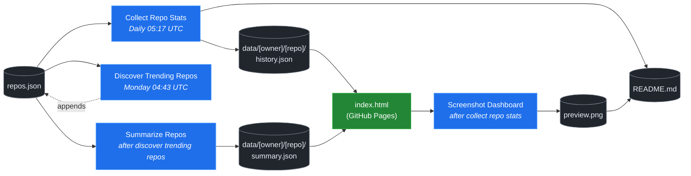

# 🚀 Rising Repos Tracker

> Automatically tracks daily GitHub stats (stars, forks, issues, velocity) for rising open source repos.

[](https://www.telosignal.com/)


**[→ View Live Dashboard](https://patrick-creates.github.io/rising-repos-tracker/)**

Built and maintained by [Telosignal](https://www.telosignal.com/).


<!-- AUTOGEN-STATS-START -->
## 📊 Current snapshot

> Auto-updated daily — last refreshed 2026-06-17

| Metric | Value |
|---|---|
| Repos tracked | **106** |
| Total stars | **6,044,498** |
| Total forks | **971,467** |
| Fastest growing | **hermes-agent** (+1363.3/day) |

### 🔥 Top 5 by velocity

| # | Repo | Stars | Stars/day |
|---|---|---:|---:|
| 1 | [NousResearch/hermes-agent](https://github.com/NousResearch/hermes-agent) | 195,762 | +1363.3 |
| 2 | [mvanhorn/last30days-skill](https://github.com/mvanhorn/last30days-skill) | 43,727 | +1228.4 |
| 3 | [elder-plinius/CL4R1T4S](https://github.com/elder-plinius/CL4R1T4S) | 41,249 | +1179.0 |
| 4 | [chopratejas/headroom](https://github.com/chopratejas/headroom) | 30,499 | +1168.0 |
| 5 | [affaan-m/ECC](https://github.com/affaan-m/ECC) | 216,976 | +1076.0 |

### 🆕 Recently added

- [elder-plinius/CL4R1T4S](https://github.com/elder-plinius/CL4R1T4S) — added 2026-06-15 — LEAKED SYSTEM PROMPTS FOR CHATGPT, CLAUDE, GEMINI, GROK, PERPLEXITY, CURSOR, LOVABLE, REPLIT, AND MORE! - AI SYSTEMS TRANSPARENCY FOR ALL! 👐
- [chopratejas/headroom](https://github.com/chopratejas/headroom) — added 2026-06-15 — Compress tool outputs, logs, files, and RAG chunks before they reach the LLM. 60-95% fewer tokens, same answers. Library, proxy, MCP server.
- [alibaba/page-agent](https://github.com/alibaba/page-agent) — added 2026-06-15 — JavaScript in-page GUI agent. Control web interfaces with natural language.
<!-- AUTOGEN-STATS-END -->

<!-- AUTOGEN-DIAGRAM-START -->
## 🔄 How it works


<!-- AUTOGEN-DIAGRAM-END -->

<!-- AUTOGEN-WORKFLOWS-START -->
## ⚙️ Workflows

| File | Schedule | Name |
|---|---|---|
| `collect.yml` | Daily 05:17 UTC | Collect Repo Stats |
| `discover.yml` | Monday 04:43 UTC | Discover Trending Repos |
| `screenshot.yml` | After Collect Repo Stats | Screenshot Dashboard |
| `summarize.yml` | After Discover Trending Repos | Summarize Repos |

> All workflows commit results directly back to the repo. Schedules are best-effort — GitHub Actions cron can drift by a few minutes.
<!-- AUTOGEN-WORKFLOWS-END -->

<!-- AUTOGEN-REPOS-START -->
## 📋 All tracked repos

| Repo | Stars | Forks | Stars/day |
|---|---:|---:|---:|
| [openclaw/openclaw](https://github.com/openclaw/openclaw) | 379,127 | 79,351 | +218.7 |
| [affaan-m/everything-claude-code](https://github.com/affaan-m/everything-claude-code) | 216,976 | 33,320 | +1026.5 |
| [affaan-m/ECC](https://github.com/affaan-m/ECC) | 216,976 | 33,320 | +1076.0 |
| [NousResearch/hermes-agent](https://github.com/NousResearch/hermes-agent) | 195,762 | 34,396 | +1363.3 |
| [Significant-Gravitas/AutoGPT](https://github.com/Significant-Gravitas/AutoGPT) | 184,987 | 46,135 | +20.2 |
| [f/prompts.chat](https://github.com/f/prompts.chat) | 163,839 | 21,248 | +47.6 |
| [microsoft/markitdown](https://github.com/microsoft/markitdown) | 154,924 | 10,736 | +911.9 |
| [langgenius/dify](https://github.com/langgenius/dify) | 145,593 | 22,906 | +124.8 |
| [open-webui/open-webui](https://github.com/open-webui/open-webui) | 141,953 | 20,400 | +144.6 |
| [langchain-ai/langchain](https://github.com/langchain-ai/langchain) | 139,537 | 23,124 | +82.9 |
| [github/spec-kit](https://github.com/github/spec-kit) | 112,852 | 9,961 | +428.3 |
| [microsoft/generative-ai-for-beginners](https://github.com/microsoft/generative-ai-for-beginners) | 112,088 | 60,204 | +38.2 |
| [farion1231/cc-switch](https://github.com/farion1231/cc-switch) | 103,133 | 6,824 | +969.6 |
| [nextlevelbuilder/ui-ux-pro-max-skill](https://github.com/nextlevelbuilder/ui-ux-pro-max-skill) | 92,843 | 9,693 | +427.1 |
| [ChatGPTNextWeb/NextChat](https://github.com/ChatGPTNextWeb/NextChat) | 88,263 | 59,560 | +7.5 |
| [vllm-project/vllm](https://github.com/vllm-project/vllm) | 83,138 | 18,141 | +93.0 |
| [thedotmack/claude-mem](https://github.com/thedotmack/claude-mem) | 82,889 | 7,179 | +214.5 |
| [lobehub/lobehub](https://github.com/lobehub/lobehub) | 78,767 | 15,448 | +50.5 |
| [OpenHands/OpenHands](https://github.com/OpenHands/OpenHands) | 77,477 | 9,850 | +118.2 |
| [dair-ai/Prompt-Engineering-Guide](https://github.com/dair-ai/Prompt-Engineering-Guide) | 75,699 | 8,226 | +33.3 |
| [ruvnet/RuView](https://github.com/ruvnet/RuView) | 74,295 | 9,908 | +365.3 |
| [openai/openai-cookbook](https://github.com/openai/openai-cookbook) | 74,216 | 12,568 | +20.2 |
| [JuliusBrussee/caveman](https://github.com/JuliusBrussee/caveman) | 73,788 | 4,162 | +409.2 |
| [shareAI-lab/learn-claude-code](https://github.com/shareAI-lab/learn-claude-code) | 67,125 | 10,912 | +201.6 |
| [unslothai/unsloth](https://github.com/unslothai/unsloth) | 66,681 | 5,980 | +72.7 |
| [xtekky/gpt4free](https://github.com/xtekky/gpt4free) | 66,335 | 13,573 | +3.1 |
| [nexu-io/open-design](https://github.com/nexu-io/open-design) | 66,281 | 7,429 | +736.9 |
| [ComposioHQ/awesome-claude-skills](https://github.com/ComposioHQ/awesome-claude-skills) | 64,937 | 7,189 | +151.6 |
| [rtk-ai/rtk](https://github.com/rtk-ai/rtk) | 63,161 | 3,895 | +452.8 |
| [code-yeongyu/oh-my-openagent](https://github.com/code-yeongyu/oh-my-openagent) | 62,527 | 5,067 | +140.0 |
| [datawhalechina/hello-agents](https://github.com/datawhalechina/hello-agents) | 59,939 | 7,372 | +309.3 |
| [shanraisshan/claude-code-best-practice](https://github.com/shanraisshan/claude-code-best-practice) | 58,059 | 5,833 | +152.0 |
| [koala73/worldmonitor](https://github.com/koala73/worldmonitor) | 56,602 | 9,049 | +74.5 |
| [MemPalace/mempalace](https://github.com/MemPalace/mempalace) | 55,793 | 7,231 | +113.1 |
| [Fission-AI/OpenSpec](https://github.com/Fission-AI/OpenSpec) | 55,268 | 3,867 | +216.0 |
| [santifer/career-ops](https://github.com/santifer/career-ops) | 54,315 | 10,776 | +302.3 |
| [FlowiseAI/Flowise](https://github.com/FlowiseAI/Flowise) | 53,677 | 24,526 | +25.9 |
| [ggml-org/whisper.cpp](https://github.com/ggml-org/whisper.cpp) | 50,794 | 5,668 | +32.3 |
| [BerriAI/litellm](https://github.com/BerriAI/litellm) | 50,670 | 8,941 | +109.4 |
| [tw93/Pake](https://github.com/tw93/Pake) | 50,560 | 10,373 | +59.4 |
| [hesreallyhim/awesome-claude-code](https://github.com/hesreallyhim/awesome-claude-code) | 46,683 | 4,068 | +86.3 |
| [Aider-AI/aider](https://github.com/Aider-AI/aider) | 46,358 | 4,605 | +46.6 |
| [Leonxlnx/taste-skill](https://github.com/Leonxlnx/taste-skill) | 45,616 | 3,172 | +950.2 |
| [zhayujie/CowAgent](https://github.com/zhayujie/CowAgent) | 45,371 | 10,204 | +27.2 |
| [HKUDS/nanobot](https://github.com/HKUDS/nanobot) | 44,366 | 7,840 | +56.2 |
| [ChromeDevTools/chrome-devtools-mcp](https://github.com/ChromeDevTools/chrome-devtools-mcp) | 43,836 | 2,822 | +131.7 |
| [mvanhorn/last30days-skill](https://github.com/mvanhorn/last30days-skill) | 43,727 | 3,600 | +1228.4 |
| [asgeirtj/system_prompts_leaks](https://github.com/asgeirtj/system_prompts_leaks) | 42,965 | 7,125 | +86.0 |
| [ZhuLinsen/daily_stock_analysis](https://github.com/ZhuLinsen/daily_stock_analysis) | 42,893 | 40,595 | +176.3 |
| [elder-plinius/CL4R1T4S](https://github.com/elder-plinius/CL4R1T4S) | 41,249 | 8,195 | +1179.0 |
| [sickn33/antigravity-awesome-skills](https://github.com/sickn33/antigravity-awesome-skills) | 40,949 | 6,604 | +98.7 |
| [chatboxai/chatbox](https://github.com/chatboxai/chatbox) | 40,510 | 4,110 | +17.1 |
| [danny-avila/LibreChat](https://github.com/danny-avila/LibreChat) | 39,325 | 8,068 | +80.7 |
| [QuantumNous/new-api](https://github.com/QuantumNous/new-api) | 39,170 | 8,917 | +165.8 |
| [Hmbown/CodeWhale](https://github.com/Hmbown/CodeWhale) | 38,548 | 3,315 | +168.6 |
| [chatanywhere/GPT_API_free](https://github.com/chatanywhere/GPT_API_free) | 38,470 | 2,649 | +13.7 |
| [router-for-me/CLIProxyAPI](https://github.com/router-for-me/CLIProxyAPI) | 37,739 | 6,223 | +130.2 |
| [google/langextract](https://github.com/google/langextract) | 36,907 | 2,547 | +15.3 |
| [wshobson/agents](https://github.com/wshobson/agents) | 36,871 | 3,987 | +40.7 |
| [Yeachan-Heo/oh-my-claudecode](https://github.com/Yeachan-Heo/oh-my-claudecode) | 36,552 | 3,314 | +75.1 |
| [kepano/obsidian-skills](https://github.com/kepano/obsidian-skills) | 35,917 | 2,550 | +127.1 |
| [github/awesome-copilot](https://github.com/github/awesome-copilot) | 35,170 | 4,341 | +59.3 |
| [songquanpeng/one-api](https://github.com/songquanpeng/one-api) | 35,029 | 6,640 | +35.6 |
| [PDFMathTranslate/PDFMathTranslate](https://github.com/PDFMathTranslate/PDFMathTranslate) | 34,905 | 3,118 | +38.7 |
| [AstrBotDevs/AstrBot](https://github.com/AstrBotDevs/AstrBot) | 34,821 | 2,399 | +77.0 |
| [rohitg00/ai-engineering-from-scratch](https://github.com/rohitg00/ai-engineering-from-scratch) | 33,898 | 5,513 | +470.9 |
| [coreyhaines31/marketingskills](https://github.com/coreyhaines31/marketingskills) | 33,706 | 5,532 | +141.8 |
| [Panniantong/Agent-Reach](https://github.com/Panniantong/Agent-Reach) | 32,539 | 2,619 | +1006.9 |
| [zeroclaw-labs/zeroclaw](https://github.com/zeroclaw-labs/zeroclaw) | 31,931 | 4,727 | +15.9 |
| [chopratejas/headroom](https://github.com/chopratejas/headroom) | 30,499 | 2,057 | +1168.0 |
| [anthropics/claude-plugins-official](https://github.com/anthropics/claude-plugins-official) | 30,307 | 3,285 | +81.0 |
| [jamiepine/voicebox](https://github.com/jamiepine/voicebox) | 30,084 | 3,719 | +66.4 |
| [Gitlawb/openclaude](https://github.com/Gitlawb/openclaude) | 29,030 | 8,765 | +55.9 |
| [voideditor/void](https://github.com/voideditor/void) | 28,808 | 2,540 | +0.2 |
| [iOfficeAI/AionUi](https://github.com/iOfficeAI/AionUi) | 28,409 | 2,793 | +66.3 |
| [heygen-com/hyperframes](https://github.com/heygen-com/hyperframes) | 28,235 | 2,665 | +297.1 |
| [AlexsJones/llmfit](https://github.com/AlexsJones/llmfit) | 28,155 | 1,714 | +72.1 |
| [googleworkspace/cli](https://github.com/googleworkspace/cli) | 27,115 | 1,425 | +24.8 |
| [BloopAI/vibe-kanban](https://github.com/BloopAI/vibe-kanban) | 27,035 | 2,861 | +20.3 |
| [usestrix/strix](https://github.com/usestrix/strix) | 26,034 | 2,932 | +20.3 |
| [volcengine/OpenViking](https://github.com/volcengine/OpenViking) | 25,750 | 1,990 | +46.9 |
| [zai-org/Open-AutoGLM](https://github.com/zai-org/Open-AutoGLM) | 25,549 | 3,978 | +9.7 |
| [jarrodwatts/claude-hud](https://github.com/jarrodwatts/claude-hud) | 25,347 | 1,152 | +73.0 |
| [p-e-w/heretic](https://github.com/p-e-w/heretic) | 24,921 | 2,667 | +105.4 |
| [langchain-ai/deepagents](https://github.com/langchain-ai/deepagents) | 24,762 | 3,498 | +67.4 |
| [jackwener/OpenCLI](https://github.com/jackwener/OpenCLI) | 24,612 | 2,459 | +90.2 |
| [toon-format/toon](https://github.com/toon-format/toon) | 24,581 | 1,092 | +9.4 |
| [rohitg00/agentmemory](https://github.com/rohitg00/agentmemory) | 23,221 | 1,912 | +155.1 |
| [esengine/DeepSeek-Reasonix](https://github.com/esengine/DeepSeek-Reasonix) | 22,820 | 1,364 | +366.0 |
| [winfunc/opcode](https://github.com/winfunc/opcode) | 22,061 | 1,704 | +6.2 |
| [coze-dev/coze-studio](https://github.com/coze-dev/coze-studio) | 21,000 | 3,054 | +5.8 |
| [NirDiamant/agents-towards-production](https://github.com/NirDiamant/agents-towards-production) | 20,753 | 2,758 | +13.2 |
| [agentscope-ai/QwenPaw](https://github.com/agentscope-ai/QwenPaw) | 18,668 | 2,629 | +445.0 |
| [alibaba/page-agent](https://github.com/alibaba/page-agent) | 18,621 | 1,602 | +31.5 |
| [tirth8205/code-review-graph](https://github.com/tirth8205/code-review-graph) | 18,616 | 1,993 | +51.0 |
| [tanweai/pua](https://github.com/tanweai/pua) | 18,303 | 1,103 | +28.5 |
| [RightNow-AI/openfang](https://github.com/RightNow-AI/openfang) | 17,847 | 2,268 | +10.5 |
| [decolua/9router](https://github.com/decolua/9router) | 17,783 | 2,764 | +106.0 |
| [mksglu/context-mode](https://github.com/mksglu/context-mode) | 17,633 | 1,252 | +82.5 |
| [microsoft/agent-lightning](https://github.com/microsoft/agent-lightning) | 17,314 | 1,516 | +1.5 |
| [JCodesMore/ai-website-cloner-template](https://github.com/JCodesMore/ai-website-cloner-template) | 17,120 | 2,662 | +63.5 |
| [datawhalechina/easy-vibe](https://github.com/datawhalechina/easy-vibe) | 17,043 | 1,609 | +51.0 |
| [jundot/omlx](https://github.com/jundot/omlx) | 16,748 | 1,415 | +58.0 |
| [Tencent/WeKnora](https://github.com/Tencent/WeKnora) | 16,407 | 2,117 | +57.5 |
| [cft0808/edict](https://github.com/cft0808/edict) | 16,082 | 1,696 | +10.0 |
| [frankbria/ralph-claude-code](https://github.com/frankbria/ralph-claude-code) | 9,358 | 717 | +7.0 |
<!-- AUTOGEN-REPOS-END -->

---

## What it does

- Collects daily snapshots of stars, forks, watchers and open issues for every tracked repo
- Discovers new trending repos automatically every Monday using the GitHub Search API
- Generates AI summaries (use cases, similar tools, tags) for each tracked repo via GitHub Models
- Stores all history as plain JSON — no database, no backend
- Renders a live dashboard via GitHub Pages — updates daily, zero maintenance

## Tracked repos

Data lives in [`data/`](./data) — one folder per repo, one `history.json` per entry.  
The full watch list is in [`repos.json`](./repos.json).

## Fork & use it for yourself

This is my personal tracker — the watch list reflects what I find interesting. If you want to track different repos, the best path is to **fork this repo and run your own**.

### Setup

1. Fork this repo to your account
2. Replace the contents of [`repos.json`](./repos.json) with the repos you want to track (or just leave one entry — `discover.yml` will auto-add more every Monday)
3. Go to **Settings → Pages** and enable GitHub Pages from the `main` branch
4. Go to **Actions** and run **Collect Repo Stats** once manually to seed your first data point
5. Your dashboard will be live at `https://YOUR-USERNAME.github.io/rising-repos-tracker/`

That's it — daily collection and weekly discovery run automatically on schedule. Zero ongoing maintenance.

### Customizing what gets discovered

Edit [`scripts/discover.js`](./scripts/discover.js) to change:

- `MIN_STARS` — minimum star threshold for candidates
- `MAX_AGE_DAYS` — how recent a repo must be
- `MAX_NEW_REPOS` — how many to add per discovery run
- The `queries` array — GitHub Search API queries that define what "trending" means to you

### Adding a repo manually

Just edit `repos.json` directly:

```json
{
  "owner": "OWNER",
  "repo": "REPO",
  "added": "YYYY-MM-DD",
  "notes": "why you're tracking this"
}
```

The next daily collect run picks it up automatically.

## Stack

- **GitHub Actions** — scheduling and automation
- **GitHub Pages** — dashboard hosting
- **GitHub API** — data source
- **GitHub Models** — free AI summaries (gpt-4o-mini)
- **Chart.js** — star growth visualization
- **Mermaid** — architecture diagram (rendered by GitHub)
- No dependencies, no build step, no database

## License

MIT
