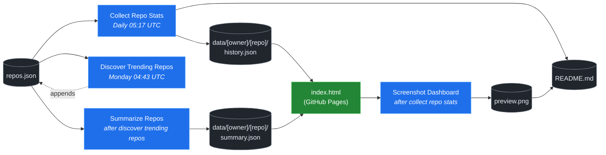

# 🚀 Rising Repos Tracker

> Automatically tracks daily GitHub stats (stars, forks, issues, velocity) for rising open source repos.

[](https://www.telosignal.com/)


**[→ View Live Dashboard](https://patrick-creates.github.io/rising-repos-tracker/)**

Built and maintained by [Telosignal](https://www.telosignal.com/).


<!-- AUTOGEN-STATS-START -->
## 📊 Current snapshot

> Auto-updated daily — last refreshed 2026-07-16

| Metric | Value |
|---|---|
| Repos tracked | **166** |
| Total stars | **7,772,809** |
| Total forks | **1,185,036** |
| Fastest growing | **ponytail** (+1509.3/day) |

### 🔥 Top 5 by velocity

| # | Repo | Stars | Stars/day |
|---|---|---:|---:|
| 1 | [DietrichGebert/ponytail](https://github.com/DietrichGebert/ponytail) | 84,242 | +1509.3 |
| 2 | [NousResearch/hermes-agent](https://github.com/NousResearch/hermes-agent) | 215,630 | +1056.0 |
| 3 | [chopratejas/headroom](https://github.com/chopratejas/headroom) | 59,407 | +1007.9 |
| 4 | [iOfficeAI/OfficeCLI](https://github.com/iOfficeAI/OfficeCLI) | 18,021 | +962.4 |
| 5 | [Panniantong/Agent-Reach](https://github.com/Panniantong/Agent-Reach) | 56,959 | +881.1 |

### 🆕 Recently added

- [sickn33/agentic-awesome-skills](https://github.com/sickn33/agentic-awesome-skills) — added 2026-07-13 — Installable GitHub library of 1,900+ agentic skills for Claude Code, Cursor, Codex CLI, Autohand Code, Gemini CLI, Antigravity, and more. Includes specialized plugins, installer CLI, bundles, workflows, and official/community skill collections.
- [mindsdb/mindshub](https://github.com/mindsdb/mindshub) — added 2026-07-13 — Make AI do actual work. Swap the model anytime — keep everything you've built.
- [re4/LibreCode](https://github.com/re4/LibreCode) — added 2026-07-13 — LibreCode - A Ollama cursor like coding / Reversing Interface
<!-- AUTOGEN-STATS-END -->

<!-- AUTOGEN-DIAGRAM-START -->
## 🔄 How it works


<!-- AUTOGEN-DIAGRAM-END -->

<!-- AUTOGEN-WORKFLOWS-START -->
## ⚙️ Workflows

| File | Schedule | Name |
|---|---|---|
| `collect.yml` | Daily 05:17 UTC | Collect Repo Stats |
| `discover.yml` | Monday 04:43 UTC | Discover Trending Repos |
| `screenshot.yml` | After Collect Repo Stats | Screenshot Dashboard |
| `summarize.yml` | After Discover Trending Repos | Summarize Repos |

> All workflows commit results directly back to the repo. Schedules are best-effort — GitHub Actions cron can drift by a few minutes.
<!-- AUTOGEN-WORKFLOWS-END -->

<!-- AUTOGEN-REPOS-START -->
## 📋 All tracked repos

| Repo | Stars | Forks | Stars/day |
|---|---:|---:|---:|
| [openclaw/openclaw](https://github.com/openclaw/openclaw) | 383,082 | 80,451 | +181.4 |
| [obra/superpowers](https://github.com/obra/superpowers) | 255,620 | 22,849 | +835.1 |
| [affaan-m/everything-claude-code](https://github.com/affaan-m/everything-claude-code) | 230,220 | 35,224 | +768.3 |
| [affaan-m/ECC](https://github.com/affaan-m/ECC) | 230,220 | 35,224 | +730.6 |
| [NousResearch/hermes-agent](https://github.com/NousResearch/hermes-agent) | 215,630 | 40,210 | +1056.0 |
| [Significant-Gravitas/AutoGPT](https://github.com/Significant-Gravitas/AutoGPT) | 185,573 | 46,079 | +20.2 |
| [microsoft/markitdown](https://github.com/microsoft/markitdown) | 166,473 | 11,933 | +679.1 |
| [f/prompts.chat](https://github.com/f/prompts.chat) | 165,839 | 21,451 | +57.3 |
| [langgenius/dify](https://github.com/langgenius/dify) | 149,012 | 23,470 | +121.7 |
| [open-webui/open-webui](https://github.com/open-webui/open-webui) | 145,589 | 21,083 | +135.9 |
| [langchain-ai/langchain](https://github.com/langchain-ai/langchain) | 141,889 | 23,577 | +82.1 |
| [github/spec-kit](https://github.com/github/spec-kit) | 121,667 | 10,826 | +372.0 |
| [farion1231/cc-switch](https://github.com/farion1231/cc-switch) | 117,714 | 7,882 | +740.2 |
| [microsoft/generative-ai-for-beginners](https://github.com/microsoft/generative-ai-for-beginners) | 113,032 | 60,718 | +35.6 |
| [nextlevelbuilder/ui-ux-pro-max-skill](https://github.com/nextlevelbuilder/ui-ux-pro-max-skill) | 106,266 | 11,275 | +443.3 |
| [JuliusBrussee/caveman](https://github.com/JuliusBrussee/caveman) | 89,978 | 5,171 | +482.5 |
| [ChatGPTNextWeb/NextChat](https://github.com/ChatGPTNextWeb/NextChat) | 88,463 | 59,427 | +7.2 |
| [thedotmack/claude-mem](https://github.com/thedotmack/claude-mem) | 87,432 | 7,574 | +188.3 |
| [vllm-project/vllm](https://github.com/vllm-project/vllm) | 86,388 | 19,471 | +101.6 |
| [DietrichGebert/ponytail](https://github.com/DietrichGebert/ponytail) | 84,242 | 4,586 | +1509.3 |
| [OpenHands/OpenHands](https://github.com/OpenHands/OpenHands) | 80,946 | 10,344 | +118.9 |
| [ruvnet/RuView](https://github.com/ruvnet/RuView) | 80,840 | 10,889 | +287.4 |
| [lobehub/lobehub](https://github.com/lobehub/lobehub) | 79,898 | 15,596 | +45.3 |
| [nexu-io/open-design](https://github.com/nexu-io/open-design) | 78,735 | 9,061 | +585.8 |
| [dair-ai/Prompt-Engineering-Guide](https://github.com/dair-ai/Prompt-Engineering-Guide) | 76,529 | 8,390 | +31.0 |
| [openai/openai-cookbook](https://github.com/openai/openai-cookbook) | 74,707 | 12,644 | +18.6 |
| [rtk-ai/rtk](https://github.com/rtk-ai/rtk) | 71,298 | 4,431 | +368.1 |
| [shareAI-lab/learn-claude-code](https://github.com/shareAI-lab/learn-claude-code) | 71,167 | 11,576 | +171.0 |
| [unslothai/unsloth](https://github.com/unslothai/unsloth) | 68,280 | 6,145 | +64.1 |
| [ComposioHQ/awesome-claude-skills](https://github.com/ComposioHQ/awesome-claude-skills) | 67,849 | 7,666 | +126.5 |
| [datawhalechina/hello-agents](https://github.com/datawhalechina/hello-agents) | 66,545 | 8,261 | +269.2 |
| [xtekky/gpt4free](https://github.com/xtekky/gpt4free) | 66,465 | 13,533 | +3.8 |
| [code-yeongyu/oh-my-openagent](https://github.com/code-yeongyu/oh-my-openagent) | 65,931 | 5,377 | +128.9 |
| [Leonxlnx/taste-skill](https://github.com/Leonxlnx/taste-skill) | 63,991 | 4,519 | +746.2 |
| [shanraisshan/claude-code-best-practice](https://github.com/shanraisshan/claude-code-best-practice) | 62,756 | 6,273 | +156.9 |
| [koala73/worldmonitor](https://github.com/koala73/worldmonitor) | 61,917 | 9,643 | +127.9 |
| [Fission-AI/OpenSpec](https://github.com/Fission-AI/OpenSpec) | 61,125 | 4,237 | +209.1 |
| [santifer/career-ops](https://github.com/santifer/career-ops) | 60,282 | 11,956 | +254.8 |
| [tw93/Pake](https://github.com/tw93/Pake) | 59,923 | 12,111 | +188.9 |
| [chopratejas/headroom](https://github.com/chopratejas/headroom) | 59,407 | 4,409 | +1007.9 |
| [headroomlabs-ai/headroom](https://github.com/headroomlabs-ai/headroom) | 59,407 | 4,409 | +562.7 |
| [asgeirtj/system_prompts_leaks](https://github.com/asgeirtj/system_prompts_leaks) | 58,207 | 9,621 | +302.1 |
| [ZhuLinsen/daily_stock_analysis](https://github.com/ZhuLinsen/daily_stock_analysis) | 57,435 | 49,407 | +357.6 |
| [MemPalace/mempalace](https://github.com/MemPalace/mempalace) | 57,377 | 7,400 | +84.4 |
| [Panniantong/Agent-Reach](https://github.com/Panniantong/Agent-Reach) | 56,959 | 4,681 | +881.1 |
| [FlowiseAI/Flowise](https://github.com/FlowiseAI/Flowise) | 54,663 | 24,723 | +29.9 |
| [BerriAI/litellm](https://github.com/BerriAI/litellm) | 53,744 | 9,809 | +107.7 |
| [mvanhorn/last30days-skill](https://github.com/mvanhorn/last30days-skill) | 52,381 | 4,580 | +518.7 |
| [ggml-org/whisper.cpp](https://github.com/ggml-org/whisper.cpp) | 51,846 | 5,920 | +34.2 |
| [hesreallyhim/awesome-claude-code](https://github.com/hesreallyhim/awesome-claude-code) | 50,130 | 4,367 | +102.3 |
| [Aider-AI/aider](https://github.com/Aider-AI/aider) | 47,418 | 4,738 | +41.6 |
| [ChromeDevTools/chrome-devtools-mcp](https://github.com/ChromeDevTools/chrome-devtools-mcp) | 47,044 | 3,229 | +121.4 |
| [zhayujie/CowAgent](https://github.com/zhayujie/CowAgent) | 45,999 | 10,268 | +24.5 |
| [HKUDS/nanobot](https://github.com/HKUDS/nanobot) | 45,694 | 8,064 | +51.1 |
| [elder-plinius/CL4R1T4S](https://github.com/elder-plinius/CL4R1T4S) | 45,623 | 9,296 | +217.2 |
| [sickn33/antigravity-awesome-skills](https://github.com/sickn33/antigravity-awesome-skills) | 43,381 | 6,568 | +90.4 |
| [sickn33/agentic-awesome-skills](https://github.com/sickn33/agentic-awesome-skills) | 43,381 | 6,568 | +113.0 |
| [QuantumNous/new-api](https://github.com/QuantumNous/new-api) | 42,396 | 9,851 | +135.4 |
| [router-for-me/CLIProxyAPI](https://github.com/router-for-me/CLIProxyAPI) | 42,281 | 6,743 | +144.9 |
| [kepano/obsidian-skills](https://github.com/kepano/obsidian-skills) | 42,183 | 3,007 | +184.4 |
| [usestrix/strix](https://github.com/usestrix/strix) | 41,955 | 4,406 | +361.0 |
| [jamiepine/voicebox](https://github.com/jamiepine/voicebox) | 41,659 | 5,043 | +280.8 |
| [chatboxai/chatbox](https://github.com/chatboxai/chatbox) | 41,015 | 4,147 | +17.3 |
| [danny-avila/LibreChat](https://github.com/danny-avila/LibreChat) | 40,794 | 8,369 | +63.9 |
| [coreyhaines31/marketingskills](https://github.com/coreyhaines31/marketingskills) | 39,970 | 6,330 | +189.6 |
| [Hmbown/CodeWhale](https://github.com/Hmbown/CodeWhale) | 39,838 | 3,428 | +99.4 |
| [mindsdb/mindshub](https://github.com/mindsdb/mindshub) | 39,442 | 6,225 | +13.7 |
| [calesthio/OpenMontage](https://github.com/calesthio/OpenMontage) | 39,075 | 4,730 | +660.2 |
| [chatanywhere/GPT_API_free](https://github.com/chatanywhere/GPT_API_free) | 38,800 | 2,667 | +12.4 |
| [rohitg00/ai-engineering-from-scratch](https://github.com/rohitg00/ai-engineering-from-scratch) | 38,445 | 6,441 | +268.5 |
| [wshobson/agents](https://github.com/wshobson/agents) | 37,945 | 4,079 | +38.6 |
| [Yeachan-Heo/oh-my-claudecode](https://github.com/Yeachan-Heo/oh-my-claudecode) | 37,802 | 3,411 | +57.3 |
| [langchain-ai/langgraph](https://github.com/langchain-ai/langgraph) | 37,402 | 6,269 | +82.6 |
| [google/langextract](https://github.com/google/langextract) | 37,154 | 2,564 | +11.5 |
| [github/awesome-copilot](https://github.com/github/awesome-copilot) | 36,644 | 4,585 | +54.6 |
| [AstrBotDevs/AstrBot](https://github.com/AstrBotDevs/AstrBot) | 36,412 | 2,530 | +62.7 |
| [songquanpeng/one-api](https://github.com/songquanpeng/one-api) | 35,751 | 6,743 | +29.6 |
| [PDFMathTranslate/PDFMathTranslate](https://github.com/PDFMathTranslate/PDFMathTranslate) | 35,602 | 3,176 | +30.5 |
| [heygen-com/hyperframes](https://github.com/heygen-com/hyperframes) | 35,529 | 3,330 | +262.3 |
| [zeroclaw-labs/zeroclaw](https://github.com/zeroclaw-labs/zeroclaw) | 32,276 | 4,803 | +13.3 |
| [anthropics/claude-plugins-official](https://github.com/anthropics/claude-plugins-official) | 32,192 | 3,584 | +70.7 |
| [DeusData/codebase-memory-mcp](https://github.com/DeusData/codebase-memory-mcp) | 31,988 | 2,552 | +668.1 |
| [iOfficeAI/AionUi](https://github.com/iOfficeAI/AionUi) | 30,167 | 3,023 | +62.6 |
| [Gitlawb/openclaude](https://github.com/Gitlawb/openclaude) | 30,042 | 8,866 | +42.4 |
| [googleworkspace/cli](https://github.com/googleworkspace/cli) | 29,738 | 1,727 | +67.1 |
| [AlexsJones/llmfit](https://github.com/AlexsJones/llmfit) | 29,497 | 1,795 | +55.5 |
| [voideditor/void](https://github.com/voideditor/void) | 28,837 | 2,587 | +0.7 |
| [JCodesMore/ai-website-cloner-template](https://github.com/JCodesMore/ai-website-cloner-template) | 28,519 | 4,200 | +371.8 |
| [BloopAI/vibe-kanban](https://github.com/BloopAI/vibe-kanban) | 27,391 | 2,908 | +15.1 |
| [esengine/DeepSeek-Reasonix](https://github.com/esengine/DeepSeek-Reasonix) | 27,040 | 1,714 | +197.7 |
| [volcengine/OpenViking](https://github.com/volcengine/OpenViking) | 26,830 | 2,099 | +39.5 |
| [alibaba/page-agent](https://github.com/alibaba/page-agent) | 26,813 | 2,465 | +266.3 |
| [jackwener/OpenCLI](https://github.com/jackwener/OpenCLI) | 26,736 | 2,629 | +77.3 |
| [jarrodwatts/claude-hud](https://github.com/jarrodwatts/claude-hud) | 26,447 | 1,220 | +46.2 |
| [p-e-w/heretic](https://github.com/p-e-w/heretic) | 26,350 | 2,875 | +62.6 |
| [langchain-ai/deepagents](https://github.com/langchain-ai/deepagents) | 26,296 | 3,685 | +56.3 |
| [zai-org/Open-AutoGLM](https://github.com/zai-org/Open-AutoGLM) | 25,792 | 4,008 | +8.7 |
| [mukul975/Anthropic-Cybersecurity-Skills](https://github.com/mukul975/Anthropic-Cybersecurity-Skills) | 25,671 | 3,121 | +314.5 |
| [rohitg00/agentmemory](https://github.com/rohitg00/agentmemory) | 25,199 | 2,084 | +88.8 |
| [toon-format/toon](https://github.com/toon-format/toon) | 24,878 | 1,105 | +10.1 |
| [manaflow-ai/cmux](https://github.com/manaflow-ai/cmux) | 24,573 | 1,994 | +72.3 |
| [HKUDS/Vibe-Trading](https://github.com/HKUDS/Vibe-Trading) | 23,959 | 4,067 | +542.4 |
| [MadsLorentzen/ai-job-search](https://github.com/MadsLorentzen/ai-job-search) | 23,006 | 7,226 | +474.3 |
| [agentscope-ai/QwenPaw](https://github.com/agentscope-ai/QwenPaw) | 22,775 | 2,806 | +161.2 |
| [decolua/9router](https://github.com/decolua/9router) | 22,344 | 3,795 | +154.0 |
| [winfunc/opcode](https://github.com/winfunc/opcode) | 22,176 | 1,708 | +4.5 |
| [coze-dev/coze-studio](https://github.com/coze-dev/coze-studio) | 21,176 | 3,080 | +6.0 |
| [NirDiamant/agents-towards-production](https://github.com/NirDiamant/agents-towards-production) | 20,995 | 2,794 | +9.5 |
| [stablyai/orca](https://github.com/stablyai/orca) | 20,186 | 1,575 | +760.3 |
| [tirth8205/code-review-graph](https://github.com/tirth8205/code-review-graph) | 19,523 | 2,088 | +32.5 |
| [mksglu/context-mode](https://github.com/mksglu/context-mode) | 18,985 | 1,336 | +48.9 |
| [tanweai/pua](https://github.com/tanweai/pua) | 18,819 | 1,131 | +18.5 |
| [steipete/CodexBar](https://github.com/steipete/CodexBar) | 18,412 | 1,518 | +133.7 |
| [Tencent/WeKnora](https://github.com/Tencent/WeKnora) | 18,400 | 2,534 | +68.0 |
| [pranshuparmar/witr](https://github.com/pranshuparmar/witr) | 18,244 | 570 | +12.5 |
| [datawhalechina/easy-vibe](https://github.com/datawhalechina/easy-vibe) | 18,226 | 1,731 | +41.5 |
| [iOfficeAI/OfficeCLI](https://github.com/iOfficeAI/OfficeCLI) | 18,021 | 1,194 | +962.4 |
| [RightNow-AI/openfang](https://github.com/RightNow-AI/openfang) | 18,015 | 2,279 | +6.1 |
| [can1357/oh-my-pi](https://github.com/can1357/oh-my-pi) | 17,988 | 1,645 | +166.3 |
| [diegosouzapw/OmniRoute](https://github.com/diegosouzapw/OmniRoute) | 17,863 | 2,659 | +571.1 |
| [jundot/omlx](https://github.com/jundot/omlx) | 17,860 | 1,516 | +39.6 |
| [jnMetaCode/agency-agents-zh](https://github.com/jnMetaCode/agency-agents-zh) | 17,409 | 2,945 | +83.5 |
| [microsoft/agent-lightning](https://github.com/microsoft/agent-lightning) | 17,392 | 1,523 | +2.6 |
| [ogulcancelik/herdr](https://github.com/ogulcancelik/herdr) | 16,969 | 1,141 | +457.2 |
| [danielmiessler/LifeOS](https://github.com/danielmiessler/LifeOS) | 16,726 | 2,274 | +27.5 |
| [cft0808/edict](https://github.com/cft0808/edict) | 16,220 | 1,705 | +5.1 |
| [nesquena/hermes-webui](https://github.com/nesquena/hermes-webui) | 16,122 | 2,149 | +53.5 |
| [browser-use/browser-harness](https://github.com/browser-use/browser-harness) | 16,004 | 1,496 | +30.9 |
| [MemoriLabs/Memori](https://github.com/MemoriLabs/Memori) | 15,582 | 2,822 | +10.0 |
| [kyegomez/OpenMythos](https://github.com/kyegomez/OpenMythos) | 14,695 | 3,300 | +22.5 |
| [xpzouying/xiaohongshu-mcp](https://github.com/xpzouying/xiaohongshu-mcp) | 14,693 | 2,174 | +16.9 |
| [yusufkaraaslan/Skill_Seekers](https://github.com/yusufkaraaslan/Skill_Seekers) | 14,475 | 1,474 | +10.4 |
| [NevaMind-AI/memU](https://github.com/NevaMind-AI/memU) | 14,031 | 1,040 | +5.5 |
| [wanshuiyin/Auto-claude-code-research-in-sleep](https://github.com/wanshuiyin/Auto-claude-code-research-in-sleep) | 13,468 | 1,214 | +40.8 |
| [xbtlin/ai-berkshire](https://github.com/xbtlin/ai-berkshire) | 13,248 | 1,929 | +247.1 |
| [superset-sh/superset](https://github.com/superset-sh/superset) | 12,445 | 1,086 | +16.8 |
| [XiaomiMiMo/MiMo-Code](https://github.com/XiaomiMiMo/MiMo-Code) | 12,135 | 1,218 | +65.4 |
| [sirmalloc/ccstatusline](https://github.com/sirmalloc/ccstatusline) | 11,766 | 512 | +28.6 |
| [EverMind-AI/EverOS](https://github.com/EverMind-AI/EverOS) | 11,104 | 857 | +81.7 |
| [ValueCell-ai/valuecell](https://github.com/ValueCell-ai/valuecell) | 10,934 | 1,813 | +3.6 |
| [aden-hive/hive](https://github.com/aden-hive/hive) | 10,707 | 5,657 | +5.6 |
| [alibaba/open-code-review](https://github.com/alibaba/open-code-review) | 10,593 | 716 | +60.6 |
| [walkinglabs/learn-harness-engineering](https://github.com/walkinglabs/learn-harness-engineering) | 10,431 | 1,124 | +54.6 |
| [0x4m4/hexstrike-ai](https://github.com/0x4m4/hexstrike-ai) | 10,335 | 2,164 | +19.1 |
| [MemTensor/MemOS](https://github.com/MemTensor/MemOS) | 10,233 | 933 | +12.1 |
| [Kuberwastaken/claurst](https://github.com/Kuberwastaken/claurst) | 10,081 | 7,782 | +12.6 |
| [brokermr810/QuantDinger](https://github.com/brokermr810/QuantDinger) | 9,665 | 2,032 | +38.2 |
| [ConardLi/garden-skills](https://github.com/ConardLi/garden-skills) | 9,550 | 1,269 | +36.9 |
| [frankbria/ralph-claude-code](https://github.com/frankbria/ralph-claude-code) | 9,539 | 727 | +6.7 |
| [ykdojo/claude-code-tips](https://github.com/ykdojo/claude-code-tips) | 9,296 | 734 | +27.9 |
| [EKKOLearnAI/hermes-studio](https://github.com/EKKOLearnAI/hermes-studio) | 9,168 | 1,138 | +30.8 |
| [TencentCloud/TencentDB-Agent-Memory](https://github.com/TencentCloud/TencentDB-Agent-Memory) | 8,964 | 825 | +82.0 |
| [EvoMap/evolver](https://github.com/EvoMap/evolver) | 8,897 | 817 | +4.2 |
| [getagentseal/codeburn](https://github.com/getagentseal/codeburn) | 8,681 | 683 | +21.0 |
| [iflytek/astron-agent](https://github.com/iflytek/astron-agent) | 8,618 | 863 | +0.8 |
| [1jehuang/jcode](https://github.com/1jehuang/jcode) | 8,351 | 945 | +15.3 |
| [MiroMindAI/MiroThinker](https://github.com/MiroMindAI/MiroThinker) | 8,341 | 643 | +1.5 |
| [mmulet/term.everything](https://github.com/mmulet/term.everything) | 8,036 | 192 | +1.7 |
| [ValueCell-ai/ClawX](https://github.com/ValueCell-ai/ClawX) | 7,535 | 1,123 | — |
| [modem-dev/hunk](https://github.com/modem-dev/hunk) | 7,013 | 198 | +102.7 |
| [StarTrail-org/PixelRAG](https://github.com/StarTrail-org/PixelRAG) | 6,677 | 555 | +30.7 |
| [steipete/summarize](https://github.com/steipete/summarize) | 6,426 | 438 | +5.3 |
| [Arthur-Ficial/apfel](https://github.com/Arthur-Ficial/apfel) | 6,145 | 234 | +10.0 |
| [UfoMiao/zcf](https://github.com/UfoMiao/zcf) | 6,076 | 425 | +2.0 |
| [microsoft/fara](https://github.com/microsoft/fara) | 6,012 | 583 | +4.3 |
| [re4/LibreCode](https://github.com/re4/LibreCode) | 73 | 4 | — |
<!-- AUTOGEN-REPOS-END -->

---

## What it does

- Collects daily snapshots of stars, forks, watchers and open issues for every tracked repo
- Discovers new trending repos automatically every Monday using the GitHub Search API
- Generates AI summaries (use cases, similar tools, tags) for each tracked repo via GitHub Models
- Stores all history as plain JSON — no database, no backend
- Renders a live dashboard via GitHub Pages — updates daily, zero maintenance

## Tracked repos

Data lives in [`data/`](./data) — one folder per repo, one `history.json` per entry.  
The full watch list is in [`repos.json`](./repos.json).

## Fork & use it for yourself

This is my personal tracker — the watch list reflects what I find interesting. If you want to track different repos, the best path is to **fork this repo and run your own**.

### Setup

1. Fork this repo to your account
2. Replace the contents of [`repos.json`](./repos.json) with the repos you want to track (or just leave one entry — `discover.yml` will auto-add more every Monday)
3. Go to **Settings → Pages** and enable GitHub Pages from the `main` branch
4. Go to **Actions** and run **Collect Repo Stats** once manually to seed your first data point
5. Your dashboard will be live at `https://YOUR-USERNAME.github.io/rising-repos-tracker/`

That's it — daily collection and weekly discovery run automatically on schedule. Zero ongoing maintenance.

### Customizing what gets discovered

Edit [`scripts/discover.js`](./scripts/discover.js) to change:

- `MIN_STARS` — minimum star threshold for candidates
- `MAX_AGE_DAYS` — how recent a repo must be
- `MAX_NEW_REPOS` — how many to add per discovery run
- The `queries` array — GitHub Search API queries that define what "trending" means to you

### Adding a repo manually

Just edit `repos.json` directly:

```json
{
  "owner": "OWNER",
  "repo": "REPO",
  "added": "YYYY-MM-DD",
  "notes": "why you're tracking this"
}
```

The next daily collect run picks it up automatically.

## Stack

- **GitHub Actions** — scheduling and automation
- **GitHub Pages** — dashboard hosting
- **GitHub API** — data source
- **GitHub Models** — free AI summaries (gpt-4o-mini)
- **Chart.js** — star growth visualization
- **Mermaid** — architecture diagram (rendered by GitHub)
- No dependencies, no build step, no database

## License

MIT
