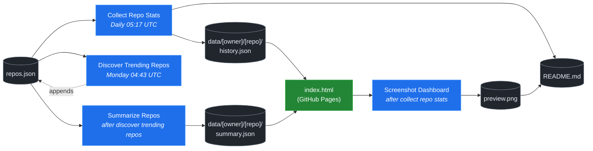

# 🚀 Rising Repos Tracker

> Automatically tracks daily GitHub stats (stars, forks, issues, velocity) for rising open source repos.

[](https://www.telosignal.com/)


**[→ View Live Dashboard](https://patrick-creates.github.io/rising-repos-tracker/)**

Built and maintained by [Telosignal](https://www.telosignal.com/).


<!-- AUTOGEN-STATS-START -->
## 📊 Current snapshot

> Auto-updated daily — last refreshed 2026-07-15

| Metric | Value |
|---|---|
| Repos tracked | **166** |
| Total stars | **7,752,415** |
| Total forks | **1,182,988** |
| Fastest growing | **ponytail** (+1535.6/day) |

### 🔥 Top 5 by velocity

| # | Repo | Stars | Stars/day |
|---|---|---:|---:|
| 1 | [DietrichGebert/ponytail](https://github.com/DietrichGebert/ponytail) | 83,337 | +1535.6 |
| 2 | [NousResearch/hermes-agent](https://github.com/NousResearch/hermes-agent) | 215,049 | +1063.6 |
| 3 | [chopratejas/headroom](https://github.com/chopratejas/headroom) | 59,215 | +1035.1 |
| 4 | [iOfficeAI/OfficeCLI](https://github.com/iOfficeAI/OfficeCLI) | 17,085 | +965.3 |
| 5 | [Panniantong/Agent-Reach](https://github.com/Panniantong/Agent-Reach) | 56,467 | +891.6 |

### 🆕 Recently added

- [sickn33/agentic-awesome-skills](https://github.com/sickn33/agentic-awesome-skills) — added 2026-07-13 — Installable GitHub library of 1,900+ agentic skills for Claude Code, Cursor, Codex CLI, Autohand Code, Gemini CLI, Antigravity, and more. Includes specialized plugins, installer CLI, bundles, workflows, and official/community skill collections.
- [mindsdb/mindshub](https://github.com/mindsdb/mindshub) — added 2026-07-13 — Make AI do actual work. Swap the model anytime — keep everything you've built.
- [re4/LibreCode](https://github.com/re4/LibreCode) — added 2026-07-13 — LibreCode - A Ollama cursor like coding / Reversing Interface
<!-- AUTOGEN-STATS-END -->

<!-- AUTOGEN-DIAGRAM-START -->
## 🔄 How it works


<!-- AUTOGEN-DIAGRAM-END -->

<!-- AUTOGEN-WORKFLOWS-START -->
## ⚙️ Workflows

| File | Schedule | Name |
|---|---|---|
| `collect.yml` | Daily 05:17 UTC | Collect Repo Stats |
| `discover.yml` | Monday 04:43 UTC | Discover Trending Repos |
| `screenshot.yml` | After Collect Repo Stats | Screenshot Dashboard |
| `summarize.yml` | After Discover Trending Repos | Summarize Repos |

> All workflows commit results directly back to the repo. Schedules are best-effort — GitHub Actions cron can drift by a few minutes.
<!-- AUTOGEN-WORKFLOWS-END -->

<!-- AUTOGEN-REPOS-START -->
## 📋 All tracked repos

| Repo | Stars | Forks | Stars/day |
|---|---:|---:|---:|
| [openclaw/openclaw](https://github.com/openclaw/openclaw) | 382,974 | 80,408 | +182.6 |
| [obra/superpowers](https://github.com/obra/superpowers) | 254,936 | 22,792 | +841.7 |
| [affaan-m/everything-claude-code](https://github.com/affaan-m/everything-claude-code) | 229,845 | 35,177 | +774.6 |
| [affaan-m/ECC](https://github.com/affaan-m/ECC) | 229,845 | 35,177 | +737.6 |
| [NousResearch/hermes-agent](https://github.com/NousResearch/hermes-agent) | 215,049 | 40,046 | +1063.6 |
| [Significant-Gravitas/AutoGPT](https://github.com/Significant-Gravitas/AutoGPT) | 185,547 | 46,080 | +20.1 |
| [microsoft/markitdown](https://github.com/microsoft/markitdown) | 166,108 | 11,895 | +684.1 |
| [f/prompts.chat](https://github.com/f/prompts.chat) | 165,782 | 21,440 | +57.3 |
| [langgenius/dify](https://github.com/langgenius/dify) | 148,877 | 23,443 | +121.5 |
| [open-webui/open-webui](https://github.com/open-webui/open-webui) | 145,470 | 21,065 | +136.2 |
| [langchain-ai/langchain](https://github.com/langchain-ai/langchain) | 141,808 | 23,559 | +82.1 |
| [github/spec-kit](https://github.com/github/spec-kit) | 121,392 | 10,798 | +373.5 |
| [farion1231/cc-switch](https://github.com/farion1231/cc-switch) | 117,373 | 7,857 | +747.1 |
| [microsoft/generative-ai-for-beginners](https://github.com/microsoft/generative-ai-for-beginners) | 113,007 | 60,715 | +35.8 |
| [nextlevelbuilder/ui-ux-pro-max-skill](https://github.com/nextlevelbuilder/ui-ux-pro-max-skill) | 105,724 | 11,221 | +441.8 |
| [JuliusBrussee/caveman](https://github.com/JuliusBrussee/caveman) | 89,593 | 5,151 | +484.2 |
| [ChatGPTNextWeb/NextChat](https://github.com/ChatGPTNextWeb/NextChat) | 88,458 | 59,437 | +7.3 |
| [thedotmack/claude-mem](https://github.com/thedotmack/claude-mem) | 87,306 | 7,564 | +189.3 |
| [vllm-project/vllm](https://github.com/vllm-project/vllm) | 86,293 | 19,429 | +101.7 |
| [DietrichGebert/ponytail](https://github.com/DietrichGebert/ponytail) | 83,337 | 4,528 | +1535.6 |
| [OpenHands/OpenHands](https://github.com/OpenHands/OpenHands) | 80,834 | 10,316 | +119.0 |
| [ruvnet/RuView](https://github.com/ruvnet/RuView) | 80,695 | 10,865 | +290.2 |
| [lobehub/lobehub](https://github.com/lobehub/lobehub) | 79,860 | 15,597 | +45.4 |
| [nexu-io/open-design](https://github.com/nexu-io/open-design) | 78,302 | 9,007 | +588.4 |
| [dair-ai/Prompt-Engineering-Guide](https://github.com/dair-ai/Prompt-Engineering-Guide) | 76,491 | 8,382 | +30.9 |
| [openai/openai-cookbook](https://github.com/openai/openai-cookbook) | 74,692 | 12,643 | +18.7 |
| [rtk-ai/rtk](https://github.com/rtk-ai/rtk) | 71,079 | 4,417 | +370.7 |
| [shareAI-lab/learn-claude-code](https://github.com/shareAI-lab/learn-claude-code) | 71,044 | 11,558 | +171.8 |
| [unslothai/unsloth](https://github.com/unslothai/unsloth) | 68,230 | 6,139 | +64.3 |
| [ComposioHQ/awesome-claude-skills](https://github.com/ComposioHQ/awesome-claude-skills) | 67,755 | 7,653 | +127.0 |
| [xtekky/gpt4free](https://github.com/xtekky/gpt4free) | 66,469 | 13,533 | +3.9 |
| [datawhalechina/hello-agents](https://github.com/datawhalechina/hello-agents) | 66,276 | 8,212 | +269.2 |
| [code-yeongyu/oh-my-openagent](https://github.com/code-yeongyu/oh-my-openagent) | 65,830 | 5,369 | +129.3 |
| [Leonxlnx/taste-skill](https://github.com/Leonxlnx/taste-skill) | 63,630 | 4,493 | +754.9 |
| [shanraisshan/claude-code-best-practice](https://github.com/shanraisshan/claude-code-best-practice) | 62,625 | 6,264 | +157.4 |
| [koala73/worldmonitor](https://github.com/koala73/worldmonitor) | 61,871 | 9,639 | +129.4 |
| [Fission-AI/OpenSpec](https://github.com/Fission-AI/OpenSpec) | 60,943 | 4,225 | +209.6 |
| [santifer/career-ops](https://github.com/santifer/career-ops) | 60,168 | 11,926 | +257.3 |
| [tw93/Pake](https://github.com/tw93/Pake) | 59,885 | 12,101 | +191.5 |
| [chopratejas/headroom](https://github.com/chopratejas/headroom) | 59,215 | 4,391 | +1035.1 |
| [headroomlabs-ai/headroom](https://github.com/headroomlabs-ai/headroom) | 59,215 | 4,391 | +578.8 |
| [asgeirtj/system_prompts_leaks](https://github.com/asgeirtj/system_prompts_leaks) | 57,870 | 9,565 | +301.5 |
| [MemPalace/mempalace](https://github.com/MemPalace/mempalace) | 57,337 | 7,400 | +85.1 |
| [ZhuLinsen/daily_stock_analysis](https://github.com/ZhuLinsen/daily_stock_analysis) | 57,283 | 49,287 | +361.6 |
| [Panniantong/Agent-Reach](https://github.com/Panniantong/Agent-Reach) | 56,467 | 4,642 | +891.6 |
| [FlowiseAI/Flowise](https://github.com/FlowiseAI/Flowise) | 54,630 | 24,716 | +29.8 |
| [BerriAI/litellm](https://github.com/BerriAI/litellm) | 53,631 | 9,777 | +107.6 |
| [mvanhorn/last30days-skill](https://github.com/mvanhorn/last30days-skill) | 52,243 | 4,552 | +529.0 |
| [ggml-org/whisper.cpp](https://github.com/ggml-org/whisper.cpp) | 51,813 | 5,916 | +34.3 |
| [hesreallyhim/awesome-claude-code](https://github.com/hesreallyhim/awesome-claude-code) | 50,055 | 4,365 | +102.8 |
| [Aider-AI/aider](https://github.com/Aider-AI/aider) | 47,396 | 4,734 | +42.0 |
| [ChromeDevTools/chrome-devtools-mcp](https://github.com/ChromeDevTools/chrome-devtools-mcp) | 46,966 | 3,219 | +122.1 |
| [zhayujie/CowAgent](https://github.com/zhayujie/CowAgent) | 45,980 | 10,266 | +24.6 |
| [HKUDS/nanobot](https://github.com/HKUDS/nanobot) | 45,611 | 8,040 | +50.5 |
| [elder-plinius/CL4R1T4S](https://github.com/elder-plinius/CL4R1T4S) | 45,518 | 9,276 | +220.9 |
| [sickn33/antigravity-awesome-skills](https://github.com/sickn33/antigravity-awesome-skills) | 43,269 | 6,858 | +90.0 |
| [sickn33/agentic-awesome-skills](https://github.com/sickn33/agentic-awesome-skills) | 43,269 | 6,858 | +113.5 |
| [QuantumNous/new-api](https://github.com/QuantumNous/new-api) | 42,271 | 9,801 | +135.6 |
| [router-for-me/CLIProxyAPI](https://github.com/router-for-me/CLIProxyAPI) | 42,004 | 6,710 | +142.4 |
| [kepano/obsidian-skills](https://github.com/kepano/obsidian-skills) | 41,986 | 2,990 | +184.1 |
| [usestrix/strix](https://github.com/usestrix/strix) | 41,633 | 4,376 | +361.9 |
| [jamiepine/voicebox](https://github.com/jamiepine/voicebox) | 41,395 | 5,011 | +281.2 |
| [chatboxai/chatbox](https://github.com/chatboxai/chatbox) | 41,005 | 4,150 | +17.4 |
| [danny-avila/LibreChat](https://github.com/danny-avila/LibreChat) | 40,747 | 8,361 | +64.3 |
| [Hmbown/CodeWhale](https://github.com/Hmbown/CodeWhale) | 39,807 | 3,426 | +100.7 |
| [mindsdb/mindshub](https://github.com/mindsdb/mindshub) | 39,436 | 6,226 | +17.5 |
| [coreyhaines31/marketingskills](https://github.com/coreyhaines31/marketingskills) | 39,305 | 6,270 | +178.8 |
| [chatanywhere/GPT_API_free](https://github.com/chatanywhere/GPT_API_free) | 38,787 | 2,667 | +12.4 |
| [calesthio/OpenMontage](https://github.com/calesthio/OpenMontage) | 38,660 | 4,684 | +675.6 |
| [rohitg00/ai-engineering-from-scratch](https://github.com/rohitg00/ai-engineering-from-scratch) | 38,330 | 6,418 | +272.0 |
| [wshobson/agents](https://github.com/wshobson/agents) | 37,923 | 4,077 | +39.0 |
| [Yeachan-Heo/oh-my-claudecode](https://github.com/Yeachan-Heo/oh-my-claudecode) | 37,775 | 3,410 | +57.9 |
| [langchain-ai/langgraph](https://github.com/langchain-ai/langgraph) | 37,333 | 6,252 | +83.2 |
| [google/langextract](https://github.com/google/langextract) | 37,151 | 2,564 | +11.7 |
| [github/awesome-copilot](https://github.com/github/awesome-copilot) | 36,594 | 4,576 | +54.7 |
| [AstrBotDevs/AstrBot](https://github.com/AstrBotDevs/AstrBot) | 36,351 | 2,529 | +62.8 |
| [songquanpeng/one-api](https://github.com/songquanpeng/one-api) | 35,724 | 6,742 | +29.7 |
| [PDFMathTranslate/PDFMathTranslate](https://github.com/PDFMathTranslate/PDFMathTranslate) | 35,579 | 3,172 | +30.7 |
| [heygen-com/hyperframes](https://github.com/heygen-com/hyperframes) | 35,232 | 3,300 | +261.4 |
| [zeroclaw-labs/zeroclaw](https://github.com/zeroclaw-labs/zeroclaw) | 32,268 | 4,802 | +13.5 |
| [anthropics/claude-plugins-official](https://github.com/anthropics/claude-plugins-official) | 32,151 | 3,574 | +71.4 |
| [DeusData/codebase-memory-mcp](https://github.com/DeusData/codebase-memory-mcp) | 31,618 | 2,516 | +686.8 |
| [iOfficeAI/AionUi](https://github.com/iOfficeAI/AionUi) | 30,093 | 3,017 | +62.4 |
| [Gitlawb/openclaude](https://github.com/Gitlawb/openclaude) | 30,001 | 8,863 | +42.4 |
| [googleworkspace/cli](https://github.com/googleworkspace/cli) | 29,700 | 1,725 | +67.8 |
| [AlexsJones/llmfit](https://github.com/AlexsJones/llmfit) | 29,454 | 1,790 | +55.8 |
| [voideditor/void](https://github.com/voideditor/void) | 28,835 | 2,586 | +0.7 |
| [JCodesMore/ai-website-cloner-template](https://github.com/JCodesMore/ai-website-cloner-template) | 28,375 | 4,171 | +379.4 |
| [BloopAI/vibe-kanban](https://github.com/BloopAI/vibe-kanban) | 27,381 | 2,909 | +15.3 |
| [esengine/DeepSeek-Reasonix](https://github.com/esengine/DeepSeek-Reasonix) | 26,980 | 1,702 | +201.5 |
| [volcengine/OpenViking](https://github.com/volcengine/OpenViking) | 26,776 | 2,093 | +39.1 |
| [jackwener/OpenCLI](https://github.com/jackwener/OpenCLI) | 26,682 | 2,624 | +77.9 |
| [alibaba/page-agent](https://github.com/alibaba/page-agent) | 26,672 | 2,449 | +270.5 |
| [jarrodwatts/claude-hud](https://github.com/jarrodwatts/claude-hud) | 26,421 | 1,218 | +46.8 |
| [p-e-w/heretic](https://github.com/p-e-w/heretic) | 26,317 | 2,865 | +63.4 |
| [langchain-ai/deepagents](https://github.com/langchain-ai/deepagents) | 26,258 | 3,673 | +56.8 |
| [zai-org/Open-AutoGLM](https://github.com/zai-org/Open-AutoGLM) | 25,780 | 4,008 | +8.6 |
| [mukul975/Anthropic-Cybersecurity-Skills](https://github.com/mukul975/Anthropic-Cybersecurity-Skills) | 25,588 | 3,101 | +324.6 |
| [rohitg00/agentmemory](https://github.com/rohitg00/agentmemory) | 25,157 | 2,079 | +90.1 |
| [toon-format/toon](https://github.com/toon-format/toon) | 24,867 | 1,103 | +10.0 |
| [manaflow-ai/cmux](https://github.com/manaflow-ai/cmux) | 24,507 | 1,987 | +75.5 |
| [HKUDS/Vibe-Trading](https://github.com/HKUDS/Vibe-Trading) | 23,151 | 3,970 | +525.8 |
| [MadsLorentzen/ai-job-search](https://github.com/MadsLorentzen/ai-job-search) | 22,654 | 7,038 | +535.5 |
| [agentscope-ai/QwenPaw](https://github.com/agentscope-ai/QwenPaw) | 22,572 | 2,801 | +159.8 |
| [decolua/9router](https://github.com/decolua/9router) | 22,222 | 3,766 | +155.0 |
| [winfunc/opcode](https://github.com/winfunc/opcode) | 22,174 | 1,707 | +4.6 |
| [coze-dev/coze-studio](https://github.com/coze-dev/coze-studio) | 21,170 | 3,080 | +6.0 |
| [NirDiamant/agents-towards-production](https://github.com/NirDiamant/agents-towards-production) | 20,985 | 2,793 | +9.5 |
| [tirth8205/code-review-graph](https://github.com/tirth8205/code-review-graph) | 19,508 | 2,086 | +33.1 |
| [stablyai/orca](https://github.com/stablyai/orca) | 19,425 | 1,516 | +760.2 |
| [mksglu/context-mode](https://github.com/mksglu/context-mode) | 18,949 | 1,336 | +49.4 |
| [tanweai/pua](https://github.com/tanweai/pua) | 18,807 | 1,131 | +18.7 |
| [Tencent/WeKnora](https://github.com/Tencent/WeKnora) | 18,325 | 2,520 | +67.8 |
| [steipete/CodexBar](https://github.com/steipete/CodexBar) | 18,308 | 1,505 | +135.0 |
| [pranshuparmar/witr](https://github.com/pranshuparmar/witr) | 18,240 | 570 | +13.0 |
| [datawhalechina/easy-vibe](https://github.com/datawhalechina/easy-vibe) | 18,197 | 1,731 | +41.9 |
| [RightNow-AI/openfang](https://github.com/RightNow-AI/openfang) | 18,014 | 2,279 | +6.3 |
| [jundot/omlx](https://github.com/jundot/omlx) | 17,838 | 1,511 | +40.2 |
| [can1357/oh-my-pi](https://github.com/can1357/oh-my-pi) | 17,823 | 1,621 | +166.4 |
| [diegosouzapw/OmniRoute](https://github.com/diegosouzapw/OmniRoute) | 17,450 | 2,616 | +588.7 |
| [microsoft/agent-lightning](https://github.com/microsoft/agent-lightning) | 17,390 | 1,523 | +2.6 |
| [jnMetaCode/agency-agents-zh](https://github.com/jnMetaCode/agency-agents-zh) | 17,344 | 2,936 | +84.3 |
| [iOfficeAI/OfficeCLI](https://github.com/iOfficeAI/OfficeCLI) | 17,085 | 1,134 | +965.3 |
| [danielmiessler/LifeOS](https://github.com/danielmiessler/LifeOS) | 16,701 | 2,272 | +27.6 |
| [ogulcancelik/herdr](https://github.com/ogulcancelik/herdr) | 16,586 | 1,118 | +465.4 |
| [cft0808/edict](https://github.com/cft0808/edict) | 16,211 | 1,705 | +5.0 |
| [nesquena/hermes-webui](https://github.com/nesquena/hermes-webui) | 16,060 | 2,146 | +53.1 |
| [browser-use/browser-harness](https://github.com/browser-use/browser-harness) | 15,981 | 1,494 | +31.4 |
| [MemoriLabs/Memori](https://github.com/MemoriLabs/Memori) | 15,579 | 2,818 | +10.3 |
| [kyegomez/OpenMythos](https://github.com/kyegomez/OpenMythos) | 14,687 | 3,300 | +23.1 |
| [xpzouying/xiaohongshu-mcp](https://github.com/xpzouying/xiaohongshu-mcp) | 14,678 | 2,172 | +17.0 |
| [yusufkaraaslan/Skill_Seekers](https://github.com/yusufkaraaslan/Skill_Seekers) | 14,459 | 1,473 | +10.1 |
| [NevaMind-AI/memU](https://github.com/NevaMind-AI/memU) | 14,025 | 1,041 | +5.4 |
| [wanshuiyin/Auto-claude-code-research-in-sleep](https://github.com/wanshuiyin/Auto-claude-code-research-in-sleep) | 13,408 | 1,210 | +39.6 |
| [xbtlin/ai-berkshire](https://github.com/xbtlin/ai-berkshire) | 13,190 | 1,912 | +268.1 |
| [superset-sh/superset](https://github.com/superset-sh/superset) | 12,424 | 1,082 | +16.5 |
| [XiaomiMiMo/MiMo-Code](https://github.com/XiaomiMiMo/MiMo-Code) | 12,089 | 1,210 | +66.6 |
| [sirmalloc/ccstatusline](https://github.com/sirmalloc/ccstatusline) | 11,744 | 509 | +29.0 |
| [EverMind-AI/EverOS](https://github.com/EverMind-AI/EverOS) | 11,028 | 856 | +82.1 |
| [ValueCell-ai/valuecell](https://github.com/ValueCell-ai/valuecell) | 10,935 | 1,813 | +3.9 |
| [aden-hive/hive](https://github.com/aden-hive/hive) | 10,695 | 5,654 | +5.2 |
| [alibaba/open-code-review](https://github.com/alibaba/open-code-review) | 10,553 | 710 | +62.9 |
| [walkinglabs/learn-harness-engineering](https://github.com/walkinglabs/learn-harness-engineering) | 10,402 | 1,119 | +57.4 |
| [0x4m4/hexstrike-ai](https://github.com/0x4m4/hexstrike-ai) | 10,314 | 2,161 | +19.0 |
| [MemTensor/MemOS](https://github.com/MemTensor/MemOS) | 10,213 | 930 | +11.6 |
| [Kuberwastaken/claurst](https://github.com/Kuberwastaken/claurst) | 10,077 | 7,780 | +13.2 |
| [brokermr810/QuantDinger](https://github.com/brokermr810/QuantDinger) | 9,617 | 2,023 | +37.1 |
| [frankbria/ralph-claude-code](https://github.com/frankbria/ralph-claude-code) | 9,537 | 727 | +6.7 |
| [ConardLi/garden-skills](https://github.com/ConardLi/garden-skills) | 9,514 | 1,268 | +37.0 |
| [ykdojo/claude-code-tips](https://github.com/ykdojo/claude-code-tips) | 9,267 | 734 | +27.8 |
| [EKKOLearnAI/hermes-studio](https://github.com/EKKOLearnAI/hermes-studio) | 9,125 | 1,133 | +29.4 |
| [TencentCloud/TencentDB-Agent-Memory](https://github.com/TencentCloud/TencentDB-Agent-Memory) | 8,905 | 816 | +93.5 |
| [EvoMap/evolver](https://github.com/EvoMap/evolver) | 8,896 | 816 | +4.6 |
| [getagentseal/codeburn](https://github.com/getagentseal/codeburn) | 8,665 | 681 | +21.6 |
| [iflytek/astron-agent](https://github.com/iflytek/astron-agent) | 8,617 | 861 | +0.8 |
| [1jehuang/jcode](https://github.com/1jehuang/jcode) | 8,337 | 946 | +16.0 |
| [MiroMindAI/MiroThinker](https://github.com/MiroMindAI/MiroThinker) | 8,336 | 642 | +1.1 |
| [mmulet/term.everything](https://github.com/mmulet/term.everything) | 8,034 | 192 | +1.5 |
| [ValueCell-ai/ClawX](https://github.com/ValueCell-ai/ClawX) | 7,542 | 1,122 | +0.5 |
| [modem-dev/hunk](https://github.com/modem-dev/hunk) | 6,894 | 194 | +94.5 |
| [StarTrail-org/PixelRAG](https://github.com/StarTrail-org/PixelRAG) | 6,659 | 554 | +37.0 |
| [steipete/summarize](https://github.com/steipete/summarize) | 6,422 | 439 | +6.0 |
| [Arthur-Ficial/apfel](https://github.com/Arthur-Ficial/apfel) | 6,140 | 234 | +12.5 |
| [UfoMiao/zcf](https://github.com/UfoMiao/zcf) | 6,075 | 425 | +2.5 |
| [microsoft/fara](https://github.com/microsoft/fara) | 6,009 | 581 | +5.0 |
| [re4/LibreCode](https://github.com/re4/LibreCode) | 74 | 4 | — |
<!-- AUTOGEN-REPOS-END -->

---

## What it does

- Collects daily snapshots of stars, forks, watchers and open issues for every tracked repo
- Discovers new trending repos automatically every Monday using the GitHub Search API
- Generates AI summaries (use cases, similar tools, tags) for each tracked repo via GitHub Models
- Stores all history as plain JSON — no database, no backend
- Renders a live dashboard via GitHub Pages — updates daily, zero maintenance

## Tracked repos

Data lives in [`data/`](./data) — one folder per repo, one `history.json` per entry.  
The full watch list is in [`repos.json`](./repos.json).

## Fork & use it for yourself

This is my personal tracker — the watch list reflects what I find interesting. If you want to track different repos, the best path is to **fork this repo and run your own**.

### Setup

1. Fork this repo to your account
2. Replace the contents of [`repos.json`](./repos.json) with the repos you want to track (or just leave one entry — `discover.yml` will auto-add more every Monday)
3. Go to **Settings → Pages** and enable GitHub Pages from the `main` branch
4. Go to **Actions** and run **Collect Repo Stats** once manually to seed your first data point
5. Your dashboard will be live at `https://YOUR-USERNAME.github.io/rising-repos-tracker/`

That's it — daily collection and weekly discovery run automatically on schedule. Zero ongoing maintenance.

### Customizing what gets discovered

Edit [`scripts/discover.js`](./scripts/discover.js) to change:

- `MIN_STARS` — minimum star threshold for candidates
- `MAX_AGE_DAYS` — how recent a repo must be
- `MAX_NEW_REPOS` — how many to add per discovery run
- The `queries` array — GitHub Search API queries that define what "trending" means to you

### Adding a repo manually

Just edit `repos.json` directly:

```json
{
  "owner": "OWNER",
  "repo": "REPO",
  "added": "YYYY-MM-DD",
  "notes": "why you're tracking this"
}
```

The next daily collect run picks it up automatically.

## Stack

- **GitHub Actions** — scheduling and automation
- **GitHub Pages** — dashboard hosting
- **GitHub API** — data source
- **GitHub Models** — free AI summaries (gpt-4o-mini)
- **Chart.js** — star growth visualization
- **Mermaid** — architecture diagram (rendered by GitHub)
- No dependencies, no build step, no database

## License

MIT
