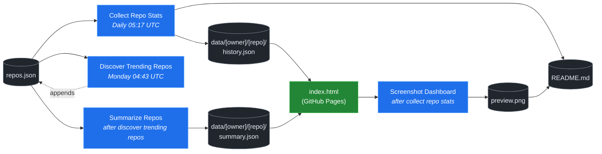

# 🚀 Rising Repos Tracker

> Automatically tracks daily GitHub stats (stars, forks, issues, velocity) for rising open source repos.

[](https://www.telosignal.com/)


**[→ View Live Dashboard](https://patrick-creates.github.io/rising-repos-tracker/)**

Built and maintained by [Telosignal](https://www.telosignal.com/).


<!-- AUTOGEN-STATS-START -->
## 📊 Current snapshot

> Auto-updated daily — last refreshed 2026-07-13

| Metric | Value |
|---|---|
| Repos tracked | **166** |
| Total stars | **7,734,491** |
| Total forks | **1,177,325** |
| Fastest growing | **ponytail** (+1602.6/day) |

### 🔥 Top 5 by velocity

| # | Repo | Stars | Stars/day |
|---|---|---:|---:|
| 1 | [DietrichGebert/ponytail](https://github.com/DietrichGebert/ponytail) | 81,673 | +1602.6 |
| 2 | [chopratejas/headroom](https://github.com/chopratejas/headroom) | 58,826 | +1095.1 |
| 3 | [NousResearch/hermes-agent](https://github.com/NousResearch/hermes-agent) | 213,951 | +1080.4 |
| 4 | [iOfficeAI/OfficeCLI](https://github.com/iOfficeAI/OfficeCLI) | 15,706 | +1044.1 |
| 5 | [Panniantong/Agent-Reach](https://github.com/Panniantong/Agent-Reach) | 55,512 | +915.3 |

### 🆕 Recently added

- [sickn33/agentic-awesome-skills](https://github.com/sickn33/agentic-awesome-skills) — added 2026-07-13 — Installable GitHub library of 1,900+ agentic skills for Claude Code, Cursor, Codex CLI, Autohand Code, Gemini CLI, Antigravity, and more. Includes specialized plugins, installer CLI, bundles, workflows, and official/community skill collections.
- [mindsdb/mindshub](https://github.com/mindsdb/mindshub) — added 2026-07-13 — Make AI do actual work. Swap the model anytime — keep everything you've built.
- [re4/LibreCode](https://github.com/re4/LibreCode) — added 2026-07-13 — LibreCode - A Ollama cursor like coding / Reversing Interface
<!-- AUTOGEN-STATS-END -->

<!-- AUTOGEN-DIAGRAM-START -->
## 🔄 How it works


<!-- AUTOGEN-DIAGRAM-END -->

<!-- AUTOGEN-WORKFLOWS-START -->
## ⚙️ Workflows

| File | Schedule | Name |
|---|---|---|
| `collect.yml` | Daily 05:17 UTC | Collect Repo Stats |
| `discover.yml` | Monday 04:43 UTC | Discover Trending Repos |
| `screenshot.yml` | After Collect Repo Stats | Screenshot Dashboard |
| `summarize.yml` | After Discover Trending Repos | Summarize Repos |

> All workflows commit results directly back to the repo. Schedules are best-effort — GitHub Actions cron can drift by a few minutes.
<!-- AUTOGEN-WORKFLOWS-END -->

<!-- AUTOGEN-REPOS-START -->
## 📋 All tracked repos

| Repo | Stars | Forks | Stars/day |
|---|---:|---:|---:|
| [openclaw/openclaw](https://github.com/openclaw/openclaw) | 382,752 | 80,334 | +184.9 |
| [obra/superpowers](https://github.com/obra/superpowers) | 253,351 | 22,631 | +846.4 |
| [affaan-m/everything-claude-code](https://github.com/affaan-m/everything-claude-code) | 229,055 | 35,114 | +787.0 |
| [affaan-m/ECC](https://github.com/affaan-m/ECC) | 229,055 | 35,114 | +751.6 |
| [NousResearch/hermes-agent](https://github.com/NousResearch/hermes-agent) | 213,951 | 39,677 | +1080.4 |
| [Significant-Gravitas/AutoGPT](https://github.com/Significant-Gravitas/AutoGPT) | 185,502 | 46,101 | +20.0 |
| [f/prompts.chat](https://github.com/f/prompts.chat) | 165,591 | 21,434 | +56.0 |
| [microsoft/markitdown](https://github.com/microsoft/markitdown) | 165,253 | 11,789 | +692.5 |
| [langgenius/dify](https://github.com/langgenius/dify) | 148,657 | 23,429 | +121.8 |
| [open-webui/open-webui](https://github.com/open-webui/open-webui) | 145,219 | 21,037 | +136.5 |
| [langchain-ai/langchain](https://github.com/langchain-ai/langchain) | 141,640 | 23,545 | +82.0 |
| [github/spec-kit](https://github.com/github/spec-kit) | 120,144 | 10,659 | +365.3 |
| [farion1231/cc-switch](https://github.com/farion1231/cc-switch) | 116,545 | 7,811 | +758.9 |
| [microsoft/generative-ai-for-beginners](https://github.com/microsoft/generative-ai-for-beginners) | 112,927 | 60,660 | +35.7 |
| [nextlevelbuilder/ui-ux-pro-max-skill](https://github.com/nextlevelbuilder/ui-ux-pro-max-skill) | 104,899 | 11,115 | +442.7 |
| [JuliusBrussee/caveman](https://github.com/JuliusBrussee/caveman) | 88,727 | 5,099 | +486.0 |
| [ChatGPTNextWeb/NextChat](https://github.com/ChatGPTNextWeb/NextChat) | 88,452 | 59,454 | +7.4 |
| [thedotmack/claude-mem](https://github.com/thedotmack/claude-mem) | 87,012 | 7,523 | +190.7 |
| [vllm-project/vllm](https://github.com/vllm-project/vllm) | 86,111 | 19,334 | +102.1 |
| [DietrichGebert/ponytail](https://github.com/DietrichGebert/ponytail) | 81,673 | 4,418 | +1602.6 |
| [OpenHands/OpenHands](https://github.com/OpenHands/OpenHands) | 80,611 | 10,288 | +119.3 |
| [ruvnet/RuView](https://github.com/ruvnet/RuView) | 80,328 | 10,818 | +294.6 |
| [lobehub/lobehub](https://github.com/lobehub/lobehub) | 79,782 | 15,593 | +45.6 |
| [nexu-io/open-design](https://github.com/nexu-io/open-design) | 77,674 | 8,894 | +598.2 |
| [dair-ai/Prompt-Engineering-Guide](https://github.com/dair-ai/Prompt-Engineering-Guide) | 76,403 | 8,377 | +30.4 |
| [openai/openai-cookbook](https://github.com/openai/openai-cookbook) | 74,666 | 12,640 | +18.9 |
| [shareAI-lab/learn-claude-code](https://github.com/shareAI-lab/learn-claude-code) | 70,829 | 11,529 | +174.1 |
| [rtk-ai/rtk](https://github.com/rtk-ai/rtk) | 70,662 | 4,390 | +376.5 |
| [unslothai/unsloth](https://github.com/unslothai/unsloth) | 68,076 | 6,129 | +63.9 |
| [ComposioHQ/awesome-claude-skills](https://github.com/ComposioHQ/awesome-claude-skills) | 67,582 | 7,623 | +128.5 |
| [xtekky/gpt4free](https://github.com/xtekky/gpt4free) | 66,466 | 13,544 | +4.0 |
| [datawhalechina/hello-agents](https://github.com/datawhalechina/hello-agents) | 65,780 | 8,147 | +270.0 |
| [code-yeongyu/oh-my-openagent](https://github.com/code-yeongyu/oh-my-openagent) | 65,655 | 5,354 | +130.8 |
| [Leonxlnx/taste-skill](https://github.com/Leonxlnx/taste-skill) | 62,665 | 4,430 | +767.9 |
| [shanraisshan/claude-code-best-practice](https://github.com/shanraisshan/claude-code-best-practice) | 62,502 | 6,252 | +160.8 |
| [koala73/worldmonitor](https://github.com/koala73/worldmonitor) | 61,781 | 9,631 | +132.4 |
| [Fission-AI/OpenSpec](https://github.com/Fission-AI/OpenSpec) | 60,445 | 4,196 | +208.2 |
| [tw93/Pake](https://github.com/tw93/Pake) | 59,807 | 12,070 | +196.9 |
| [santifer/career-ops](https://github.com/santifer/career-ops) | 59,789 | 11,877 | +259.7 |
| [chopratejas/headroom](https://github.com/chopratejas/headroom) | 58,826 | 4,351 | +1095.1 |
| [headroomlabs-ai/headroom](https://github.com/headroomlabs-ai/headroom) | 58,826 | 4,351 | +615.4 |
| [MemPalace/mempalace](https://github.com/MemPalace/mempalace) | 57,268 | 7,394 | +86.9 |
| [ZhuLinsen/daily_stock_analysis](https://github.com/ZhuLinsen/daily_stock_analysis) | 56,967 | 49,010 | +370.0 |
| [asgeirtj/system_prompts_leaks](https://github.com/asgeirtj/system_prompts_leaks) | 56,919 | 9,412 | +295.3 |
| [Panniantong/Agent-Reach](https://github.com/Panniantong/Agent-Reach) | 55,512 | 4,585 | +915.3 |
| [FlowiseAI/Flowise](https://github.com/FlowiseAI/Flowise) | 54,567 | 24,716 | +29.8 |
| [BerriAI/litellm](https://github.com/BerriAI/litellm) | 53,406 | 9,706 | +107.5 |
| [mvanhorn/last30days-skill](https://github.com/mvanhorn/last30days-skill) | 51,806 | 4,495 | +546.7 |
| [ggml-org/whisper.cpp](https://github.com/ggml-org/whisper.cpp) | 51,754 | 5,901 | +34.4 |
| [hesreallyhim/awesome-claude-code](https://github.com/hesreallyhim/awesome-claude-code) | 49,901 | 4,357 | +103.7 |
| [Aider-AI/aider](https://github.com/Aider-AI/aider) | 47,326 | 4,727 | +42.2 |
| [ChromeDevTools/chrome-devtools-mcp](https://github.com/ChromeDevTools/chrome-devtools-mcp) | 46,814 | 3,203 | +123.8 |
| [zhayujie/CowAgent](https://github.com/zhayujie/CowAgent) | 45,949 | 10,261 | +24.9 |
| [elder-plinius/CL4R1T4S](https://github.com/elder-plinius/CL4R1T4S) | 45,329 | 9,236 | +229.9 |
| [HKUDS/nanobot](https://github.com/HKUDS/nanobot) | 45,327 | 8,001 | +47.3 |
| [sickn33/agentic-awesome-skills](https://github.com/sickn33/agentic-awesome-skills) | 43,042 | 6,834 | +240.5 |
| [sickn33/antigravity-awesome-skills](https://github.com/sickn33/antigravity-awesome-skills) | 43,041 | 6,834 | +89.0 |
| [QuantumNous/new-api](https://github.com/QuantumNous/new-api) | 42,039 | 9,754 | +136.4 |
| [kepano/obsidian-skills](https://github.com/kepano/obsidian-skills) | 41,488 | 2,954 | +181.0 |
| [router-for-me/CLIProxyAPI](https://github.com/router-for-me/CLIProxyAPI) | 41,141 | 6,660 | +130.6 |
| [usestrix/strix](https://github.com/usestrix/strix) | 40,995 | 4,326 | +363.9 |
| [chatboxai/chatbox](https://github.com/chatboxai/chatbox) | 40,984 | 4,148 | +17.6 |
| [jamiepine/voicebox](https://github.com/jamiepine/voicebox) | 40,924 | 4,941 | +283.4 |
| [danny-avila/LibreChat](https://github.com/danny-avila/LibreChat) | 40,655 | 8,335 | +65.0 |
| [Hmbown/CodeWhale](https://github.com/Hmbown/CodeWhale) | 39,732 | 3,425 | +103.3 |
| [mindsdb/mindshub](https://github.com/mindsdb/mindshub) | 39,401 | 6,221 | +13.6 |
| [chatanywhere/GPT_API_free](https://github.com/chatanywhere/GPT_API_free) | 38,761 | 2,667 | +12.3 |
| [rohitg00/ai-engineering-from-scratch](https://github.com/rohitg00/ai-engineering-from-scratch) | 38,134 | 6,374 | +280.3 |
| [coreyhaines31/marketingskills](https://github.com/coreyhaines31/marketingskills) | 38,009 | 6,121 | +156.5 |
| [wshobson/agents](https://github.com/wshobson/agents) | 37,852 | 4,067 | +39.1 |
| [Yeachan-Heo/oh-my-claudecode](https://github.com/Yeachan-Heo/oh-my-claudecode) | 37,719 | 3,408 | +59.1 |
| [calesthio/OpenMontage](https://github.com/calesthio/OpenMontage) | 37,716 | 4,564 | +704.6 |
| [langchain-ai/langgraph](https://github.com/langchain-ai/langgraph) | 37,147 | 6,238 | +82.2 |
| [google/langextract](https://github.com/google/langextract) | 37,135 | 2,564 | +11.8 |
| [github/awesome-copilot](https://github.com/github/awesome-copilot) | 36,499 | 4,559 | +55.0 |
| [AstrBotDevs/AstrBot](https://github.com/AstrBotDevs/AstrBot) | 36,271 | 2,522 | +63.9 |
| [songquanpeng/one-api](https://github.com/songquanpeng/one-api) | 35,676 | 6,739 | +29.9 |
| [PDFMathTranslate/PDFMathTranslate](https://github.com/PDFMathTranslate/PDFMathTranslate) | 35,539 | 3,172 | +31.1 |
| [heygen-com/hyperframes](https://github.com/heygen-com/hyperframes) | 34,598 | 3,251 | +258.2 |
| [zeroclaw-labs/zeroclaw](https://github.com/zeroclaw-labs/zeroclaw) | 32,241 | 4,805 | +13.5 |
| [anthropics/claude-plugins-official](https://github.com/anthropics/claude-plugins-official) | 32,057 | 3,552 | +72.5 |
| [DeusData/codebase-memory-mcp](https://github.com/DeusData/codebase-memory-mcp) | 30,798 | 2,459 | +726.3 |
| [Gitlawb/openclaude](https://github.com/Gitlawb/openclaude) | 29,963 | 8,868 | +43.5 |
| [iOfficeAI/AionUi](https://github.com/iOfficeAI/AionUi) | 29,941 | 2,999 | +61.7 |
| [googleworkspace/cli](https://github.com/googleworkspace/cli) | 29,646 | 1,723 | +69.7 |
| [AlexsJones/llmfit](https://github.com/AlexsJones/llmfit) | 29,359 | 1,788 | +56.1 |
| [voideditor/void](https://github.com/voideditor/void) | 28,837 | 2,588 | +0.8 |
| [JCodesMore/ai-website-cloner-template](https://github.com/JCodesMore/ai-website-cloner-template) | 28,018 | 4,109 | +393.8 |
| [BloopAI/vibe-kanban](https://github.com/BloopAI/vibe-kanban) | 27,350 | 2,909 | +15.2 |
| [re4/LibreCode](https://github.com/re4/LibreCode) | 26,814 | 1 | +408.9 |
| [esengine/DeepSeek-Reasonix](https://github.com/esengine/DeepSeek-Reasonix) | 26,804 | 1,685 | +207.9 |
| [volcengine/OpenViking](https://github.com/volcengine/OpenViking) | 26,655 | 2,085 | +37.9 |
| [jackwener/OpenCLI](https://github.com/jackwener/OpenCLI) | 26,558 | 2,611 | +78.8 |
| [jarrodwatts/claude-hud](https://github.com/jarrodwatts/claude-hud) | 26,371 | 1,212 | +48.0 |
| [alibaba/page-agent](https://github.com/alibaba/page-agent) | 26,311 | 2,419 | +276.9 |
| [p-e-w/heretic](https://github.com/p-e-w/heretic) | 26,177 | 2,845 | +63.0 |
| [langchain-ai/deepagents](https://github.com/langchain-ai/deepagents) | 26,162 | 3,661 | +57.3 |
| [zai-org/Open-AutoGLM](https://github.com/zai-org/Open-AutoGLM) | 25,760 | 4,009 | +8.5 |
| [mukul975/Anthropic-Cybersecurity-Skills](https://github.com/mukul975/Anthropic-Cybersecurity-Skills) | 25,436 | 3,085 | +348.3 |
| [rohitg00/agentmemory](https://github.com/rohitg00/agentmemory) | 25,065 | 2,078 | +92.6 |
| [toon-format/toon](https://github.com/toon-format/toon) | 24,844 | 1,104 | +9.9 |
| [manaflow-ai/cmux](https://github.com/manaflow-ai/cmux) | 24,356 | 1,961 | +147.6 |
| [winfunc/opcode](https://github.com/winfunc/opcode) | 22,172 | 1,706 | +4.8 |
| [agentscope-ai/QwenPaw](https://github.com/agentscope-ai/QwenPaw) | 22,120 | 2,784 | +155.1 |
| [decolua/9router](https://github.com/decolua/9router) | 21,970 | 3,711 | +157.1 |
| [MadsLorentzen/ai-job-search](https://github.com/MadsLorentzen/ai-job-search) | 21,583 | 6,463 | +186.0 |
| [coze-dev/coze-studio](https://github.com/coze-dev/coze-studio) | 21,150 | 3,081 | +5.8 |
| [HKUDS/Vibe-Trading](https://github.com/HKUDS/Vibe-Trading) | 20,996 | 3,662 | +447.0 |
| [NirDiamant/agents-towards-production](https://github.com/NirDiamant/agents-towards-production) | 20,966 | 2,794 | +9.5 |
| [tirth8205/code-review-graph](https://github.com/tirth8205/code-review-graph) | 19,478 | 2,080 | +34.4 |
| [mksglu/context-mode](https://github.com/mksglu/context-mode) | 18,861 | 1,326 | +49.8 |
| [tanweai/pua](https://github.com/tanweai/pua) | 18,777 | 1,130 | +19.0 |
| [pranshuparmar/witr](https://github.com/pranshuparmar/witr) | 18,218 | 569 | +13.3 |
| [Tencent/WeKnora](https://github.com/Tencent/WeKnora) | 18,195 | 2,502 | +68.0 |
| [datawhalechina/easy-vibe](https://github.com/datawhalechina/easy-vibe) | 18,105 | 1,727 | +41.6 |
| [steipete/CodexBar](https://github.com/steipete/CodexBar) | 18,022 | 1,479 | +134.2 |
| [RightNow-AI/openfang](https://github.com/RightNow-AI/openfang) | 18,001 | 2,279 | +6.3 |
| [jundot/omlx](https://github.com/jundot/omlx) | 17,790 | 1,507 | +41.4 |
| [stablyai/orca](https://github.com/stablyai/orca) | 17,541 | 1,383 | +708.3 |
| [can1357/oh-my-pi](https://github.com/can1357/oh-my-pi) | 17,497 | 1,578 | +166.7 |
| [microsoft/agent-lightning](https://github.com/microsoft/agent-lightning) | 17,382 | 1,524 | +2.5 |
| [jnMetaCode/agency-agents-zh](https://github.com/jnMetaCode/agency-agents-zh) | 17,206 | 2,923 | +85.7 |
| [danielmiessler/LifeOS](https://github.com/danielmiessler/LifeOS) | 16,648 | 2,273 | +27.7 |
| [diegosouzapw/OmniRoute](https://github.com/diegosouzapw/OmniRoute) | 16,414 | 2,495 | +608.9 |
| [cft0808/edict](https://github.com/cft0808/edict) | 16,185 | 1,701 | +4.4 |
| [nesquena/hermes-webui](https://github.com/nesquena/hermes-webui) | 15,950 | 2,118 | +53.0 |
| [ogulcancelik/herdr](https://github.com/ogulcancelik/herdr) | 15,924 | 1,069 | +503.9 |
| [browser-use/browser-harness](https://github.com/browser-use/browser-harness) | 15,918 | 1,482 | +31.4 |
| [iOfficeAI/OfficeCLI](https://github.com/iOfficeAI/OfficeCLI) | 15,706 | 1,065 | +1044.1 |
| [MemoriLabs/Memori](https://github.com/MemoriLabs/Memori) | 15,577 | 2,815 | +11.1 |
| [kyegomez/OpenMythos](https://github.com/kyegomez/OpenMythos) | 14,670 | 3,298 | +24.5 |
| [xpzouying/xiaohongshu-mcp](https://github.com/xpzouying/xiaohongshu-mcp) | 14,646 | 2,170 | +17.1 |
| [yusufkaraaslan/Skill_Seekers](https://github.com/yusufkaraaslan/Skill_Seekers) | 14,446 | 1,472 | +10.5 |
| [NevaMind-AI/memU](https://github.com/NevaMind-AI/memU) | 14,013 | 1,043 | +5.4 |
| [wanshuiyin/Auto-claude-code-research-in-sleep](https://github.com/wanshuiyin/Auto-claude-code-research-in-sleep) | 13,333 | 1,205 | +39.9 |
| [xbtlin/ai-berkshire](https://github.com/xbtlin/ai-berkshire) | 12,955 | 1,858 | +311.1 |
| [superset-sh/superset](https://github.com/superset-sh/superset) | 12,394 | 1,075 | +16.7 |
| [XiaomiMiMo/MiMo-Code](https://github.com/XiaomiMiMo/MiMo-Code) | 11,874 | 1,172 | +60.7 |
| [sirmalloc/ccstatusline](https://github.com/sirmalloc/ccstatusline) | 11,677 | 507 | +28.4 |
| [ValueCell-ai/valuecell](https://github.com/ValueCell-ai/valuecell) | 10,935 | 1,811 | +4.5 |
| [EverMind-AI/EverOS](https://github.com/EverMind-AI/EverOS) | 10,897 | 853 | +84.4 |
| [aden-hive/hive](https://github.com/aden-hive/hive) | 10,680 | 5,651 | +4.9 |
| [alibaba/open-code-review](https://github.com/alibaba/open-code-review) | 10,466 | 698 | +68.4 |
| [walkinglabs/learn-harness-engineering](https://github.com/walkinglabs/learn-harness-engineering) | 10,318 | 1,108 | +61.9 |
| [0x4m4/hexstrike-ai](https://github.com/0x4m4/hexstrike-ai) | 10,283 | 2,158 | +19.5 |
| [MemTensor/MemOS](https://github.com/MemTensor/MemOS) | 10,181 | 928 | +11.0 |
| [Kuberwastaken/claurst](https://github.com/Kuberwastaken/claurst) | 10,048 | 7,789 | +13.0 |
| [brokermr810/QuantDinger](https://github.com/brokermr810/QuantDinger) | 9,555 | 2,006 | +38.9 |
| [frankbria/ralph-claude-code](https://github.com/frankbria/ralph-claude-code) | 9,529 | 727 | +6.8 |
| [ConardLi/garden-skills](https://github.com/ConardLi/garden-skills) | 9,455 | 1,261 | +39.1 |
| [ykdojo/claude-code-tips](https://github.com/ykdojo/claude-code-tips) | 9,219 | 722 | +28.9 |
| [EKKOLearnAI/hermes-studio](https://github.com/EKKOLearnAI/hermes-studio) | 9,072 | 1,119 | +30.3 |
| [EvoMap/evolver](https://github.com/EvoMap/evolver) | 8,893 | 817 | +5.4 |
| [TencentCloud/TencentDB-Agent-Memory](https://github.com/TencentCloud/TencentDB-Agent-Memory) | 8,718 | 800 | +89.9 |
| [getagentseal/codeburn](https://github.com/getagentseal/codeburn) | 8,636 | 675 | +23.6 |
| [iflytek/astron-agent](https://github.com/iflytek/astron-agent) | 8,616 | 861 | +0.9 |
| [MiroMindAI/MiroThinker](https://github.com/MiroMindAI/MiroThinker) | 8,332 | 643 | +0.9 |
| [1jehuang/jcode](https://github.com/1jehuang/jcode) | 8,305 | 945 | +44.2 |
| [mmulet/term.everything](https://github.com/mmulet/term.everything) | 8,031 | 192 | +26.0 |
| [ValueCell-ai/ClawX](https://github.com/ValueCell-ai/ClawX) | 7,541 | 1,121 | +48.0 |
| [modem-dev/hunk](https://github.com/modem-dev/hunk) | 6,705 | 186 | +57.3 |
| [StarTrail-org/PixelRAG](https://github.com/StarTrail-org/PixelRAG) | 6,585 | 548 | +146.3 |
| [steipete/summarize](https://github.com/steipete/summarize) | 6,410 | 439 | +31.0 |
| [Arthur-Ficial/apfel](https://github.com/Arthur-Ficial/apfel) | 6,115 | 234 | +55.6 |
| [UfoMiao/zcf](https://github.com/UfoMiao/zcf) | 6,070 | 425 | +17.4 |
| [microsoft/fara](https://github.com/microsoft/fara) | 5,999 | 582 | +23.4 |
<!-- AUTOGEN-REPOS-END -->

---

## What it does

- Collects daily snapshots of stars, forks, watchers and open issues for every tracked repo
- Discovers new trending repos automatically every Monday using the GitHub Search API
- Generates AI summaries (use cases, similar tools, tags) for each tracked repo via GitHub Models
- Stores all history as plain JSON — no database, no backend
- Renders a live dashboard via GitHub Pages — updates daily, zero maintenance

## Tracked repos

Data lives in [`data/`](./data) — one folder per repo, one `history.json` per entry.  
The full watch list is in [`repos.json`](./repos.json).

## Fork & use it for yourself

This is my personal tracker — the watch list reflects what I find interesting. If you want to track different repos, the best path is to **fork this repo and run your own**.

### Setup

1. Fork this repo to your account
2. Replace the contents of [`repos.json`](./repos.json) with the repos you want to track (or just leave one entry — `discover.yml` will auto-add more every Monday)
3. Go to **Settings → Pages** and enable GitHub Pages from the `main` branch
4. Go to **Actions** and run **Collect Repo Stats** once manually to seed your first data point
5. Your dashboard will be live at `https://YOUR-USERNAME.github.io/rising-repos-tracker/`

That's it — daily collection and weekly discovery run automatically on schedule. Zero ongoing maintenance.

### Customizing what gets discovered

Edit [`scripts/discover.js`](./scripts/discover.js) to change:

- `MIN_STARS` — minimum star threshold for candidates
- `MAX_AGE_DAYS` — how recent a repo must be
- `MAX_NEW_REPOS` — how many to add per discovery run
- The `queries` array — GitHub Search API queries that define what "trending" means to you

### Adding a repo manually

Just edit `repos.json` directly:

```json
{
  "owner": "OWNER",
  "repo": "REPO",
  "added": "YYYY-MM-DD",
  "notes": "why you're tracking this"
}
```

The next daily collect run picks it up automatically.

## Stack

- **GitHub Actions** — scheduling and automation
- **GitHub Pages** — dashboard hosting
- **GitHub API** — data source
- **GitHub Models** — free AI summaries (gpt-4o-mini)
- **Chart.js** — star growth visualization
- **Mermaid** — architecture diagram (rendered by GitHub)
- No dependencies, no build step, no database

## License

MIT
