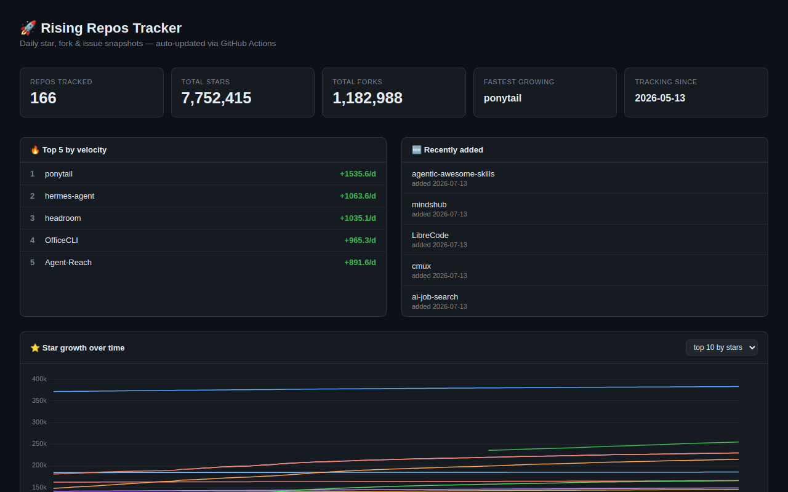

# 🚀 Rising Repos Tracker

> Automatically tracks daily GitHub stats (stars, forks, issues, velocity) for rising open source repos.


**[→ View Live Dashboard](https://patrick-creates.github.io/rising-repos-tracker/)**



<!-- AUTOGEN-STATS-START -->
## 📊 Current snapshot

> Auto-updated daily — last refreshed 2026-05-15

| Metric | Value |
|---|---|
| Repos tracked | **16** |
| Total stars | **2,122,416** |
| Total forks | **384,573** |
| Fastest growing | **hermes-agent** (+1513.5/day) |

### 🔥 Top 5 by velocity

| # | Repo | Stars | Stars/day |
|---|---|---:|---:|
| 1 | [NousResearch/hermes-agent](https://github.com/NousResearch/hermes-agent) | 151,072 | +1513.5 |
| 2 | [github/spec-kit](https://github.com/github/spec-kit) | 99,821 | +980.0 |
| 3 | [affaan-m/everything-claude-code](https://github.com/affaan-m/everything-claude-code) | 182,589 | +770.5 |
| 4 | [nextlevelbuilder/ui-ux-pro-max-skill](https://github.com/nextlevelbuilder/ui-ux-pro-max-skill) | 78,761 | +434.0 |
| 5 | [openclaw/openclaw](https://github.com/openclaw/openclaw) | 372,007 | +268.0 |

### 🆕 Recently added

- [frankbria/ralph-claude-code](https://github.com/frankbria/ralph-claude-code) — added 2026-05-13 — Autonomous AI dev loop for Claude Code with intelligent exit detection
- [openclaw/openclaw](https://github.com/openclaw/openclaw) — added 2026-05-13 — Your own personal AI assistant. Any OS. Any Platform. The lobster way. 🦞 
- [Significant-Gravitas/AutoGPT](https://github.com/Significant-Gravitas/AutoGPT) — added 2026-05-13 — AutoGPT is the vision of accessible AI for everyone, to use and to build on. Our mission is to provide the tools, so that you can focus on what matters.
<!-- AUTOGEN-STATS-END -->

<!-- AUTOGEN-DIAGRAM-START -->
<!-- AUTOGEN-DIAGRAM-END -->

<!-- AUTOGEN-WORKFLOWS-START -->
<!-- AUTOGEN-WORKFLOWS-END -->

<!-- AUTOGEN-REPOS-START -->
## 📋 All tracked repos

| Repo | Stars | Forks | Stars/day |
|---|---:|---:|---:|
| [openclaw/openclaw](https://github.com/openclaw/openclaw) | 372,007 | 77,013 | +268.0 |
| [Significant-Gravitas/AutoGPT](https://github.com/Significant-Gravitas/AutoGPT) | 184,316 | 46,234 | +17.5 |
| [affaan-m/everything-claude-code](https://github.com/affaan-m/everything-claude-code) | 182,589 | 28,125 | +770.5 |
| [f/prompts.chat](https://github.com/f/prompts.chat) | 162,259 | 21,125 | +43.5 |
| [NousResearch/hermes-agent](https://github.com/NousResearch/hermes-agent) | 151,072 | 23,936 | +1513.5 |
| [langgenius/dify](https://github.com/langgenius/dify) | 141,453 | 22,213 | +114.0 |
| [open-webui/open-webui](https://github.com/open-webui/open-webui) | 137,140 | 19,554 | +124.0 |
| [langchain-ai/langchain](https://github.com/langchain-ai/langchain) | 136,785 | 22,622 | +75.0 |
| [microsoft/markitdown](https://github.com/microsoft/markitdown) | 123,232 | 8,333 | +112.0 |
| [microsoft/generative-ai-for-beginners](https://github.com/microsoft/generative-ai-for-beginners) | 110,825 | 59,432 | +36.5 |
| [github/spec-kit](https://github.com/github/spec-kit) | 99,821 | 8,697 | +980.0 |
| [vllm-project/vllm](https://github.com/vllm-project/vllm) | 80,064 | 16,821 | +90.0 |
| [nextlevelbuilder/ui-ux-pro-max-skill](https://github.com/nextlevelbuilder/ui-ux-pro-max-skill) | 78,761 | 8,084 | +434.0 |
| [lobehub/lobehub](https://github.com/lobehub/lobehub) | 77,103 | 15,180 | +52.5 |
| [thedotmack/claude-mem](https://github.com/thedotmack/claude-mem) | 75,853 | 6,509 | +236.5 |
| [frankbria/ralph-claude-code](https://github.com/frankbria/ralph-claude-code) | 9,136 | 695 | +12.0 |
<!-- AUTOGEN-REPOS-END -->

---

## What it does

- Collects daily snapshots of stars, forks, watchers and open issues for every tracked repo
- Discovers new trending repos automatically every Monday using the GitHub Search API
- Generates AI summaries (use cases, similar tools, tags) for each tracked repo via GitHub Models
- Stores all history as plain JSON — no database, no backend
- Renders a live dashboard via GitHub Pages — updates daily, zero maintenance

## Tracked repos

Data lives in [`data/`](./data) — one folder per repo, one `history.json` per entry.  
The full watch list is in [`repos.json`](./repos.json).

## Fork & use it for yourself

This is my personal tracker — the watch list reflects what I find interesting. If you want to track different repos, the best path is to **fork this repo and run your own**.

### Setup

1. Fork this repo to your account
2. Replace the contents of [`repos.json`](./repos.json) with the repos you want to track (or just leave one entry — `discover.yml` will auto-add more every Monday)
3. Go to **Settings → Pages** and enable GitHub Pages from the `main` branch
4. Go to **Actions** and run **Collect Repo Stats** once manually to seed your first data point
5. Your dashboard will be live at `https://YOUR-USERNAME.github.io/rising-repos-tracker/`

That's it — daily collection and weekly discovery run automatically on schedule. Zero ongoing maintenance.

### Customizing what gets discovered

Edit [`scripts/discover.js`](./scripts/discover.js) to change:

- `MIN_STARS` — minimum star threshold for candidates
- `MAX_AGE_DAYS` — how recent a repo must be
- `MAX_NEW_REPOS` — how many to add per discovery run
- The `queries` array — GitHub Search API queries that define what "trending" means to you

### Adding a repo manually

Just edit `repos.json` directly:

```json
{
  "owner": "OWNER",
  "repo": "REPO",
  "added": "YYYY-MM-DD",
  "notes": "why you're tracking this"
}
```

The next daily collect run picks it up automatically.

## Stack

- **GitHub Actions** — scheduling and automation
- **GitHub Pages** — dashboard hosting
- **GitHub API** — data source
- **GitHub Models** — free AI summaries (gpt-4o-mini)
- **Chart.js** — star growth visualization
- **Mermaid** — architecture diagram (rendered by GitHub)
- No dependencies, no build step, no database

## License

MIT
