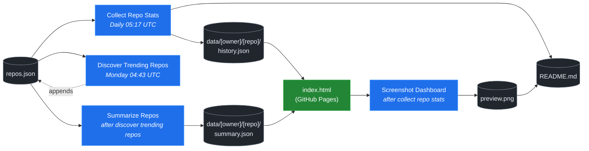

# 🚀 Rising Repos Tracker

> Automatically tracks daily GitHub stats (stars, forks, issues, velocity) for rising open source repos.

[](https://www.telosignal.com/)


**[→ View Live Dashboard](https://patrick-creates.github.io/rising-repos-tracker/)**

Built and maintained by [Telosignal](https://www.telosignal.com/).


<!-- AUTOGEN-STATS-START -->
## 📊 Current snapshot

> Auto-updated daily — last refreshed 2026-06-27

| Metric | Value |
|---|---|
| Repos tracked | **121** |
| Total stars | **6,792,681** |
| Total forks | **1,053,040** |
| Fastest growing | **ponytail** (+2511.0/day) |

### 🔥 Top 5 by velocity

| # | Repo | Stars | Stars/day |
|---|---|---:|---:|
| 1 | [DietrichGebert/ponytail](https://github.com/DietrichGebert/ponytail) | 60,574 | +2511.0 |
| 2 | [chopratejas/headroom](https://github.com/chopratejas/headroom) | 52,176 | +2001.1 |
| 3 | [headroomlabs-ai/headroom](https://github.com/headroomlabs-ai/headroom) | 52,176 | +1254.6 |
| 4 | [NousResearch/hermes-agent](https://github.com/NousResearch/hermes-agent) | 203,950 | +1242.3 |
| 5 | [Panniantong/Agent-Reach](https://github.com/Panniantong/Agent-Reach) | 42,761 | +1014.9 |

### 🆕 Recently added

- [obra/superpowers](https://github.com/obra/superpowers) — added 2026-06-22 — An agentic skills framework & software development methodology that works.
- [DietrichGebert/ponytail](https://github.com/DietrichGebert/ponytail) — added 2026-06-22 — Makes your AI agent think like the laziest senior dev in the room. The best code is the code you never wrote.
- [headroomlabs-ai/headroom](https://github.com/headroomlabs-ai/headroom) — added 2026-06-22 — Compress tool outputs, logs, files, and RAG chunks before they reach the LLM. 60-95% fewer tokens, same answers. Library, proxy, MCP server.
<!-- AUTOGEN-STATS-END -->

<!-- AUTOGEN-DIAGRAM-START -->
## 🔄 How it works


<!-- AUTOGEN-DIAGRAM-END -->

<!-- AUTOGEN-WORKFLOWS-START -->
## ⚙️ Workflows

| File | Schedule | Name |
|---|---|---|
| `collect.yml` | Daily 05:17 UTC | Collect Repo Stats |
| `discover.yml` | Monday 04:43 UTC | Discover Trending Repos |
| `screenshot.yml` | After Collect Repo Stats | Screenshot Dashboard |
| `summarize.yml` | After Discover Trending Repos | Summarize Repos |

> All workflows commit results directly back to the repo. Schedules are best-effort — GitHub Actions cron can drift by a few minutes.
<!-- AUTOGEN-WORKFLOWS-END -->

<!-- AUTOGEN-REPOS-START -->
## 📋 All tracked repos

| Repo | Stars | Forks | Stars/day |
|---|---:|---:|---:|
| [openclaw/openclaw](https://github.com/openclaw/openclaw) | 380,663 | 79,754 | +204.3 |
| [obra/superpowers](https://github.com/obra/superpowers) | 239,643 | 21,256 | +813.2 |
| [affaan-m/everything-claude-code](https://github.com/affaan-m/everything-claude-code) | 222,287 | 34,027 | +916.4 |
| [affaan-m/ECC](https://github.com/affaan-m/ECC) | 222,287 | 34,027 | +910.8 |
| [NousResearch/hermes-agent](https://github.com/NousResearch/hermes-agent) | 203,950 | 36,618 | +1242.3 |
| [Significant-Gravitas/AutoGPT](https://github.com/Significant-Gravitas/AutoGPT) | 185,169 | 46,129 | +19.7 |
| [f/prompts.chat](https://github.com/f/prompts.chat) | 164,416 | 21,287 | +49.9 |
| [microsoft/markitdown](https://github.com/microsoft/markitdown) | 159,660 | 11,185 | +814.5 |
| [langgenius/dify](https://github.com/langgenius/dify) | 146,705 | 23,105 | +121.8 |
| [open-webui/open-webui](https://github.com/open-webui/open-webui) | 143,172 | 20,621 | +139.6 |
| [langchain-ai/langchain](https://github.com/langchain-ai/langchain) | 140,313 | 23,289 | +81.7 |
| [github/spec-kit](https://github.com/github/spec-kit) | 115,752 | 10,217 | +397.6 |
| [microsoft/generative-ai-for-beginners](https://github.com/microsoft/generative-ai-for-beginners) | 112,338 | 60,368 | +35.2 |
| [farion1231/cc-switch](https://github.com/farion1231/cc-switch) | 109,213 | 7,225 | +879.2 |
| [nextlevelbuilder/ui-ux-pro-max-skill](https://github.com/nextlevelbuilder/ui-ux-pro-max-skill) | 96,955 | 10,205 | +423.6 |
| [ChatGPTNextWeb/NextChat](https://github.com/ChatGPTNextWeb/NextChat) | 88,316 | 59,512 | +7.0 |
| [thedotmack/claude-mem](https://github.com/thedotmack/claude-mem) | 84,578 | 7,301 | +204.4 |
| [vllm-project/vllm](https://github.com/vllm-project/vllm) | 84,509 | 18,570 | +102.8 |
| [lobehub/lobehub](https://github.com/lobehub/lobehub) | 79,145 | 15,487 | +47.7 |
| [OpenHands/OpenHands](https://github.com/OpenHands/OpenHands) | 78,454 | 9,983 | +113.0 |
| [JuliusBrussee/caveman](https://github.com/JuliusBrussee/caveman) | 77,291 | 4,374 | +394.5 |
| [dair-ai/Prompt-Engineering-Guide](https://github.com/dair-ai/Prompt-Engineering-Guide) | 76,020 | 8,328 | +33.0 |
| [ruvnet/RuView](https://github.com/ruvnet/RuView) | 75,623 | 10,108 | +294.8 |
| [openai/openai-cookbook](https://github.com/openai/openai-cookbook) | 74,430 | 12,591 | +20.5 |
| [nexu-io/open-design](https://github.com/nexu-io/open-design) | 71,783 | 8,109 | +690.2 |
| [shareAI-lab/learn-claude-code](https://github.com/shareAI-lab/learn-claude-code) | 68,603 | 11,167 | +188.2 |
| [unslothai/unsloth](https://github.com/unslothai/unsloth) | 67,443 | 6,062 | +73.6 |
| [xtekky/gpt4free](https://github.com/xtekky/gpt4free) | 66,460 | 13,568 | +5.5 |
| [rtk-ai/rtk](https://github.com/rtk-ai/rtk) | 66,458 | 4,104 | +422.0 |
| [ComposioHQ/awesome-claude-skills](https://github.com/ComposioHQ/awesome-claude-skills) | 66,061 | 7,343 | +141.8 |
| [code-yeongyu/oh-my-openagent](https://github.com/code-yeongyu/oh-my-openagent) | 63,764 | 5,215 | +135.9 |
| [datawhalechina/hello-agents](https://github.com/datawhalechina/hello-agents) | 62,158 | 7,678 | +287.4 |
| [shanraisshan/claude-code-best-practice](https://github.com/shanraisshan/claude-code-best-practice) | 61,192 | 6,114 | +192.3 |
| [DietrichGebert/ponytail](https://github.com/DietrichGebert/ponytail) | 60,574 | 3,094 | +2511.0 |
| [koala73/worldmonitor](https://github.com/koala73/worldmonitor) | 60,200 | 9,390 | +145.8 |
| [tw93/Pake](https://github.com/tw93/Pake) | 57,936 | 11,580 | +228.9 |
| [Fission-AI/OpenSpec](https://github.com/Fission-AI/OpenSpec) | 56,874 | 3,968 | +202.2 |
| [MemPalace/mempalace](https://github.com/MemPalace/mempalace) | 56,587 | 7,313 | +104.7 |
| [santifer/career-ops](https://github.com/santifer/career-ops) | 56,002 | 11,050 | +268.9 |
| [FlowiseAI/Flowise](https://github.com/FlowiseAI/Flowise) | 54,049 | 24,599 | +28.7 |
| [chopratejas/headroom](https://github.com/chopratejas/headroom) | 52,176 | 3,711 | +2001.1 |
| [headroomlabs-ai/headroom](https://github.com/headroomlabs-ai/headroom) | 52,176 | 3,711 | +1254.6 |
| [Leonxlnx/taste-skill](https://github.com/Leonxlnx/taste-skill) | 51,729 | 3,563 | +819.8 |
| [BerriAI/litellm](https://github.com/BerriAI/litellm) | 51,720 | 9,217 | +108.3 |
| [ggml-org/whisper.cpp](https://github.com/ggml-org/whisper.cpp) | 51,082 | 5,705 | +31.4 |
| [ZhuLinsen/daily_stock_analysis](https://github.com/ZhuLinsen/daily_stock_analysis) | 50,248 | 43,898 | +345.7 |
| [hesreallyhim/awesome-claude-code](https://github.com/hesreallyhim/awesome-claude-code) | 47,403 | 4,143 | +82.7 |
| [mvanhorn/last30days-skill](https://github.com/mvanhorn/last30days-skill) | 47,028 | 3,900 | +755.6 |
| [Aider-AI/aider](https://github.com/Aider-AI/aider) | 46,741 | 4,654 | +44.5 |
| [asgeirtj/system_prompts_leaks](https://github.com/asgeirtj/system_prompts_leaks) | 46,425 | 7,612 | +151.0 |
| [zhayujie/CowAgent](https://github.com/zhayujie/CowAgent) | 45,635 | 10,236 | +27.0 |
| [HKUDS/nanobot](https://github.com/HKUDS/nanobot) | 44,779 | 7,893 | +52.5 |
| [ChromeDevTools/chrome-devtools-mcp](https://github.com/ChromeDevTools/chrome-devtools-mcp) | 44,522 | 2,880 | +116.0 |
| [elder-plinius/CL4R1T4S](https://github.com/elder-plinius/CL4R1T4S) | 43,996 | 8,949 | +425.4 |
| [Panniantong/Agent-Reach](https://github.com/Panniantong/Agent-Reach) | 42,761 | 3,402 | +1014.9 |
| [sickn33/antigravity-awesome-skills](https://github.com/sickn33/antigravity-awesome-skills) | 41,802 | 6,703 | +94.7 |
| [chatboxai/chatbox](https://github.com/chatboxai/chatbox) | 40,638 | 4,123 | +16.1 |
| [QuantumNous/new-api](https://github.com/QuantumNous/new-api) | 40,269 | 9,228 | +148.8 |
| [danny-avila/LibreChat](https://github.com/danny-avila/LibreChat) | 39,882 | 8,169 | +73.1 |
| [Hmbown/CodeWhale](https://github.com/Hmbown/CodeWhale) | 39,073 | 3,369 | +133.4 |
| [chatanywhere/GPT_API_free](https://github.com/chatanywhere/GPT_API_free) | 38,590 | 2,653 | +13.2 |
| [router-for-me/CLIProxyAPI](https://github.com/router-for-me/CLIProxyAPI) | 38,495 | 6,363 | +113.7 |
| [kepano/obsidian-skills](https://github.com/kepano/obsidian-skills) | 38,439 | 2,727 | +175.2 |
| [wshobson/agents](https://github.com/wshobson/agents) | 37,236 | 4,006 | +39.4 |
| [Yeachan-Heo/oh-my-claudecode](https://github.com/Yeachan-Heo/oh-my-claudecode) | 37,051 | 3,344 | +67.5 |
| [google/langextract](https://github.com/google/langextract) | 36,961 | 2,551 | +12.3 |
| [rohitg00/ai-engineering-from-scratch](https://github.com/rohitg00/ai-engineering-from-scratch) | 36,506 | 6,003 | +390.1 |
| [langchain-ai/langgraph](https://github.com/langchain-ai/langgraph) | 35,865 | 5,998 | +89.0 |
| [github/awesome-copilot](https://github.com/github/awesome-copilot) | 35,803 | 4,424 | +60.5 |
| [AstrBotDevs/AstrBot](https://github.com/AstrBotDevs/AstrBot) | 35,421 | 2,450 | +70.5 |
| [songquanpeng/one-api](https://github.com/songquanpeng/one-api) | 35,285 | 6,677 | +32.6 |
| [PDFMathTranslate/PDFMathTranslate](https://github.com/PDFMathTranslate/PDFMathTranslate) | 35,227 | 3,147 | +36.8 |
| [coreyhaines31/marketingskills](https://github.com/coreyhaines31/marketingskills) | 35,134 | 5,737 | +142.2 |
| [jamiepine/voicebox](https://github.com/jamiepine/voicebox) | 34,601 | 4,164 | +214.6 |
| [zeroclaw-labs/zeroclaw](https://github.com/zeroclaw-labs/zeroclaw) | 32,056 | 4,769 | +14.6 |
| [heygen-com/hyperframes](https://github.com/heygen-com/hyperframes) | 31,605 | 2,942 | +318.1 |
| [anthropics/claude-plugins-official](https://github.com/anthropics/claude-plugins-official) | 31,182 | 3,401 | +83.5 |
| [Gitlawb/openclaude](https://github.com/Gitlawb/openclaude) | 29,440 | 8,827 | +50.2 |
| [iOfficeAI/AionUi](https://github.com/iOfficeAI/AionUi) | 28,931 | 2,866 | +60.9 |
| [googleworkspace/cli](https://github.com/googleworkspace/cli) | 28,929 | 1,624 | +85.0 |
| [voideditor/void](https://github.com/voideditor/void) | 28,820 | 2,562 | +0.6 |
| [AlexsJones/llmfit](https://github.com/AlexsJones/llmfit) | 28,665 | 1,761 | +64.0 |
| [BloopAI/vibe-kanban](https://github.com/BloopAI/vibe-kanban) | 27,173 | 2,869 | +17.8 |
| [usestrix/strix](https://github.com/usestrix/strix) | 26,241 | 2,951 | +20.4 |
| [volcengine/OpenViking](https://github.com/volcengine/OpenViking) | 26,101 | 2,028 | +40.7 |
| [jarrodwatts/claude-hud](https://github.com/jarrodwatts/claude-hud) | 25,829 | 1,176 | +59.9 |
| [zai-org/Open-AutoGLM](https://github.com/zai-org/Open-AutoGLM) | 25,618 | 3,990 | +8.2 |
| [p-e-w/heretic](https://github.com/p-e-w/heretic) | 25,522 | 2,752 | +81.6 |
| [jackwener/OpenCLI](https://github.com/jackwener/OpenCLI) | 25,420 | 2,527 | +85.3 |
| [langchain-ai/deepagents](https://github.com/langchain-ai/deepagents) | 25,174 | 3,557 | +53.6 |
| [esengine/DeepSeek-Reasonix](https://github.com/esengine/DeepSeek-Reasonix) | 25,016 | 1,516 | +288.9 |
| [toon-format/toon](https://github.com/toon-format/toon) | 24,692 | 1,094 | +10.3 |
| [rohitg00/agentmemory](https://github.com/rohitg00/agentmemory) | 24,131 | 1,983 | +121.4 |
| [winfunc/opcode](https://github.com/winfunc/opcode) | 22,113 | 1,712 | +5.7 |
| [mukul975/Anthropic-Cybersecurity-Skills](https://github.com/mukul975/Anthropic-Cybersecurity-Skills) | 21,896 | 2,506 | +754.8 |
| [JCodesMore/ai-website-cloner-template](https://github.com/JCodesMore/ai-website-cloner-template) | 21,564 | 3,123 | +380.9 |
| [coze-dev/coze-studio](https://github.com/coze-dev/coze-studio) | 21,060 | 3,064 | +5.9 |
| [NirDiamant/agents-towards-production](https://github.com/NirDiamant/agents-towards-production) | 20,861 | 2,769 | +11.9 |
| [alibaba/page-agent](https://github.com/alibaba/page-agent) | 20,268 | 1,748 | +142.5 |
| [agentscope-ai/QwenPaw](https://github.com/agentscope-ai/QwenPaw) | 20,191 | 2,684 | +201.1 |
| [tirth8205/code-review-graph](https://github.com/tirth8205/code-review-graph) | 18,941 | 2,031 | +35.6 |
| [decolua/9router](https://github.com/decolua/9router) | 18,570 | 2,979 | +83.3 |
| [tanweai/pua](https://github.com/tanweai/pua) | 18,476 | 1,112 | +19.2 |
| [mksglu/context-mode](https://github.com/mksglu/context-mode) | 18,234 | 1,281 | +63.8 |
| [RightNow-AI/openfang](https://github.com/RightNow-AI/openfang) | 17,926 | 2,273 | +8.3 |
| [Tencent/WeKnora](https://github.com/Tencent/WeKnora) | 17,403 | 2,284 | +92.6 |
| [datawhalechina/easy-vibe](https://github.com/datawhalechina/easy-vibe) | 17,365 | 1,637 | +35.3 |
| [microsoft/agent-lightning](https://github.com/microsoft/agent-lightning) | 17,349 | 1,521 | +3.2 |
| [jundot/omlx](https://github.com/jundot/omlx) | 17,139 | 1,456 | +42.3 |
| [danielmiessler/LifeOS](https://github.com/danielmiessler/LifeOS) | 16,150 | 2,220 | +16.8 |
| [cft0808/edict](https://github.com/cft0808/edict) | 16,125 | 1,698 | +5.3 |
| [jnMetaCode/agency-agents-zh](https://github.com/jnMetaCode/agency-agents-zh) | 15,673 | 2,718 | +53.4 |
| [MemoriLabs/Memori](https://github.com/MemoriLabs/Memori) | 15,465 | 2,724 | +24.4 |
| [steipete/CodexBar](https://github.com/steipete/CodexBar) | 15,427 | 1,272 | +44.8 |
| [nesquena/hermes-webui](https://github.com/nesquena/hermes-webui) | 15,083 | 1,933 | +49.0 |
| [can1357/oh-my-pi](https://github.com/can1357/oh-my-pi) | 14,822 | 1,310 | +165.2 |
| [xpzouying/xiaohongshu-mcp](https://github.com/xpzouying/xiaohongshu-mcp) | 14,384 | 2,146 | +19.4 |
| [yusufkaraaslan/Skill_Seekers](https://github.com/yusufkaraaslan/Skill_Seekers) | 14,279 | 1,463 | +10.6 |
| [kyegomez/OpenMythos](https://github.com/kyegomez/OpenMythos) | 14,241 | 3,192 | +17.2 |
| [NevaMind-AI/memU](https://github.com/NevaMind-AI/memU) | 13,933 | 1,035 | +6.6 |
| [frankbria/ralph-claude-code](https://github.com/frankbria/ralph-claude-code) | 9,466 | 723 | +7.9 |
<!-- AUTOGEN-REPOS-END -->

---

## What it does

- Collects daily snapshots of stars, forks, watchers and open issues for every tracked repo
- Discovers new trending repos automatically every Monday using the GitHub Search API
- Generates AI summaries (use cases, similar tools, tags) for each tracked repo via GitHub Models
- Stores all history as plain JSON — no database, no backend
- Renders a live dashboard via GitHub Pages — updates daily, zero maintenance

## Tracked repos

Data lives in [`data/`](./data) — one folder per repo, one `history.json` per entry.  
The full watch list is in [`repos.json`](./repos.json).

## Fork & use it for yourself

This is my personal tracker — the watch list reflects what I find interesting. If you want to track different repos, the best path is to **fork this repo and run your own**.

### Setup

1. Fork this repo to your account
2. Replace the contents of [`repos.json`](./repos.json) with the repos you want to track (or just leave one entry — `discover.yml` will auto-add more every Monday)
3. Go to **Settings → Pages** and enable GitHub Pages from the `main` branch
4. Go to **Actions** and run **Collect Repo Stats** once manually to seed your first data point
5. Your dashboard will be live at `https://YOUR-USERNAME.github.io/rising-repos-tracker/`

That's it — daily collection and weekly discovery run automatically on schedule. Zero ongoing maintenance.

### Customizing what gets discovered

Edit [`scripts/discover.js`](./scripts/discover.js) to change:

- `MIN_STARS` — minimum star threshold for candidates
- `MAX_AGE_DAYS` — how recent a repo must be
- `MAX_NEW_REPOS` — how many to add per discovery run
- The `queries` array — GitHub Search API queries that define what "trending" means to you

### Adding a repo manually

Just edit `repos.json` directly:

```json
{
  "owner": "OWNER",
  "repo": "REPO",
  "added": "YYYY-MM-DD",
  "notes": "why you're tracking this"
}
```

The next daily collect run picks it up automatically.

## Stack

- **GitHub Actions** — scheduling and automation
- **GitHub Pages** — dashboard hosting
- **GitHub API** — data source
- **GitHub Models** — free AI summaries (gpt-4o-mini)
- **Chart.js** — star growth visualization
- **Mermaid** — architecture diagram (rendered by GitHub)
- No dependencies, no build step, no database

## License

MIT
