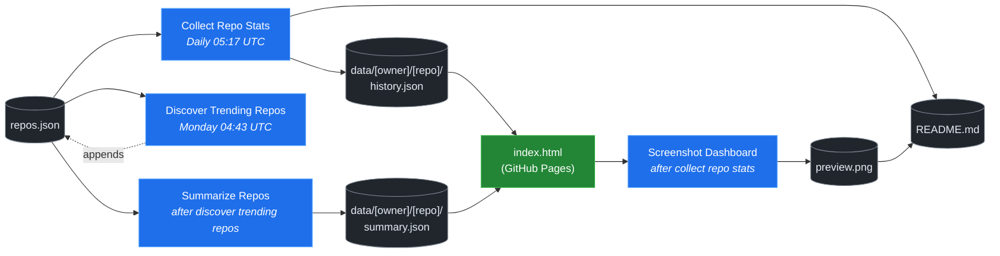

# 🚀 Rising Repos Tracker

> Automatically tracks daily GitHub stats (stars, forks, issues, velocity) for rising open source repos.

[](https://www.telosignal.com/)


**[→ View Live Dashboard](https://patrick-creates.github.io/rising-repos-tracker/)**

Built and maintained by [Telosignal](https://www.telosignal.com/).


<!-- AUTOGEN-STATS-START -->
## 📊 Current snapshot

> Auto-updated daily — last refreshed 2026-06-21

| Metric | Value |
|---|---|
| Repos tracked | **106** |
| Total stars | **6,115,122** |
| Total forks | **980,281** |
| Fastest growing | **headroom** (+2402.2/day) |

### 🔥 Top 5 by velocity

| # | Repo | Stars | Stars/day |
|---|---|---:|---:|
| 1 | [chopratejas/headroom](https://github.com/chopratejas/headroom) | 42,576 | +2402.2 |
| 2 | [NousResearch/hermes-agent](https://github.com/NousResearch/hermes-agent) | 198,545 | +1294.9 |
| 3 | [affaan-m/ECC](https://github.com/affaan-m/ECC) | 218,992 | +991.2 |
| 4 | [Panniantong/Agent-Reach](https://github.com/Panniantong/Agent-Reach) | 36,267 | +983.8 |
| 5 | [affaan-m/everything-claude-code](https://github.com/affaan-m/everything-claude-code) | 218,991 | +972.9 |

### 🆕 Recently added

- [elder-plinius/CL4R1T4S](https://github.com/elder-plinius/CL4R1T4S) — added 2026-06-15 — LEAKED SYSTEM PROMPTS FOR CHATGPT, CLAUDE, GEMINI, GROK, PERPLEXITY, CURSOR, LOVABLE, REPLIT, AND MORE! - AI SYSTEMS TRANSPARENCY FOR ALL! 👐
- [chopratejas/headroom](https://github.com/chopratejas/headroom) — added 2026-06-15 — Compress tool outputs, logs, files, and RAG chunks before they reach the LLM. 60-95% fewer tokens, same answers. Library, proxy, MCP server.
- [alibaba/page-agent](https://github.com/alibaba/page-agent) — added 2026-06-15 — JavaScript in-page GUI agent. Control web interfaces with natural language.
<!-- AUTOGEN-STATS-END -->

<!-- AUTOGEN-DIAGRAM-START -->
## 🔄 How it works


<!-- AUTOGEN-DIAGRAM-END -->

<!-- AUTOGEN-WORKFLOWS-START -->
## ⚙️ Workflows

| File | Schedule | Name |
|---|---|---|
| `collect.yml` | Daily 05:17 UTC | Collect Repo Stats |
| `discover.yml` | Monday 04:43 UTC | Discover Trending Repos |
| `screenshot.yml` | After Collect Repo Stats | Screenshot Dashboard |
| `summarize.yml` | After Discover Trending Repos | Summarize Repos |

> All workflows commit results directly back to the repo. Schedules are best-effort — GitHub Actions cron can drift by a few minutes.
<!-- AUTOGEN-WORKFLOWS-END -->

<!-- AUTOGEN-REPOS-START -->
## 📋 All tracked repos

| Repo | Stars | Forks | Stars/day |
|---|---:|---:|---:|
| [openclaw/openclaw](https://github.com/openclaw/openclaw) | 379,735 | 79,490 | +211.9 |
| [affaan-m/ECC](https://github.com/affaan-m/ECC) | 218,992 | 33,575 | +991.2 |
| [affaan-m/everything-claude-code](https://github.com/affaan-m/everything-claude-code) | 218,991 | 33,575 | +972.9 |
| [NousResearch/hermes-agent](https://github.com/NousResearch/hermes-agent) | 198,545 | 35,235 | +1294.9 |
| [Significant-Gravitas/AutoGPT](https://github.com/Significant-Gravitas/AutoGPT) | 185,048 | 46,124 | +19.7 |
| [f/prompts.chat](https://github.com/f/prompts.chat) | 163,995 | 21,254 | +46.7 |
| [microsoft/markitdown](https://github.com/microsoft/markitdown) | 156,743 | 10,916 | +865.0 |
| [langgenius/dify](https://github.com/langgenius/dify) | 146,010 | 22,962 | +122.7 |
| [open-webui/open-webui](https://github.com/open-webui/open-webui) | 142,470 | 20,487 | +143.0 |
| [langchain-ai/langchain](https://github.com/langchain-ai/langchain) | 139,784 | 23,185 | +80.7 |
| [github/spec-kit](https://github.com/github/spec-kit) | 114,453 | 10,105 | +425.4 |
| [microsoft/generative-ai-for-beginners](https://github.com/microsoft/generative-ai-for-beginners) | 112,179 | 60,253 | +36.6 |
| [farion1231/cc-switch](https://github.com/farion1231/cc-switch) | 105,396 | 6,972 | +922.1 |
| [nextlevelbuilder/ui-ux-pro-max-skill](https://github.com/nextlevelbuilder/ui-ux-pro-max-skill) | 94,499 | 9,901 | +425.8 |
| [ChatGPTNextWeb/NextChat](https://github.com/ChatGPTNextWeb/NextChat) | 88,274 | 59,543 | +7.0 |
| [thedotmack/claude-mem](https://github.com/thedotmack/claude-mem) | 83,466 | 7,222 | +207.3 |
| [vllm-project/vllm](https://github.com/vllm-project/vllm) | 83,445 | 18,276 | +91.3 |
| [lobehub/lobehub](https://github.com/lobehub/lobehub) | 78,912 | 15,462 | +49.1 |
| [OpenHands/OpenHands](https://github.com/OpenHands/OpenHands) | 77,880 | 9,901 | +116.1 |
| [dair-ai/Prompt-Engineering-Guide](https://github.com/dair-ai/Prompt-Engineering-Guide) | 75,804 | 8,266 | +32.4 |
| [JuliusBrussee/caveman](https://github.com/JuliusBrussee/caveman) | 75,246 | 4,245 | +403.9 |
| [ruvnet/RuView](https://github.com/ruvnet/RuView) | 74,884 | 9,988 | +333.0 |
| [openai/openai-cookbook](https://github.com/openai/openai-cookbook) | 74,284 | 12,576 | +19.9 |
| [nexu-io/open-design](https://github.com/nexu-io/open-design) | 68,365 | 7,683 | +711.5 |
| [shareAI-lab/learn-claude-code](https://github.com/shareAI-lab/learn-claude-code) | 67,618 | 11,000 | +192.4 |
| [unslothai/unsloth](https://github.com/unslothai/unsloth) | 66,994 | 6,018 | +73.4 |
| [xtekky/gpt4free](https://github.com/xtekky/gpt4free) | 66,392 | 13,575 | +4.4 |
| [ComposioHQ/awesome-claude-skills](https://github.com/ComposioHQ/awesome-claude-skills) | 65,383 | 7,265 | +146.9 |
| [rtk-ai/rtk](https://github.com/rtk-ai/rtk) | 64,328 | 3,965 | +433.8 |
| [code-yeongyu/oh-my-openagent](https://github.com/code-yeongyu/oh-my-openagent) | 63,100 | 5,106 | +140.4 |
| [datawhalechina/hello-agents](https://github.com/datawhalechina/hello-agents) | 60,610 | 7,470 | +292.6 |
| [shanraisshan/claude-code-best-practice](https://github.com/shanraisshan/claude-code-best-practice) | 58,435 | 5,873 | +145.2 |
| [koala73/worldmonitor](https://github.com/koala73/worldmonitor) | 57,700 | 9,177 | +98.0 |
| [MemPalace/mempalace](https://github.com/MemPalace/mempalace) | 56,079 | 7,262 | +108.2 |
| [Fission-AI/OpenSpec](https://github.com/Fission-AI/OpenSpec) | 55,818 | 3,912 | +206.8 |
| [tw93/Pake](https://github.com/tw93/Pake) | 55,391 | 10,967 | +194.5 |
| [santifer/career-ops](https://github.com/santifer/career-ops) | 54,964 | 10,883 | +285.8 |
| [FlowiseAI/Flowise](https://github.com/FlowiseAI/Flowise) | 53,855 | 24,564 | +28.1 |
| [BerriAI/litellm](https://github.com/BerriAI/litellm) | 51,015 | 9,033 | +106.7 |
| [ggml-org/whisper.cpp](https://github.com/ggml-org/whisper.cpp) | 50,912 | 5,683 | +31.9 |
| [Leonxlnx/taste-skill](https://github.com/Leonxlnx/taste-skill) | 48,031 | 3,342 | +880.9 |
| [hesreallyhim/awesome-claude-code](https://github.com/hesreallyhim/awesome-claude-code) | 46,948 | 4,096 | +83.9 |
| [Aider-AI/aider](https://github.com/Aider-AI/aider) | 46,519 | 4,632 | +45.8 |
| [zhayujie/CowAgent](https://github.com/zhayujie/CowAgent) | 45,504 | 10,224 | +27.9 |
| [mvanhorn/last30days-skill](https://github.com/mvanhorn/last30days-skill) | 45,181 | 3,732 | +962.3 |
| [HKUDS/nanobot](https://github.com/HKUDS/nanobot) | 44,494 | 7,861 | +53.4 |
| [ChromeDevTools/chrome-devtools-mcp](https://github.com/ChromeDevTools/chrome-devtools-mcp) | 44,094 | 2,847 | +123.8 |
| [asgeirtj/system_prompts_leaks](https://github.com/asgeirtj/system_prompts_leaks) | 43,971 | 7,284 | +105.5 |
| [ZhuLinsen/daily_stock_analysis](https://github.com/ZhuLinsen/daily_stock_analysis) | 43,769 | 41,179 | +182.6 |
| [elder-plinius/CL4R1T4S](https://github.com/elder-plinius/CL4R1T4S) | 42,926 | 8,619 | +672.5 |
| [chopratejas/headroom](https://github.com/chopratejas/headroom) | 42,576 | 2,935 | +2402.2 |
| [sickn33/antigravity-awesome-skills](https://github.com/sickn33/antigravity-awesome-skills) | 41,267 | 6,638 | +95.9 |
| [chatboxai/chatbox](https://github.com/chatboxai/chatbox) | 40,576 | 4,116 | +17.1 |
| [danny-avila/LibreChat](https://github.com/danny-avila/LibreChat) | 39,551 | 8,105 | +77.1 |
| [QuantumNous/new-api](https://github.com/QuantumNous/new-api) | 39,484 | 9,002 | +152.9 |
| [Hmbown/CodeWhale](https://github.com/Hmbown/CodeWhale) | 38,767 | 3,338 | +151.7 |
| [chatanywhere/GPT_API_free](https://github.com/chatanywhere/GPT_API_free) | 38,523 | 2,652 | +13.6 |
| [router-for-me/CLIProxyAPI](https://github.com/router-for-me/CLIProxyAPI) | 37,990 | 6,281 | +120.2 |
| [wshobson/agents](https://github.com/wshobson/agents) | 37,004 | 3,997 | +39.6 |
| [google/langextract](https://github.com/google/langextract) | 36,928 | 2,548 | +13.8 |
| [Yeachan-Heo/oh-my-claudecode](https://github.com/Yeachan-Heo/oh-my-claudecode) | 36,701 | 3,322 | +69.5 |
| [kepano/obsidian-skills](https://github.com/kepano/obsidian-skills) | 36,272 | 2,576 | +119.4 |
| [Panniantong/Agent-Reach](https://github.com/Panniantong/Agent-Reach) | 36,267 | 2,882 | +983.8 |
| [github/awesome-copilot](https://github.com/github/awesome-copilot) | 35,355 | 4,371 | +57.4 |
| [rohitg00/ai-engineering-from-scratch](https://github.com/rohitg00/ai-engineering-from-scratch) | 35,165 | 5,740 | +440.1 |
| [songquanpeng/one-api](https://github.com/songquanpeng/one-api) | 35,123 | 6,654 | +33.8 |
| [AstrBotDevs/AstrBot](https://github.com/AstrBotDevs/AstrBot) | 35,041 | 2,414 | +72.6 |
| [PDFMathTranslate/PDFMathTranslate](https://github.com/PDFMathTranslate/PDFMathTranslate) | 34,982 | 3,122 | +35.9 |
| [coreyhaines31/marketingskills](https://github.com/coreyhaines31/marketingskills) | 34,371 | 5,625 | +146.7 |
| [zeroclaw-labs/zeroclaw](https://github.com/zeroclaw-labs/zeroclaw) | 31,967 | 4,741 | +14.6 |
| [jamiepine/voicebox](https://github.com/jamiepine/voicebox) | 31,174 | 3,849 | +107.6 |
| [anthropics/claude-plugins-official](https://github.com/anthropics/claude-plugins-official) | 30,524 | 3,326 | +75.7 |
| [Gitlawb/openclaude](https://github.com/Gitlawb/openclaude) | 29,226 | 8,794 | +54.5 |
| [heygen-com/hyperframes](https://github.com/heygen-com/hyperframes) | 29,216 | 2,766 | +281.2 |
| [voideditor/void](https://github.com/voideditor/void) | 28,815 | 2,546 | +0.5 |
| [iOfficeAI/AionUi](https://github.com/iOfficeAI/AionUi) | 28,577 | 2,819 | +61.5 |
| [AlexsJones/llmfit](https://github.com/AlexsJones/llmfit) | 28,404 | 1,742 | +70.2 |
| [googleworkspace/cli](https://github.com/googleworkspace/cli) | 27,181 | 1,429 | +23.1 |
| [BloopAI/vibe-kanban](https://github.com/BloopAI/vibe-kanban) | 27,071 | 2,866 | +18.1 |
| [usestrix/strix](https://github.com/usestrix/strix) | 26,076 | 2,931 | +18.3 |
| [volcengine/OpenViking](https://github.com/volcengine/OpenViking) | 25,856 | 2,002 | +40.6 |
| [zai-org/Open-AutoGLM](https://github.com/zai-org/Open-AutoGLM) | 25,571 | 3,986 | +8.4 |
| [jarrodwatts/claude-hud](https://github.com/jarrodwatts/claude-hud) | 25,505 | 1,162 | +62.7 |
| [p-e-w/heretic](https://github.com/p-e-w/heretic) | 25,282 | 2,720 | +100.8 |
| [langchain-ai/deepagents](https://github.com/langchain-ai/deepagents) | 24,887 | 3,509 | +56.3 |
| [jackwener/OpenCLI](https://github.com/jackwener/OpenCLI) | 24,867 | 2,476 | +82.1 |
| [toon-format/toon](https://github.com/toon-format/toon) | 24,629 | 1,092 | +10.2 |
| [rohitg00/agentmemory](https://github.com/rohitg00/agentmemory) | 23,575 | 1,938 | +134.6 |
| [esengine/DeepSeek-Reasonix](https://github.com/esengine/DeepSeek-Reasonix) | 23,429 | 1,416 | +300.2 |
| [winfunc/opcode](https://github.com/winfunc/opcode) | 22,076 | 1,709 | +5.5 |
| [coze-dev/coze-studio](https://github.com/coze-dev/coze-studio) | 21,007 | 3,056 | +4.5 |
| [NirDiamant/agents-towards-production](https://github.com/NirDiamant/agents-towards-production) | 20,795 | 2,763 | +12.4 |
| [agentscope-ai/QwenPaw](https://github.com/agentscope-ai/QwenPaw) | 19,679 | 2,652 | +316.8 |
| [tirth8205/code-review-graph](https://github.com/tirth8205/code-review-graph) | 18,740 | 2,010 | +37.7 |
| [alibaba/page-agent](https://github.com/alibaba/page-agent) | 18,686 | 1,609 | +21.3 |
| [tanweai/pua](https://github.com/tanweai/pua) | 18,367 | 1,104 | +20.2 |
| [decolua/9router](https://github.com/decolua/9router) | 18,114 | 2,842 | +90.5 |
| [RightNow-AI/openfang](https://github.com/RightNow-AI/openfang) | 17,868 | 2,268 | +7.0 |
| [mksglu/context-mode](https://github.com/mksglu/context-mode) | 17,863 | 1,262 | +65.8 |
| [microsoft/agent-lightning](https://github.com/microsoft/agent-lightning) | 17,322 | 1,517 | +1.8 |
| [JCodesMore/ai-website-cloner-template](https://github.com/JCodesMore/ai-website-cloner-template) | 17,299 | 2,692 | +51.0 |
| [datawhalechina/easy-vibe](https://github.com/datawhalechina/easy-vibe) | 17,160 | 1,620 | +36.5 |
| [jundot/omlx](https://github.com/jundot/omlx) | 16,905 | 1,430 | +45.5 |
| [Tencent/WeKnora](https://github.com/Tencent/WeKnora) | 16,507 | 2,134 | +35.8 |
| [cft0808/edict](https://github.com/cft0808/edict) | 16,101 | 1,697 | +6.5 |
| [frankbria/ralph-claude-code](https://github.com/frankbria/ralph-claude-code) | 9,427 | 723 | +8.1 |
<!-- AUTOGEN-REPOS-END -->

---

## What it does

- Collects daily snapshots of stars, forks, watchers and open issues for every tracked repo
- Discovers new trending repos automatically every Monday using the GitHub Search API
- Generates AI summaries (use cases, similar tools, tags) for each tracked repo via GitHub Models
- Stores all history as plain JSON — no database, no backend
- Renders a live dashboard via GitHub Pages — updates daily, zero maintenance

## Tracked repos

Data lives in [`data/`](./data) — one folder per repo, one `history.json` per entry.  
The full watch list is in [`repos.json`](./repos.json).

## Fork & use it for yourself

This is my personal tracker — the watch list reflects what I find interesting. If you want to track different repos, the best path is to **fork this repo and run your own**.

### Setup

1. Fork this repo to your account
2. Replace the contents of [`repos.json`](./repos.json) with the repos you want to track (or just leave one entry — `discover.yml` will auto-add more every Monday)
3. Go to **Settings → Pages** and enable GitHub Pages from the `main` branch
4. Go to **Actions** and run **Collect Repo Stats** once manually to seed your first data point
5. Your dashboard will be live at `https://YOUR-USERNAME.github.io/rising-repos-tracker/`

That's it — daily collection and weekly discovery run automatically on schedule. Zero ongoing maintenance.

### Customizing what gets discovered

Edit [`scripts/discover.js`](./scripts/discover.js) to change:

- `MIN_STARS` — minimum star threshold for candidates
- `MAX_AGE_DAYS` — how recent a repo must be
- `MAX_NEW_REPOS` — how many to add per discovery run
- The `queries` array — GitHub Search API queries that define what "trending" means to you

### Adding a repo manually

Just edit `repos.json` directly:

```json
{
  "owner": "OWNER",
  "repo": "REPO",
  "added": "YYYY-MM-DD",
  "notes": "why you're tracking this"
}
```

The next daily collect run picks it up automatically.

## Stack

- **GitHub Actions** — scheduling and automation
- **GitHub Pages** — dashboard hosting
- **GitHub API** — data source
- **GitHub Models** — free AI summaries (gpt-4o-mini)
- **Chart.js** — star growth visualization
- **Mermaid** — architecture diagram (rendered by GitHub)
- No dependencies, no build step, no database

## License

MIT
