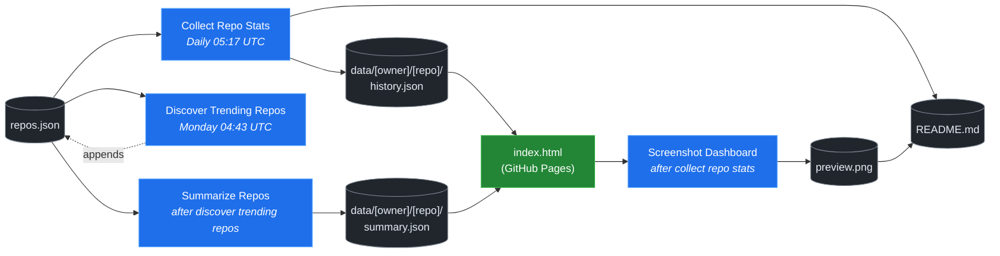

# 🚀 Rising Repos Tracker

> Automatically tracks daily GitHub stats (stars, forks, issues, velocity) for rising open source repos.

[](https://www.telosignal.com/)


**[→ View Live Dashboard](https://patrick-creates.github.io/rising-repos-tracker/)**

Built and maintained by [Telosignal](https://www.telosignal.com/).


<!-- AUTOGEN-STATS-START -->
## 📊 Current snapshot

> Auto-updated daily — last refreshed 2026-07-09

| Metric | Value |
|---|---|
| Repos tracked | **151** |
| Total stars | **7,430,117** |
| Total forks | **1,136,686** |
| Fastest growing | **ponytail** (+1790.6/day) |

### 🔥 Top 5 by velocity

| # | Repo | Stars | Stars/day |
|---|---|---:|---:|
| 1 | [DietrichGebert/ponytail](https://github.com/DietrichGebert/ponytail) | 78,459 | +1790.6 |
| 2 | [iOfficeAI/OfficeCLI](https://github.com/iOfficeAI/OfficeCLI) | 12,640 | +1414.3 |
| 3 | [chopratejas/headroom](https://github.com/chopratejas/headroom) | 58,006 | +1243.5 |
| 4 | [NousResearch/hermes-agent](https://github.com/NousResearch/hermes-agent) | 211,824 | +1118.9 |
| 5 | [Panniantong/Agent-Reach](https://github.com/Panniantong/Agent-Reach) | 53,514 | +968.9 |

### 🆕 Recently added

- [stablyai/orca](https://github.com/stablyai/orca) — added 2026-07-06 — Orca is the ADE for working with a fleet of parallel agents. Run any coding agent with your own subscription. Available on desktop and mobile.
- [ogulcancelik/herdr](https://github.com/ogulcancelik/herdr) — added 2026-07-06 — agent multiplexer that lives in your terminal.
- [diegosouzapw/OmniRoute](https://github.com/diegosouzapw/OmniRoute) — added 2026-07-06 — Never stop coding. Free AI gateway: one endpoint, 231+ providers (50+ free), connect Claude Code, Codex, Cursor, Cline & Copilot to FREE Claude/GPT/Gemini. RTK+Caveman stacked compression saves 15-95% tokens, smart auto-fallback, MCP/A2A, multimodal APIs, Desktop/PWA.
<!-- AUTOGEN-STATS-END -->

<!-- AUTOGEN-DIAGRAM-START -->
## 🔄 How it works


<!-- AUTOGEN-DIAGRAM-END -->

<!-- AUTOGEN-WORKFLOWS-START -->
## ⚙️ Workflows

| File | Schedule | Name |
|---|---|---|
| `collect.yml` | Daily 05:17 UTC | Collect Repo Stats |
| `discover.yml` | Monday 04:43 UTC | Discover Trending Repos |
| `screenshot.yml` | After Collect Repo Stats | Screenshot Dashboard |
| `summarize.yml` | After Discover Trending Repos | Summarize Repos |

> All workflows commit results directly back to the repo. Schedules are best-effort — GitHub Actions cron can drift by a few minutes.
<!-- AUTOGEN-WORKFLOWS-END -->

<!-- AUTOGEN-REPOS-START -->
## 📋 All tracked repos

| Repo | Stars | Forks | Stars/day |
|---|---:|---:|---:|
| [openclaw/openclaw](https://github.com/openclaw/openclaw) | 382,271 | 80,208 | +189.5 |
| [obra/superpowers](https://github.com/obra/superpowers) | 250,290 | 22,206 | +865.5 |
| [affaan-m/everything-claude-code](https://github.com/affaan-m/everything-claude-code) | 227,566 | 34,770 | +816.1 |
| [affaan-m/ECC](https://github.com/affaan-m/ECC) | 227,566 | 34,770 | +785.3 |
| [NousResearch/hermes-agent](https://github.com/NousResearch/hermes-agent) | 211,824 | 38,982 | +1118.9 |
| [Significant-Gravitas/AutoGPT](https://github.com/Significant-Gravitas/AutoGPT) | 185,435 | 46,116 | +20.2 |
| [f/prompts.chat](https://github.com/f/prompts.chat) | 165,120 | 21,367 | +51.7 |
| [microsoft/markitdown](https://github.com/microsoft/markitdown) | 164,206 | 11,684 | +722.8 |
| [langgenius/dify](https://github.com/langgenius/dify) | 148,268 | 23,361 | +123.6 |
| [open-webui/open-webui](https://github.com/open-webui/open-webui) | 144,802 | 20,948 | +138.8 |
| [langchain-ai/langchain](https://github.com/langchain-ai/langchain) | 141,366 | 23,492 | +83.0 |
| [github/spec-kit](https://github.com/github/spec-kit) | 118,942 | 10,538 | +369.8 |
| [farion1231/cc-switch](https://github.com/farion1231/cc-switch) | 115,068 | 7,684 | +788.9 |
| [microsoft/generative-ai-for-beginners](https://github.com/microsoft/generative-ai-for-beginners) | 112,792 | 60,586 | +35.8 |
| [nextlevelbuilder/ui-ux-pro-max-skill](https://github.com/nextlevelbuilder/ui-ux-pro-max-skill) | 103,115 | 10,883 | +442.5 |
| [ChatGPTNextWeb/NextChat](https://github.com/ChatGPTNextWeb/NextChat) | 88,419 | 59,474 | +7.3 |
| [JuliusBrussee/caveman](https://github.com/JuliusBrussee/caveman) | 86,993 | 4,866 | +490.0 |
| [thedotmack/claude-mem](https://github.com/thedotmack/claude-mem) | 86,507 | 7,483 | +195.2 |
| [vllm-project/vllm](https://github.com/vllm-project/vllm) | 85,774 | 19,164 | +103.3 |
| [OpenHands/OpenHands](https://github.com/OpenHands/OpenHands) | 80,123 | 10,221 | +119.1 |
| [lobehub/lobehub](https://github.com/lobehub/lobehub) | 79,659 | 15,574 | +46.7 |
| [ruvnet/RuView](https://github.com/ruvnet/RuView) | 79,422 | 10,678 | +300.6 |
| [DietrichGebert/ponytail](https://github.com/DietrichGebert/ponytail) | 78,459 | 4,195 | +1790.6 |
| [nexu-io/open-design](https://github.com/nexu-io/open-design) | 76,453 | 8,731 | +620.8 |
| [dair-ai/Prompt-Engineering-Guide](https://github.com/dair-ai/Prompt-Engineering-Guide) | 76,318 | 8,354 | +31.1 |
| [openai/openai-cookbook](https://github.com/openai/openai-cookbook) | 74,603 | 12,627 | +19.1 |
| [shareAI-lab/learn-claude-code](https://github.com/shareAI-lab/learn-claude-code) | 70,423 | 11,475 | +179.7 |
| [rtk-ai/rtk](https://github.com/rtk-ai/rtk) | 69,703 | 4,329 | +387.0 |
| [unslothai/unsloth](https://github.com/unslothai/unsloth) | 67,951 | 6,116 | +66.4 |
| [ComposioHQ/awesome-claude-skills](https://github.com/ComposioHQ/awesome-claude-skills) | 67,239 | 7,541 | +131.8 |
| [xtekky/gpt4free](https://github.com/xtekky/gpt4free) | 66,464 | 13,554 | +4.3 |
| [code-yeongyu/oh-my-openagent](https://github.com/code-yeongyu/oh-my-openagent) | 65,353 | 5,329 | +135.1 |
| [datawhalechina/hello-agents](https://github.com/datawhalechina/hello-agents) | 65,040 | 8,065 | +276.5 |
| [shanraisshan/claude-code-best-practice](https://github.com/shanraisshan/claude-code-best-practice) | 62,318 | 6,232 | +169.6 |
| [koala73/worldmonitor](https://github.com/koala73/worldmonitor) | 61,612 | 9,592 | +139.3 |
| [Leonxlnx/taste-skill](https://github.com/Leonxlnx/taste-skill) | 60,936 | 4,130 | +803.2 |
| [tw93/Pake](https://github.com/tw93/Pake) | 59,644 | 12,016 | +208.9 |
| [Fission-AI/OpenSpec](https://github.com/Fission-AI/OpenSpec) | 59,500 | 4,143 | +206.0 |
| [santifer/career-ops](https://github.com/santifer/career-ops) | 59,248 | 11,646 | +269.3 |
| [chopratejas/headroom](https://github.com/chopratejas/headroom) | 58,006 | 4,283 | +1243.5 |
| [headroomlabs-ai/headroom](https://github.com/headroomlabs-ai/headroom) | 58,006 | 4,283 | +711.9 |
| [MemPalace/mempalace](https://github.com/MemPalace/mempalace) | 57,152 | 7,380 | +91.4 |
| [ZhuLinsen/daily_stock_analysis](https://github.com/ZhuLinsen/daily_stock_analysis) | 56,044 | 48,290 | +382.3 |
| [asgeirtj/system_prompts_leaks](https://github.com/asgeirtj/system_prompts_leaks) | 54,563 | 8,883 | +272.7 |
| [FlowiseAI/Flowise](https://github.com/FlowiseAI/Flowise) | 54,453 | 24,685 | +29.9 |
| [Panniantong/Agent-Reach](https://github.com/Panniantong/Agent-Reach) | 53,514 | 4,286 | +968.9 |
| [BerriAI/litellm](https://github.com/BerriAI/litellm) | 53,060 | 9,603 | +109.1 |
| [ggml-org/whisper.cpp](https://github.com/ggml-org/whisper.cpp) | 51,521 | 5,755 | +32.6 |
| [mvanhorn/last30days-skill](https://github.com/mvanhorn/last30days-skill) | 51,026 | 4,256 | +592.1 |
| [hesreallyhim/awesome-claude-code](https://github.com/hesreallyhim/awesome-claude-code) | 49,583 | 4,310 | +105.5 |
| [Aider-AI/aider](https://github.com/Aider-AI/aider) | 47,200 | 4,708 | +43.1 |
| [ChromeDevTools/chrome-devtools-mcp](https://github.com/ChromeDevTools/chrome-devtools-mcp) | 46,437 | 3,027 | +126.0 |
| [zhayujie/CowAgent](https://github.com/zhayujie/CowAgent) | 45,892 | 10,259 | +25.7 |
| [HKUDS/nanobot](https://github.com/HKUDS/nanobot) | 45,167 | 7,974 | +47.8 |
| [elder-plinius/CL4R1T4S](https://github.com/elder-plinius/CL4R1T4S) | 45,086 | 9,169 | +258.1 |
| [sickn33/antigravity-awesome-skills](https://github.com/sickn33/antigravity-awesome-skills) | 42,673 | 6,781 | +88.8 |
| [QuantumNous/new-api](https://github.com/QuantumNous/new-api) | 41,623 | 9,637 | +139.2 |
| [chatboxai/chatbox](https://github.com/chatboxai/chatbox) | 40,925 | 4,144 | +17.9 |
| [danny-avila/LibreChat](https://github.com/danny-avila/LibreChat) | 40,476 | 8,301 | +66.8 |
| [kepano/obsidian-skills](https://github.com/kepano/obsidian-skills) | 40,433 | 2,870 | +172.3 |
| [Hmbown/CodeWhale](https://github.com/Hmbown/CodeWhale) | 39,619 | 3,414 | +110.0 |
| [router-for-me/CLIProxyAPI](https://github.com/router-for-me/CLIProxyAPI) | 39,590 | 6,524 | +107.7 |
| [jamiepine/voicebox](https://github.com/jamiepine/voicebox) | 39,492 | 4,762 | +275.5 |
| [usestrix/strix](https://github.com/usestrix/strix) | 39,279 | 3,996 | +357.1 |
| [chatanywhere/GPT_API_free](https://github.com/chatanywhere/GPT_API_free) | 38,726 | 2,666 | +12.7 |
| [rohitg00/ai-engineering-from-scratch](https://github.com/rohitg00/ai-engineering-from-scratch) | 37,702 | 6,284 | +298.4 |
| [wshobson/agents](https://github.com/wshobson/agents) | 37,682 | 4,040 | +38.8 |
| [Yeachan-Heo/oh-my-claudecode](https://github.com/Yeachan-Heo/oh-my-claudecode) | 37,589 | 3,387 | +61.4 |
| [coreyhaines31/marketingskills](https://github.com/coreyhaines31/marketingskills) | 37,361 | 6,005 | +155.9 |
| [google/langextract](https://github.com/google/langextract) | 37,115 | 2,563 | +12.4 |
| [langchain-ai/langgraph](https://github.com/langchain-ai/langgraph) | 36,868 | 6,191 | +85.2 |
| [github/awesome-copilot](https://github.com/github/awesome-copilot) | 36,359 | 4,528 | +56.7 |
| [AstrBotDevs/AstrBot](https://github.com/AstrBotDevs/AstrBot) | 36,048 | 2,501 | +64.7 |
| [calesthio/OpenMontage](https://github.com/calesthio/OpenMontage) | 35,889 | 4,167 | +803.8 |
| [songquanpeng/one-api](https://github.com/songquanpeng/one-api) | 35,598 | 6,727 | +30.8 |
| [PDFMathTranslate/PDFMathTranslate](https://github.com/PDFMathTranslate/PDFMathTranslate) | 35,493 | 3,171 | +32.9 |
| [heygen-com/hyperframes](https://github.com/heygen-com/hyperframes) | 33,891 | 3,163 | +268.7 |
| [zeroclaw-labs/zeroclaw](https://github.com/zeroclaw-labs/zeroclaw) | 32,209 | 4,801 | +14.0 |
| [anthropics/claude-plugins-official](https://github.com/anthropics/claude-plugins-official) | 31,841 | 3,511 | +74.5 |
| [Gitlawb/openclaude](https://github.com/Gitlawb/openclaude) | 29,899 | 8,862 | +46.4 |
| [iOfficeAI/AionUi](https://github.com/iOfficeAI/AionUi) | 29,651 | 2,956 | +60.6 |
| [googleworkspace/cli](https://github.com/googleworkspace/cli) | 29,536 | 1,704 | +74.2 |
| [AlexsJones/llmfit](https://github.com/AlexsJones/llmfit) | 29,231 | 1,786 | +58.7 |
| [DeusData/codebase-memory-mcp](https://github.com/DeusData/codebase-memory-mcp) | 28,838 | 2,140 | +820.8 |
| [voideditor/void](https://github.com/voideditor/void) | 28,818 | 2,578 | +0.3 |
| [BloopAI/vibe-kanban](https://github.com/BloopAI/vibe-kanban) | 27,315 | 2,897 | +15.9 |
| [JCodesMore/ai-website-cloner-template](https://github.com/JCodesMore/ai-website-cloner-template) | 27,019 | 3,818 | +417.8 |
| [esengine/DeepSeek-Reasonix](https://github.com/esengine/DeepSeek-Reasonix) | 26,488 | 1,655 | +224.6 |
| [volcengine/OpenViking](https://github.com/volcengine/OpenViking) | 26,456 | 2,061 | +36.4 |
| [jackwener/OpenCLI](https://github.com/jackwener/OpenCLI) | 26,347 | 2,602 | +82.2 |
| [jarrodwatts/claude-hud](https://github.com/jarrodwatts/claude-hud) | 26,278 | 1,207 | +51.2 |
| [langchain-ai/deepagents](https://github.com/langchain-ai/deepagents) | 25,970 | 3,636 | +58.5 |
| [p-e-w/heretic](https://github.com/p-e-w/heretic) | 25,940 | 2,808 | +63.5 |
| [zai-org/Open-AutoGLM](https://github.com/zai-org/Open-AutoGLM) | 25,719 | 4,002 | +8.3 |
| [alibaba/page-agent](https://github.com/alibaba/page-agent) | 25,327 | 2,181 | +282.0 |
| [mukul975/Anthropic-Cybersecurity-Skills](https://github.com/mukul975/Anthropic-Cybersecurity-Skills) | 25,016 | 2,880 | +405.5 |
| [rohitg00/agentmemory](https://github.com/rohitg00/agentmemory) | 24,868 | 2,050 | +98.2 |
| [toon-format/toon](https://github.com/toon-format/toon) | 24,808 | 1,101 | +10.1 |
| [winfunc/opcode](https://github.com/winfunc/opcode) | 22,161 | 1,708 | +5.0 |
| [agentscope-ai/QwenPaw](https://github.com/agentscope-ai/QwenPaw) | 21,594 | 2,755 | +159.0 |
| [decolua/9router](https://github.com/decolua/9router) | 21,228 | 3,437 | +152.4 |
| [coze-dev/coze-studio](https://github.com/coze-dev/coze-studio) | 21,134 | 3,074 | +6.0 |
| [NirDiamant/agents-towards-production](https://github.com/NirDiamant/agents-towards-production) | 20,946 | 2,783 | +10.1 |
| [tirth8205/code-review-graph](https://github.com/tirth8205/code-review-graph) | 19,331 | 2,070 | +34.0 |
| [HKUDS/Vibe-Trading](https://github.com/HKUDS/Vibe-Trading) | 18,788 | 3,129 | +405.0 |
| [mksglu/context-mode](https://github.com/mksglu/context-mode) | 18,724 | 1,310 | +52.3 |
| [tanweai/pua](https://github.com/tanweai/pua) | 18,713 | 1,126 | +19.5 |
| [pranshuparmar/witr](https://github.com/pranshuparmar/witr) | 18,185 | 566 | +15.3 |
| [Tencent/WeKnora](https://github.com/Tencent/WeKnora) | 18,002 | 2,457 | +71.3 |
| [RightNow-AI/openfang](https://github.com/RightNow-AI/openfang) | 17,988 | 2,274 | +6.8 |
| [datawhalechina/easy-vibe](https://github.com/datawhalechina/easy-vibe) | 17,971 | 1,711 | +42.9 |
| [jundot/omlx](https://github.com/jundot/omlx) | 17,671 | 1,486 | +43.3 |
| [microsoft/agent-lightning](https://github.com/microsoft/agent-lightning) | 17,375 | 1,520 | +2.7 |
| [steipete/CodexBar](https://github.com/steipete/CodexBar) | 17,295 | 1,410 | +123.1 |
| [jnMetaCode/agency-agents-zh](https://github.com/jnMetaCode/agency-agents-zh) | 16,930 | 2,885 | +89.6 |
| [can1357/oh-my-pi](https://github.com/can1357/oh-my-pi) | 16,885 | 1,503 | +169.9 |
| [danielmiessler/LifeOS](https://github.com/danielmiessler/LifeOS) | 16,520 | 2,256 | +26.7 |
| [cft0808/edict](https://github.com/cft0808/edict) | 16,178 | 1,702 | +4.8 |
| [browser-use/browser-harness](https://github.com/browser-use/browser-harness) | 15,837 | 1,473 | +35.8 |
| [nesquena/hermes-webui](https://github.com/nesquena/hermes-webui) | 15,692 | 2,064 | +50.2 |
| [MemoriLabs/Memori](https://github.com/MemoriLabs/Memori) | 15,552 | 2,788 | +12.3 |
| [kyegomez/OpenMythos](https://github.com/kyegomez/OpenMythos) | 14,658 | 3,296 | +29.6 |
| [xpzouying/xiaohongshu-mcp](https://github.com/xpzouying/xiaohongshu-mcp) | 14,601 | 2,166 | +18.5 |
| [ogulcancelik/herdr](https://github.com/ogulcancelik/herdr) | 14,549 | 831 | +717.3 |
| [stablyai/orca](https://github.com/stablyai/orca) | 14,520 | 979 | +645.7 |
| [yusufkaraaslan/Skill_Seekers](https://github.com/yusufkaraaslan/Skill_Seekers) | 14,401 | 1,469 | +10.3 |
| [NevaMind-AI/memU](https://github.com/NevaMind-AI/memU) | 14,005 | 1,039 | +6.2 |
| [diegosouzapw/OmniRoute](https://github.com/diegosouzapw/OmniRoute) | 13,978 | 2,030 | +608.7 |
| [wanshuiyin/Auto-claude-code-research-in-sleep](https://github.com/wanshuiyin/Auto-claude-code-research-in-sleep) | 13,179 | 1,188 | +40.5 |
| [iOfficeAI/OfficeCLI](https://github.com/iOfficeAI/OfficeCLI) | 12,640 | 852 | +1414.3 |
| [superset-sh/superset](https://github.com/superset-sh/superset) | 12,345 | 1,070 | +18.5 |
| [xbtlin/ai-berkshire](https://github.com/xbtlin/ai-berkshire) | 12,189 | 1,601 | +470.7 |
| [XiaomiMiMo/MiMo-Code](https://github.com/XiaomiMiMo/MiMo-Code) | 11,675 | 1,147 | +65.1 |
| [sirmalloc/ccstatusline](https://github.com/sirmalloc/ccstatusline) | 11,590 | 503 | +31.0 |
| [ValueCell-ai/valuecell](https://github.com/ValueCell-ai/valuecell) | 10,923 | 1,809 | +5.1 |
| [aden-hive/hive](https://github.com/aden-hive/hive) | 10,649 | 5,646 | +3.7 |
| [EverMind-AI/EverOS](https://github.com/EverMind-AI/EverOS) | 10,643 | 849 | +92.8 |
| [alibaba/open-code-review](https://github.com/alibaba/open-code-review) | 10,232 | 678 | +81.7 |
| [0x4m4/hexstrike-ai](https://github.com/0x4m4/hexstrike-ai) | 10,230 | 2,152 | +22.0 |
| [MemTensor/MemOS](https://github.com/MemTensor/MemOS) | 10,145 | 924 | +11.8 |
| [walkinglabs/learn-harness-engineering](https://github.com/walkinglabs/learn-harness-engineering) | 10,106 | 1,088 | +73.7 |
| [Kuberwastaken/claurst](https://github.com/Kuberwastaken/claurst) | 9,982 | 7,788 | +11.6 |
| [frankbria/ralph-claude-code](https://github.com/frankbria/ralph-claude-code) | 9,518 | 726 | +7.1 |
| [brokermr810/QuantDinger](https://github.com/brokermr810/QuantDinger) | 9,390 | 1,976 | +35.7 |
| [ConardLi/garden-skills](https://github.com/ConardLi/garden-skills) | 9,298 | 1,243 | +39.0 |
| [ykdojo/claude-code-tips](https://github.com/ykdojo/claude-code-tips) | 9,123 | 710 | +35.3 |
| [EKKOLearnAI/hermes-studio](https://github.com/EKKOLearnAI/hermes-studio) | 8,978 | 1,106 | +39.3 |
| [EvoMap/evolver](https://github.com/EvoMap/evolver) | 8,876 | 819 | +7.0 |
| [iflytek/astron-agent](https://github.com/iflytek/astron-agent) | 8,609 | 859 | — |
| [getagentseal/codeburn](https://github.com/getagentseal/codeburn) | 8,546 | 673 | +25.0 |
| [MiroMindAI/MiroThinker](https://github.com/MiroMindAI/MiroThinker) | 8,332 | 643 | +2.0 |
<!-- AUTOGEN-REPOS-END -->

---

## What it does

- Collects daily snapshots of stars, forks, watchers and open issues for every tracked repo
- Discovers new trending repos automatically every Monday using the GitHub Search API
- Generates AI summaries (use cases, similar tools, tags) for each tracked repo via GitHub Models
- Stores all history as plain JSON — no database, no backend
- Renders a live dashboard via GitHub Pages — updates daily, zero maintenance

## Tracked repos

Data lives in [`data/`](./data) — one folder per repo, one `history.json` per entry.  
The full watch list is in [`repos.json`](./repos.json).

## Fork & use it for yourself

This is my personal tracker — the watch list reflects what I find interesting. If you want to track different repos, the best path is to **fork this repo and run your own**.

### Setup

1. Fork this repo to your account
2. Replace the contents of [`repos.json`](./repos.json) with the repos you want to track (or just leave one entry — `discover.yml` will auto-add more every Monday)
3. Go to **Settings → Pages** and enable GitHub Pages from the `main` branch
4. Go to **Actions** and run **Collect Repo Stats** once manually to seed your first data point
5. Your dashboard will be live at `https://YOUR-USERNAME.github.io/rising-repos-tracker/`

That's it — daily collection and weekly discovery run automatically on schedule. Zero ongoing maintenance.

### Customizing what gets discovered

Edit [`scripts/discover.js`](./scripts/discover.js) to change:

- `MIN_STARS` — minimum star threshold for candidates
- `MAX_AGE_DAYS` — how recent a repo must be
- `MAX_NEW_REPOS` — how many to add per discovery run
- The `queries` array — GitHub Search API queries that define what "trending" means to you

### Adding a repo manually

Just edit `repos.json` directly:

```json
{
  "owner": "OWNER",
  "repo": "REPO",
  "added": "YYYY-MM-DD",
  "notes": "why you're tracking this"
}
```

The next daily collect run picks it up automatically.

## Stack

- **GitHub Actions** — scheduling and automation
- **GitHub Pages** — dashboard hosting
- **GitHub API** — data source
- **GitHub Models** — free AI summaries (gpt-4o-mini)
- **Chart.js** — star growth visualization
- **Mermaid** — architecture diagram (rendered by GitHub)
- No dependencies, no build step, no database

## License

MIT
