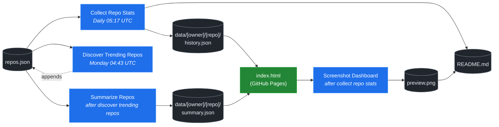

# 🚀 Rising Repos Tracker

> Automatically tracks daily GitHub stats (stars, forks, issues, velocity) for rising open source repos.

[](https://www.telosignal.com/)


**[→ View Live Dashboard](https://patrick-creates.github.io/rising-repos-tracker/)**

Built and maintained by [Telosignal](https://www.telosignal.com/).


<!-- AUTOGEN-STATS-START -->
## 📊 Current snapshot

> Auto-updated daily — last refreshed 2026-07-17

| Metric | Value |
|---|---|
| Repos tracked | **166** |
| Total stars | **7,789,303** |
| Total forks | **1,184,892** |
| Fastest growing | **ponytail** (+1473.6/day) |

### 🔥 Top 5 by velocity

| # | Repo | Stars | Stars/day |
|---|---|---:|---:|
| 1 | [DietrichGebert/ponytail](https://github.com/DietrichGebert/ponytail) | 84,858 | +1473.6 |
| 2 | [NousResearch/hermes-agent](https://github.com/NousResearch/hermes-agent) | 216,137 | +1047.6 |
| 3 | [chopratejas/headroom](https://github.com/chopratejas/headroom) | 59,571 | +981.5 |
| 4 | [iOfficeAI/OfficeCLI](https://github.com/iOfficeAI/OfficeCLI) | 18,577 | +925.5 |
| 5 | [Panniantong/Agent-Reach](https://github.com/Panniantong/Agent-Reach) | 57,307 | +867.4 |

### 🆕 Recently added

- [sickn33/agentic-awesome-skills](https://github.com/sickn33/agentic-awesome-skills) — added 2026-07-13 — Installable GitHub library of 1,900+ agentic skills for Claude Code, Cursor, Codex CLI, Autohand Code, Gemini CLI, Antigravity, and more. Includes specialized plugins, installer CLI, bundles, workflows, and official/community skill collections.
- [mindsdb/mindshub](https://github.com/mindsdb/mindshub) — added 2026-07-13 — Make AI do actual work. Swap the model anytime — keep everything you've built.
- [re4/LibreCode](https://github.com/re4/LibreCode) — added 2026-07-13 — LibreCode - A Ollama cursor like coding / Reversing Interface
<!-- AUTOGEN-STATS-END -->

<!-- AUTOGEN-DIAGRAM-START -->
## 🔄 How it works


<!-- AUTOGEN-DIAGRAM-END -->

<!-- AUTOGEN-WORKFLOWS-START -->
## ⚙️ Workflows

| File | Schedule | Name |
|---|---|---|
| `collect.yml` | Daily 05:17 UTC | Collect Repo Stats |
| `discover.yml` | Monday 04:43 UTC | Discover Trending Repos |
| `screenshot.yml` | After Collect Repo Stats | Screenshot Dashboard |
| `summarize.yml` | After Discover Trending Repos | Summarize Repos |

> All workflows commit results directly back to the repo. Schedules are best-effort — GitHub Actions cron can drift by a few minutes.
<!-- AUTOGEN-WORKFLOWS-END -->

<!-- AUTOGEN-REPOS-START -->
## 📋 All tracked repos

| Repo | Stars | Forks | Stars/day |
|---|---:|---:|---:|
| [openclaw/openclaw](https://github.com/openclaw/openclaw) | 383,205 | 80,491 | +180.5 |
| [obra/superpowers](https://github.com/obra/superpowers) | 256,198 | 22,810 | +824.8 |
| [affaan-m/everything-claude-code](https://github.com/affaan-m/everything-claude-code) | 230,453 | 35,167 | +760.1 |
| [affaan-m/ECC](https://github.com/affaan-m/ECC) | 230,453 | 35,167 | +721.2 |
| [NousResearch/hermes-agent](https://github.com/NousResearch/hermes-agent) | 216,137 | 40,409 | +1047.6 |
| [Significant-Gravitas/AutoGPT](https://github.com/Significant-Gravitas/AutoGPT) | 185,585 | 46,079 | +20.1 |
| [microsoft/markitdown](https://github.com/microsoft/markitdown) | 166,744 | 11,964 | +672.9 |
| [f/prompts.chat](https://github.com/f/prompts.chat) | 165,873 | 21,455 | +56.9 |
| [langgenius/dify](https://github.com/langgenius/dify) | 149,114 | 23,490 | +121.4 |
| [open-webui/open-webui](https://github.com/open-webui/open-webui) | 145,711 | 21,110 | +135.7 |
| [langchain-ai/langchain](https://github.com/langchain-ai/langchain) | 141,957 | 23,595 | +81.9 |
| [github/spec-kit](https://github.com/github/spec-kit) | 121,868 | 10,849 | +369.3 |
| [farion1231/cc-switch](https://github.com/farion1231/cc-switch) | 118,124 | 7,913 | +734.7 |
| [microsoft/generative-ai-for-beginners](https://github.com/microsoft/generative-ai-for-beginners) | 113,128 | 60,744 | +36.6 |
| [nextlevelbuilder/ui-ux-pro-max-skill](https://github.com/nextlevelbuilder/ui-ux-pro-max-skill) | 106,741 | 11,323 | +443.8 |
| [JuliusBrussee/caveman](https://github.com/JuliusBrussee/caveman) | 90,151 | 5,098 | +477.3 |
| [ChatGPTNextWeb/NextChat](https://github.com/ChatGPTNextWeb/NextChat) | 88,489 | 59,413 | +7.5 |
| [thedotmack/claude-mem](https://github.com/thedotmack/claude-mem) | 87,550 | 7,588 | +187.2 |
| [vllm-project/vllm](https://github.com/vllm-project/vllm) | 86,478 | 19,518 | +101.4 |
| [DietrichGebert/ponytail](https://github.com/DietrichGebert/ponytail) | 84,858 | 4,616 | +1473.6 |
| [OpenHands/OpenHands](https://github.com/OpenHands/OpenHands) | 81,051 | 10,361 | +118.7 |
| [ruvnet/RuView](https://github.com/ruvnet/RuView) | 80,939 | 10,900 | +283.9 |
| [lobehub/lobehub](https://github.com/lobehub/lobehub) | 80,326 | 15,620 | +51.2 |
| [nexu-io/open-design](https://github.com/nexu-io/open-design) | 79,074 | 9,102 | +581.7 |
| [dair-ai/Prompt-Engineering-Guide](https://github.com/dair-ai/Prompt-Engineering-Guide) | 76,635 | 8,412 | +32.2 |
| [openai/openai-cookbook](https://github.com/openai/openai-cookbook) | 74,724 | 12,647 | +18.6 |
| [rtk-ai/rtk](https://github.com/rtk-ai/rtk) | 71,470 | 4,447 | +364.9 |
| [shareAI-lab/learn-claude-code](https://github.com/shareAI-lab/learn-claude-code) | 71,284 | 11,594 | +170.1 |
| [unslothai/unsloth](https://github.com/unslothai/unsloth) | 68,314 | 6,146 | +63.6 |
| [ComposioHQ/awesome-claude-skills](https://github.com/ComposioHQ/awesome-claude-skills) | 67,918 | 7,686 | +125.5 |
| [datawhalechina/hello-agents](https://github.com/datawhalechina/hello-agents) | 66,801 | 8,290 | +269.0 |
| [xtekky/gpt4free](https://github.com/xtekky/gpt4free) | 66,465 | 13,532 | +3.7 |
| [code-yeongyu/oh-my-openagent](https://github.com/code-yeongyu/oh-my-openagent) | 65,978 | 5,382 | +127.5 |
| [Leonxlnx/taste-skill](https://github.com/Leonxlnx/taste-skill) | 64,378 | 4,420 | +738.4 |
| [shanraisshan/claude-code-best-practice](https://github.com/shanraisshan/claude-code-best-practice) | 62,927 | 6,302 | +157.2 |
| [koala73/worldmonitor](https://github.com/koala73/worldmonitor) | 61,943 | 9,644 | +126.3 |
| [Fission-AI/OpenSpec](https://github.com/Fission-AI/OpenSpec) | 61,287 | 4,247 | +208.3 |
| [santifer/career-ops](https://github.com/santifer/career-ops) | 60,317 | 11,874 | +251.2 |
| [tw93/Pake](https://github.com/tw93/Pake) | 59,984 | 12,126 | +186.8 |
| [chopratejas/headroom](https://github.com/chopratejas/headroom) | 59,571 | 4,424 | +981.5 |
| [headroomlabs-ai/headroom](https://github.com/headroomlabs-ai/headroom) | 59,571 | 4,424 | +546.7 |
| [asgeirtj/system_prompts_leaks](https://github.com/asgeirtj/system_prompts_leaks) | 58,460 | 9,562 | +301.3 |
| [ZhuLinsen/daily_stock_analysis](https://github.com/ZhuLinsen/daily_stock_analysis) | 57,580 | 49,533 | +353.6 |
| [MemPalace/mempalace](https://github.com/MemPalace/mempalace) | 57,408 | 7,398 | +83.5 |
| [Panniantong/Agent-Reach](https://github.com/Panniantong/Agent-Reach) | 57,307 | 4,590 | +867.4 |
| [FlowiseAI/Flowise](https://github.com/FlowiseAI/Flowise) | 54,684 | 24,722 | +29.7 |
| [BerriAI/litellm](https://github.com/BerriAI/litellm) | 53,830 | 9,839 | +107.4 |
| [mvanhorn/last30days-skill](https://github.com/mvanhorn/last30days-skill) | 52,438 | 4,504 | +506.8 |
| [ggml-org/whisper.cpp](https://github.com/ggml-org/whisper.cpp) | 51,803 | 5,822 | +33.0 |
| [hesreallyhim/awesome-claude-code](https://github.com/hesreallyhim/awesome-claude-code) | 50,208 | 4,371 | +101.9 |
| [Aider-AI/aider](https://github.com/Aider-AI/aider) | 47,448 | 4,741 | +41.5 |
| [ChromeDevTools/chrome-devtools-mcp](https://github.com/ChromeDevTools/chrome-devtools-mcp) | 47,066 | 3,134 | +119.7 |
| [zhayujie/CowAgent](https://github.com/zhayujie/CowAgent) | 46,020 | 10,267 | +24.4 |
| [HKUDS/nanobot](https://github.com/HKUDS/nanobot) | 45,781 | 8,083 | +51.7 |
| [elder-plinius/CL4R1T4S](https://github.com/elder-plinius/CL4R1T4S) | 45,667 | 9,306 | +211.8 |
| [sickn33/antigravity-awesome-skills](https://github.com/sickn33/antigravity-awesome-skills) | 43,441 | 6,474 | +89.9 |
| [sickn33/agentic-awesome-skills](https://github.com/sickn33/agentic-awesome-skills) | 43,441 | 6,474 | +99.8 |
| [router-for-me/CLIProxyAPI](https://github.com/router-for-me/CLIProxyAPI) | 42,766 | 6,780 | +151.4 |
| [QuantumNous/new-api](https://github.com/QuantumNous/new-api) | 42,509 | 9,893 | +134.9 |
| [kepano/obsidian-skills](https://github.com/kepano/obsidian-skills) | 42,302 | 3,013 | +183.0 |
| [usestrix/strix](https://github.com/usestrix/strix) | 42,106 | 4,347 | +356.4 |
| [jamiepine/voicebox](https://github.com/jamiepine/voicebox) | 41,948 | 5,066 | +281.0 |
| [chatboxai/chatbox](https://github.com/chatboxai/chatbox) | 41,037 | 4,146 | +17.4 |
| [danny-avila/LibreChat](https://github.com/danny-avila/LibreChat) | 40,840 | 8,380 | +63.6 |
| [coreyhaines31/marketingskills](https://github.com/coreyhaines31/marketingskills) | 40,247 | 6,359 | +191.5 |
| [Hmbown/CodeWhale](https://github.com/Hmbown/CodeWhale) | 39,873 | 3,432 | +98.2 |
| [mindsdb/mindshub](https://github.com/mindsdb/mindshub) | 39,444 | 6,225 | +10.8 |
| [calesthio/OpenMontage](https://github.com/calesthio/OpenMontage) | 39,340 | 4,657 | +638.3 |
| [chatanywhere/GPT_API_free](https://github.com/chatanywhere/GPT_API_free) | 38,808 | 2,667 | +12.3 |
| [rohitg00/ai-engineering-from-scratch](https://github.com/rohitg00/ai-engineering-from-scratch) | 38,637 | 6,477 | +266.8 |
| [wshobson/agents](https://github.com/wshobson/agents) | 37,976 | 4,081 | +38.5 |
| [Yeachan-Heo/oh-my-claudecode](https://github.com/Yeachan-Heo/oh-my-claudecode) | 37,830 | 3,413 | +56.7 |
| [langchain-ai/langgraph](https://github.com/langchain-ai/langgraph) | 37,486 | 6,281 | +82.6 |
| [google/langextract](https://github.com/google/langextract) | 37,159 | 2,563 | +11.4 |
| [github/awesome-copilot](https://github.com/github/awesome-copilot) | 36,686 | 4,594 | +54.3 |
| [AstrBotDevs/AstrBot](https://github.com/AstrBotDevs/AstrBot) | 36,458 | 2,530 | +62.4 |
| [heygen-com/hyperframes](https://github.com/heygen-com/hyperframes) | 35,777 | 3,354 | +261.9 |
| [songquanpeng/one-api](https://github.com/songquanpeng/one-api) | 35,772 | 6,746 | +29.5 |
| [PDFMathTranslate/PDFMathTranslate](https://github.com/PDFMathTranslate/PDFMathTranslate) | 35,620 | 3,177 | +30.3 |
| [zeroclaw-labs/zeroclaw](https://github.com/zeroclaw-labs/zeroclaw) | 32,284 | 4,807 | +13.2 |
| [anthropics/claude-plugins-official](https://github.com/anthropics/claude-plugins-official) | 32,231 | 3,592 | +70.0 |
| [DeusData/codebase-memory-mcp](https://github.com/DeusData/codebase-memory-mcp) | 32,223 | 2,465 | +644.1 |
| [iOfficeAI/AionUi](https://github.com/iOfficeAI/AionUi) | 30,279 | 3,033 | +63.7 |
| [Gitlawb/openclaude](https://github.com/Gitlawb/openclaude) | 30,076 | 8,864 | +42.2 |
| [googleworkspace/cli](https://github.com/googleworkspace/cli) | 29,766 | 1,730 | +66.3 |
| [AlexsJones/llmfit](https://github.com/AlexsJones/llmfit) | 29,530 | 1,797 | +55.0 |
| [voideditor/void](https://github.com/voideditor/void) | 28,838 | 2,591 | +0.7 |
| [JCodesMore/ai-website-cloner-template](https://github.com/JCodesMore/ai-website-cloner-template) | 28,511 | 4,098 | +359.9 |
| [BloopAI/vibe-kanban](https://github.com/BloopAI/vibe-kanban) | 27,406 | 2,910 | +15.1 |
| [esengine/DeepSeek-Reasonix](https://github.com/esengine/DeepSeek-Reasonix) | 27,110 | 1,725 | +194.5 |
| [volcengine/OpenViking](https://github.com/volcengine/OpenViking) | 26,871 | 2,106 | +39.6 |
| [alibaba/page-agent](https://github.com/alibaba/page-agent) | 26,848 | 2,350 | +259.1 |
| [jackwener/OpenCLI](https://github.com/jackwener/OpenCLI) | 26,799 | 2,633 | +76.9 |
| [jarrodwatts/claude-hud](https://github.com/jarrodwatts/claude-hud) | 26,491 | 1,221 | +46.2 |
| [p-e-w/heretic](https://github.com/p-e-w/heretic) | 26,388 | 2,884 | +61.9 |
| [langchain-ai/deepagents](https://github.com/langchain-ai/deepagents) | 26,339 | 3,694 | +56.0 |
| [zai-org/Open-AutoGLM](https://github.com/zai-org/Open-AutoGLM) | 25,805 | 4,010 | +8.8 |
| [mukul975/Anthropic-Cybersecurity-Skills](https://github.com/mukul975/Anthropic-Cybersecurity-Skills) | 25,665 | 3,037 | +301.7 |
| [rohitg00/agentmemory](https://github.com/rohitg00/agentmemory) | 25,253 | 2,091 | +87.9 |
| [toon-format/toon](https://github.com/toon-format/toon) | 24,884 | 1,105 | +9.9 |
| [manaflow-ai/cmux](https://github.com/manaflow-ai/cmux) | 24,636 | 2,008 | +70.0 |
| [HKUDS/Vibe-Trading](https://github.com/HKUDS/Vibe-Trading) | 24,427 | 4,045 | +538.3 |
| [MadsLorentzen/ai-job-search](https://github.com/MadsLorentzen/ai-job-search) | 23,281 | 7,397 | +424.5 |
| [agentscope-ai/QwenPaw](https://github.com/agentscope-ai/QwenPaw) | 22,996 | 2,815 | +163.1 |
| [decolua/9router](https://github.com/decolua/9router) | 22,396 | 3,702 | +150.8 |
| [winfunc/opcode](https://github.com/winfunc/opcode) | 22,178 | 1,707 | +4.4 |
| [coze-dev/coze-studio](https://github.com/coze-dev/coze-studio) | 21,182 | 3,082 | +6.0 |
| [NirDiamant/agents-towards-production](https://github.com/NirDiamant/agents-towards-production) | 21,068 | 2,808 | +11.1 |
| [stablyai/orca](https://github.com/stablyai/orca) | 20,776 | 1,502 | +744.8 |
| [tirth8205/code-review-graph](https://github.com/tirth8205/code-review-graph) | 19,579 | 2,096 | +33.3 |
| [mksglu/context-mode](https://github.com/mksglu/context-mode) | 19,023 | 1,337 | +48.6 |
| [tanweai/pua](https://github.com/tanweai/pua) | 18,830 | 1,134 | +18.3 |
| [iOfficeAI/OfficeCLI](https://github.com/iOfficeAI/OfficeCLI) | 18,577 | 1,236 | +925.5 |
| [steipete/CodexBar](https://github.com/steipete/CodexBar) | 18,493 | 1,528 | +131.6 |
| [Tencent/WeKnora](https://github.com/Tencent/WeKnora) | 18,443 | 2,548 | +67.2 |
| [datawhalechina/easy-vibe](https://github.com/datawhalechina/easy-vibe) | 18,265 | 1,736 | +41.4 |
| [pranshuparmar/witr](https://github.com/pranshuparmar/witr) | 18,252 | 570 | +12.2 |
| [diegosouzapw/OmniRoute](https://github.com/diegosouzapw/OmniRoute) | 18,159 | 2,606 | +546.1 |
| [can1357/oh-my-pi](https://github.com/can1357/oh-my-pi) | 18,141 | 1,665 | +165.8 |
| [RightNow-AI/openfang](https://github.com/RightNow-AI/openfang) | 18,022 | 2,280 | +6.1 |
| [jundot/omlx](https://github.com/jundot/omlx) | 17,891 | 1,518 | +39.3 |
| [jnMetaCode/agency-agents-zh](https://github.com/jnMetaCode/agency-agents-zh) | 17,459 | 2,951 | +82.1 |
| [microsoft/agent-lightning](https://github.com/microsoft/agent-lightning) | 17,395 | 1,526 | +2.6 |
| [ogulcancelik/herdr](https://github.com/ogulcancelik/herdr) | 17,335 | 1,086 | +448.9 |
| [danielmiessler/LifeOS](https://github.com/danielmiessler/LifeOS) | 16,754 | 2,275 | +27.5 |
| [cft0808/edict](https://github.com/cft0808/edict) | 16,225 | 1,705 | +5.1 |
| [nesquena/hermes-webui](https://github.com/nesquena/hermes-webui) | 16,168 | 2,159 | +53.2 |
| [browser-use/browser-harness](https://github.com/browser-use/browser-harness) | 16,026 | 1,502 | +30.4 |
| [MemoriLabs/Memori](https://github.com/MemoriLabs/Memori) | 15,590 | 2,838 | +9.9 |
| [xpzouying/xiaohongshu-mcp](https://github.com/xpzouying/xiaohongshu-mcp) | 14,707 | 2,176 | +16.8 |
| [kyegomez/OpenMythos](https://github.com/kyegomez/OpenMythos) | 14,703 | 3,302 | +21.9 |
| [yusufkaraaslan/Skill_Seekers](https://github.com/yusufkaraaslan/Skill_Seekers) | 14,483 | 1,475 | +10.3 |
| [NevaMind-AI/memU](https://github.com/NevaMind-AI/memU) | 14,033 | 1,042 | +5.3 |
| [wanshuiyin/Auto-claude-code-research-in-sleep](https://github.com/wanshuiyin/Auto-claude-code-research-in-sleep) | 13,505 | 1,219 | +40.6 |
| [xbtlin/ai-berkshire](https://github.com/xbtlin/ai-berkshire) | 13,244 | 1,847 | +224.3 |
| [superset-sh/superset](https://github.com/superset-sh/superset) | 12,464 | 1,087 | +16.9 |
| [XiaomiMiMo/MiMo-Code](https://github.com/XiaomiMiMo/MiMo-Code) | 12,166 | 1,220 | +63.4 |
| [sirmalloc/ccstatusline](https://github.com/sirmalloc/ccstatusline) | 11,806 | 515 | +29.2 |
| [EverMind-AI/EverOS](https://github.com/EverMind-AI/EverOS) | 11,159 | 858 | +80.2 |
| [ValueCell-ai/valuecell](https://github.com/ValueCell-ai/valuecell) | 10,936 | 1,814 | +3.6 |
| [aden-hive/hive](https://github.com/aden-hive/hive) | 10,710 | 5,659 | +5.4 |
| [alibaba/open-code-review](https://github.com/alibaba/open-code-review) | 10,635 | 717 | +58.9 |
| [walkinglabs/learn-harness-engineering](https://github.com/walkinglabs/learn-harness-engineering) | 10,463 | 1,131 | +52.5 |
| [0x4m4/hexstrike-ai](https://github.com/0x4m4/hexstrike-ai) | 10,353 | 2,165 | +19.1 |
| [MemTensor/MemOS](https://github.com/MemTensor/MemOS) | 10,246 | 935 | +12.2 |
| [Kuberwastaken/claurst](https://github.com/Kuberwastaken/claurst) | 10,097 | 7,785 | +12.8 |
| [brokermr810/QuantDinger](https://github.com/brokermr810/QuantDinger) | 9,700 | 2,036 | +37.9 |
| [ConardLi/garden-skills](https://github.com/ConardLi/garden-skills) | 9,584 | 1,273 | +36.6 |
| [frankbria/ralph-claude-code](https://github.com/frankbria/ralph-claude-code) | 9,544 | 727 | +6.6 |
| [ykdojo/claude-code-tips](https://github.com/ykdojo/claude-code-tips) | 9,317 | 734 | +27.3 |
| [EKKOLearnAI/hermes-studio](https://github.com/EKKOLearnAI/hermes-studio) | 9,216 | 1,145 | +32.4 |
| [TencentCloud/TencentDB-Agent-Memory](https://github.com/TencentCloud/TencentDB-Agent-Memory) | 9,028 | 831 | +77.5 |
| [EvoMap/evolver](https://github.com/EvoMap/evolver) | 8,899 | 817 | +4.0 |
| [getagentseal/codeburn](https://github.com/getagentseal/codeburn) | 8,697 | 684 | +20.5 |
| [iflytek/astron-agent](https://github.com/iflytek/astron-agent) | 8,621 | 864 | +1.0 |
| [1jehuang/jcode](https://github.com/1jehuang/jcode) | 8,366 | 946 | +15.3 |
| [MiroMindAI/MiroThinker](https://github.com/MiroMindAI/MiroThinker) | 8,342 | 643 | +1.5 |
| [mmulet/term.everything](https://github.com/mmulet/term.everything) | 8,038 | 192 | +1.8 |
| [ValueCell-ai/ClawX](https://github.com/ValueCell-ai/ClawX) | 7,541 | 1,124 | — |
| [modem-dev/hunk](https://github.com/modem-dev/hunk) | 7,102 | 200 | +99.3 |
| [StarTrail-org/PixelRAG](https://github.com/StarTrail-org/PixelRAG) | 6,706 | 560 | +30.3 |
| [steipete/summarize](https://github.com/steipete/summarize) | 6,428 | 439 | +4.5 |
| [Arthur-Ficial/apfel](https://github.com/Arthur-Ficial/apfel) | 6,158 | 233 | +10.8 |
| [UfoMiao/zcf](https://github.com/UfoMiao/zcf) | 6,076 | 425 | +1.5 |
| [microsoft/fara](https://github.com/microsoft/fara) | 6,014 | 583 | +3.8 |
| [re4/LibreCode](https://github.com/re4/LibreCode) | 75 | 4 | — |
<!-- AUTOGEN-REPOS-END -->

---

## What it does

- Collects daily snapshots of stars, forks, watchers and open issues for every tracked repo
- Discovers new trending repos automatically every Monday using the GitHub Search API
- Generates AI summaries (use cases, similar tools, tags) for each tracked repo via GitHub Models
- Stores all history as plain JSON — no database, no backend
- Renders a live dashboard via GitHub Pages — updates daily, zero maintenance

## Tracked repos

Data lives in [`data/`](./data) — one folder per repo, one `history.json` per entry.  
The full watch list is in [`repos.json`](./repos.json).

## Fork & use it for yourself

This is my personal tracker — the watch list reflects what I find interesting. If you want to track different repos, the best path is to **fork this repo and run your own**.

### Setup

1. Fork this repo to your account
2. Replace the contents of [`repos.json`](./repos.json) with the repos you want to track (or just leave one entry — `discover.yml` will auto-add more every Monday)
3. Go to **Settings → Pages** and enable GitHub Pages from the `main` branch
4. Go to **Actions** and run **Collect Repo Stats** once manually to seed your first data point
5. Your dashboard will be live at `https://YOUR-USERNAME.github.io/rising-repos-tracker/`

That's it — daily collection and weekly discovery run automatically on schedule. Zero ongoing maintenance.

### Customizing what gets discovered

Edit [`scripts/discover.js`](./scripts/discover.js) to change:

- `MIN_STARS` — minimum star threshold for candidates
- `MAX_AGE_DAYS` — how recent a repo must be
- `MAX_NEW_REPOS` — how many to add per discovery run
- The `queries` array — GitHub Search API queries that define what "trending" means to you

### Adding a repo manually

Just edit `repos.json` directly:

```json
{
  "owner": "OWNER",
  "repo": "REPO",
  "added": "YYYY-MM-DD",
  "notes": "why you're tracking this"
}
```

The next daily collect run picks it up automatically.

## Stack

- **GitHub Actions** — scheduling and automation
- **GitHub Pages** — dashboard hosting
- **GitHub API** — data source
- **GitHub Models** — free AI summaries (gpt-4o-mini)
- **Chart.js** — star growth visualization
- **Mermaid** — architecture diagram (rendered by GitHub)
- No dependencies, no build step, no database

## License

MIT
