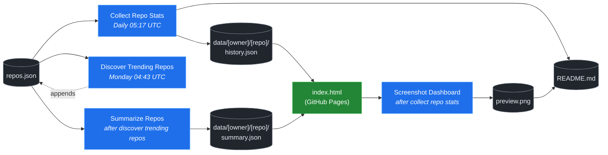

# 🚀 Rising Repos Tracker

> Automatically tracks daily GitHub stats (stars, forks, issues, velocity) for rising open source repos.

[](https://www.telosignal.com/)


**[→ View Live Dashboard](https://patrick-creates.github.io/rising-repos-tracker/)**

Built and maintained by [Telosignal](https://www.telosignal.com/).


<!-- AUTOGEN-STATS-START -->
## 📊 Current snapshot

> Auto-updated daily — last refreshed 2026-07-21

| Metric | Value |
|---|---|
| Repos tracked | **171** |
| Total stars | **7,922,504** |
| Total forks | **1,201,194** |
| Fastest growing | **ai-agent-book** (+4046.0/day) |

### 🔥 Top 5 by velocity

| # | Repo | Stars | Stars/day |
|---|---|---:|---:|
| 1 | [bojieli/ai-agent-book](https://github.com/bojieli/ai-agent-book) | 11,999 | +4046.0 |
| 2 | [DietrichGebert/ponytail](https://github.com/DietrichGebert/ponytail) | 86,853 | +1339.1 |
| 3 | [NousResearch/hermes-agent](https://github.com/NousResearch/hermes-agent) | 218,006 | +1013.9 |
| 4 | [chopratejas/headroom](https://github.com/chopratejas/headroom) | 60,814 | +907.0 |
| 5 | [Panniantong/Agent-Reach](https://github.com/Panniantong/Agent-Reach) | 58,896 | +823.7 |

### 🆕 Recently added

- [KKKKhazix/khazix-skills](https://github.com/KKKKhazix/khazix-skills) — added 2026-07-20 — 数字生命卡兹克开源的 AI Skills 合集 | Agent Skills: neat-freak 洁癖 (docs/memory closeout), hv-analysis, khazix-writer & more — Claude Code, Codex & 40+ agents
- [OpenByteInc/QuantDinger](https://github.com/OpenByteInc/QuantDinger) — added 2026-07-20 — AI quantitative trading platform for crypto, stocks, and forex with backtesting, live trading, market data, and multi-agent research.vibe-trading ,trading-agents,ai-trader,ai-trading
- [bojieli/ai-agent-book](https://github.com/bojieli/ai-agent-book) — added 2026-07-20 — 《深入理解 AI Agent：设计原理与工程实践》（李博杰 著）开源主仓库：全书正文、编译版 PDF 与按章配套代码
<!-- AUTOGEN-STATS-END -->

<!-- AUTOGEN-DIAGRAM-START -->
## 🔄 How it works


<!-- AUTOGEN-DIAGRAM-END -->

<!-- AUTOGEN-WORKFLOWS-START -->
## ⚙️ Workflows

| File | Schedule | Name |
|---|---|---|
| `collect.yml` | Daily 05:17 UTC | Collect Repo Stats |
| `discover.yml` | Monday 04:43 UTC | Discover Trending Repos |
| `screenshot.yml` | After Collect Repo Stats | Screenshot Dashboard |
| `summarize.yml` | After Discover Trending Repos | Summarize Repos |

> All workflows commit results directly back to the repo. Schedules are best-effort — GitHub Actions cron can drift by a few minutes.
<!-- AUTOGEN-WORKFLOWS-END -->

<!-- AUTOGEN-REPOS-START -->
## 📋 All tracked repos

| Repo | Stars | Forks | Stars/day |
|---|---:|---:|---:|
| [openclaw/openclaw](https://github.com/openclaw/openclaw) | 383,633 | 80,599 | +176.3 |
| [obra/superpowers](https://github.com/obra/superpowers) | 258,391 | 23,027 | +786.7 |
| [affaan-m/everything-claude-code](https://github.com/affaan-m/everything-claude-code) | 231,657 | 35,353 | +733.5 |
| [affaan-m/ECC](https://github.com/affaan-m/ECC) | 231,657 | 35,353 | +691.7 |
| [NousResearch/hermes-agent](https://github.com/NousResearch/hermes-agent) | 218,006 | 41,166 | +1013.9 |
| [Significant-Gravitas/AutoGPT](https://github.com/Significant-Gravitas/AutoGPT) | 185,627 | 46,071 | +19.5 |
| [microsoft/markitdown](https://github.com/microsoft/markitdown) | 167,765 | 12,079 | +648.7 |
| [f/prompts.chat](https://github.com/f/prompts.chat) | 166,096 | 21,469 | +56.9 |
| [langgenius/dify](https://github.com/langgenius/dify) | 149,578 | 23,577 | +121.1 |
| [open-webui/open-webui](https://github.com/open-webui/open-webui) | 146,150 | 21,194 | +134.2 |
| [langchain-ai/langchain](https://github.com/langchain-ai/langchain) | 142,223 | 23,655 | +81.0 |
| [github/spec-kit](https://github.com/github/spec-kit) | 122,939 | 10,962 | +363.4 |
| [farion1231/cc-switch](https://github.com/farion1231/cc-switch) | 119,480 | 8,023 | +709.9 |
| [microsoft/generative-ai-for-beginners](https://github.com/microsoft/generative-ai-for-beginners) | 113,311 | 60,819 | +37.1 |
| [nextlevelbuilder/ui-ux-pro-max-skill](https://github.com/nextlevelbuilder/ui-ux-pro-max-skill) | 108,309 | 11,515 | +440.8 |
| [JuliusBrussee/caveman](https://github.com/JuliusBrussee/caveman) | 91,424 | 5,182 | +467.4 |
| [ChatGPTNextWeb/NextChat](https://github.com/ChatGPTNextWeb/NextChat) | 88,525 | 59,389 | +7.6 |
| [thedotmack/claude-mem](https://github.com/thedotmack/claude-mem) | 88,057 | 7,641 | +183.7 |
| [DietrichGebert/ponytail](https://github.com/DietrichGebert/ponytail) | 86,853 | 4,743 | +1339.1 |
| [vllm-project/vllm](https://github.com/vllm-project/vllm) | 86,768 | 19,657 | +99.8 |
| [ruvnet/RuView](https://github.com/ruvnet/RuView) | 82,009 | 11,047 | +282.7 |
| [OpenHands/OpenHands](https://github.com/OpenHands/OpenHands) | 81,470 | 10,421 | +117.8 |
| [lobehub/lobehub](https://github.com/lobehub/lobehub) | 80,601 | 15,656 | +52.2 |
| [nexu-io/open-design](https://github.com/nexu-io/open-design) | 80,154 | 9,244 | +562.2 |
| [dair-ai/Prompt-Engineering-Guide](https://github.com/dair-ai/Prompt-Engineering-Guide) | 76,779 | 8,435 | +32.5 |
| [openai/openai-cookbook](https://github.com/openai/openai-cookbook) | 74,776 | 12,655 | +18.2 |
| [rtk-ai/rtk](https://github.com/rtk-ai/rtk) | 72,173 | 4,489 | +353.0 |
| [shareAI-lab/learn-claude-code](https://github.com/shareAI-lab/learn-claude-code) | 71,748 | 11,651 | +166.7 |
| [unslothai/unsloth](https://github.com/unslothai/unsloth) | 68,619 | 6,163 | +64.4 |
| [ComposioHQ/awesome-claude-skills](https://github.com/ComposioHQ/awesome-claude-skills) | 68,297 | 7,749 | +123.6 |
| [datawhalechina/hello-agents](https://github.com/datawhalechina/hello-agents) | 67,569 | 8,383 | +264.2 |
| [xtekky/gpt4free](https://github.com/xtekky/gpt4free) | 66,469 | 13,530 | +3.6 |
| [code-yeongyu/oh-my-openagent](https://github.com/code-yeongyu/oh-my-openagent) | 66,283 | 5,401 | +124.3 |
| [Leonxlnx/taste-skill](https://github.com/Leonxlnx/taste-skill) | 65,768 | 4,549 | +707.1 |
| [shanraisshan/claude-code-best-practice](https://github.com/shanraisshan/claude-code-best-practice) | 63,191 | 6,310 | +151.5 |
| [koala73/worldmonitor](https://github.com/koala73/worldmonitor) | 63,066 | 9,887 | +135.9 |
| [Fission-AI/OpenSpec](https://github.com/Fission-AI/OpenSpec) | 61,812 | 4,280 | +203.5 |
| [chopratejas/headroom](https://github.com/chopratejas/headroom) | 60,814 | 4,568 | +907.0 |
| [headroomlabs-ai/headroom](https://github.com/headroomlabs-ai/headroom) | 60,814 | 4,568 | +514.2 |
| [santifer/career-ops](https://github.com/santifer/career-ops) | 60,790 | 11,980 | +242.9 |
| [tw93/Pake](https://github.com/tw93/Pake) | 60,065 | 12,161 | +176.3 |
| [asgeirtj/system_prompts_leaks](https://github.com/asgeirtj/system_prompts_leaks) | 59,365 | 9,680 | +296.6 |
| [Panniantong/Agent-Reach](https://github.com/Panniantong/Agent-Reach) | 58,896 | 4,717 | +823.7 |
| [ZhuLinsen/daily_stock_analysis](https://github.com/ZhuLinsen/daily_stock_analysis) | 58,070 | 49,894 | +337.4 |
| [MemPalace/mempalace](https://github.com/MemPalace/mempalace) | 57,535 | 7,423 | +80.2 |
| [FlowiseAI/Flowise](https://github.com/FlowiseAI/Flowise) | 54,780 | 24,745 | +29.4 |
| [BerriAI/litellm](https://github.com/BerriAI/litellm) | 54,195 | 9,926 | +106.4 |
| [mvanhorn/last30days-skill](https://github.com/mvanhorn/last30days-skill) | 52,924 | 4,585 | +471.0 |
| [ggml-org/whisper.cpp](https://github.com/ggml-org/whisper.cpp) | 51,964 | 5,845 | +33.4 |
| [hesreallyhim/awesome-claude-code](https://github.com/hesreallyhim/awesome-claude-code) | 50,535 | 4,396 | +100.6 |
| [Aider-AI/aider](https://github.com/Aider-AI/aider) | 47,563 | 4,746 | +40.7 |
| [ChromeDevTools/chrome-devtools-mcp](https://github.com/ChromeDevTools/chrome-devtools-mcp) | 47,288 | 3,164 | +115.7 |
| [zhayujie/CowAgent](https://github.com/zhayujie/CowAgent) | 46,068 | 10,268 | +23.6 |
| [HKUDS/nanobot](https://github.com/HKUDS/nanobot) | 45,959 | 8,128 | +51.2 |
| [elder-plinius/CL4R1T4S](https://github.com/elder-plinius/CL4R1T4S) | 45,819 | 9,331 | +192.4 |
| [jamiepine/voicebox](https://github.com/jamiepine/voicebox) | 44,584 | 5,419 | +311.2 |
| [router-for-me/CLIProxyAPI](https://github.com/router-for-me/CLIProxyAPI) | 43,970 | 6,903 | +161.9 |
| [sickn33/antigravity-awesome-skills](https://github.com/sickn33/antigravity-awesome-skills) | 43,660 | 6,462 | +87.4 |
| [sickn33/agentic-awesome-skills](https://github.com/sickn33/agentic-awesome-skills) | 43,660 | 6,462 | +77.3 |
| [usestrix/strix](https://github.com/usestrix/strix) | 42,997 | 4,436 | +345.7 |
| [QuantumNous/new-api](https://github.com/QuantumNous/new-api) | 42,887 | 10,008 | +132.1 |
| [kepano/obsidian-skills](https://github.com/kepano/obsidian-skills) | 42,821 | 3,056 | +178.7 |
| [chatboxai/chatbox](https://github.com/chatboxai/chatbox) | 41,077 | 4,153 | +16.9 |
| [danny-avila/LibreChat](https://github.com/danny-avila/LibreChat) | 41,020 | 8,426 | +62.3 |
| [coreyhaines31/marketingskills](https://github.com/coreyhaines31/marketingskills) | 40,950 | 6,468 | +190.2 |
| [rohitg00/ai-engineering-from-scratch](https://github.com/rohitg00/ai-engineering-from-scratch) | 40,913 | 6,788 | +291.0 |
| [calesthio/OpenMontage](https://github.com/calesthio/OpenMontage) | 40,623 | 4,804 | +580.5 |
| [Hmbown/CodeWhale](https://github.com/Hmbown/CodeWhale) | 39,977 | 3,443 | +93.1 |
| [mindsdb/mindshub](https://github.com/mindsdb/mindshub) | 39,469 | 6,228 | +8.5 |
| [chatanywhere/GPT_API_free](https://github.com/chatanywhere/GPT_API_free) | 38,846 | 2,669 | +12.1 |
| [wshobson/agents](https://github.com/wshobson/agents) | 38,092 | 4,088 | +37.8 |
| [Yeachan-Heo/oh-my-claudecode](https://github.com/Yeachan-Heo/oh-my-claudecode) | 37,940 | 3,420 | +54.7 |
| [langchain-ai/langgraph](https://github.com/langchain-ai/langgraph) | 37,728 | 6,326 | +79.6 |
| [google/langextract](https://github.com/google/langextract) | 37,633 | 2,600 | +18.9 |
| [AstrBotDevs/AstrBot](https://github.com/AstrBotDevs/AstrBot) | 37,241 | 2,593 | +73.0 |
| [github/awesome-copilot](https://github.com/github/awesome-copilot) | 36,838 | 4,608 | +53.2 |
| [heygen-com/hyperframes](https://github.com/heygen-com/hyperframes) | 36,499 | 3,445 | +254.4 |
| [songquanpeng/one-api](https://github.com/songquanpeng/one-api) | 35,843 | 6,748 | +28.6 |
| [PDFMathTranslate/PDFMathTranslate](https://github.com/PDFMathTranslate/PDFMathTranslate) | 35,691 | 3,178 | +29.4 |
| [DeusData/codebase-memory-mcp](https://github.com/DeusData/codebase-memory-mcp) | 33,387 | 2,542 | +579.9 |
| [anthropics/claude-plugins-official](https://github.com/anthropics/claude-plugins-official) | 32,408 | 3,630 | +67.9 |
| [zeroclaw-labs/zeroclaw](https://github.com/zeroclaw-labs/zeroclaw) | 32,343 | 4,823 | +13.3 |
| [iOfficeAI/AionUi](https://github.com/iOfficeAI/AionUi) | 30,556 | 3,056 | +64.2 |
| [Gitlawb/openclaude](https://github.com/Gitlawb/openclaude) | 30,220 | 8,880 | +41.7 |
| [AlexsJones/llmfit](https://github.com/AlexsJones/llmfit) | 29,915 | 1,827 | +58.3 |
| [googleworkspace/cli](https://github.com/googleworkspace/cli) | 29,864 | 1,742 | +62.9 |
| [JCodesMore/ai-website-cloner-template](https://github.com/JCodesMore/ai-website-cloner-template) | 29,239 | 4,194 | +340.2 |
| [voideditor/void](https://github.com/voideditor/void) | 28,875 | 2,601 | +1.4 |
| [BloopAI/vibe-kanban](https://github.com/BloopAI/vibe-kanban) | 27,469 | 2,910 | +15.2 |
| [esengine/DeepSeek-Reasonix](https://github.com/esengine/DeepSeek-Reasonix) | 27,447 | 1,758 | +184.2 |
| [alibaba/page-agent](https://github.com/alibaba/page-agent) | 27,334 | 2,400 | +243.8 |
| [volcengine/OpenViking](https://github.com/volcengine/OpenViking) | 27,030 | 2,124 | +39.6 |
| [jackwener/OpenCLI](https://github.com/jackwener/OpenCLI) | 27,011 | 2,662 | +74.7 |
| [jarrodwatts/claude-hud](https://github.com/jarrodwatts/claude-hud) | 26,643 | 1,234 | +45.4 |
| [langchain-ai/deepagents](https://github.com/langchain-ai/deepagents) | 26,597 | 3,728 | +56.8 |
| [p-e-w/heretic](https://github.com/p-e-w/heretic) | 26,567 | 2,899 | +60.3 |
| [mukul975/Anthropic-Cybersecurity-Skills](https://github.com/mukul975/Anthropic-Cybersecurity-Skills) | 26,237 | 3,152 | +279.8 |
| [HKUDS/Vibe-Trading](https://github.com/HKUDS/Vibe-Trading) | 25,888 | 4,238 | +506.8 |
| [zai-org/Open-AutoGLM](https://github.com/zai-org/Open-AutoGLM) | 25,831 | 4,015 | +8.6 |
| [rohitg00/agentmemory](https://github.com/rohitg00/agentmemory) | 25,462 | 2,115 | +84.6 |
| [toon-format/toon](https://github.com/toon-format/toon) | 24,939 | 1,108 | +10.3 |
| [manaflow-ai/cmux](https://github.com/manaflow-ai/cmux) | 24,877 | 2,038 | +65.1 |
| [MadsLorentzen/ai-job-search](https://github.com/MadsLorentzen/ai-job-search) | 24,560 | 7,967 | +372.1 |
| [stablyai/orca](https://github.com/stablyai/orca) | 24,050 | 1,753 | +764.5 |
| [tirth8205/code-review-graph](https://github.com/tirth8205/code-review-graph) | 23,866 | 2,309 | +148.7 |
| [agentscope-ai/QwenPaw](https://github.com/agentscope-ai/QwenPaw) | 23,705 | 2,827 | +164.6 |
| [decolua/9router](https://github.com/decolua/9router) | 22,891 | 3,806 | +147.8 |
| [diegosouzapw/OmniRoute](https://github.com/diegosouzapw/OmniRoute) | 22,420 | 3,019 | +684.5 |
| [winfunc/opcode](https://github.com/winfunc/opcode) | 22,195 | 1,711 | +4.4 |
| [coze-dev/coze-studio](https://github.com/coze-dev/coze-studio) | 21,203 | 3,086 | +5.9 |
| [NirDiamant/agents-towards-production](https://github.com/NirDiamant/agents-towards-production) | 21,138 | 2,815 | +11.7 |
| [iOfficeAI/OfficeCLI](https://github.com/iOfficeAI/OfficeCLI) | 20,325 | 1,365 | +795.2 |
| [mksglu/context-mode](https://github.com/mksglu/context-mode) | 19,130 | 1,344 | +46.2 |
| [tanweai/pua](https://github.com/tanweai/pua) | 18,961 | 1,146 | +19.9 |
| [ogulcancelik/herdr](https://github.com/ogulcancelik/herdr) | 18,882 | 1,225 | +432.3 |
| [can1357/oh-my-pi](https://github.com/can1357/oh-my-pi) | 18,784 | 1,747 | +165.1 |
| [steipete/CodexBar](https://github.com/steipete/CodexBar) | 18,755 | 1,560 | +122.5 |
| [Tencent/WeKnora](https://github.com/Tencent/WeKnora) | 18,653 | 2,600 | +65.6 |
| [datawhalechina/easy-vibe](https://github.com/datawhalechina/easy-vibe) | 18,389 | 1,754 | +40.2 |
| [pranshuparmar/witr](https://github.com/pranshuparmar/witr) | 18,264 | 571 | +10.5 |
| [RightNow-AI/openfang](https://github.com/RightNow-AI/openfang) | 18,038 | 2,280 | +5.9 |
| [jundot/omlx](https://github.com/jundot/omlx) | 17,994 | 1,533 | +37.8 |
| [jnMetaCode/agency-agents-zh](https://github.com/jnMetaCode/agency-agents-zh) | 17,981 | 3,018 | +88.8 |
| [KKKKhazix/khazix-skills](https://github.com/KKKKhazix/khazix-skills) | 17,601 | 1,994 | +143.0 |
| [microsoft/agent-lightning](https://github.com/microsoft/agent-lightning) | 17,403 | 1,527 | +2.6 |
| [danielmiessler/LifeOS](https://github.com/danielmiessler/LifeOS) | 16,833 | 2,284 | +26.4 |
| [nesquena/hermes-webui](https://github.com/nesquena/hermes-webui) | 16,335 | 2,190 | +51.6 |
| [cft0808/edict](https://github.com/cft0808/edict) | 16,256 | 1,704 | +5.4 |
| [browser-use/browser-harness](https://github.com/browser-use/browser-harness) | 16,144 | 1,520 | +30.2 |
| [MemoriLabs/Memori](https://github.com/MemoriLabs/Memori) | 15,638 | 2,865 | +10.2 |
| [xpzouying/xiaohongshu-mcp](https://github.com/xpzouying/xiaohongshu-mcp) | 14,783 | 2,182 | +17.1 |
| [kyegomez/OpenMythos](https://github.com/kyegomez/OpenMythos) | 14,734 | 3,301 | +20.0 |
| [yusufkaraaslan/Skill_Seekers](https://github.com/yusufkaraaslan/Skill_Seekers) | 14,514 | 1,473 | +9.9 |
| [NevaMind-AI/memU](https://github.com/NevaMind-AI/memU) | 14,046 | 1,043 | +5.0 |
| [wanshuiyin/Auto-claude-code-research-in-sleep](https://github.com/wanshuiyin/Auto-claude-code-research-in-sleep) | 13,644 | 1,223 | +39.5 |
| [xbtlin/ai-berkshire](https://github.com/xbtlin/ai-berkshire) | 13,550 | 1,900 | +184.9 |
| [superset-sh/superset](https://github.com/superset-sh/superset) | 12,524 | 1,097 | +16.5 |
| [XiaomiMiMo/MiMo-Code](https://github.com/XiaomiMiMo/MiMo-Code) | 12,273 | 1,245 | +56.8 |
| [bojieli/ai-agent-book](https://github.com/bojieli/ai-agent-book) | 11,999 | 1,141 | +4046.0 |
| [sirmalloc/ccstatusline](https://github.com/sirmalloc/ccstatusline) | 11,869 | 521 | +26.8 |
| [EverMind-AI/EverOS](https://github.com/EverMind-AI/EverOS) | 11,385 | 864 | +75.9 |
| [ValueCell-ai/valuecell](https://github.com/ValueCell-ai/valuecell) | 10,942 | 1,813 | +3.2 |
| [alibaba/open-code-review](https://github.com/alibaba/open-code-review) | 10,762 | 735 | +51.7 |
| [aden-hive/hive](https://github.com/aden-hive/hive) | 10,744 | 5,667 | +6.0 |
| [walkinglabs/learn-harness-engineering](https://github.com/walkinglabs/learn-harness-engineering) | 10,559 | 1,145 | +44.9 |
| [0x4m4/hexstrike-ai](https://github.com/0x4m4/hexstrike-ai) | 10,409 | 2,169 | +18.1 |
| [MemTensor/MemOS](https://github.com/MemTensor/MemOS) | 10,305 | 942 | +12.6 |
| [Kuberwastaken/claurst](https://github.com/Kuberwastaken/claurst) | 10,112 | 7,782 | +11.2 |
| [1jehuang/jcode](https://github.com/1jehuang/jcode) | 9,902 | 1,096 | +199.6 |
| [brokermr810/QuantDinger](https://github.com/brokermr810/QuantDinger) | 9,842 | 2,066 | +37.3 |
| [OpenByteInc/QuantDinger](https://github.com/OpenByteInc/QuantDinger) | 9,842 | 2,066 | +40.0 |
| [ConardLi/garden-skills](https://github.com/ConardLi/garden-skills) | 9,666 | 1,282 | +32.3 |
| [frankbria/ralph-claude-code](https://github.com/frankbria/ralph-claude-code) | 9,556 | 730 | +6.4 |
| [iflytek/astron-agent](https://github.com/iflytek/astron-agent) | 9,462 | 868 | +56.8 |
| [ykdojo/claude-code-tips](https://github.com/ykdojo/claude-code-tips) | 9,369 | 743 | +23.5 |
| [EKKOLearnAI/hermes-studio](https://github.com/EKKOLearnAI/hermes-studio) | 9,358 | 1,147 | +33.2 |
| [TencentCloud/TencentDB-Agent-Memory](https://github.com/TencentCloud/TencentDB-Agent-Memory) | 9,175 | 850 | +57.1 |
| [EvoMap/evolver](https://github.com/EvoMap/evolver) | 8,863 | 821 | +0.5 |
| [getagentseal/codeburn](https://github.com/getagentseal/codeburn) | 8,798 | 689 | +21.8 |
| [MiroMindAI/MiroThinker](https://github.com/MiroMindAI/MiroThinker) | 8,344 | 643 | +1.2 |
| [mmulet/term.everything](https://github.com/mmulet/term.everything) | 8,045 | 192 | +1.8 |
| [ValueCell-ai/ClawX](https://github.com/ValueCell-ai/ClawX) | 7,550 | 1,129 | +1.1 |
| [modem-dev/hunk](https://github.com/modem-dev/hunk) | 7,488 | 211 | +97.9 |
| [StarTrail-org/PixelRAG](https://github.com/StarTrail-org/PixelRAG) | 6,989 | 580 | +50.5 |
| [steipete/summarize](https://github.com/steipete/summarize) | 6,463 | 438 | +6.6 |
| [opensquilla/opensquilla](https://github.com/opensquilla/opensquilla) | 6,220 | 462 | +11.0 |
| [Arthur-Ficial/apfel](https://github.com/Arthur-Ficial/apfel) | 6,170 | 233 | +6.9 |
| [UfoMiao/zcf](https://github.com/UfoMiao/zcf) | 6,077 | 424 | +0.9 |
| [microsoft/fara](https://github.com/microsoft/fara) | 6,016 | 586 | +2.1 |
| [Andyyyy64/whichllm](https://github.com/Andyyyy64/whichllm) | 5,909 | 315 | +42.0 |
| [re4/LibreCode](https://github.com/re4/LibreCode) | 77 | 4 | — |
<!-- AUTOGEN-REPOS-END -->

---

## What it does

- Collects daily snapshots of stars, forks, watchers and open issues for every tracked repo
- Discovers new trending repos automatically every Monday using the GitHub Search API
- Generates AI summaries (use cases, similar tools, tags) for each tracked repo via GitHub Models
- Stores all history as plain JSON — no database, no backend
- Renders a live dashboard via GitHub Pages — updates daily, zero maintenance

## Tracked repos

Data lives in [`data/`](./data) — one folder per repo, one `history.json` per entry.  
The full watch list is in [`repos.json`](./repos.json).

## Fork & use it for yourself

This is my personal tracker — the watch list reflects what I find interesting. If you want to track different repos, the best path is to **fork this repo and run your own**.

### Setup

1. Fork this repo to your account
2. Replace the contents of [`repos.json`](./repos.json) with the repos you want to track (or just leave one entry — `discover.yml` will auto-add more every Monday)
3. Go to **Settings → Pages** and enable GitHub Pages from the `main` branch
4. Go to **Actions** and run **Collect Repo Stats** once manually to seed your first data point
5. Your dashboard will be live at `https://YOUR-USERNAME.github.io/rising-repos-tracker/`

That's it — daily collection and weekly discovery run automatically on schedule. Zero ongoing maintenance.

### Customizing what gets discovered

Edit [`scripts/discover.js`](./scripts/discover.js) to change:

- `MIN_STARS` — minimum star threshold for candidates
- `MAX_AGE_DAYS` — how recent a repo must be
- `MAX_NEW_REPOS` — how many to add per discovery run
- The `queries` array — GitHub Search API queries that define what "trending" means to you

### Adding a repo manually

Just edit `repos.json` directly:

```json
{
  "owner": "OWNER",
  "repo": "REPO",
  "added": "YYYY-MM-DD",
  "notes": "why you're tracking this"
}
```

The next daily collect run picks it up automatically.

## Stack

- **GitHub Actions** — scheduling and automation
- **GitHub Pages** — dashboard hosting
- **GitHub API** — data source
- **GitHub Models** — free AI summaries (gpt-4o-mini)
- **Chart.js** — star growth visualization
- **Mermaid** — architecture diagram (rendered by GitHub)
- No dependencies, no build step, no database

## License

MIT
