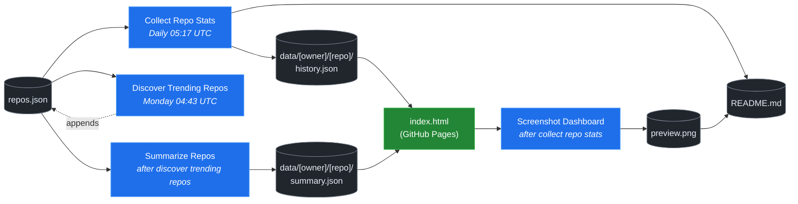

# 🚀 Rising Repos Tracker

> Automatically tracks daily GitHub stats (stars, forks, issues, velocity) for rising open source repos.

[](https://www.telosignal.com/)


**[→ View Live Dashboard](https://patrick-creates.github.io/rising-repos-tracker/)**

Built and maintained by [Telosignal](https://www.telosignal.com/).


<!-- AUTOGEN-STATS-START -->
## 📊 Current snapshot

> Auto-updated daily — last refreshed 2026-06-13

| Metric | Value |
|---|---|
| Repos tracked | **91** |
| Total stars | **5,682,192** |
| Total forks | **928,616** |
| Fastest growing | **last30days-skill** (+1603.4/day) |

### 🔥 Top 5 by velocity

| # | Repo | Stars | Stars/day |
|---|---|---:|---:|
| 1 | [mvanhorn/last30days-skill](https://github.com/mvanhorn/last30days-skill) | 40,688 | +1603.4 |
| 2 | [NousResearch/hermes-agent](https://github.com/NousResearch/hermes-agent) | 192,236 | +1425.5 |
| 3 | [affaan-m/ECC](https://github.com/affaan-m/ECC) | 214,473 | +1170.7 |
| 4 | [affaan-m/everything-claude-code](https://github.com/affaan-m/everything-claude-code) | 214,473 | +1078.2 |
| 5 | [Leonxlnx/taste-skill](https://github.com/Leonxlnx/taste-skill) | 42,627 | +1017.8 |

### 🆕 Recently added

- [mvanhorn/last30days-skill](https://github.com/mvanhorn/last30days-skill) — added 2026-06-08 — AI agent skill that researches any topic across Reddit, X, YouTube, HN, Polymarket, and the web - then synthesizes a grounded summary
- [heygen-com/hyperframes](https://github.com/heygen-com/hyperframes) — added 2026-06-08 — Write HTML. Render video. Built for agents.
- [zai-org/Open-AutoGLM](https://github.com/zai-org/Open-AutoGLM) — added 2026-06-08 — An Open Phone Agent Model & Framework. Unlocking the AI Phone for Everyone
<!-- AUTOGEN-STATS-END -->

<!-- AUTOGEN-DIAGRAM-START -->
## 🔄 How it works


<!-- AUTOGEN-DIAGRAM-END -->

<!-- AUTOGEN-WORKFLOWS-START -->
## ⚙️ Workflows

| File | Schedule | Name |
|---|---|---|
| `collect.yml` | Daily 05:17 UTC | Collect Repo Stats |
| `discover.yml` | Monday 04:43 UTC | Discover Trending Repos |
| `screenshot.yml` | After Collect Repo Stats | Screenshot Dashboard |
| `summarize.yml` | After Discover Trending Repos | Summarize Repos |

> All workflows commit results directly back to the repo. Schedules are best-effort — GitHub Actions cron can drift by a few minutes.
<!-- AUTOGEN-WORKFLOWS-END -->

<!-- AUTOGEN-REPOS-START -->
## 📋 All tracked repos

| Repo | Stars | Forks | Stars/day |
|---|---:|---:|---:|
| [openclaw/openclaw](https://github.com/openclaw/openclaw) | 378,461 | 79,159 | +225.5 |
| [affaan-m/everything-claude-code](https://github.com/affaan-m/everything-claude-code) | 214,473 | 32,956 | +1078.2 |
| [affaan-m/ECC](https://github.com/affaan-m/ECC) | 214,473 | 32,956 | +1170.7 |
| [NousResearch/hermes-agent](https://github.com/NousResearch/hermes-agent) | 192,236 | 33,511 | +1425.5 |
| [Significant-Gravitas/AutoGPT](https://github.com/Significant-Gravitas/AutoGPT) | 184,924 | 46,150 | +20.7 |
| [f/prompts.chat](https://github.com/f/prompts.chat) | 163,643 | 21,223 | +47.5 |
| [microsoft/markitdown](https://github.com/microsoft/markitdown) | 152,306 | 10,534 | +945.1 |
| [langgenius/dify](https://github.com/langgenius/dify) | 145,034 | 22,822 | +122.9 |
| [open-webui/open-webui](https://github.com/open-webui/open-webui) | 141,307 | 20,291 | +142.4 |
| [langchain-ai/langchain](https://github.com/langchain-ai/langchain) | 139,167 | 23,070 | +81.7 |
| [microsoft/generative-ai-for-beginners](https://github.com/microsoft/generative-ai-for-beginners) | 111,918 | 60,102 | +37.6 |
| [github/spec-kit](https://github.com/github/spec-kit) | 111,823 | 9,866 | +450.4 |
| [farion1231/cc-switch](https://github.com/farion1231/cc-switch) | 99,659 | 6,570 | +985.2 |
| [nextlevelbuilder/ui-ux-pro-max-skill](https://github.com/nextlevelbuilder/ui-ux-pro-max-skill) | 91,066 | 9,496 | +424.9 |
| [ChatGPTNextWeb/NextChat](https://github.com/ChatGPTNextWeb/NextChat) | 88,236 | 59,590 | +7.7 |
| [vllm-project/vllm](https://github.com/vllm-project/vllm) | 82,736 | 18,004 | +92.0 |
| [thedotmack/claude-mem](https://github.com/thedotmack/claude-mem) | 82,050 | 7,082 | +215.2 |
| [lobehub/lobehub](https://github.com/lobehub/lobehub) | 78,586 | 15,416 | +51.2 |
| [OpenHands/OpenHands](https://github.com/OpenHands/OpenHands) | 76,719 | 9,753 | +107.2 |
| [dair-ai/Prompt-Engineering-Guide](https://github.com/dair-ai/Prompt-Engineering-Guide) | 75,580 | 8,210 | +33.8 |
| [openai/openai-cookbook](https://github.com/openai/openai-cookbook) | 74,142 | 12,548 | +20.5 |
| [ruvnet/RuView](https://github.com/ruvnet/RuView) | 73,531 | 9,812 | +402.0 |
| [JuliusBrussee/caveman](https://github.com/JuliusBrussee/caveman) | 72,007 | 4,055 | +403.7 |
| [unslothai/unsloth](https://github.com/unslothai/unsloth) | 66,389 | 5,945 | +72.7 |
| [shareAI-lab/learn-claude-code](https://github.com/shareAI-lab/learn-claude-code) | 66,342 | 10,811 | +202.5 |
| [xtekky/gpt4free](https://github.com/xtekky/gpt4free) | 66,327 | 13,574 | +3.3 |
| [ComposioHQ/awesome-claude-skills](https://github.com/ComposioHQ/awesome-claude-skills) | 64,378 | 7,117 | +153.5 |
| [nexu-io/open-design](https://github.com/nexu-io/open-design) | 64,118 | 7,151 | +767.1 |
| [code-yeongyu/oh-my-openagent](https://github.com/code-yeongyu/oh-my-openagent) | 62,058 | 5,025 | +143.5 |
| [rtk-ai/rtk](https://github.com/rtk-ai/rtk) | 62,001 | 3,821 | +477.8 |
| [datawhalechina/hello-agents](https://github.com/datawhalechina/hello-agents) | 58,837 | 7,216 | +314.5 |
| [shanraisshan/claude-code-best-practice](https://github.com/shanraisshan/claude-code-best-practice) | 57,579 | 5,782 | +157.0 |
| [koala73/worldmonitor](https://github.com/koala73/worldmonitor) | 56,373 | 9,010 | +77.1 |
| [MemPalace/mempalace](https://github.com/MemPalace/mempalace) | 55,500 | 7,201 | +119.2 |
| [Fission-AI/OpenSpec](https://github.com/Fission-AI/OpenSpec) | 54,575 | 3,825 | +222.6 |
| [FlowiseAI/Flowise](https://github.com/FlowiseAI/Flowise) | 53,528 | 24,509 | +24.2 |
| [santifer/career-ops](https://github.com/santifer/career-ops) | 53,359 | 10,645 | +312.0 |
| [ggml-org/whisper.cpp](https://github.com/ggml-org/whisper.cpp) | 50,681 | 5,656 | +32.9 |
| [tw93/Pake](https://github.com/tw93/Pake) | 50,430 | 10,320 | +63.5 |
| [BerriAI/litellm](https://github.com/BerriAI/litellm) | 50,222 | 8,842 | +109.0 |
| [hesreallyhim/awesome-claude-code](https://github.com/hesreallyhim/awesome-claude-code) | 46,321 | 4,039 | +85.6 |
| [Aider-AI/aider](https://github.com/Aider-AI/aider) | 46,104 | 4,578 | +44.0 |
| [zhayujie/CowAgent](https://github.com/zhayujie/CowAgent) | 45,264 | 10,195 | +27.3 |
| [HKUDS/nanobot](https://github.com/HKUDS/nanobot) | 44,135 | 7,806 | +56.0 |
| [ChromeDevTools/chrome-devtools-mcp](https://github.com/ChromeDevTools/chrome-devtools-mcp) | 43,502 | 2,789 | +139.2 |
| [Leonxlnx/taste-skill](https://github.com/Leonxlnx/taste-skill) | 42,627 | 2,976 | +1017.8 |
| [ZhuLinsen/daily_stock_analysis](https://github.com/ZhuLinsen/daily_stock_analysis) | 42,362 | 40,143 | +185.4 |
| [asgeirtj/system_prompts_leaks](https://github.com/asgeirtj/system_prompts_leaks) | 41,910 | 6,947 | +58.7 |
| [mvanhorn/last30days-skill](https://github.com/mvanhorn/last30days-skill) | 40,688 | 3,281 | +1603.4 |
| [sickn33/antigravity-awesome-skills](https://github.com/sickn33/antigravity-awesome-skills) | 40,560 | 6,545 | +99.1 |
| [chatboxai/chatbox](https://github.com/chatboxai/chatbox) | 40,445 | 4,102 | +17.3 |
| [danny-avila/LibreChat](https://github.com/danny-avila/LibreChat) | 39,007 | 8,017 | +80.9 |
| [QuantumNous/new-api](https://github.com/QuantumNous/new-api) | 38,589 | 8,775 | +170.1 |
| [chatanywhere/GPT_API_free](https://github.com/chatanywhere/GPT_API_free) | 38,419 | 2,644 | +13.8 |
| [Hmbown/CodeWhale](https://github.com/Hmbown/CodeWhale) | 38,190 | 3,283 | +185.3 |
| [router-for-me/CLIProxyAPI](https://github.com/router-for-me/CLIProxyAPI) | 37,372 | 6,164 | +138.3 |
| [google/langextract](https://github.com/google/langextract) | 36,880 | 2,544 | +17.1 |
| [wshobson/agents](https://github.com/wshobson/agents) | 36,680 | 3,972 | +39.2 |
| [Yeachan-Heo/oh-my-claudecode](https://github.com/Yeachan-Heo/oh-my-claudecode) | 36,318 | 3,299 | +78.6 |
| [kepano/obsidian-skills](https://github.com/kepano/obsidian-skills) | 35,468 | 2,515 | +132.0 |
| [github/awesome-copilot](https://github.com/github/awesome-copilot) | 34,930 | 4,298 | +59.2 |
| [songquanpeng/one-api](https://github.com/songquanpeng/one-api) | 34,898 | 6,620 | +36.2 |
| [PDFMathTranslate/PDFMathTranslate](https://github.com/PDFMathTranslate/PDFMathTranslate) | 34,805 | 3,107 | +41.6 |
| [AstrBotDevs/AstrBot](https://github.com/AstrBotDevs/AstrBot) | 34,568 | 2,373 | +81.6 |
| [coreyhaines31/marketingskills](https://github.com/coreyhaines31/marketingskills) | 33,111 | 5,436 | +139.4 |
| [zeroclaw-labs/zeroclaw](https://github.com/zeroclaw-labs/zeroclaw) | 31,893 | 4,722 | +18.1 |
| [rohitg00/ai-engineering-from-scratch](https://github.com/rohitg00/ai-engineering-from-scratch) | 31,756 | 5,198 | +449.4 |
| [anthropics/claude-plugins-official](https://github.com/anthropics/claude-plugins-official) | 30,017 | 3,238 | +83.8 |
| [jamiepine/voicebox](https://github.com/jamiepine/voicebox) | 29,845 | 3,677 | +68.6 |
| [voideditor/void](https://github.com/voideditor/void) | 28,815 | 2,539 | +0.8 |
| [Gitlawb/openclaude](https://github.com/Gitlawb/openclaude) | 28,654 | 8,729 | +43.3 |
| [iOfficeAI/AionUi](https://github.com/iOfficeAI/AionUi) | 28,167 | 2,751 | +68.3 |
| [AlexsJones/llmfit](https://github.com/AlexsJones/llmfit) | 27,827 | 1,700 | +68.8 |
| [heygen-com/hyperframes](https://github.com/heygen-com/hyperframes) | 27,194 | 2,556 | +326.6 |
| [googleworkspace/cli](https://github.com/googleworkspace/cli) | 27,029 | 1,424 | +25.9 |
| [BloopAI/vibe-kanban](https://github.com/BloopAI/vibe-kanban) | 26,975 | 2,847 | +22.1 |
| [Panniantong/Agent-Reach](https://github.com/Panniantong/Agent-Reach) | 26,971 | 2,200 | +698.8 |
| [usestrix/strix](https://github.com/usestrix/strix) | 25,972 | 2,922 | +21.8 |
| [volcengine/OpenViking](https://github.com/volcengine/OpenViking) | 25,586 | 1,975 | +51.6 |
| [zai-org/Open-AutoGLM](https://github.com/zai-org/Open-AutoGLM) | 25,502 | 3,972 | +8.0 |
| [jarrodwatts/claude-hud](https://github.com/jarrodwatts/claude-hud) | 25,088 | 1,140 | +79.6 |
| [langchain-ai/deepagents](https://github.com/langchain-ai/deepagents) | 24,564 | 3,480 | +81.8 |
| [toon-format/toon](https://github.com/toon-format/toon) | 24,548 | 1,090 | +10.4 |
| [p-e-w/heretic](https://github.com/p-e-w/heretic) | 24,340 | 2,604 | +73.6 |
| [jackwener/OpenCLI](https://github.com/jackwener/OpenCLI) | 24,223 | 2,422 | +84.6 |
| [rohitg00/agentmemory](https://github.com/rohitg00/agentmemory) | 22,595 | 1,856 | +154.0 |
| [winfunc/opcode](https://github.com/winfunc/opcode) | 22,052 | 1,704 | +9.4 |
| [esengine/DeepSeek-Reasonix](https://github.com/esengine/DeepSeek-Reasonix) | 21,649 | 1,292 | +424.6 |
| [coze-dev/coze-studio](https://github.com/coze-dev/coze-studio) | 20,978 | 3,045 | +6.0 |
| [NirDiamant/agents-towards-production](https://github.com/NirDiamant/agents-towards-production) | 20,713 | 2,750 | +15.8 |
| [frankbria/ralph-claude-code](https://github.com/frankbria/ralph-claude-code) | 9,312 | 709 | +6.5 |
<!-- AUTOGEN-REPOS-END -->

---

## What it does

- Collects daily snapshots of stars, forks, watchers and open issues for every tracked repo
- Discovers new trending repos automatically every Monday using the GitHub Search API
- Generates AI summaries (use cases, similar tools, tags) for each tracked repo via GitHub Models
- Stores all history as plain JSON — no database, no backend
- Renders a live dashboard via GitHub Pages — updates daily, zero maintenance

## Tracked repos

Data lives in [`data/`](./data) — one folder per repo, one `history.json` per entry.  
The full watch list is in [`repos.json`](./repos.json).

## Fork & use it for yourself

This is my personal tracker — the watch list reflects what I find interesting. If you want to track different repos, the best path is to **fork this repo and run your own**.

### Setup

1. Fork this repo to your account
2. Replace the contents of [`repos.json`](./repos.json) with the repos you want to track (or just leave one entry — `discover.yml` will auto-add more every Monday)
3. Go to **Settings → Pages** and enable GitHub Pages from the `main` branch
4. Go to **Actions** and run **Collect Repo Stats** once manually to seed your first data point
5. Your dashboard will be live at `https://YOUR-USERNAME.github.io/rising-repos-tracker/`

That's it — daily collection and weekly discovery run automatically on schedule. Zero ongoing maintenance.

### Customizing what gets discovered

Edit [`scripts/discover.js`](./scripts/discover.js) to change:

- `MIN_STARS` — minimum star threshold for candidates
- `MAX_AGE_DAYS` — how recent a repo must be
- `MAX_NEW_REPOS` — how many to add per discovery run
- The `queries` array — GitHub Search API queries that define what "trending" means to you

### Adding a repo manually

Just edit `repos.json` directly:

```json
{
  "owner": "OWNER",
  "repo": "REPO",
  "added": "YYYY-MM-DD",
  "notes": "why you're tracking this"
}
```

The next daily collect run picks it up automatically.

## Stack

- **GitHub Actions** — scheduling and automation
- **GitHub Pages** — dashboard hosting
- **GitHub API** — data source
- **GitHub Models** — free AI summaries (gpt-4o-mini)
- **Chart.js** — star growth visualization
- **Mermaid** — architecture diagram (rendered by GitHub)
- No dependencies, no build step, no database

## License

MIT
