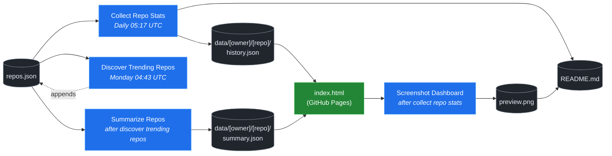

# 🚀 Rising Repos Tracker

> Automatically tracks daily GitHub stats (stars, forks, issues, velocity) for rising open source repos.

[](https://www.telosignal.com/)


**[→ View Live Dashboard](https://patrick-creates.github.io/rising-repos-tracker/)**

Built and maintained by [Telosignal](https://www.telosignal.com/).


<!-- AUTOGEN-STATS-START -->
## 📊 Current snapshot

> Auto-updated daily — last refreshed 2026-06-12

| Metric | Value |
|---|---|
| Repos tracked | **91** |
| Total stars | **5,669,549** |
| Total forks | **926,770** |
| Fastest growing | **last30days-skill** (+1835.5/day) |

### 🔥 Top 5 by velocity

| # | Repo | Stars | Stars/day |
|---|---|---:|---:|
| 1 | [mvanhorn/last30days-skill](https://github.com/mvanhorn/last30days-skill) | 40,013 | +1835.5 |
| 2 | [NousResearch/hermes-agent](https://github.com/NousResearch/hermes-agent) | 191,424 | +1446.0 |
| 3 | [affaan-m/ECC](https://github.com/affaan-m/ECC) | 213,835 | +1200.3 |
| 4 | [affaan-m/everything-claude-code](https://github.com/affaan-m/everything-claude-code) | 213,834 | +1092.9 |
| 5 | [Leonxlnx/taste-skill](https://github.com/Leonxlnx/taste-skill) | 41,917 | +1045.8 |

### 🆕 Recently added

- [mvanhorn/last30days-skill](https://github.com/mvanhorn/last30days-skill) — added 2026-06-08 — AI agent skill that researches any topic across Reddit, X, YouTube, HN, Polymarket, and the web - then synthesizes a grounded summary
- [heygen-com/hyperframes](https://github.com/heygen-com/hyperframes) — added 2026-06-08 — Write HTML. Render video. Built for agents.
- [zai-org/Open-AutoGLM](https://github.com/zai-org/Open-AutoGLM) — added 2026-06-08 — An Open Phone Agent Model & Framework. Unlocking the AI Phone for Everyone
<!-- AUTOGEN-STATS-END -->

<!-- AUTOGEN-DIAGRAM-START -->
## 🔄 How it works


<!-- AUTOGEN-DIAGRAM-END -->

<!-- AUTOGEN-WORKFLOWS-START -->
## ⚙️ Workflows

| File | Schedule | Name |
|---|---|---|
| `collect.yml` | Daily 05:17 UTC | Collect Repo Stats |
| `discover.yml` | Monday 04:43 UTC | Discover Trending Repos |
| `screenshot.yml` | After Collect Repo Stats | Screenshot Dashboard |
| `summarize.yml` | After Discover Trending Repos | Summarize Repos |

> All workflows commit results directly back to the repo. Schedules are best-effort — GitHub Actions cron can drift by a few minutes.
<!-- AUTOGEN-WORKFLOWS-END -->

<!-- AUTOGEN-REPOS-START -->
## 📋 All tracked repos

| Repo | Stars | Forks | Stars/day |
|---|---:|---:|---:|
| [openclaw/openclaw](https://github.com/openclaw/openclaw) | 378,300 | 79,116 | +227.6 |
| [affaan-m/ECC](https://github.com/affaan-m/ECC) | 213,835 | 32,861 | +1200.3 |
| [affaan-m/everything-claude-code](https://github.com/affaan-m/everything-claude-code) | 213,834 | 32,861 | +1092.9 |
| [NousResearch/hermes-agent](https://github.com/NousResearch/hermes-agent) | 191,424 | 33,270 | +1446.0 |
| [Significant-Gravitas/AutoGPT](https://github.com/Significant-Gravitas/AutoGPT) | 184,900 | 46,153 | +20.6 |
| [f/prompts.chat](https://github.com/f/prompts.chat) | 163,608 | 21,222 | +47.9 |
| [microsoft/markitdown](https://github.com/microsoft/markitdown) | 151,595 | 10,461 | +952.9 |
| [langgenius/dify](https://github.com/langgenius/dify) | 144,941 | 22,806 | +123.9 |
| [open-webui/open-webui](https://github.com/open-webui/open-webui) | 141,177 | 20,270 | +142.8 |
| [langchain-ai/langchain](https://github.com/langchain-ai/langchain) | 139,103 | 23,053 | +82.3 |
| [microsoft/generative-ai-for-beginners](https://github.com/microsoft/generative-ai-for-beginners) | 111,894 | 60,084 | +38.1 |
| [github/spec-kit](https://github.com/github/spec-kit) | 111,628 | 9,839 | +458.9 |
| [farion1231/cc-switch](https://github.com/farion1231/cc-switch) | 99,015 | 6,518 | +998.8 |
| [nextlevelbuilder/ui-ux-pro-max-skill](https://github.com/nextlevelbuilder/ui-ux-pro-max-skill) | 90,671 | 9,432 | +425.9 |
| [ChatGPTNextWeb/NextChat](https://github.com/ChatGPTNextWeb/NextChat) | 88,227 | 59,592 | +7.6 |
| [vllm-project/vllm](https://github.com/vllm-project/vllm) | 82,656 | 17,975 | +92.4 |
| [thedotmack/claude-mem](https://github.com/thedotmack/claude-mem) | 81,896 | 7,063 | +217.2 |
| [lobehub/lobehub](https://github.com/lobehub/lobehub) | 78,541 | 15,406 | +51.4 |
| [OpenHands/OpenHands](https://github.com/OpenHands/OpenHands) | 76,543 | 9,730 | +104.4 |
| [dair-ai/Prompt-Engineering-Guide](https://github.com/dair-ai/Prompt-Engineering-Guide) | 75,557 | 8,210 | +34.2 |
| [openai/openai-cookbook](https://github.com/openai/openai-cookbook) | 74,134 | 12,545 | +21.0 |
| [ruvnet/RuView](https://github.com/ruvnet/RuView) | 73,316 | 9,779 | +412.4 |
| [JuliusBrussee/caveman](https://github.com/JuliusBrussee/caveman) | 71,683 | 4,037 | +406.8 |
| [xtekky/gpt4free](https://github.com/xtekky/gpt4free) | 66,324 | 13,572 | +3.3 |
| [unslothai/unsloth](https://github.com/unslothai/unsloth) | 66,298 | 5,937 | +71.9 |
| [shareAI-lab/learn-claude-code](https://github.com/shareAI-lab/learn-claude-code) | 66,218 | 10,787 | +205.6 |
| [ComposioHQ/awesome-claude-skills](https://github.com/ComposioHQ/awesome-claude-skills) | 64,264 | 7,098 | +155.0 |
| [nexu-io/open-design](https://github.com/nexu-io/open-design) | 63,741 | 7,102 | +782.7 |
| [code-yeongyu/oh-my-openagent](https://github.com/code-yeongyu/oh-my-openagent) | 61,971 | 5,018 | +145.7 |
| [rtk-ai/rtk](https://github.com/rtk-ai/rtk) | 61,664 | 3,790 | +483.4 |
| [datawhalechina/hello-agents](https://github.com/datawhalechina/hello-agents) | 58,676 | 7,190 | +320.6 |
| [shanraisshan/claude-code-best-practice](https://github.com/shanraisshan/claude-code-best-practice) | 57,496 | 5,774 | +159.9 |
| [koala73/worldmonitor](https://github.com/koala73/worldmonitor) | 56,339 | 9,010 | +78.8 |
| [MemPalace/mempalace](https://github.com/MemPalace/mempalace) | 55,429 | 7,195 | +121.2 |
| [Fission-AI/OpenSpec](https://github.com/Fission-AI/OpenSpec) | 54,436 | 3,811 | +225.9 |
| [FlowiseAI/Flowise](https://github.com/FlowiseAI/Flowise) | 53,509 | 24,499 | +24.4 |
| [santifer/career-ops](https://github.com/santifer/career-ops) | 52,959 | 10,595 | +308.5 |
| [ggml-org/whisper.cpp](https://github.com/ggml-org/whisper.cpp) | 50,655 | 5,655 | +33.2 |
| [tw93/Pake](https://github.com/tw93/Pake) | 50,389 | 10,297 | +64.4 |
| [BerriAI/litellm](https://github.com/BerriAI/litellm) | 50,132 | 8,819 | +109.8 |
| [hesreallyhim/awesome-claude-code](https://github.com/hesreallyhim/awesome-claude-code) | 46,247 | 4,028 | +86.1 |
| [Aider-AI/aider](https://github.com/Aider-AI/aider) | 46,025 | 4,570 | +42.6 |
| [zhayujie/CowAgent](https://github.com/zhayujie/CowAgent) | 45,243 | 10,194 | +27.5 |
| [HKUDS/nanobot](https://github.com/HKUDS/nanobot) | 44,099 | 7,802 | +56.8 |
| [ChromeDevTools/chrome-devtools-mcp](https://github.com/ChromeDevTools/chrome-devtools-mcp) | 43,428 | 2,783 | +141.8 |
| [ZhuLinsen/daily_stock_analysis](https://github.com/ZhuLinsen/daily_stock_analysis) | 42,260 | 40,042 | +190.1 |
| [Leonxlnx/taste-skill](https://github.com/Leonxlnx/taste-skill) | 41,917 | 2,932 | +1045.8 |
| [asgeirtj/system_prompts_leaks](https://github.com/asgeirtj/system_prompts_leaks) | 41,762 | 6,908 | +55.1 |
| [chatboxai/chatbox](https://github.com/chatboxai/chatbox) | 40,437 | 4,100 | +17.6 |
| [sickn33/antigravity-awesome-skills](https://github.com/sickn33/antigravity-awesome-skills) | 40,433 | 6,529 | +97.5 |
| [mvanhorn/last30days-skill](https://github.com/mvanhorn/last30days-skill) | 40,013 | 3,219 | +1835.5 |
| [danny-avila/LibreChat](https://github.com/danny-avila/LibreChat) | 38,939 | 8,005 | +81.7 |
| [QuantumNous/new-api](https://github.com/QuantumNous/new-api) | 38,471 | 8,733 | +173.0 |
| [chatanywhere/GPT_API_free](https://github.com/chatanywhere/GPT_API_free) | 38,412 | 2,642 | +14.2 |
| [Hmbown/CodeWhale](https://github.com/Hmbown/CodeWhale) | 38,101 | 3,276 | +190.6 |
| [router-for-me/CLIProxyAPI](https://github.com/router-for-me/CLIProxyAPI) | 37,284 | 6,148 | +141.1 |
| [google/langextract](https://github.com/google/langextract) | 36,876 | 2,544 | +17.8 |
| [wshobson/agents](https://github.com/wshobson/agents) | 36,647 | 3,967 | +39.5 |
| [Yeachan-Heo/oh-my-claudecode](https://github.com/Yeachan-Heo/oh-my-claudecode) | 36,270 | 3,296 | +80.3 |
| [kepano/obsidian-skills](https://github.com/kepano/obsidian-skills) | 35,382 | 2,507 | +136.2 |
| [github/awesome-copilot](https://github.com/github/awesome-copilot) | 34,882 | 4,285 | +59.8 |
| [songquanpeng/one-api](https://github.com/songquanpeng/one-api) | 34,874 | 6,619 | +36.9 |
| [PDFMathTranslate/PDFMathTranslate](https://github.com/PDFMathTranslate/PDFMathTranslate) | 34,778 | 3,104 | +42.4 |
| [AstrBotDevs/AstrBot](https://github.com/AstrBotDevs/AstrBot) | 34,506 | 2,367 | +83.4 |
| [coreyhaines31/marketingskills](https://github.com/coreyhaines31/marketingskills) | 32,980 | 5,413 | +140.2 |
| [zeroclaw-labs/zeroclaw](https://github.com/zeroclaw-labs/zeroclaw) | 31,882 | 4,718 | +18.7 |
| [rohitg00/ai-engineering-from-scratch](https://github.com/rohitg00/ai-engineering-from-scratch) | 31,523 | 5,156 | +469.1 |
| [anthropics/claude-plugins-official](https://github.com/anthropics/claude-plugins-official) | 29,962 | 3,234 | +86.5 |
| [jamiepine/voicebox](https://github.com/jamiepine/voicebox) | 29,788 | 3,668 | +69.6 |
| [voideditor/void](https://github.com/voideditor/void) | 28,815 | 2,538 | +0.9 |
| [Gitlawb/openclaude](https://github.com/Gitlawb/openclaude) | 28,621 | 8,726 | +44.2 |
| [iOfficeAI/AionUi](https://github.com/iOfficeAI/AionUi) | 28,113 | 2,741 | +69.5 |
| [AlexsJones/llmfit](https://github.com/AlexsJones/llmfit) | 27,789 | 1,698 | +71.6 |
| [googleworkspace/cli](https://github.com/googleworkspace/cli) | 27,007 | 1,420 | +26.3 |
| [heygen-com/hyperframes](https://github.com/heygen-com/hyperframes) | 26,951 | 2,524 | +347.5 |
| [BloopAI/vibe-kanban](https://github.com/BloopAI/vibe-kanban) | 26,948 | 2,845 | +21.6 |
| [Panniantong/Agent-Reach](https://github.com/Panniantong/Agent-Reach) | 26,536 | 2,173 | +764.8 |
| [usestrix/strix](https://github.com/usestrix/strix) | 25,953 | 2,919 | +22.1 |
| [volcengine/OpenViking](https://github.com/volcengine/OpenViking) | 25,543 | 1,973 | +53.8 |
| [zai-org/Open-AutoGLM](https://github.com/zai-org/Open-AutoGLM) | 25,495 | 3,971 | +8.3 |
| [jarrodwatts/claude-hud](https://github.com/jarrodwatts/claude-hud) | 25,043 | 1,135 | +88.3 |
| [toon-format/toon](https://github.com/toon-format/toon) | 24,539 | 1,089 | +10.8 |
| [langchain-ai/deepagents](https://github.com/langchain-ai/deepagents) | 24,515 | 3,471 | +90.0 |
| [p-e-w/heretic](https://github.com/p-e-w/heretic) | 24,205 | 2,585 | +58.3 |
| [jackwener/OpenCLI](https://github.com/jackwener/OpenCLI) | 24,147 | 2,412 | +86.8 |
| [rohitg00/agentmemory](https://github.com/rohitg00/agentmemory) | 22,459 | 1,849 | +158.5 |
| [winfunc/opcode](https://github.com/winfunc/opcode) | 22,049 | 1,703 | +11.0 |
| [esengine/DeepSeek-Reasonix](https://github.com/esengine/DeepSeek-Reasonix) | 21,443 | 1,279 | +479.3 |
| [coze-dev/coze-studio](https://github.com/coze-dev/coze-studio) | 20,972 | 3,043 | +6.0 |
| [NirDiamant/agents-towards-production](https://github.com/NirDiamant/agents-towards-production) | 20,704 | 2,749 | +17.5 |
| [frankbria/ralph-claude-code](https://github.com/frankbria/ralph-claude-code) | 9,303 | 706 | +6.4 |
<!-- AUTOGEN-REPOS-END -->

---

## What it does

- Collects daily snapshots of stars, forks, watchers and open issues for every tracked repo
- Discovers new trending repos automatically every Monday using the GitHub Search API
- Generates AI summaries (use cases, similar tools, tags) for each tracked repo via GitHub Models
- Stores all history as plain JSON — no database, no backend
- Renders a live dashboard via GitHub Pages — updates daily, zero maintenance

## Tracked repos

Data lives in [`data/`](./data) — one folder per repo, one `history.json` per entry.  
The full watch list is in [`repos.json`](./repos.json).

## Fork & use it for yourself

This is my personal tracker — the watch list reflects what I find interesting. If you want to track different repos, the best path is to **fork this repo and run your own**.

### Setup

1. Fork this repo to your account
2. Replace the contents of [`repos.json`](./repos.json) with the repos you want to track (or just leave one entry — `discover.yml` will auto-add more every Monday)
3. Go to **Settings → Pages** and enable GitHub Pages from the `main` branch
4. Go to **Actions** and run **Collect Repo Stats** once manually to seed your first data point
5. Your dashboard will be live at `https://YOUR-USERNAME.github.io/rising-repos-tracker/`

That's it — daily collection and weekly discovery run automatically on schedule. Zero ongoing maintenance.

### Customizing what gets discovered

Edit [`scripts/discover.js`](./scripts/discover.js) to change:

- `MIN_STARS` — minimum star threshold for candidates
- `MAX_AGE_DAYS` — how recent a repo must be
- `MAX_NEW_REPOS` — how many to add per discovery run
- The `queries` array — GitHub Search API queries that define what "trending" means to you

### Adding a repo manually

Just edit `repos.json` directly:

```json
{
  "owner": "OWNER",
  "repo": "REPO",
  "added": "YYYY-MM-DD",
  "notes": "why you're tracking this"
}
```

The next daily collect run picks it up automatically.

## Stack

- **GitHub Actions** — scheduling and automation
- **GitHub Pages** — dashboard hosting
- **GitHub API** — data source
- **GitHub Models** — free AI summaries (gpt-4o-mini)
- **Chart.js** — star growth visualization
- **Mermaid** — architecture diagram (rendered by GitHub)
- No dependencies, no build step, no database

## License

MIT
