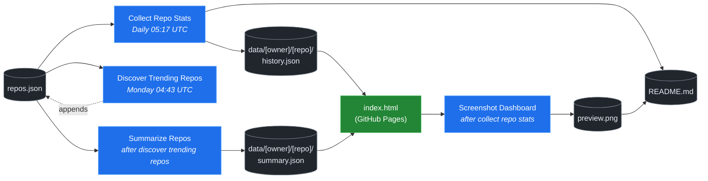

# 🚀 Rising Repos Tracker

> Automatically tracks daily GitHub stats (stars, forks, issues, velocity) for rising open source repos.

[](https://www.telosignal.com/)


**[→ View Live Dashboard](https://patrick-creates.github.io/rising-repos-tracker/)**

Built and maintained by [Telosignal](https://www.telosignal.com/).


<!-- AUTOGEN-STATS-START -->
## 📊 Current snapshot

> Auto-updated daily — last refreshed 2026-07-12

| Metric | Value |
|---|---|
| Repos tracked | **151** |
| Total stars | **7,487,629** |
| Total forks | **1,147,611** |
| Fastest growing | **ponytail** (+1645.0/day) |

### 🔥 Top 5 by velocity

| # | Repo | Stars | Stars/day |
|---|---|---:|---:|
| 1 | [DietrichGebert/ponytail](https://github.com/DietrichGebert/ponytail) | 80,919 | +1645.0 |
| 2 | [iOfficeAI/OfficeCLI](https://github.com/iOfficeAI/OfficeCLI) | 15,192 | +1132.5 |
| 3 | [chopratejas/headroom](https://github.com/chopratejas/headroom) | 58,608 | +1127.6 |
| 4 | [NousResearch/hermes-agent](https://github.com/NousResearch/hermes-agent) | 213,397 | +1089.2 |
| 5 | [Panniantong/Agent-Reach](https://github.com/Panniantong/Agent-Reach) | 55,039 | +928.3 |

### 🆕 Recently added

- [stablyai/orca](https://github.com/stablyai/orca) — added 2026-07-06 — Orca is the ADE for working with a fleet of parallel agents. Run any coding agent with your own subscription. Available on desktop and mobile.
- [ogulcancelik/herdr](https://github.com/ogulcancelik/herdr) — added 2026-07-06 — agent multiplexer that lives in your terminal.
- [diegosouzapw/OmniRoute](https://github.com/diegosouzapw/OmniRoute) — added 2026-07-06 — Never stop coding. Free AI gateway: one endpoint, 231+ providers (50+ free), connect Claude Code, Codex, Cursor, Cline & Copilot to FREE Claude/GPT/Gemini. RTK+Caveman stacked compression saves 15-95% tokens, smart auto-fallback, MCP/A2A, multimodal APIs, Desktop/PWA.
<!-- AUTOGEN-STATS-END -->

<!-- AUTOGEN-DIAGRAM-START -->
## 🔄 How it works


<!-- AUTOGEN-DIAGRAM-END -->

<!-- AUTOGEN-WORKFLOWS-START -->
## ⚙️ Workflows

| File | Schedule | Name |
|---|---|---|
| `collect.yml` | Daily 05:17 UTC | Collect Repo Stats |
| `discover.yml` | Monday 04:43 UTC | Discover Trending Repos |
| `screenshot.yml` | After Collect Repo Stats | Screenshot Dashboard |
| `summarize.yml` | After Discover Trending Repos | Summarize Repos |

> All workflows commit results directly back to the repo. Schedules are best-effort — GitHub Actions cron can drift by a few minutes.
<!-- AUTOGEN-WORKFLOWS-END -->

<!-- AUTOGEN-REPOS-START -->
## 📋 All tracked repos

| Repo | Stars | Forks | Stars/day |
|---|---:|---:|---:|
| [openclaw/openclaw](https://github.com/openclaw/openclaw) | 382,640 | 80,307 | +186.2 |
| [obra/superpowers](https://github.com/obra/superpowers) | 252,623 | 22,557 | +852.3 |
| [affaan-m/everything-claude-code](https://github.com/affaan-m/everything-claude-code) | 228,699 | 35,072 | +794.2 |
| [affaan-m/ECC](https://github.com/affaan-m/ECC) | 228,699 | 35,072 | +759.8 |
| [NousResearch/hermes-agent](https://github.com/NousResearch/hermes-agent) | 213,397 | 39,491 | +1089.2 |
| [Significant-Gravitas/AutoGPT](https://github.com/Significant-Gravitas/AutoGPT) | 185,483 | 46,106 | +20.0 |
| [f/prompts.chat](https://github.com/f/prompts.chat) | 165,469 | 21,422 | +55.0 |
| [microsoft/markitdown](https://github.com/microsoft/markitdown) | 164,972 | 11,762 | +699.4 |
| [langgenius/dify](https://github.com/langgenius/dify) | 148,548 | 23,421 | +122.0 |
| [open-webui/open-webui](https://github.com/open-webui/open-webui) | 145,109 | 21,018 | +136.9 |
| [langchain-ai/langchain](https://github.com/langchain-ai/langchain) | 141,574 | 23,532 | +82.3 |
| [github/spec-kit](https://github.com/github/spec-kit) | 119,662 | 10,611 | +363.4 |
| [farion1231/cc-switch](https://github.com/farion1231/cc-switch) | 116,095 | 7,774 | +764.6 |
| [microsoft/generative-ai-for-beginners](https://github.com/microsoft/generative-ai-for-beginners) | 112,898 | 60,632 | +35.8 |
| [nextlevelbuilder/ui-ux-pro-max-skill](https://github.com/nextlevelbuilder/ui-ux-pro-max-skill) | 104,479 | 11,057 | +443.1 |
| [ChatGPTNextWeb/NextChat](https://github.com/ChatGPTNextWeb/NextChat) | 88,452 | 59,463 | +7.5 |
| [JuliusBrussee/caveman](https://github.com/JuliusBrussee/caveman) | 88,261 | 5,071 | +486.3 |
| [thedotmack/claude-mem](https://github.com/thedotmack/claude-mem) | 86,897 | 7,507 | +191.9 |
| [vllm-project/vllm](https://github.com/vllm-project/vllm) | 86,008 | 19,297 | +102.1 |
| [DietrichGebert/ponytail](https://github.com/DietrichGebert/ponytail) | 80,919 | 4,368 | +1645.0 |
| [OpenHands/OpenHands](https://github.com/OpenHands/OpenHands) | 80,509 | 10,271 | +119.6 |
| [ruvnet/RuView](https://github.com/ruvnet/RuView) | 80,124 | 10,786 | +296.5 |
| [lobehub/lobehub](https://github.com/lobehub/lobehub) | 79,754 | 15,592 | +45.9 |
| [nexu-io/open-design](https://github.com/nexu-io/open-design) | 77,414 | 8,850 | +604.4 |
| [dair-ai/Prompt-Engineering-Guide](https://github.com/dair-ai/Prompt-Engineering-Guide) | 76,377 | 8,365 | +30.5 |
| [openai/openai-cookbook](https://github.com/openai/openai-cookbook) | 74,651 | 12,636 | +18.9 |
| [shareAI-lab/learn-claude-code](https://github.com/shareAI-lab/learn-claude-code) | 70,700 | 11,510 | +175.0 |
| [rtk-ai/rtk](https://github.com/rtk-ai/rtk) | 70,419 | 4,382 | +378.9 |
| [unslothai/unsloth](https://github.com/unslothai/unsloth) | 68,042 | 6,126 | +64.4 |
| [ComposioHQ/awesome-claude-skills](https://github.com/ComposioHQ/awesome-claude-skills) | 67,495 | 7,603 | +129.2 |
| [xtekky/gpt4free](https://github.com/xtekky/gpt4free) | 66,467 | 13,554 | +4.1 |
| [code-yeongyu/oh-my-openagent](https://github.com/code-yeongyu/oh-my-openagent) | 65,582 | 5,347 | +131.9 |
| [datawhalechina/hello-agents](https://github.com/datawhalechina/hello-agents) | 65,536 | 8,121 | +270.5 |
| [shanraisshan/claude-code-best-practice](https://github.com/shanraisshan/claude-code-best-practice) | 62,451 | 6,248 | +162.8 |
| [Leonxlnx/taste-skill](https://github.com/Leonxlnx/taste-skill) | 62,217 | 4,386 | +775.7 |
| [koala73/worldmonitor](https://github.com/koala73/worldmonitor) | 61,738 | 9,626 | +134.0 |
| [Fission-AI/OpenSpec](https://github.com/Fission-AI/OpenSpec) | 60,222 | 4,182 | +207.9 |
| [tw93/Pake](https://github.com/tw93/Pake) | 59,765 | 12,062 | +199.7 |
| [santifer/career-ops](https://github.com/santifer/career-ops) | 59,680 | 11,850 | +262.4 |
| [chopratejas/headroom](https://github.com/chopratejas/headroom) | 58,608 | 4,333 | +1127.6 |
| [headroomlabs-ai/headroom](https://github.com/headroomlabs-ai/headroom) | 58,608 | 4,333 | +635.3 |
| [MemPalace/mempalace](https://github.com/MemPalace/mempalace) | 57,239 | 7,389 | +88.0 |
| [ZhuLinsen/daily_stock_analysis](https://github.com/ZhuLinsen/daily_stock_analysis) | 56,749 | 48,827 | +373.1 |
| [asgeirtj/system_prompts_leaks](https://github.com/asgeirtj/system_prompts_leaks) | 56,376 | 9,310 | +290.7 |
| [Panniantong/Agent-Reach](https://github.com/Panniantong/Agent-Reach) | 55,039 | 4,532 | +928.3 |
| [FlowiseAI/Flowise](https://github.com/FlowiseAI/Flowise) | 54,542 | 24,710 | +29.9 |
| [BerriAI/litellm](https://github.com/BerriAI/litellm) | 53,303 | 9,679 | +107.5 |
| [ggml-org/whisper.cpp](https://github.com/ggml-org/whisper.cpp) | 51,720 | 5,900 | +34.4 |
| [mvanhorn/last30days-skill](https://github.com/mvanhorn/last30days-skill) | 51,623 | 4,470 | +557.4 |
| [hesreallyhim/awesome-claude-code](https://github.com/hesreallyhim/awesome-claude-code) | 49,829 | 4,348 | +104.3 |
| [Aider-AI/aider](https://github.com/Aider-AI/aider) | 47,309 | 4,721 | +42.7 |
| [ChromeDevTools/chrome-devtools-mcp](https://github.com/ChromeDevTools/chrome-devtools-mcp) | 46,713 | 3,195 | +124.2 |
| [zhayujie/CowAgent](https://github.com/zhayujie/CowAgent) | 45,936 | 10,259 | +25.1 |
| [HKUDS/nanobot](https://github.com/HKUDS/nanobot) | 45,275 | 7,987 | +47.2 |
| [elder-plinius/CL4R1T4S](https://github.com/elder-plinius/CL4R1T4S) | 45,270 | 9,216 | +236.3 |
| [sickn33/antigravity-awesome-skills](https://github.com/sickn33/antigravity-awesome-skills) | 42,935 | 6,816 | +88.7 |
| [QuantumNous/new-api](https://github.com/QuantumNous/new-api) | 41,909 | 9,720 | +136.5 |
| [kepano/obsidian-skills](https://github.com/kepano/obsidian-skills) | 41,024 | 2,925 | +174.1 |
| [chatboxai/chatbox](https://github.com/chatboxai/chatbox) | 40,973 | 4,147 | +17.8 |
| [jamiepine/voicebox](https://github.com/jamiepine/voicebox) | 40,734 | 4,917 | +285.7 |
| [usestrix/strix](https://github.com/usestrix/strix) | 40,639 | 4,284 | +364.1 |
| [danny-avila/LibreChat](https://github.com/danny-avila/LibreChat) | 40,608 | 8,331 | +65.4 |
| [router-for-me/CLIProxyAPI](https://github.com/router-for-me/CLIProxyAPI) | 40,128 | 6,589 | +112.2 |
| [Hmbown/CodeWhale](https://github.com/Hmbown/CodeWhale) | 39,703 | 3,421 | +104.9 |
| [chatanywhere/GPT_API_free](https://github.com/chatanywhere/GPT_API_free) | 38,749 | 2,668 | +12.4 |
| [rohitg00/ai-engineering-from-scratch](https://github.com/rohitg00/ai-engineering-from-scratch) | 38,009 | 6,345 | +284.0 |
| [wshobson/agents](https://github.com/wshobson/agents) | 37,818 | 4,058 | +39.2 |
| [coreyhaines31/marketingskills](https://github.com/coreyhaines31/marketingskills) | 37,744 | 6,077 | +153.8 |
| [Yeachan-Heo/oh-my-claudecode](https://github.com/Yeachan-Heo/oh-my-claudecode) | 37,682 | 3,404 | +59.5 |
| [calesthio/OpenMontage](https://github.com/calesthio/OpenMontage) | 37,230 | 4,489 | +721.5 |
| [google/langextract](https://github.com/google/langextract) | 37,129 | 2,562 | +12.0 |
| [langchain-ai/langgraph](https://github.com/langchain-ai/langgraph) | 37,076 | 6,221 | +82.8 |
| [github/awesome-copilot](https://github.com/github/awesome-copilot) | 36,462 | 4,549 | +55.3 |
| [AstrBotDevs/AstrBot](https://github.com/AstrBotDevs/AstrBot) | 36,222 | 2,517 | +64.2 |
| [songquanpeng/one-api](https://github.com/songquanpeng/one-api) | 35,648 | 6,733 | +30.0 |
| [PDFMathTranslate/PDFMathTranslate](https://github.com/PDFMathTranslate/PDFMathTranslate) | 35,535 | 3,172 | +31.7 |
| [heygen-com/hyperframes](https://github.com/heygen-com/hyperframes) | 34,360 | 3,224 | +258.8 |
| [zeroclaw-labs/zeroclaw](https://github.com/zeroclaw-labs/zeroclaw) | 32,233 | 4,806 | +13.6 |
| [anthropics/claude-plugins-official](https://github.com/anthropics/claude-plugins-official) | 32,000 | 3,546 | +72.9 |
| [DeusData/codebase-memory-mcp](https://github.com/DeusData/codebase-memory-mcp) | 30,265 | 2,425 | +741.2 |
| [Gitlawb/openclaude](https://github.com/Gitlawb/openclaude) | 29,950 | 8,874 | +44.3 |
| [iOfficeAI/AionUi](https://github.com/iOfficeAI/AionUi) | 29,863 | 2,995 | +61.3 |
| [googleworkspace/cli](https://github.com/googleworkspace/cli) | 29,613 | 1,717 | +70.6 |
| [AlexsJones/llmfit](https://github.com/AlexsJones/llmfit) | 29,290 | 1,787 | +55.8 |
| [voideditor/void](https://github.com/voideditor/void) | 28,834 | 2,584 | +0.7 |
| [JCodesMore/ai-website-cloner-template](https://github.com/JCodesMore/ai-website-cloner-template) | 27,836 | 4,073 | +401.6 |
| [BloopAI/vibe-kanban](https://github.com/BloopAI/vibe-kanban) | 27,344 | 2,905 | +15.5 |
| [esengine/DeepSeek-Reasonix](https://github.com/esengine/DeepSeek-Reasonix) | 26,694 | 1,674 | +210.8 |
| [volcengine/OpenViking](https://github.com/volcengine/OpenViking) | 26,600 | 2,083 | +37.4 |
| [jackwener/OpenCLI](https://github.com/jackwener/OpenCLI) | 26,505 | 2,609 | +79.6 |
| [jarrodwatts/claude-hud](https://github.com/jarrodwatts/claude-hud) | 26,340 | 1,210 | +48.5 |
| [langchain-ai/deepagents](https://github.com/langchain-ai/deepagents) | 26,111 | 3,653 | +57.5 |
| [p-e-w/heretic](https://github.com/p-e-w/heretic) | 26,099 | 2,839 | +62.6 |
| [alibaba/page-agent](https://github.com/alibaba/page-agent) | 26,099 | 2,400 | +279.3 |
| [zai-org/Open-AutoGLM](https://github.com/zai-org/Open-AutoGLM) | 25,751 | 4,009 | +8.5 |
| [mukul975/Anthropic-Cybersecurity-Skills](https://github.com/mukul975/Anthropic-Cybersecurity-Skills) | 25,339 | 3,074 | +360.9 |
| [rohitg00/agentmemory](https://github.com/rohitg00/agentmemory) | 25,009 | 2,069 | +93.6 |
| [toon-format/toon](https://github.com/toon-format/toon) | 24,835 | 1,102 | +10.0 |
| [winfunc/opcode](https://github.com/winfunc/opcode) | 22,167 | 1,706 | +4.8 |
| [agentscope-ai/QwenPaw](https://github.com/agentscope-ai/QwenPaw) | 21,971 | 2,774 | +155.3 |
| [decolua/9router](https://github.com/decolua/9router) | 21,805 | 3,674 | +156.8 |
| [coze-dev/coze-studio](https://github.com/coze-dev/coze-studio) | 21,150 | 3,080 | +5.9 |
| [NirDiamant/agents-towards-production](https://github.com/NirDiamant/agents-towards-production) | 20,958 | 2,792 | +9.5 |
| [HKUDS/Vibe-Trading](https://github.com/HKUDS/Vibe-Trading) | 19,912 | 3,490 | +398.0 |
| [tirth8205/code-review-graph](https://github.com/tirth8205/code-review-graph) | 19,448 | 2,080 | +34.6 |
| [mksglu/context-mode](https://github.com/mksglu/context-mode) | 18,828 | 1,325 | +50.4 |
| [tanweai/pua](https://github.com/tanweai/pua) | 18,766 | 1,130 | +19.3 |
| [pranshuparmar/witr](https://github.com/pranshuparmar/witr) | 18,208 | 568 | +13.5 |
| [Tencent/WeKnora](https://github.com/Tencent/WeKnora) | 18,139 | 2,485 | +68.4 |
| [datawhalechina/easy-vibe](https://github.com/datawhalechina/easy-vibe) | 18,069 | 1,722 | +41.8 |
| [RightNow-AI/openfang](https://github.com/RightNow-AI/openfang) | 17,999 | 2,277 | +6.4 |
| [steipete/CodexBar](https://github.com/steipete/CodexBar) | 17,801 | 1,456 | +129.9 |
| [jundot/omlx](https://github.com/jundot/omlx) | 17,762 | 1,501 | +41.9 |
| [microsoft/agent-lightning](https://github.com/microsoft/agent-lightning) | 17,379 | 1,522 | +2.5 |
| [can1357/oh-my-pi](https://github.com/can1357/oh-my-pi) | 17,346 | 1,568 | +167.5 |
| [jnMetaCode/agency-agents-zh](https://github.com/jnMetaCode/agency-agents-zh) | 17,136 | 2,918 | +86.5 |
| [danielmiessler/LifeOS](https://github.com/danielmiessler/LifeOS) | 16,615 | 2,268 | +27.4 |
| [stablyai/orca](https://github.com/stablyai/orca) | 16,494 | 1,293 | +651.8 |
| [cft0808/edict](https://github.com/cft0808/edict) | 16,186 | 1,701 | +4.6 |
| [nesquena/hermes-webui](https://github.com/nesquena/hermes-webui) | 15,902 | 2,109 | +53.2 |
| [browser-use/browser-harness](https://github.com/browser-use/browser-harness) | 15,893 | 1,479 | +31.8 |
| [diegosouzapw/OmniRoute](https://github.com/diegosouzapw/OmniRoute) | 15,827 | 2,409 | +612.5 |
| [ogulcancelik/herdr](https://github.com/ogulcancelik/herdr) | 15,583 | 1,046 | +531.0 |
| [MemoriLabs/Memori](https://github.com/MemoriLabs/Memori) | 15,573 | 2,807 | +11.5 |
| [iOfficeAI/OfficeCLI](https://github.com/iOfficeAI/OfficeCLI) | 15,192 | 1,037 | +1132.5 |
| [kyegomez/OpenMythos](https://github.com/kyegomez/OpenMythos) | 14,664 | 3,298 | +25.4 |
| [xpzouying/xiaohongshu-mcp](https://github.com/xpzouying/xiaohongshu-mcp) | 14,632 | 2,169 | +17.3 |
| [yusufkaraaslan/Skill_Seekers](https://github.com/yusufkaraaslan/Skill_Seekers) | 14,435 | 1,470 | +10.4 |
| [NevaMind-AI/memU](https://github.com/NevaMind-AI/memU) | 14,008 | 1,043 | +5.4 |
| [wanshuiyin/Auto-claude-code-research-in-sleep](https://github.com/wanshuiyin/Auto-claude-code-research-in-sleep) | 13,283 | 1,201 | +39.2 |
| [xbtlin/ai-berkshire](https://github.com/xbtlin/ai-berkshire) | 12,807 | 1,830 | +338.3 |
| [superset-sh/superset](https://github.com/superset-sh/superset) | 12,381 | 1,071 | +17.0 |
| [XiaomiMiMo/MiMo-Code](https://github.com/XiaomiMiMo/MiMo-Code) | 11,824 | 1,172 | +61.5 |
| [sirmalloc/ccstatusline](https://github.com/sirmalloc/ccstatusline) | 11,662 | 507 | +29.4 |
| [ValueCell-ai/valuecell](https://github.com/ValueCell-ai/valuecell) | 10,934 | 1,811 | +4.8 |
| [EverMind-AI/EverOS](https://github.com/EverMind-AI/EverOS) | 10,836 | 852 | +86.2 |
| [aden-hive/hive](https://github.com/aden-hive/hive) | 10,675 | 5,654 | +4.8 |
| [alibaba/open-code-review](https://github.com/alibaba/open-code-review) | 10,430 | 696 | +73.8 |
| [walkinglabs/learn-harness-engineering](https://github.com/walkinglabs/learn-harness-engineering) | 10,271 | 1,100 | +64.3 |
| [0x4m4/hexstrike-ai](https://github.com/0x4m4/hexstrike-ai) | 10,269 | 2,154 | +19.9 |
| [MemTensor/MemOS](https://github.com/MemTensor/MemOS) | 10,173 | 928 | +11.2 |
| [Kuberwastaken/claurst](https://github.com/Kuberwastaken/claurst) | 10,026 | 7,789 | +12.3 |
| [frankbria/ralph-claude-code](https://github.com/frankbria/ralph-claude-code) | 9,528 | 728 | +6.9 |
| [brokermr810/QuantDinger](https://github.com/brokermr810/QuantDinger) | 9,497 | 1,992 | +35.7 |
| [ConardLi/garden-skills](https://github.com/ConardLi/garden-skills) | 9,416 | 1,251 | +39.2 |
| [ykdojo/claude-code-tips](https://github.com/ykdojo/claude-code-tips) | 9,195 | 719 | +29.7 |
| [EKKOLearnAI/hermes-studio](https://github.com/EKKOLearnAI/hermes-studio) | 9,045 | 1,116 | +30.8 |
| [EvoMap/evolver](https://github.com/EvoMap/evolver) | 8,886 | 817 | +5.2 |
| [iflytek/astron-agent](https://github.com/iflytek/astron-agent) | 8,610 | 859 | — |
| [getagentseal/codeburn](https://github.com/getagentseal/codeburn) | 8,608 | 674 | +22.8 |
| [MiroMindAI/MiroThinker](https://github.com/MiroMindAI/MiroThinker) | 8,332 | 644 | +1.0 |
<!-- AUTOGEN-REPOS-END -->

---

## What it does

- Collects daily snapshots of stars, forks, watchers and open issues for every tracked repo
- Discovers new trending repos automatically every Monday using the GitHub Search API
- Generates AI summaries (use cases, similar tools, tags) for each tracked repo via GitHub Models
- Stores all history as plain JSON — no database, no backend
- Renders a live dashboard via GitHub Pages — updates daily, zero maintenance

## Tracked repos

Data lives in [`data/`](./data) — one folder per repo, one `history.json` per entry.  
The full watch list is in [`repos.json`](./repos.json).

## Fork & use it for yourself

This is my personal tracker — the watch list reflects what I find interesting. If you want to track different repos, the best path is to **fork this repo and run your own**.

### Setup

1. Fork this repo to your account
2. Replace the contents of [`repos.json`](./repos.json) with the repos you want to track (or just leave one entry — `discover.yml` will auto-add more every Monday)
3. Go to **Settings → Pages** and enable GitHub Pages from the `main` branch
4. Go to **Actions** and run **Collect Repo Stats** once manually to seed your first data point
5. Your dashboard will be live at `https://YOUR-USERNAME.github.io/rising-repos-tracker/`

That's it — daily collection and weekly discovery run automatically on schedule. Zero ongoing maintenance.

### Customizing what gets discovered

Edit [`scripts/discover.js`](./scripts/discover.js) to change:

- `MIN_STARS` — minimum star threshold for candidates
- `MAX_AGE_DAYS` — how recent a repo must be
- `MAX_NEW_REPOS` — how many to add per discovery run
- The `queries` array — GitHub Search API queries that define what "trending" means to you

### Adding a repo manually

Just edit `repos.json` directly:

```json
{
  "owner": "OWNER",
  "repo": "REPO",
  "added": "YYYY-MM-DD",
  "notes": "why you're tracking this"
}
```

The next daily collect run picks it up automatically.

## Stack

- **GitHub Actions** — scheduling and automation
- **GitHub Pages** — dashboard hosting
- **GitHub API** — data source
- **GitHub Models** — free AI summaries (gpt-4o-mini)
- **Chart.js** — star growth visualization
- **Mermaid** — architecture diagram (rendered by GitHub)
- No dependencies, no build step, no database

## License

MIT
