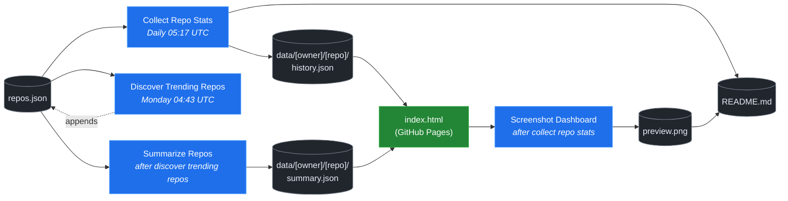

# 🚀 Rising Repos Tracker

> Automatically tracks daily GitHub stats (stars, forks, issues, velocity) for rising open source repos.


**[→ View Live Dashboard](https://patrick-creates.github.io/rising-repos-tracker/)**


<!-- AUTOGEN-STATS-START -->
## 📊 Current snapshot

> Auto-updated daily — last refreshed 2026-05-19

| Metric | Value |
|---|---|
| Repos tracked | **46** |
| Total stars | **3,799,218** |
| Total forks | **662,695** |
| Fastest growing | **open-design** (+1620.0/day) |

### 🔥 Top 5 by velocity

| # | Repo | Stars | Stars/day |
|---|---|---:|---:|
| 1 | [nexu-io/open-design](https://github.com/nexu-io/open-design) | 45,794 | +1620.0 |
| 2 | [NousResearch/hermes-agent](https://github.com/NousResearch/hermes-agent) | 157,077 | +1505.3 |
| 3 | [farion1231/cc-switch](https://github.com/farion1231/cc-switch) | 75,041 | +997.0 |
| 4 | [affaan-m/everything-claude-code](https://github.com/affaan-m/everything-claude-code) | 186,838 | +965.0 |
| 5 | [github/spec-kit](https://github.com/github/spec-kit) | 102,478 | +769.5 |

### 🆕 Recently added

- [ChatGPTNextWeb/NextChat](https://github.com/ChatGPTNextWeb/NextChat) — added 2026-05-18 — ✨ Light and Fast AI Assistant. Support: Web | iOS | MacOS | Android |  Linux | Windows
- [dair-ai/Prompt-Engineering-Guide](https://github.com/dair-ai/Prompt-Engineering-Guide) — added 2026-05-18 — 🐙 Guides, papers, lessons, notebooks and resources for prompt engineering, context engineering, RAG, and AI Agents.
- [farion1231/cc-switch](https://github.com/farion1231/cc-switch) — added 2026-05-18 — A cross-platform desktop All-in-One assistant for Claude Code, Codex, OpenCode, OpenClaw, Gemini CLI & Hermes Agent. Only official website: ccswitch.io
<!-- AUTOGEN-STATS-END -->

<!-- AUTOGEN-DIAGRAM-START -->
## 🔄 How it works


<!-- AUTOGEN-DIAGRAM-END -->

<!-- AUTOGEN-WORKFLOWS-START -->
## ⚙️ Workflows

| File | Schedule | Name |
|---|---|---|
| `collect.yml` | Daily 05:17 UTC | Collect Repo Stats |
| `discover.yml` | Monday 04:43 UTC | Discover Trending Repos |
| `screenshot.yml` | After Collect Repo Stats | Screenshot Dashboard |
| `summarize.yml` | After Discover Trending Repos | Summarize Repos |

> All workflows commit results directly back to the repo. Schedules are best-effort — GitHub Actions cron can drift by a few minutes.
<!-- AUTOGEN-WORKFLOWS-END -->

<!-- AUTOGEN-REPOS-START -->
## 📋 All tracked repos

| Repo | Stars | Forks | Stars/day |
|---|---:|---:|---:|
| [openclaw/openclaw](https://github.com/openclaw/openclaw) | 373,080 | 77,399 | +268.2 |
| [affaan-m/everything-claude-code](https://github.com/affaan-m/everything-claude-code) | 186,838 | 28,932 | +965.0 |
| [Significant-Gravitas/AutoGPT](https://github.com/Significant-Gravitas/AutoGPT) | 184,416 | 46,229 | +22.5 |
| [f/prompts.chat](https://github.com/f/prompts.chat) | 162,492 | 21,156 | +53.3 |
| [NousResearch/hermes-agent](https://github.com/NousResearch/hermes-agent) | 157,077 | 25,313 | +1505.3 |
| [langgenius/dify](https://github.com/langgenius/dify) | 141,867 | 22,303 | +107.0 |
| [open-webui/open-webui](https://github.com/open-webui/open-webui) | 137,694 | 19,683 | +133.7 |
| [langchain-ai/langchain](https://github.com/langchain-ai/langchain) | 137,088 | 22,676 | +75.5 |
| [microsoft/markitdown](https://github.com/microsoft/markitdown) | 123,767 | 8,388 | +126.5 |
| [microsoft/generative-ai-for-beginners](https://github.com/microsoft/generative-ai-for-beginners) | 111,054 | 59,564 | +50.3 |
| [github/spec-kit](https://github.com/github/spec-kit) | 102,478 | 9,010 | +769.5 |
| [ChatGPTNextWeb/NextChat](https://github.com/ChatGPTNextWeb/NextChat) | 88,050 | 59,707 | +13.0 |
| [vllm-project/vllm](https://github.com/vllm-project/vllm) | 80,439 | 16,950 | +92.5 |
| [nextlevelbuilder/ui-ux-pro-max-skill](https://github.com/nextlevelbuilder/ui-ux-pro-max-skill) | 80,308 | 8,269 | +402.5 |
| [lobehub/lobehub](https://github.com/lobehub/lobehub) | 77,309 | 15,216 | +51.8 |
| [thedotmack/claude-mem](https://github.com/thedotmack/claude-mem) | 76,672 | 6,589 | +215.3 |
| [farion1231/cc-switch](https://github.com/farion1231/cc-switch) | 75,041 | 4,867 | +997.0 |
| [dair-ai/Prompt-Engineering-Guide](https://github.com/dair-ai/Prompt-Engineering-Guide) | 74,739 | 8,092 | +38.0 |
| [OpenHands/OpenHands](https://github.com/OpenHands/OpenHands) | 74,078 | 9,393 | +146.0 |
| [openai/openai-cookbook](https://github.com/openai/openai-cookbook) | 73,635 | 12,443 | +26.0 |
| [xtekky/gpt4free](https://github.com/xtekky/gpt4free) | 66,247 | 13,587 | +6.0 |
| [unslothai/unsloth](https://github.com/unslothai/unsloth) | 64,613 | 5,707 | +113.0 |
| [JuliusBrussee/caveman](https://github.com/JuliusBrussee/caveman) | 62,002 | 3,460 | +490.0 |
| [shareAI-lab/learn-claude-code](https://github.com/shareAI-lab/learn-claude-code) | 61,265 | 10,022 | +188.0 |
| [ComposioHQ/awesome-claude-skills](https://github.com/ComposioHQ/awesome-claude-skills) | 60,578 | 6,589 | +190.0 |
| [code-yeongyu/oh-my-openagent](https://github.com/code-yeongyu/oh-my-openagent) | 58,493 | 4,748 | +165.0 |
| [koala73/worldmonitor](https://github.com/koala73/worldmonitor) | 54,429 | 8,760 | +61.0 |
| [shanraisshan/claude-code-best-practice](https://github.com/shanraisshan/claude-code-best-practice) | 53,743 | 5,378 | +245.0 |
| [FlowiseAI/Flowise](https://github.com/FlowiseAI/Flowise) | 52,929 | 24,361 | +29.0 |
| [MemPalace/mempalace](https://github.com/MemPalace/mempalace) | 52,462 | 6,928 | +62.0 |
| [datawhalechina/hello-agents](https://github.com/datawhalechina/hello-agents) | 51,106 | 6,176 | +446.0 |
| [rtk-ai/rtk](https://github.com/rtk-ai/rtk) | 50,237 | 3,073 | +659.0 |
| [ggml-org/whisper.cpp](https://github.com/ggml-org/whisper.cpp) | 49,869 | 5,551 | +43.0 |
| [Fission-AI/OpenSpec](https://github.com/Fission-AI/OpenSpec) | 49,055 | 3,446 | +267.0 |
| [tw93/Pake](https://github.com/tw93/Pake) | 48,814 | 9,856 | +35.0 |
| [BerriAI/litellm](https://github.com/BerriAI/litellm) | 47,520 | 8,165 | +132.0 |
| [nexu-io/open-design](https://github.com/nexu-io/open-design) | 45,794 | 5,215 | +1620.0 |
| [santifer/career-ops](https://github.com/santifer/career-ops) | 45,789 | 9,593 | +543.0 |
| [Aider-AI/aider](https://github.com/Aider-AI/aider) | 45,003 | 4,443 | +42.0 |
| [zhayujie/CowAgent](https://github.com/zhayujie/CowAgent) | 44,591 | 10,116 | +36.0 |
| [hesreallyhim/awesome-claude-code](https://github.com/hesreallyhim/awesome-claude-code) | 44,206 | 3,790 | +111.0 |
| [HKUDS/nanobot](https://github.com/HKUDS/nanobot) | 42,754 | 7,528 | +74.0 |
| [asgeirtj/system_prompts_leaks](https://github.com/asgeirtj/system_prompts_leaks) | 40,430 | 6,720 | +45.0 |
| [chatboxai/chatbox](https://github.com/chatboxai/chatbox) | 40,006 | 4,061 | +10.0 |
| [ChromeDevTools/chrome-devtools-mcp](https://github.com/ChromeDevTools/chrome-devtools-mcp) | 39,997 | 2,546 | +113.0 |
| [frankbria/ralph-claude-code](https://github.com/frankbria/ralph-claude-code) | 9,164 | 697 | +8.7 |
<!-- AUTOGEN-REPOS-END -->

---

## What it does

- Collects daily snapshots of stars, forks, watchers and open issues for every tracked repo
- Discovers new trending repos automatically every Monday using the GitHub Search API
- Generates AI summaries (use cases, similar tools, tags) for each tracked repo via GitHub Models
- Stores all history as plain JSON — no database, no backend
- Renders a live dashboard via GitHub Pages — updates daily, zero maintenance

## Tracked repos

Data lives in [`data/`](./data) — one folder per repo, one `history.json` per entry.  
The full watch list is in [`repos.json`](./repos.json).

## Fork & use it for yourself

This is my personal tracker — the watch list reflects what I find interesting. If you want to track different repos, the best path is to **fork this repo and run your own**.

### Setup

1. Fork this repo to your account
2. Replace the contents of [`repos.json`](./repos.json) with the repos you want to track (or just leave one entry — `discover.yml` will auto-add more every Monday)
3. Go to **Settings → Pages** and enable GitHub Pages from the `main` branch
4. Go to **Actions** and run **Collect Repo Stats** once manually to seed your first data point
5. Your dashboard will be live at `https://YOUR-USERNAME.github.io/rising-repos-tracker/`

That's it — daily collection and weekly discovery run automatically on schedule. Zero ongoing maintenance.

### Customizing what gets discovered

Edit [`scripts/discover.js`](./scripts/discover.js) to change:

- `MIN_STARS` — minimum star threshold for candidates
- `MAX_AGE_DAYS` — how recent a repo must be
- `MAX_NEW_REPOS` — how many to add per discovery run
- The `queries` array — GitHub Search API queries that define what "trending" means to you

### Adding a repo manually

Just edit `repos.json` directly:

```json
{
  "owner": "OWNER",
  "repo": "REPO",
  "added": "YYYY-MM-DD",
  "notes": "why you're tracking this"
}
```

The next daily collect run picks it up automatically.

## Stack

- **GitHub Actions** — scheduling and automation
- **GitHub Pages** — dashboard hosting
- **GitHub API** — data source
- **GitHub Models** — free AI summaries (gpt-4o-mini)
- **Chart.js** — star growth visualization
- **Mermaid** — architecture diagram (rendered by GitHub)
- No dependencies, no build step, no database

## License

MIT
