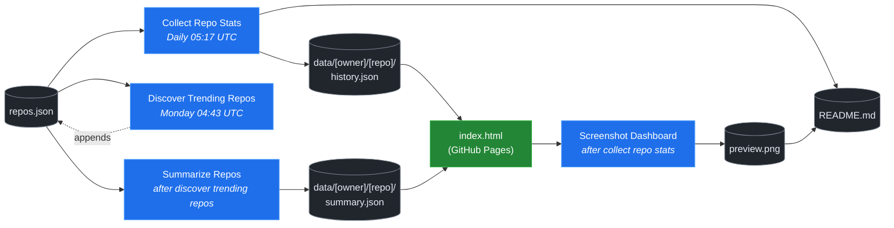

# 🚀 Rising Repos Tracker

> Automatically tracks daily GitHub stats (stars, forks, issues, velocity) for rising open source repos.

[](https://www.telosignal.com/)


**[→ View Live Dashboard](https://patrick-creates.github.io/rising-repos-tracker/)**

Built and maintained by [Telosignal](https://www.telosignal.com/).


<!-- AUTOGEN-STATS-START -->
## 📊 Current snapshot

> Auto-updated daily — last refreshed 2026-06-04

| Metric | Value |
|---|---|
| Repos tracked | **76** |
| Total stars | **5,172,878** |
| Total forks | **875,378** |
| Fastest growing | **hermes-agent** (+1447.4/day) |

### 🔥 Top 5 by velocity

| # | Repo | Stars | Stars/day |
|---|---|---:|---:|
| 1 | [NousResearch/hermes-agent](https://github.com/NousResearch/hermes-agent) | 179,887 | +1447.4 |
| 2 | [affaan-m/ECC](https://github.com/affaan-m/ECC) | 206,336 | +1410.7 |
| 3 | [affaan-m/everything-claude-code](https://github.com/affaan-m/everything-claude-code) | 206,336 | +1149.5 |
| 4 | [farion1231/cc-switch](https://github.com/farion1231/cc-switch) | 91,187 | +1008.4 |
| 5 | [microsoft/markitdown](https://github.com/microsoft/markitdown) | 143,443 | +928.9 |

### 🆕 Recently added

- [kepano/obsidian-skills](https://github.com/kepano/obsidian-skills) — added 2026-06-01 — Agent skills for Obsidian. Teach your agent to use Markdown, Bases, JSON Canvas, and use the CLI.
- [AstrBotDevs/AstrBot](https://github.com/AstrBotDevs/AstrBot) — added 2026-06-01 — AI Agent Assistant & development framework that integrates lots of IM platforms, LLMs, plugins and AI feature, and can be your openclaw alternative. ✨
- [zeroclaw-labs/zeroclaw](https://github.com/zeroclaw-labs/zeroclaw) — added 2026-06-01 — Fast, small, and fully autonomous AI personal assistant infrastructure, any OS, any platform — deploy anywhere, swap anything 🦀
<!-- AUTOGEN-STATS-END -->

<!-- AUTOGEN-DIAGRAM-START -->
## 🔄 How it works


<!-- AUTOGEN-DIAGRAM-END -->

<!-- AUTOGEN-WORKFLOWS-START -->
## ⚙️ Workflows

| File | Schedule | Name |
|---|---|---|
| `collect.yml` | Daily 05:17 UTC | Collect Repo Stats |
| `discover.yml` | Monday 04:43 UTC | Discover Trending Repos |
| `screenshot.yml` | After Collect Repo Stats | Screenshot Dashboard |
| `summarize.yml` | After Discover Trending Repos | Summarize Repos |

> All workflows commit results directly back to the repo. Schedules are best-effort — GitHub Actions cron can drift by a few minutes.
<!-- AUTOGEN-WORKFLOWS-END -->

<!-- AUTOGEN-REPOS-START -->
## 📋 All tracked repos

| Repo | Stars | Forks | Stars/day |
|---|---:|---:|---:|
| [openclaw/openclaw](https://github.com/openclaw/openclaw) | 376,709 | 78,719 | +238.1 |
| [affaan-m/everything-claude-code](https://github.com/affaan-m/everything-claude-code) | 206,336 | 31,683 | +1149.5 |
| [affaan-m/ECC](https://github.com/affaan-m/ECC) | 206,336 | 31,683 | +1410.7 |
| [Significant-Gravitas/AutoGPT](https://github.com/Significant-Gravitas/AutoGPT) | 184,743 | 46,185 | +21.0 |
| [NousResearch/hermes-agent](https://github.com/NousResearch/hermes-agent) | 179,887 | 30,827 | +1447.4 |
| [f/prompts.chat](https://github.com/f/prompts.chat) | 163,286 | 21,221 | +50.6 |
| [langgenius/dify](https://github.com/langgenius/dify) | 143,801 | 22,628 | +117.1 |
| [microsoft/markitdown](https://github.com/microsoft/markitdown) | 143,443 | 9,803 | +928.9 |
| [open-webui/open-webui](https://github.com/open-webui/open-webui) | 139,949 | 20,098 | +139.0 |
| [langchain-ai/langchain](https://github.com/langchain-ai/langchain) | 138,474 | 22,942 | +83.6 |
| [microsoft/generative-ai-for-beginners](https://github.com/microsoft/generative-ai-for-beginners) | 111,649 | 59,941 | +40.8 |
| [github/spec-kit](https://github.com/github/spec-kit) | 108,204 | 9,576 | +470.1 |
| [farion1231/cc-switch](https://github.com/farion1231/cc-switch) | 91,187 | 5,945 | +1008.4 |
| [ChatGPTNextWeb/NextChat](https://github.com/ChatGPTNextWeb/NextChat) | 88,171 | 59,653 | +7.9 |
| [nextlevelbuilder/ui-ux-pro-max-skill](https://github.com/nextlevelbuilder/ui-ux-pro-max-skill) | 87,156 | 9,007 | +421.0 |
| [vllm-project/vllm](https://github.com/vllm-project/vllm) | 81,907 | 17,636 | +92.0 |
| [thedotmack/claude-mem](https://github.com/thedotmack/claude-mem) | 80,573 | 6,936 | +236.0 |
| [lobehub/lobehub](https://github.com/lobehub/lobehub) | 78,169 | 15,368 | +53.2 |
| [OpenHands/OpenHands](https://github.com/OpenHands/OpenHands) | 75,800 | 9,614 | +109.9 |
| [dair-ai/Prompt-Engineering-Guide](https://github.com/dair-ai/Prompt-Engineering-Guide) | 75,278 | 8,173 | +33.9 |
| [openai/openai-cookbook](https://github.com/openai/openai-cookbook) | 73,960 | 12,513 | +20.6 |
| [ruvnet/RuView](https://github.com/ruvnet/RuView) | 70,617 | 9,443 | +472.4 |
| [JuliusBrussee/caveman](https://github.com/JuliusBrussee/caveman) | 68,550 | 3,856 | +414.0 |
| [xtekky/gpt4free](https://github.com/xtekky/gpt4free) | 66,283 | 13,579 | +2.5 |
| [unslothai/unsloth](https://github.com/unslothai/unsloth) | 65,703 | 5,876 | +70.8 |
| [shareAI-lab/learn-claude-code](https://github.com/shareAI-lab/learn-claude-code) | 64,624 | 10,549 | +208.6 |
| [ComposioHQ/awesome-claude-skills](https://github.com/ComposioHQ/awesome-claude-skills) | 63,175 | 6,948 | +163.9 |
| [code-yeongyu/oh-my-openagent](https://github.com/code-yeongyu/oh-my-openagent) | 60,961 | 4,940 | +154.9 |
| [rtk-ai/rtk](https://github.com/rtk-ai/rtk) | 58,639 | 3,602 | +533.0 |
| [nexu-io/open-design](https://github.com/nexu-io/open-design) | 58,414 | 6,593 | +837.6 |
| [shanraisshan/claude-code-best-practice](https://github.com/shanraisshan/claude-code-best-practice) | 56,337 | 5,661 | +167.0 |
| [datawhalechina/hello-agents](https://github.com/datawhalechina/hello-agents) | 56,273 | 6,872 | +330.2 |
| [koala73/worldmonitor](https://github.com/koala73/worldmonitor) | 55,690 | 8,943 | +77.8 |
| [MemPalace/mempalace](https://github.com/MemPalace/mempalace) | 53,395 | 7,052 | +58.5 |
| [FlowiseAI/Flowise](https://github.com/FlowiseAI/Flowise) | 53,328 | 24,477 | +25.2 |
| [Fission-AI/OpenSpec](https://github.com/Fission-AI/OpenSpec) | 52,761 | 3,693 | +233.7 |
| [ggml-org/whisper.cpp](https://github.com/ggml-org/whisper.cpp) | 50,435 | 5,614 | +35.8 |
| [tw93/Pake](https://github.com/tw93/Pake) | 49,801 | 10,108 | +60.1 |
| [BerriAI/litellm](https://github.com/BerriAI/litellm) | 49,243 | 8,588 | +109.1 |
| [santifer/career-ops](https://github.com/santifer/career-ops) | 48,592 | 10,091 | +196.8 |
| [Aider-AI/aider](https://github.com/Aider-AI/aider) | 45,749 | 4,540 | +46.4 |
| [hesreallyhim/awesome-claude-code](https://github.com/hesreallyhim/awesome-claude-code) | 45,640 | 3,971 | +90.9 |
| [zhayujie/CowAgent](https://github.com/zhayujie/CowAgent) | 45,051 | 10,168 | +29.2 |
| [HKUDS/nanobot](https://github.com/HKUDS/nanobot) | 43,627 | 7,726 | +55.7 |
| [ChromeDevTools/chrome-devtools-mcp](https://github.com/ChromeDevTools/chrome-devtools-mcp) | 42,786 | 2,743 | +170.7 |
| [asgeirtj/system_prompts_leaks](https://github.com/asgeirtj/system_prompts_leaks) | 41,224 | 6,834 | +49.4 |
| [ZhuLinsen/daily_stock_analysis](https://github.com/ZhuLinsen/daily_stock_analysis) | 40,545 | 38,828 | +170.6 |
| [chatboxai/chatbox](https://github.com/chatboxai/chatbox) | 40,290 | 4,086 | +17.3 |
| [sickn33/antigravity-awesome-skills](https://github.com/sickn33/antigravity-awesome-skills) | 39,671 | 6,433 | +99.3 |
| [chatanywhere/GPT_API_free](https://github.com/chatanywhere/GPT_API_free) | 38,326 | 2,657 | +17.0 |
| [danny-avila/LibreChat](https://github.com/danny-avila/LibreChat) | 38,084 | 7,830 | +61.5 |
| [Hmbown/CodeWhale](https://github.com/Hmbown/CodeWhale) | 36,981 | 3,178 | +231.1 |
| [QuantumNous/new-api](https://github.com/QuantumNous/new-api) | 36,958 | 8,399 | +160.1 |
| [google/langextract](https://github.com/google/langextract) | 36,799 | 2,533 | +24.4 |
| [wshobson/agents](https://github.com/wshobson/agents) | 36,332 | 3,942 | +39.6 |
| [router-for-me/CLIProxyAPI](https://github.com/router-for-me/CLIProxyAPI) | 36,006 | 5,982 | +126.2 |
| [Yeachan-Heo/oh-my-claudecode](https://github.com/Yeachan-Heo/oh-my-claudecode) | 35,740 | 3,259 | +91.6 |
| [songquanpeng/one-api](https://github.com/songquanpeng/one-api) | 34,594 | 6,592 | +38.4 |
| [PDFMathTranslate/PDFMathTranslate](https://github.com/PDFMathTranslate/PDFMathTranslate) | 34,465 | 3,078 | +45.1 |
| [github/awesome-copilot](https://github.com/github/awesome-copilot) | 34,428 | 4,214 | +62.2 |
| [kepano/obsidian-skills](https://github.com/kepano/obsidian-skills) | 34,205 | 2,416 | +107.0 |
| [AstrBotDevs/AstrBot](https://github.com/AstrBotDevs/AstrBot) | 33,783 | 2,315 | +64.7 |
| [Leonxlnx/taste-skill](https://github.com/Leonxlnx/taste-skill) | 32,805 | 2,421 | +797.3 |
| [coreyhaines31/marketingskills](https://github.com/coreyhaines31/marketingskills) | 31,856 | 5,246 | +139.3 |
| [zeroclaw-labs/zeroclaw](https://github.com/zeroclaw-labs/zeroclaw) | 31,733 | 4,686 | +19.0 |
| [anthropics/claude-plugins-official](https://github.com/anthropics/claude-plugins-official) | 29,304 | 3,139 | +97.7 |
| [jamiepine/voicebox](https://github.com/jamiepine/voicebox) | 29,268 | 3,591 | +82.0 |
| [voideditor/void](https://github.com/voideditor/void) | 28,815 | 2,514 | +3.3 |
| [Gitlawb/openclaude](https://github.com/Gitlawb/openclaude) | 28,306 | 8,676 | +57.0 |
| [rohitg00/ai-engineering-from-scratch](https://github.com/rohitg00/ai-engineering-from-scratch) | 28,091 | 4,590 | +576.0 |
| [iOfficeAI/AionUi](https://github.com/iOfficeAI/AionUi) | 27,551 | 2,657 | +67.7 |
| [AlexsJones/llmfit](https://github.com/AlexsJones/llmfit) | 27,357 | 1,671 | +118.7 |
| [googleworkspace/cli](https://github.com/googleworkspace/cli) | 26,831 | 1,413 | +37.7 |
| [BloopAI/vibe-kanban](https://github.com/BloopAI/vibe-kanban) | 26,781 | 2,820 | +23.7 |
| [usestrix/strix](https://github.com/usestrix/strix) | 25,807 | 2,890 | +32.3 |
| [frankbria/ralph-claude-code](https://github.com/frankbria/ralph-claude-code) | 9,250 | 704 | +6.3 |
<!-- AUTOGEN-REPOS-END -->

---

## What it does

- Collects daily snapshots of stars, forks, watchers and open issues for every tracked repo
- Discovers new trending repos automatically every Monday using the GitHub Search API
- Generates AI summaries (use cases, similar tools, tags) for each tracked repo via GitHub Models
- Stores all history as plain JSON — no database, no backend
- Renders a live dashboard via GitHub Pages — updates daily, zero maintenance

## Tracked repos

Data lives in [`data/`](./data) — one folder per repo, one `history.json` per entry.  
The full watch list is in [`repos.json`](./repos.json).

## Fork & use it for yourself

This is my personal tracker — the watch list reflects what I find interesting. If you want to track different repos, the best path is to **fork this repo and run your own**.

### Setup

1. Fork this repo to your account
2. Replace the contents of [`repos.json`](./repos.json) with the repos you want to track (or just leave one entry — `discover.yml` will auto-add more every Monday)
3. Go to **Settings → Pages** and enable GitHub Pages from the `main` branch
4. Go to **Actions** and run **Collect Repo Stats** once manually to seed your first data point
5. Your dashboard will be live at `https://YOUR-USERNAME.github.io/rising-repos-tracker/`

That's it — daily collection and weekly discovery run automatically on schedule. Zero ongoing maintenance.

### Customizing what gets discovered

Edit [`scripts/discover.js`](./scripts/discover.js) to change:

- `MIN_STARS` — minimum star threshold for candidates
- `MAX_AGE_DAYS` — how recent a repo must be
- `MAX_NEW_REPOS` — how many to add per discovery run
- The `queries` array — GitHub Search API queries that define what "trending" means to you

### Adding a repo manually

Just edit `repos.json` directly:

```json
{
  "owner": "OWNER",
  "repo": "REPO",
  "added": "YYYY-MM-DD",
  "notes": "why you're tracking this"
}
```

The next daily collect run picks it up automatically.

## Stack

- **GitHub Actions** — scheduling and automation
- **GitHub Pages** — dashboard hosting
- **GitHub API** — data source
- **GitHub Models** — free AI summaries (gpt-4o-mini)
- **Chart.js** — star growth visualization
- **Mermaid** — architecture diagram (rendered by GitHub)
- No dependencies, no build step, no database

## License

MIT
