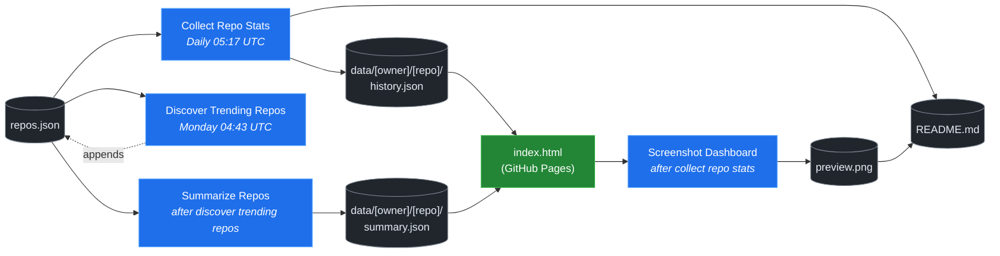

# 🚀 Rising Repos Tracker

> Automatically tracks daily GitHub stats (stars, forks, issues, velocity) for rising open source repos.

[](https://www.telosignal.com/)


**[→ View Live Dashboard](https://patrick-creates.github.io/rising-repos-tracker/)**

Built and maintained by [Telosignal](https://www.telosignal.com/).


<!-- AUTOGEN-STATS-START -->
## 📊 Current snapshot

> Auto-updated daily — last refreshed 2026-06-22

| Metric | Value |
|---|---|
| Repos tracked | **121** |
| Total stars | **6,669,270** |
| Total forks | **1,037,760** |
| Fastest growing | **ponytail** (+4796.7/day) |

### 🔥 Top 5 by velocity

| # | Repo | Stars | Stars/day |
|---|---|---:|---:|
| 1 | [DietrichGebert/ponytail](https://github.com/DietrichGebert/ponytail) | 48,019 | +4796.7 |
| 2 | [chopratejas/headroom](https://github.com/chopratejas/headroom) | 45,903 | +2534.3 |
| 3 | [NousResearch/hermes-agent](https://github.com/NousResearch/hermes-agent) | 199,493 | +1286.2 |
| 4 | [Panniantong/Agent-Reach](https://github.com/Panniantong/Agent-Reach) | 37,427 | +996.4 |
| 5 | [affaan-m/ECC](https://github.com/affaan-m/ECC) | 219,611 | +977.9 |

### 🆕 Recently added

- [obra/superpowers](https://github.com/obra/superpowers) — added 2026-06-22 — An agentic skills framework & software development methodology that works.
- [DietrichGebert/ponytail](https://github.com/DietrichGebert/ponytail) — added 2026-06-22 — Makes your AI agent think like the laziest senior dev in the room. The best code is the code you never wrote.
- [headroomlabs-ai/headroom](https://github.com/headroomlabs-ai/headroom) — added 2026-06-22 — Compress tool outputs, logs, files, and RAG chunks before they reach the LLM. 60-95% fewer tokens, same answers. Library, proxy, MCP server.
<!-- AUTOGEN-STATS-END -->

<!-- AUTOGEN-DIAGRAM-START -->
## 🔄 How it works


<!-- AUTOGEN-DIAGRAM-END -->

<!-- AUTOGEN-WORKFLOWS-START -->
## ⚙️ Workflows

| File | Schedule | Name |
|---|---|---|
| `collect.yml` | Daily 05:17 UTC | Collect Repo Stats |
| `discover.yml` | Monday 04:43 UTC | Discover Trending Repos |
| `screenshot.yml` | After Collect Repo Stats | Screenshot Dashboard |
| `summarize.yml` | After Discover Trending Repos | Summarize Repos |

> All workflows commit results directly back to the repo. Schedules are best-effort — GitHub Actions cron can drift by a few minutes.
<!-- AUTOGEN-WORKFLOWS-END -->

<!-- AUTOGEN-REPOS-START -->
## 📋 All tracked repos

| Repo | Stars | Forks | Stars/day |
|---|---:|---:|---:|
| [openclaw/openclaw](https://github.com/openclaw/openclaw) | 379,901 | 79,532 | +210.8 |
| [obra/superpowers](https://github.com/obra/superpowers) | 235,577 | 20,906 | +923.8 |
| [affaan-m/everything-claude-code](https://github.com/affaan-m/everything-claude-code) | 219,611 | 33,655 | +964.1 |
| [affaan-m/ECC](https://github.com/affaan-m/ECC) | 219,611 | 33,655 | +977.9 |
| [NousResearch/hermes-agent](https://github.com/NousResearch/hermes-agent) | 199,493 | 35,428 | +1286.2 |
| [Significant-Gravitas/AutoGPT](https://github.com/Significant-Gravitas/AutoGPT) | 185,070 | 46,115 | +19.7 |
| [f/prompts.chat](https://github.com/f/prompts.chat) | 164,074 | 21,256 | +47.5 |
| [microsoft/markitdown](https://github.com/microsoft/markitdown) | 157,480 | 10,990 | +861.8 |
| [langgenius/dify](https://github.com/langgenius/dify) | 146,132 | 22,982 | +122.7 |
| [open-webui/open-webui](https://github.com/open-webui/open-webui) | 142,594 | 20,500 | +142.6 |
| [langchain-ai/langchain](https://github.com/langchain-ai/langchain) | 139,864 | 23,197 | +80.7 |
| [github/spec-kit](https://github.com/github/spec-kit) | 114,714 | 10,124 | +421.3 |
| [microsoft/generative-ai-for-beginners](https://github.com/microsoft/generative-ai-for-beginners) | 112,199 | 60,261 | +36.2 |
| [farion1231/cc-switch](https://github.com/farion1231/cc-switch) | 106,152 | 7,028 | +917.4 |
| [nextlevelbuilder/ui-ux-pro-max-skill](https://github.com/nextlevelbuilder/ui-ux-pro-max-skill) | 94,930 | 9,955 | +425.9 |
| [ChatGPTNextWeb/NextChat](https://github.com/ChatGPTNextWeb/NextChat) | 88,279 | 59,539 | +6.9 |
| [thedotmack/claude-mem](https://github.com/thedotmack/claude-mem) | 83,676 | 7,232 | +207.4 |
| [vllm-project/vllm](https://github.com/vllm-project/vllm) | 83,542 | 18,309 | +91.5 |
| [lobehub/lobehub](https://github.com/lobehub/lobehub) | 78,954 | 15,471 | +48.9 |
| [OpenHands/OpenHands](https://github.com/OpenHands/OpenHands) | 77,985 | 9,912 | +115.8 |
| [dair-ai/Prompt-Engineering-Guide](https://github.com/dair-ai/Prompt-Engineering-Guide) | 75,844 | 8,295 | +32.7 |
| [JuliusBrussee/caveman](https://github.com/JuliusBrussee/caveman) | 75,649 | 4,276 | +403.9 |
| [ruvnet/RuView](https://github.com/ruvnet/RuView) | 75,047 | 10,023 | +326.9 |
| [openai/openai-cookbook](https://github.com/openai/openai-cookbook) | 74,308 | 12,578 | +20.0 |
| [nexu-io/open-design](https://github.com/nexu-io/open-design) | 68,896 | 7,758 | +706.3 |
| [shareAI-lab/learn-claude-code](https://github.com/shareAI-lab/learn-claude-code) | 67,794 | 11,030 | +191.9 |
| [unslothai/unsloth](https://github.com/unslothai/unsloth) | 67,080 | 6,021 | +73.7 |
| [xtekky/gpt4free](https://github.com/xtekky/gpt4free) | 66,409 | 13,574 | +4.8 |
| [ComposioHQ/awesome-claude-skills](https://github.com/ComposioHQ/awesome-claude-skills) | 65,499 | 7,274 | +146.0 |
| [rtk-ai/rtk](https://github.com/rtk-ai/rtk) | 64,805 | 3,999 | +435.1 |
| [code-yeongyu/oh-my-openagent](https://github.com/code-yeongyu/oh-my-openagent) | 63,208 | 5,111 | +139.4 |
| [datawhalechina/hello-agents](https://github.com/datawhalechina/hello-agents) | 60,898 | 7,506 | +292.5 |
| [shanraisshan/claude-code-best-practice](https://github.com/shanraisshan/claude-code-best-practice) | 58,681 | 5,912 | +148.1 |
| [koala73/worldmonitor](https://github.com/koala73/worldmonitor) | 58,460 | 9,236 | +116.9 |
| [tw93/Pake](https://github.com/tw93/Pake) | 56,570 | 11,181 | +222.6 |
| [MemPalace/mempalace](https://github.com/MemPalace/mempalace) | 56,139 | 7,269 | +106.8 |
| [Fission-AI/OpenSpec](https://github.com/Fission-AI/OpenSpec) | 55,969 | 3,919 | +205.2 |
| [santifer/career-ops](https://github.com/santifer/career-ops) | 55,137 | 10,913 | +282.6 |
| [FlowiseAI/Flowise](https://github.com/FlowiseAI/Flowise) | 53,893 | 24,575 | +28.4 |
| [BerriAI/litellm](https://github.com/BerriAI/litellm) | 51,110 | 9,059 | +106.3 |
| [ggml-org/whisper.cpp](https://github.com/ggml-org/whisper.cpp) | 50,936 | 5,687 | +31.7 |
| [Leonxlnx/taste-skill](https://github.com/Leonxlnx/taste-skill) | 48,775 | 3,392 | +874.4 |
| [DietrichGebert/ponytail](https://github.com/DietrichGebert/ponytail) | 48,019 | 2,356 | +4796.7 |
| [hesreallyhim/awesome-claude-code](https://github.com/hesreallyhim/awesome-claude-code) | 47,020 | 4,109 | +83.6 |
| [Aider-AI/aider](https://github.com/Aider-AI/aider) | 46,560 | 4,638 | +45.7 |
| [chopratejas/headroom](https://github.com/chopratejas/headroom) | 45,903 | 3,189 | +2534.3 |
| [headroomlabs-ai/headroom](https://github.com/headroomlabs-ai/headroom) | 45,903 | 3,189 | +277.9 |
| [mvanhorn/last30days-skill](https://github.com/mvanhorn/last30days-skill) | 45,585 | 3,783 | +922.4 |
| [zhayujie/CowAgent](https://github.com/zhayujie/CowAgent) | 45,547 | 10,226 | +28.3 |
| [ZhuLinsen/daily_stock_analysis](https://github.com/ZhuLinsen/daily_stock_analysis) | 45,364 | 41,762 | +233.0 |
| [asgeirtj/system_prompts_leaks](https://github.com/asgeirtj/system_prompts_leaks) | 44,846 | 7,392 | +127.5 |
| [HKUDS/nanobot](https://github.com/HKUDS/nanobot) | 44,550 | 7,868 | +53.4 |
| [ChromeDevTools/chrome-devtools-mcp](https://github.com/ChromeDevTools/chrome-devtools-mcp) | 44,176 | 2,854 | +122.6 |
| [elder-plinius/CL4R1T4S](https://github.com/elder-plinius/CL4R1T4S) | 43,319 | 8,754 | +632.6 |
| [sickn33/antigravity-awesome-skills](https://github.com/sickn33/antigravity-awesome-skills) | 41,365 | 6,647 | +96.0 |
| [chatboxai/chatbox](https://github.com/chatboxai/chatbox) | 40,593 | 4,119 | +17.1 |
| [QuantumNous/new-api](https://github.com/QuantumNous/new-api) | 39,629 | 9,039 | +152.6 |
| [danny-avila/LibreChat](https://github.com/danny-avila/LibreChat) | 39,619 | 8,124 | +76.8 |
| [Hmbown/CodeWhale](https://github.com/Hmbown/CodeWhale) | 38,829 | 3,346 | +148.5 |
| [chatanywhere/GPT_API_free](https://github.com/chatanywhere/GPT_API_free) | 38,534 | 2,654 | +13.5 |
| [router-for-me/CLIProxyAPI](https://github.com/router-for-me/CLIProxyAPI) | 38,069 | 6,296 | +118.8 |
| [Panniantong/Agent-Reach](https://github.com/Panniantong/Agent-Reach) | 37,427 | 2,977 | +996.4 |
| [wshobson/agents](https://github.com/wshobson/agents) | 37,032 | 4,000 | +39.1 |
| [google/langextract](https://github.com/google/langextract) | 36,933 | 2,550 | +13.5 |
| [Yeachan-Heo/oh-my-claudecode](https://github.com/Yeachan-Heo/oh-my-claudecode) | 36,764 | 3,327 | +69.3 |
| [kepano/obsidian-skills](https://github.com/kepano/obsidian-skills) | 36,423 | 2,588 | +120.9 |
| [rohitg00/ai-engineering-from-scratch](https://github.com/rohitg00/ai-engineering-from-scratch) | 35,519 | 5,793 | +436.0 |
| [github/awesome-copilot](https://github.com/github/awesome-copilot) | 35,497 | 4,384 | +60.4 |
| [langchain-ai/langgraph](https://github.com/langchain-ai/langgraph) | 35,420 | 5,943 | +33.8 |
| [songquanpeng/one-api](https://github.com/songquanpeng/one-api) | 35,149 | 6,660 | +33.5 |
| [AstrBotDevs/AstrBot](https://github.com/AstrBotDevs/AstrBot) | 35,101 | 2,422 | +72.0 |
| [PDFMathTranslate/PDFMathTranslate](https://github.com/PDFMathTranslate/PDFMathTranslate) | 35,031 | 3,125 | +36.3 |
| [coreyhaines31/marketingskills](https://github.com/coreyhaines31/marketingskills) | 34,524 | 5,657 | +147.0 |
| [zeroclaw-labs/zeroclaw](https://github.com/zeroclaw-labs/zeroclaw) | 31,988 | 4,752 | +14.9 |
| [jamiepine/voicebox](https://github.com/jamiepine/voicebox) | 31,760 | 3,902 | +130.4 |
| [anthropics/claude-plugins-official](https://github.com/anthropics/claude-plugins-official) | 30,604 | 3,344 | +75.9 |
| [heygen-com/hyperframes](https://github.com/heygen-com/hyperframes) | 29,604 | 2,799 | +288.8 |
| [Gitlawb/openclaude](https://github.com/Gitlawb/openclaude) | 29,255 | 8,800 | +53.3 |
| [voideditor/void](https://github.com/voideditor/void) | 28,818 | 2,551 | +0.6 |
| [iOfficeAI/AionUi](https://github.com/iOfficeAI/AionUi) | 28,625 | 2,824 | +60.8 |
| [AlexsJones/llmfit](https://github.com/AlexsJones/llmfit) | 28,478 | 1,746 | +70.3 |
| [googleworkspace/cli](https://github.com/googleworkspace/cli) | 27,201 | 1,430 | +23.0 |
| [BloopAI/vibe-kanban](https://github.com/BloopAI/vibe-kanban) | 27,092 | 2,863 | +18.2 |
| [usestrix/strix](https://github.com/usestrix/strix) | 26,092 | 2,932 | +18.2 |
| [volcengine/OpenViking](https://github.com/volcengine/OpenViking) | 25,898 | 2,005 | +40.7 |
| [zai-org/Open-AutoGLM](https://github.com/zai-org/Open-AutoGLM) | 25,579 | 3,988 | +8.4 |
| [jarrodwatts/claude-hud](https://github.com/jarrodwatts/claude-hud) | 25,562 | 1,167 | +62.3 |
| [p-e-w/heretic](https://github.com/p-e-w/heretic) | 25,345 | 2,727 | +98.1 |
| [jackwener/OpenCLI](https://github.com/jackwener/OpenCLI) | 24,974 | 2,488 | +83.9 |
| [langchain-ai/deepagents](https://github.com/langchain-ai/deepagents) | 24,953 | 3,516 | +57.0 |
| [toon-format/toon](https://github.com/toon-format/toon) | 24,635 | 1,093 | +9.9 |
| [esengine/DeepSeek-Reasonix](https://github.com/esengine/DeepSeek-Reasonix) | 23,734 | 1,441 | +300.6 |
| [rohitg00/agentmemory](https://github.com/rohitg00/agentmemory) | 23,661 | 1,946 | +131.1 |
| [winfunc/opcode](https://github.com/winfunc/opcode) | 22,079 | 1,708 | +5.3 |
| [coze-dev/coze-studio](https://github.com/coze-dev/coze-studio) | 21,010 | 3,057 | +4.4 |
| [NirDiamant/agents-towards-production](https://github.com/NirDiamant/agents-towards-production) | 20,816 | 2,767 | +13.0 |
| [agentscope-ai/QwenPaw](https://github.com/agentscope-ai/QwenPaw) | 19,806 | 2,655 | +289.7 |
| [tirth8205/code-review-graph](https://github.com/tirth8205/code-review-graph) | 18,784 | 2,012 | +38.6 |
| [alibaba/page-agent](https://github.com/alibaba/page-agent) | 18,731 | 1,615 | +24.7 |
| [tanweai/pua](https://github.com/tanweai/pua) | 18,376 | 1,103 | +18.6 |
| [decolua/9router](https://github.com/decolua/9router) | 18,194 | 2,861 | +89.0 |
| [mukul975/Anthropic-Cybersecurity-Skills](https://github.com/mukul975/Anthropic-Cybersecurity-Skills) | 18,122 | 2,163 | +154.8 |
| [mksglu/context-mode](https://github.com/mksglu/context-mode) | 17,926 | 1,266 | +65.4 |
| [RightNow-AI/openfang](https://github.com/RightNow-AI/openfang) | 17,877 | 2,268 | +7.3 |
| [JCodesMore/ai-website-cloner-template](https://github.com/JCodesMore/ai-website-cloner-template) | 17,368 | 2,714 | +53.6 |
| [microsoft/agent-lightning](https://github.com/microsoft/agent-lightning) | 17,324 | 1,518 | +1.9 |
| [datawhalechina/easy-vibe](https://github.com/datawhalechina/easy-vibe) | 17,204 | 1,628 | +37.6 |
| [jundot/omlx](https://github.com/jundot/omlx) | 16,958 | 1,436 | +46.6 |
| [Tencent/WeKnora](https://github.com/Tencent/WeKnora) | 16,675 | 2,148 | +54.7 |
| [cft0808/edict](https://github.com/cft0808/edict) | 16,110 | 1,698 | +6.9 |
| [danielmiessler/LifeOS](https://github.com/danielmiessler/LifeOS) | 16,066 | 2,218 | +56.2 |
| [jnMetaCode/agency-agents-zh](https://github.com/jnMetaCode/agency-agents-zh) | 15,406 | 2,675 | +143.9 |
| [MemoriLabs/Memori](https://github.com/MemoriLabs/Memori) | 15,343 | 2,622 | +46.1 |
| [steipete/CodexBar](https://github.com/steipete/CodexBar) | 15,203 | 1,250 | +70.1 |
| [nesquena/hermes-webui](https://github.com/nesquena/hermes-webui) | 14,838 | 1,884 | +178.7 |
| [xpzouying/xiaohongshu-mcp](https://github.com/xpzouying/xiaohongshu-mcp) | 14,287 | 2,138 | +44.2 |
| [yusufkaraaslan/Skill_Seekers](https://github.com/yusufkaraaslan/Skill_Seekers) | 14,226 | 1,460 | +57.6 |
| [kyegomez/OpenMythos](https://github.com/kyegomez/OpenMythos) | 14,155 | 3,180 | +221.2 |
| [can1357/oh-my-pi](https://github.com/can1357/oh-my-pi) | 13,996 | 1,237 | +81.3 |
| [NevaMind-AI/memU](https://github.com/NevaMind-AI/memU) | 13,900 | 1,036 | +42.4 |
| [frankbria/ralph-claude-code](https://github.com/frankbria/ralph-claude-code) | 9,437 | 723 | +8.1 |
<!-- AUTOGEN-REPOS-END -->

---

## What it does

- Collects daily snapshots of stars, forks, watchers and open issues for every tracked repo
- Discovers new trending repos automatically every Monday using the GitHub Search API
- Generates AI summaries (use cases, similar tools, tags) for each tracked repo via GitHub Models
- Stores all history as plain JSON — no database, no backend
- Renders a live dashboard via GitHub Pages — updates daily, zero maintenance

## Tracked repos

Data lives in [`data/`](./data) — one folder per repo, one `history.json` per entry.  
The full watch list is in [`repos.json`](./repos.json).

## Fork & use it for yourself

This is my personal tracker — the watch list reflects what I find interesting. If you want to track different repos, the best path is to **fork this repo and run your own**.

### Setup

1. Fork this repo to your account
2. Replace the contents of [`repos.json`](./repos.json) with the repos you want to track (or just leave one entry — `discover.yml` will auto-add more every Monday)
3. Go to **Settings → Pages** and enable GitHub Pages from the `main` branch
4. Go to **Actions** and run **Collect Repo Stats** once manually to seed your first data point
5. Your dashboard will be live at `https://YOUR-USERNAME.github.io/rising-repos-tracker/`

That's it — daily collection and weekly discovery run automatically on schedule. Zero ongoing maintenance.

### Customizing what gets discovered

Edit [`scripts/discover.js`](./scripts/discover.js) to change:

- `MIN_STARS` — minimum star threshold for candidates
- `MAX_AGE_DAYS` — how recent a repo must be
- `MAX_NEW_REPOS` — how many to add per discovery run
- The `queries` array — GitHub Search API queries that define what "trending" means to you

### Adding a repo manually

Just edit `repos.json` directly:

```json
{
  "owner": "OWNER",
  "repo": "REPO",
  "added": "YYYY-MM-DD",
  "notes": "why you're tracking this"
}
```

The next daily collect run picks it up automatically.

## Stack

- **GitHub Actions** — scheduling and automation
- **GitHub Pages** — dashboard hosting
- **GitHub API** — data source
- **GitHub Models** — free AI summaries (gpt-4o-mini)
- **Chart.js** — star growth visualization
- **Mermaid** — architecture diagram (rendered by GitHub)
- No dependencies, no build step, no database

## License

MIT
