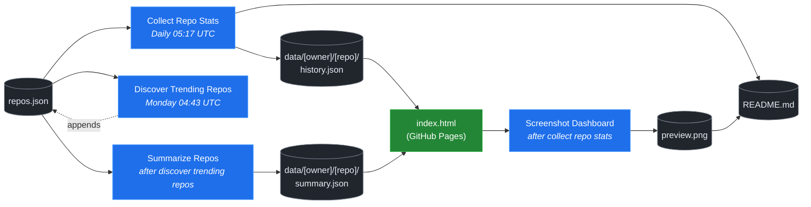

# 🚀 Rising Repos Tracker

> Automatically tracks daily GitHub stats (stars, forks, issues, velocity) for rising open source repos.

[](https://www.telosignal.com/)


**[→ View Live Dashboard](https://patrick-creates.github.io/rising-repos-tracker/)**

Built and maintained by [Telosignal](https://www.telosignal.com/).


<!-- AUTOGEN-STATS-START -->
## 📊 Current snapshot

> Auto-updated daily — last refreshed 2026-06-25

| Metric | Value |
|---|---|
| Repos tracked | **121** |
| Total stars | **6,750,495** |
| Total forks | **1,047,565** |
| Fastest growing | **ponytail** (+2775.7/day) |

### 🔥 Top 5 by velocity

| # | Repo | Stars | Stars/day |
|---|---|---:|---:|
| 1 | [DietrichGebert/ponytail](https://github.com/DietrichGebert/ponytail) | 56,346 | +2775.7 |
| 2 | [chopratejas/headroom](https://github.com/chopratejas/headroom) | 50,273 | +2211.0 |
| 3 | [headroomlabs-ai/headroom](https://github.com/headroomlabs-ai/headroom) | 50,273 | +1456.7 |
| 4 | [NousResearch/hermes-agent](https://github.com/NousResearch/hermes-agent) | 202,483 | +1266.0 |
| 5 | [Panniantong/Agent-Reach](https://github.com/Panniantong/Agent-Reach) | 40,417 | +996.5 |

### 🆕 Recently added

- [obra/superpowers](https://github.com/obra/superpowers) — added 2026-06-22 — An agentic skills framework & software development methodology that works.
- [DietrichGebert/ponytail](https://github.com/DietrichGebert/ponytail) — added 2026-06-22 — Makes your AI agent think like the laziest senior dev in the room. The best code is the code you never wrote.
- [headroomlabs-ai/headroom](https://github.com/headroomlabs-ai/headroom) — added 2026-06-22 — Compress tool outputs, logs, files, and RAG chunks before they reach the LLM. 60-95% fewer tokens, same answers. Library, proxy, MCP server.
<!-- AUTOGEN-STATS-END -->

<!-- AUTOGEN-DIAGRAM-START -->
## 🔄 How it works


<!-- AUTOGEN-DIAGRAM-END -->

<!-- AUTOGEN-WORKFLOWS-START -->
## ⚙️ Workflows

| File | Schedule | Name |
|---|---|---|
| `collect.yml` | Daily 05:17 UTC | Collect Repo Stats |
| `discover.yml` | Monday 04:43 UTC | Discover Trending Repos |
| `screenshot.yml` | After Collect Repo Stats | Screenshot Dashboard |
| `summarize.yml` | After Discover Trending Repos | Summarize Repos |

> All workflows commit results directly back to the repo. Schedules are best-effort — GitHub Actions cron can drift by a few minutes.
<!-- AUTOGEN-WORKFLOWS-END -->

<!-- AUTOGEN-REPOS-START -->
## 📋 All tracked repos

| Repo | Stars | Forks | Stars/day |
|---|---:|---:|---:|
| [openclaw/openclaw](https://github.com/openclaw/openclaw) | 380,353 | 79,670 | +206.6 |
| [obra/superpowers](https://github.com/obra/superpowers) | 238,178 | 21,128 | +867.0 |
| [affaan-m/everything-claude-code](https://github.com/affaan-m/everything-claude-code) | 221,390 | 33,896 | +938.2 |
| [affaan-m/ECC](https://github.com/affaan-m/ECC) | 221,390 | 33,896 | +940.7 |
| [NousResearch/hermes-agent](https://github.com/NousResearch/hermes-agent) | 202,483 | 36,185 | +1266.0 |
| [Significant-Gravitas/AutoGPT](https://github.com/Significant-Gravitas/AutoGPT) | 185,159 | 46,125 | +20.4 |
| [f/prompts.chat](https://github.com/f/prompts.chat) | 164,314 | 21,282 | +49.8 |
| [microsoft/markitdown](https://github.com/microsoft/markitdown) | 158,912 | 11,111 | +835.0 |
| [langgenius/dify](https://github.com/langgenius/dify) | 146,517 | 23,053 | +123.1 |
| [open-webui/open-webui](https://github.com/open-webui/open-webui) | 142,940 | 20,592 | +140.7 |
| [langchain-ai/langchain](https://github.com/langchain-ai/langchain) | 140,150 | 23,247 | +81.7 |
| [github/spec-kit](https://github.com/github/spec-kit) | 115,362 | 10,184 | +407.0 |
| [microsoft/generative-ai-for-beginners](https://github.com/microsoft/generative-ai-for-beginners) | 112,290 | 60,327 | +35.8 |
| [farion1231/cc-switch](https://github.com/farion1231/cc-switch) | 108,132 | 7,146 | +897.1 |
| [nextlevelbuilder/ui-ux-pro-max-skill](https://github.com/nextlevelbuilder/ui-ux-pro-max-skill) | 96,237 | 10,107 | +426.6 |
| [ChatGPTNextWeb/NextChat](https://github.com/ChatGPTNextWeb/NextChat) | 88,303 | 59,520 | +7.0 |
| [thedotmack/claude-mem](https://github.com/thedotmack/claude-mem) | 84,198 | 7,270 | +205.1 |
| [vllm-project/vllm](https://github.com/vllm-project/vllm) | 84,170 | 18,474 | +99.7 |
| [lobehub/lobehub](https://github.com/lobehub/lobehub) | 79,066 | 15,489 | +48.1 |
| [OpenHands/OpenHands](https://github.com/OpenHands/OpenHands) | 78,282 | 9,955 | +114.5 |
| [JuliusBrussee/caveman](https://github.com/JuliusBrussee/caveman) | 76,707 | 4,343 | +399.9 |
| [dair-ai/Prompt-Engineering-Guide](https://github.com/dair-ai/Prompt-Engineering-Guide) | 75,963 | 8,321 | +33.2 |
| [ruvnet/RuView](https://github.com/ruvnet/RuView) | 75,419 | 10,077 | +307.3 |
| [openai/openai-cookbook](https://github.com/openai/openai-cookbook) | 74,386 | 12,584 | +20.4 |
| [nexu-io/open-design](https://github.com/nexu-io/open-design) | 70,861 | 8,002 | +702.3 |
| [shareAI-lab/learn-claude-code](https://github.com/shareAI-lab/learn-claude-code) | 68,340 | 11,128 | +191.1 |
| [unslothai/unsloth](https://github.com/unslothai/unsloth) | 67,307 | 6,041 | +73.9 |
| [xtekky/gpt4free](https://github.com/xtekky/gpt4free) | 66,448 | 13,572 | +5.4 |
| [rtk-ai/rtk](https://github.com/rtk-ai/rtk) | 65,901 | 4,075 | +429.6 |
| [ComposioHQ/awesome-claude-skills](https://github.com/ComposioHQ/awesome-claude-skills) | 65,836 | 7,316 | +143.4 |
| [code-yeongyu/oh-my-openagent](https://github.com/code-yeongyu/oh-my-openagent) | 63,563 | 5,188 | +137.8 |
| [datawhalechina/hello-agents](https://github.com/datawhalechina/hello-agents) | 61,640 | 7,604 | +288.9 |
| [shanraisshan/claude-code-best-practice](https://github.com/shanraisshan/claude-code-best-practice) | 60,082 | 6,034 | +173.3 |
| [koala73/worldmonitor](https://github.com/koala73/worldmonitor) | 59,664 | 9,329 | +139.4 |
| [tw93/Pake](https://github.com/tw93/Pake) | 57,430 | 11,439 | +227.7 |
| [Fission-AI/OpenSpec](https://github.com/Fission-AI/OpenSpec) | 56,506 | 3,945 | +203.1 |
| [DietrichGebert/ponytail](https://github.com/DietrichGebert/ponytail) | 56,346 | 2,853 | +2775.7 |
| [MemPalace/mempalace](https://github.com/MemPalace/mempalace) | 56,334 | 7,287 | +103.5 |
| [santifer/career-ops](https://github.com/santifer/career-ops) | 55,606 | 10,985 | +272.6 |
| [FlowiseAI/Flowise](https://github.com/FlowiseAI/Flowise) | 54,000 | 24,590 | +28.9 |
| [BerriAI/litellm](https://github.com/BerriAI/litellm) | 51,477 | 9,166 | +107.6 |
| [ggml-org/whisper.cpp](https://github.com/ggml-org/whisper.cpp) | 51,030 | 5,697 | +31.7 |
| [Leonxlnx/taste-skill](https://github.com/Leonxlnx/taste-skill) | 50,590 | 3,493 | +840.7 |
| [chopratejas/headroom](https://github.com/chopratejas/headroom) | 50,273 | 3,525 | +2211.0 |
| [headroomlabs-ai/headroom](https://github.com/headroomlabs-ai/headroom) | 50,273 | 3,525 | +1456.7 |
| [ZhuLinsen/daily_stock_analysis](https://github.com/ZhuLinsen/daily_stock_analysis) | 49,111 | 43,237 | +331.4 |
| [hesreallyhim/awesome-claude-code](https://github.com/hesreallyhim/awesome-claude-code) | 47,250 | 4,129 | +83.0 |
| [Aider-AI/aider](https://github.com/Aider-AI/aider) | 46,670 | 4,645 | +45.0 |
| [mvanhorn/last30days-skill](https://github.com/mvanhorn/last30days-skill) | 46,537 | 3,858 | +815.6 |
| [asgeirtj/system_prompts_leaks](https://github.com/asgeirtj/system_prompts_leaks) | 45,885 | 7,529 | +144.7 |
| [zhayujie/CowAgent](https://github.com/zhayujie/CowAgent) | 45,601 | 10,229 | +27.5 |
| [HKUDS/nanobot](https://github.com/HKUDS/nanobot) | 44,712 | 7,885 | +53.5 |
| [ChromeDevTools/chrome-devtools-mcp](https://github.com/ChromeDevTools/chrome-devtools-mcp) | 44,394 | 2,869 | +118.7 |
| [elder-plinius/CL4R1T4S](https://github.com/elder-plinius/CL4R1T4S) | 43,798 | 8,898 | +490.7 |
| [sickn33/antigravity-awesome-skills](https://github.com/sickn33/antigravity-awesome-skills) | 41,650 | 6,679 | +95.9 |
| [chatboxai/chatbox](https://github.com/chatboxai/chatbox) | 40,628 | 4,119 | +16.6 |
| [Panniantong/Agent-Reach](https://github.com/Panniantong/Agent-Reach) | 40,417 | 3,197 | +996.5 |
| [QuantumNous/new-api](https://github.com/QuantumNous/new-api) | 40,036 | 9,157 | +150.9 |
| [danny-avila/LibreChat](https://github.com/danny-avila/LibreChat) | 39,764 | 8,154 | +74.0 |
| [Hmbown/CodeWhale](https://github.com/Hmbown/CodeWhale) | 38,989 | 3,356 | +139.3 |
| [chatanywhere/GPT_API_free](https://github.com/chatanywhere/GPT_API_free) | 38,566 | 2,653 | +13.2 |
| [router-for-me/CLIProxyAPI](https://github.com/router-for-me/CLIProxyAPI) | 38,336 | 6,333 | +115.9 |
| [kepano/obsidian-skills](https://github.com/kepano/obsidian-skills) | 37,955 | 2,695 | +169.6 |
| [wshobson/agents](https://github.com/wshobson/agents) | 37,161 | 4,003 | +39.5 |
| [google/langextract](https://github.com/google/langextract) | 36,952 | 2,551 | +12.8 |
| [Yeachan-Heo/oh-my-claudecode](https://github.com/Yeachan-Heo/oh-my-claudecode) | 36,938 | 3,338 | +68.2 |
| [rohitg00/ai-engineering-from-scratch](https://github.com/rohitg00/ai-engineering-from-scratch) | 36,289 | 5,949 | +413.6 |
| [langchain-ai/langgraph](https://github.com/langchain-ai/langgraph) | 35,689 | 5,980 | +89.7 |
| [github/awesome-copilot](https://github.com/github/awesome-copilot) | 35,686 | 4,407 | +60.6 |
| [AstrBotDevs/AstrBot](https://github.com/AstrBotDevs/AstrBot) | 35,310 | 2,439 | +71.7 |
| [songquanpeng/one-api](https://github.com/songquanpeng/one-api) | 35,227 | 6,669 | +32.8 |
| [PDFMathTranslate/PDFMathTranslate](https://github.com/PDFMathTranslate/PDFMathTranslate) | 35,173 | 3,142 | +37.4 |
| [coreyhaines31/marketingskills](https://github.com/coreyhaines31/marketingskills) | 34,918 | 5,709 | +145.0 |
| [jamiepine/voicebox](https://github.com/jamiepine/voicebox) | 33,996 | 4,089 | +207.3 |
| [zeroclaw-labs/zeroclaw](https://github.com/zeroclaw-labs/zeroclaw) | 32,024 | 4,760 | +14.5 |
| [heygen-com/hyperframes](https://github.com/heygen-com/hyperframes) | 31,144 | 2,900 | +328.4 |
| [anthropics/claude-plugins-official](https://github.com/anthropics/claude-plugins-official) | 31,079 | 3,382 | +86.2 |
| [Gitlawb/openclaude](https://github.com/Gitlawb/openclaude) | 29,344 | 8,813 | +50.4 |
| [iOfficeAI/AionUi](https://github.com/iOfficeAI/AionUi) | 28,833 | 2,849 | +61.9 |
| [voideditor/void](https://github.com/voideditor/void) | 28,815 | 2,554 | +0.4 |
| [AlexsJones/llmfit](https://github.com/AlexsJones/llmfit) | 28,572 | 1,752 | +65.5 |
| [googleworkspace/cli](https://github.com/googleworkspace/cli) | 28,481 | 1,569 | +73.5 |
| [BloopAI/vibe-kanban](https://github.com/BloopAI/vibe-kanban) | 27,140 | 2,866 | +17.9 |
| [usestrix/strix](https://github.com/usestrix/strix) | 26,169 | 2,947 | +19.1 |
| [volcengine/OpenViking](https://github.com/volcengine/OpenViking) | 26,031 | 2,021 | +41.4 |
| [jarrodwatts/claude-hud](https://github.com/jarrodwatts/claude-hud) | 25,738 | 1,174 | +61.6 |
| [zai-org/Open-AutoGLM](https://github.com/zai-org/Open-AutoGLM) | 25,598 | 3,988 | +8.0 |
| [p-e-w/heretic](https://github.com/p-e-w/heretic) | 25,462 | 2,742 | +87.6 |
| [jackwener/OpenCLI](https://github.com/jackwener/OpenCLI) | 25,219 | 2,506 | +83.5 |
| [langchain-ai/deepagents](https://github.com/langchain-ai/deepagents) | 25,100 | 3,543 | +55.6 |
| [toon-format/toon](https://github.com/toon-format/toon) | 24,662 | 1,094 | +9.8 |
| [esengine/DeepSeek-Reasonix](https://github.com/esengine/DeepSeek-Reasonix) | 24,525 | 1,487 | +294.1 |
| [rohitg00/agentmemory](https://github.com/rohitg00/agentmemory) | 23,972 | 1,968 | +126.3 |
| [winfunc/opcode](https://github.com/winfunc/opcode) | 22,104 | 1,714 | +5.8 |
| [coze-dev/coze-studio](https://github.com/coze-dev/coze-studio) | 21,046 | 3,061 | +5.8 |
| [NirDiamant/agents-towards-production](https://github.com/NirDiamant/agents-towards-production) | 20,847 | 2,770 | +12.5 |
| [mukul975/Anthropic-Cybersecurity-Skills](https://github.com/mukul975/Anthropic-Cybersecurity-Skills) | 20,738 | 2,406 | +872.0 |
| [agentscope-ai/QwenPaw](https://github.com/agentscope-ai/QwenPaw) | 20,073 | 2,677 | +229.5 |
| [JCodesMore/ai-website-cloner-template](https://github.com/JCodesMore/ai-website-cloner-template) | 19,735 | 2,923 | +274.2 |
| [alibaba/page-agent](https://github.com/alibaba/page-agent) | 19,561 | 1,687 | +100.3 |
| [tirth8205/code-review-graph](https://github.com/tirth8205/code-review-graph) | 18,884 | 2,023 | +37.0 |
| [decolua/9router](https://github.com/decolua/9router) | 18,424 | 2,928 | +85.3 |
| [tanweai/pua](https://github.com/tanweai/pua) | 18,421 | 1,109 | +17.5 |
| [mksglu/context-mode](https://github.com/mksglu/context-mode) | 18,133 | 1,273 | +66.5 |
| [RightNow-AI/openfang](https://github.com/RightNow-AI/openfang) | 17,909 | 2,274 | +8.3 |
| [microsoft/agent-lightning](https://github.com/microsoft/agent-lightning) | 17,342 | 1,518 | +3.1 |
| [datawhalechina/easy-vibe](https://github.com/datawhalechina/easy-vibe) | 17,307 | 1,633 | +36.6 |
| [Tencent/WeKnora](https://github.com/Tencent/WeKnora) | 17,267 | 2,251 | +97.5 |
| [jundot/omlx](https://github.com/jundot/omlx) | 17,073 | 1,450 | +44.1 |
| [danielmiessler/LifeOS](https://github.com/danielmiessler/LifeOS) | 16,122 | 2,220 | +18.7 |
| [cft0808/edict](https://github.com/cft0808/edict) | 16,120 | 1,697 | +5.8 |
| [jnMetaCode/agency-agents-zh](https://github.com/jnMetaCode/agency-agents-zh) | 15,561 | 2,707 | +51.7 |
| [MemoriLabs/Memori](https://github.com/MemoriLabs/Memori) | 15,387 | 2,653 | +14.7 |
| [steipete/CodexBar](https://github.com/steipete/CodexBar) | 15,357 | 1,265 | +51.3 |
| [nesquena/hermes-webui](https://github.com/nesquena/hermes-webui) | 14,998 | 1,914 | +53.3 |
| [can1357/oh-my-pi](https://github.com/can1357/oh-my-pi) | 14,554 | 1,274 | +186.0 |
| [xpzouying/xiaohongshu-mcp](https://github.com/xpzouying/xiaohongshu-mcp) | 14,342 | 2,145 | +18.3 |
| [yusufkaraaslan/Skill_Seekers](https://github.com/yusufkaraaslan/Skill_Seekers) | 14,262 | 1,461 | +12.0 |
| [kyegomez/OpenMythos](https://github.com/kyegomez/OpenMythos) | 14,204 | 3,187 | +16.3 |
| [NevaMind-AI/memU](https://github.com/NevaMind-AI/memU) | 13,913 | 1,034 | +4.3 |
| [frankbria/ralph-claude-code](https://github.com/frankbria/ralph-claude-code) | 9,457 | 722 | +8.0 |
<!-- AUTOGEN-REPOS-END -->

---

## What it does

- Collects daily snapshots of stars, forks, watchers and open issues for every tracked repo
- Discovers new trending repos automatically every Monday using the GitHub Search API
- Generates AI summaries (use cases, similar tools, tags) for each tracked repo via GitHub Models
- Stores all history as plain JSON — no database, no backend
- Renders a live dashboard via GitHub Pages — updates daily, zero maintenance

## Tracked repos

Data lives in [`data/`](./data) — one folder per repo, one `history.json` per entry.  
The full watch list is in [`repos.json`](./repos.json).

## Fork & use it for yourself

This is my personal tracker — the watch list reflects what I find interesting. If you want to track different repos, the best path is to **fork this repo and run your own**.

### Setup

1. Fork this repo to your account
2. Replace the contents of [`repos.json`](./repos.json) with the repos you want to track (or just leave one entry — `discover.yml` will auto-add more every Monday)
3. Go to **Settings → Pages** and enable GitHub Pages from the `main` branch
4. Go to **Actions** and run **Collect Repo Stats** once manually to seed your first data point
5. Your dashboard will be live at `https://YOUR-USERNAME.github.io/rising-repos-tracker/`

That's it — daily collection and weekly discovery run automatically on schedule. Zero ongoing maintenance.

### Customizing what gets discovered

Edit [`scripts/discover.js`](./scripts/discover.js) to change:

- `MIN_STARS` — minimum star threshold for candidates
- `MAX_AGE_DAYS` — how recent a repo must be
- `MAX_NEW_REPOS` — how many to add per discovery run
- The `queries` array — GitHub Search API queries that define what "trending" means to you

### Adding a repo manually

Just edit `repos.json` directly:

```json
{
  "owner": "OWNER",
  "repo": "REPO",
  "added": "YYYY-MM-DD",
  "notes": "why you're tracking this"
}
```

The next daily collect run picks it up automatically.

## Stack

- **GitHub Actions** — scheduling and automation
- **GitHub Pages** — dashboard hosting
- **GitHub API** — data source
- **GitHub Models** — free AI summaries (gpt-4o-mini)
- **Chart.js** — star growth visualization
- **Mermaid** — architecture diagram (rendered by GitHub)
- No dependencies, no build step, no database

## License

MIT
