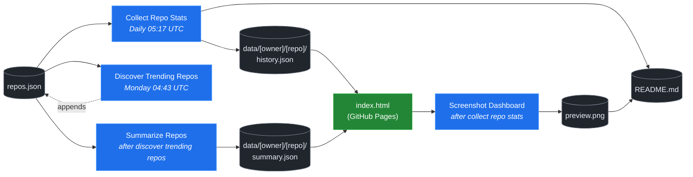

# 🚀 Rising Repos Tracker

> Automatically tracks daily GitHub stats (stars, forks, issues, velocity) for rising open source repos.

[](https://www.telosignal.com/)


**[→ View Live Dashboard](https://patrick-creates.github.io/rising-repos-tracker/)**

Built and maintained by [Telosignal](https://www.telosignal.com/).


<!-- AUTOGEN-STATS-START -->
## 📊 Current snapshot

> Auto-updated daily — last refreshed 2026-06-14

| Metric | Value |
|---|---|
| Repos tracked | **91** |
| Total stars | **5,694,939** |
| Total forks | **930,349** |
| Fastest growing | **last30days-skill** (+1471.2/day) |

### 🔥 Top 5 by velocity

| # | Repo | Stars | Stars/day |
|---|---|---:|---:|
| 1 | [mvanhorn/last30days-skill](https://github.com/mvanhorn/last30days-skill) | 41,498 | +1471.2 |
| 2 | [NousResearch/hermes-agent](https://github.com/NousResearch/hermes-agent) | 192,991 | +1404.6 |
| 3 | [affaan-m/ECC](https://github.com/affaan-m/ECC) | 215,113 | +1144.2 |
| 4 | [affaan-m/everything-claude-code](https://github.com/affaan-m/everything-claude-code) | 215,113 | +1064.5 |
| 5 | [Leonxlnx/taste-skill](https://github.com/Leonxlnx/taste-skill) | 43,272 | +989.2 |

### 🆕 Recently added

- [mvanhorn/last30days-skill](https://github.com/mvanhorn/last30days-skill) — added 2026-06-08 — AI agent skill that researches any topic across Reddit, X, YouTube, HN, Polymarket, and the web - then synthesizes a grounded summary
- [heygen-com/hyperframes](https://github.com/heygen-com/hyperframes) — added 2026-06-08 — Write HTML. Render video. Built for agents.
- [zai-org/Open-AutoGLM](https://github.com/zai-org/Open-AutoGLM) — added 2026-06-08 — An Open Phone Agent Model & Framework. Unlocking the AI Phone for Everyone
<!-- AUTOGEN-STATS-END -->

<!-- AUTOGEN-DIAGRAM-START -->
## 🔄 How it works


<!-- AUTOGEN-DIAGRAM-END -->

<!-- AUTOGEN-WORKFLOWS-START -->
## ⚙️ Workflows

| File | Schedule | Name |
|---|---|---|
| `collect.yml` | Daily 05:17 UTC | Collect Repo Stats |
| `discover.yml` | Monday 04:43 UTC | Discover Trending Repos |
| `screenshot.yml` | After Collect Repo Stats | Screenshot Dashboard |
| `summarize.yml` | After Discover Trending Repos | Summarize Repos |

> All workflows commit results directly back to the repo. Schedules are best-effort — GitHub Actions cron can drift by a few minutes.
<!-- AUTOGEN-WORKFLOWS-END -->

<!-- AUTOGEN-REPOS-START -->
## 📋 All tracked repos

| Repo | Stars | Forks | Stars/day |
|---|---:|---:|---:|
| [openclaw/openclaw](https://github.com/openclaw/openclaw) | 378,617 | 79,182 | +223.3 |
| [affaan-m/everything-claude-code](https://github.com/affaan-m/everything-claude-code) | 215,113 | 33,066 | +1064.5 |
| [affaan-m/ECC](https://github.com/affaan-m/ECC) | 215,113 | 33,066 | +1144.2 |
| [NousResearch/hermes-agent](https://github.com/NousResearch/hermes-agent) | 192,991 | 33,707 | +1404.6 |
| [Significant-Gravitas/AutoGPT](https://github.com/Significant-Gravitas/AutoGPT) | 184,930 | 46,144 | +20.3 |
| [f/prompts.chat](https://github.com/f/prompts.chat) | 163,689 | 21,230 | +47.4 |
| [microsoft/markitdown](https://github.com/microsoft/markitdown) | 152,943 | 10,578 | +935.5 |
| [langgenius/dify](https://github.com/langgenius/dify) | 145,138 | 22,843 | +122.3 |
| [open-webui/open-webui](https://github.com/open-webui/open-webui) | 141,427 | 20,322 | +141.7 |
| [langchain-ai/langchain](https://github.com/langchain-ai/langchain) | 139,232 | 23,079 | +81.2 |
| [github/spec-kit](https://github.com/github/spec-kit) | 112,016 | 9,879 | +442.3 |
| [microsoft/generative-ai-for-beginners](https://github.com/microsoft/generative-ai-for-beginners) | 111,942 | 60,113 | +37.2 |
| [farion1231/cc-switch](https://github.com/farion1231/cc-switch) | 100,303 | 6,622 | +972.6 |
| [nextlevelbuilder/ui-ux-pro-max-skill](https://github.com/nextlevelbuilder/ui-ux-pro-max-skill) | 91,412 | 9,545 | +422.5 |
| [ChatGPTNextWeb/NextChat](https://github.com/ChatGPTNextWeb/NextChat) | 88,241 | 59,578 | +7.6 |
| [vllm-project/vllm](https://github.com/vllm-project/vllm) | 82,810 | 18,036 | +91.4 |
| [thedotmack/claude-mem](https://github.com/thedotmack/claude-mem) | 82,177 | 7,099 | +212.4 |
| [lobehub/lobehub](https://github.com/lobehub/lobehub) | 78,636 | 15,418 | +51.2 |
| [OpenHands/OpenHands](https://github.com/OpenHands/OpenHands) | 76,965 | 9,774 | +112.3 |
| [dair-ai/Prompt-Engineering-Guide](https://github.com/dair-ai/Prompt-Engineering-Guide) | 75,599 | 8,209 | +33.3 |
| [openai/openai-cookbook](https://github.com/openai/openai-cookbook) | 74,150 | 12,552 | +20.0 |
| [ruvnet/RuView](https://github.com/ruvnet/RuView) | 73,718 | 9,835 | +391.3 |
| [JuliusBrussee/caveman](https://github.com/JuliusBrussee/caveman) | 72,232 | 4,070 | +397.0 |
| [unslothai/unsloth](https://github.com/unslothai/unsloth) | 66,464 | 5,958 | +72.7 |
| [shareAI-lab/learn-claude-code](https://github.com/shareAI-lab/learn-claude-code) | 66,438 | 10,823 | +198.6 |
| [xtekky/gpt4free](https://github.com/xtekky/gpt4free) | 66,327 | 13,576 | +3.2 |
| [ComposioHQ/awesome-claude-skills](https://github.com/ComposioHQ/awesome-claude-skills) | 64,500 | 7,131 | +152.3 |
| [nexu-io/open-design](https://github.com/nexu-io/open-design) | 64,479 | 7,217 | +752.0 |
| [rtk-ai/rtk](https://github.com/rtk-ai/rtk) | 62,176 | 3,836 | +466.6 |
| [code-yeongyu/oh-my-openagent](https://github.com/code-yeongyu/oh-my-openagent) | 62,157 | 5,036 | +141.8 |
| [datawhalechina/hello-agents](https://github.com/datawhalechina/hello-agents) | 59,009 | 7,243 | +309.2 |
| [shanraisshan/claude-code-best-practice](https://github.com/shanraisshan/claude-code-best-practice) | 57,652 | 5,789 | +153.9 |
| [koala73/worldmonitor](https://github.com/koala73/worldmonitor) | 56,423 | 9,020 | +76.1 |
| [MemPalace/mempalace](https://github.com/MemPalace/mempalace) | 55,556 | 7,205 | +116.9 |
| [Fission-AI/OpenSpec](https://github.com/Fission-AI/OpenSpec) | 54,670 | 3,835 | +217.9 |
| [santifer/career-ops](https://github.com/santifer/career-ops) | 53,602 | 10,671 | +309.5 |
| [FlowiseAI/Flowise](https://github.com/FlowiseAI/Flowise) | 53,554 | 24,511 | +24.2 |
| [ggml-org/whisper.cpp](https://github.com/ggml-org/whisper.cpp) | 50,703 | 5,663 | +32.5 |
| [tw93/Pake](https://github.com/tw93/Pake) | 50,456 | 10,327 | +62.1 |
| [BerriAI/litellm](https://github.com/BerriAI/litellm) | 50,300 | 8,864 | +107.9 |
| [hesreallyhim/awesome-claude-code](https://github.com/hesreallyhim/awesome-claude-code) | 46,409 | 4,043 | +85.7 |
| [Aider-AI/aider](https://github.com/Aider-AI/aider) | 46,182 | 4,581 | +45.2 |
| [zhayujie/CowAgent](https://github.com/zhayujie/CowAgent) | 45,284 | 10,199 | +27.0 |
| [HKUDS/nanobot](https://github.com/HKUDS/nanobot) | 44,173 | 7,813 | +55.3 |
| [ChromeDevTools/chrome-devtools-mcp](https://github.com/ChromeDevTools/chrome-devtools-mcp) | 43,549 | 2,793 | +135.7 |
| [Leonxlnx/taste-skill](https://github.com/Leonxlnx/taste-skill) | 43,272 | 3,022 | +989.2 |
| [ZhuLinsen/daily_stock_analysis](https://github.com/ZhuLinsen/daily_stock_analysis) | 42,466 | 40,233 | +181.3 |
| [asgeirtj/system_prompts_leaks](https://github.com/asgeirtj/system_prompts_leaks) | 42,057 | 6,977 | +61.9 |
| [mvanhorn/last30days-skill](https://github.com/mvanhorn/last30days-skill) | 41,498 | 3,365 | +1471.2 |
| [sickn33/antigravity-awesome-skills](https://github.com/sickn33/antigravity-awesome-skills) | 40,666 | 6,562 | +99.4 |
| [chatboxai/chatbox](https://github.com/chatboxai/chatbox) | 40,450 | 4,101 | +16.8 |
| [danny-avila/LibreChat](https://github.com/danny-avila/LibreChat) | 39,080 | 8,030 | +80.5 |
| [QuantumNous/new-api](https://github.com/QuantumNous/new-api) | 38,698 | 8,799 | +167.1 |
| [chatanywhere/GPT_API_free](https://github.com/chatanywhere/GPT_API_free) | 38,435 | 2,645 | +13.9 |
| [Hmbown/CodeWhale](https://github.com/Hmbown/CodeWhale) | 38,275 | 3,290 | +180.3 |
| [router-for-me/CLIProxyAPI](https://github.com/router-for-me/CLIProxyAPI) | 37,449 | 6,171 | +135.3 |
| [google/langextract](https://github.com/google/langextract) | 36,883 | 2,543 | +16.4 |
| [wshobson/agents](https://github.com/wshobson/agents) | 36,710 | 3,975 | +38.7 |
| [Yeachan-Heo/oh-my-claudecode](https://github.com/Yeachan-Heo/oh-my-claudecode) | 36,354 | 3,304 | +76.5 |
| [kepano/obsidian-skills](https://github.com/kepano/obsidian-skills) | 35,546 | 2,520 | +127.8 |
| [github/awesome-copilot](https://github.com/github/awesome-copilot) | 34,980 | 4,305 | +58.7 |
| [songquanpeng/one-api](https://github.com/songquanpeng/one-api) | 34,922 | 6,624 | +35.6 |
| [PDFMathTranslate/PDFMathTranslate](https://github.com/PDFMathTranslate/PDFMathTranslate) | 34,828 | 3,108 | +40.7 |
| [AstrBotDevs/AstrBot](https://github.com/AstrBotDevs/AstrBot) | 34,618 | 2,382 | +79.2 |
| [coreyhaines31/marketingskills](https://github.com/coreyhaines31/marketingskills) | 33,224 | 5,461 | +137.4 |
| [rohitg00/ai-engineering-from-scratch](https://github.com/rohitg00/ai-engineering-from-scratch) | 32,098 | 5,262 | +441.2 |
| [zeroclaw-labs/zeroclaw](https://github.com/zeroclaw-labs/zeroclaw) | 31,905 | 4,721 | +17.6 |
| [anthropics/claude-plugins-official](https://github.com/anthropics/claude-plugins-official) | 30,083 | 3,248 | +82.5 |
| [jamiepine/voicebox](https://github.com/jamiepine/voicebox) | 29,953 | 3,690 | +71.6 |
| [voideditor/void](https://github.com/voideditor/void) | 28,814 | 2,538 | +0.7 |
| [Gitlawb/openclaude](https://github.com/Gitlawb/openclaude) | 28,682 | 8,731 | +42.1 |
| [iOfficeAI/AionUi](https://github.com/iOfficeAI/AionUi) | 28,209 | 2,761 | +66.2 |
| [Panniantong/Agent-Reach](https://github.com/Panniantong/Agent-Reach) | 28,120 | 2,301 | +773.8 |
| [AlexsJones/llmfit](https://github.com/AlexsJones/llmfit) | 27,852 | 1,704 | +65.5 |
| [heygen-com/hyperframes](https://github.com/heygen-com/hyperframes) | 27,458 | 2,582 | +316.2 |
| [googleworkspace/cli](https://github.com/googleworkspace/cli) | 27,045 | 1,423 | +25.2 |
| [BloopAI/vibe-kanban](https://github.com/BloopAI/vibe-kanban) | 26,992 | 2,851 | +21.7 |
| [usestrix/strix](https://github.com/usestrix/strix) | 25,980 | 2,923 | +20.8 |
| [volcengine/OpenViking](https://github.com/volcengine/OpenViking) | 25,620 | 1,979 | +48.7 |
| [zai-org/Open-AutoGLM](https://github.com/zai-org/Open-AutoGLM) | 25,507 | 3,972 | +7.5 |
| [jarrodwatts/claude-hud](https://github.com/jarrodwatts/claude-hud) | 25,133 | 1,141 | +73.8 |
| [langchain-ai/deepagents](https://github.com/langchain-ai/deepagents) | 24,588 | 3,484 | +72.2 |
| [toon-format/toon](https://github.com/toon-format/toon) | 24,555 | 1,090 | +9.8 |
| [p-e-w/heretic](https://github.com/p-e-w/heretic) | 24,484 | 2,627 | +85.3 |
| [jackwener/OpenCLI](https://github.com/jackwener/OpenCLI) | 24,302 | 2,434 | +83.7 |
| [rohitg00/agentmemory](https://github.com/rohitg00/agentmemory) | 22,732 | 1,868 | +151.2 |
| [winfunc/opcode](https://github.com/winfunc/opcode) | 22,055 | 1,704 | +8.3 |
| [esengine/DeepSeek-Reasonix](https://github.com/esengine/DeepSeek-Reasonix) | 21,881 | 1,306 | +392.5 |
| [coze-dev/coze-studio](https://github.com/coze-dev/coze-studio) | 20,978 | 3,048 | +5.0 |
| [NirDiamant/agents-towards-production](https://github.com/NirDiamant/agents-towards-production) | 20,721 | 2,751 | +14.5 |
| [frankbria/ralph-claude-code](https://github.com/frankbria/ralph-claude-code) | 9,324 | 712 | +6.6 |
<!-- AUTOGEN-REPOS-END -->

---

## What it does

- Collects daily snapshots of stars, forks, watchers and open issues for every tracked repo
- Discovers new trending repos automatically every Monday using the GitHub Search API
- Generates AI summaries (use cases, similar tools, tags) for each tracked repo via GitHub Models
- Stores all history as plain JSON — no database, no backend
- Renders a live dashboard via GitHub Pages — updates daily, zero maintenance

## Tracked repos

Data lives in [`data/`](./data) — one folder per repo, one `history.json` per entry.  
The full watch list is in [`repos.json`](./repos.json).

## Fork & use it for yourself

This is my personal tracker — the watch list reflects what I find interesting. If you want to track different repos, the best path is to **fork this repo and run your own**.

### Setup

1. Fork this repo to your account
2. Replace the contents of [`repos.json`](./repos.json) with the repos you want to track (or just leave one entry — `discover.yml` will auto-add more every Monday)
3. Go to **Settings → Pages** and enable GitHub Pages from the `main` branch
4. Go to **Actions** and run **Collect Repo Stats** once manually to seed your first data point
5. Your dashboard will be live at `https://YOUR-USERNAME.github.io/rising-repos-tracker/`

That's it — daily collection and weekly discovery run automatically on schedule. Zero ongoing maintenance.

### Customizing what gets discovered

Edit [`scripts/discover.js`](./scripts/discover.js) to change:

- `MIN_STARS` — minimum star threshold for candidates
- `MAX_AGE_DAYS` — how recent a repo must be
- `MAX_NEW_REPOS` — how many to add per discovery run
- The `queries` array — GitHub Search API queries that define what "trending" means to you

### Adding a repo manually

Just edit `repos.json` directly:

```json
{
  "owner": "OWNER",
  "repo": "REPO",
  "added": "YYYY-MM-DD",
  "notes": "why you're tracking this"
}
```

The next daily collect run picks it up automatically.

## Stack

- **GitHub Actions** — scheduling and automation
- **GitHub Pages** — dashboard hosting
- **GitHub API** — data source
- **GitHub Models** — free AI summaries (gpt-4o-mini)
- **Chart.js** — star growth visualization
- **Mermaid** — architecture diagram (rendered by GitHub)
- No dependencies, no build step, no database

## License

MIT
