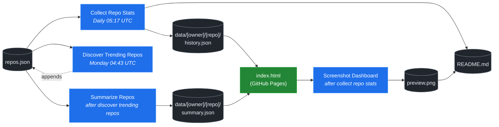

# 🚀 Rising Repos Tracker

> Automatically tracks daily GitHub stats (stars, forks, issues, velocity) for rising open source repos.

[](https://www.telosignal.com/)


**[→ View Live Dashboard](https://patrick-creates.github.io/rising-repos-tracker/)**

Built and maintained by [Telosignal](https://www.telosignal.com/).


<!-- AUTOGEN-STATS-START -->
## 📊 Current snapshot

> Auto-updated daily — last refreshed 2026-06-18

| Metric | Value |
|---|---|
| Repos tracked | **106** |
| Total stars | **6,063,279** |
| Total forks | **973,818** |
| Fastest growing | **headroom** (+1407.0/day) |

### 🔥 Top 5 by velocity

| # | Repo | Stars | Stars/day |
|---|---|---:|---:|
| 1 | [chopratejas/headroom](https://github.com/chopratejas/headroom) | 32,384 | +1407.0 |
| 2 | [NousResearch/hermes-agent](https://github.com/NousResearch/hermes-agent) | 196,539 | +1347.1 |
| 3 | [mvanhorn/last30days-skill](https://github.com/mvanhorn/last30days-skill) | 44,197 | +1152.6 |
| 4 | [elder-plinius/CL4R1T4S](https://github.com/elder-plinius/CL4R1T4S) | 42,067 | +1058.7 |
| 5 | [affaan-m/ECC](https://github.com/affaan-m/ECC) | 217,505 | +1053.2 |

### 🆕 Recently added

- [elder-plinius/CL4R1T4S](https://github.com/elder-plinius/CL4R1T4S) — added 2026-06-15 — LEAKED SYSTEM PROMPTS FOR CHATGPT, CLAUDE, GEMINI, GROK, PERPLEXITY, CURSOR, LOVABLE, REPLIT, AND MORE! - AI SYSTEMS TRANSPARENCY FOR ALL! 👐
- [chopratejas/headroom](https://github.com/chopratejas/headroom) — added 2026-06-15 — Compress tool outputs, logs, files, and RAG chunks before they reach the LLM. 60-95% fewer tokens, same answers. Library, proxy, MCP server.
- [alibaba/page-agent](https://github.com/alibaba/page-agent) — added 2026-06-15 — JavaScript in-page GUI agent. Control web interfaces with natural language.
<!-- AUTOGEN-STATS-END -->

<!-- AUTOGEN-DIAGRAM-START -->
## 🔄 How it works


<!-- AUTOGEN-DIAGRAM-END -->

<!-- AUTOGEN-WORKFLOWS-START -->
## ⚙️ Workflows

| File | Schedule | Name |
|---|---|---|
| `collect.yml` | Daily 05:17 UTC | Collect Repo Stats |
| `discover.yml` | Monday 04:43 UTC | Discover Trending Repos |
| `screenshot.yml` | After Collect Repo Stats | Screenshot Dashboard |
| `summarize.yml` | After Discover Trending Repos | Summarize Repos |

> All workflows commit results directly back to the repo. Schedules are best-effort — GitHub Actions cron can drift by a few minutes.
<!-- AUTOGEN-WORKFLOWS-END -->

<!-- AUTOGEN-REPOS-START -->
## 📋 All tracked repos

| Repo | Stars | Forks | Stars/day |
|---|---:|---:|---:|
| [openclaw/openclaw](https://github.com/openclaw/openclaw) | 379,309 | 79,408 | +217.7 |
| [affaan-m/everything-claude-code](https://github.com/affaan-m/everything-claude-code) | 217,505 | 33,380 | +1012.7 |
| [affaan-m/ECC](https://github.com/affaan-m/ECC) | 217,505 | 33,380 | +1053.2 |
| [NousResearch/hermes-agent](https://github.com/NousResearch/hermes-agent) | 196,539 | 34,643 | +1347.1 |
| [Significant-Gravitas/AutoGPT](https://github.com/Significant-Gravitas/AutoGPT) | 185,015 | 46,131 | +20.4 |
| [f/prompts.chat](https://github.com/f/prompts.chat) | 163,878 | 21,249 | +47.4 |
| [microsoft/markitdown](https://github.com/microsoft/markitdown) | 155,407 | 10,789 | +900.0 |
| [langgenius/dify](https://github.com/langgenius/dify) | 145,692 | 22,913 | +124.1 |
| [open-webui/open-webui](https://github.com/open-webui/open-webui) | 142,098 | 20,421 | +144.6 |
| [langchain-ai/langchain](https://github.com/langchain-ai/langchain) | 139,618 | 23,136 | +82.9 |
| [github/spec-kit](https://github.com/github/spec-kit) | 113,661 | 10,028 | +438.9 |
| [microsoft/generative-ai-for-beginners](https://github.com/microsoft/generative-ai-for-beginners) | 112,113 | 60,226 | +37.8 |
| [farion1231/cc-switch](https://github.com/farion1231/cc-switch) | 103,918 | 6,875 | +963.7 |
| [nextlevelbuilder/ui-ux-pro-max-skill](https://github.com/nextlevelbuilder/ui-ux-pro-max-skill) | 93,310 | 9,753 | +428.3 |
| [ChatGPTNextWeb/NextChat](https://github.com/ChatGPTNextWeb/NextChat) | 88,264 | 59,552 | +7.3 |
| [vllm-project/vllm](https://github.com/vllm-project/vllm) | 83,239 | 18,184 | +93.2 |
| [thedotmack/claude-mem](https://github.com/thedotmack/claude-mem) | 83,072 | 7,189 | +213.7 |
| [lobehub/lobehub](https://github.com/lobehub/lobehub) | 78,807 | 15,447 | +50.3 |
| [OpenHands/OpenHands](https://github.com/OpenHands/OpenHands) | 77,618 | 9,866 | +118.9 |
| [dair-ai/Prompt-Engineering-Guide](https://github.com/dair-ai/Prompt-Engineering-Guide) | 75,721 | 8,229 | +32.9 |
| [ruvnet/RuView](https://github.com/ruvnet/RuView) | 74,476 | 9,931 | +357.6 |
| [JuliusBrussee/caveman](https://github.com/JuliusBrussee/caveman) | 74,286 | 4,177 | +412.1 |
| [openai/openai-cookbook](https://github.com/openai/openai-cookbook) | 74,233 | 12,572 | +20.1 |
| [shareAI-lab/learn-claude-code](https://github.com/shareAI-lab/learn-claude-code) | 67,363 | 10,947 | +202.8 |
| [nexu-io/open-design](https://github.com/nexu-io/open-design) | 67,062 | 7,521 | +738.3 |
| [unslothai/unsloth](https://github.com/unslothai/unsloth) | 66,737 | 5,993 | +72.2 |
| [xtekky/gpt4free](https://github.com/xtekky/gpt4free) | 66,342 | 13,573 | +3.3 |
| [ComposioHQ/awesome-claude-skills](https://github.com/ComposioHQ/awesome-claude-skills) | 65,060 | 7,209 | +150.7 |
| [rtk-ai/rtk](https://github.com/rtk-ai/rtk) | 63,480 | 3,905 | +448.5 |
| [code-yeongyu/oh-my-openagent](https://github.com/code-yeongyu/oh-my-openagent) | 62,635 | 5,071 | +138.9 |
| [datawhalechina/hello-agents](https://github.com/datawhalechina/hello-agents) | 60,175 | 7,401 | +306.9 |
| [shanraisshan/claude-code-best-practice](https://github.com/shanraisshan/claude-code-best-practice) | 58,226 | 5,850 | +152.5 |
| [koala73/worldmonitor](https://github.com/koala73/worldmonitor) | 56,705 | 9,083 | +75.4 |
| [MemPalace/mempalace](https://github.com/MemPalace/mempalace) | 55,887 | 7,243 | +112.5 |
| [Fission-AI/OpenSpec](https://github.com/Fission-AI/OpenSpec) | 55,454 | 3,879 | +215.0 |
| [santifer/career-ops](https://github.com/santifer/career-ops) | 54,500 | 10,810 | +298.5 |
| [FlowiseAI/Flowise](https://github.com/FlowiseAI/Flowise) | 53,702 | 24,533 | +25.9 |
| [ggml-org/whisper.cpp](https://github.com/ggml-org/whisper.cpp) | 50,830 | 5,670 | +32.4 |
| [BerriAI/litellm](https://github.com/BerriAI/litellm) | 50,771 | 8,971 | +109.1 |
| [tw93/Pake](https://github.com/tw93/Pake) | 50,579 | 10,380 | +58.1 |
| [hesreallyhim/awesome-claude-code](https://github.com/hesreallyhim/awesome-claude-code) | 46,756 | 4,076 | +85.8 |
| [Aider-AI/aider](https://github.com/Aider-AI/aider) | 46,412 | 4,617 | +46.8 |
| [Leonxlnx/taste-skill](https://github.com/Leonxlnx/taste-skill) | 46,302 | 3,226 | +934.6 |
| [zhayujie/CowAgent](https://github.com/zhayujie/CowAgent) | 45,395 | 10,207 | +27.1 |
| [HKUDS/nanobot](https://github.com/HKUDS/nanobot) | 44,421 | 7,849 | +56.2 |
| [mvanhorn/last30days-skill](https://github.com/mvanhorn/last30days-skill) | 44,197 | 3,630 | +1152.6 |
| [ChromeDevTools/chrome-devtools-mcp](https://github.com/ChromeDevTools/chrome-devtools-mcp) | 43,913 | 2,824 | +130.0 |
| [asgeirtj/system_prompts_leaks](https://github.com/asgeirtj/system_prompts_leaks) | 43,237 | 7,169 | +92.0 |
| [ZhuLinsen/daily_stock_analysis](https://github.com/ZhuLinsen/daily_stock_analysis) | 43,058 | 40,736 | +175.8 |
| [elder-plinius/CL4R1T4S](https://github.com/elder-plinius/CL4R1T4S) | 42,067 | 8,397 | +1058.7 |
| [sickn33/antigravity-awesome-skills](https://github.com/sickn33/antigravity-awesome-skills) | 41,026 | 6,616 | +97.8 |
| [chatboxai/chatbox](https://github.com/chatboxai/chatbox) | 40,530 | 4,115 | +17.2 |
| [danny-avila/LibreChat](https://github.com/danny-avila/LibreChat) | 39,392 | 8,083 | +80.1 |
| [QuantumNous/new-api](https://github.com/QuantumNous/new-api) | 39,294 | 8,942 | +164.0 |
| [Hmbown/CodeWhale](https://github.com/Hmbown/CodeWhale) | 38,619 | 3,320 | +164.5 |
| [chatanywhere/GPT_API_free](https://github.com/chatanywhere/GPT_API_free) | 38,486 | 2,650 | +13.8 |
| [router-for-me/CLIProxyAPI](https://github.com/router-for-me/CLIProxyAPI) | 37,823 | 6,252 | +128.3 |
| [wshobson/agents](https://github.com/wshobson/agents) | 36,922 | 3,990 | +41.1 |
| [google/langextract](https://github.com/google/langextract) | 36,911 | 2,548 | +14.8 |
| [Yeachan-Heo/oh-my-claudecode](https://github.com/Yeachan-Heo/oh-my-claudecode) | 36,592 | 3,317 | +73.7 |
| [kepano/obsidian-skills](https://github.com/kepano/obsidian-skills) | 36,009 | 2,558 | +125.0 |
| [github/awesome-copilot](https://github.com/github/awesome-copilot) | 35,225 | 4,348 | +59.1 |
| [songquanpeng/one-api](https://github.com/songquanpeng/one-api) | 35,064 | 6,646 | +35.6 |
| [PDFMathTranslate/PDFMathTranslate](https://github.com/PDFMathTranslate/PDFMathTranslate) | 34,926 | 3,118 | +38.0 |
| [AstrBotDevs/AstrBot](https://github.com/AstrBotDevs/AstrBot) | 34,879 | 2,406 | +75.9 |
| [rohitg00/ai-engineering-from-scratch](https://github.com/rohitg00/ai-engineering-from-scratch) | 34,227 | 5,568 | +462.6 |
| [Panniantong/Agent-Reach](https://github.com/Panniantong/Agent-Reach) | 33,876 | 2,711 | +1039.9 |
| [coreyhaines31/marketingskills](https://github.com/coreyhaines31/marketingskills) | 33,870 | 5,550 | +143.1 |
| [chopratejas/headroom](https://github.com/chopratejas/headroom) | 32,384 | 2,182 | +1407.0 |
| [zeroclaw-labs/zeroclaw](https://github.com/zeroclaw-labs/zeroclaw) | 31,939 | 4,735 | +15.5 |
| [jamiepine/voicebox](https://github.com/jamiepine/voicebox) | 30,395 | 3,756 | +80.8 |
| [anthropics/claude-plugins-official](https://github.com/anthropics/claude-plugins-official) | 30,374 | 3,297 | +80.2 |
| [Gitlawb/openclaude](https://github.com/Gitlawb/openclaude) | 29,075 | 8,773 | +55.3 |
| [voideditor/void](https://github.com/voideditor/void) | 28,808 | 2,542 | +0.2 |
| [heygen-com/hyperframes](https://github.com/heygen-com/hyperframes) | 28,582 | 2,701 | +302.1 |
| [iOfficeAI/AionUi](https://github.com/iOfficeAI/AionUi) | 28,464 | 2,803 | +65.6 |
| [AlexsJones/llmfit](https://github.com/AlexsJones/llmfit) | 28,208 | 1,720 | +71.0 |
| [googleworkspace/cli](https://github.com/googleworkspace/cli) | 27,137 | 1,427 | +24.6 |
| [BloopAI/vibe-kanban](https://github.com/BloopAI/vibe-kanban) | 27,051 | 2,863 | +20.1 |
| [usestrix/strix](https://github.com/usestrix/strix) | 26,041 | 2,931 | +19.5 |
| [volcengine/OpenViking](https://github.com/volcengine/OpenViking) | 25,785 | 1,995 | +45.7 |
| [zai-org/Open-AutoGLM](https://github.com/zai-org/Open-AutoGLM) | 25,559 | 3,983 | +9.7 |
| [jarrodwatts/claude-hud](https://github.com/jarrodwatts/claude-hud) | 25,404 | 1,153 | +71.4 |
| [p-e-w/heretic](https://github.com/p-e-w/heretic) | 25,102 | 2,697 | +113.0 |
| [langchain-ai/deepagents](https://github.com/langchain-ai/deepagents) | 24,802 | 3,499 | +64.7 |
| [jackwener/OpenCLI](https://github.com/jackwener/OpenCLI) | 24,711 | 2,465 | +91.1 |
| [toon-format/toon](https://github.com/toon-format/toon) | 24,594 | 1,091 | +9.8 |
| [rohitg00/agentmemory](https://github.com/rohitg00/agentmemory) | 23,310 | 1,913 | +148.5 |
| [esengine/DeepSeek-Reasonix](https://github.com/esengine/DeepSeek-Reasonix) | 23,039 | 1,381 | +351.3 |
| [winfunc/opcode](https://github.com/winfunc/opcode) | 22,060 | 1,705 | +5.5 |
| [coze-dev/coze-studio](https://github.com/coze-dev/coze-studio) | 21,000 | 3,055 | +5.2 |
| [NirDiamant/agents-towards-production](https://github.com/NirDiamant/agents-towards-production) | 20,765 | 2,759 | +13.1 |
| [agentscope-ai/QwenPaw](https://github.com/agentscope-ai/QwenPaw) | 19,157 | 2,634 | +459.7 |
| [tirth8205/code-review-graph](https://github.com/tirth8205/code-review-graph) | 18,656 | 1,998 | +47.3 |
| [alibaba/page-agent](https://github.com/alibaba/page-agent) | 18,635 | 1,606 | +25.7 |
| [tanweai/pua](https://github.com/tanweai/pua) | 18,317 | 1,103 | +23.7 |
| [decolua/9router](https://github.com/decolua/9router) | 17,870 | 2,782 | +99.7 |
| [RightNow-AI/openfang](https://github.com/RightNow-AI/openfang) | 17,858 | 2,267 | +10.7 |
| [mksglu/context-mode](https://github.com/mksglu/context-mode) | 17,705 | 1,257 | +79.0 |
| [microsoft/agent-lightning](https://github.com/microsoft/agent-lightning) | 17,312 | 1,519 | +0.3 |
| [JCodesMore/ai-website-cloner-template](https://github.com/JCodesMore/ai-website-cloner-template) | 17,168 | 2,670 | +58.3 |
| [datawhalechina/easy-vibe](https://github.com/datawhalechina/easy-vibe) | 17,085 | 1,612 | +48.0 |
| [jundot/omlx](https://github.com/jundot/omlx) | 16,786 | 1,419 | +51.3 |
| [Tencent/WeKnora](https://github.com/Tencent/WeKnora) | 16,450 | 2,121 | +52.7 |
| [cft0808/edict](https://github.com/cft0808/edict) | 16,088 | 1,696 | +8.7 |
| [frankbria/ralph-claude-code](https://github.com/frankbria/ralph-claude-code) | 9,382 | 721 | +7.5 |
<!-- AUTOGEN-REPOS-END -->

---

## What it does

- Collects daily snapshots of stars, forks, watchers and open issues for every tracked repo
- Discovers new trending repos automatically every Monday using the GitHub Search API
- Generates AI summaries (use cases, similar tools, tags) for each tracked repo via GitHub Models
- Stores all history as plain JSON — no database, no backend
- Renders a live dashboard via GitHub Pages — updates daily, zero maintenance

## Tracked repos

Data lives in [`data/`](./data) — one folder per repo, one `history.json` per entry.  
The full watch list is in [`repos.json`](./repos.json).

## Fork & use it for yourself

This is my personal tracker — the watch list reflects what I find interesting. If you want to track different repos, the best path is to **fork this repo and run your own**.

### Setup

1. Fork this repo to your account
2. Replace the contents of [`repos.json`](./repos.json) with the repos you want to track (or just leave one entry — `discover.yml` will auto-add more every Monday)
3. Go to **Settings → Pages** and enable GitHub Pages from the `main` branch
4. Go to **Actions** and run **Collect Repo Stats** once manually to seed your first data point
5. Your dashboard will be live at `https://YOUR-USERNAME.github.io/rising-repos-tracker/`

That's it — daily collection and weekly discovery run automatically on schedule. Zero ongoing maintenance.

### Customizing what gets discovered

Edit [`scripts/discover.js`](./scripts/discover.js) to change:

- `MIN_STARS` — minimum star threshold for candidates
- `MAX_AGE_DAYS` — how recent a repo must be
- `MAX_NEW_REPOS` — how many to add per discovery run
- The `queries` array — GitHub Search API queries that define what "trending" means to you

### Adding a repo manually

Just edit `repos.json` directly:

```json
{
  "owner": "OWNER",
  "repo": "REPO",
  "added": "YYYY-MM-DD",
  "notes": "why you're tracking this"
}
```

The next daily collect run picks it up automatically.

## Stack

- **GitHub Actions** — scheduling and automation
- **GitHub Pages** — dashboard hosting
- **GitHub API** — data source
- **GitHub Models** — free AI summaries (gpt-4o-mini)
- **Chart.js** — star growth visualization
- **Mermaid** — architecture diagram (rendered by GitHub)
- No dependencies, no build step, no database

## License

MIT
