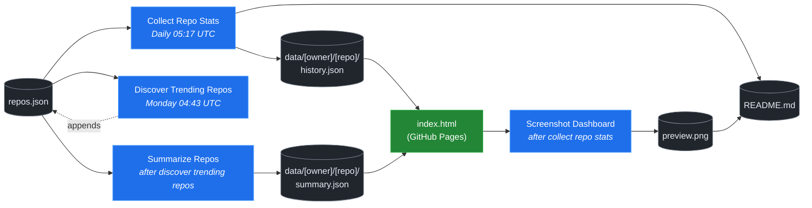

# 🚀 Rising Repos Tracker

> Automatically tracks daily GitHub stats (stars, forks, issues, velocity) for rising open source repos.

[](https://www.telosignal.com/)


**[→ View Live Dashboard](https://patrick-creates.github.io/rising-repos-tracker/)**

Built and maintained by [Telosignal](https://www.telosignal.com/).


<!-- AUTOGEN-STATS-START -->
## 📊 Current snapshot

> Auto-updated daily — last refreshed 2026-07-19

| Metric | Value |
|---|---|
| Repos tracked | **166** |
| Total stars | **7,821,143** |
| Total forks | **1,189,276** |
| Fastest growing | **ponytail** (+1395.8/day) |

### 🔥 Top 5 by velocity

| # | Repo | Stars | Stars/day |
|---|---|---:|---:|
| 1 | [DietrichGebert/ponytail](https://github.com/DietrichGebert/ponytail) | 85,706 | +1395.8 |
| 2 | [NousResearch/hermes-agent](https://github.com/NousResearch/hermes-agent) | 216,962 | +1028.6 |
| 3 | [chopratejas/headroom](https://github.com/chopratejas/headroom) | 59,873 | +932.6 |
| 4 | [iOfficeAI/OfficeCLI](https://github.com/iOfficeAI/OfficeCLI) | 19,402 | +846.5 |
| 5 | [Panniantong/Agent-Reach](https://github.com/Panniantong/Agent-Reach) | 57,850 | +838.4 |

### 🆕 Recently added

- [sickn33/agentic-awesome-skills](https://github.com/sickn33/agentic-awesome-skills) — added 2026-07-13 — Installable GitHub library of 1,900+ agentic skills for Claude Code, Cursor, Codex CLI, Autohand Code, Gemini CLI, Antigravity, and more. Includes specialized plugins, installer CLI, bundles, workflows, and official/community skill collections.
- [mindsdb/mindshub](https://github.com/mindsdb/mindshub) — added 2026-07-13 — Make AI do actual work. Swap the model anytime — keep everything you've built.
- [re4/LibreCode](https://github.com/re4/LibreCode) — added 2026-07-13 — LibreCode - A Ollama cursor like coding / Reversing Interface
<!-- AUTOGEN-STATS-END -->

<!-- AUTOGEN-DIAGRAM-START -->
## 🔄 How it works


<!-- AUTOGEN-DIAGRAM-END -->

<!-- AUTOGEN-WORKFLOWS-START -->
## ⚙️ Workflows

| File | Schedule | Name |
|---|---|---|
| `collect.yml` | Daily 05:17 UTC | Collect Repo Stats |
| `discover.yml` | Monday 04:43 UTC | Discover Trending Repos |
| `screenshot.yml` | After Collect Repo Stats | Screenshot Dashboard |
| `summarize.yml` | After Discover Trending Repos | Summarize Repos |

> All workflows commit results directly back to the repo. Schedules are best-effort — GitHub Actions cron can drift by a few minutes.
<!-- AUTOGEN-WORKFLOWS-END -->

<!-- AUTOGEN-REPOS-START -->
## 📋 All tracked repos

| Repo | Stars | Forks | Stars/day |
|---|---:|---:|---:|
| [openclaw/openclaw](https://github.com/openclaw/openclaw) | 383,430 | 80,535 | +178.5 |
| [obra/superpowers](https://github.com/obra/superpowers) | 257,237 | 22,920 | +802.2 |
| [affaan-m/everything-claude-code](https://github.com/affaan-m/everything-claude-code) | 231,004 | 35,244 | +745.6 |
| [affaan-m/ECC](https://github.com/affaan-m/ECC) | 231,004 | 35,244 | +705.0 |
| [NousResearch/hermes-agent](https://github.com/NousResearch/hermes-agent) | 216,962 | 40,776 | +1028.6 |
| [Significant-Gravitas/AutoGPT](https://github.com/Significant-Gravitas/AutoGPT) | 185,599 | 46,075 | +19.7 |
| [microsoft/markitdown](https://github.com/microsoft/markitdown) | 167,161 | 12,017 | +659.0 |
| [f/prompts.chat](https://github.com/f/prompts.chat) | 165,992 | 21,466 | +57.0 |
| [langgenius/dify](https://github.com/langgenius/dify) | 149,286 | 23,521 | +120.3 |
| [open-webui/open-webui](https://github.com/open-webui/open-webui) | 145,910 | 21,150 | +134.6 |
| [langchain-ai/langchain](https://github.com/langchain-ai/langchain) | 142,064 | 23,630 | +81.0 |
| [github/spec-kit](https://github.com/github/spec-kit) | 122,150 | 10,880 | +362.5 |
| [farion1231/cc-switch](https://github.com/farion1231/cc-switch) | 118,744 | 7,962 | +721.0 |
| [microsoft/generative-ai-for-beginners](https://github.com/microsoft/generative-ai-for-beginners) | 113,212 | 60,777 | +36.7 |
| [nextlevelbuilder/ui-ux-pro-max-skill](https://github.com/nextlevelbuilder/ui-ux-pro-max-skill) | 107,486 | 11,424 | +441.7 |
| [JuliusBrussee/caveman](https://github.com/JuliusBrussee/caveman) | 90,615 | 5,138 | +469.4 |
| [ChatGPTNextWeb/NextChat](https://github.com/ChatGPTNextWeb/NextChat) | 88,511 | 59,404 | +7.6 |
| [thedotmack/claude-mem](https://github.com/thedotmack/claude-mem) | 87,778 | 7,621 | +185.0 |
| [vllm-project/vllm](https://github.com/vllm-project/vllm) | 86,602 | 19,578 | +100.3 |
| [DietrichGebert/ponytail](https://github.com/DietrichGebert/ponytail) | 85,706 | 4,671 | +1395.8 |
| [OpenHands/OpenHands](https://github.com/OpenHands/OpenHands) | 81,250 | 10,390 | +118.0 |
| [ruvnet/RuView](https://github.com/ruvnet/RuView) | 81,196 | 10,939 | +278.2 |
| [lobehub/lobehub](https://github.com/lobehub/lobehub) | 80,501 | 15,639 | +52.3 |
| [nexu-io/open-design](https://github.com/nexu-io/open-design) | 79,583 | 9,185 | +571.1 |
| [dair-ai/Prompt-Engineering-Guide](https://github.com/dair-ai/Prompt-Engineering-Guide) | 76,723 | 8,430 | +32.6 |
| [openai/openai-cookbook](https://github.com/openai/openai-cookbook) | 74,751 | 12,651 | +18.4 |
| [rtk-ai/rtk](https://github.com/rtk-ai/rtk) | 71,768 | 4,468 | +357.9 |
| [shareAI-lab/learn-claude-code](https://github.com/shareAI-lab/learn-claude-code) | 71,453 | 11,621 | +167.4 |
| [unslothai/unsloth](https://github.com/unslothai/unsloth) | 68,388 | 6,152 | +62.7 |
| [ComposioHQ/awesome-claude-skills](https://github.com/ComposioHQ/awesome-claude-skills) | 68,065 | 7,713 | +123.8 |
| [datawhalechina/hello-agents](https://github.com/datawhalechina/hello-agents) | 67,101 | 8,334 | +265.2 |
| [xtekky/gpt4free](https://github.com/xtekky/gpt4free) | 66,473 | 13,532 | +3.7 |
| [code-yeongyu/oh-my-openagent](https://github.com/code-yeongyu/oh-my-openagent) | 66,127 | 5,391 | +125.8 |
| [Leonxlnx/taste-skill](https://github.com/Leonxlnx/taste-skill) | 65,022 | 4,490 | +721.0 |
| [shanraisshan/claude-code-best-practice](https://github.com/shanraisshan/claude-code-best-practice) | 63,069 | 6,304 | +154.4 |
| [koala73/worldmonitor](https://github.com/koala73/worldmonitor) | 62,015 | 9,651 | +123.3 |
| [Fission-AI/OpenSpec](https://github.com/Fission-AI/OpenSpec) | 61,533 | 4,264 | +205.6 |
| [santifer/career-ops](https://github.com/santifer/career-ops) | 60,544 | 11,915 | +246.7 |
| [tw93/Pake](https://github.com/tw93/Pake) | 60,032 | 12,145 | +181.5 |
| [chopratejas/headroom](https://github.com/chopratejas/headroom) | 59,873 | 4,458 | +932.6 |
| [headroomlabs-ai/headroom](https://github.com/headroomlabs-ai/headroom) | 59,873 | 4,458 | +517.4 |
| [asgeirtj/system_prompts_leaks](https://github.com/asgeirtj/system_prompts_leaks) | 58,914 | 9,617 | +298.9 |
| [Panniantong/Agent-Reach](https://github.com/Panniantong/Agent-Reach) | 57,850 | 4,633 | +838.4 |
| [ZhuLinsen/daily_stock_analysis](https://github.com/ZhuLinsen/daily_stock_analysis) | 57,838 | 49,708 | +345.4 |
| [MemPalace/mempalace](https://github.com/MemPalace/mempalace) | 57,461 | 7,413 | +81.6 |
| [FlowiseAI/Flowise](https://github.com/FlowiseAI/Flowise) | 54,729 | 24,729 | +29.5 |
| [BerriAI/litellm](https://github.com/BerriAI/litellm) | 53,973 | 9,875 | +106.2 |
| [mvanhorn/last30days-skill](https://github.com/mvanhorn/last30days-skill) | 52,697 | 4,545 | +488.4 |
| [ggml-org/whisper.cpp](https://github.com/ggml-org/whisper.cpp) | 51,851 | 5,825 | +32.7 |
| [hesreallyhim/awesome-claude-code](https://github.com/hesreallyhim/awesome-claude-code) | 50,364 | 4,386 | +101.1 |
| [Aider-AI/aider](https://github.com/Aider-AI/aider) | 47,501 | 4,744 | +41.0 |
| [ChromeDevTools/chrome-devtools-mcp](https://github.com/ChromeDevTools/chrome-devtools-mcp) | 47,161 | 3,145 | +117.4 |
| [zhayujie/CowAgent](https://github.com/zhayujie/CowAgent) | 46,040 | 10,266 | +24.0 |
| [HKUDS/nanobot](https://github.com/HKUDS/nanobot) | 45,868 | 8,105 | +51.4 |
| [elder-plinius/CL4R1T4S](https://github.com/elder-plinius/CL4R1T4S) | 45,736 | 9,325 | +201.3 |
| [sickn33/antigravity-awesome-skills](https://github.com/sickn33/antigravity-awesome-skills) | 43,556 | 6,465 | +88.7 |
| [sickn33/agentic-awesome-skills](https://github.com/sickn33/agentic-awesome-skills) | 43,556 | 6,465 | +85.7 |
| [router-for-me/CLIProxyAPI](https://github.com/router-for-me/CLIProxyAPI) | 43,519 | 6,847 | +159.5 |
| [jamiepine/voicebox](https://github.com/jamiepine/voicebox) | 42,886 | 5,243 | +288.8 |
| [QuantumNous/new-api](https://github.com/QuantumNous/new-api) | 42,652 | 9,946 | +132.6 |
| [kepano/obsidian-skills](https://github.com/kepano/obsidian-skills) | 42,562 | 3,034 | +180.8 |
| [usestrix/strix](https://github.com/usestrix/strix) | 42,503 | 4,383 | +349.9 |
| [chatboxai/chatbox](https://github.com/chatboxai/chatbox) | 41,054 | 4,150 | +17.1 |
| [danny-avila/LibreChat](https://github.com/danny-avila/LibreChat) | 40,927 | 8,405 | +62.9 |
| [coreyhaines31/marketingskills](https://github.com/coreyhaines31/marketingskills) | 40,637 | 6,416 | +191.6 |
| [Hmbown/CodeWhale](https://github.com/Hmbown/CodeWhale) | 39,923 | 3,444 | +95.5 |
| [calesthio/OpenMontage](https://github.com/calesthio/OpenMontage) | 39,922 | 4,730 | +603.5 |
| [mindsdb/mindshub](https://github.com/mindsdb/mindshub) | 39,458 | 6,226 | +9.5 |
| [rohitg00/ai-engineering-from-scratch](https://github.com/rohitg00/ai-engineering-from-scratch) | 39,242 | 6,565 | +268.3 |
| [chatanywhere/GPT_API_free](https://github.com/chatanywhere/GPT_API_free) | 38,825 | 2,666 | +12.2 |
| [wshobson/agents](https://github.com/wshobson/agents) | 38,037 | 4,091 | +38.2 |
| [Yeachan-Heo/oh-my-claudecode](https://github.com/Yeachan-Heo/oh-my-claudecode) | 37,879 | 3,416 | +55.5 |
| [langchain-ai/langgraph](https://github.com/langchain-ai/langgraph) | 37,586 | 6,304 | +80.2 |
| [google/langextract](https://github.com/google/langextract) | 37,298 | 2,572 | +13.5 |
| [github/awesome-copilot](https://github.com/github/awesome-copilot) | 36,754 | 4,604 | +53.6 |
| [AstrBotDevs/AstrBot](https://github.com/AstrBotDevs/AstrBot) | 36,570 | 2,538 | +62.1 |
| [heygen-com/hyperframes](https://github.com/heygen-com/hyperframes) | 36,170 | 3,396 | +258.8 |
| [songquanpeng/one-api](https://github.com/songquanpeng/one-api) | 35,807 | 6,743 | +29.0 |
| [PDFMathTranslate/PDFMathTranslate](https://github.com/PDFMathTranslate/PDFMathTranslate) | 35,657 | 3,180 | +29.9 |
| [DeusData/codebase-memory-mcp](https://github.com/DeusData/codebase-memory-mcp) | 32,783 | 2,502 | +607.6 |
| [anthropics/claude-plugins-official](https://github.com/anthropics/claude-plugins-official) | 32,311 | 3,612 | +68.8 |
| [zeroclaw-labs/zeroclaw](https://github.com/zeroclaw-labs/zeroclaw) | 32,307 | 4,812 | +13.1 |
| [iOfficeAI/AionUi](https://github.com/iOfficeAI/AionUi) | 30,410 | 3,042 | +63.8 |
| [Gitlawb/openclaude](https://github.com/Gitlawb/openclaude) | 30,135 | 8,872 | +41.7 |
| [googleworkspace/cli](https://github.com/googleworkspace/cli) | 29,818 | 1,738 | +64.6 |
| [AlexsJones/llmfit](https://github.com/AlexsJones/llmfit) | 29,595 | 1,801 | +54.0 |
| [voideditor/void](https://github.com/voideditor/void) | 28,844 | 2,594 | +0.8 |
| [JCodesMore/ai-website-cloner-template](https://github.com/JCodesMore/ai-website-cloner-template) | 28,700 | 4,129 | +344.3 |
| [BloopAI/vibe-kanban](https://github.com/BloopAI/vibe-kanban) | 27,439 | 2,910 | +15.2 |
| [esengine/DeepSeek-Reasonix](https://github.com/esengine/DeepSeek-Reasonix) | 27,277 | 1,738 | +189.0 |
| [alibaba/page-agent](https://github.com/alibaba/page-agent) | 27,080 | 2,370 | +250.6 |
| [volcengine/OpenViking](https://github.com/volcengine/OpenViking) | 26,947 | 2,114 | +39.5 |
| [jackwener/OpenCLI](https://github.com/jackwener/OpenCLI) | 26,923 | 2,655 | +76.2 |
| [jarrodwatts/claude-hud](https://github.com/jarrodwatts/claude-hud) | 26,577 | 1,227 | +46.0 |
| [p-e-w/heretic](https://github.com/p-e-w/heretic) | 26,463 | 2,897 | +60.8 |
| [langchain-ai/deepagents](https://github.com/langchain-ai/deepagents) | 26,455 | 3,711 | +56.1 |
| [mukul975/Anthropic-Cybersecurity-Skills](https://github.com/mukul975/Anthropic-Cybersecurity-Skills) | 25,921 | 3,081 | +288.9 |
| [zai-org/Open-AutoGLM](https://github.com/zai-org/Open-AutoGLM) | 25,819 | 4,015 | +8.7 |
| [rohitg00/agentmemory](https://github.com/rohitg00/agentmemory) | 25,339 | 2,100 | +85.7 |
| [HKUDS/Vibe-Trading](https://github.com/HKUDS/Vibe-Trading) | 25,073 | 4,133 | +516.8 |
| [toon-format/toon](https://github.com/toon-format/toon) | 24,917 | 1,107 | +10.3 |
| [manaflow-ai/cmux](https://github.com/manaflow-ai/cmux) | 24,748 | 2,020 | +65.3 |
| [MadsLorentzen/ai-job-search](https://github.com/MadsLorentzen/ai-job-search) | 23,837 | 7,677 | +375.7 |
| [agentscope-ai/QwenPaw](https://github.com/agentscope-ai/QwenPaw) | 23,383 | 2,820 | +164.9 |
| [decolua/9router](https://github.com/decolua/9router) | 22,619 | 3,755 | +148.5 |
| [winfunc/opcode](https://github.com/winfunc/opcode) | 22,184 | 1,708 | +4.4 |
| [stablyai/orca](https://github.com/stablyai/orca) | 21,977 | 1,583 | +722.6 |
| [coze-dev/coze-studio](https://github.com/coze-dev/coze-studio) | 21,191 | 3,084 | +5.9 |
| [NirDiamant/agents-towards-production](https://github.com/NirDiamant/agents-towards-production) | 21,115 | 2,812 | +11.7 |
| [tirth8205/code-review-graph](https://github.com/tirth8205/code-review-graph) | 20,332 | 2,133 | +53.5 |
| [iOfficeAI/OfficeCLI](https://github.com/iOfficeAI/OfficeCLI) | 19,402 | 1,306 | +846.5 |
| [diegosouzapw/OmniRoute](https://github.com/diegosouzapw/OmniRoute) | 19,229 | 2,716 | +544.4 |
| [mksglu/context-mode](https://github.com/mksglu/context-mode) | 19,075 | 1,339 | +47.3 |
| [tanweai/pua](https://github.com/tanweai/pua) | 18,848 | 1,136 | +17.7 |
| [steipete/CodexBar](https://github.com/steipete/CodexBar) | 18,630 | 1,542 | +126.9 |
| [Tencent/WeKnora](https://github.com/Tencent/WeKnora) | 18,513 | 2,572 | +65.3 |
| [can1357/oh-my-pi](https://github.com/can1357/oh-my-pi) | 18,395 | 1,709 | +162.9 |
| [datawhalechina/easy-vibe](https://github.com/datawhalechina/easy-vibe) | 18,312 | 1,749 | +40.3 |
| [pranshuparmar/witr](https://github.com/pranshuparmar/witr) | 18,262 | 571 | +11.5 |
| [ogulcancelik/herdr](https://github.com/ogulcancelik/herdr) | 18,085 | 1,161 | +437.5 |
| [RightNow-AI/openfang](https://github.com/RightNow-AI/openfang) | 18,032 | 2,279 | +6.1 |
| [jundot/omlx](https://github.com/jundot/omlx) | 17,943 | 1,527 | +38.6 |
| [jnMetaCode/agency-agents-zh](https://github.com/jnMetaCode/agency-agents-zh) | 17,673 | 2,977 | +84.0 |
| [microsoft/agent-lightning](https://github.com/microsoft/agent-lightning) | 17,396 | 1,526 | +2.5 |
| [danielmiessler/LifeOS](https://github.com/danielmiessler/LifeOS) | 16,798 | 2,280 | +27.1 |
| [nesquena/hermes-webui](https://github.com/nesquena/hermes-webui) | 16,250 | 2,172 | +52.3 |
| [cft0808/edict](https://github.com/cft0808/edict) | 16,245 | 1,704 | +5.4 |
| [browser-use/browser-harness](https://github.com/browser-use/browser-harness) | 16,095 | 1,514 | +30.8 |
| [MemoriLabs/Memori](https://github.com/MemoriLabs/Memori) | 15,618 | 2,857 | +10.2 |
| [xpzouying/xiaohongshu-mcp](https://github.com/xpzouying/xiaohongshu-mcp) | 14,734 | 2,179 | +16.6 |
| [kyegomez/OpenMythos](https://github.com/kyegomez/OpenMythos) | 14,716 | 3,304 | +20.8 |
| [yusufkaraaslan/Skill_Seekers](https://github.com/yusufkaraaslan/Skill_Seekers) | 14,493 | 1,474 | +9.9 |
| [NevaMind-AI/memU](https://github.com/NevaMind-AI/memU) | 14,043 | 1,043 | +5.3 |
| [wanshuiyin/Auto-claude-code-research-in-sleep](https://github.com/wanshuiyin/Auto-claude-code-research-in-sleep) | 13,567 | 1,220 | +39.6 |
| [xbtlin/ai-berkshire](https://github.com/xbtlin/ai-berkshire) | 13,348 | 1,851 | +197.8 |
| [superset-sh/superset](https://github.com/superset-sh/superset) | 12,492 | 1,090 | +16.6 |
| [XiaomiMiMo/MiMo-Code](https://github.com/XiaomiMiMo/MiMo-Code) | 12,215 | 1,239 | +59.5 |
| [sirmalloc/ccstatusline](https://github.com/sirmalloc/ccstatusline) | 11,843 | 518 | +28.1 |
| [EverMind-AI/EverOS](https://github.com/EverMind-AI/EverOS) | 11,284 | 861 | +78.5 |
| [ValueCell-ai/valuecell](https://github.com/ValueCell-ai/valuecell) | 10,938 | 1,814 | +3.3 |
| [aden-hive/hive](https://github.com/aden-hive/hive) | 10,732 | 5,665 | +6.0 |
| [alibaba/open-code-review](https://github.com/alibaba/open-code-review) | 10,690 | 727 | +54.1 |
| [walkinglabs/learn-harness-engineering](https://github.com/walkinglabs/learn-harness-engineering) | 10,500 | 1,141 | +47.3 |
| [0x4m4/hexstrike-ai](https://github.com/0x4m4/hexstrike-ai) | 10,385 | 2,164 | +18.8 |
| [MemTensor/MemOS](https://github.com/MemTensor/MemOS) | 10,264 | 937 | +11.8 |
| [Kuberwastaken/claurst](https://github.com/Kuberwastaken/claurst) | 10,102 | 7,786 | +11.8 |
| [brokermr810/QuantDinger](https://github.com/brokermr810/QuantDinger) | 9,751 | 2,051 | +36.0 |
| [ConardLi/garden-skills](https://github.com/ConardLi/garden-skills) | 9,615 | 1,275 | +33.4 |
| [frankbria/ralph-claude-code](https://github.com/frankbria/ralph-claude-code) | 9,550 | 729 | +6.5 |
| [ykdojo/claude-code-tips](https://github.com/ykdojo/claude-code-tips) | 9,351 | 740 | +25.7 |
| [EKKOLearnAI/hermes-studio](https://github.com/EKKOLearnAI/hermes-studio) | 9,291 | 1,145 | +33.2 |
| [TencentCloud/TencentDB-Agent-Memory](https://github.com/TencentCloud/TencentDB-Agent-Memory) | 9,110 | 844 | +65.3 |
| [iflytek/astron-agent](https://github.com/iflytek/astron-agent) | 9,060 | 864 | +34.6 |
| [EvoMap/evolver](https://github.com/EvoMap/evolver) | 8,864 | 822 | +0.7 |
| [getagentseal/codeburn](https://github.com/getagentseal/codeburn) | 8,747 | 685 | +21.2 |
| [1jehuang/jcode](https://github.com/1jehuang/jcode) | 8,599 | 986 | +49.0 |
| [MiroMindAI/MiroThinker](https://github.com/MiroMindAI/MiroThinker) | 8,343 | 642 | +1.3 |
| [mmulet/term.everything](https://github.com/mmulet/term.everything) | 8,040 | 192 | +1.5 |
| [ValueCell-ai/ClawX](https://github.com/ValueCell-ai/ClawX) | 7,550 | 1,128 | +1.5 |
| [modem-dev/hunk](https://github.com/modem-dev/hunk) | 7,268 | 203 | +93.8 |
| [StarTrail-org/PixelRAG](https://github.com/StarTrail-org/PixelRAG) | 6,814 | 577 | +38.2 |
| [steipete/summarize](https://github.com/steipete/summarize) | 6,436 | 437 | +4.3 |
| [Arthur-Ficial/apfel](https://github.com/Arthur-Ficial/apfel) | 6,161 | 233 | +7.7 |
| [UfoMiao/zcf](https://github.com/UfoMiao/zcf) | 6,081 | 425 | +1.8 |
| [microsoft/fara](https://github.com/microsoft/fara) | 6,015 | 584 | +2.7 |
| [re4/LibreCode](https://github.com/re4/LibreCode) | 75 | 4 | — |
<!-- AUTOGEN-REPOS-END -->

---

## What it does

- Collects daily snapshots of stars, forks, watchers and open issues for every tracked repo
- Discovers new trending repos automatically every Monday using the GitHub Search API
- Generates AI summaries (use cases, similar tools, tags) for each tracked repo via GitHub Models
- Stores all history as plain JSON — no database, no backend
- Renders a live dashboard via GitHub Pages — updates daily, zero maintenance

## Tracked repos

Data lives in [`data/`](./data) — one folder per repo, one `history.json` per entry.  
The full watch list is in [`repos.json`](./repos.json).

## Fork & use it for yourself

This is my personal tracker — the watch list reflects what I find interesting. If you want to track different repos, the best path is to **fork this repo and run your own**.

### Setup

1. Fork this repo to your account
2. Replace the contents of [`repos.json`](./repos.json) with the repos you want to track (or just leave one entry — `discover.yml` will auto-add more every Monday)
3. Go to **Settings → Pages** and enable GitHub Pages from the `main` branch
4. Go to **Actions** and run **Collect Repo Stats** once manually to seed your first data point
5. Your dashboard will be live at `https://YOUR-USERNAME.github.io/rising-repos-tracker/`

That's it — daily collection and weekly discovery run automatically on schedule. Zero ongoing maintenance.

### Customizing what gets discovered

Edit [`scripts/discover.js`](./scripts/discover.js) to change:

- `MIN_STARS` — minimum star threshold for candidates
- `MAX_AGE_DAYS` — how recent a repo must be
- `MAX_NEW_REPOS` — how many to add per discovery run
- The `queries` array — GitHub Search API queries that define what "trending" means to you

### Adding a repo manually

Just edit `repos.json` directly:

```json
{
  "owner": "OWNER",
  "repo": "REPO",
  "added": "YYYY-MM-DD",
  "notes": "why you're tracking this"
}
```

The next daily collect run picks it up automatically.

## Stack

- **GitHub Actions** — scheduling and automation
- **GitHub Pages** — dashboard hosting
- **GitHub API** — data source
- **GitHub Models** — free AI summaries (gpt-4o-mini)
- **Chart.js** — star growth visualization
- **Mermaid** — architecture diagram (rendered by GitHub)
- No dependencies, no build step, no database

## License

MIT
