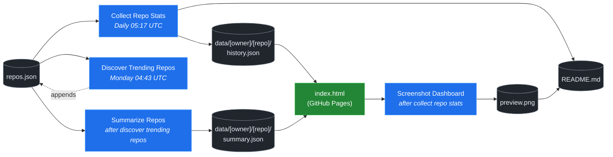

# 🚀 Rising Repos Tracker

> Automatically tracks daily GitHub stats (stars, forks, issues, velocity) for rising open source repos.

[](https://www.telosignal.com/)


**[→ View Live Dashboard](https://patrick-creates.github.io/rising-repos-tracker/)**

Built and maintained by [Telosignal](https://www.telosignal.com/).


<!-- AUTOGEN-STATS-START -->
## 📊 Current snapshot

> Auto-updated daily — last refreshed 2026-06-20

| Metric | Value |
|---|---|
| Repos tracked | **106** |
| Total stars | **6,096,479** |
| Total forks | **977,899** |
| Fastest growing | **headroom** (+2314.8/day) |

### 🔥 Top 5 by velocity

| # | Repo | Stars | Stars/day |
|---|---|---:|---:|
| 1 | [chopratejas/headroom](https://github.com/chopratejas/headroom) | 39,737 | +2314.8 |
| 2 | [NousResearch/hermes-agent](https://github.com/NousResearch/hermes-agent) | 197,841 | +1310.4 |
| 3 | [mvanhorn/last30days-skill](https://github.com/mvanhorn/last30days-skill) | 44,870 | +1016.6 |
| 4 | [affaan-m/ECC](https://github.com/affaan-m/ECC) | 218,422 | +1007.4 |
| 5 | [Panniantong/Agent-Reach](https://github.com/Panniantong/Agent-Reach) | 35,337 | +988.3 |

### 🆕 Recently added

- [elder-plinius/CL4R1T4S](https://github.com/elder-plinius/CL4R1T4S) — added 2026-06-15 — LEAKED SYSTEM PROMPTS FOR CHATGPT, CLAUDE, GEMINI, GROK, PERPLEXITY, CURSOR, LOVABLE, REPLIT, AND MORE! - AI SYSTEMS TRANSPARENCY FOR ALL! 👐
- [chopratejas/headroom](https://github.com/chopratejas/headroom) — added 2026-06-15 — Compress tool outputs, logs, files, and RAG chunks before they reach the LLM. 60-95% fewer tokens, same answers. Library, proxy, MCP server.
- [alibaba/page-agent](https://github.com/alibaba/page-agent) — added 2026-06-15 — JavaScript in-page GUI agent. Control web interfaces with natural language.
<!-- AUTOGEN-STATS-END -->

<!-- AUTOGEN-DIAGRAM-START -->
## 🔄 How it works


<!-- AUTOGEN-DIAGRAM-END -->

<!-- AUTOGEN-WORKFLOWS-START -->
## ⚙️ Workflows

| File | Schedule | Name |
|---|---|---|
| `collect.yml` | Daily 05:17 UTC | Collect Repo Stats |
| `discover.yml` | Monday 04:43 UTC | Discover Trending Repos |
| `screenshot.yml` | After Collect Repo Stats | Screenshot Dashboard |
| `summarize.yml` | After Discover Trending Repos | Summarize Repos |

> All workflows commit results directly back to the repo. Schedules are best-effort — GitHub Actions cron can drift by a few minutes.
<!-- AUTOGEN-WORKFLOWS-END -->

<!-- AUTOGEN-REPOS-START -->
## 📋 All tracked repos

| Repo | Stars | Forks | Stars/day |
|---|---:|---:|---:|
| [openclaw/openclaw](https://github.com/openclaw/openclaw) | 379,559 | 79,467 | +212.8 |
| [affaan-m/everything-claude-code](https://github.com/affaan-m/everything-claude-code) | 218,422 | 33,510 | +983.5 |
| [affaan-m/ECC](https://github.com/affaan-m/ECC) | 218,422 | 33,510 | +1007.4 |
| [NousResearch/hermes-agent](https://github.com/NousResearch/hermes-agent) | 197,841 | 35,060 | +1310.4 |
| [Significant-Gravitas/AutoGPT](https://github.com/Significant-Gravitas/AutoGPT) | 185,044 | 46,126 | +20.1 |
| [f/prompts.chat](https://github.com/f/prompts.chat) | 163,969 | 21,255 | +47.3 |
| [microsoft/markitdown](https://github.com/microsoft/markitdown) | 156,243 | 10,868 | +874.6 |
| [langgenius/dify](https://github.com/langgenius/dify) | 145,894 | 22,942 | +122.9 |
| [open-webui/open-webui](https://github.com/open-webui/open-webui) | 142,323 | 20,457 | +142.9 |
| [langchain-ai/langchain](https://github.com/langchain-ai/langchain) | 139,741 | 23,172 | +81.7 |
| [github/spec-kit](https://github.com/github/spec-kit) | 114,218 | 10,082 | +430.4 |
| [microsoft/generative-ai-for-beginners](https://github.com/microsoft/generative-ai-for-beginners) | 112,158 | 60,247 | +37.0 |
| [farion1231/cc-switch](https://github.com/farion1231/cc-switch) | 104,904 | 6,935 | +935.2 |
| [nextlevelbuilder/ui-ux-pro-max-skill](https://github.com/nextlevelbuilder/ui-ux-pro-max-skill) | 94,040 | 9,846 | +424.9 |
| [ChatGPTNextWeb/NextChat](https://github.com/ChatGPTNextWeb/NextChat) | 88,277 | 59,546 | +7.3 |
| [vllm-project/vllm](https://github.com/vllm-project/vllm) | 83,379 | 18,252 | +92.0 |
| [thedotmack/claude-mem](https://github.com/thedotmack/claude-mem) | 83,299 | 7,210 | +208.4 |
| [lobehub/lobehub](https://github.com/lobehub/lobehub) | 78,881 | 15,456 | +49.6 |
| [OpenHands/OpenHands](https://github.com/OpenHands/OpenHands) | 77,808 | 9,889 | +117.5 |
| [dair-ai/Prompt-Engineering-Guide](https://github.com/dair-ai/Prompt-Engineering-Guide) | 75,764 | 8,251 | +32.2 |
| [JuliusBrussee/caveman](https://github.com/JuliusBrussee/caveman) | 74,965 | 4,231 | +407.7 |
| [ruvnet/RuView](https://github.com/ruvnet/RuView) | 74,775 | 9,963 | +341.6 |
| [openai/openai-cookbook](https://github.com/openai/openai-cookbook) | 74,271 | 12,576 | +20.1 |
| [nexu-io/open-design](https://github.com/nexu-io/open-design) | 68,034 | 7,626 | +723.0 |
| [shareAI-lab/learn-claude-code](https://github.com/shareAI-lab/learn-claude-code) | 67,537 | 10,974 | +195.8 |
| [unslothai/unsloth](https://github.com/unslothai/unsloth) | 66,929 | 6,012 | +73.6 |
| [xtekky/gpt4free](https://github.com/xtekky/gpt4free) | 66,372 | 13,573 | +4.0 |
| [ComposioHQ/awesome-claude-skills](https://github.com/ComposioHQ/awesome-claude-skills) | 65,274 | 7,249 | +148.1 |
| [rtk-ai/rtk](https://github.com/rtk-ai/rtk) | 64,012 | 3,944 | +437.4 |
| [code-yeongyu/oh-my-openagent](https://github.com/code-yeongyu/oh-my-openagent) | 62,983 | 5,094 | +141.1 |
| [datawhalechina/hello-agents](https://github.com/datawhalechina/hello-agents) | 60,470 | 7,446 | +297.3 |
| [shanraisshan/claude-code-best-practice](https://github.com/shanraisshan/claude-code-best-practice) | 58,367 | 5,865 | +147.5 |
| [koala73/worldmonitor](https://github.com/koala73/worldmonitor) | 57,492 | 9,152 | +94.7 |
| [MemPalace/mempalace](https://github.com/MemPalace/mempalace) | 56,039 | 7,257 | +110.3 |
| [Fission-AI/OpenSpec](https://github.com/Fission-AI/OpenSpec) | 55,720 | 3,903 | +210.1 |
| [santifer/career-ops](https://github.com/santifer/career-ops) | 54,804 | 10,865 | +289.6 |
| [FlowiseAI/Flowise](https://github.com/FlowiseAI/Flowise) | 53,751 | 24,550 | +25.8 |
| [tw93/Pake](https://github.com/tw93/Pake) | 52,633 | 10,622 | +116.8 |
| [BerriAI/litellm](https://github.com/BerriAI/litellm) | 50,942 | 9,010 | +107.7 |
| [ggml-org/whisper.cpp](https://github.com/ggml-org/whisper.cpp) | 50,888 | 5,682 | +32.2 |
| [Leonxlnx/taste-skill](https://github.com/Leonxlnx/taste-skill) | 47,280 | 3,286 | +887.7 |
| [hesreallyhim/awesome-claude-code](https://github.com/hesreallyhim/awesome-claude-code) | 46,878 | 4,093 | +84.3 |
| [Aider-AI/aider](https://github.com/Aider-AI/aider) | 46,491 | 4,627 | +46.4 |
| [zhayujie/CowAgent](https://github.com/zhayujie/CowAgent) | 45,480 | 10,218 | +28.0 |
| [mvanhorn/last30days-skill](https://github.com/mvanhorn/last30days-skill) | 44,870 | 3,696 | +1016.6 |
| [HKUDS/nanobot](https://github.com/HKUDS/nanobot) | 44,469 | 7,858 | +54.2 |
| [ChromeDevTools/chrome-devtools-mcp](https://github.com/ChromeDevTools/chrome-devtools-mcp) | 44,031 | 2,839 | +125.7 |
| [asgeirtj/system_prompts_leaks](https://github.com/asgeirtj/system_prompts_leaks) | 43,699 | 7,246 | +100.4 |
| [ZhuLinsen/daily_stock_analysis](https://github.com/ZhuLinsen/daily_stock_analysis) | 43,254 | 40,920 | +169.8 |
| [elder-plinius/CL4R1T4S](https://github.com/elder-plinius/CL4R1T4S) | 42,659 | 8,562 | +753.6 |
| [sickn33/antigravity-awesome-skills](https://github.com/sickn33/antigravity-awesome-skills) | 41,175 | 6,628 | +96.0 |
| [chatboxai/chatbox](https://github.com/chatboxai/chatbox) | 40,564 | 4,113 | +17.2 |
| [chopratejas/headroom](https://github.com/chopratejas/headroom) | 39,737 | 2,721 | +2314.8 |
| [danny-avila/LibreChat](https://github.com/danny-avila/LibreChat) | 39,508 | 8,095 | +78.4 |
| [QuantumNous/new-api](https://github.com/QuantumNous/new-api) | 39,407 | 8,978 | +155.8 |
| [Hmbown/CodeWhale](https://github.com/Hmbown/CodeWhale) | 38,717 | 3,330 | +155.7 |
| [chatanywhere/GPT_API_free](https://github.com/chatanywhere/GPT_API_free) | 38,511 | 2,652 | +13.7 |
| [router-for-me/CLIProxyAPI](https://github.com/router-for-me/CLIProxyAPI) | 37,936 | 6,273 | +122.8 |
| [wshobson/agents](https://github.com/wshobson/agents) | 36,974 | 3,994 | +39.9 |
| [google/langextract](https://github.com/google/langextract) | 36,923 | 2,548 | +14.2 |
| [Yeachan-Heo/oh-my-claudecode](https://github.com/Yeachan-Heo/oh-my-claudecode) | 36,669 | 3,322 | +71.0 |
| [kepano/obsidian-skills](https://github.com/kepano/obsidian-skills) | 36,172 | 2,572 | +120.4 |
| [Panniantong/Agent-Reach](https://github.com/Panniantong/Agent-Reach) | 35,337 | 2,811 | +988.3 |
| [github/awesome-copilot](https://github.com/github/awesome-copilot) | 35,328 | 4,362 | +58.5 |
| [songquanpeng/one-api](https://github.com/songquanpeng/one-api) | 35,100 | 6,650 | +34.2 |
| [AstrBotDevs/AstrBot](https://github.com/AstrBotDevs/AstrBot) | 34,974 | 2,410 | +72.9 |
| [PDFMathTranslate/PDFMathTranslate](https://github.com/PDFMathTranslate/PDFMathTranslate) | 34,960 | 3,121 | +36.4 |
| [rohitg00/ai-engineering-from-scratch](https://github.com/rohitg00/ai-engineering-from-scratch) | 34,860 | 5,686 | +447.2 |
| [coreyhaines31/marketingskills](https://github.com/coreyhaines31/marketingskills) | 34,202 | 5,600 | +145.5 |
| [zeroclaw-labs/zeroclaw](https://github.com/zeroclaw-labs/zeroclaw) | 31,962 | 4,739 | +15.1 |
| [jamiepine/voicebox](https://github.com/jamiepine/voicebox) | 30,731 | 3,810 | +89.9 |
| [anthropics/claude-plugins-official](https://github.com/anthropics/claude-plugins-official) | 30,462 | 3,317 | +76.4 |
| [Gitlawb/openclaude](https://github.com/Gitlawb/openclaude) | 29,198 | 8,788 | +55.9 |
| [heygen-com/hyperframes](https://github.com/heygen-com/hyperframes) | 28,955 | 2,735 | +282.8 |
| [voideditor/void](https://github.com/voideditor/void) | 28,814 | 2,544 | +0.5 |
| [iOfficeAI/AionUi](https://github.com/iOfficeAI/AionUi) | 28,540 | 2,813 | +62.7 |
| [AlexsJones/llmfit](https://github.com/AlexsJones/llmfit) | 28,338 | 1,735 | +70.4 |
| [googleworkspace/cli](https://github.com/googleworkspace/cli) | 27,162 | 1,430 | +23.4 |
| [BloopAI/vibe-kanban](https://github.com/BloopAI/vibe-kanban) | 27,067 | 2,867 | +18.8 |
| [usestrix/strix](https://github.com/usestrix/strix) | 26,063 | 2,932 | +18.6 |
| [volcengine/OpenViking](https://github.com/volcengine/OpenViking) | 25,835 | 2,002 | +42.3 |
| [zai-org/Open-AutoGLM](https://github.com/zai-org/Open-AutoGLM) | 25,574 | 3,984 | +9.3 |
| [jarrodwatts/claude-hud](https://github.com/jarrodwatts/claude-hud) | 25,461 | 1,158 | +64.3 |
| [p-e-w/heretic](https://github.com/p-e-w/heretic) | 25,228 | 2,715 | +104.7 |
| [langchain-ai/deepagents](https://github.com/langchain-ai/deepagents) | 24,853 | 3,506 | +58.2 |
| [jackwener/OpenCLI](https://github.com/jackwener/OpenCLI) | 24,810 | 2,475 | +84.2 |
| [toon-format/toon](https://github.com/toon-format/toon) | 24,612 | 1,092 | +9.7 |
| [rohitg00/agentmemory](https://github.com/rohitg00/agentmemory) | 23,489 | 1,931 | +138.7 |
| [esengine/DeepSeek-Reasonix](https://github.com/esengine/DeepSeek-Reasonix) | 23,263 | 1,403 | +311.4 |
| [winfunc/opcode](https://github.com/winfunc/opcode) | 22,069 | 1,708 | +5.3 |
| [coze-dev/coze-studio](https://github.com/coze-dev/coze-studio) | 21,004 | 3,055 | +4.7 |
| [NirDiamant/agents-towards-production](https://github.com/NirDiamant/agents-towards-production) | 20,788 | 2,763 | +12.8 |
| [agentscope-ai/QwenPaw](https://github.com/agentscope-ai/QwenPaw) | 19,580 | 2,646 | +360.4 |
| [tirth8205/code-review-graph](https://github.com/tirth8205/code-review-graph) | 18,710 | 2,007 | +39.2 |
| [alibaba/page-agent](https://github.com/alibaba/page-agent) | 18,676 | 1,608 | +23.6 |
| [tanweai/pua](https://github.com/tanweai/pua) | 18,354 | 1,105 | +21.6 |
| [decolua/9router](https://github.com/decolua/9router) | 18,036 | 2,824 | +93.0 |
| [RightNow-AI/openfang](https://github.com/RightNow-AI/openfang) | 17,865 | 2,270 | +7.8 |
| [mksglu/context-mode](https://github.com/mksglu/context-mode) | 17,804 | 1,259 | +67.2 |
| [microsoft/agent-lightning](https://github.com/microsoft/agent-lightning) | 17,318 | 1,517 | +1.4 |
| [JCodesMore/ai-website-cloner-template](https://github.com/JCodesMore/ai-website-cloner-template) | 17,244 | 2,680 | +50.2 |
| [datawhalechina/easy-vibe](https://github.com/datawhalechina/easy-vibe) | 17,134 | 1,617 | +38.6 |
| [jundot/omlx](https://github.com/jundot/omlx) | 16,867 | 1,429 | +47.0 |
| [Tencent/WeKnora](https://github.com/Tencent/WeKnora) | 16,494 | 2,129 | +40.4 |
| [cft0808/edict](https://github.com/cft0808/edict) | 16,097 | 1,697 | +7.0 |
| [frankbria/ralph-claude-code](https://github.com/frankbria/ralph-claude-code) | 9,413 | 723 | +7.9 |
<!-- AUTOGEN-REPOS-END -->

---

## What it does

- Collects daily snapshots of stars, forks, watchers and open issues for every tracked repo
- Discovers new trending repos automatically every Monday using the GitHub Search API
- Generates AI summaries (use cases, similar tools, tags) for each tracked repo via GitHub Models
- Stores all history as plain JSON — no database, no backend
- Renders a live dashboard via GitHub Pages — updates daily, zero maintenance

## Tracked repos

Data lives in [`data/`](./data) — one folder per repo, one `history.json` per entry.  
The full watch list is in [`repos.json`](./repos.json).

## Fork & use it for yourself

This is my personal tracker — the watch list reflects what I find interesting. If you want to track different repos, the best path is to **fork this repo and run your own**.

### Setup

1. Fork this repo to your account
2. Replace the contents of [`repos.json`](./repos.json) with the repos you want to track (or just leave one entry — `discover.yml` will auto-add more every Monday)
3. Go to **Settings → Pages** and enable GitHub Pages from the `main` branch
4. Go to **Actions** and run **Collect Repo Stats** once manually to seed your first data point
5. Your dashboard will be live at `https://YOUR-USERNAME.github.io/rising-repos-tracker/`

That's it — daily collection and weekly discovery run automatically on schedule. Zero ongoing maintenance.

### Customizing what gets discovered

Edit [`scripts/discover.js`](./scripts/discover.js) to change:

- `MIN_STARS` — minimum star threshold for candidates
- `MAX_AGE_DAYS` — how recent a repo must be
- `MAX_NEW_REPOS` — how many to add per discovery run
- The `queries` array — GitHub Search API queries that define what "trending" means to you

### Adding a repo manually

Just edit `repos.json` directly:

```json
{
  "owner": "OWNER",
  "repo": "REPO",
  "added": "YYYY-MM-DD",
  "notes": "why you're tracking this"
}
```

The next daily collect run picks it up automatically.

## Stack

- **GitHub Actions** — scheduling and automation
- **GitHub Pages** — dashboard hosting
- **GitHub API** — data source
- **GitHub Models** — free AI summaries (gpt-4o-mini)
- **Chart.js** — star growth visualization
- **Mermaid** — architecture diagram (rendered by GitHub)
- No dependencies, no build step, no database

## License

MIT
