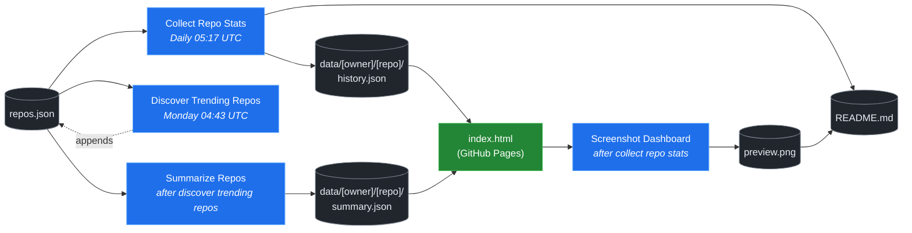

# 🚀 Rising Repos Tracker

> Automatically tracks daily GitHub stats (stars, forks, issues, velocity) for rising open source repos.

[](https://www.telosignal.com/)


**[→ View Live Dashboard](https://patrick-creates.github.io/rising-repos-tracker/)**

Built and maintained by [Telosignal](https://www.telosignal.com/).


<!-- AUTOGEN-STATS-START -->
## 📊 Current snapshot

> Auto-updated daily — last refreshed 2026-07-06

| Metric | Value |
|---|---|
| Repos tracked | **151** |
| Total stars | **7,350,280** |
| Total forks | **1,126,790** |
| Fastest growing | **ponytail** (+1952.2/day) |

### 🔥 Top 5 by velocity

| # | Repo | Stars | Stars/day |
|---|---|---:|---:|
| 1 | [DietrichGebert/ponytail](https://github.com/DietrichGebert/ponytail) | 75,350 | +1952.2 |
| 2 | [chopratejas/headroom](https://github.com/chopratejas/headroom) | 56,945 | +1370.6 |
| 3 | [NousResearch/hermes-agent](https://github.com/NousResearch/hermes-agent) | 209,961 | +1146.6 |
| 4 | [Panniantong/Agent-Reach](https://github.com/Panniantong/Agent-Reach) | 51,665 | +1006.7 |
| 5 | [DeusData/codebase-memory-mcp](https://github.com/DeusData/codebase-memory-mcp) | 27,005 | +910.7 |

### 🆕 Recently added

- [stablyai/orca](https://github.com/stablyai/orca) — added 2026-07-06 — Orca is the ADE for working with a fleet of parallel agents. Run any coding agent with your own subscription. Available on desktop and mobile.
- [ogulcancelik/herdr](https://github.com/ogulcancelik/herdr) — added 2026-07-06 — agent multiplexer that lives in your terminal.
- [diegosouzapw/OmniRoute](https://github.com/diegosouzapw/OmniRoute) — added 2026-07-06 — Never stop coding. Free AI gateway: one endpoint, 231+ providers (50+ free), connect Claude Code, Codex, Cursor, Cline & Copilot to FREE Claude/GPT/Gemini. RTK+Caveman stacked compression saves 15-95% tokens, smart auto-fallback, MCP/A2A, multimodal APIs, Desktop/PWA.
<!-- AUTOGEN-STATS-END -->

<!-- AUTOGEN-DIAGRAM-START -->
## 🔄 How it works


<!-- AUTOGEN-DIAGRAM-END -->

<!-- AUTOGEN-WORKFLOWS-START -->
## ⚙️ Workflows

| File | Schedule | Name |
|---|---|---|
| `collect.yml` | Daily 05:17 UTC | Collect Repo Stats |
| `discover.yml` | Monday 04:43 UTC | Discover Trending Repos |
| `screenshot.yml` | After Collect Repo Stats | Screenshot Dashboard |
| `summarize.yml` | After Discover Trending Repos | Summarize Repos |

> All workflows commit results directly back to the repo. Schedules are best-effort — GitHub Actions cron can drift by a few minutes.
<!-- AUTOGEN-WORKFLOWS-END -->

<!-- AUTOGEN-REPOS-START -->
## 📋 All tracked repos

| Repo | Stars | Forks | Stars/day |
|---|---:|---:|---:|
| [openclaw/openclaw](https://github.com/openclaw/openclaw) | 381,881 | 80,104 | +192.8 |
| [obra/superpowers](https://github.com/obra/superpowers) | 247,296 | 21,939 | +837.1 |
| [affaan-m/everything-claude-code](https://github.com/affaan-m/everything-claude-code) | 226,457 | 34,633 | +840.9 |
| [affaan-m/ECC](https://github.com/affaan-m/ECC) | 226,457 | 34,633 | +815.0 |
| [NousResearch/hermes-agent](https://github.com/NousResearch/hermes-agent) | 209,961 | 38,409 | +1146.6 |
| [Significant-Gravitas/AutoGPT](https://github.com/Significant-Gravitas/AutoGPT) | 185,398 | 46,123 | +20.7 |
| [f/prompts.chat](https://github.com/f/prompts.chat) | 164,838 | 21,336 | +49.4 |
| [microsoft/markitdown](https://github.com/microsoft/markitdown) | 163,295 | 11,567 | +746.1 |
| [langgenius/dify](https://github.com/langgenius/dify) | 147,866 | 23,287 | +123.0 |
| [open-webui/open-webui](https://github.com/open-webui/open-webui) | 144,379 | 20,865 | +138.6 |
| [langchain-ai/langchain](https://github.com/langchain-ai/langchain) | 141,071 | 23,442 | +82.1 |
| [github/spec-kit](https://github.com/github/spec-kit) | 118,275 | 10,474 | +378.0 |
| [farion1231/cc-switch](https://github.com/farion1231/cc-switch) | 113,739 | 7,587 | +810.1 |
| [microsoft/generative-ai-for-beginners](https://github.com/microsoft/generative-ai-for-beginners) | 112,691 | 60,517 | +35.9 |
| [nextlevelbuilder/ui-ux-pro-max-skill](https://github.com/nextlevelbuilder/ui-ux-pro-max-skill) | 101,418 | 10,687 | +435.6 |
| [ChatGPTNextWeb/NextChat](https://github.com/ChatGPTNextWeb/NextChat) | 88,392 | 59,505 | +7.2 |
| [thedotmack/claude-mem](https://github.com/thedotmack/claude-mem) | 86,067 | 7,449 | +197.9 |
| [vllm-project/vllm](https://github.com/vllm-project/vllm) | 85,455 | 19,007 | +103.2 |
| [JuliusBrussee/caveman](https://github.com/JuliusBrussee/caveman) | 85,277 | 4,742 | +485.0 |
| [OpenHands/OpenHands](https://github.com/OpenHands/OpenHands) | 79,573 | 10,151 | +115.1 |
| [lobehub/lobehub](https://github.com/lobehub/lobehub) | 79,524 | 15,562 | +46.8 |
| [ruvnet/RuView](https://github.com/ruvnet/RuView) | 76,892 | 10,308 | +261.9 |
| [dair-ai/Prompt-Engineering-Guide](https://github.com/dair-ai/Prompt-Engineering-Guide) | 76,239 | 8,344 | +31.4 |
| [nexu-io/open-design](https://github.com/nexu-io/open-design) | 75,365 | 8,616 | +636.6 |
| [DietrichGebert/ponytail](https://github.com/DietrichGebert/ponytail) | 75,350 | 3,988 | +1952.2 |
| [openai/openai-cookbook](https://github.com/openai/openai-cookbook) | 74,565 | 12,615 | +19.5 |
| [shareAI-lab/learn-claude-code](https://github.com/shareAI-lab/learn-claude-code) | 70,002 | 11,403 | +182.1 |
| [rtk-ai/rtk](https://github.com/rtk-ai/rtk) | 68,788 | 4,267 | +392.0 |
| [unslothai/unsloth](https://github.com/unslothai/unsloth) | 67,840 | 6,105 | +68.2 |
| [ComposioHQ/awesome-claude-skills](https://github.com/ComposioHQ/awesome-claude-skills) | 66,940 | 7,474 | +133.7 |
| [xtekky/gpt4free](https://github.com/xtekky/gpt4free) | 66,461 | 13,553 | +4.5 |
| [code-yeongyu/oh-my-openagent](https://github.com/code-yeongyu/oh-my-openagent) | 64,981 | 5,307 | +135.8 |
| [datawhalechina/hello-agents](https://github.com/datawhalechina/hello-agents) | 64,242 | 7,966 | +277.2 |
| [shanraisshan/claude-code-best-practice](https://github.com/shanraisshan/claude-code-best-practice) | 62,079 | 6,200 | +175.1 |
| [koala73/worldmonitor](https://github.com/koala73/worldmonitor) | 61,432 | 9,562 | +144.2 |
| [tw93/Pake](https://github.com/tw93/Pake) | 59,375 | 11,937 | +216.2 |
| [Fission-AI/OpenSpec](https://github.com/Fission-AI/OpenSpec) | 58,917 | 4,097 | +206.7 |
| [santifer/career-ops](https://github.com/santifer/career-ops) | 58,743 | 11,525 | +275.4 |
| [Leonxlnx/taste-skill](https://github.com/Leonxlnx/taste-skill) | 58,137 | 3,968 | +792.1 |
| [MemPalace/mempalace](https://github.com/MemPalace/mempalace) | 57,006 | 7,364 | +94.0 |
| [chopratejas/headroom](https://github.com/chopratejas/headroom) | 56,945 | 4,182 | +1370.6 |
| [headroomlabs-ai/headroom](https://github.com/headroomlabs-ai/headroom) | 56,945 | 4,182 | +788.7 |
| [ZhuLinsen/daily_stock_analysis](https://github.com/ZhuLinsen/daily_stock_analysis) | 54,912 | 47,482 | +382.7 |
| [FlowiseAI/Flowise](https://github.com/FlowiseAI/Flowise) | 54,315 | 24,652 | +28.9 |
| [BerriAI/litellm](https://github.com/BerriAI/litellm) | 52,727 | 9,509 | +109.0 |
| [Panniantong/Agent-Reach](https://github.com/Panniantong/Agent-Reach) | 51,665 | 4,144 | +1006.7 |
| [ggml-org/whisper.cpp](https://github.com/ggml-org/whisper.cpp) | 51,332 | 5,724 | +30.7 |
| [asgeirtj/system_prompts_leaks](https://github.com/asgeirtj/system_prompts_leaks) | 50,551 | 8,245 | +207.5 |
| [mvanhorn/last30days-skill](https://github.com/mvanhorn/last30days-skill) | 49,408 | 4,110 | +597.8 |
| [hesreallyhim/awesome-claude-code](https://github.com/hesreallyhim/awesome-claude-code) | 48,617 | 4,252 | +92.3 |
| [Aider-AI/aider](https://github.com/Aider-AI/aider) | 47,098 | 4,704 | +43.6 |
| [ChromeDevTools/chrome-devtools-mcp](https://github.com/ChromeDevTools/chrome-devtools-mcp) | 45,997 | 2,992 | +124.8 |
| [zhayujie/CowAgent](https://github.com/zhayujie/CowAgent) | 45,818 | 10,253 | +25.8 |
| [HKUDS/nanobot](https://github.com/HKUDS/nanobot) | 45,054 | 7,948 | +48.4 |
| [elder-plinius/CL4R1T4S](https://github.com/elder-plinius/CL4R1T4S) | 44,774 | 9,110 | +280.1 |
| [sickn33/antigravity-awesome-skills](https://github.com/sickn33/antigravity-awesome-skills) | 42,424 | 6,762 | +89.2 |
| [QuantumNous/new-api](https://github.com/QuantumNous/new-api) | 41,259 | 9,532 | +140.5 |
| [chatboxai/chatbox](https://github.com/chatboxai/chatbox) | 40,885 | 4,138 | +18.1 |
| [danny-avila/LibreChat](https://github.com/danny-avila/LibreChat) | 40,338 | 8,266 | +68.3 |
| [kepano/obsidian-skills](https://github.com/kepano/obsidian-skills) | 39,919 | 2,840 | +172.4 |
| [Hmbown/CodeWhale](https://github.com/Hmbown/CodeWhale) | 39,492 | 3,401 | +114.8 |
| [router-for-me/CLIProxyAPI](https://github.com/router-for-me/CLIProxyAPI) | 39,315 | 6,497 | +108.8 |
| [chatanywhere/GPT_API_free](https://github.com/chatanywhere/GPT_API_free) | 38,688 | 2,661 | +12.7 |
| [jamiepine/voicebox](https://github.com/jamiepine/voicebox) | 38,100 | 4,572 | +259.4 |
| [wshobson/agents](https://github.com/wshobson/agents) | 37,566 | 4,034 | +38.8 |
| [usestrix/strix](https://github.com/usestrix/strix) | 37,561 | 3,808 | +338.6 |
| [Yeachan-Heo/oh-my-claudecode](https://github.com/Yeachan-Heo/oh-my-claudecode) | 37,451 | 3,376 | +62.5 |
| [rohitg00/ai-engineering-from-scratch](https://github.com/rohitg00/ai-engineering-from-scratch) | 37,437 | 6,220 | +316.4 |
| [google/langextract](https://github.com/google/langextract) | 37,009 | 2,554 | +10.8 |
| [coreyhaines31/marketingskills](https://github.com/coreyhaines31/marketingskills) | 36,714 | 5,910 | +150.7 |
| [langchain-ai/langgraph](https://github.com/langchain-ai/langgraph) | 36,605 | 6,133 | +84.6 |
| [github/awesome-copilot](https://github.com/github/awesome-copilot) | 36,217 | 4,504 | +57.4 |
| [AstrBotDevs/AstrBot](https://github.com/AstrBotDevs/AstrBot) | 35,883 | 2,481 | +65.5 |
| [songquanpeng/one-api](https://github.com/songquanpeng/one-api) | 35,522 | 6,717 | +31.2 |
| [PDFMathTranslate/PDFMathTranslate](https://github.com/PDFMathTranslate/PDFMathTranslate) | 35,423 | 3,162 | +33.5 |
| [calesthio/OpenMontage](https://github.com/calesthio/OpenMontage) | 33,948 | 3,889 | +871.0 |
| [heygen-com/hyperframes](https://github.com/heygen-com/hyperframes) | 33,385 | 3,113 | +279.4 |
| [zeroclaw-labs/zeroclaw](https://github.com/zeroclaw-labs/zeroclaw) | 32,164 | 4,792 | +13.9 |
| [anthropics/claude-plugins-official](https://github.com/anthropics/claude-plugins-official) | 31,629 | 3,480 | +74.8 |
| [Gitlawb/openclaude](https://github.com/Gitlawb/openclaude) | 29,797 | 8,859 | +47.5 |
| [googleworkspace/cli](https://github.com/googleworkspace/cli) | 29,432 | 1,692 | +77.5 |
| [iOfficeAI/AionUi](https://github.com/iOfficeAI/AionUi) | 29,335 | 2,925 | +56.8 |
| [AlexsJones/llmfit](https://github.com/AlexsJones/llmfit) | 29,134 | 1,780 | +60.9 |
| [voideditor/void](https://github.com/voideditor/void) | 28,825 | 2,570 | +0.6 |
| [BloopAI/vibe-kanban](https://github.com/BloopAI/vibe-kanban) | 27,281 | 2,888 | +16.3 |
| [DeusData/codebase-memory-mcp](https://github.com/DeusData/codebase-memory-mcp) | 27,005 | 2,005 | +910.7 |
| [volcengine/OpenViking](https://github.com/volcengine/OpenViking) | 26,345 | 2,046 | +36.3 |
| [jarrodwatts/claude-hud](https://github.com/jarrodwatts/claude-hud) | 26,179 | 1,199 | +53.2 |
| [jackwener/OpenCLI](https://github.com/jackwener/OpenCLI) | 26,113 | 2,588 | +82.6 |
| [esengine/DeepSeek-Reasonix](https://github.com/esengine/DeepSeek-Reasonix) | 26,113 | 1,625 | +235.3 |
| [JCodesMore/ai-website-cloner-template](https://github.com/JCodesMore/ai-website-cloner-template) | 25,985 | 3,662 | +428.2 |
| [p-e-w/heretic](https://github.com/p-e-w/heretic) | 25,821 | 2,803 | +66.0 |
| [langchain-ai/deepagents](https://github.com/langchain-ai/deepagents) | 25,768 | 3,622 | +57.6 |
| [zai-org/Open-AutoGLM](https://github.com/zai-org/Open-AutoGLM) | 25,703 | 4,001 | +8.6 |
| [toon-format/toon](https://github.com/toon-format/toon) | 24,777 | 1,100 | +10.0 |
| [mukul975/Anthropic-Cybersecurity-Skills](https://github.com/mukul975/Anthropic-Cybersecurity-Skills) | 24,679 | 2,813 | +468.4 |
| [rohitg00/agentmemory](https://github.com/rohitg00/agentmemory) | 24,630 | 2,026 | +100.2 |
| [alibaba/page-agent](https://github.com/alibaba/page-agent) | 24,317 | 2,087 | +274.2 |
| [winfunc/opcode](https://github.com/winfunc/opcode) | 22,146 | 1,709 | +5.0 |
| [coze-dev/coze-studio](https://github.com/coze-dev/coze-studio) | 21,111 | 3,069 | +5.8 |
| [NirDiamant/agents-towards-production](https://github.com/NirDiamant/agents-towards-production) | 20,912 | 2,781 | +9.9 |
| [agentscope-ai/QwenPaw](https://github.com/agentscope-ai/QwenPaw) | 20,640 | 2,731 | +136.3 |
| [decolua/9router](https://github.com/decolua/9router) | 20,131 | 3,262 | +121.9 |
| [tirth8205/code-review-graph](https://github.com/tirth8205/code-review-graph) | 19,218 | 2,056 | +33.5 |
| [tanweai/pua](https://github.com/tanweai/pua) | 18,653 | 1,121 | +19.4 |
| [mksglu/context-mode](https://github.com/mksglu/context-mode) | 18,625 | 1,302 | +55.1 |
| [pranshuparmar/witr](https://github.com/pranshuparmar/witr) | 18,165 | 564 | +19.0 |
| [HKUDS/Vibe-Trading](https://github.com/HKUDS/Vibe-Trading) | 18,059 | 2,985 | +474.4 |
| [RightNow-AI/openfang](https://github.com/RightNow-AI/openfang) | 17,973 | 2,278 | +7.0 |
| [datawhalechina/easy-vibe](https://github.com/datawhalechina/easy-vibe) | 17,840 | 1,689 | +42.8 |
| [Tencent/WeKnora](https://github.com/Tencent/WeKnora) | 17,829 | 2,403 | +73.2 |
| [jundot/omlx](https://github.com/jundot/omlx) | 17,546 | 1,484 | +43.5 |
| [microsoft/agent-lightning](https://github.com/microsoft/agent-lightning) | 17,370 | 1,520 | +2.8 |
| [jnMetaCode/agency-agents-zh](https://github.com/jnMetaCode/agency-agents-zh) | 16,696 | 2,855 | +92.1 |
| [steipete/CodexBar](https://github.com/steipete/CodexBar) | 16,463 | 1,362 | +90.0 |
| [danielmiessler/LifeOS](https://github.com/danielmiessler/LifeOS) | 16,371 | 2,247 | +21.8 |
| [can1357/oh-my-pi](https://github.com/can1357/oh-my-pi) | 16,276 | 1,444 | +162.9 |
| [cft0808/edict](https://github.com/cft0808/edict) | 16,154 | 1,700 | +4.4 |
| [browser-use/browser-harness](https://github.com/browser-use/browser-harness) | 15,758 | 1,465 | +39.9 |
| [nesquena/hermes-webui](https://github.com/nesquena/hermes-webui) | 15,546 | 2,034 | +50.6 |
| [MemoriLabs/Memori](https://github.com/MemoriLabs/Memori) | 15,537 | 2,771 | +13.9 |
| [kyegomez/OpenMythos](https://github.com/kyegomez/OpenMythos) | 14,628 | 3,297 | +33.8 |
| [xpzouying/xiaohongshu-mcp](https://github.com/xpzouying/xiaohongshu-mcp) | 14,538 | 2,160 | +17.9 |
| [yusufkaraaslan/Skill_Seekers](https://github.com/yusufkaraaslan/Skill_Seekers) | 14,375 | 1,470 | +10.6 |
| [NevaMind-AI/memU](https://github.com/NevaMind-AI/memU) | 13,985 | 1,040 | +6.1 |
| [wanshuiyin/Auto-claude-code-research-in-sleep](https://github.com/wanshuiyin/Auto-claude-code-research-in-sleep) | 13,042 | 1,179 | +38.3 |
| [stablyai/orca](https://github.com/stablyai/orca) | 12,583 | 853 | +113.2 |
| [ogulcancelik/herdr](https://github.com/ogulcancelik/herdr) | 12,397 | 722 | +123.8 |
| [superset-sh/superset](https://github.com/superset-sh/superset) | 12,275 | 1,059 | +16.4 |
| [diegosouzapw/OmniRoute](https://github.com/diegosouzapw/OmniRoute) | 12,152 | 1,763 | +85.5 |
| [XiaomiMiMo/MiMo-Code](https://github.com/XiaomiMiMo/MiMo-Code) | 11,501 | 1,125 | +68.1 |
| [sirmalloc/ccstatusline](https://github.com/sirmalloc/ccstatusline) | 11,493 | 501 | +30.4 |
| [ValueCell-ai/valuecell](https://github.com/ValueCell-ai/valuecell) | 10,897 | 1,806 | +3.6 |
| [xbtlin/ai-berkshire](https://github.com/xbtlin/ai-berkshire) | 10,777 | 1,379 | +120.9 |
| [aden-hive/hive](https://github.com/aden-hive/hive) | 10,637 | 5,646 | +3.6 |
| [EverMind-AI/EverOS](https://github.com/EverMind-AI/EverOS) | 10,355 | 837 | +91.4 |
| [0x4m4/hexstrike-ai](https://github.com/0x4m4/hexstrike-ai) | 10,170 | 2,143 | +22.9 |
| [MemTensor/MemOS](https://github.com/MemTensor/MemOS) | 10,110 | 917 | +11.9 |
| [alibaba/open-code-review](https://github.com/alibaba/open-code-review) | 9,987 | 651 | +203.8 |
| [Kuberwastaken/claurst](https://github.com/Kuberwastaken/claurst) | 9,975 | 7,787 | +15.6 |
| [walkinglabs/learn-harness-engineering](https://github.com/walkinglabs/learn-harness-engineering) | 9,885 | 1,068 | +100.9 |
| [frankbria/ralph-claude-code](https://github.com/frankbria/ralph-claude-code) | 9,504 | 726 | +7.3 |
| [brokermr810/QuantDinger](https://github.com/brokermr810/QuantDinger) | 9,283 | 1,951 | +49.1 |
| [ConardLi/garden-skills](https://github.com/ConardLi/garden-skills) | 9,181 | 1,233 | +122.4 |
| [ykdojo/claude-code-tips](https://github.com/ykdojo/claude-code-tips) | 9,017 | 694 | +41.0 |
| [EKKOLearnAI/hermes-studio](https://github.com/EKKOLearnAI/hermes-studio) | 8,860 | 1,098 | +103.0 |
| [EvoMap/evolver](https://github.com/EvoMap/evolver) | 8,855 | 819 | +57.1 |
| [iflytek/astron-agent](https://github.com/iflytek/astron-agent) | 8,610 | 860 | +29.7 |
| [getagentseal/codeburn](https://github.com/getagentseal/codeburn) | 8,471 | 666 | +102.0 |
| [iOfficeAI/OfficeCLI](https://github.com/iOfficeAI/OfficeCLI) | 8,397 | 626 | +74.3 |
| [MiroMindAI/MiroThinker](https://github.com/MiroMindAI/MiroThinker) | 8,326 | 642 | +25.1 |
<!-- AUTOGEN-REPOS-END -->

---

## What it does

- Collects daily snapshots of stars, forks, watchers and open issues for every tracked repo
- Discovers new trending repos automatically every Monday using the GitHub Search API
- Generates AI summaries (use cases, similar tools, tags) for each tracked repo via GitHub Models
- Stores all history as plain JSON — no database, no backend
- Renders a live dashboard via GitHub Pages — updates daily, zero maintenance

## Tracked repos

Data lives in [`data/`](./data) — one folder per repo, one `history.json` per entry.  
The full watch list is in [`repos.json`](./repos.json).

## Fork & use it for yourself

This is my personal tracker — the watch list reflects what I find interesting. If you want to track different repos, the best path is to **fork this repo and run your own**.

### Setup

1. Fork this repo to your account
2. Replace the contents of [`repos.json`](./repos.json) with the repos you want to track (or just leave one entry — `discover.yml` will auto-add more every Monday)
3. Go to **Settings → Pages** and enable GitHub Pages from the `main` branch
4. Go to **Actions** and run **Collect Repo Stats** once manually to seed your first data point
5. Your dashboard will be live at `https://YOUR-USERNAME.github.io/rising-repos-tracker/`

That's it — daily collection and weekly discovery run automatically on schedule. Zero ongoing maintenance.

### Customizing what gets discovered

Edit [`scripts/discover.js`](./scripts/discover.js) to change:

- `MIN_STARS` — minimum star threshold for candidates
- `MAX_AGE_DAYS` — how recent a repo must be
- `MAX_NEW_REPOS` — how many to add per discovery run
- The `queries` array — GitHub Search API queries that define what "trending" means to you

### Adding a repo manually

Just edit `repos.json` directly:

```json
{
  "owner": "OWNER",
  "repo": "REPO",
  "added": "YYYY-MM-DD",
  "notes": "why you're tracking this"
}
```

The next daily collect run picks it up automatically.

## Stack

- **GitHub Actions** — scheduling and automation
- **GitHub Pages** — dashboard hosting
- **GitHub API** — data source
- **GitHub Models** — free AI summaries (gpt-4o-mini)
- **Chart.js** — star growth visualization
- **Mermaid** — architecture diagram (rendered by GitHub)
- No dependencies, no build step, no database

## License

MIT
