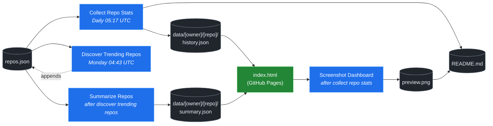

# 🚀 Rising Repos Tracker

> Automatically tracks daily GitHub stats (stars, forks, issues, velocity) for rising open source repos.

[](https://www.telosignal.com/)


**[→ View Live Dashboard](https://patrick-creates.github.io/rising-repos-tracker/)**

Built and maintained by [Telosignal](https://www.telosignal.com/).


<!-- AUTOGEN-STATS-START -->
## 📊 Current snapshot

> Auto-updated daily — last refreshed 2026-07-03

| Metric | Value |
|---|---|
| Repos tracked | **136** |
| Total stars | **7,140,624** |
| Total forks | **1,103,400** |
| Fastest growing | **ponytail** (+2194.8/day) |

### 🔥 Top 5 by velocity

| # | Repo | Stars | Stars/day |
|---|---|---:|---:|
| 1 | [DietrichGebert/ponytail](https://github.com/DietrichGebert/ponytail) | 72,162 | +2194.8 |
| 2 | [chopratejas/headroom](https://github.com/chopratejas/headroom) | 55,989 | +1545.9 |
| 3 | [NousResearch/hermes-agent](https://github.com/NousResearch/hermes-agent) | 208,292 | +1181.3 |
| 4 | [DeusData/codebase-memory-mcp](https://github.com/DeusData/codebase-memory-mcp) | 25,067 | +1109.3 |
| 5 | [Panniantong/Agent-Reach](https://github.com/Panniantong/Agent-Reach) | 49,422 | +1037.8 |

### 🆕 Recently added

- [calesthio/OpenMontage](https://github.com/calesthio/OpenMontage) — added 2026-06-29 — World's first open-source, agentic video production system. 12 pipelines, 52 tools, 500+ agent skills. Turn your AI coding assistant into a full video production studio.
- [DeusData/codebase-memory-mcp](https://github.com/DeusData/codebase-memory-mcp) — added 2026-06-29 — High-performance code intelligence MCP server. Indexes codebases into a persistent knowledge graph — average repo in milliseconds. 158 languages, sub-ms queries, 99% fewer tokens. Single static binary, zero dependencies.
- [pranshuparmar/witr](https://github.com/pranshuparmar/witr) — added 2026-06-29 — Why is this running?
<!-- AUTOGEN-STATS-END -->

<!-- AUTOGEN-DIAGRAM-START -->
## 🔄 How it works


<!-- AUTOGEN-DIAGRAM-END -->

<!-- AUTOGEN-WORKFLOWS-START -->
## ⚙️ Workflows

| File | Schedule | Name |
|---|---|---|
| `collect.yml` | Daily 05:17 UTC | Collect Repo Stats |
| `discover.yml` | Monday 04:43 UTC | Discover Trending Repos |
| `screenshot.yml` | After Collect Repo Stats | Screenshot Dashboard |
| `summarize.yml` | After Discover Trending Repos | Summarize Repos |

> All workflows commit results directly back to the repo. Schedules are best-effort — GitHub Actions cron can drift by a few minutes.
<!-- AUTOGEN-WORKFLOWS-END -->

<!-- AUTOGEN-REPOS-START -->
## 📋 All tracked repos

| Repo | Stars | Forks | Stars/day |
|---|---:|---:|---:|
| [openclaw/openclaw](https://github.com/openclaw/openclaw) | 381,548 | 79,972 | +197.6 |
| [obra/superpowers](https://github.com/obra/superpowers) | 244,914 | 21,710 | +848.8 |
| [affaan-m/everything-claude-code](https://github.com/affaan-m/everything-claude-code) | 225,399 | 34,480 | +869.6 |
| [affaan-m/ECC](https://github.com/affaan-m/ECC) | 225,399 | 34,480 | +850.5 |
| [NousResearch/hermes-agent](https://github.com/NousResearch/hermes-agent) | 208,292 | 37,903 | +1181.3 |
| [Significant-Gravitas/AutoGPT](https://github.com/Significant-Gravitas/AutoGPT) | 185,299 | 46,119 | +20.0 |
| [f/prompts.chat](https://github.com/f/prompts.chat) | 164,669 | 21,306 | +49.0 |
| [microsoft/markitdown](https://github.com/microsoft/markitdown) | 162,572 | 11,490 | +775.8 |
| [langgenius/dify](https://github.com/langgenius/dify) | 147,502 | 23,222 | +123.1 |
| [open-webui/open-webui](https://github.com/open-webui/open-webui) | 143,965 | 20,786 | +138.7 |
| [langchain-ai/langchain](https://github.com/langchain-ai/langchain) | 140,806 | 23,375 | +81.8 |
| [github/spec-kit](https://github.com/github/spec-kit) | 117,575 | 10,396 | +386.5 |
| [farion1231/cc-switch](https://github.com/farion1231/cc-switch) | 112,623 | 7,478 | +838.7 |
| [microsoft/generative-ai-for-beginners](https://github.com/microsoft/generative-ai-for-beginners) | 112,596 | 60,474 | +36.2 |
| [nextlevelbuilder/ui-ux-pro-max-skill](https://github.com/nextlevelbuilder/ui-ux-pro-max-skill) | 100,139 | 10,545 | +436.2 |
| [ChatGPTNextWeb/NextChat](https://github.com/ChatGPTNextWeb/NextChat) | 88,368 | 59,504 | +7.2 |
| [thedotmack/claude-mem](https://github.com/thedotmack/claude-mem) | 85,593 | 7,399 | +200.3 |
| [vllm-project/vllm](https://github.com/vllm-project/vllm) | 85,237 | 18,864 | +105.0 |
| [JuliusBrussee/caveman](https://github.com/JuliusBrussee/caveman) | 81,910 | 4,572 | +443.4 |
| [lobehub/lobehub](https://github.com/lobehub/lobehub) | 79,401 | 15,539 | +47.1 |
| [OpenHands/OpenHands](https://github.com/OpenHands/OpenHands) | 79,230 | 10,081 | +115.2 |
| [ruvnet/RuView](https://github.com/ruvnet/RuView) | 76,249 | 10,207 | +265.5 |
| [dair-ai/Prompt-Engineering-Guide](https://github.com/dair-ai/Prompt-Engineering-Guide) | 76,173 | 8,339 | +32.0 |
| [openai/openai-cookbook](https://github.com/openai/openai-cookbook) | 74,520 | 12,612 | +19.8 |
| [nexu-io/open-design](https://github.com/nexu-io/open-design) | 74,484 | 8,492 | +658.9 |
| [DietrichGebert/ponytail](https://github.com/DietrichGebert/ponytail) | 72,162 | 3,745 | +2194.8 |
| [shareAI-lab/learn-claude-code](https://github.com/shareAI-lab/learn-claude-code) | 69,689 | 11,363 | +187.2 |
| [rtk-ai/rtk](https://github.com/rtk-ai/rtk) | 68,109 | 4,211 | +402.8 |
| [unslothai/unsloth](https://github.com/unslothai/unsloth) | 67,764 | 6,092 | +71.0 |
| [ComposioHQ/awesome-claude-skills](https://github.com/ComposioHQ/awesome-claude-skills) | 66,683 | 7,427 | +136.8 |
| [xtekky/gpt4free](https://github.com/xtekky/gpt4free) | 66,461 | 13,558 | +4.8 |
| [code-yeongyu/oh-my-openagent](https://github.com/code-yeongyu/oh-my-openagent) | 64,653 | 5,279 | +137.5 |
| [datawhalechina/hello-agents](https://github.com/datawhalechina/hello-agents) | 63,707 | 7,888 | +283.6 |
| [shanraisshan/claude-code-best-practice](https://github.com/shanraisshan/claude-code-best-practice) | 61,889 | 6,191 | +182.4 |
| [koala73/worldmonitor](https://github.com/koala73/worldmonitor) | 61,239 | 9,532 | +149.4 |
| [tw93/Pake](https://github.com/tw93/Pake) | 59,050 | 11,847 | +223.3 |
| [Fission-AI/OpenSpec](https://github.com/Fission-AI/OpenSpec) | 58,480 | 4,062 | +210.7 |
| [santifer/career-ops](https://github.com/santifer/career-ops) | 58,194 | 11,421 | +281.5 |
| [MemPalace/mempalace](https://github.com/MemPalace/mempalace) | 56,904 | 7,352 | +97.9 |
| [chopratejas/headroom](https://github.com/chopratejas/headroom) | 55,989 | 4,072 | +1545.9 |
| [headroomlabs-ai/headroom](https://github.com/headroomlabs-ai/headroom) | 55,989 | 4,072 | +916.9 |
| [Leonxlnx/taste-skill](https://github.com/Leonxlnx/taste-skill) | 55,238 | 3,783 | +775.8 |
| [FlowiseAI/Flowise](https://github.com/FlowiseAI/Flowise) | 54,233 | 24,630 | +29.0 |
| [ZhuLinsen/daily_stock_analysis](https://github.com/ZhuLinsen/daily_stock_analysis) | 53,670 | 46,484 | +380.3 |
| [BerriAI/litellm](https://github.com/BerriAI/litellm) | 52,488 | 9,417 | +110.9 |
| [ggml-org/whisper.cpp](https://github.com/ggml-org/whisper.cpp) | 51,243 | 5,711 | +30.8 |
| [Panniantong/Agent-Reach](https://github.com/Panniantong/Agent-Reach) | 49,422 | 3,933 | +1037.8 |
| [mvanhorn/last30days-skill](https://github.com/mvanhorn/last30days-skill) | 48,581 | 4,019 | +636.4 |
| [asgeirtj/system_prompts_leaks](https://github.com/asgeirtj/system_prompts_leaks) | 47,929 | 7,802 | +164.0 |
| [hesreallyhim/awesome-claude-code](https://github.com/hesreallyhim/awesome-claude-code) | 47,845 | 4,189 | +81.5 |
| [Aider-AI/aider](https://github.com/Aider-AI/aider) | 46,980 | 4,683 | +43.9 |
| [zhayujie/CowAgent](https://github.com/zhayujie/CowAgent) | 45,766 | 10,251 | +26.3 |
| [ChromeDevTools/chrome-devtools-mcp](https://github.com/ChromeDevTools/chrome-devtools-mcp) | 45,247 | 2,940 | +116.6 |
| [HKUDS/nanobot](https://github.com/HKUDS/nanobot) | 44,980 | 7,932 | +50.0 |
| [elder-plinius/CL4R1T4S](https://github.com/elder-plinius/CL4R1T4S) | 44,415 | 9,037 | +306.9 |
| [sickn33/antigravity-awesome-skills](https://github.com/sickn33/antigravity-awesome-skills) | 42,265 | 6,755 | +92.0 |
| [QuantumNous/new-api](https://github.com/QuantumNous/new-api) | 40,968 | 9,454 | +143.9 |
| [chatboxai/chatbox](https://github.com/chatboxai/chatbox) | 40,853 | 4,132 | +18.6 |
| [danny-avila/LibreChat](https://github.com/danny-avila/LibreChat) | 40,190 | 8,237 | +69.8 |
| [kepano/obsidian-skills](https://github.com/kepano/obsidian-skills) | 39,496 | 2,803 | +175.4 |
| [Hmbown/CodeWhale](https://github.com/Hmbown/CodeWhale) | 39,355 | 3,395 | +120.1 |
| [router-for-me/CLIProxyAPI](https://github.com/router-for-me/CLIProxyAPI) | 39,024 | 6,456 | +109.7 |
| [chatanywhere/GPT_API_free](https://github.com/chatanywhere/GPT_API_free) | 38,661 | 2,660 | +12.9 |
| [wshobson/agents](https://github.com/wshobson/agents) | 37,461 | 4,023 | +39.1 |
| [Yeachan-Heo/oh-my-claudecode](https://github.com/Yeachan-Heo/oh-my-claudecode) | 37,350 | 3,370 | +64.8 |
| [rohitg00/ai-engineering-from-scratch](https://github.com/rohitg00/ai-engineering-from-scratch) | 37,198 | 6,156 | +338.6 |
| [jamiepine/voicebox](https://github.com/jamiepine/voicebox) | 37,159 | 4,468 | +254.3 |
| [google/langextract](https://github.com/google/langextract) | 36,996 | 2,551 | +11.3 |
| [langchain-ai/langgraph](https://github.com/langchain-ai/langgraph) | 36,371 | 6,083 | +86.5 |
| [github/awesome-copilot](https://github.com/github/awesome-copilot) | 36,121 | 4,481 | +59.4 |
| [coreyhaines31/marketingskills](https://github.com/coreyhaines31/marketingskills) | 35,907 | 5,846 | +139.7 |
| [AstrBotDevs/AstrBot](https://github.com/AstrBotDevs/AstrBot) | 35,755 | 2,468 | +67.7 |
| [songquanpeng/one-api](https://github.com/songquanpeng/one-api) | 35,469 | 6,713 | +32.3 |
| [PDFMathTranslate/PDFMathTranslate](https://github.com/PDFMathTranslate/PDFMathTranslate) | 35,370 | 3,160 | +34.8 |
| [usestrix/strix](https://github.com/usestrix/strix) | 33,155 | 3,441 | +232.7 |
| [heygen-com/hyperframes](https://github.com/heygen-com/hyperframes) | 32,857 | 3,052 | +291.8 |
| [zeroclaw-labs/zeroclaw](https://github.com/zeroclaw-labs/zeroclaw) | 32,124 | 4,791 | +14.0 |
| [calesthio/OpenMontage](https://github.com/calesthio/OpenMontage) | 31,990 | 3,628 | +1034.8 |
| [anthropics/claude-plugins-official](https://github.com/anthropics/claude-plugins-official) | 31,478 | 3,444 | +77.1 |
| [Gitlawb/openclaude](https://github.com/Gitlawb/openclaude) | 29,712 | 8,851 | +49.3 |
| [googleworkspace/cli](https://github.com/googleworkspace/cli) | 29,330 | 1,673 | +81.6 |
| [iOfficeAI/AionUi](https://github.com/iOfficeAI/AionUi) | 29,216 | 2,912 | +58.4 |
| [AlexsJones/llmfit](https://github.com/AlexsJones/llmfit) | 29,014 | 1,777 | +62.9 |
| [voideditor/void](https://github.com/voideditor/void) | 28,825 | 2,567 | +0.6 |
| [BloopAI/vibe-kanban](https://github.com/BloopAI/vibe-kanban) | 27,249 | 2,875 | +16.8 |
| [volcengine/OpenViking](https://github.com/volcengine/OpenViking) | 26,287 | 2,042 | +38.4 |
| [jarrodwatts/claude-hud](https://github.com/jarrodwatts/claude-hud) | 26,106 | 1,192 | +56.6 |
| [jackwener/OpenCLI](https://github.com/jackwener/OpenCLI) | 25,915 | 2,570 | +84.6 |
| [esengine/DeepSeek-Reasonix](https://github.com/esengine/DeepSeek-Reasonix) | 25,793 | 1,589 | +250.7 |
| [p-e-w/heretic](https://github.com/p-e-w/heretic) | 25,748 | 2,790 | +71.0 |
| [zai-org/Open-AutoGLM](https://github.com/zai-org/Open-AutoGLM) | 25,683 | 3,998 | +8.8 |
| [langchain-ai/deepagents](https://github.com/langchain-ai/deepagents) | 25,617 | 3,604 | +58.5 |
| [JCodesMore/ai-website-cloner-template](https://github.com/JCodesMore/ai-website-cloner-template) | 25,071 | 3,534 | +448.8 |
| [DeusData/codebase-memory-mcp](https://github.com/DeusData/codebase-memory-mcp) | 25,067 | 1,856 | +1109.3 |
| [toon-format/toon](https://github.com/toon-format/toon) | 24,759 | 1,098 | +10.5 |
| [rohitg00/agentmemory](https://github.com/rohitg00/agentmemory) | 24,493 | 2,014 | +106.7 |
| [mukul975/Anthropic-Cybersecurity-Skills](https://github.com/mukul975/Anthropic-Cybersecurity-Skills) | 24,046 | 2,729 | +538.5 |
| [winfunc/opcode](https://github.com/winfunc/opcode) | 22,132 | 1,708 | +5.1 |
| [alibaba/page-agent](https://github.com/alibaba/page-agent) | 21,830 | 1,869 | +181.8 |
| [coze-dev/coze-studio](https://github.com/coze-dev/coze-studio) | 21,098 | 3,068 | +6.0 |
| [NirDiamant/agents-towards-production](https://github.com/NirDiamant/agents-towards-production) | 20,901 | 2,779 | +10.7 |
| [agentscope-ai/QwenPaw](https://github.com/agentscope-ai/QwenPaw) | 20,495 | 2,719 | +150.9 |
| [decolua/9router](https://github.com/decolua/9router) | 19,577 | 3,170 | +111.4 |
| [tirth8205/code-review-graph](https://github.com/tirth8205/code-review-graph) | 19,116 | 2,046 | +33.4 |
| [tanweai/pua](https://github.com/tanweai/pua) | 18,610 | 1,115 | +20.2 |
| [mksglu/context-mode](https://github.com/mksglu/context-mode) | 18,512 | 1,297 | +58.0 |
| [pranshuparmar/witr](https://github.com/pranshuparmar/witr) | 18,145 | 564 | +28.3 |
| [RightNow-AI/openfang](https://github.com/RightNow-AI/openfang) | 17,962 | 2,279 | +7.6 |
| [Tencent/WeKnora](https://github.com/Tencent/WeKnora) | 17,711 | 2,376 | +78.8 |
| [datawhalechina/easy-vibe](https://github.com/datawhalechina/easy-vibe) | 17,708 | 1,674 | +42.6 |
| [HKUDS/Vibe-Trading](https://github.com/HKUDS/Vibe-Trading) | 17,557 | 2,903 | +704.8 |
| [jundot/omlx](https://github.com/jundot/omlx) | 17,429 | 1,473 | +44.3 |
| [microsoft/agent-lightning](https://github.com/microsoft/agent-lightning) | 17,368 | 1,521 | +3.2 |
| [jnMetaCode/agency-agents-zh](https://github.com/jnMetaCode/agency-agents-zh) | 16,480 | 2,823 | +97.6 |
| [danielmiessler/LifeOS](https://github.com/danielmiessler/LifeOS) | 16,278 | 2,236 | +19.3 |
| [cft0808/edict](https://github.com/cft0808/edict) | 16,147 | 1,701 | +4.7 |
| [can1357/oh-my-pi](https://github.com/can1357/oh-my-pi) | 15,751 | 1,405 | +159.5 |
| [steipete/CodexBar](https://github.com/steipete/CodexBar) | 15,715 | 1,316 | +46.5 |
| [browser-use/browser-harness](https://github.com/browser-use/browser-harness) | 15,648 | 1,454 | +42.3 |
| [MemoriLabs/Memori](https://github.com/MemoriLabs/Memori) | 15,527 | 2,771 | +16.7 |
| [nesquena/hermes-webui](https://github.com/nesquena/hermes-webui) | 15,368 | 2,000 | +48.2 |
| [kyegomez/OpenMythos](https://github.com/kyegomez/OpenMythos) | 14,576 | 3,289 | +38.3 |
| [xpzouying/xiaohongshu-mcp](https://github.com/xpzouying/xiaohongshu-mcp) | 14,490 | 2,157 | +18.5 |
| [yusufkaraaslan/Skill_Seekers](https://github.com/yusufkaraaslan/Skill_Seekers) | 14,344 | 1,467 | +10.7 |
| [NevaMind-AI/memU](https://github.com/NevaMind-AI/memU) | 13,969 | 1,038 | +6.3 |
| [wanshuiyin/Auto-claude-code-research-in-sleep](https://github.com/wanshuiyin/Auto-claude-code-research-in-sleep) | 12,953 | 1,177 | +44.8 |
| [superset-sh/superset](https://github.com/superset-sh/superset) | 12,229 | 1,053 | +17.3 |
| [sirmalloc/ccstatusline](https://github.com/sirmalloc/ccstatusline) | 11,417 | 498 | +34.3 |
| [XiaomiMiMo/MiMo-Code](https://github.com/XiaomiMiMo/MiMo-Code) | 11,317 | 1,106 | +73.3 |
| [ValueCell-ai/valuecell](https://github.com/ValueCell-ai/valuecell) | 10,898 | 1,805 | +6.5 |
| [aden-hive/hive](https://github.com/aden-hive/hive) | 10,635 | 5,646 | +5.8 |
| [0x4m4/hexstrike-ai](https://github.com/0x4m4/hexstrike-ai) | 10,129 | 2,138 | +29.8 |
| [EverMind-AI/EverOS](https://github.com/EverMind-AI/EverOS) | 10,110 | 832 | +98.8 |
| [MemTensor/MemOS](https://github.com/MemTensor/MemOS) | 10,086 | 915 | +14.8 |
| [Kuberwastaken/claurst](https://github.com/Kuberwastaken/claurst) | 9,940 | 7,781 | +18.5 |
| [frankbria/ralph-claude-code](https://github.com/frankbria/ralph-claude-code) | 9,500 | 725 | +7.6 |
<!-- AUTOGEN-REPOS-END -->

---

## What it does

- Collects daily snapshots of stars, forks, watchers and open issues for every tracked repo
- Discovers new trending repos automatically every Monday using the GitHub Search API
- Generates AI summaries (use cases, similar tools, tags) for each tracked repo via GitHub Models
- Stores all history as plain JSON — no database, no backend
- Renders a live dashboard via GitHub Pages — updates daily, zero maintenance

## Tracked repos

Data lives in [`data/`](./data) — one folder per repo, one `history.json` per entry.  
The full watch list is in [`repos.json`](./repos.json).

## Fork & use it for yourself

This is my personal tracker — the watch list reflects what I find interesting. If you want to track different repos, the best path is to **fork this repo and run your own**.

### Setup

1. Fork this repo to your account
2. Replace the contents of [`repos.json`](./repos.json) with the repos you want to track (or just leave one entry — `discover.yml` will auto-add more every Monday)
3. Go to **Settings → Pages** and enable GitHub Pages from the `main` branch
4. Go to **Actions** and run **Collect Repo Stats** once manually to seed your first data point
5. Your dashboard will be live at `https://YOUR-USERNAME.github.io/rising-repos-tracker/`

That's it — daily collection and weekly discovery run automatically on schedule. Zero ongoing maintenance.

### Customizing what gets discovered

Edit [`scripts/discover.js`](./scripts/discover.js) to change:

- `MIN_STARS` — minimum star threshold for candidates
- `MAX_AGE_DAYS` — how recent a repo must be
- `MAX_NEW_REPOS` — how many to add per discovery run
- The `queries` array — GitHub Search API queries that define what "trending" means to you

### Adding a repo manually

Just edit `repos.json` directly:

```json
{
  "owner": "OWNER",
  "repo": "REPO",
  "added": "YYYY-MM-DD",
  "notes": "why you're tracking this"
}
```

The next daily collect run picks it up automatically.

## Stack

- **GitHub Actions** — scheduling and automation
- **GitHub Pages** — dashboard hosting
- **GitHub API** — data source
- **GitHub Models** — free AI summaries (gpt-4o-mini)
- **Chart.js** — star growth visualization
- **Mermaid** — architecture diagram (rendered by GitHub)
- No dependencies, no build step, no database

## License

MIT
