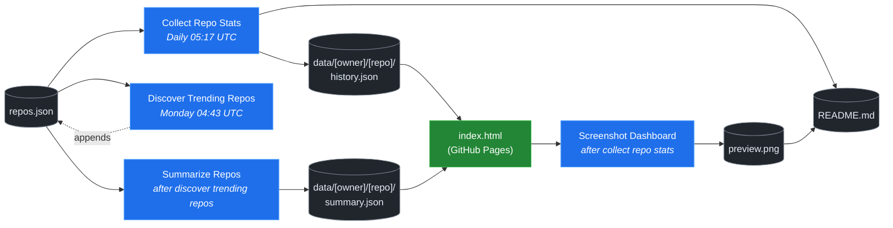

# 🚀 Rising Repos Tracker

> Automatically tracks daily GitHub stats (stars, forks, issues, velocity) for rising open source repos.

[](https://www.telosignal.com/)


**[→ View Live Dashboard](https://patrick-creates.github.io/rising-repos-tracker/)**

Built and maintained by [Telosignal](https://www.telosignal.com/).


<!-- AUTOGEN-STATS-START -->
## 📊 Current snapshot

> Auto-updated daily — last refreshed 2026-05-30

| Metric | Value |
|---|---|
| Repos tracked | **61** |
| Total stars | **4,654,060** |
| Total forks | **813,823** |
| Fastest growing | **hermes-agent** (+1474.8/day) |

### 🔥 Top 5 by velocity

| # | Repo | Stars | Stars/day |
|---|---|---:|---:|
| 1 | [NousResearch/hermes-agent](https://github.com/NousResearch/hermes-agent) | 173,116 | +1474.8 |
| 2 | [affaan-m/ECC](https://github.com/affaan-m/ECC) | 198,782 | +1310.6 |
| 3 | [affaan-m/everything-claude-code](https://github.com/affaan-m/everything-claude-code) | 198,782 | +1043.2 |
| 4 | [nexu-io/open-design](https://github.com/nexu-io/open-design) | 55,615 | +953.4 |
| 5 | [farion1231/cc-switch](https://github.com/farion1231/cc-switch) | 84,979 | +911.3 |

### 🆕 Recently added

- [affaan-m/ECC](https://github.com/affaan-m/ECC) — added 2026-05-25 — The agent harness performance optimization system. Skills, instincts, memory, security, and research-first development for Claude Code, Codex, Opencode, Cursor and beyond.
- [ruvnet/RuView](https://github.com/ruvnet/RuView) — added 2026-05-25 — π RuView turns commodity WiFi signals into real-time spatial intelligence, vital sign monitoring, and presence detection — all without a single pixel of video.
- [ZhuLinsen/daily_stock_analysis](https://github.com/ZhuLinsen/daily_stock_analysis) — added 2026-05-25 — LLM驱动的 A/H/美股智能分析：多数据源行情 + 实时新闻 + LLM决策仪表盘 + 多渠道推送，零成本定时运行，纯白嫖. LLM-powered stock analysis system for A/H/US markets.
<!-- AUTOGEN-STATS-END -->

<!-- AUTOGEN-DIAGRAM-START -->
## 🔄 How it works


<!-- AUTOGEN-DIAGRAM-END -->

<!-- AUTOGEN-WORKFLOWS-START -->
## ⚙️ Workflows

| File | Schedule | Name |
|---|---|---|
| `collect.yml` | Daily 05:17 UTC | Collect Repo Stats |
| `discover.yml` | Monday 04:43 UTC | Discover Trending Repos |
| `screenshot.yml` | After Collect Repo Stats | Screenshot Dashboard |
| `summarize.yml` | After Discover Trending Repos | Summarize Repos |

> All workflows commit results directly back to the repo. Schedules are best-effort — GitHub Actions cron can drift by a few minutes.
<!-- AUTOGEN-WORKFLOWS-END -->

<!-- AUTOGEN-REPOS-START -->
## 📋 All tracked repos

| Repo | Stars | Forks | Stars/day |
|---|---:|---:|---:|
| [openclaw/openclaw](https://github.com/openclaw/openclaw) | 375,556 | 78,387 | +240.3 |
| [affaan-m/everything-claude-code](https://github.com/affaan-m/everything-claude-code) | 198,782 | 30,543 | +1043.2 |
| [affaan-m/ECC](https://github.com/affaan-m/ECC) | 198,782 | 30,544 | +1310.6 |
| [Significant-Gravitas/AutoGPT](https://github.com/Significant-Gravitas/AutoGPT) | 184,648 | 46,203 | +21.6 |
| [NousResearch/hermes-agent](https://github.com/NousResearch/hermes-agent) | 173,116 | 29,223 | +1474.8 |
| [f/prompts.chat](https://github.com/f/prompts.chat) | 163,047 | 21,203 | +51.5 |
| [langgenius/dify](https://github.com/langgenius/dify) | 143,145 | 22,515 | +112.9 |
| [open-webui/open-webui](https://github.com/open-webui/open-webui) | 139,234 | 19,952 | +137.8 |
| [langchain-ai/langchain](https://github.com/langchain-ai/langchain) | 138,016 | 22,859 | +81.2 |
| [microsoft/markitdown](https://github.com/microsoft/markitdown) | 130,576 | 8,954 | +445.2 |
| [microsoft/generative-ai-for-beginners](https://github.com/microsoft/generative-ai-for-beginners) | 111,512 | 59,851 | +44.7 |
| [github/spec-kit](https://github.com/github/spec-kit) | 107,077 | 9,479 | +542.1 |
| [ChatGPTNextWeb/NextChat](https://github.com/ChatGPTNextWeb/NextChat) | 88,117 | 59,683 | +6.7 |
| [farion1231/cc-switch](https://github.com/farion1231/cc-switch) | 84,979 | 5,531 | +911.3 |
| [nextlevelbuilder/ui-ux-pro-max-skill](https://github.com/nextlevelbuilder/ui-ux-pro-max-skill) | 84,894 | 8,761 | +411.8 |
| [vllm-project/vllm](https://github.com/vllm-project/vllm) | 81,406 | 17,421 | +89.5 |
| [thedotmack/claude-mem](https://github.com/thedotmack/claude-mem) | 79,654 | 6,854 | +251.4 |
| [lobehub/lobehub](https://github.com/lobehub/lobehub) | 77,966 | 15,333 | +56.9 |
| [OpenHands/OpenHands](https://github.com/OpenHands/OpenHands) | 75,366 | 9,560 | +119.5 |
| [dair-ai/Prompt-Engineering-Guide](https://github.com/dair-ai/Prompt-Engineering-Guide) | 75,075 | 8,127 | +31.2 |
| [openai/openai-cookbook](https://github.com/openai/openai-cookbook) | 73,863 | 12,498 | +21.2 |
| [ruvnet/RuView](https://github.com/ruvnet/RuView) | 68,381 | 9,109 | +497.6 |
| [JuliusBrussee/caveman](https://github.com/JuliusBrussee/caveman) | 66,489 | 3,753 | +414.8 |
| [xtekky/gpt4free](https://github.com/xtekky/gpt4free) | 66,278 | 13,581 | +3.1 |
| [unslothai/unsloth](https://github.com/unslothai/unsloth) | 65,368 | 5,825 | +72.3 |
| [shareAI-lab/learn-claude-code](https://github.com/shareAI-lab/learn-claude-code) | 63,626 | 10,401 | +212.4 |
| [ComposioHQ/awesome-claude-skills](https://github.com/ComposioHQ/awesome-claude-skills) | 62,474 | 6,842 | +173.8 |
| [code-yeongyu/oh-my-openagent](https://github.com/code-yeongyu/oh-my-openagent) | 60,218 | 4,888 | +157.5 |
| [rtk-ai/rtk](https://github.com/rtk-ai/rtk) | 56,357 | 3,460 | +564.9 |
| [nexu-io/open-design](https://github.com/nexu-io/open-design) | 55,615 | 6,289 | +953.4 |
| [shanraisshan/claude-code-best-practice](https://github.com/shanraisshan/claude-code-best-practice) | 55,515 | 5,574 | +168.1 |
| [koala73/worldmonitor](https://github.com/koala73/worldmonitor) | 55,103 | 8,863 | +61.3 |
| [datawhalechina/hello-agents](https://github.com/datawhalechina/hello-agents) | 54,706 | 6,691 | +337.2 |
| [FlowiseAI/Flowise](https://github.com/FlowiseAI/Flowise) | 53,214 | 24,442 | +26.2 |
| [MemPalace/mempalace](https://github.com/MemPalace/mempalace) | 53,057 | 7,000 | +54.8 |
| [Fission-AI/OpenSpec](https://github.com/Fission-AI/OpenSpec) | 51,704 | 3,616 | +243.0 |
| [ggml-org/whisper.cpp](https://github.com/ggml-org/whisper.cpp) | 50,259 | 5,587 | +36.1 |
| [tw93/Pake](https://github.com/tw93/Pake) | 49,514 | 10,016 | +61.3 |
| [BerriAI/litellm](https://github.com/BerriAI/litellm) | 48,737 | 8,481 | +112.4 |
| [santifer/career-ops](https://github.com/santifer/career-ops) | 47,866 | 9,947 | +218.3 |
| [Aider-AI/aider](https://github.com/Aider-AI/aider) | 45,531 | 4,515 | +47.5 |
| [hesreallyhim/awesome-claude-code](https://github.com/hesreallyhim/awesome-claude-code) | 45,179 | 3,920 | +90.3 |
| [zhayujie/CowAgent](https://github.com/zhayujie/CowAgent) | 44,956 | 10,152 | +33.4 |
| [HKUDS/nanobot](https://github.com/HKUDS/nanobot) | 43,385 | 7,662 | +58.8 |
| [ChromeDevTools/chrome-devtools-mcp](https://github.com/ChromeDevTools/chrome-devtools-mcp) | 42,290 | 2,699 | +200.5 |
| [asgeirtj/system_prompts_leaks](https://github.com/asgeirtj/system_prompts_leaks) | 40,940 | 6,789 | +46.3 |
| [chatboxai/chatbox](https://github.com/chatboxai/chatbox) | 40,204 | 4,082 | +17.3 |
| [ZhuLinsen/daily_stock_analysis](https://github.com/ZhuLinsen/daily_stock_analysis) | 39,443 | 38,084 | +120.8 |
| [sickn33/antigravity-awesome-skills](https://github.com/sickn33/antigravity-awesome-skills) | 39,159 | 6,366 | +96.2 |
| [chatanywhere/GPT_API_free](https://github.com/chatanywhere/GPT_API_free) | 38,235 | 2,653 | +15.8 |
| [danny-avila/LibreChat](https://github.com/danny-avila/LibreChat) | 37,675 | 7,761 | +41.2 |
| [google/langextract](https://github.com/google/langextract) | 36,697 | 2,526 | +28.4 |
| [QuantumNous/new-api](https://github.com/QuantumNous/new-api) | 36,144 | 8,158 | +157.4 |
| [wshobson/agents](https://github.com/wshobson/agents) | 36,137 | 3,919 | +40.2 |
| [Hmbown/CodeWhale](https://github.com/Hmbown/CodeWhale) | 36,023 | 3,083 | +270.6 |
| [router-for-me/CLIProxyAPI](https://github.com/router-for-me/CLIProxyAPI) | 35,436 | 5,873 | +138.4 |
| [Yeachan-Heo/oh-my-claudecode](https://github.com/Yeachan-Heo/oh-my-claudecode) | 35,326 | 3,233 | +100.4 |
| [songquanpeng/one-api](https://github.com/songquanpeng/one-api) | 34,413 | 6,561 | +40.6 |
| [PDFMathTranslate/PDFMathTranslate](https://github.com/PDFMathTranslate/PDFMathTranslate) | 34,233 | 3,066 | +43.8 |
| [github/awesome-copilot](https://github.com/github/awesome-copilot) | 34,127 | 4,171 | +64.2 |
| [frankbria/ralph-claude-code](https://github.com/frankbria/ralph-claude-code) | 9,235 | 704 | +7.2 |
<!-- AUTOGEN-REPOS-END -->

---

## What it does

- Collects daily snapshots of stars, forks, watchers and open issues for every tracked repo
- Discovers new trending repos automatically every Monday using the GitHub Search API
- Generates AI summaries (use cases, similar tools, tags) for each tracked repo via GitHub Models
- Stores all history as plain JSON — no database, no backend
- Renders a live dashboard via GitHub Pages — updates daily, zero maintenance

## Tracked repos

Data lives in [`data/`](./data) — one folder per repo, one `history.json` per entry.  
The full watch list is in [`repos.json`](./repos.json).

## Fork & use it for yourself

This is my personal tracker — the watch list reflects what I find interesting. If you want to track different repos, the best path is to **fork this repo and run your own**.

### Setup

1. Fork this repo to your account
2. Replace the contents of [`repos.json`](./repos.json) with the repos you want to track (or just leave one entry — `discover.yml` will auto-add more every Monday)
3. Go to **Settings → Pages** and enable GitHub Pages from the `main` branch
4. Go to **Actions** and run **Collect Repo Stats** once manually to seed your first data point
5. Your dashboard will be live at `https://YOUR-USERNAME.github.io/rising-repos-tracker/`

That's it — daily collection and weekly discovery run automatically on schedule. Zero ongoing maintenance.

### Customizing what gets discovered

Edit [`scripts/discover.js`](./scripts/discover.js) to change:

- `MIN_STARS` — minimum star threshold for candidates
- `MAX_AGE_DAYS` — how recent a repo must be
- `MAX_NEW_REPOS` — how many to add per discovery run
- The `queries` array — GitHub Search API queries that define what "trending" means to you

### Adding a repo manually

Just edit `repos.json` directly:

```json
{
  "owner": "OWNER",
  "repo": "REPO",
  "added": "YYYY-MM-DD",
  "notes": "why you're tracking this"
}
```

The next daily collect run picks it up automatically.

## Stack

- **GitHub Actions** — scheduling and automation
- **GitHub Pages** — dashboard hosting
- **GitHub API** — data source
- **GitHub Models** — free AI summaries (gpt-4o-mini)
- **Chart.js** — star growth visualization
- **Mermaid** — architecture diagram (rendered by GitHub)
- No dependencies, no build step, no database

## License

MIT
