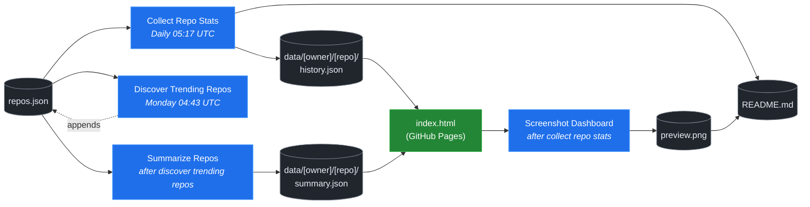

# 🚀 Rising Repos Tracker

> Automatically tracks daily GitHub stats (stars, forks, issues, velocity) for rising open source repos.

[](https://www.telosignal.com/)


**[→ View Live Dashboard](https://patrick-creates.github.io/rising-repos-tracker/)**

Built and maintained by [Telosignal](https://www.telosignal.com/).


<!-- AUTOGEN-STATS-START -->
## 📊 Current snapshot

> Auto-updated daily — last refreshed 2026-07-11

| Metric | Value |
|---|---|
| Repos tracked | **151** |
| Total stars | **7,471,098** |
| Total forks | **1,145,212** |
| Fastest growing | **ponytail** (+1699.8/day) |

### 🔥 Top 5 by velocity

| # | Repo | Stars | Stars/day |
|---|---|---:|---:|
| 1 | [DietrichGebert/ponytail](https://github.com/DietrichGebert/ponytail) | 80,316 | +1699.8 |
| 2 | [iOfficeAI/OfficeCLI](https://github.com/iOfficeAI/OfficeCLI) | 14,650 | +1250.6 |
| 3 | [chopratejas/headroom](https://github.com/chopratejas/headroom) | 58,462 | +1165.3 |
| 4 | [NousResearch/hermes-agent](https://github.com/NousResearch/hermes-agent) | 212,914 | +1099.5 |
| 5 | [Panniantong/Agent-Reach](https://github.com/Panniantong/Agent-Reach) | 54,610 | +943.4 |

### 🆕 Recently added

- [stablyai/orca](https://github.com/stablyai/orca) — added 2026-07-06 — Orca is the ADE for working with a fleet of parallel agents. Run any coding agent with your own subscription. Available on desktop and mobile.
- [ogulcancelik/herdr](https://github.com/ogulcancelik/herdr) — added 2026-07-06 — agent multiplexer that lives in your terminal.
- [diegosouzapw/OmniRoute](https://github.com/diegosouzapw/OmniRoute) — added 2026-07-06 — Never stop coding. Free AI gateway: one endpoint, 231+ providers (50+ free), connect Claude Code, Codex, Cursor, Cline & Copilot to FREE Claude/GPT/Gemini. RTK+Caveman stacked compression saves 15-95% tokens, smart auto-fallback, MCP/A2A, multimodal APIs, Desktop/PWA.
<!-- AUTOGEN-STATS-END -->

<!-- AUTOGEN-DIAGRAM-START -->
## 🔄 How it works


<!-- AUTOGEN-DIAGRAM-END -->

<!-- AUTOGEN-WORKFLOWS-START -->
## ⚙️ Workflows

| File | Schedule | Name |
|---|---|---|
| `collect.yml` | Daily 05:17 UTC | Collect Repo Stats |
| `discover.yml` | Monday 04:43 UTC | Discover Trending Repos |
| `screenshot.yml` | After Collect Repo Stats | Screenshot Dashboard |
| `summarize.yml` | After Discover Trending Repos | Summarize Repos |

> All workflows commit results directly back to the repo. Schedules are best-effort — GitHub Actions cron can drift by a few minutes.
<!-- AUTOGEN-WORKFLOWS-END -->

<!-- AUTOGEN-REPOS-START -->
## 📋 All tracked repos

| Repo | Stars | Forks | Stars/day |
|---|---:|---:|---:|
| [openclaw/openclaw](https://github.com/openclaw/openclaw) | 382,541 | 80,298 | +187.6 |
| [obra/superpowers](https://github.com/obra/superpowers) | 251,980 | 22,494 | +863.3 |
| [affaan-m/ECC](https://github.com/affaan-m/ECC) | 228,345 | 35,029 | +768.4 |
| [affaan-m/everything-claude-code](https://github.com/affaan-m/everything-claude-code) | 228,344 | 35,029 | +801.6 |
| [NousResearch/hermes-agent](https://github.com/NousResearch/hermes-agent) | 212,914 | 39,323 | +1099.5 |
| [Significant-Gravitas/AutoGPT](https://github.com/Significant-Gravitas/AutoGPT) | 185,462 | 46,111 | +20.0 |
| [f/prompts.chat](https://github.com/f/prompts.chat) | 165,362 | 21,396 | +54.1 |
| [microsoft/markitdown](https://github.com/microsoft/markitdown) | 164,719 | 11,731 | +707.0 |
| [langgenius/dify](https://github.com/langgenius/dify) | 148,466 | 23,404 | +122.7 |
| [open-webui/open-webui](https://github.com/open-webui/open-webui) | 145,018 | 21,000 | +137.7 |
| [langchain-ai/langchain](https://github.com/langchain-ai/langchain) | 141,494 | 23,514 | +82.4 |
| [github/spec-kit](https://github.com/github/spec-kit) | 119,410 | 10,584 | +365.2 |
| [farion1231/cc-switch](https://github.com/farion1231/cc-switch) | 115,778 | 7,750 | +772.9 |
| [microsoft/generative-ai-for-beginners](https://github.com/microsoft/generative-ai-for-beginners) | 112,864 | 60,624 | +35.8 |
| [nextlevelbuilder/ui-ux-pro-max-skill](https://github.com/nextlevelbuilder/ui-ux-pro-max-skill) | 104,142 | 11,006 | +444.9 |
| [ChatGPTNextWeb/NextChat](https://github.com/ChatGPTNextWeb/NextChat) | 88,438 | 59,463 | +7.4 |
| [JuliusBrussee/caveman](https://github.com/JuliusBrussee/caveman) | 87,867 | 5,047 | +488.1 |
| [thedotmack/claude-mem](https://github.com/thedotmack/claude-mem) | 86,800 | 7,497 | +193.6 |
| [vllm-project/vllm](https://github.com/vllm-project/vllm) | 85,947 | 19,258 | +102.8 |
| [OpenHands/OpenHands](https://github.com/OpenHands/OpenHands) | 80,419 | 10,259 | +120.1 |
| [DietrichGebert/ponytail](https://github.com/DietrichGebert/ponytail) | 80,316 | 4,327 | +1699.8 |
| [ruvnet/RuView](https://github.com/ruvnet/RuView) | 79,925 | 10,757 | +298.6 |
| [lobehub/lobehub](https://github.com/lobehub/lobehub) | 79,733 | 15,584 | +46.4 |
| [nexu-io/open-design](https://github.com/nexu-io/open-design) | 77,202 | 8,815 | +611.6 |
| [dair-ai/Prompt-Engineering-Guide](https://github.com/dair-ai/Prompt-Engineering-Guide) | 76,347 | 8,360 | +30.5 |
| [openai/openai-cookbook](https://github.com/openai/openai-cookbook) | 74,628 | 12,629 | +18.9 |
| [shareAI-lab/learn-claude-code](https://github.com/shareAI-lab/learn-claude-code) | 70,636 | 11,505 | +177.0 |
| [rtk-ai/rtk](https://github.com/rtk-ai/rtk) | 70,202 | 4,363 | +381.9 |
| [unslothai/unsloth](https://github.com/unslothai/unsloth) | 68,012 | 6,123 | +65.0 |
| [ComposioHQ/awesome-claude-skills](https://github.com/ComposioHQ/awesome-claude-skills) | 67,433 | 7,582 | +130.5 |
| [xtekky/gpt4free](https://github.com/xtekky/gpt4free) | 66,458 | 13,554 | +4.0 |
| [code-yeongyu/oh-my-openagent](https://github.com/code-yeongyu/oh-my-openagent) | 65,518 | 5,344 | +133.1 |
| [datawhalechina/hello-agents](https://github.com/datawhalechina/hello-agents) | 65,410 | 8,104 | +273.1 |
| [shanraisshan/claude-code-best-practice](https://github.com/shanraisshan/claude-code-best-practice) | 62,425 | 6,243 | +165.3 |
| [Leonxlnx/taste-skill](https://github.com/Leonxlnx/taste-skill) | 61,883 | 4,361 | +786.8 |
| [koala73/worldmonitor](https://github.com/koala73/worldmonitor) | 61,708 | 9,617 | +135.9 |
| [Fission-AI/OpenSpec](https://github.com/Fission-AI/OpenSpec) | 60,005 | 4,168 | +207.7 |
| [tw93/Pake](https://github.com/tw93/Pake) | 59,719 | 12,053 | +202.6 |
| [santifer/career-ops](https://github.com/santifer/career-ops) | 59,586 | 11,831 | +265.6 |
| [chopratejas/headroom](https://github.com/chopratejas/headroom) | 58,462 | 4,314 | +1165.3 |
| [headroomlabs-ai/headroom](https://github.com/headroomlabs-ai/headroom) | 58,462 | 4,314 | +661.0 |
| [MemPalace/mempalace](https://github.com/MemPalace/mempalace) | 57,212 | 7,388 | +89.1 |
| [ZhuLinsen/daily_stock_analysis](https://github.com/ZhuLinsen/daily_stock_analysis) | 56,557 | 48,652 | +377.0 |
| [asgeirtj/system_prompts_leaks](https://github.com/asgeirtj/system_prompts_leaks) | 55,939 | 9,224 | +288.0 |
| [Panniantong/Agent-Reach](https://github.com/Panniantong/Agent-Reach) | 54,610 | 4,502 | +943.4 |
| [FlowiseAI/Flowise](https://github.com/FlowiseAI/Flowise) | 54,516 | 24,708 | +29.9 |
| [BerriAI/litellm](https://github.com/BerriAI/litellm) | 53,240 | 9,660 | +108.4 |
| [ggml-org/whisper.cpp](https://github.com/ggml-org/whisper.cpp) | 51,694 | 5,894 | +34.6 |
| [mvanhorn/last30days-skill](https://github.com/mvanhorn/last30days-skill) | 51,516 | 4,452 | +571.1 |
| [hesreallyhim/awesome-claude-code](https://github.com/hesreallyhim/awesome-claude-code) | 49,769 | 4,330 | +105.1 |
| [Aider-AI/aider](https://github.com/Aider-AI/aider) | 47,267 | 4,721 | +42.7 |
| [ChromeDevTools/chrome-devtools-mcp](https://github.com/ChromeDevTools/chrome-devtools-mcp) | 46,653 | 3,186 | +125.4 |
| [zhayujie/CowAgent](https://github.com/zhayujie/CowAgent) | 45,917 | 10,261 | +25.2 |
| [HKUDS/nanobot](https://github.com/HKUDS/nanobot) | 45,236 | 7,985 | +47.3 |
| [elder-plinius/CL4R1T4S](https://github.com/elder-plinius/CL4R1T4S) | 45,222 | 9,200 | +243.5 |
| [sickn33/antigravity-awesome-skills](https://github.com/sickn33/antigravity-awesome-skills) | 42,835 | 6,806 | +88.4 |
| [QuantumNous/new-api](https://github.com/QuantumNous/new-api) | 41,832 | 9,698 | +137.8 |
| [chatboxai/chatbox](https://github.com/chatboxai/chatbox) | 40,963 | 4,146 | +17.9 |
| [kepano/obsidian-skills](https://github.com/kepano/obsidian-skills) | 40,756 | 2,899 | +171.8 |
| [danny-avila/LibreChat](https://github.com/danny-avila/LibreChat) | 40,565 | 8,330 | +65.9 |
| [jamiepine/voicebox](https://github.com/jamiepine/voicebox) | 40,539 | 4,886 | +287.9 |
| [usestrix/strix](https://github.com/usestrix/strix) | 40,271 | 4,228 | +364.0 |
| [router-for-me/CLIProxyAPI](https://github.com/router-for-me/CLIProxyAPI) | 39,838 | 6,559 | +108.4 |
| [Hmbown/CodeWhale](https://github.com/Hmbown/CodeWhale) | 39,684 | 3,418 | +106.7 |
| [chatanywhere/GPT_API_free](https://github.com/chatanywhere/GPT_API_free) | 38,744 | 2,667 | +12.5 |
| [rohitg00/ai-engineering-from-scratch](https://github.com/rohitg00/ai-engineering-from-scratch) | 37,905 | 6,316 | +288.6 |
| [wshobson/agents](https://github.com/wshobson/agents) | 37,772 | 4,048 | +39.1 |
| [Yeachan-Heo/oh-my-claudecode](https://github.com/Yeachan-Heo/oh-my-claudecode) | 37,658 | 3,400 | +60.3 |
| [coreyhaines31/marketingskills](https://github.com/coreyhaines31/marketingskills) | 37,589 | 6,050 | +153.8 |
| [google/langextract](https://github.com/google/langextract) | 37,129 | 2,562 | +12.2 |
| [langchain-ai/langgraph](https://github.com/langchain-ai/langgraph) | 37,010 | 6,213 | +83.7 |
| [calesthio/OpenMontage](https://github.com/calesthio/OpenMontage) | 36,852 | 4,441 | +750.1 |
| [github/awesome-copilot](https://github.com/github/awesome-copilot) | 36,436 | 4,541 | +56.0 |
| [AstrBotDevs/AstrBot](https://github.com/AstrBotDevs/AstrBot) | 36,182 | 2,515 | +64.8 |
| [songquanpeng/one-api](https://github.com/songquanpeng/one-api) | 35,635 | 6,730 | +30.3 |
| [PDFMathTranslate/PDFMathTranslate](https://github.com/PDFMathTranslate/PDFMathTranslate) | 35,519 | 3,171 | +32.0 |
| [heygen-com/hyperframes](https://github.com/heygen-com/hyperframes) | 34,203 | 3,200 | +261.9 |
| [zeroclaw-labs/zeroclaw](https://github.com/zeroclaw-labs/zeroclaw) | 32,227 | 4,806 | +13.8 |
| [anthropics/claude-plugins-official](https://github.com/anthropics/claude-plugins-official) | 31,964 | 3,535 | +73.8 |
| [Gitlawb/openclaude](https://github.com/Gitlawb/openclaude) | 29,932 | 8,871 | +44.9 |
| [DeusData/codebase-memory-mcp](https://github.com/DeusData/codebase-memory-mcp) | 29,822 | 2,380 | +766.0 |
| [iOfficeAI/AionUi](https://github.com/iOfficeAI/AionUi) | 29,807 | 2,988 | +61.5 |
| [googleworkspace/cli](https://github.com/googleworkspace/cli) | 29,593 | 1,714 | +71.9 |
| [AlexsJones/llmfit](https://github.com/AlexsJones/llmfit) | 29,279 | 1,787 | +57.0 |
| [voideditor/void](https://github.com/voideditor/void) | 28,830 | 2,581 | +0.6 |
| [JCodesMore/ai-website-cloner-template](https://github.com/JCodesMore/ai-website-cloner-template) | 27,603 | 4,030 | +408.1 |
| [BloopAI/vibe-kanban](https://github.com/BloopAI/vibe-kanban) | 27,331 | 2,903 | +15.5 |
| [esengine/DeepSeek-Reasonix](https://github.com/esengine/DeepSeek-Reasonix) | 26,641 | 1,670 | +215.6 |
| [volcengine/OpenViking](https://github.com/volcengine/OpenViking) | 26,564 | 2,078 | +37.5 |
| [jackwener/OpenCLI](https://github.com/jackwener/OpenCLI) | 26,449 | 2,608 | +80.3 |
| [jarrodwatts/claude-hud](https://github.com/jarrodwatts/claude-hud) | 26,320 | 1,211 | +49.4 |
| [langchain-ai/deepagents](https://github.com/langchain-ai/deepagents) | 26,074 | 3,652 | +58.2 |
| [p-e-w/heretic](https://github.com/p-e-w/heretic) | 25,995 | 2,816 | +61.3 |
| [alibaba/page-agent](https://github.com/alibaba/page-agent) | 25,900 | 2,385 | +282.4 |
| [zai-org/Open-AutoGLM](https://github.com/zai-org/Open-AutoGLM) | 25,738 | 4,007 | +8.4 |
| [mukul975/Anthropic-Cybersecurity-Skills](https://github.com/mukul975/Anthropic-Cybersecurity-Skills) | 25,269 | 3,059 | +376.2 |
| [rohitg00/agentmemory](https://github.com/rohitg00/agentmemory) | 24,964 | 2,063 | +95.1 |
| [toon-format/toon](https://github.com/toon-format/toon) | 24,832 | 1,102 | +10.2 |
| [winfunc/opcode](https://github.com/winfunc/opcode) | 22,163 | 1,707 | +4.8 |
| [agentscope-ai/QwenPaw](https://github.com/agentscope-ai/QwenPaw) | 21,850 | 2,767 | +156.6 |
| [decolua/9router](https://github.com/decolua/9router) | 21,673 | 3,651 | +157.8 |
| [coze-dev/coze-studio](https://github.com/coze-dev/coze-studio) | 21,149 | 3,080 | +6.1 |
| [NirDiamant/agents-towards-production](https://github.com/NirDiamant/agents-towards-production) | 20,952 | 2,786 | +9.6 |
| [tirth8205/code-review-graph](https://github.com/tirth8205/code-review-graph) | 19,408 | 2,077 | +34.4 |
| [HKUDS/Vibe-Trading](https://github.com/HKUDS/Vibe-Trading) | 19,124 | 3,343 | +365.5 |
| [mksglu/context-mode](https://github.com/mksglu/context-mode) | 18,800 | 1,322 | +51.2 |
| [tanweai/pua](https://github.com/tanweai/pua) | 18,752 | 1,130 | +19.5 |
| [pranshuparmar/witr](https://github.com/pranshuparmar/witr) | 18,200 | 568 | +14.0 |
| [Tencent/WeKnora](https://github.com/Tencent/WeKnora) | 18,116 | 2,477 | +70.2 |
| [datawhalechina/easy-vibe](https://github.com/datawhalechina/easy-vibe) | 18,040 | 1,719 | +42.3 |
| [RightNow-AI/openfang](https://github.com/RightNow-AI/openfang) | 17,996 | 2,278 | +6.5 |
| [jundot/omlx](https://github.com/jundot/omlx) | 17,744 | 1,496 | +42.8 |
| [steipete/CodexBar](https://github.com/steipete/CodexBar) | 17,515 | 1,432 | +121.7 |
| [microsoft/agent-lightning](https://github.com/microsoft/agent-lightning) | 17,375 | 1,521 | +2.5 |
| [can1357/oh-my-pi](https://github.com/can1357/oh-my-pi) | 17,226 | 1,546 | +170.0 |
| [jnMetaCode/agency-agents-zh](https://github.com/jnMetaCode/agency-agents-zh) | 17,095 | 2,912 | +88.9 |
| [danielmiessler/LifeOS](https://github.com/danielmiessler/LifeOS) | 16,591 | 2,265 | +27.6 |
| [cft0808/edict](https://github.com/cft0808/edict) | 16,181 | 1,703 | +4.6 |
| [stablyai/orca](https://github.com/stablyai/orca) | 16,080 | 1,260 | +699.4 |
| [browser-use/browser-harness](https://github.com/browser-use/browser-harness) | 15,872 | 1,481 | +32.8 |
| [nesquena/hermes-webui](https://github.com/nesquena/hermes-webui) | 15,831 | 2,095 | +52.3 |
| [MemoriLabs/Memori](https://github.com/MemoriLabs/Memori) | 15,567 | 2,801 | +11.8 |
| [ogulcancelik/herdr](https://github.com/ogulcancelik/herdr) | 15,305 | 1,020 | +581.6 |
| [diegosouzapw/OmniRoute](https://github.com/diegosouzapw/OmniRoute) | 15,252 | 2,331 | +620.0 |
| [kyegomez/OpenMythos](https://github.com/kyegomez/OpenMythos) | 14,664 | 3,296 | +26.8 |
| [iOfficeAI/OfficeCLI](https://github.com/iOfficeAI/OfficeCLI) | 14,650 | 998 | +1250.6 |
| [xpzouying/xiaohongshu-mcp](https://github.com/xpzouying/xiaohongshu-mcp) | 14,622 | 2,169 | +17.6 |
| [yusufkaraaslan/Skill_Seekers](https://github.com/yusufkaraaslan/Skill_Seekers) | 14,426 | 1,470 | +10.5 |
| [NevaMind-AI/memU](https://github.com/NevaMind-AI/memU) | 14,007 | 1,040 | +5.6 |
| [wanshuiyin/Auto-claude-code-research-in-sleep](https://github.com/wanshuiyin/Auto-claude-code-research-in-sleep) | 13,252 | 1,191 | +39.8 |
| [xbtlin/ai-berkshire](https://github.com/xbtlin/ai-berkshire) | 12,686 | 1,797 | +381.8 |
| [superset-sh/superset](https://github.com/superset-sh/superset) | 12,375 | 1,070 | +17.9 |
| [XiaomiMiMo/MiMo-Code](https://github.com/XiaomiMiMo/MiMo-Code) | 11,782 | 1,163 | +63.2 |
| [sirmalloc/ccstatusline](https://github.com/sirmalloc/ccstatusline) | 11,637 | 503 | +29.8 |
| [ValueCell-ai/valuecell](https://github.com/ValueCell-ai/valuecell) | 10,929 | 1,809 | +4.8 |
| [EverMind-AI/EverOS](https://github.com/EverMind-AI/EverOS) | 10,771 | 852 | +88.0 |
| [aden-hive/hive](https://github.com/aden-hive/hive) | 10,674 | 5,652 | +5.2 |
| [alibaba/open-code-review](https://github.com/alibaba/open-code-review) | 10,384 | 692 | +79.4 |
| [0x4m4/hexstrike-ai](https://github.com/0x4m4/hexstrike-ai) | 10,262 | 2,154 | +21.0 |
| [walkinglabs/learn-harness-engineering](https://github.com/walkinglabs/learn-harness-engineering) | 10,205 | 1,092 | +64.0 |
| [MemTensor/MemOS](https://github.com/MemTensor/MemOS) | 10,168 | 926 | +11.8 |
| [Kuberwastaken/claurst](https://github.com/Kuberwastaken/claurst) | 10,003 | 7,790 | +11.4 |
| [frankbria/ralph-claude-code](https://github.com/frankbria/ralph-claude-code) | 9,524 | 726 | +7.0 |
| [brokermr810/QuantDinger](https://github.com/brokermr810/QuantDinger) | 9,445 | 1,985 | +32.4 |
| [ConardLi/garden-skills](https://github.com/ConardLi/garden-skills) | 9,385 | 1,247 | +40.8 |
| [ykdojo/claude-code-tips](https://github.com/ykdojo/claude-code-tips) | 9,171 | 713 | +30.8 |
| [EKKOLearnAI/hermes-studio](https://github.com/EKKOLearnAI/hermes-studio) | 9,027 | 1,114 | +33.4 |
| [EvoMap/evolver](https://github.com/EvoMap/evolver) | 8,884 | 819 | +5.8 |
| [iflytek/astron-agent](https://github.com/iflytek/astron-agent) | 8,610 | 859 | — |
| [getagentseal/codeburn](https://github.com/getagentseal/codeburn) | 8,589 | 675 | +23.6 |
| [MiroMindAI/MiroThinker](https://github.com/MiroMindAI/MiroThinker) | 8,330 | 644 | +0.8 |
<!-- AUTOGEN-REPOS-END -->

---

## What it does

- Collects daily snapshots of stars, forks, watchers and open issues for every tracked repo
- Discovers new trending repos automatically every Monday using the GitHub Search API
- Generates AI summaries (use cases, similar tools, tags) for each tracked repo via GitHub Models
- Stores all history as plain JSON — no database, no backend
- Renders a live dashboard via GitHub Pages — updates daily, zero maintenance

## Tracked repos

Data lives in [`data/`](./data) — one folder per repo, one `history.json` per entry.  
The full watch list is in [`repos.json`](./repos.json).

## Fork & use it for yourself

This is my personal tracker — the watch list reflects what I find interesting. If you want to track different repos, the best path is to **fork this repo and run your own**.

### Setup

1. Fork this repo to your account
2. Replace the contents of [`repos.json`](./repos.json) with the repos you want to track (or just leave one entry — `discover.yml` will auto-add more every Monday)
3. Go to **Settings → Pages** and enable GitHub Pages from the `main` branch
4. Go to **Actions** and run **Collect Repo Stats** once manually to seed your first data point
5. Your dashboard will be live at `https://YOUR-USERNAME.github.io/rising-repos-tracker/`

That's it — daily collection and weekly discovery run automatically on schedule. Zero ongoing maintenance.

### Customizing what gets discovered

Edit [`scripts/discover.js`](./scripts/discover.js) to change:

- `MIN_STARS` — minimum star threshold for candidates
- `MAX_AGE_DAYS` — how recent a repo must be
- `MAX_NEW_REPOS` — how many to add per discovery run
- The `queries` array — GitHub Search API queries that define what "trending" means to you

### Adding a repo manually

Just edit `repos.json` directly:

```json
{
  "owner": "OWNER",
  "repo": "REPO",
  "added": "YYYY-MM-DD",
  "notes": "why you're tracking this"
}
```

The next daily collect run picks it up automatically.

## Stack

- **GitHub Actions** — scheduling and automation
- **GitHub Pages** — dashboard hosting
- **GitHub API** — data source
- **GitHub Models** — free AI summaries (gpt-4o-mini)
- **Chart.js** — star growth visualization
- **Mermaid** — architecture diagram (rendered by GitHub)
- No dependencies, no build step, no database

## License

MIT
