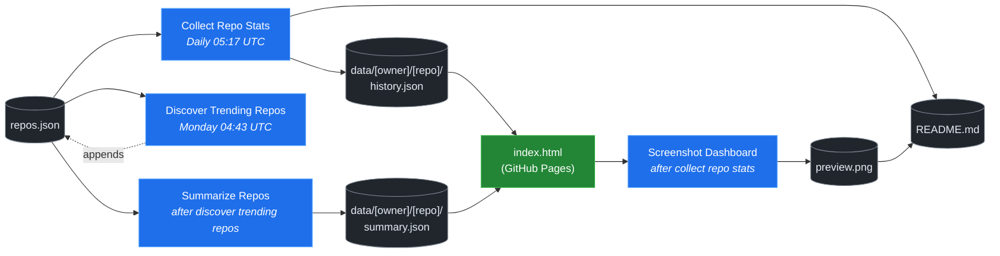

# 🚀 Rising Repos Tracker

> Automatically tracks daily GitHub stats (stars, forks, issues, velocity) for rising open source repos.

[](https://www.telosignal.com/)


**[→ View Live Dashboard](https://patrick-creates.github.io/rising-repos-tracker/)**

Built and maintained by [Telosignal](https://www.telosignal.com/).


<!-- AUTOGEN-STATS-START -->
## 📊 Current snapshot

> Auto-updated daily — last refreshed 2026-06-30

| Metric | Value |
|---|---|
| Repos tracked | **136** |
| Total stars | **7,063,724** |
| Total forks | **1,093,712** |
| Fastest growing | **ponytail** (+2501.1/day) |

### 🔥 Top 5 by velocity

| # | Repo | Stars | Stars/day |
|---|---|---:|---:|
| 1 | [DietrichGebert/ponytail](https://github.com/DietrichGebert/ponytail) | 68,028 | +2501.1 |
| 2 | [chopratejas/headroom](https://github.com/chopratejas/headroom) | 54,180 | +1734.5 |
| 3 | [DeusData/codebase-memory-mcp](https://github.com/DeusData/codebase-memory-mcp) | 21,981 | +1351.0 |
| 4 | [calesthio/OpenMontage](https://github.com/calesthio/OpenMontage) | 29,164 | +1313.0 |
| 5 | [NousResearch/hermes-agent](https://github.com/NousResearch/hermes-agent) | 206,007 | +1207.5 |

### 🆕 Recently added

- [calesthio/OpenMontage](https://github.com/calesthio/OpenMontage) — added 2026-06-29 — World's first open-source, agentic video production system. 12 pipelines, 52 tools, 500+ agent skills. Turn your AI coding assistant into a full video production studio.
- [DeusData/codebase-memory-mcp](https://github.com/DeusData/codebase-memory-mcp) — added 2026-06-29 — High-performance code intelligence MCP server. Indexes codebases into a persistent knowledge graph — average repo in milliseconds. 158 languages, sub-ms queries, 99% fewer tokens. Single static binary, zero dependencies.
- [pranshuparmar/witr](https://github.com/pranshuparmar/witr) — added 2026-06-29 — Why is this running?
<!-- AUTOGEN-STATS-END -->

<!-- AUTOGEN-DIAGRAM-START -->
## 🔄 How it works


<!-- AUTOGEN-DIAGRAM-END -->

<!-- AUTOGEN-WORKFLOWS-START -->
## ⚙️ Workflows

| File | Schedule | Name |
|---|---|---|
| `collect.yml` | Daily 05:17 UTC | Collect Repo Stats |
| `discover.yml` | Monday 04:43 UTC | Discover Trending Repos |
| `screenshot.yml` | After Collect Repo Stats | Screenshot Dashboard |
| `summarize.yml` | After Discover Trending Repos | Summarize Repos |

> All workflows commit results directly back to the repo. Schedules are best-effort — GitHub Actions cron can drift by a few minutes.
<!-- AUTOGEN-WORKFLOWS-END -->

<!-- AUTOGEN-REPOS-START -->
## 📋 All tracked repos

| Repo | Stars | Forks | Stars/day |
|---|---:|---:|---:|
| [openclaw/openclaw](https://github.com/openclaw/openclaw) | 381,076 | 79,821 | +200.1 |
| [obra/superpowers](https://github.com/obra/superpowers) | 241,886 | 21,468 | +788.6 |
| [affaan-m/everything-claude-code](https://github.com/affaan-m/everything-claude-code) | 223,647 | 34,240 | +887.5 |
| [affaan-m/ECC](https://github.com/affaan-m/ECC) | 223,647 | 34,240 | +872.7 |
| [NousResearch/hermes-agent](https://github.com/NousResearch/hermes-agent) | 206,007 | 37,239 | +1207.5 |
| [Significant-Gravitas/AutoGPT](https://github.com/Significant-Gravitas/AutoGPT) | 185,222 | 46,118 | +19.6 |
| [f/prompts.chat](https://github.com/f/prompts.chat) | 164,545 | 21,292 | +49.4 |
| [microsoft/markitdown](https://github.com/microsoft/markitdown) | 161,446 | 11,356 | +800.8 |
| [langgenius/dify](https://github.com/langgenius/dify) | 147,074 | 23,160 | +121.9 |
| [open-webui/open-webui](https://github.com/open-webui/open-webui) | 143,507 | 20,685 | +137.8 |
| [langchain-ai/langchain](https://github.com/langchain-ai/langchain) | 140,552 | 23,328 | +81.6 |
| [github/spec-kit](https://github.com/github/spec-kit) | 116,511 | 10,294 | +388.5 |
| [microsoft/generative-ai-for-beginners](https://github.com/microsoft/generative-ai-for-beginners) | 112,426 | 60,403 | +34.9 |
| [farion1231/cc-switch](https://github.com/farion1231/cc-switch) | 110,976 | 7,340 | +858.9 |
| [nextlevelbuilder/ui-ux-pro-max-skill](https://github.com/nextlevelbuilder/ui-ux-pro-max-skill) | 98,310 | 10,355 | +425.4 |
| [ChatGPTNextWeb/NextChat](https://github.com/ChatGPTNextWeb/NextChat) | 88,340 | 59,509 | +7.0 |
| [thedotmack/claude-mem](https://github.com/thedotmack/claude-mem) | 85,124 | 7,346 | +203.0 |
| [vllm-project/vllm](https://github.com/vllm-project/vllm) | 84,874 | 18,683 | +104.0 |
| [lobehub/lobehub](https://github.com/lobehub/lobehub) | 79,253 | 15,504 | +47.0 |
| [OpenHands/OpenHands](https://github.com/OpenHands/OpenHands) | 78,768 | 10,016 | +112.5 |
| [JuliusBrussee/caveman](https://github.com/JuliusBrussee/caveman) | 78,076 | 4,416 | +385.2 |
| [dair-ai/Prompt-Engineering-Guide](https://github.com/dair-ai/Prompt-Engineering-Guide) | 76,083 | 8,331 | +32.1 |
| [ruvnet/RuView](https://github.com/ruvnet/RuView) | 75,941 | 10,159 | +279.1 |
| [openai/openai-cookbook](https://github.com/openai/openai-cookbook) | 74,468 | 12,600 | +20.0 |
| [nexu-io/open-design](https://github.com/nexu-io/open-design) | 73,095 | 8,300 | +672.6 |
| [shareAI-lab/learn-claude-code](https://github.com/shareAI-lab/learn-claude-code) | 69,113 | 11,266 | +186.9 |
| [DietrichGebert/ponytail](https://github.com/DietrichGebert/ponytail) | 68,028 | 3,497 | +2501.1 |
| [unslothai/unsloth](https://github.com/unslothai/unsloth) | 67,635 | 6,071 | +72.9 |
| [rtk-ai/rtk](https://github.com/rtk-ai/rtk) | 67,147 | 4,143 | +408.6 |
| [xtekky/gpt4free](https://github.com/xtekky/gpt4free) | 66,460 | 13,563 | +5.1 |
| [ComposioHQ/awesome-claude-skills](https://github.com/ComposioHQ/awesome-claude-skills) | 66,370 | 7,377 | +139.1 |
| [code-yeongyu/oh-my-openagent](https://github.com/code-yeongyu/oh-my-openagent) | 64,318 | 5,244 | +139.3 |
| [datawhalechina/hello-agents](https://github.com/datawhalechina/hello-agents) | 62,836 | 7,771 | +283.2 |
| [shanraisshan/claude-code-best-practice](https://github.com/shanraisshan/claude-code-best-practice) | 61,609 | 6,163 | +188.6 |
| [koala73/worldmonitor](https://github.com/koala73/worldmonitor) | 60,995 | 9,500 | +154.1 |
| [tw93/Pake](https://github.com/tw93/Pake) | 58,607 | 11,727 | +228.6 |
| [Fission-AI/OpenSpec](https://github.com/Fission-AI/OpenSpec) | 57,829 | 4,030 | +210.3 |
| [MemPalace/mempalace](https://github.com/MemPalace/mempalace) | 56,751 | 7,340 | +101.2 |
| [santifer/career-ops](https://github.com/santifer/career-ops) | 56,723 | 11,210 | +266.9 |
| [chopratejas/headroom](https://github.com/chopratejas/headroom) | 54,180 | 3,892 | +1734.5 |
| [headroomlabs-ai/headroom](https://github.com/headroomlabs-ai/headroom) | 54,180 | 3,892 | +1034.6 |
| [FlowiseAI/Flowise](https://github.com/FlowiseAI/Flowise) | 54,126 | 24,615 | +28.5 |
| [Leonxlnx/taste-skill](https://github.com/Leonxlnx/taste-skill) | 53,463 | 3,685 | +794.8 |
| [BerriAI/litellm](https://github.com/BerriAI/litellm) | 52,095 | 9,310 | +109.5 |
| [ZhuLinsen/daily_stock_analysis](https://github.com/ZhuLinsen/daily_stock_analysis) | 52,088 | 45,205 | +368.0 |
| [ggml-org/whisper.cpp](https://github.com/ggml-org/whisper.cpp) | 51,153 | 5,705 | +30.9 |
| [mvanhorn/last30days-skill](https://github.com/mvanhorn/last30days-skill) | 47,770 | 3,953 | +686.3 |
| [hesreallyhim/awesome-claude-code](https://github.com/hesreallyhim/awesome-claude-code) | 47,626 | 4,161 | +82.1 |
| [asgeirtj/system_prompts_leaks](https://github.com/asgeirtj/system_prompts_leaks) | 47,236 | 7,708 | +159.3 |
| [Aider-AI/aider](https://github.com/Aider-AI/aider) | 46,858 | 4,673 | +44.1 |
| [Panniantong/Agent-Reach](https://github.com/Panniantong/Agent-Reach) | 46,321 | 3,662 | +1038.4 |
| [zhayujie/CowAgent](https://github.com/zhayujie/CowAgent) | 45,691 | 10,240 | +26.4 |
| [HKUDS/nanobot](https://github.com/HKUDS/nanobot) | 44,879 | 7,913 | +51.1 |
| [ChromeDevTools/chrome-devtools-mcp](https://github.com/ChromeDevTools/chrome-devtools-mcp) | 44,741 | 2,902 | +113.0 |
| [elder-plinius/CL4R1T4S](https://github.com/elder-plinius/CL4R1T4S) | 44,183 | 8,996 | +352.8 |
| [sickn33/antigravity-awesome-skills](https://github.com/sickn33/antigravity-awesome-skills) | 42,042 | 6,719 | +93.4 |
| [chatboxai/chatbox](https://github.com/chatboxai/chatbox) | 40,805 | 4,129 | +18.8 |
| [QuantumNous/new-api](https://github.com/QuantumNous/new-api) | 40,572 | 9,340 | +144.9 |
| [danny-avila/LibreChat](https://github.com/danny-avila/LibreChat) | 40,034 | 8,192 | +71.3 |
| [Hmbown/CodeWhale](https://github.com/Hmbown/CodeWhale) | 39,213 | 3,386 | +126.2 |
| [kepano/obsidian-skills](https://github.com/kepano/obsidian-skills) | 38,969 | 2,763 | +175.3 |
| [router-for-me/CLIProxyAPI](https://github.com/router-for-me/CLIProxyAPI) | 38,740 | 6,407 | +111.0 |
| [chatanywhere/GPT_API_free](https://github.com/chatanywhere/GPT_API_free) | 38,629 | 2,658 | +13.1 |
| [wshobson/agents](https://github.com/wshobson/agents) | 37,351 | 4,015 | +39.3 |
| [Yeachan-Heo/oh-my-claudecode](https://github.com/Yeachan-Heo/oh-my-claudecode) | 37,188 | 3,362 | +65.7 |
| [google/langextract](https://github.com/google/langextract) | 36,973 | 2,550 | +11.6 |
| [rohitg00/ai-engineering-from-scratch](https://github.com/rohitg00/ai-engineering-from-scratch) | 36,883 | 6,088 | +362.8 |
| [langchain-ai/langgraph](https://github.com/langchain-ai/langgraph) | 36,111 | 6,046 | +86.4 |
| [jamiepine/voicebox](https://github.com/jamiepine/voicebox) | 36,083 | 4,320 | +243.5 |
| [github/awesome-copilot](https://github.com/github/awesome-copilot) | 35,947 | 4,444 | +59.5 |
| [AstrBotDevs/AstrBot](https://github.com/AstrBotDevs/AstrBot) | 35,588 | 2,456 | +68.9 |
| [coreyhaines31/marketingskills](https://github.com/coreyhaines31/marketingskills) | 35,512 | 5,793 | +140.5 |
| [songquanpeng/one-api](https://github.com/songquanpeng/one-api) | 35,369 | 6,690 | +32.2 |
| [PDFMathTranslate/PDFMathTranslate](https://github.com/PDFMathTranslate/PDFMathTranslate) | 35,306 | 3,152 | +35.9 |
| [heygen-com/hyperframes](https://github.com/heygen-com/hyperframes) | 32,257 | 2,997 | +304.4 |
| [zeroclaw-labs/zeroclaw](https://github.com/zeroclaw-labs/zeroclaw) | 32,098 | 4,778 | +14.6 |
| [anthropics/claude-plugins-official](https://github.com/anthropics/claude-plugins-official) | 31,333 | 3,426 | +80.1 |
| [Gitlawb/openclaude](https://github.com/Gitlawb/openclaude) | 29,537 | 8,836 | +48.3 |
| [googleworkspace/cli](https://github.com/googleworkspace/cli) | 29,181 | 1,664 | +84.9 |
| [calesthio/OpenMontage](https://github.com/calesthio/OpenMontage) | 29,164 | 3,273 | +1313.0 |
| [iOfficeAI/AionUi](https://github.com/iOfficeAI/AionUi) | 29,084 | 2,898 | +59.9 |
| [AlexsJones/llmfit](https://github.com/AlexsJones/llmfit) | 28,879 | 1,774 | +64.8 |
| [voideditor/void](https://github.com/voideditor/void) | 28,822 | 2,566 | +0.6 |
| [usestrix/strix](https://github.com/usestrix/strix) | 27,462 | 3,077 | +60.4 |
| [BloopAI/vibe-kanban](https://github.com/BloopAI/vibe-kanban) | 27,215 | 2,876 | +17.4 |
| [volcengine/OpenViking](https://github.com/volcengine/OpenViking) | 26,182 | 2,030 | +38.8 |
| [jarrodwatts/claude-hud](https://github.com/jarrodwatts/claude-hud) | 25,950 | 1,182 | +57.3 |
| [jackwener/OpenCLI](https://github.com/jackwener/OpenCLI) | 25,659 | 2,550 | +84.5 |
| [zai-org/Open-AutoGLM](https://github.com/zai-org/Open-AutoGLM) | 25,649 | 3,998 | +8.5 |
| [p-e-w/heretic](https://github.com/p-e-w/heretic) | 25,624 | 2,765 | +75.1 |
| [esengine/DeepSeek-Reasonix](https://github.com/esengine/DeepSeek-Reasonix) | 25,423 | 1,561 | +268.0 |
| [langchain-ai/deepagents](https://github.com/langchain-ai/deepagents) | 25,385 | 3,588 | +55.9 |
| [toon-format/toon](https://github.com/toon-format/toon) | 24,722 | 1,095 | +10.3 |
| [rohitg00/agentmemory](https://github.com/rohitg00/agentmemory) | 24,328 | 1,997 | +113.8 |
| [JCodesMore/ai-website-cloner-template](https://github.com/JCodesMore/ai-website-cloner-template) | 23,699 | 3,372 | +447.1 |
| [mukul975/Anthropic-Cybersecurity-Skills](https://github.com/mukul975/Anthropic-Cybersecurity-Skills) | 23,236 | 2,637 | +639.3 |
| [winfunc/opcode](https://github.com/winfunc/opcode) | 22,131 | 1,711 | +5.7 |
| [DeusData/codebase-memory-mcp](https://github.com/DeusData/codebase-memory-mcp) | 21,981 | 1,590 | +1351.0 |
| [coze-dev/coze-studio](https://github.com/coze-dev/coze-studio) | 21,067 | 3,069 | +5.4 |
| [NirDiamant/agents-towards-production](https://github.com/NirDiamant/agents-towards-production) | 20,880 | 2,773 | +11.2 |
| [alibaba/page-agent](https://github.com/alibaba/page-agent) | 20,683 | 1,775 | +141.7 |
| [agentscope-ai/QwenPaw](https://github.com/agentscope-ai/QwenPaw) | 20,324 | 2,703 | +169.7 |
| [tirth8205/code-review-graph](https://github.com/tirth8205/code-review-graph) | 19,012 | 2,038 | +33.2 |
| [decolua/9router](https://github.com/decolua/9router) | 18,882 | 3,059 | +87.4 |
| [tanweai/pua](https://github.com/tanweai/pua) | 18,520 | 1,114 | +18.3 |
| [mksglu/context-mode](https://github.com/mksglu/context-mode) | 18,367 | 1,288 | +59.9 |
| [pranshuparmar/witr](https://github.com/pranshuparmar/witr) | 18,051 | 558 | +19.0 |
| [RightNow-AI/openfang](https://github.com/RightNow-AI/openfang) | 17,949 | 2,275 | +8.2 |
| [datawhalechina/easy-vibe](https://github.com/datawhalechina/easy-vibe) | 17,545 | 1,654 | +40.3 |
| [Tencent/WeKnora](https://github.com/Tencent/WeKnora) | 17,540 | 2,314 | +83.2 |
| [microsoft/agent-lightning](https://github.com/microsoft/agent-lightning) | 17,363 | 1,520 | +3.5 |
| [jundot/omlx](https://github.com/jundot/omlx) | 17,284 | 1,467 | +43.5 |
| [danielmiessler/LifeOS](https://github.com/danielmiessler/LifeOS) | 16,191 | 2,228 | +15.6 |
| [cft0808/edict](https://github.com/cft0808/edict) | 16,130 | 1,699 | +4.5 |
| [jnMetaCode/agency-agents-zh](https://github.com/jnMetaCode/agency-agents-zh) | 16,030 | 2,778 | +78.0 |
| [steipete/CodexBar](https://github.com/steipete/CodexBar) | 15,539 | 1,284 | +42.0 |
| [browser-use/browser-harness](https://github.com/browser-use/browser-harness) | 15,521 | 1,444 | +42.0 |
| [MemoriLabs/Memori](https://github.com/MemoriLabs/Memori) | 15,502 | 2,758 | +19.9 |
| [HKUDS/Vibe-Trading](https://github.com/HKUDS/Vibe-Trading) | 15,395 | 2,709 | +657.0 |
| [can1357/oh-my-pi](https://github.com/can1357/oh-my-pi) | 15,246 | 1,349 | +156.3 |
| [nesquena/hermes-webui](https://github.com/nesquena/hermes-webui) | 15,211 | 1,964 | +46.6 |
| [kyegomez/OpenMythos](https://github.com/kyegomez/OpenMythos) | 14,469 | 3,254 | +39.3 |
| [xpzouying/xiaohongshu-mcp](https://github.com/xpzouying/xiaohongshu-mcp) | 14,432 | 2,152 | +18.1 |
| [yusufkaraaslan/Skill_Seekers](https://github.com/yusufkaraaslan/Skill_Seekers) | 14,312 | 1,465 | +10.8 |
| [NevaMind-AI/memU](https://github.com/NevaMind-AI/memU) | 13,946 | 1,037 | +5.8 |
| [wanshuiyin/Auto-claude-code-research-in-sleep](https://github.com/wanshuiyin/Auto-claude-code-research-in-sleep) | 12,818 | 1,170 | +44.0 |
| [superset-sh/superset](https://github.com/superset-sh/superset) | 12,181 | 1,048 | +21.0 |
| [sirmalloc/ccstatusline](https://github.com/sirmalloc/ccstatusline) | 11,308 | 491 | +28.0 |
| [XiaomiMiMo/MiMo-Code](https://github.com/XiaomiMiMo/MiMo-Code) | 11,100 | 1,076 | +76.0 |
| [ValueCell-ai/valuecell](https://github.com/ValueCell-ai/valuecell) | 10,881 | 1,805 | +9.0 |
| [aden-hive/hive](https://github.com/aden-hive/hive) | 10,618 | 5,654 | +6.0 |
| [0x4m4/hexstrike-ai](https://github.com/0x4m4/hexstrike-ai) | 10,046 | 2,130 | +36.0 |
| [MemTensor/MemOS](https://github.com/MemTensor/MemOS) | 10,036 | 912 | +9.0 |
| [Kuberwastaken/claurst](https://github.com/Kuberwastaken/claurst) | 9,866 | 7,780 | — |
| [EverMind-AI/EverOS](https://github.com/EverMind-AI/EverOS) | 9,808 | 825 | +93.0 |
| [frankbria/ralph-claude-code](https://github.com/frankbria/ralph-claude-code) | 9,490 | 725 | +7.9 |
<!-- AUTOGEN-REPOS-END -->

---

## What it does

- Collects daily snapshots of stars, forks, watchers and open issues for every tracked repo
- Discovers new trending repos automatically every Monday using the GitHub Search API
- Generates AI summaries (use cases, similar tools, tags) for each tracked repo via GitHub Models
- Stores all history as plain JSON — no database, no backend
- Renders a live dashboard via GitHub Pages — updates daily, zero maintenance

## Tracked repos

Data lives in [`data/`](./data) — one folder per repo, one `history.json` per entry.  
The full watch list is in [`repos.json`](./repos.json).

## Fork & use it for yourself

This is my personal tracker — the watch list reflects what I find interesting. If you want to track different repos, the best path is to **fork this repo and run your own**.

### Setup

1. Fork this repo to your account
2. Replace the contents of [`repos.json`](./repos.json) with the repos you want to track (or just leave one entry — `discover.yml` will auto-add more every Monday)
3. Go to **Settings → Pages** and enable GitHub Pages from the `main` branch
4. Go to **Actions** and run **Collect Repo Stats** once manually to seed your first data point
5. Your dashboard will be live at `https://YOUR-USERNAME.github.io/rising-repos-tracker/`

That's it — daily collection and weekly discovery run automatically on schedule. Zero ongoing maintenance.

### Customizing what gets discovered

Edit [`scripts/discover.js`](./scripts/discover.js) to change:

- `MIN_STARS` — minimum star threshold for candidates
- `MAX_AGE_DAYS` — how recent a repo must be
- `MAX_NEW_REPOS` — how many to add per discovery run
- The `queries` array — GitHub Search API queries that define what "trending" means to you

### Adding a repo manually

Just edit `repos.json` directly:

```json
{
  "owner": "OWNER",
  "repo": "REPO",
  "added": "YYYY-MM-DD",
  "notes": "why you're tracking this"
}
```

The next daily collect run picks it up automatically.

## Stack

- **GitHub Actions** — scheduling and automation
- **GitHub Pages** — dashboard hosting
- **GitHub API** — data source
- **GitHub Models** — free AI summaries (gpt-4o-mini)
- **Chart.js** — star growth visualization
- **Mermaid** — architecture diagram (rendered by GitHub)
- No dependencies, no build step, no database

## License

MIT
