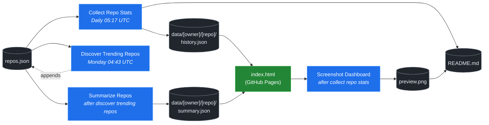

# 🚀 Rising Repos Tracker

> Automatically tracks daily GitHub stats (stars, forks, issues, velocity) for rising open source repos.

[](https://www.telosignal.com/)


**[→ View Live Dashboard](https://patrick-creates.github.io/rising-repos-tracker/)**

Built and maintained by [Telosignal](https://www.telosignal.com/).


<!-- AUTOGEN-STATS-START -->
## 📊 Current snapshot

> Auto-updated daily — last refreshed 2026-07-07

| Metric | Value |
|---|---|
| Repos tracked | **151** |
| Total stars | **7,377,262** |
| Total forks | **1,130,182** |
| Fastest growing | **ponytail** (+1885.2/day) |

### 🔥 Top 5 by velocity

| # | Repo | Stars | Stars/day |
|---|---|---:|---:|
| 1 | [DietrichGebert/ponytail](https://github.com/DietrichGebert/ponytail) | 76,297 | +1885.2 |
| 2 | [chopratejas/headroom](https://github.com/chopratejas/headroom) | 57,283 | +1323.6 |
| 3 | [NousResearch/hermes-agent](https://github.com/NousResearch/hermes-agent) | 210,609 | +1137.5 |
| 4 | [Panniantong/Agent-Reach](https://github.com/Panniantong/Agent-Reach) | 52,321 | +994.6 |
| 5 | [DeusData/codebase-memory-mcp](https://github.com/DeusData/codebase-memory-mcp) | 27,618 | +873.5 |

### 🆕 Recently added

- [stablyai/orca](https://github.com/stablyai/orca) — added 2026-07-06 — Orca is the ADE for working with a fleet of parallel agents. Run any coding agent with your own subscription. Available on desktop and mobile.
- [ogulcancelik/herdr](https://github.com/ogulcancelik/herdr) — added 2026-07-06 — agent multiplexer that lives in your terminal.
- [diegosouzapw/OmniRoute](https://github.com/diegosouzapw/OmniRoute) — added 2026-07-06 — Never stop coding. Free AI gateway: one endpoint, 231+ providers (50+ free), connect Claude Code, Codex, Cursor, Cline & Copilot to FREE Claude/GPT/Gemini. RTK+Caveman stacked compression saves 15-95% tokens, smart auto-fallback, MCP/A2A, multimodal APIs, Desktop/PWA.
<!-- AUTOGEN-STATS-END -->

<!-- AUTOGEN-DIAGRAM-START -->
## 🔄 How it works


<!-- AUTOGEN-DIAGRAM-END -->

<!-- AUTOGEN-WORKFLOWS-START -->
## ⚙️ Workflows

| File | Schedule | Name |
|---|---|---|
| `collect.yml` | Daily 05:17 UTC | Collect Repo Stats |
| `discover.yml` | Monday 04:43 UTC | Discover Trending Repos |
| `screenshot.yml` | After Collect Repo Stats | Screenshot Dashboard |
| `summarize.yml` | After Discover Trending Repos | Summarize Repos |

> All workflows commit results directly back to the repo. Schedules are best-effort — GitHub Actions cron can drift by a few minutes.
<!-- AUTOGEN-WORKFLOWS-END -->

<!-- AUTOGEN-REPOS-START -->
## 📋 All tracked repos

| Repo | Stars | Forks | Stars/day |
|---|---:|---:|---:|
| [openclaw/openclaw](https://github.com/openclaw/openclaw) | 382,020 | 80,132 | +191.8 |
| [obra/superpowers](https://github.com/obra/superpowers) | 248,134 | 22,027 | +837.1 |
| [affaan-m/everything-claude-code](https://github.com/affaan-m/everything-claude-code) | 226,797 | 34,678 | +831.8 |
| [affaan-m/ECC](https://github.com/affaan-m/ECC) | 226,797 | 34,678 | +803.9 |
| [NousResearch/hermes-agent](https://github.com/NousResearch/hermes-agent) | 210,609 | 38,606 | +1137.5 |
| [Significant-Gravitas/AutoGPT](https://github.com/Significant-Gravitas/AutoGPT) | 185,413 | 46,123 | +20.6 |
| [f/prompts.chat](https://github.com/f/prompts.chat) | 164,982 | 21,358 | +51.1 |
| [microsoft/markitdown](https://github.com/microsoft/markitdown) | 163,574 | 11,603 | +737.6 |
| [langgenius/dify](https://github.com/langgenius/dify) | 148,007 | 23,307 | +123.3 |
| [open-webui/open-webui](https://github.com/open-webui/open-webui) | 144,519 | 20,886 | +138.7 |
| [langchain-ai/langchain](https://github.com/langchain-ai/langchain) | 141,161 | 23,462 | +82.3 |
| [github/spec-kit](https://github.com/github/spec-kit) | 118,491 | 10,498 | +375.1 |
| [farion1231/cc-switch](https://github.com/farion1231/cc-switch) | 114,176 | 7,621 | +802.6 |
| [microsoft/generative-ai-for-beginners](https://github.com/microsoft/generative-ai-for-beginners) | 112,721 | 60,551 | +35.8 |
| [nextlevelbuilder/ui-ux-pro-max-skill](https://github.com/nextlevelbuilder/ui-ux-pro-max-skill) | 101,947 | 10,745 | +437.3 |
| [ChatGPTNextWeb/NextChat](https://github.com/ChatGPTNextWeb/NextChat) | 88,403 | 59,496 | +7.3 |
| [thedotmack/claude-mem](https://github.com/thedotmack/claude-mem) | 86,235 | 7,459 | +197.4 |
| [JuliusBrussee/caveman](https://github.com/JuliusBrussee/caveman) | 85,935 | 4,781 | +488.5 |
| [vllm-project/vllm](https://github.com/vllm-project/vllm) | 85,569 | 19,052 | +103.4 |
| [OpenHands/OpenHands](https://github.com/OpenHands/OpenHands) | 79,705 | 10,167 | +115.5 |
| [lobehub/lobehub](https://github.com/lobehub/lobehub) | 79,575 | 15,562 | +46.9 |
| [ruvnet/RuView](https://github.com/ruvnet/RuView) | 77,929 | 10,480 | +279.9 |
| [DietrichGebert/ponytail](https://github.com/DietrichGebert/ponytail) | 76,297 | 4,052 | +1885.2 |
| [dair-ai/Prompt-Engineering-Guide](https://github.com/dair-ai/Prompt-Engineering-Guide) | 76,271 | 8,349 | +31.4 |
| [nexu-io/open-design](https://github.com/nexu-io/open-design) | 75,743 | 8,643 | +631.4 |
| [openai/openai-cookbook](https://github.com/openai/openai-cookbook) | 74,576 | 12,620 | +19.3 |
| [shareAI-lab/learn-claude-code](https://github.com/shareAI-lab/learn-claude-code) | 70,159 | 11,435 | +181.6 |
| [rtk-ai/rtk](https://github.com/rtk-ai/rtk) | 69,112 | 4,281 | +390.7 |
| [unslothai/unsloth](https://github.com/unslothai/unsloth) | 67,873 | 6,107 | +67.5 |
| [ComposioHQ/awesome-claude-skills](https://github.com/ComposioHQ/awesome-claude-skills) | 67,043 | 7,502 | +133.1 |
| [xtekky/gpt4free](https://github.com/xtekky/gpt4free) | 66,458 | 13,552 | +4.3 |
| [code-yeongyu/oh-my-openagent](https://github.com/code-yeongyu/oh-my-openagent) | 65,116 | 5,316 | +135.8 |
| [datawhalechina/hello-agents](https://github.com/datawhalechina/hello-agents) | 64,538 | 8,006 | +277.6 |
| [shanraisshan/claude-code-best-practice](https://github.com/shanraisshan/claude-code-best-practice) | 62,138 | 6,208 | +172.8 |
| [koala73/worldmonitor](https://github.com/koala73/worldmonitor) | 61,491 | 9,569 | +142.5 |
| [Leonxlnx/taste-skill](https://github.com/Leonxlnx/taste-skill) | 59,556 | 4,039 | +809.5 |
| [tw93/Pake](https://github.com/tw93/Pake) | 59,491 | 11,977 | +214.2 |
| [Fission-AI/OpenSpec](https://github.com/Fission-AI/OpenSpec) | 59,100 | 4,112 | +206.2 |
| [santifer/career-ops](https://github.com/santifer/career-ops) | 58,920 | 11,567 | +273.5 |
| [chopratejas/headroom](https://github.com/chopratejas/headroom) | 57,283 | 4,209 | +1323.6 |
| [headroomlabs-ai/headroom](https://github.com/headroomlabs-ai/headroom) | 57,283 | 4,209 | +758.7 |
| [MemPalace/mempalace](https://github.com/MemPalace/mempalace) | 57,051 | 7,372 | +93.0 |
| [ZhuLinsen/daily_stock_analysis](https://github.com/ZhuLinsen/daily_stock_analysis) | 55,309 | 47,801 | +383.0 |
| [FlowiseAI/Flowise](https://github.com/FlowiseAI/Flowise) | 54,359 | 24,660 | +29.2 |
| [BerriAI/litellm](https://github.com/BerriAI/litellm) | 52,822 | 9,531 | +108.7 |
| [Panniantong/Agent-Reach](https://github.com/Panniantong/Agent-Reach) | 52,321 | 4,204 | +994.6 |
| [asgeirtj/system_prompts_leaks](https://github.com/asgeirtj/system_prompts_leaks) | 52,162 | 8,494 | +235.5 |
| [ggml-org/whisper.cpp](https://github.com/ggml-org/whisper.cpp) | 51,357 | 5,729 | +30.6 |
| [mvanhorn/last30days-skill](https://github.com/mvanhorn/last30days-skill) | 50,051 | 4,172 | +599.3 |
| [hesreallyhim/awesome-claude-code](https://github.com/hesreallyhim/awesome-claude-code) | 48,766 | 4,263 | +93.4 |
| [Aider-AI/aider](https://github.com/Aider-AI/aider) | 47,144 | 4,708 | +43.7 |
| [ChromeDevTools/chrome-devtools-mcp](https://github.com/ChromeDevTools/chrome-devtools-mcp) | 46,148 | 3,005 | +125.3 |
| [zhayujie/CowAgent](https://github.com/zhayujie/CowAgent) | 45,840 | 10,258 | +25.7 |
| [HKUDS/nanobot](https://github.com/HKUDS/nanobot) | 45,093 | 7,957 | +48.3 |
| [elder-plinius/CL4R1T4S](https://github.com/elder-plinius/CL4R1T4S) | 44,913 | 9,133 | +273.7 |
| [sickn33/antigravity-awesome-skills](https://github.com/sickn33/antigravity-awesome-skills) | 42,506 | 6,768 | +89.0 |
| [QuantumNous/new-api](https://github.com/QuantumNous/new-api) | 41,375 | 9,576 | +140.0 |
| [chatboxai/chatbox](https://github.com/chatboxai/chatbox) | 40,899 | 4,140 | +18.1 |
| [danny-avila/LibreChat](https://github.com/danny-avila/LibreChat) | 40,389 | 8,275 | +67.9 |
| [kepano/obsidian-skills](https://github.com/kepano/obsidian-skills) | 40,067 | 2,846 | +171.8 |
| [Hmbown/CodeWhale](https://github.com/Hmbown/CodeWhale) | 39,538 | 3,407 | +113.2 |
| [router-for-me/CLIProxyAPI](https://github.com/router-for-me/CLIProxyAPI) | 39,430 | 6,506 | +109.0 |
| [chatanywhere/GPT_API_free](https://github.com/chatanywhere/GPT_API_free) | 38,707 | 2,663 | +12.8 |
| [jamiepine/voicebox](https://github.com/jamiepine/voicebox) | 38,361 | 4,618 | +259.4 |
| [usestrix/strix](https://github.com/usestrix/strix) | 38,189 | 3,871 | +346.6 |
| [wshobson/agents](https://github.com/wshobson/agents) | 37,608 | 4,035 | +38.9 |
| [rohitg00/ai-engineering-from-scratch](https://github.com/rohitg00/ai-engineering-from-scratch) | 37,554 | 6,243 | +310.9 |
| [Yeachan-Heo/oh-my-claudecode](https://github.com/Yeachan-Heo/oh-my-claudecode) | 37,496 | 3,379 | +62.1 |
| [google/langextract](https://github.com/google/langextract) | 37,017 | 2,557 | +10.7 |
| [coreyhaines31/marketingskills](https://github.com/coreyhaines31/marketingskills) | 36,927 | 5,943 | +152.5 |
| [langchain-ai/langgraph](https://github.com/langchain-ai/langgraph) | 36,675 | 6,153 | +83.7 |
| [github/awesome-copilot](https://github.com/github/awesome-copilot) | 36,266 | 4,515 | +57.2 |
| [AstrBotDevs/AstrBot](https://github.com/AstrBotDevs/AstrBot) | 35,939 | 2,491 | +65.3 |
| [songquanpeng/one-api](https://github.com/songquanpeng/one-api) | 35,544 | 6,725 | +31.0 |
| [PDFMathTranslate/PDFMathTranslate](https://github.com/PDFMathTranslate/PDFMathTranslate) | 35,447 | 3,164 | +33.3 |
| [calesthio/OpenMontage](https://github.com/calesthio/OpenMontage) | 34,630 | 3,962 | +847.4 |
| [heygen-com/hyperframes](https://github.com/heygen-com/hyperframes) | 33,558 | 3,129 | +275.8 |
| [zeroclaw-labs/zeroclaw](https://github.com/zeroclaw-labs/zeroclaw) | 32,174 | 4,797 | +13.8 |
| [anthropics/claude-plugins-official](https://github.com/anthropics/claude-plugins-official) | 31,706 | 3,491 | +74.9 |
| [Gitlawb/openclaude](https://github.com/Gitlawb/openclaude) | 29,832 | 8,860 | +47.1 |
| [googleworkspace/cli](https://github.com/googleworkspace/cli) | 29,477 | 1,695 | +76.6 |
| [iOfficeAI/AionUi](https://github.com/iOfficeAI/AionUi) | 29,417 | 2,935 | +57.5 |
| [AlexsJones/llmfit](https://github.com/AlexsJones/llmfit) | 29,170 | 1,783 | +60.3 |
| [voideditor/void](https://github.com/voideditor/void) | 28,824 | 2,573 | +0.5 |
| [DeusData/codebase-memory-mcp](https://github.com/DeusData/codebase-memory-mcp) | 27,618 | 2,055 | +873.5 |
| [BloopAI/vibe-kanban](https://github.com/BloopAI/vibe-kanban) | 27,296 | 2,893 | +16.3 |
| [volcengine/OpenViking](https://github.com/volcengine/OpenViking) | 26,388 | 2,052 | +36.6 |
| [JCodesMore/ai-website-cloner-template](https://github.com/JCodesMore/ai-website-cloner-template) | 26,371 | 3,712 | +426.3 |
| [esengine/DeepSeek-Reasonix](https://github.com/esengine/DeepSeek-Reasonix) | 26,271 | 1,635 | +232.6 |
| [jarrodwatts/claude-hud](https://github.com/jarrodwatts/claude-hud) | 26,211 | 1,204 | +52.4 |
| [jackwener/OpenCLI](https://github.com/jackwener/OpenCLI) | 26,191 | 2,590 | +82.4 |
| [p-e-w/heretic](https://github.com/p-e-w/heretic) | 25,867 | 2,803 | +65.3 |
| [langchain-ai/deepagents](https://github.com/langchain-ai/deepagents) | 25,843 | 3,628 | +58.2 |
| [zai-org/Open-AutoGLM](https://github.com/zai-org/Open-AutoGLM) | 25,711 | 4,004 | +8.6 |
| [mukul975/Anthropic-Cybersecurity-Skills](https://github.com/mukul975/Anthropic-Cybersecurity-Skills) | 24,818 | 2,831 | +446.4 |
| [toon-format/toon](https://github.com/toon-format/toon) | 24,790 | 1,101 | +10.1 |
| [alibaba/page-agent](https://github.com/alibaba/page-agent) | 24,748 | 2,116 | +281.4 |
| [rohitg00/agentmemory](https://github.com/rohitg00/agentmemory) | 24,736 | 2,038 | +100.4 |
| [winfunc/opcode](https://github.com/winfunc/opcode) | 22,153 | 1,708 | +5.1 |
| [agentscope-ai/QwenPaw](https://github.com/agentscope-ai/QwenPaw) | 21,123 | 2,743 | +152.0 |
| [coze-dev/coze-studio](https://github.com/coze-dev/coze-studio) | 21,121 | 3,069 | +6.0 |
| [NirDiamant/agents-towards-production](https://github.com/NirDiamant/agents-towards-production) | 20,925 | 2,781 | +10.0 |
| [decolua/9router](https://github.com/decolua/9router) | 20,434 | 3,323 | +130.1 |
| [tirth8205/code-review-graph](https://github.com/tirth8205/code-review-graph) | 19,257 | 2,061 | +33.8 |
| [tanweai/pua](https://github.com/tanweai/pua) | 18,672 | 1,120 | +19.4 |
| [mksglu/context-mode](https://github.com/mksglu/context-mode) | 18,659 | 1,304 | +54.1 |
| [HKUDS/Vibe-Trading](https://github.com/HKUDS/Vibe-Trading) | 18,262 | 3,033 | +440.5 |
| [pranshuparmar/witr](https://github.com/pranshuparmar/witr) | 18,178 | 565 | +18.3 |
| [RightNow-AI/openfang](https://github.com/RightNow-AI/openfang) | 17,978 | 2,278 | +6.9 |
| [Tencent/WeKnora](https://github.com/Tencent/WeKnora) | 17,892 | 2,423 | +72.7 |
| [datawhalechina/easy-vibe](https://github.com/datawhalechina/easy-vibe) | 17,885 | 1,697 | +42.9 |
| [jundot/omlx](https://github.com/jundot/omlx) | 17,585 | 1,483 | +43.3 |
| [microsoft/agent-lightning](https://github.com/microsoft/agent-lightning) | 17,375 | 1,519 | +2.9 |
| [steipete/CodexBar](https://github.com/steipete/CodexBar) | 16,857 | 1,381 | +110.3 |
| [jnMetaCode/agency-agents-zh](https://github.com/jnMetaCode/agency-agents-zh) | 16,784 | 2,865 | +91.9 |
| [can1357/oh-my-pi](https://github.com/can1357/oh-my-pi) | 16,459 | 1,457 | +164.2 |
| [danielmiessler/LifeOS](https://github.com/danielmiessler/LifeOS) | 16,433 | 2,250 | +24.5 |
| [cft0808/edict](https://github.com/cft0808/edict) | 16,162 | 1,700 | +4.5 |
| [browser-use/browser-harness](https://github.com/browser-use/browser-harness) | 15,786 | 1,467 | +38.4 |
| [nesquena/hermes-webui](https://github.com/nesquena/hermes-webui) | 15,600 | 2,048 | +50.8 |
| [MemoriLabs/Memori](https://github.com/MemoriLabs/Memori) | 15,545 | 2,778 | +13.5 |
| [kyegomez/OpenMythos](https://github.com/kyegomez/OpenMythos) | 14,636 | 3,295 | +32.1 |
| [xpzouying/xiaohongshu-mcp](https://github.com/xpzouying/xiaohongshu-mcp) | 14,552 | 2,161 | +17.7 |
| [yusufkaraaslan/Skill_Seekers](https://github.com/yusufkaraaslan/Skill_Seekers) | 14,382 | 1,469 | +10.4 |
| [NevaMind-AI/memU](https://github.com/NevaMind-AI/memU) | 13,992 | 1,039 | +6.1 |
| [ogulcancelik/herdr](https://github.com/ogulcancelik/herdr) | 13,104 | 759 | +707.0 |
| [wanshuiyin/Auto-claude-code-research-in-sleep](https://github.com/wanshuiyin/Auto-claude-code-research-in-sleep) | 13,089 | 1,182 | +39.4 |
| [stablyai/orca](https://github.com/stablyai/orca) | 13,065 | 880 | +482.0 |
| [diegosouzapw/OmniRoute](https://github.com/diegosouzapw/OmniRoute) | 12,797 | 1,860 | +645.0 |
| [superset-sh/superset](https://github.com/superset-sh/superset) | 12,293 | 1,061 | +16.6 |
| [XiaomiMiMo/MiMo-Code](https://github.com/XiaomiMiMo/MiMo-Code) | 11,563 | 1,132 | +67.4 |
| [sirmalloc/ccstatusline](https://github.com/sirmalloc/ccstatusline) | 11,517 | 501 | +29.6 |
| [xbtlin/ai-berkshire](https://github.com/xbtlin/ai-berkshire) | 11,430 | 1,480 | +653.0 |
| [ValueCell-ai/valuecell](https://github.com/ValueCell-ai/valuecell) | 10,909 | 1,807 | +4.6 |
| [aden-hive/hive](https://github.com/aden-hive/hive) | 10,646 | 5,648 | +4.3 |
| [EverMind-AI/EverOS](https://github.com/EverMind-AI/EverOS) | 10,439 | 840 | +90.5 |
| [0x4m4/hexstrike-ai](https://github.com/0x4m4/hexstrike-ai) | 10,187 | 2,143 | +22.1 |
| [MemTensor/MemOS](https://github.com/MemTensor/MemOS) | 10,120 | 919 | +11.6 |
| [alibaba/open-code-review](https://github.com/alibaba/open-code-review) | 10,062 | 655 | +75.0 |
| [Kuberwastaken/claurst](https://github.com/Kuberwastaken/claurst) | 9,978 | 7,790 | +14.0 |
| [walkinglabs/learn-harness-engineering](https://github.com/walkinglabs/learn-harness-engineering) | 9,927 | 1,072 | +42.0 |
| [frankbria/ralph-claude-code](https://github.com/frankbria/ralph-claude-code) | 9,510 | 726 | +7.2 |
| [brokermr810/QuantDinger](https://github.com/brokermr810/QuantDinger) | 9,314 | 1,960 | +31.0 |
| [ConardLi/garden-skills](https://github.com/ConardLi/garden-skills) | 9,218 | 1,236 | +37.0 |
| [iOfficeAI/OfficeCLI](https://github.com/iOfficeAI/OfficeCLI) | 9,087 | 646 | +690.0 |
| [ykdojo/claude-code-tips](https://github.com/ykdojo/claude-code-tips) | 9,054 | 700 | +37.0 |
| [EKKOLearnAI/hermes-studio](https://github.com/EKKOLearnAI/hermes-studio) | 8,903 | 1,105 | +43.0 |
| [EvoMap/evolver](https://github.com/EvoMap/evolver) | 8,863 | 819 | +8.0 |
| [iflytek/astron-agent](https://github.com/iflytek/astron-agent) | 8,611 | 860 | +1.0 |
| [getagentseal/codeburn](https://github.com/getagentseal/codeburn) | 8,491 | 668 | +20.0 |
| [MiroMindAI/MiroThinker](https://github.com/MiroMindAI/MiroThinker) | 8,334 | 642 | +8.0 |
<!-- AUTOGEN-REPOS-END -->

---

## What it does

- Collects daily snapshots of stars, forks, watchers and open issues for every tracked repo
- Discovers new trending repos automatically every Monday using the GitHub Search API
- Generates AI summaries (use cases, similar tools, tags) for each tracked repo via GitHub Models
- Stores all history as plain JSON — no database, no backend
- Renders a live dashboard via GitHub Pages — updates daily, zero maintenance

## Tracked repos

Data lives in [`data/`](./data) — one folder per repo, one `history.json` per entry.  
The full watch list is in [`repos.json`](./repos.json).

## Fork & use it for yourself

This is my personal tracker — the watch list reflects what I find interesting. If you want to track different repos, the best path is to **fork this repo and run your own**.

### Setup

1. Fork this repo to your account
2. Replace the contents of [`repos.json`](./repos.json) with the repos you want to track (or just leave one entry — `discover.yml` will auto-add more every Monday)
3. Go to **Settings → Pages** and enable GitHub Pages from the `main` branch
4. Go to **Actions** and run **Collect Repo Stats** once manually to seed your first data point
5. Your dashboard will be live at `https://YOUR-USERNAME.github.io/rising-repos-tracker/`

That's it — daily collection and weekly discovery run automatically on schedule. Zero ongoing maintenance.

### Customizing what gets discovered

Edit [`scripts/discover.js`](./scripts/discover.js) to change:

- `MIN_STARS` — minimum star threshold for candidates
- `MAX_AGE_DAYS` — how recent a repo must be
- `MAX_NEW_REPOS` — how many to add per discovery run
- The `queries` array — GitHub Search API queries that define what "trending" means to you

### Adding a repo manually

Just edit `repos.json` directly:

```json
{
  "owner": "OWNER",
  "repo": "REPO",
  "added": "YYYY-MM-DD",
  "notes": "why you're tracking this"
}
```

The next daily collect run picks it up automatically.

## Stack

- **GitHub Actions** — scheduling and automation
- **GitHub Pages** — dashboard hosting
- **GitHub API** — data source
- **GitHub Models** — free AI summaries (gpt-4o-mini)
- **Chart.js** — star growth visualization
- **Mermaid** — architecture diagram (rendered by GitHub)
- No dependencies, no build step, no database

## License

MIT
