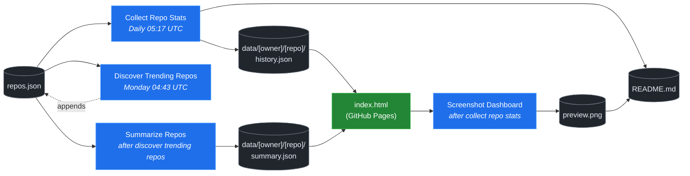

# 🚀 Rising Repos Tracker

> Automatically tracks daily GitHub stats (stars, forks, issues, velocity) for rising open source repos.

[](https://www.telosignal.com/)


**[→ View Live Dashboard](https://patrick-creates.github.io/rising-repos-tracker/)**

Built and maintained by [Telosignal](https://www.telosignal.com/).


<!-- AUTOGEN-STATS-START -->
## 📊 Current snapshot

> Auto-updated daily — last refreshed 2026-06-29

| Metric | Value |
|---|---|
| Repos tracked | **136** |
| Total stars | **7,040,171** |
| Total forks | **1,090,677** |
| Fastest growing | **ponytail** (+2563.4/day) |

### 🔥 Top 5 by velocity

| # | Repo | Stars | Stars/day |
|---|---|---:|---:|
| 1 | [DietrichGebert/ponytail](https://github.com/DietrichGebert/ponytail) | 65,963 | +2563.4 |
| 2 | [chopratejas/headroom](https://github.com/chopratejas/headroom) | 53,413 | +1803.6 |
| 3 | [NousResearch/hermes-agent](https://github.com/NousResearch/hermes-agent) | 205,335 | +1218.9 |
| 4 | [headroomlabs-ai/headroom](https://github.com/headroomlabs-ai/headroom) | 53,413 | +1072.9 |
| 5 | [Panniantong/Agent-Reach](https://github.com/Panniantong/Agent-Reach) | 45,097 | +1029.5 |

### 🆕 Recently added

- [calesthio/OpenMontage](https://github.com/calesthio/OpenMontage) — added 2026-06-29 — World's first open-source, agentic video production system. 12 pipelines, 52 tools, 500+ agent skills. Turn your AI coding assistant into a full video production studio.
- [DeusData/codebase-memory-mcp](https://github.com/DeusData/codebase-memory-mcp) — added 2026-06-29 — High-performance code intelligence MCP server. Indexes codebases into a persistent knowledge graph — average repo in milliseconds. 158 languages, sub-ms queries, 99% fewer tokens. Single static binary, zero dependencies.
- [pranshuparmar/witr](https://github.com/pranshuparmar/witr) — added 2026-06-29 — Why is this running?
<!-- AUTOGEN-STATS-END -->

<!-- AUTOGEN-DIAGRAM-START -->
## 🔄 How it works


<!-- AUTOGEN-DIAGRAM-END -->

<!-- AUTOGEN-WORKFLOWS-START -->
## ⚙️ Workflows

| File | Schedule | Name |
|---|---|---|
| `collect.yml` | Daily 05:17 UTC | Collect Repo Stats |
| `discover.yml` | Monday 04:43 UTC | Discover Trending Repos |
| `screenshot.yml` | After Collect Repo Stats | Screenshot Dashboard |
| `summarize.yml` | After Discover Trending Repos | Summarize Repos |

> All workflows commit results directly back to the repo. Schedules are best-effort — GitHub Actions cron can drift by a few minutes.
<!-- AUTOGEN-WORKFLOWS-END -->

<!-- AUTOGEN-REPOS-START -->
## 📋 All tracked repos

| Repo | Stars | Forks | Stars/day |
|---|---:|---:|---:|
| [openclaw/openclaw](https://github.com/openclaw/openclaw) | 380,934 | 79,801 | +201.3 |
| [obra/superpowers](https://github.com/obra/superpowers) | 241,107 | 21,408 | +790.0 |
| [affaan-m/everything-claude-code](https://github.com/affaan-m/everything-claude-code) | 223,243 | 34,176 | +897.8 |
| [affaan-m/ECC](https://github.com/affaan-m/ECC) | 223,243 | 34,176 | +886.1 |
| [NousResearch/hermes-agent](https://github.com/NousResearch/hermes-agent) | 205,335 | 37,039 | +1218.9 |
| [Significant-Gravitas/AutoGPT](https://github.com/Significant-Gravitas/AutoGPT) | 185,204 | 46,123 | +19.6 |
| [f/prompts.chat](https://github.com/f/prompts.chat) | 164,508 | 21,290 | +49.7 |
| [microsoft/markitdown](https://github.com/microsoft/markitdown) | 160,944 | 11,317 | +807.1 |
| [langgenius/dify](https://github.com/langgenius/dify) | 146,949 | 23,141 | +121.8 |
| [open-webui/open-webui](https://github.com/open-webui/open-webui) | 143,405 | 20,670 | +138.6 |
| [langchain-ai/langchain](https://github.com/langchain-ai/langchain) | 140,472 | 23,315 | +81.6 |
| [github/spec-kit](https://github.com/github/spec-kit) | 116,293 | 10,276 | +392.2 |
| [microsoft/generative-ai-for-beginners](https://github.com/microsoft/generative-ai-for-beginners) | 112,392 | 60,387 | +34.9 |
| [farion1231/cc-switch](https://github.com/farion1231/cc-switch) | 110,385 | 7,302 | +865.3 |
| [nextlevelbuilder/ui-ux-pro-max-skill](https://github.com/nextlevelbuilder/ui-ux-pro-max-skill) | 97,656 | 10,287 | +420.5 |
| [ChatGPTNextWeb/NextChat](https://github.com/ChatGPTNextWeb/NextChat) | 88,339 | 59,512 | +7.2 |
| [thedotmack/claude-mem](https://github.com/thedotmack/claude-mem) | 84,981 | 7,333 | +204.3 |
| [vllm-project/vllm](https://github.com/vllm-project/vllm) | 84,763 | 18,643 | +103.8 |
| [lobehub/lobehub](https://github.com/lobehub/lobehub) | 79,219 | 15,495 | +47.3 |
| [OpenHands/OpenHands](https://github.com/OpenHands/OpenHands) | 78,645 | 10,007 | +112.2 |
| [JuliusBrussee/caveman](https://github.com/JuliusBrussee/caveman) | 77,813 | 4,401 | +388.1 |
| [dair-ai/Prompt-Engineering-Guide](https://github.com/dair-ai/Prompt-Engineering-Guide) | 76,062 | 8,328 | +32.4 |
| [ruvnet/RuView](https://github.com/ruvnet/RuView) | 75,854 | 10,145 | +284.6 |
| [openai/openai-cookbook](https://github.com/openai/openai-cookbook) | 74,448 | 12,598 | +20.0 |
| [nexu-io/open-design](https://github.com/nexu-io/open-design) | 72,652 | 8,235 | +678.0 |
| [shareAI-lab/learn-claude-code](https://github.com/shareAI-lab/learn-claude-code) | 68,931 | 11,225 | +187.0 |
| [unslothai/unsloth](https://github.com/unslothai/unsloth) | 67,568 | 6,071 | +73.0 |
| [rtk-ai/rtk](https://github.com/rtk-ai/rtk) | 66,897 | 4,129 | +412.4 |
| [xtekky/gpt4free](https://github.com/xtekky/gpt4free) | 66,465 | 13,561 | +5.3 |
| [ComposioHQ/awesome-claude-skills](https://github.com/ComposioHQ/awesome-claude-skills) | 66,271 | 7,369 | +140.1 |
| [DietrichGebert/ponytail](https://github.com/DietrichGebert/ponytail) | 65,963 | 3,397 | +2563.4 |
| [code-yeongyu/oh-my-openagent](https://github.com/code-yeongyu/oh-my-openagent) | 64,086 | 5,232 | +137.1 |
| [datawhalechina/hello-agents](https://github.com/datawhalechina/hello-agents) | 62,594 | 7,742 | +284.1 |
| [shanraisshan/claude-code-best-practice](https://github.com/shanraisshan/claude-code-best-practice) | 61,511 | 6,151 | +190.8 |
| [koala73/worldmonitor](https://github.com/koala73/worldmonitor) | 60,792 | 9,469 | +153.0 |
| [tw93/Pake](https://github.com/tw93/Pake) | 58,411 | 11,669 | +229.3 |
| [Fission-AI/OpenSpec](https://github.com/Fission-AI/OpenSpec) | 57,597 | 4,013 | +209.7 |
| [MemPalace/mempalace](https://github.com/MemPalace/mempalace) | 56,717 | 7,332 | +102.8 |
| [santifer/career-ops](https://github.com/santifer/career-ops) | 56,495 | 11,160 | +267.8 |
| [FlowiseAI/Flowise](https://github.com/FlowiseAI/Flowise) | 54,103 | 24,607 | +28.6 |
| [chopratejas/headroom](https://github.com/chopratejas/headroom) | 53,413 | 3,827 | +1803.6 |
| [headroomlabs-ai/headroom](https://github.com/headroomlabs-ai/headroom) | 53,413 | 3,827 | +1072.9 |
| [Leonxlnx/taste-skill](https://github.com/Leonxlnx/taste-skill) | 52,879 | 3,648 | +802.4 |
| [BerriAI/litellm](https://github.com/BerriAI/litellm) | 51,957 | 9,281 | +108.8 |
| [ZhuLinsen/daily_stock_analysis](https://github.com/ZhuLinsen/daily_stock_analysis) | 51,494 | 44,720 | +361.6 |
| [ggml-org/whisper.cpp](https://github.com/ggml-org/whisper.cpp) | 51,133 | 5,705 | +31.1 |
| [hesreallyhim/awesome-claude-code](https://github.com/hesreallyhim/awesome-claude-code) | 47,561 | 4,153 | +82.5 |
| [mvanhorn/last30days-skill](https://github.com/mvanhorn/last30days-skill) | 47,530 | 3,940 | +707.6 |
| [asgeirtj/system_prompts_leaks](https://github.com/asgeirtj/system_prompts_leaks) | 46,983 | 7,680 | +157.1 |
| [Aider-AI/aider](https://github.com/Aider-AI/aider) | 46,822 | 4,668 | +44.3 |
| [zhayujie/CowAgent](https://github.com/zhayujie/CowAgent) | 45,668 | 10,241 | +26.5 |
| [Panniantong/Agent-Reach](https://github.com/Panniantong/Agent-Reach) | 45,097 | 3,579 | +1029.5 |
| [HKUDS/nanobot](https://github.com/HKUDS/nanobot) | 44,848 | 7,908 | +51.6 |
| [ChromeDevTools/chrome-devtools-mcp](https://github.com/ChromeDevTools/chrome-devtools-mcp) | 44,672 | 2,897 | +114.0 |
| [elder-plinius/CL4R1T4S](https://github.com/elder-plinius/CL4R1T4S) | 44,137 | 8,984 | +374.7 |
| [sickn33/antigravity-awesome-skills](https://github.com/sickn33/antigravity-awesome-skills) | 41,990 | 6,713 | +94.6 |
| [chatboxai/chatbox](https://github.com/chatboxai/chatbox) | 40,748 | 4,128 | +17.9 |
| [QuantumNous/new-api](https://github.com/QuantumNous/new-api) | 40,483 | 9,302 | +146.5 |
| [danny-avila/LibreChat](https://github.com/danny-avila/LibreChat) | 39,970 | 8,186 | +71.5 |
| [Hmbown/CodeWhale](https://github.com/Hmbown/CodeWhale) | 39,170 | 3,379 | +128.6 |
| [kepano/obsidian-skills](https://github.com/kepano/obsidian-skills) | 38,805 | 2,752 | +175.8 |
| [router-for-me/CLIProxyAPI](https://github.com/router-for-me/CLIProxyAPI) | 38,673 | 6,385 | +112.3 |
| [chatanywhere/GPT_API_free](https://github.com/chatanywhere/GPT_API_free) | 38,620 | 2,654 | +13.3 |
| [wshobson/agents](https://github.com/wshobson/agents) | 37,316 | 4,011 | +39.4 |
| [Yeachan-Heo/oh-my-claudecode](https://github.com/Yeachan-Heo/oh-my-claudecode) | 37,140 | 3,358 | +66.2 |
| [google/langextract](https://github.com/google/langextract) | 36,971 | 2,552 | +11.9 |
| [rohitg00/ai-engineering-from-scratch](https://github.com/rohitg00/ai-engineering-from-scratch) | 36,771 | 6,069 | +371.7 |
| [langchain-ai/langgraph](https://github.com/langchain-ai/langgraph) | 36,004 | 6,030 | +83.4 |
| [github/awesome-copilot](https://github.com/github/awesome-copilot) | 35,891 | 4,437 | +59.6 |
| [jamiepine/voicebox](https://github.com/jamiepine/voicebox) | 35,635 | 4,277 | +236.2 |
| [AstrBotDevs/AstrBot](https://github.com/AstrBotDevs/AstrBot) | 35,542 | 2,456 | +69.8 |
| [coreyhaines31/marketingskills](https://github.com/coreyhaines31/marketingskills) | 35,376 | 5,774 | +140.6 |
| [songquanpeng/one-api](https://github.com/songquanpeng/one-api) | 35,338 | 6,682 | +32.2 |
| [PDFMathTranslate/PDFMathTranslate](https://github.com/PDFMathTranslate/PDFMathTranslate) | 35,281 | 3,152 | +36.2 |
| [zeroclaw-labs/zeroclaw](https://github.com/zeroclaw-labs/zeroclaw) | 32,089 | 4,771 | +14.8 |
| [heygen-com/hyperframes](https://github.com/heygen-com/hyperframes) | 32,083 | 2,982 | +310.6 |
| [anthropics/claude-plugins-official](https://github.com/anthropics/claude-plugins-official) | 31,286 | 3,420 | +81.3 |
| [Gitlawb/openclaude](https://github.com/Gitlawb/openclaude) | 29,513 | 8,837 | +49.2 |
| [googleworkspace/cli](https://github.com/googleworkspace/cli) | 29,111 | 1,654 | +85.5 |
| [iOfficeAI/AionUi](https://github.com/iOfficeAI/AionUi) | 29,037 | 2,893 | +60.3 |
| [voideditor/void](https://github.com/voideditor/void) | 28,820 | 2,564 | +0.5 |
| [AlexsJones/llmfit](https://github.com/AlexsJones/llmfit) | 28,801 | 1,771 | +64.3 |
| [calesthio/OpenMontage](https://github.com/calesthio/OpenMontage) | 27,851 | 3,092 | +305.3 |
| [BloopAI/vibe-kanban](https://github.com/BloopAI/vibe-kanban) | 27,205 | 2,872 | +17.7 |
| [usestrix/strix](https://github.com/usestrix/strix) | 27,079 | 3,005 | +48.9 |
| [volcengine/OpenViking](https://github.com/volcengine/OpenViking) | 26,155 | 2,028 | +39.4 |
| [jarrodwatts/claude-hud](https://github.com/jarrodwatts/claude-hud) | 25,911 | 1,181 | +58.1 |
| [zai-org/Open-AutoGLM](https://github.com/zai-org/Open-AutoGLM) | 25,637 | 3,995 | +8.3 |
| [p-e-w/heretic](https://github.com/p-e-w/heretic) | 25,585 | 2,761 | +76.8 |
| [jackwener/OpenCLI](https://github.com/jackwener/OpenCLI) | 25,581 | 2,540 | +84.8 |
| [esengine/DeepSeek-Reasonix](https://github.com/esengine/DeepSeek-Reasonix) | 25,306 | 1,546 | +275.2 |
| [langchain-ai/deepagents](https://github.com/langchain-ai/deepagents) | 25,254 | 3,568 | +52.3 |
| [toon-format/toon](https://github.com/toon-format/toon) | 24,711 | 1,094 | +10.2 |
| [rohitg00/agentmemory](https://github.com/rohitg00/agentmemory) | 24,271 | 1,992 | +116.5 |
| [JCodesMore/ai-website-cloner-template](https://github.com/JCodesMore/ai-website-cloner-template) | 23,232 | 3,322 | +445.6 |
| [mukul975/Anthropic-Cybersecurity-Skills](https://github.com/mukul975/Anthropic-Cybersecurity-Skills) | 22,859 | 2,600 | +676.7 |
| [winfunc/opcode](https://github.com/winfunc/opcode) | 22,126 | 1,713 | +5.8 |
| [coze-dev/coze-studio](https://github.com/coze-dev/coze-studio) | 21,066 | 3,065 | +5.6 |
| [NirDiamant/agents-towards-production](https://github.com/NirDiamant/agents-towards-production) | 20,876 | 2,773 | +11.5 |
| [DeusData/codebase-memory-mcp](https://github.com/DeusData/codebase-memory-mcp) | 20,630 | 1,474 | +165.8 |
| [alibaba/page-agent](https://github.com/alibaba/page-agent) | 20,558 | 1,768 | +142.9 |
| [agentscope-ai/QwenPaw](https://github.com/agentscope-ai/QwenPaw) | 20,292 | 2,698 | +179.6 |
| [tirth8205/code-review-graph](https://github.com/tirth8205/code-review-graph) | 18,985 | 2,036 | +33.6 |
| [decolua/9router](https://github.com/decolua/9router) | 18,783 | 3,044 | +86.6 |
| [tanweai/pua](https://github.com/tanweai/pua) | 18,509 | 1,113 | +18.8 |
| [mksglu/context-mode](https://github.com/mksglu/context-mode) | 18,317 | 1,288 | +60.6 |
| [pranshuparmar/witr](https://github.com/pranshuparmar/witr) | 18,032 | 557 | +94.9 |
| [RightNow-AI/openfang](https://github.com/RightNow-AI/openfang) | 17,943 | 2,274 | +8.4 |
| [Tencent/WeKnora](https://github.com/Tencent/WeKnora) | 17,486 | 2,304 | +85.3 |
| [datawhalechina/easy-vibe](https://github.com/datawhalechina/easy-vibe) | 17,450 | 1,642 | +36.4 |
| [microsoft/agent-lightning](https://github.com/microsoft/agent-lightning) | 17,357 | 1,521 | +3.3 |
| [jundot/omlx](https://github.com/jundot/omlx) | 17,232 | 1,462 | +42.9 |
| [danielmiessler/LifeOS](https://github.com/danielmiessler/LifeOS) | 16,164 | 2,223 | +14.0 |
| [cft0808/edict](https://github.com/cft0808/edict) | 16,128 | 1,698 | +4.7 |
| [jnMetaCode/agency-agents-zh](https://github.com/jnMetaCode/agency-agents-zh) | 15,933 | 2,754 | +75.3 |
| [steipete/CodexBar](https://github.com/steipete/CodexBar) | 15,513 | 1,283 | +44.3 |
| [MemoriLabs/Memori](https://github.com/MemoriLabs/Memori) | 15,486 | 2,749 | +20.4 |
| [browser-use/browser-harness](https://github.com/browser-use/browser-harness) | 15,479 | 1,438 | +212.0 |
| [nesquena/hermes-webui](https://github.com/nesquena/hermes-webui) | 15,155 | 1,950 | +45.3 |
| [can1357/oh-my-pi](https://github.com/can1357/oh-my-pi) | 15,072 | 1,342 | +153.7 |
| [HKUDS/Vibe-Trading](https://github.com/HKUDS/Vibe-Trading) | 14,738 | 2,659 | +167.2 |
| [xpzouying/xiaohongshu-mcp](https://github.com/xpzouying/xiaohongshu-mcp) | 14,421 | 2,151 | +19.1 |
| [kyegomez/OpenMythos](https://github.com/kyegomez/OpenMythos) | 14,411 | 3,243 | +36.6 |
| [yusufkaraaslan/Skill_Seekers](https://github.com/yusufkaraaslan/Skill_Seekers) | 14,301 | 1,464 | +10.7 |
| [NevaMind-AI/memU](https://github.com/NevaMind-AI/memU) | 13,948 | 1,038 | +6.9 |
| [wanshuiyin/Auto-claude-code-research-in-sleep](https://github.com/wanshuiyin/Auto-claude-code-research-in-sleep) | 12,774 | 1,163 | +115.1 |
| [superset-sh/superset](https://github.com/superset-sh/superset) | 12,160 | 1,048 | +48.4 |
| [sirmalloc/ccstatusline](https://github.com/sirmalloc/ccstatusline) | 11,280 | 489 | +34.8 |
| [XiaomiMiMo/MiMo-Code](https://github.com/XiaomiMiMo/MiMo-Code) | 11,024 | 1,065 | +611.9 |
| [ValueCell-ai/valuecell](https://github.com/ValueCell-ai/valuecell) | 10,872 | 1,805 | +36.1 |
| [aden-hive/hive](https://github.com/aden-hive/hive) | 10,612 | 5,653 | +63.2 |
| [MemTensor/MemOS](https://github.com/MemTensor/MemOS) | 10,027 | 912 | +28.1 |
| [0x4m4/hexstrike-ai](https://github.com/0x4m4/hexstrike-ai) | 10,010 | 2,123 | +28.3 |
| [Kuberwastaken/claurst](https://github.com/Kuberwastaken/claurst) | 9,866 | 7,778 | +110.9 |
| [EverMind-AI/EverOS](https://github.com/EverMind-AI/EverOS) | 9,715 | 818 | +40.0 |
| [frankbria/ralph-claude-code](https://github.com/frankbria/ralph-claude-code) | 9,485 | 724 | +7.9 |
<!-- AUTOGEN-REPOS-END -->

---

## What it does

- Collects daily snapshots of stars, forks, watchers and open issues for every tracked repo
- Discovers new trending repos automatically every Monday using the GitHub Search API
- Generates AI summaries (use cases, similar tools, tags) for each tracked repo via GitHub Models
- Stores all history as plain JSON — no database, no backend
- Renders a live dashboard via GitHub Pages — updates daily, zero maintenance

## Tracked repos

Data lives in [`data/`](./data) — one folder per repo, one `history.json` per entry.  
The full watch list is in [`repos.json`](./repos.json).

## Fork & use it for yourself

This is my personal tracker — the watch list reflects what I find interesting. If you want to track different repos, the best path is to **fork this repo and run your own**.

### Setup

1. Fork this repo to your account
2. Replace the contents of [`repos.json`](./repos.json) with the repos you want to track (or just leave one entry — `discover.yml` will auto-add more every Monday)
3. Go to **Settings → Pages** and enable GitHub Pages from the `main` branch
4. Go to **Actions** and run **Collect Repo Stats** once manually to seed your first data point
5. Your dashboard will be live at `https://YOUR-USERNAME.github.io/rising-repos-tracker/`

That's it — daily collection and weekly discovery run automatically on schedule. Zero ongoing maintenance.

### Customizing what gets discovered

Edit [`scripts/discover.js`](./scripts/discover.js) to change:

- `MIN_STARS` — minimum star threshold for candidates
- `MAX_AGE_DAYS` — how recent a repo must be
- `MAX_NEW_REPOS` — how many to add per discovery run
- The `queries` array — GitHub Search API queries that define what "trending" means to you

### Adding a repo manually

Just edit `repos.json` directly:

```json
{
  "owner": "OWNER",
  "repo": "REPO",
  "added": "YYYY-MM-DD",
  "notes": "why you're tracking this"
}
```

The next daily collect run picks it up automatically.

## Stack

- **GitHub Actions** — scheduling and automation
- **GitHub Pages** — dashboard hosting
- **GitHub API** — data source
- **GitHub Models** — free AI summaries (gpt-4o-mini)
- **Chart.js** — star growth visualization
- **Mermaid** — architecture diagram (rendered by GitHub)
- No dependencies, no build step, no database

## License

MIT
