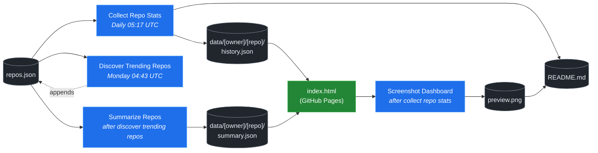

# 🚀 Rising Repos Tracker

> Automatically tracks daily GitHub stats (stars, forks, issues, velocity) for rising open source repos.

[](https://www.telosignal.com/)


**[→ View Live Dashboard](https://patrick-creates.github.io/rising-repos-tracker/)**

Built and maintained by [Telosignal](https://www.telosignal.com/).


<!-- AUTOGEN-STATS-START -->
## 📊 Current snapshot

> Auto-updated daily — last refreshed 2026-07-10

| Metric | Value |
|---|---|
| Repos tracked | **151** |
| Total stars | **7,454,305** |
| Total forks | **1,142,909** |
| Fastest growing | **ponytail** (+1753.7/day) |

### 🔥 Top 5 by velocity

| # | Repo | Stars | Stars/day |
|---|---|---:|---:|
| 1 | [DietrichGebert/ponytail](https://github.com/DietrichGebert/ponytail) | 79,585 | +1753.7 |
| 2 | [iOfficeAI/OfficeCLI](https://github.com/iOfficeAI/OfficeCLI) | 13,908 | +1377.8 |
| 3 | [chopratejas/headroom](https://github.com/chopratejas/headroom) | 58,258 | +1203.8 |
| 4 | [NousResearch/hermes-agent](https://github.com/NousResearch/hermes-agent) | 212,446 | +1110.4 |
| 5 | [Panniantong/Agent-Reach](https://github.com/Panniantong/Agent-Reach) | 54,169 | +959.1 |

### 🆕 Recently added

- [stablyai/orca](https://github.com/stablyai/orca) — added 2026-07-06 — Orca is the ADE for working with a fleet of parallel agents. Run any coding agent with your own subscription. Available on desktop and mobile.
- [ogulcancelik/herdr](https://github.com/ogulcancelik/herdr) — added 2026-07-06 — agent multiplexer that lives in your terminal.
- [diegosouzapw/OmniRoute](https://github.com/diegosouzapw/OmniRoute) — added 2026-07-06 — Never stop coding. Free AI gateway: one endpoint, 231+ providers (50+ free), connect Claude Code, Codex, Cursor, Cline & Copilot to FREE Claude/GPT/Gemini. RTK+Caveman stacked compression saves 15-95% tokens, smart auto-fallback, MCP/A2A, multimodal APIs, Desktop/PWA.
<!-- AUTOGEN-STATS-END -->

<!-- AUTOGEN-DIAGRAM-START -->
## 🔄 How it works


<!-- AUTOGEN-DIAGRAM-END -->

<!-- AUTOGEN-WORKFLOWS-START -->
## ⚙️ Workflows

| File | Schedule | Name |
|---|---|---|
| `collect.yml` | Daily 05:17 UTC | Collect Repo Stats |
| `discover.yml` | Monday 04:43 UTC | Discover Trending Repos |
| `screenshot.yml` | After Collect Repo Stats | Screenshot Dashboard |
| `summarize.yml` | After Discover Trending Repos | Summarize Repos |

> All workflows commit results directly back to the repo. Schedules are best-effort — GitHub Actions cron can drift by a few minutes.
<!-- AUTOGEN-WORKFLOWS-END -->

<!-- AUTOGEN-REPOS-START -->
## 📋 All tracked repos

| Repo | Stars | Forks | Stars/day |
|---|---:|---:|---:|
| [openclaw/openclaw](https://github.com/openclaw/openclaw) | 382,424 | 80,250 | +188.8 |
| [obra/superpowers](https://github.com/obra/superpowers) | 251,286 | 22,428 | +872.7 |
| [affaan-m/everything-claude-code](https://github.com/affaan-m/everything-claude-code) | 228,071 | 34,983 | +810.7 |
| [affaan-m/ECC](https://github.com/affaan-m/ECC) | 228,071 | 34,983 | +779.2 |
| [NousResearch/hermes-agent](https://github.com/NousResearch/hermes-agent) | 212,446 | 39,153 | +1110.4 |
| [Significant-Gravitas/AutoGPT](https://github.com/Significant-Gravitas/AutoGPT) | 185,446 | 46,116 | +20.1 |
| [f/prompts.chat](https://github.com/f/prompts.chat) | 165,212 | 21,382 | +52.4 |
| [microsoft/markitdown](https://github.com/microsoft/markitdown) | 164,502 | 11,713 | +715.4 |
| [langgenius/dify](https://github.com/langgenius/dify) | 148,373 | 23,391 | +123.2 |
| [open-webui/open-webui](https://github.com/open-webui/open-webui) | 144,923 | 20,978 | +138.5 |
| [langchain-ai/langchain](https://github.com/langchain-ai/langchain) | 141,441 | 23,502 | +82.9 |
| [github/spec-kit](https://github.com/github/spec-kit) | 119,176 | 10,561 | +367.5 |
| [farion1231/cc-switch](https://github.com/farion1231/cc-switch) | 115,474 | 7,717 | +781.7 |
| [microsoft/generative-ai-for-beginners](https://github.com/microsoft/generative-ai-for-beginners) | 112,841 | 60,609 | +36.0 |
| [nextlevelbuilder/ui-ux-pro-max-skill](https://github.com/nextlevelbuilder/ui-ux-pro-max-skill) | 103,703 | 10,955 | +445.0 |
| [ChatGPTNextWeb/NextChat](https://github.com/ChatGPTNextWeb/NextChat) | 88,431 | 59,472 | +7.4 |
| [JuliusBrussee/caveman](https://github.com/JuliusBrussee/caveman) | 87,498 | 5,022 | +490.3 |
| [thedotmack/claude-mem](https://github.com/thedotmack/claude-mem) | 86,671 | 7,490 | +194.7 |
| [vllm-project/vllm](https://github.com/vllm-project/vllm) | 85,875 | 19,221 | +103.3 |
| [OpenHands/OpenHands](https://github.com/OpenHands/OpenHands) | 80,298 | 10,247 | +120.1 |
| [ruvnet/RuView](https://github.com/ruvnet/RuView) | 79,753 | 10,735 | +301.3 |
| [lobehub/lobehub](https://github.com/lobehub/lobehub) | 79,690 | 15,575 | +46.4 |
| [DietrichGebert/ponytail](https://github.com/DietrichGebert/ponytail) | 79,585 | 4,275 | +1753.7 |
| [nexu-io/open-design](https://github.com/nexu-io/open-design) | 76,964 | 8,784 | +618.7 |
| [dair-ai/Prompt-Engineering-Guide](https://github.com/dair-ai/Prompt-Engineering-Guide) | 76,331 | 8,357 | +30.8 |
| [openai/openai-cookbook](https://github.com/openai/openai-cookbook) | 74,622 | 12,628 | +19.1 |
| [shareAI-lab/learn-claude-code](https://github.com/shareAI-lab/learn-claude-code) | 70,548 | 11,489 | +178.7 |
| [rtk-ai/rtk](https://github.com/rtk-ai/rtk) | 69,940 | 4,348 | +384.2 |
| [unslothai/unsloth](https://github.com/unslothai/unsloth) | 67,982 | 6,122 | +65.7 |
| [ComposioHQ/awesome-claude-skills](https://github.com/ComposioHQ/awesome-claude-skills) | 67,354 | 7,563 | +131.4 |
| [xtekky/gpt4free](https://github.com/xtekky/gpt4free) | 66,459 | 13,554 | +4.1 |
| [code-yeongyu/oh-my-openagent](https://github.com/code-yeongyu/oh-my-openagent) | 65,443 | 5,342 | +134.2 |
| [datawhalechina/hello-agents](https://github.com/datawhalechina/hello-agents) | 65,267 | 8,089 | +275.6 |
| [shanraisshan/claude-code-best-practice](https://github.com/shanraisshan/claude-code-best-practice) | 62,385 | 6,242 | +167.7 |
| [koala73/worldmonitor](https://github.com/koala73/worldmonitor) | 61,663 | 9,607 | +137.6 |
| [Leonxlnx/taste-skill](https://github.com/Leonxlnx/taste-skill) | 61,517 | 4,334 | +797.5 |
| [tw93/Pake](https://github.com/tw93/Pake) | 59,684 | 12,038 | +205.8 |
| [Fission-AI/OpenSpec](https://github.com/Fission-AI/OpenSpec) | 59,673 | 4,154 | +205.4 |
| [santifer/career-ops](https://github.com/santifer/career-ops) | 59,485 | 11,807 | +268.7 |
| [chopratejas/headroom](https://github.com/chopratejas/headroom) | 58,258 | 4,302 | +1203.8 |
| [headroomlabs-ai/headroom](https://github.com/headroomlabs-ai/headroom) | 58,258 | 4,302 | +686.4 |
| [MemPalace/mempalace](https://github.com/MemPalace/mempalace) | 57,189 | 7,383 | +90.4 |
| [ZhuLinsen/daily_stock_analysis](https://github.com/ZhuLinsen/daily_stock_analysis) | 56,386 | 48,510 | +381.5 |
| [asgeirtj/system_prompts_leaks](https://github.com/asgeirtj/system_prompts_leaks) | 55,499 | 9,162 | +285.2 |
| [FlowiseAI/Flowise](https://github.com/FlowiseAI/Flowise) | 54,486 | 24,700 | +29.9 |
| [Panniantong/Agent-Reach](https://github.com/Panniantong/Agent-Reach) | 54,169 | 4,471 | +959.1 |
| [BerriAI/litellm](https://github.com/BerriAI/litellm) | 53,168 | 9,634 | +109.1 |
| [ggml-org/whisper.cpp](https://github.com/ggml-org/whisper.cpp) | 51,650 | 5,886 | +34.4 |
| [mvanhorn/last30days-skill](https://github.com/mvanhorn/last30days-skill) | 51,335 | 4,429 | +583.3 |
| [hesreallyhim/awesome-claude-code](https://github.com/hesreallyhim/awesome-claude-code) | 49,691 | 4,320 | +105.6 |
| [Aider-AI/aider](https://github.com/Aider-AI/aider) | 47,235 | 4,711 | +42.9 |
| [ChromeDevTools/chrome-devtools-mcp](https://github.com/ChromeDevTools/chrome-devtools-mcp) | 46,591 | 3,177 | +126.5 |
| [zhayujie/CowAgent](https://github.com/zhayujie/CowAgent) | 45,903 | 10,260 | +25.4 |
| [HKUDS/nanobot](https://github.com/HKUDS/nanobot) | 45,203 | 7,986 | +47.6 |
| [elder-plinius/CL4R1T4S](https://github.com/elder-plinius/CL4R1T4S) | 45,159 | 9,186 | +250.7 |
| [sickn33/antigravity-awesome-skills](https://github.com/sickn33/antigravity-awesome-skills) | 42,755 | 6,797 | +88.6 |
| [QuantumNous/new-api](https://github.com/QuantumNous/new-api) | 41,746 | 9,671 | +138.9 |
| [chatboxai/chatbox](https://github.com/chatboxai/chatbox) | 40,943 | 4,144 | +17.9 |
| [kepano/obsidian-skills](https://github.com/kepano/obsidian-skills) | 40,623 | 2,885 | +172.8 |
| [danny-avila/LibreChat](https://github.com/danny-avila/LibreChat) | 40,525 | 8,321 | +66.4 |
| [jamiepine/voicebox](https://github.com/jamiepine/voicebox) | 40,150 | 4,845 | +285.3 |
| [usestrix/strix](https://github.com/usestrix/strix) | 39,833 | 4,173 | +362.1 |
| [router-for-me/CLIProxyAPI](https://github.com/router-for-me/CLIProxyAPI) | 39,714 | 6,540 | +108.0 |
| [Hmbown/CodeWhale](https://github.com/Hmbown/CodeWhale) | 39,655 | 3,414 | +108.4 |
| [chatanywhere/GPT_API_free](https://github.com/chatanywhere/GPT_API_free) | 38,735 | 2,667 | +12.6 |
| [rohitg00/ai-engineering-from-scratch](https://github.com/rohitg00/ai-engineering-from-scratch) | 37,782 | 6,298 | +292.8 |
| [wshobson/agents](https://github.com/wshobson/agents) | 37,735 | 4,047 | +39.1 |
| [Yeachan-Heo/oh-my-claudecode](https://github.com/Yeachan-Heo/oh-my-claudecode) | 37,627 | 3,395 | +60.9 |
| [coreyhaines31/marketingskills](https://github.com/coreyhaines31/marketingskills) | 37,469 | 6,023 | +154.6 |
| [google/langextract](https://github.com/google/langextract) | 37,125 | 2,563 | +12.4 |
| [langchain-ai/langgraph](https://github.com/langchain-ai/langgraph) | 36,951 | 6,201 | +85.1 |
| [calesthio/OpenMontage](https://github.com/calesthio/OpenMontage) | 36,416 | 4,370 | +778.6 |
| [github/awesome-copilot](https://github.com/github/awesome-copilot) | 36,404 | 4,538 | +56.5 |
| [AstrBotDevs/AstrBot](https://github.com/AstrBotDevs/AstrBot) | 36,132 | 2,510 | +65.2 |
| [songquanpeng/one-api](https://github.com/songquanpeng/one-api) | 35,622 | 6,727 | +30.7 |
| [PDFMathTranslate/PDFMathTranslate](https://github.com/PDFMathTranslate/PDFMathTranslate) | 35,506 | 3,172 | +32.4 |
| [heygen-com/hyperframes](https://github.com/heygen-com/hyperframes) | 34,066 | 3,180 | +265.8 |
| [zeroclaw-labs/zeroclaw](https://github.com/zeroclaw-labs/zeroclaw) | 32,212 | 4,807 | +13.7 |
| [anthropics/claude-plugins-official](https://github.com/anthropics/claude-plugins-official) | 31,908 | 3,523 | +74.3 |
| [Gitlawb/openclaude](https://github.com/Gitlawb/openclaude) | 29,919 | 8,870 | +45.7 |
| [iOfficeAI/AionUi](https://github.com/iOfficeAI/AionUi) | 29,739 | 2,973 | +61.3 |
| [googleworkspace/cli](https://github.com/googleworkspace/cli) | 29,562 | 1,710 | +72.9 |
| [DeusData/codebase-memory-mcp](https://github.com/DeusData/codebase-memory-mcp) | 29,391 | 2,336 | +796.5 |
| [AlexsJones/llmfit](https://github.com/AlexsJones/llmfit) | 29,258 | 1,786 | +57.9 |
| [voideditor/void](https://github.com/voideditor/void) | 28,816 | 2,576 | +0.3 |
| [JCodesMore/ai-website-cloner-template](https://github.com/JCodesMore/ai-website-cloner-template) | 27,370 | 3,991 | +415.1 |
| [BloopAI/vibe-kanban](https://github.com/BloopAI/vibe-kanban) | 27,322 | 2,900 | +15.7 |
| [esengine/DeepSeek-Reasonix](https://github.com/esengine/DeepSeek-Reasonix) | 26,573 | 1,659 | +220.2 |
| [volcengine/OpenViking](https://github.com/volcengine/OpenViking) | 26,531 | 2,071 | +37.6 |
| [jackwener/OpenCLI](https://github.com/jackwener/OpenCLI) | 26,404 | 2,606 | +81.4 |
| [jarrodwatts/claude-hud](https://github.com/jarrodwatts/claude-hud) | 26,306 | 1,208 | +50.5 |
| [langchain-ai/deepagents](https://github.com/langchain-ai/deepagents) | 26,041 | 3,647 | +58.9 |
| [p-e-w/heretic](https://github.com/p-e-w/heretic) | 25,968 | 2,814 | +62.4 |
| [zai-org/Open-AutoGLM](https://github.com/zai-org/Open-AutoGLM) | 25,731 | 4,006 | +8.4 |
| [alibaba/page-agent](https://github.com/alibaba/page-agent) | 25,654 | 2,354 | +283.8 |
| [mukul975/Anthropic-Cybersecurity-Skills](https://github.com/mukul975/Anthropic-Cybersecurity-Skills) | 25,188 | 3,044 | +392.6 |
| [rohitg00/agentmemory](https://github.com/rohitg00/agentmemory) | 24,927 | 2,057 | +96.9 |
| [toon-format/toon](https://github.com/toon-format/toon) | 24,821 | 1,101 | +10.2 |
| [winfunc/opcode](https://github.com/winfunc/opcode) | 22,162 | 1,708 | +4.9 |
| [agentscope-ai/QwenPaw](https://github.com/agentscope-ai/QwenPaw) | 21,737 | 2,762 | +158.4 |
| [decolua/9router](https://github.com/decolua/9router) | 21,531 | 3,616 | +158.4 |
| [coze-dev/coze-studio](https://github.com/coze-dev/coze-studio) | 21,143 | 3,076 | +6.1 |
| [NirDiamant/agents-towards-production](https://github.com/NirDiamant/agents-towards-production) | 20,948 | 2,785 | +9.8 |
| [tirth8205/code-review-graph](https://github.com/tirth8205/code-review-graph) | 19,379 | 2,072 | +34.6 |
| [HKUDS/Vibe-Trading](https://github.com/HKUDS/Vibe-Trading) | 19,018 | 3,304 | +389.1 |
| [mksglu/context-mode](https://github.com/mksglu/context-mode) | 18,782 | 1,318 | +52.6 |
| [tanweai/pua](https://github.com/tanweai/pua) | 18,742 | 1,130 | +19.8 |
| [pranshuparmar/witr](https://github.com/pranshuparmar/witr) | 18,195 | 568 | +14.8 |
| [Tencent/WeKnora](https://github.com/Tencent/WeKnora) | 18,073 | 2,472 | +71.2 |
| [datawhalechina/easy-vibe](https://github.com/datawhalechina/easy-vibe) | 18,021 | 1,717 | +43.2 |
| [RightNow-AI/openfang](https://github.com/RightNow-AI/openfang) | 17,994 | 2,274 | +6.7 |
| [jundot/omlx](https://github.com/jundot/omlx) | 17,709 | 1,492 | +43.1 |
| [steipete/CodexBar](https://github.com/steipete/CodexBar) | 17,420 | 1,418 | +123.2 |
| [microsoft/agent-lightning](https://github.com/microsoft/agent-lightning) | 17,377 | 1,521 | +2.6 |
| [can1357/oh-my-pi](https://github.com/can1357/oh-my-pi) | 17,093 | 1,524 | +172.1 |
| [jnMetaCode/agency-agents-zh](https://github.com/jnMetaCode/agency-agents-zh) | 17,042 | 2,899 | +90.9 |
| [danielmiessler/LifeOS](https://github.com/danielmiessler/LifeOS) | 16,556 | 2,261 | +27.2 |
| [cft0808/edict](https://github.com/cft0808/edict) | 16,179 | 1,702 | +4.7 |
| [browser-use/browser-harness](https://github.com/browser-use/browser-harness) | 15,859 | 1,477 | +34.5 |
| [nesquena/hermes-webui](https://github.com/nesquena/hermes-webui) | 15,742 | 2,078 | +50.2 |
| [MemoriLabs/Memori](https://github.com/MemoriLabs/Memori) | 15,559 | 2,795 | +12.0 |
| [stablyai/orca](https://github.com/stablyai/orca) | 15,545 | 1,216 | +740.5 |
| [ogulcancelik/herdr](https://github.com/ogulcancelik/herdr) | 14,997 | 984 | +650.0 |
| [kyegomez/OpenMythos](https://github.com/kyegomez/OpenMythos) | 14,666 | 3,297 | +28.4 |
| [xpzouying/xiaohongshu-mcp](https://github.com/xpzouying/xiaohongshu-mcp) | 14,611 | 2,169 | +18.0 |
| [diegosouzapw/OmniRoute](https://github.com/diegosouzapw/OmniRoute) | 14,606 | 2,254 | +613.5 |
| [yusufkaraaslan/Skill_Seekers](https://github.com/yusufkaraaslan/Skill_Seekers) | 14,417 | 1,470 | +10.6 |
| [NevaMind-AI/memU](https://github.com/NevaMind-AI/memU) | 14,007 | 1,039 | +5.9 |
| [iOfficeAI/OfficeCLI](https://github.com/iOfficeAI/OfficeCLI) | 13,908 | 942 | +1377.8 |
| [wanshuiyin/Auto-claude-code-research-in-sleep](https://github.com/wanshuiyin/Auto-claude-code-research-in-sleep) | 13,222 | 1,189 | +40.7 |
| [xbtlin/ai-berkshire](https://github.com/xbtlin/ai-berkshire) | 12,516 | 1,769 | +434.8 |
| [superset-sh/superset](https://github.com/superset-sh/superset) | 12,357 | 1,069 | +17.9 |
| [XiaomiMiMo/MiMo-Code](https://github.com/XiaomiMiMo/MiMo-Code) | 11,732 | 1,161 | +64.4 |
| [sirmalloc/ccstatusline](https://github.com/sirmalloc/ccstatusline) | 11,623 | 504 | +31.2 |
| [ValueCell-ai/valuecell](https://github.com/ValueCell-ai/valuecell) | 10,927 | 1,809 | +5.0 |
| [EverMind-AI/EverOS](https://github.com/EverMind-AI/EverOS) | 10,712 | 849 | +90.6 |
| [aden-hive/hive](https://github.com/aden-hive/hive) | 10,663 | 5,649 | +4.6 |
| [alibaba/open-code-review](https://github.com/alibaba/open-code-review) | 10,313 | 685 | +81.5 |
| [0x4m4/hexstrike-ai](https://github.com/0x4m4/hexstrike-ai) | 10,248 | 2,154 | +21.6 |
| [walkinglabs/learn-harness-engineering](https://github.com/walkinglabs/learn-harness-engineering) | 10,167 | 1,090 | +70.5 |
| [MemTensor/MemOS](https://github.com/MemTensor/MemOS) | 10,157 | 925 | +11.8 |
| [Kuberwastaken/claurst](https://github.com/Kuberwastaken/claurst) | 9,983 | 7,788 | +10.6 |
| [frankbria/ralph-claude-code](https://github.com/frankbria/ralph-claude-code) | 9,521 | 726 | +7.1 |
| [brokermr810/QuantDinger](https://github.com/brokermr810/QuantDinger) | 9,415 | 1,980 | +33.0 |
| [ConardLi/garden-skills](https://github.com/ConardLi/garden-skills) | 9,347 | 1,247 | +41.5 |
| [ykdojo/claude-code-tips](https://github.com/ykdojo/claude-code-tips) | 9,149 | 711 | +33.0 |
| [EKKOLearnAI/hermes-studio](https://github.com/EKKOLearnAI/hermes-studio) | 9,004 | 1,111 | +36.0 |
| [EvoMap/evolver](https://github.com/EvoMap/evolver) | 8,880 | 819 | +6.3 |
| [iflytek/astron-agent](https://github.com/iflytek/astron-agent) | 8,610 | 860 | — |
| [getagentseal/codeburn](https://github.com/getagentseal/codeburn) | 8,568 | 675 | +24.3 |
| [MiroMindAI/MiroThinker](https://github.com/MiroMindAI/MiroThinker) | 8,331 | 644 | +1.3 |
<!-- AUTOGEN-REPOS-END -->

---

## What it does

- Collects daily snapshots of stars, forks, watchers and open issues for every tracked repo
- Discovers new trending repos automatically every Monday using the GitHub Search API
- Generates AI summaries (use cases, similar tools, tags) for each tracked repo via GitHub Models
- Stores all history as plain JSON — no database, no backend
- Renders a live dashboard via GitHub Pages — updates daily, zero maintenance

## Tracked repos

Data lives in [`data/`](./data) — one folder per repo, one `history.json` per entry.  
The full watch list is in [`repos.json`](./repos.json).

## Fork & use it for yourself

This is my personal tracker — the watch list reflects what I find interesting. If you want to track different repos, the best path is to **fork this repo and run your own**.

### Setup

1. Fork this repo to your account
2. Replace the contents of [`repos.json`](./repos.json) with the repos you want to track (or just leave one entry — `discover.yml` will auto-add more every Monday)
3. Go to **Settings → Pages** and enable GitHub Pages from the `main` branch
4. Go to **Actions** and run **Collect Repo Stats** once manually to seed your first data point
5. Your dashboard will be live at `https://YOUR-USERNAME.github.io/rising-repos-tracker/`

That's it — daily collection and weekly discovery run automatically on schedule. Zero ongoing maintenance.

### Customizing what gets discovered

Edit [`scripts/discover.js`](./scripts/discover.js) to change:

- `MIN_STARS` — minimum star threshold for candidates
- `MAX_AGE_DAYS` — how recent a repo must be
- `MAX_NEW_REPOS` — how many to add per discovery run
- The `queries` array — GitHub Search API queries that define what "trending" means to you

### Adding a repo manually

Just edit `repos.json` directly:

```json
{
  "owner": "OWNER",
  "repo": "REPO",
  "added": "YYYY-MM-DD",
  "notes": "why you're tracking this"
}
```

The next daily collect run picks it up automatically.

## Stack

- **GitHub Actions** — scheduling and automation
- **GitHub Pages** — dashboard hosting
- **GitHub API** — data source
- **GitHub Models** — free AI summaries (gpt-4o-mini)
- **Chart.js** — star growth visualization
- **Mermaid** — architecture diagram (rendered by GitHub)
- No dependencies, no build step, no database

## License

MIT
