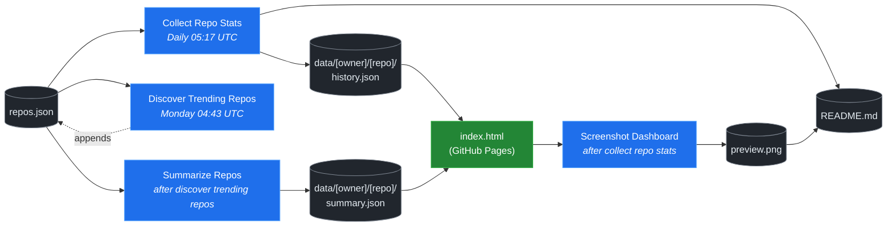

# 🚀 Rising Repos Tracker

> Automatically tracks daily GitHub stats (stars, forks, issues, velocity) for rising open source repos.

[](https://www.telosignal.com/)


**[→ View Live Dashboard](https://patrick-creates.github.io/rising-repos-tracker/)**

Built and maintained by [Telosignal](https://www.telosignal.com/).


<!-- AUTOGEN-STATS-START -->
## 📊 Current snapshot

> Auto-updated daily — last refreshed 2026-07-25

| Metric | Value |
|---|---|
| Repos tracked | **171** |
| Total stars | **8,032,935** |
| Total forks | **1,214,848** |
| Fastest growing | **ai-agent-book** (+2282.8/day) |

### 🔥 Top 5 by velocity

| # | Repo | Stars | Stars/day |
|---|---|---:|---:|
| 1 | [bojieli/ai-agent-book](https://github.com/bojieli/ai-agent-book) | 19,367 | +2282.8 |
| 2 | [DietrichGebert/ponytail](https://github.com/DietrichGebert/ponytail) | 89,104 | +1245.0 |
| 3 | [NousResearch/hermes-agent](https://github.com/NousResearch/hermes-agent) | 220,141 | +987.6 |
| 4 | [diegosouzapw/OmniRoute](https://github.com/diegosouzapw/OmniRoute) | 29,241 | +899.4 |
| 5 | [chopratejas/headroom](https://github.com/chopratejas/headroom) | 62,267 | +852.6 |

### 🆕 Recently added

- [KKKKhazix/khazix-skills](https://github.com/KKKKhazix/khazix-skills) — added 2026-07-20 — 数字生命卡兹克开源的 AI Skills 合集 | Agent Skills: neat-freak 洁癖 (docs/memory closeout), hv-analysis, khazix-writer & more — Claude Code, Codex & 40+ agents
- [OpenByteInc/QuantDinger](https://github.com/OpenByteInc/QuantDinger) — added 2026-07-20 — AI quantitative trading platform for crypto, stocks, and forex with backtesting, live trading, market data, and multi-agent research.vibe-trading ,trading-agents,ai-trader,ai-trading
- [bojieli/ai-agent-book](https://github.com/bojieli/ai-agent-book) — added 2026-07-20 — 《深入理解 AI Agent：设计原理与工程实践》（李博杰 著）开源主仓库：全书正文、编译版 PDF 与按章配套代码
<!-- AUTOGEN-STATS-END -->

<!-- AUTOGEN-DIAGRAM-START -->
## 🔄 How it works


```mermaid
graph LR
    repos[("repos.json")]:::data
    history[("data/[owner]/[repo]/<br/>history.json")]:::data
    summary[("data/[owner]/[repo]/<br/>summary.json")]:::data
    readme[("README.md")]:::data
    preview[("preview.png")]:::data
    dashboard["index.html<br/>(GitHub Pages)"]:::output
    collect_yml["Collect Repo Stats<br/><i>Daily 05:17 UTC</i>"]:::workflow
    discover_yml["Discover Trending Repos<br/><i>Monday 04:43 UTC</i>"]:::workflow
    screenshot_yml["Screenshot Dashboard<br/><i>after collect repo stats</i>"]:::workflow
    summarize_yml["Summarize Repos<br/><i>after discover trending repos</i>"]:::workflow
    repos --> collect_yml
    collect_yml --> history
    collect_yml --> readme
    repos --> discover_yml
    discover_yml -.->|appends| repos
    dashboard --> screenshot_yml
    screenshot_yml --> preview
    repos --> summarize_yml
    summarize_yml --> summary
    history --> dashboard
    summary --> dashboard
    preview --> readme
    classDef workflow fill:#1f6feb,stroke:#58a6ff,color:#fff
    classDef data fill:#21262d,stroke:#7d8590,color:#e6edf3
    classDef output fill:#238636,stroke:#3fb950,color:#fff
```
<!-- AUTOGEN-DIAGRAM-END -->

<!-- AUTOGEN-WORKFLOWS-START -->
## ⚙️ Workflows

| File | Schedule | Name |
|---|---|---|
| `collect.yml` | Daily 05:17 UTC | Collect Repo Stats |
| `discover.yml` | Monday 04:43 UTC | Discover Trending Repos |
| `screenshot.yml` | After Collect Repo Stats | Screenshot Dashboard |
| `summarize.yml` | After Discover Trending Repos | Summarize Repos |

> All workflows commit results directly back to the repo. Schedules are best-effort — GitHub Actions cron can drift by a few minutes.
<!-- AUTOGEN-WORKFLOWS-END -->

<!-- AUTOGEN-REPOS-START -->
## 📋 All tracked repos

| Repo | Stars | Forks | Stars/day |
|---|---:|---:|---:|
| [openclaw/openclaw](https://github.com/openclaw/openclaw) | 384,072 | 80,698 | +172.6 |
| [obra/superpowers](https://github.com/obra/superpowers) | 260,697 | 23,257 | +761.2 |
| [affaan-m/everything-claude-code](https://github.com/affaan-m/everything-claude-code) | 232,996 | 35,512 | +711.6 |
| [affaan-m/ECC](https://github.com/affaan-m/ECC) | 232,996 | 35,512 | +668.3 |
| [NousResearch/hermes-agent](https://github.com/NousResearch/hermes-agent) | 220,141 | 41,865 | +987.6 |
| [Significant-Gravitas/AutoGPT](https://github.com/Significant-Gravitas/AutoGPT) | 185,683 | 46,071 | +19.2 |
| [microsoft/markitdown](https://github.com/microsoft/markitdown) | 168,867 | 12,197 | +628.2 |
| [f/prompts.chat](https://github.com/f/prompts.chat) | 166,326 | 21,491 | +56.9 |
| [langgenius/dify](https://github.com/langgenius/dify) | 150,171 | 23,669 | +122.5 |
| [open-webui/open-webui](https://github.com/open-webui/open-webui) | 146,663 | 21,312 | +133.8 |
| [langchain-ai/langchain](https://github.com/langchain-ai/langchain) | 142,557 | 23,736 | +81.1 |
| [github/spec-kit](https://github.com/github/spec-kit) | 123,697 | 11,039 | +353.9 |
| [farion1231/cc-switch](https://github.com/farion1231/cc-switch) | 121,008 | 8,134 | +690.6 |
| [microsoft/generative-ai-for-beginners](https://github.com/microsoft/generative-ai-for-beginners) | 113,476 | 60,917 | +37.3 |
| [nextlevelbuilder/ui-ux-pro-max-skill](https://github.com/nextlevelbuilder/ui-ux-pro-max-skill) | 109,879 | 11,714 | +438.2 |
| [JuliusBrussee/caveman](https://github.com/JuliusBrussee/caveman) | 92,817 | 5,269 | +460.4 |
| [DietrichGebert/ponytail](https://github.com/DietrichGebert/ponytail) | 89,104 | 4,887 | +1245.0 |
| [ChatGPTNextWeb/NextChat](https://github.com/ChatGPTNextWeb/NextChat) | 88,544 | 59,376 | +7.5 |
| [thedotmack/claude-mem](https://github.com/thedotmack/claude-mem) | 88,501 | 7,683 | +179.7 |
| [vllm-project/vllm](https://github.com/vllm-project/vllm) | 87,112 | 19,834 | +99.0 |
| [ruvnet/RuView](https://github.com/ruvnet/RuView) | 86,094 | 11,460 | +331.2 |
| [OpenHands/OpenHands](https://github.com/OpenHands/OpenHands) | 82,017 | 10,495 | +118.9 |
| [nexu-io/open-design](https://github.com/nexu-io/open-design) | 81,391 | 9,417 | +547.3 |
| [lobehub/lobehub](https://github.com/lobehub/lobehub) | 80,785 | 15,699 | +51.9 |
| [dair-ai/Prompt-Engineering-Guide](https://github.com/dair-ai/Prompt-Engineering-Guide) | 76,909 | 8,450 | +32.5 |
| [openai/openai-cookbook](https://github.com/openai/openai-cookbook) | 74,862 | 12,668 | +18.4 |
| [koala73/worldmonitor](https://github.com/koala73/worldmonitor) | 73,607 | 11,036 | +282.9 |
| [rtk-ai/rtk](https://github.com/rtk-ai/rtk) | 73,154 | 4,564 | +346.7 |
| [shareAI-lab/learn-claude-code](https://github.com/shareAI-lab/learn-claude-code) | 72,177 | 11,700 | +163.2 |
| [ComposioHQ/awesome-claude-skills](https://github.com/ComposioHQ/awesome-claude-skills) | 70,232 | 7,914 | +144.8 |
| [unslothai/unsloth](https://github.com/unslothai/unsloth) | 68,860 | 6,202 | +64.1 |
| [datawhalechina/hello-agents](https://github.com/datawhalechina/hello-agents) | 68,498 | 8,526 | +262.3 |
| [Leonxlnx/taste-skill](https://github.com/Leonxlnx/taste-skill) | 67,362 | 4,639 | +684.2 |
| [code-yeongyu/oh-my-openagent](https://github.com/code-yeongyu/oh-my-openagent) | 66,562 | 5,427 | +121.1 |
| [xtekky/gpt4free](https://github.com/xtekky/gpt4free) | 66,485 | 13,531 | +3.6 |
| [shanraisshan/claude-code-best-practice](https://github.com/shanraisshan/claude-code-best-practice) | 63,455 | 6,331 | +146.4 |
| [Fission-AI/OpenSpec](https://github.com/Fission-AI/OpenSpec) | 62,491 | 4,322 | +201.5 |
| [chopratejas/headroom](https://github.com/chopratejas/headroom) | 62,267 | 4,697 | +852.6 |
| [headroomlabs-ai/headroom](https://github.com/headroomlabs-ai/headroom) | 62,267 | 4,697 | +495.9 |
| [santifer/career-ops](https://github.com/santifer/career-ops) | 61,419 | 12,093 | +237.8 |
| [Panniantong/Agent-Reach](https://github.com/Panniantong/Agent-Reach) | 60,684 | 4,895 | +791.6 |
| [asgeirtj/system_prompts_leaks](https://github.com/asgeirtj/system_prompts_leaks) | 60,368 | 9,840 | +293.9 |
| [tw93/Pake](https://github.com/tw93/Pake) | 60,195 | 12,206 | +167.9 |
| [ZhuLinsen/daily_stock_analysis](https://github.com/ZhuLinsen/daily_stock_analysis) | 58,715 | 50,373 | +325.8 |
| [MemPalace/mempalace](https://github.com/MemPalace/mempalace) | 57,712 | 7,433 | +78.1 |
| [FlowiseAI/Flowise](https://github.com/FlowiseAI/Flowise) | 54,903 | 24,756 | +29.5 |
| [BerriAI/litellm](https://github.com/BerriAI/litellm) | 54,648 | 10,058 | +106.8 |
| [mvanhorn/last30days-skill](https://github.com/mvanhorn/last30days-skill) | 53,482 | 4,630 | +442.8 |
| [ggml-org/whisper.cpp](https://github.com/ggml-org/whisper.cpp) | 52,277 | 5,878 | +36.0 |
| [hesreallyhim/awesome-claude-code](https://github.com/hesreallyhim/awesome-claude-code) | 50,882 | 4,431 | +99.8 |
| [Aider-AI/aider](https://github.com/Aider-AI/aider) | 47,683 | 4,769 | +40.0 |
| [ChromeDevTools/chrome-devtools-mcp](https://github.com/ChromeDevTools/chrome-devtools-mcp) | 47,562 | 3,188 | +112.9 |
| [jamiepine/voicebox](https://github.com/jamiepine/voicebox) | 46,548 | 5,702 | +324.6 |
| [HKUDS/nanobot](https://github.com/HKUDS/nanobot) | 46,210 | 8,177 | +51.9 |
| [zhayujie/CowAgent](https://github.com/zhayujie/CowAgent) | 46,115 | 10,274 | +22.9 |
| [elder-plinius/CL4R1T4S](https://github.com/elder-plinius/CL4R1T4S) | 46,040 | 9,385 | +178.7 |
| [router-for-me/CLIProxyAPI](https://github.com/router-for-me/CLIProxyAPI) | 44,756 | 6,997 | +164.1 |
| [usestrix/strix](https://github.com/usestrix/strix) | 44,059 | 4,550 | +339.8 |
| [sickn33/antigravity-awesome-skills](https://github.com/sickn33/antigravity-awesome-skills) | 43,866 | 6,479 | +85.0 |
| [sickn33/agentic-awesome-skills](https://github.com/sickn33/agentic-awesome-skills) | 43,866 | 6,479 | +68.7 |
| [QuantumNous/new-api](https://github.com/QuantumNous/new-api) | 43,356 | 10,108 | +131.1 |
| [rohitg00/ai-engineering-from-scratch](https://github.com/rohitg00/ai-engineering-from-scratch) | 43,261 | 7,239 | +312.9 |
| [kepano/obsidian-skills](https://github.com/kepano/obsidian-skills) | 43,229 | 3,083 | +173.1 |
| [calesthio/OpenMontage](https://github.com/calesthio/OpenMontage) | 42,060 | 5,014 | +546.5 |
| [coreyhaines31/marketingskills](https://github.com/coreyhaines31/marketingskills) | 41,603 | 6,553 | +188.2 |
| [danny-avila/LibreChat](https://github.com/danny-avila/LibreChat) | 41,258 | 8,490 | +62.1 |
| [chatboxai/chatbox](https://github.com/chatboxai/chatbox) | 41,129 | 4,160 | +16.7 |
| [Hmbown/CodeWhale](https://github.com/Hmbown/CodeWhale) | 40,090 | 3,452 | +88.9 |
| [mindsdb/mindshub](https://github.com/mindsdb/mindshub) | 39,491 | 6,223 | +7.5 |
| [chatanywhere/GPT_API_free](https://github.com/chatanywhere/GPT_API_free) | 38,928 | 2,675 | +12.7 |
| [wshobson/agents](https://github.com/wshobson/agents) | 38,207 | 4,092 | +37.2 |
| [langchain-ai/langgraph](https://github.com/langchain-ai/langgraph) | 38,090 | 6,399 | +80.9 |
| [Yeachan-Heo/oh-my-claudecode](https://github.com/Yeachan-Heo/oh-my-claudecode) | 38,052 | 3,430 | +52.9 |
| [AstrBotDevs/AstrBot](https://github.com/AstrBotDevs/AstrBot) | 38,033 | 2,690 | +82.3 |
| [google/langextract](https://github.com/google/langextract) | 37,809 | 2,621 | +20.6 |
| [heygen-com/hyperframes](https://github.com/heygen-com/hyperframes) | 37,524 | 3,538 | +254.5 |
| [github/awesome-copilot](https://github.com/github/awesome-copilot) | 37,014 | 4,637 | +52.6 |
| [songquanpeng/one-api](https://github.com/songquanpeng/one-api) | 35,940 | 6,755 | +28.4 |
| [PDFMathTranslate/PDFMathTranslate](https://github.com/PDFMathTranslate/PDFMathTranslate) | 35,776 | 3,183 | +28.9 |
| [DeusData/codebase-memory-mcp](https://github.com/DeusData/codebase-memory-mcp) | 35,108 | 2,721 | +556.8 |
| [anthropics/claude-plugins-official](https://github.com/anthropics/claude-plugins-official) | 32,627 | 3,659 | +67.0 |
| [zeroclaw-labs/zeroclaw](https://github.com/zeroclaw-labs/zeroclaw) | 32,388 | 4,841 | +13.2 |
| [iOfficeAI/AionUi](https://github.com/iOfficeAI/AionUi) | 30,824 | 3,101 | +64.4 |
| [AlexsJones/llmfit](https://github.com/AlexsJones/llmfit) | 30,601 | 1,864 | +66.7 |
| [Gitlawb/openclaude](https://github.com/Gitlawb/openclaude) | 30,332 | 8,891 | +40.7 |
| [JCodesMore/ai-website-cloner-template](https://github.com/JCodesMore/ai-website-cloner-template) | 30,132 | 4,320 | +328.5 |
| [googleworkspace/cli](https://github.com/googleworkspace/cli) | 29,994 | 1,751 | +60.7 |
| [diegosouzapw/OmniRoute](https://github.com/diegosouzapw/OmniRoute) | 29,241 | 3,815 | +899.4 |
| [voideditor/void](https://github.com/voideditor/void) | 28,875 | 2,598 | +1.3 |
| [stablyai/orca](https://github.com/stablyai/orca) | 28,559 | 2,027 | +840.8 |
| [alibaba/page-agent](https://github.com/alibaba/page-agent) | 27,755 | 2,437 | +229.9 |
| [esengine/DeepSeek-Reasonix](https://github.com/esengine/DeepSeek-Reasonix) | 27,744 | 1,779 | +174.9 |
| [BloopAI/vibe-kanban](https://github.com/BloopAI/vibe-kanban) | 27,502 | 2,917 | +14.7 |
| [HKUDS/Vibe-Trading](https://github.com/HKUDS/Vibe-Trading) | 27,400 | 4,457 | +487.0 |
| [volcengine/OpenViking](https://github.com/volcengine/OpenViking) | 27,202 | 2,139 | +39.9 |
| [jackwener/OpenCLI](https://github.com/jackwener/OpenCLI) | 27,192 | 2,678 | +72.2 |
| [jarrodwatts/claude-hud](https://github.com/jarrodwatts/claude-hud) | 26,789 | 1,241 | +44.7 |
| [langchain-ai/deepagents](https://github.com/langchain-ai/deepagents) | 26,785 | 3,750 | +56.0 |
| [p-e-w/heretic](https://github.com/p-e-w/heretic) | 26,714 | 2,915 | +58.3 |
| [mukul975/Anthropic-Cybersecurity-Skills](https://github.com/mukul975/Anthropic-Cybersecurity-Skills) | 26,513 | 3,203 | +254.3 |
| [MadsLorentzen/ai-job-search](https://github.com/MadsLorentzen/ai-job-search) | 26,439 | 8,668 | +404.7 |
| [tirth8205/code-review-graph](https://github.com/tirth8205/code-review-graph) | 26,293 | 2,457 | +194.5 |
| [zai-org/Open-AutoGLM](https://github.com/zai-org/Open-AutoGLM) | 25,853 | 4,012 | +8.3 |
| [rohitg00/agentmemory](https://github.com/rohitg00/agentmemory) | 25,744 | 2,138 | +83.4 |
| [manaflow-ai/cmux](https://github.com/manaflow-ai/cmux) | 25,102 | 2,071 | +62.2 |
| [toon-format/toon](https://github.com/toon-format/toon) | 24,979 | 1,108 | +10.3 |
| [agentscope-ai/QwenPaw](https://github.com/agentscope-ai/QwenPaw) | 24,326 | 2,851 | +163.7 |
| [decolua/9router](https://github.com/decolua/9router) | 23,473 | 3,947 | +147.6 |
| [winfunc/opcode](https://github.com/winfunc/opcode) | 22,218 | 1,712 | +4.5 |
| [iOfficeAI/OfficeCLI](https://github.com/iOfficeAI/OfficeCLI) | 22,001 | 1,480 | +716.0 |
| [coze-dev/coze-studio](https://github.com/coze-dev/coze-studio) | 21,244 | 3,087 | +6.3 |
| [NirDiamant/agents-towards-production](https://github.com/NirDiamant/agents-towards-production) | 21,175 | 2,816 | +11.5 |
| [ogulcancelik/herdr](https://github.com/ogulcancelik/herdr) | 20,512 | 1,349 | +427.1 |
| [can1357/oh-my-pi](https://github.com/can1357/oh-my-pi) | 19,635 | 1,843 | +170.9 |
| [bojieli/ai-agent-book](https://github.com/bojieli/ai-agent-book) | 19,367 | 1,936 | +2282.8 |
| [mksglu/context-mode](https://github.com/mksglu/context-mode) | 19,314 | 1,361 | +46.1 |
| [tanweai/pua](https://github.com/tanweai/pua) | 19,021 | 1,150 | +19.4 |
| [steipete/CodexBar](https://github.com/steipete/CodexBar) | 19,005 | 1,576 | +115.2 |
| [Tencent/WeKnora](https://github.com/Tencent/WeKnora) | 18,879 | 2,643 | +64.7 |
| [datawhalechina/easy-vibe](https://github.com/datawhalechina/easy-vibe) | 18,501 | 1,763 | +39.0 |
| [pranshuparmar/witr](https://github.com/pranshuparmar/witr) | 18,303 | 573 | +10.4 |
| [jnMetaCode/agency-agents-zh](https://github.com/jnMetaCode/agency-agents-zh) | 18,292 | 3,050 | +87.5 |
| [jundot/omlx](https://github.com/jundot/omlx) | 18,155 | 1,549 | +38.1 |
| [RightNow-AI/openfang](https://github.com/RightNow-AI/openfang) | 18,053 | 2,281 | +5.7 |
| [KKKKhazix/khazix-skills](https://github.com/KKKKhazix/khazix-skills) | 17,888 | 2,017 | +86.0 |
| [microsoft/agent-lightning](https://github.com/microsoft/agent-lightning) | 17,423 | 1,525 | +2.8 |
| [danielmiessler/LifeOS](https://github.com/danielmiessler/LifeOS) | 16,914 | 2,295 | +25.7 |
| [nesquena/hermes-webui](https://github.com/nesquena/hermes-webui) | 16,500 | 2,215 | +50.4 |
| [cft0808/edict](https://github.com/cft0808/edict) | 16,272 | 1,710 | +5.3 |
| [browser-use/browser-harness](https://github.com/browser-use/browser-harness) | 16,239 | 1,537 | +29.2 |
| [MemoriLabs/Memori](https://github.com/MemoriLabs/Memori) | 15,655 | 2,880 | +9.5 |
| [xpzouying/xiaohongshu-mcp](https://github.com/xpzouying/xiaohongshu-mcp) | 14,838 | 2,187 | +16.7 |
| [kyegomez/OpenMythos](https://github.com/kyegomez/OpenMythos) | 14,756 | 3,301 | +18.2 |
| [yusufkaraaslan/Skill_Seekers](https://github.com/yusufkaraaslan/Skill_Seekers) | 14,555 | 1,475 | +10.0 |
| [NevaMind-AI/memU](https://github.com/NevaMind-AI/memU) | 14,059 | 1,042 | +4.8 |
| [xbtlin/ai-berkshire](https://github.com/xbtlin/ai-berkshire) | 13,949 | 1,957 | +166.9 |
| [wanshuiyin/Auto-claude-code-research-in-sleep](https://github.com/wanshuiyin/Auto-claude-code-research-in-sleep) | 13,829 | 1,238 | +40.6 |
| [superset-sh/superset](https://github.com/superset-sh/superset) | 12,592 | 1,116 | +16.6 |
| [alibaba/open-code-review](https://github.com/alibaba/open-code-review) | 12,502 | 850 | +132.4 |
| [XiaomiMiMo/MiMo-Code](https://github.com/XiaomiMiMo/MiMo-Code) | 12,421 | 1,263 | +53.7 |
| [sirmalloc/ccstatusline](https://github.com/sirmalloc/ccstatusline) | 11,986 | 528 | +27.2 |
| [EverMind-AI/EverOS](https://github.com/EverMind-AI/EverOS) | 11,508 | 869 | +69.0 |
| [1jehuang/jcode](https://github.com/1jehuang/jcode) | 11,277 | 1,234 | +247.7 |
| [ValueCell-ai/valuecell](https://github.com/ValueCell-ai/valuecell) | 10,947 | 1,813 | +2.9 |
| [aden-hive/hive](https://github.com/aden-hive/hive) | 10,767 | 5,667 | +6.0 |
| [walkinglabs/learn-harness-engineering](https://github.com/walkinglabs/learn-harness-engineering) | 10,694 | 1,160 | +42.6 |
| [0x4m4/hexstrike-ai](https://github.com/0x4m4/hexstrike-ai) | 10,478 | 2,180 | +18.0 |
| [MemTensor/MemOS](https://github.com/MemTensor/MemOS) | 10,369 | 945 | +13.2 |
| [Kuberwastaken/claurst](https://github.com/Kuberwastaken/claurst) | 10,137 | 7,778 | +10.4 |
| [brokermr810/QuantDinger](https://github.com/brokermr810/QuantDinger) | 9,968 | 2,096 | +36.1 |
| [OpenByteInc/QuantDinger](https://github.com/OpenByteInc/QuantDinger) | 9,968 | 2,096 | +33.2 |
| [ConardLi/garden-skills](https://github.com/ConardLi/garden-skills) | 9,779 | 1,291 | +31.5 |
| [frankbria/ralph-claude-code](https://github.com/frankbria/ralph-claude-code) | 9,563 | 730 | +6.2 |
| [EKKOLearnAI/hermes-studio](https://github.com/EKKOLearnAI/hermes-studio) | 9,468 | 1,161 | +32.0 |
| [ykdojo/claude-code-tips](https://github.com/ykdojo/claude-code-tips) | 9,431 | 748 | +21.8 |
| [iflytek/astron-agent](https://github.com/iflytek/astron-agent) | 9,389 | 874 | +41.0 |
| [TencentCloud/TencentDB-Agent-Memory](https://github.com/TencentCloud/TencentDB-Agent-Memory) | 9,272 | 883 | +46.2 |
| [getagentseal/codeburn](https://github.com/getagentseal/codeburn) | 8,917 | 697 | +23.5 |
| [EvoMap/evolver](https://github.com/EvoMap/evolver) | 8,873 | 823 | +0.9 |
| [MiroMindAI/MiroThinker](https://github.com/MiroMindAI/MiroThinker) | 8,346 | 645 | +1.1 |
| [mmulet/term.everything](https://github.com/mmulet/term.everything) | 8,053 | 192 | +1.8 |
| [modem-dev/hunk](https://github.com/modem-dev/hunk) | 7,716 | 219 | +84.3 |
| [ValueCell-ai/ClawX](https://github.com/ValueCell-ai/ClawX) | 7,550 | 1,128 | +0.8 |
| [StarTrail-org/PixelRAG](https://github.com/StarTrail-org/PixelRAG) | 7,130 | 591 | +45.4 |
| [steipete/summarize](https://github.com/steipete/summarize) | 6,478 | 439 | +5.7 |
| [opensquilla/opensquilla](https://github.com/opensquilla/opensquilla) | 6,329 | 478 | +24.0 |
| [Arthur-Ficial/apfel](https://github.com/Arthur-Ficial/apfel) | 6,195 | 235 | +6.7 |
| [UfoMiao/zcf](https://github.com/UfoMiao/zcf) | 6,079 | 423 | +0.8 |
| [microsoft/fara](https://github.com/microsoft/fara) | 6,035 | 588 | +3.0 |
| [Andyyyy64/whichllm](https://github.com/Andyyyy64/whichllm) | 5,980 | 317 | +22.6 |
| [re4/LibreCode](https://github.com/re4/LibreCode) | 78 | 4 | — |
<!-- AUTOGEN-REPOS-END -->

---

## What it does

- Collects daily snapshots of stars, forks, watchers and open issues for every tracked repo
- Discovers new trending repos automatically every Monday using the GitHub Search API
- Generates AI summaries (use cases, similar tools, tags) for each tracked repo via GitHub Models
- Stores all history as plain JSON — no database, no backend
- Renders a live dashboard via GitHub Pages — updates daily, zero maintenance

## Tracked repos

Data lives in [`data/`](./data) — one folder per repo, one `history.json` per entry.  
The full watch list is in [`repos.json`](./repos.json).

## Fork & use it for yourself

This is my personal tracker — the watch list reflects what I find interesting. If you want to track different repos, the best path is to **fork this repo and run your own**.

### Setup

1. Fork this repo to your account
2. Replace the contents of [`repos.json`](./repos.json) with the repos you want to track (or just leave one entry — `discover.yml` will auto-add more every Monday)
3. Go to **Settings → Pages** and enable GitHub Pages from the `main` branch
4. Go to **Actions** and run **Collect Repo Stats** once manually to seed your first data point
5. Your dashboard will be live at `https://YOUR-USERNAME.github.io/rising-repos-tracker/`

That's it — daily collection and weekly discovery run automatically on schedule. Zero ongoing maintenance.

### Customizing what gets discovered

Edit [`scripts/discover.js`](./scripts/discover.js) to change:

- `MIN_STARS` — minimum star threshold for candidates
- `MAX_AGE_DAYS` — how recent a repo must be
- `MAX_NEW_REPOS` — how many to add per discovery run
- The `queries` array — GitHub Search API queries that define what "trending" means to you

### Adding a repo manually

Just edit `repos.json` directly:

```json
{
  "owner": "OWNER",
  "repo": "REPO",
  "added": "YYYY-MM-DD",
  "notes": "why you're tracking this"
}
```

The next daily collect run picks it up automatically.

## Stack

- **GitHub Actions** — scheduling and automation
- **GitHub Pages** — dashboard hosting
- **GitHub API** — data source
- **GitHub Models** — free AI summaries (gpt-4o-mini)
- **Chart.js** — star growth visualization
- **Mermaid** — architecture diagram (rendered by GitHub)
- No dependencies, no build step, no database

## License

MIT
