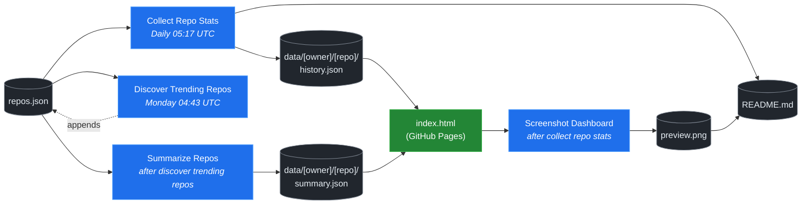

# 🚀 Rising Repos Tracker

> Automatically tracks daily GitHub stats (stars, forks, issues, velocity) for rising open source repos.

[](https://www.telosignal.com/)


**[→ View Live Dashboard](https://patrick-creates.github.io/rising-repos-tracker/)**

Built and maintained by [Telosignal](https://www.telosignal.com/).


<!-- AUTOGEN-STATS-START -->
## 📊 Current snapshot

> Auto-updated daily — last refreshed 2026-08-02

| Metric | Value |
|---|---|
| Repos tracked | **175** |
| Total stars | **8,370,916** |
| Total forks | **1,252,729** |
| Fastest growing | **ai-agent-book** (+1653.2/day) |

### 🔥 Top 5 by velocity

| # | Repo | Stars | Stars/day |
|---|---|---:|---:|
| 1 | [bojieli/ai-agent-book](https://github.com/bojieli/ai-agent-book) | 29,444 | +1653.2 |
| 2 | [DietrichGebert/ponytail](https://github.com/DietrichGebert/ponytail) | 93,652 | +1113.0 |
| 3 | [NousResearch/hermes-agent](https://github.com/NousResearch/hermes-agent) | 223,960 | +937.2 |
| 4 | [diegosouzapw/OmniRoute](https://github.com/diegosouzapw/OmniRoute) | 37,267 | +930.2 |
| 5 | [stablyai/orca](https://github.com/stablyai/orca) | 35,344 | +843.0 |

### 🆕 Recently added

- [Graphify-Labs/graphify](https://github.com/Graphify-Labs/graphify) — added 2026-07-27 — Turn any codebase, with its docs, SQL schemas, configs, and PDFs, into a queryable knowledge graph. A /graphify skill for Claude Code, Cursor, Codex, and Gemini CLI: local deterministic AST parsing, every edge explained, no vector store.
- [Imbad0202/academic-research-skills](https://github.com/Imbad0202/academic-research-skills) — added 2026-07-27 — Academic Research Skills for Claude Code: research → write → review → revise → finalize
- [Anionex/banana-slides](https://github.com/Anionex/banana-slides) — added 2026-07-27 — 一个基于nano banana pro🍌的原生AI PPT生成应用，迈向＂Vibe PPT＂; 支持上传任意模板图片，上传任意素材&智能解析，一句话/大纲/页面描述自动生成PPT，口头修改指定区域、一键导出可编辑ppt - An AI-native slides generator based on nano banana pro🍌
<!-- AUTOGEN-STATS-END -->

<!-- AUTOGEN-DIAGRAM-START -->
## 🔄 How it works


```mermaid
graph LR
    repos[("repos.json")]:::data
    history[("data/[owner]/[repo]/<br/>history.json")]:::data
    summary[("data/[owner]/[repo]/<br/>summary.json")]:::data
    readme[("README.md")]:::data
    preview[("preview.png")]:::data
    dashboard["index.html<br/>(GitHub Pages)"]:::output
    collect_yml["Collect Repo Stats<br/><i>Daily 05:17 UTC</i>"]:::workflow
    discover_yml["Discover Trending Repos<br/><i>Monday 04:43 UTC</i>"]:::workflow
    screenshot_yml["Screenshot Dashboard<br/><i>after collect repo stats</i>"]:::workflow
    summarize_yml["Summarize Repos<br/><i>after discover trending repos</i>"]:::workflow
    repos --> collect_yml
    collect_yml --> history
    collect_yml --> readme
    repos --> discover_yml
    discover_yml -.->|appends| repos
    dashboard --> screenshot_yml
    screenshot_yml --> preview
    repos --> summarize_yml
    summarize_yml --> summary
    history --> dashboard
    summary --> dashboard
    preview --> readme
    classDef workflow fill:#1f6feb,stroke:#58a6ff,color:#fff
    classDef data fill:#21262d,stroke:#7d8590,color:#e6edf3
    classDef output fill:#238636,stroke:#3fb950,color:#fff
```
<!-- AUTOGEN-DIAGRAM-END -->

<!-- AUTOGEN-WORKFLOWS-START -->
## ⚙️ Workflows

| File | Schedule | Name |
|---|---|---|
| `collect.yml` | Daily 05:17 UTC | Collect Repo Stats |
| `discover.yml` | Monday 04:43 UTC | Discover Trending Repos |
| `screenshot.yml` | After Collect Repo Stats | Screenshot Dashboard |
| `summarize.yml` | After Discover Trending Repos | Summarize Repos |

> All workflows commit results directly back to the repo. Schedules are best-effort — GitHub Actions cron can drift by a few minutes.
<!-- AUTOGEN-WORKFLOWS-END -->

<!-- AUTOGEN-REPOS-START -->
## 📋 All tracked repos

| Repo | Stars | Forks | Stars/day |
|---|---:|---:|---:|
| [openclaw/openclaw](https://github.com/openclaw/openclaw) | 384,872 | 80,879 | +165.4 |
| [obra/superpowers](https://github.com/obra/superpowers) | 264,883 | 23,651 | +714.8 |
| [affaan-m/everything-claude-code](https://github.com/affaan-m/everything-claude-code) | 236,882 | 36,014 | +689.3 |
| [affaan-m/ECC](https://github.com/affaan-m/ECC) | 236,882 | 36,014 | +647.1 |
| [NousResearch/hermes-agent](https://github.com/NousResearch/hermes-agent) | 223,960 | 43,251 | +937.2 |
| [Significant-Gravitas/AutoGPT](https://github.com/Significant-Gravitas/AutoGPT) | 185,757 | 46,053 | +18.2 |
| [microsoft/markitdown](https://github.com/microsoft/markitdown) | 170,726 | 12,403 | +589.1 |
| [f/prompts.chat](https://github.com/f/prompts.chat) | 166,611 | 21,516 | +54.8 |
| [langgenius/dify](https://github.com/langgenius/dify) | 151,039 | 23,829 | +121.2 |
| [open-webui/open-webui](https://github.com/open-webui/open-webui) | 147,570 | 21,440 | +131.8 |
| [langchain-ai/langchain](https://github.com/langchain-ai/langchain) | 143,199 | 23,854 | +81.0 |
| [github/spec-kit](https://github.com/github/spec-kit) | 124,948 | 11,161 | +334.4 |
| [farion1231/cc-switch](https://github.com/farion1231/cc-switch) | 123,364 | 8,348 | +648.9 |
| [microsoft/generative-ai-for-beginners](https://github.com/microsoft/generative-ai-for-beginners) | 114,376 | 61,244 | +44.7 |
| [nextlevelbuilder/ui-ux-pro-max-skill](https://github.com/nextlevelbuilder/ui-ux-pro-max-skill) | 112,495 | 12,017 | +427.2 |
| [Graphify-Labs/graphify](https://github.com/Graphify-Labs/graphify) | 100,495 | 9,752 | +632.8 |
| [JuliusBrussee/caveman](https://github.com/JuliusBrussee/caveman) | 95,145 | 5,455 | +442.5 |
| [DietrichGebert/ponytail](https://github.com/DietrichGebert/ponytail) | 93,652 | 5,151 | +1113.0 |
| [thedotmack/claude-mem](https://github.com/thedotmack/claude-mem) | 89,283 | 7,772 | +171.6 |
| [ChatGPTNextWeb/NextChat](https://github.com/ChatGPTNextWeb/NextChat) | 88,579 | 59,348 | +7.1 |
| [ruvnet/RuView](https://github.com/ruvnet/RuView) | 88,117 | 11,705 | +322.1 |
| [vllm-project/vllm](https://github.com/vllm-project/vllm) | 87,914 | 20,159 | +99.1 |
| [nexu-io/open-design](https://github.com/nexu-io/open-design) | 83,096 | 9,624 | +512.1 |
| [OpenHands/OpenHands](https://github.com/OpenHands/OpenHands) | 82,831 | 10,669 | +117.1 |
| [lobehub/lobehub](https://github.com/lobehub/lobehub) | 81,075 | 15,743 | +50.3 |
| [koala73/worldmonitor](https://github.com/koala73/worldmonitor) | 77,894 | 11,639 | +309.6 |
| [dair-ai/Prompt-Engineering-Guide](https://github.com/dair-ai/Prompt-Engineering-Guide) | 77,193 | 8,483 | +32.8 |
| [openai/openai-cookbook](https://github.com/openai/openai-cookbook) | 75,057 | 12,689 | +19.1 |
| [rtk-ai/rtk](https://github.com/rtk-ai/rtk) | 74,294 | 4,656 | +325.2 |
| [shareAI-lab/learn-claude-code](https://github.com/shareAI-lab/learn-claude-code) | 72,952 | 11,844 | +156.3 |
| [ComposioHQ/awesome-claude-skills](https://github.com/ComposioHQ/awesome-claude-skills) | 71,580 | 8,054 | +147.3 |
| [Leonxlnx/taste-skill](https://github.com/Leonxlnx/taste-skill) | 70,130 | 4,834 | +640.6 |
| [datawhalechina/hello-agents](https://github.com/datawhalechina/hello-agents) | 70,041 | 8,732 | +255.0 |
| [unslothai/unsloth](https://github.com/unslothai/unsloth) | 69,370 | 6,262 | +64.1 |
| [code-yeongyu/oh-my-openagent](https://github.com/code-yeongyu/oh-my-openagent) | 67,018 | 5,466 | +114.3 |
| [xtekky/gpt4free](https://github.com/xtekky/gpt4free) | 66,516 | 13,536 | +3.6 |
| [Panniantong/Agent-Reach](https://github.com/Panniantong/Agent-Reach) | 64,161 | 5,304 | +739.7 |
| [chopratejas/headroom](https://github.com/chopratejas/headroom) | 63,937 | 4,859 | +745.3 |
| [headroomlabs-ai/headroom](https://github.com/headroomlabs-ai/headroom) | 63,937 | 4,859 | +439.9 |
| [shanraisshan/claude-code-best-practice](https://github.com/shanraisshan/claude-code-best-practice) | 63,873 | 6,360 | +136.5 |
| [Fission-AI/OpenSpec](https://github.com/Fission-AI/OpenSpec) | 63,439 | 4,390 | +192.8 |
| [santifer/career-ops](https://github.com/santifer/career-ops) | 62,494 | 12,311 | +226.9 |
| [asgeirtj/system_prompts_leaks](https://github.com/asgeirtj/system_prompts_leaks) | 61,893 | 10,114 | +283.0 |
| [tw93/Pake](https://github.com/tw93/Pake) | 60,395 | 12,287 | +152.8 |
| [ZhuLinsen/daily_stock_analysis](https://github.com/ZhuLinsen/daily_stock_analysis) | 59,819 | 51,191 | +304.1 |
| [MemPalace/mempalace](https://github.com/MemPalace/mempalace) | 57,953 | 7,452 | +73.1 |
| [mvanhorn/last30days-skill](https://github.com/mvanhorn/last30days-skill) | 56,652 | 4,948 | +436.0 |
| [BerriAI/litellm](https://github.com/BerriAI/litellm) | 55,315 | 10,260 | +104.3 |
| [FlowiseAI/Flowise](https://github.com/FlowiseAI/Flowise) | 55,092 | 24,805 | +28.8 |
| [ggml-org/whisper.cpp](https://github.com/ggml-org/whisper.cpp) | 52,507 | 5,971 | +35.3 |
| [hesreallyhim/awesome-claude-code](https://github.com/hesreallyhim/awesome-claude-code) | 51,487 | 4,483 | +97.3 |
| [ChromeDevTools/chrome-devtools-mcp](https://github.com/ChromeDevTools/chrome-devtools-mcp) | 48,361 | 3,295 | +111.5 |
| [jamiepine/voicebox](https://github.com/jamiepine/voicebox) | 47,957 | 5,898 | +305.4 |
| [Aider-AI/aider](https://github.com/Aider-AI/aider) | 47,865 | 4,800 | +38.2 |
| [elder-plinius/CL4R1T4S](https://github.com/elder-plinius/CL4R1T4S) | 46,599 | 9,496 | +160.6 |
| [HKUDS/nanobot](https://github.com/HKUDS/nanobot) | 46,506 | 8,227 | +50.3 |
| [usestrix/strix](https://github.com/usestrix/strix) | 46,505 | 4,890 | +335.4 |
| [zhayujie/CowAgent](https://github.com/zhayujie/CowAgent) | 46,267 | 10,289 | +22.5 |
| [router-for-me/CLIProxyAPI](https://github.com/router-for-me/CLIProxyAPI) | 45,926 | 7,130 | +162.1 |
| [rohitg00/ai-engineering-from-scratch](https://github.com/rohitg00/ai-engineering-from-scratch) | 45,449 | 7,793 | +307.8 |
| [calesthio/OpenMontage](https://github.com/calesthio/OpenMontage) | 44,578 | 5,421 | +492.0 |
| [sickn33/antigravity-awesome-skills](https://github.com/sickn33/antigravity-awesome-skills) | 44,285 | 6,515 | +81.3 |
| [sickn33/agentic-awesome-skills](https://github.com/sickn33/agentic-awesome-skills) | 44,285 | 6,515 | +62.1 |
| [QuantumNous/new-api](https://github.com/QuantumNous/new-api) | 44,072 | 10,352 | +126.3 |
| [kepano/obsidian-skills](https://github.com/kepano/obsidian-skills) | 43,895 | 3,131 | +161.5 |
| [coreyhaines31/marketingskills](https://github.com/coreyhaines31/marketingskills) | 42,673 | 6,719 | +181.2 |
| [danny-avila/LibreChat](https://github.com/danny-avila/LibreChat) | 41,550 | 8,556 | +59.1 |
| [chatboxai/chatbox](https://github.com/chatboxai/chatbox) | 41,252 | 4,176 | +16.5 |
| [Imbad0202/academic-research-skills](https://github.com/Imbad0202/academic-research-skills) | 40,491 | 3,232 | +132.8 |
| [Hmbown/CodeWhale](https://github.com/Hmbown/CodeWhale) | 40,330 | 3,485 | +82.0 |
| [chatanywhere/GPT_API_free](https://github.com/chatanywhere/GPT_API_free) | 39,543 | 2,676 | +20.1 |
| [mindsdb/mindshub](https://github.com/mindsdb/mindshub) | 39,509 | 6,225 | +5.4 |
| [heygen-com/hyperframes](https://github.com/heygen-com/hyperframes) | 39,108 | 3,692 | +246.3 |
| [langchain-ai/langgraph](https://github.com/langchain-ai/langgraph) | 38,651 | 6,518 | +78.8 |
| [AstrBotDevs/AstrBot](https://github.com/AstrBotDevs/AstrBot) | 38,456 | 2,745 | +78.5 |
| [wshobson/agents](https://github.com/wshobson/agents) | 38,429 | 4,113 | +36.1 |
| [Yeachan-Heo/oh-my-claudecode](https://github.com/Yeachan-Heo/oh-my-claudecode) | 38,245 | 3,442 | +49.6 |
| [google/langextract](https://github.com/google/langextract) | 37,946 | 2,637 | +20.2 |
| [github/awesome-copilot](https://github.com/github/awesome-copilot) | 37,336 | 4,693 | +51.2 |
| [diegosouzapw/OmniRoute](https://github.com/diegosouzapw/OmniRoute) | 37,267 | 4,832 | +930.2 |
| [DeusData/codebase-memory-mcp](https://github.com/DeusData/codebase-memory-mcp) | 37,020 | 2,917 | +482.1 |
| [songquanpeng/one-api](https://github.com/songquanpeng/one-api) | 36,113 | 6,768 | +27.6 |
| [PDFMathTranslate/PDFMathTranslate](https://github.com/PDFMathTranslate/PDFMathTranslate) | 35,896 | 3,204 | +27.3 |
| [stablyai/orca](https://github.com/stablyai/orca) | 35,344 | 2,495 | +843.0 |
| [anthropics/claude-plugins-official](https://github.com/anthropics/claude-plugins-official) | 32,955 | 3,718 | +63.6 |
| [zeroclaw-labs/zeroclaw](https://github.com/zeroclaw-labs/zeroclaw) | 32,481 | 4,859 | +13.0 |
| [agentscope-ai/QwenPaw](https://github.com/agentscope-ai/QwenPaw) | 31,988 | 2,920 | +296.0 |
| [iOfficeAI/AionUi](https://github.com/iOfficeAI/AionUi) | 31,247 | 3,151 | +62.9 |
| [AlexsJones/llmfit](https://github.com/AlexsJones/llmfit) | 31,053 | 1,896 | +65.4 |
| [JCodesMore/ai-website-cloner-template](https://github.com/JCodesMore/ai-website-cloner-template) | 30,800 | 4,421 | +287.6 |
| [Gitlawb/openclaude](https://github.com/Gitlawb/openclaude) | 30,475 | 8,904 | +37.7 |
| [googleworkspace/cli](https://github.com/googleworkspace/cli) | 30,145 | 1,762 | +55.3 |
| [bojieli/ai-agent-book](https://github.com/bojieli/ai-agent-book) | 29,444 | 3,121 | +1653.2 |
| [HKUDS/Vibe-Trading](https://github.com/HKUDS/Vibe-Trading) | 29,230 | 4,698 | +426.2 |
| [MadsLorentzen/ai-job-search](https://github.com/MadsLorentzen/ai-job-search) | 29,145 | 9,778 | +378.1 |
| [voideditor/void](https://github.com/voideditor/void) | 28,864 | 2,604 | +1.0 |
| [esengine/DeepSeek-Reasonix](https://github.com/esengine/DeepSeek-Reasonix) | 28,627 | 1,843 | +165.5 |
| [alibaba/page-agent](https://github.com/alibaba/page-agent) | 28,354 | 2,494 | +204.1 |
| [tirth8205/code-review-graph](https://github.com/tirth8205/code-review-graph) | 27,998 | 2,596 | +197.6 |
| [volcengine/OpenViking](https://github.com/volcengine/OpenViking) | 27,730 | 2,180 | +43.7 |
| [BloopAI/vibe-kanban](https://github.com/BloopAI/vibe-kanban) | 27,621 | 2,933 | +14.7 |
| [jackwener/OpenCLI](https://github.com/jackwener/OpenCLI) | 27,573 | 2,709 | +68.6 |
| [langchain-ai/deepagents](https://github.com/langchain-ai/deepagents) | 27,209 | 3,809 | +55.5 |
| [mukul975/Anthropic-Cybersecurity-Skills](https://github.com/mukul975/Anthropic-Cybersecurity-Skills) | 27,125 | 3,287 | +219.6 |
| [jarrodwatts/claude-hud](https://github.com/jarrodwatts/claude-hud) | 27,018 | 1,252 | +42.3 |
| [p-e-w/heretic](https://github.com/p-e-w/heretic) | 27,018 | 2,926 | +55.4 |
| [rohitg00/agentmemory](https://github.com/rohitg00/agentmemory) | 26,343 | 2,223 | +82.1 |
| [zai-org/Open-AutoGLM](https://github.com/zai-org/Open-AutoGLM) | 25,936 | 4,021 | +8.6 |
| [manaflow-ai/cmux](https://github.com/manaflow-ai/cmux) | 25,481 | 2,128 | +56.3 |
| [toon-format/toon](https://github.com/toon-format/toon) | 25,048 | 1,111 | +10.0 |
| [decolua/9router](https://github.com/decolua/9router) | 24,376 | 4,224 | +141.8 |
| [iOfficeAI/OfficeCLI](https://github.com/iOfficeAI/OfficeCLI) | 24,141 | 1,628 | +583.1 |
| [ogulcancelik/herdr](https://github.com/ogulcancelik/herdr) | 23,446 | 1,609 | +409.2 |
| [winfunc/opcode](https://github.com/winfunc/opcode) | 22,337 | 1,722 | +6.0 |
| [coze-dev/coze-studio](https://github.com/coze-dev/coze-studio) | 21,308 | 3,095 | +6.5 |
| [NirDiamant/agents-towards-production](https://github.com/NirDiamant/agents-towards-production) | 21,222 | 2,814 | +10.7 |
| [can1357/oh-my-pi](https://github.com/can1357/oh-my-pi) | 21,120 | 2,014 | +173.8 |
| [mksglu/context-mode](https://github.com/mksglu/context-mode) | 19,554 | 1,396 | +43.5 |
| [steipete/CodexBar](https://github.com/steipete/CodexBar) | 19,477 | 1,632 | +104.2 |
| [Tencent/WeKnora](https://github.com/Tencent/WeKnora) | 19,242 | 2,735 | +61.5 |
| [tanweai/pua](https://github.com/tanweai/pua) | 19,147 | 1,163 | +18.8 |
| [KKKKhazix/khazix-skills](https://github.com/KKKKhazix/khazix-skills) | 18,901 | 2,094 | +111.0 |
| [datawhalechina/easy-vibe](https://github.com/datawhalechina/easy-vibe) | 18,696 | 1,776 | +36.6 |
| [jnMetaCode/agency-agents-zh](https://github.com/jnMetaCode/agency-agents-zh) | 18,664 | 3,091 | +79.5 |
| [pranshuparmar/witr](https://github.com/pranshuparmar/witr) | 18,472 | 585 | +12.9 |
| [jundot/omlx](https://github.com/jundot/omlx) | 18,378 | 1,576 | +36.4 |
| [RightNow-AI/openfang](https://github.com/RightNow-AI/openfang) | 18,073 | 2,287 | +5.1 |
| [alibaba/open-code-review](https://github.com/alibaba/open-code-review) | 17,620 | 1,199 | +282.7 |
| [microsoft/agent-lightning](https://github.com/microsoft/agent-lightning) | 17,435 | 1,523 | +2.6 |
| [danielmiessler/LifeOS](https://github.com/danielmiessler/LifeOS) | 17,123 | 2,317 | +25.8 |
| [nesquena/hermes-webui](https://github.com/nesquena/hermes-webui) | 16,826 | 2,291 | +48.5 |
| [browser-use/browser-harness](https://github.com/browser-use/browser-harness) | 16,417 | 1,551 | +27.6 |
| [cft0808/edict](https://github.com/cft0808/edict) | 16,303 | 1,709 | +5.0 |
| [MemoriLabs/Memori](https://github.com/MemoriLabs/Memori) | 15,674 | 2,884 | +8.1 |
| [Anionex/banana-slides](https://github.com/Anionex/banana-slides) | 15,362 | 1,769 | +4.8 |
| [1jehuang/jcode](https://github.com/1jehuang/jcode) | 15,030 | 1,667 | +336.3 |
| [xpzouying/xiaohongshu-mcp](https://github.com/xpzouying/xiaohongshu-mcp) | 15,024 | 2,208 | +18.0 |
| [xbtlin/ai-berkshire](https://github.com/xbtlin/ai-berkshire) | 14,869 | 2,129 | +151.6 |
| [kyegomez/OpenMythos](https://github.com/kyegomez/OpenMythos) | 14,767 | 3,299 | +14.9 |
| [yusufkaraaslan/Skill_Seekers](https://github.com/yusufkaraaslan/Skill_Seekers) | 14,676 | 1,489 | +11.0 |
| [NevaMind-AI/memU](https://github.com/NevaMind-AI/memU) | 14,227 | 1,054 | +8.0 |
| [wanshuiyin/Auto-claude-code-research-in-sleep](https://github.com/wanshuiyin/Auto-claude-code-research-in-sleep) | 14,112 | 1,255 | +39.4 |
| [t8y2/dbx](https://github.com/t8y2/dbx) | 12,947 | 1,255 | +185.0 |
| [superset-sh/superset](https://github.com/superset-sh/superset) | 12,733 | 1,151 | +16.9 |
| [XiaomiMiMo/MiMo-Code](https://github.com/XiaomiMiMo/MiMo-Code) | 12,594 | 1,286 | +46.2 |
| [sirmalloc/ccstatusline](https://github.com/sirmalloc/ccstatusline) | 12,165 | 533 | +26.0 |
| [EverMind-AI/EverOS](https://github.com/EverMind-AI/EverOS) | 11,759 | 876 | +60.1 |
| [ValueCell-ai/valuecell](https://github.com/ValueCell-ai/valuecell) | 10,954 | 1,813 | +2.4 |
| [walkinglabs/learn-harness-engineering](https://github.com/walkinglabs/learn-harness-engineering) | 10,916 | 1,186 | +38.2 |
| [aden-hive/hive](https://github.com/aden-hive/hive) | 10,826 | 5,672 | +6.3 |
| [0x4m4/hexstrike-ai](https://github.com/0x4m4/hexstrike-ai) | 10,752 | 2,240 | +21.8 |
| [MemTensor/MemOS](https://github.com/MemTensor/MemOS) | 10,544 | 967 | +15.2 |
| [TencentCloud/TencentDB-Agent-Memory](https://github.com/TencentCloud/TencentDB-Agent-Memory) | 10,450 | 996 | +86.6 |
| [brokermr810/QuantDinger](https://github.com/brokermr810/QuantDinger) | 10,182 | 2,138 | +33.3 |
| [OpenByteInc/QuantDinger](https://github.com/OpenByteInc/QuantDinger) | 10,182 | 2,138 | +29.2 |
| [Kuberwastaken/claurst](https://github.com/Kuberwastaken/claurst) | 10,171 | 7,780 | +9.0 |
| [ConardLi/garden-skills](https://github.com/ConardLi/garden-skills) | 9,986 | 1,315 | +29.8 |
| [EKKOLearnAI/hermes-studio](https://github.com/EKKOLearnAI/hermes-studio) | 9,651 | 1,181 | +29.3 |
| [frankbria/ralph-claude-code](https://github.com/frankbria/ralph-claude-code) | 9,575 | 725 | +5.7 |
| [ykdojo/claude-code-tips](https://github.com/ykdojo/claude-code-tips) | 9,510 | 753 | +18.3 |
| [iflytek/astron-agent](https://github.com/iflytek/astron-agent) | 9,278 | 873 | +24.7 |
| [getagentseal/codeburn](https://github.com/getagentseal/codeburn) | 9,088 | 714 | +22.9 |
| [EvoMap/evolver](https://github.com/EvoMap/evolver) | 8,918 | 825 | +2.3 |
| [StarTrail-org/PixelRAG](https://github.com/StarTrail-org/PixelRAG) | 8,796 | 744 | +110.5 |
| [MiroMindAI/MiroThinker](https://github.com/MiroMindAI/MiroThinker) | 8,362 | 644 | +1.3 |
| [mmulet/term.everything](https://github.com/mmulet/term.everything) | 8,057 | 192 | +1.3 |
| [modem-dev/hunk](https://github.com/modem-dev/hunk) | 8,014 | 234 | +65.5 |
| [ValueCell-ai/ClawX](https://github.com/ValueCell-ai/ClawX) | 7,558 | 1,131 | +0.8 |
| [steipete/summarize](https://github.com/steipete/summarize) | 6,504 | 440 | +4.7 |
| [opensquilla/opensquilla](https://github.com/opensquilla/opensquilla) | 6,457 | 490 | +19.1 |
| [Arthur-Ficial/apfel](https://github.com/Arthur-Ficial/apfel) | 6,237 | 239 | +6.1 |
| [microsoft/fara](https://github.com/microsoft/fara) | 6,110 | 598 | +5.5 |
| [Andyyyy64/whichllm](https://github.com/Andyyyy64/whichllm) | 6,096 | 324 | +17.6 |
| [UfoMiao/zcf](https://github.com/UfoMiao/zcf) | 6,078 | 425 | +0.4 |
| [re4/LibreCode](https://github.com/re4/LibreCode) | 80 | 4 | — |
<!-- AUTOGEN-REPOS-END -->

---

## What it does

- Collects daily snapshots of stars, forks, watchers and open issues for every tracked repo
- Discovers new trending repos automatically every Monday using the GitHub Search API
- Generates AI summaries (use cases, similar tools, tags) for each tracked repo via GitHub Models
- Stores all history as plain JSON — no database, no backend
- Renders a live dashboard via GitHub Pages — updates daily, zero maintenance

## Tracked repos

Data lives in [`data/`](./data) — one folder per repo, one `history.json` per entry.  
The full watch list is in [`repos.json`](./repos.json).

## Fork & use it for yourself

This is my personal tracker — the watch list reflects what I find interesting. If you want to track different repos, the best path is to **fork this repo and run your own**.

### Setup

1. Fork this repo to your account
2. Replace the contents of [`repos.json`](./repos.json) with the repos you want to track (or just leave one entry — `discover.yml` will auto-add more every Monday)
3. Go to **Settings → Pages** and enable GitHub Pages from the `main` branch
4. Go to **Actions** and run **Collect Repo Stats** once manually to seed your first data point
5. Your dashboard will be live at `https://YOUR-USERNAME.github.io/rising-repos-tracker/`

That's it — daily collection and weekly discovery run automatically on schedule. Zero ongoing maintenance.

### Customizing what gets discovered

Edit [`scripts/discover.js`](./scripts/discover.js) to change:

- `MIN_STARS` — minimum star threshold for candidates
- `MAX_AGE_DAYS` — how recent a repo must be
- `MAX_NEW_REPOS` — how many to add per discovery run
- The `queries` array — GitHub Search API queries that define what "trending" means to you

### Adding a repo manually

Just edit `repos.json` directly:

```json
{
  "owner": "OWNER",
  "repo": "REPO",
  "added": "YYYY-MM-DD",
  "notes": "why you're tracking this"
}
```

The next daily collect run picks it up automatically.

## Stack

- **GitHub Actions** — scheduling and automation
- **GitHub Pages** — dashboard hosting
- **GitHub API** — data source
- **GitHub Models** — free AI summaries (gpt-4o-mini)
- **Chart.js** — star growth visualization
- **Mermaid** — architecture diagram (rendered by GitHub)
- No dependencies, no build step, no database

## License

MIT
