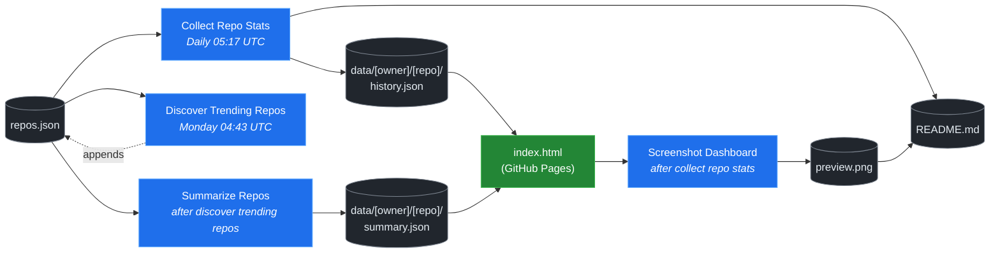

# 🚀 Rising Repos Tracker

> Automatically tracks daily GitHub stats (stars, forks, issues, velocity) for rising open source repos.

[](https://www.telosignal.com/)


**[→ View Live Dashboard](https://patrick-creates.github.io/rising-repos-tracker/)**

Built and maintained by [Telosignal](https://www.telosignal.com/).


<!-- AUTOGEN-STATS-START -->
## 📊 Current snapshot

> Auto-updated daily — last refreshed 2026-09-19

| Metric | Value |
|---|---|
| Repos tracked | **199** |
| Total stars | **9,809,160** |
| Total forks | **1,432,575** |
| Fastest growing | **VoiceStudio** (+1064.8/day) |

### 🔥 Top 5 by velocity

| # | Repo | Stars | Stars/day |
|---|---|---:|---:|
| 1 | [debpalash/VoiceStudio](https://github.com/debpalash/VoiceStudio) | 32,996 | +1064.8 |
| 2 | [DietrichGebert/ponytail](https://github.com/DietrichGebert/ponytail) | 142,233 | +1058.6 |
| 3 | [stablyai/orca](https://github.com/stablyai/orca) | 72,200 | +794.9 |
| 4 | [NousResearch/hermes-agent](https://github.com/NousResearch/hermes-agent) | 247,008 | +767.2 |
| 5 | [diegosouzapw/OmniRoute](https://github.com/diegosouzapw/OmniRoute) | 68,027 | +745.0 |

### 🆕 Recently added

- [every-app/open-seo](https://github.com/every-app/open-seo) — added 2026-09-14 — Open source alternative to Semrush and Ahrefs
- [NVIDIA/SkillSpector](https://github.com/NVIDIA/SkillSpector) — added 2026-09-14 — Security scanner for AI agent skills. Detect vulnerabilities, malicious patterns, security risks, prompt injection, data exfiltration, and supply-chain risks in Claude Code, Codex, and MCP skills before you install them.
- [AgriciDaniel/claude-seo](https://github.com/AgriciDaniel/claude-seo) — added 2026-09-14 — Universal SEO skill for Claude Code. 25 sub-skills + 18 sub-agents covering technical SEO, E-E-A-T, schema, GEO/AEO, backlinks, local SEO, maps intelligence, semantic clustering, e-commerce SEO, international SEO, Google APIs, and PDF/Excel reporting. Optional DataForSEO, Firecrawl, and Banana extensions.
<!-- AUTOGEN-STATS-END -->

<!-- AUTOGEN-DIAGRAM-START -->
## 🔄 How it works


```mermaid
graph LR
    repos[("repos.json")]:::data
    history[("data/[owner]/[repo]/<br/>history.json")]:::data
    summary[("data/[owner]/[repo]/<br/>summary.json")]:::data
    readme[("README.md")]:::data
    preview[("preview.png")]:::data
    dashboard["index.html<br/>(GitHub Pages)"]:::output
    collect_yml["Collect Repo Stats<br/><i>Daily 05:17 UTC</i>"]:::workflow
    discover_yml["Discover Trending Repos<br/><i>Monday 04:43 UTC</i>"]:::workflow
    screenshot_yml["Screenshot Dashboard<br/><i>after collect repo stats</i>"]:::workflow
    summarize_yml["Summarize Repos<br/><i>after discover trending repos</i>"]:::workflow
    repos --> collect_yml
    collect_yml --> history
    collect_yml --> readme
    repos --> discover_yml
    discover_yml -.->|appends| repos
    dashboard --> screenshot_yml
    screenshot_yml --> preview
    repos --> summarize_yml
    summarize_yml --> summary
    history --> dashboard
    summary --> dashboard
    preview --> readme
    classDef workflow fill:#1f6feb,stroke:#58a6ff,color:#fff
    classDef data fill:#21262d,stroke:#7d8590,color:#e6edf3
    classDef output fill:#238636,stroke:#3fb950,color:#fff
```
<!-- AUTOGEN-DIAGRAM-END -->

<!-- AUTOGEN-WORKFLOWS-START -->
## ⚙️ Workflows

| File | Schedule | Name |
|---|---|---|
| `collect.yml` | Daily 05:17 UTC | Collect Repo Stats |
| `discover.yml` | Monday 04:43 UTC | Discover Trending Repos |
| `screenshot.yml` | After Collect Repo Stats | Screenshot Dashboard |
| `summarize.yml` | After Discover Trending Repos | Summarize Repos |

> All workflows commit results directly back to the repo. Schedules are best-effort — GitHub Actions cron can drift by a few minutes.
<!-- AUTOGEN-WORKFLOWS-END -->

<!-- AUTOGEN-REPOS-START -->
## 📋 All tracked repos

| Repo | Stars | Forks | Stars/day |
|---|---:|---:|---:|
| [openclaw/openclaw](https://github.com/openclaw/openclaw) | 390,066 | 82,017 | +144.1 |
| [obra/superpowers](https://github.com/obra/superpowers) | 288,640 | 25,817 | +596.2 |
| [affaan-m/everything-claude-code](https://github.com/affaan-m/everything-claude-code) | 262,396 | 39,253 | +630.6 |
| [affaan-m/ECC](https://github.com/affaan-m/ECC) | 262,396 | 39,253 | +599.7 |
| [NousResearch/hermes-agent](https://github.com/NousResearch/hermes-agent) | 247,008 | 51,837 | +767.2 |
| [Significant-Gravitas/AutoGPT](https://github.com/Significant-Gravitas/AutoGPT) | 187,441 | 46,007 | +24.5 |
| [microsoft/markitdown](https://github.com/microsoft/markitdown) | 185,519 | 13,657 | +484.6 |
| [f/prompts.chat](https://github.com/f/prompts.chat) | 170,713 | 21,937 | +66.2 |
| [langgenius/dify](https://github.com/langgenius/dify) | 156,404 | 24,685 | +117.7 |
| [open-webui/open-webui](https://github.com/open-webui/open-webui) | 152,522 | 22,317 | +121.2 |
| [langchain-ai/langchain](https://github.com/langchain-ai/langchain) | 146,647 | 24,523 | +77.6 |
| [DietrichGebert/ponytail](https://github.com/DietrichGebert/ponytail) | 142,233 | 7,626 | +1058.6 |
| [github/spec-kit](https://github.com/github/spec-kit) | 137,888 | 12,354 | +310.3 |
| [farion1231/cc-switch](https://github.com/farion1231/cc-switch) | 133,620 | 9,217 | +480.5 |
| [nextlevelbuilder/ui-ux-pro-max-skill](https://github.com/nextlevelbuilder/ui-ux-pro-max-skill) | 128,926 | 13,744 | +395.6 |
| [microsoft/generative-ai-for-beginners](https://github.com/microsoft/generative-ai-for-beginners) | 120,052 | 63,200 | +72.1 |
| [Graphify-Labs/graphify](https://github.com/Graphify-Labs/graphify) | 119,475 | 11,552 | +421.8 |
| [JuliusBrussee/caveman](https://github.com/JuliusBrussee/caveman) | 106,660 | 6,179 | +364.1 |
| [nexu-io/open-design](https://github.com/nexu-io/open-design) | 96,995 | 11,272 | +426.0 |
| [ruvnet/RuView](https://github.com/ruvnet/RuView) | 94,430 | 12,497 | +243.9 |
| [thedotmack/claude-mem](https://github.com/thedotmack/claude-mem) | 94,231 | 8,317 | +146.1 |
| [vllm-project/vllm](https://github.com/vllm-project/vllm) | 92,146 | 22,402 | +95.1 |
| [ChatGPTNextWeb/NextChat](https://github.com/ChatGPTNextWeb/NextChat) | 88,789 | 59,047 | +6.1 |
| [OpenHands/OpenHands](https://github.com/OpenHands/OpenHands) | 88,483 | 11,621 | +117.3 |
| [Leonxlnx/taste-skill](https://github.com/Leonxlnx/taste-skill) | 88,336 | 6,015 | +526.6 |
| [koala73/worldmonitor](https://github.com/koala73/worldmonitor) | 86,963 | 13,193 | +262.9 |
| [Panniantong/Agent-Reach](https://github.com/Panniantong/Agent-Reach) | 83,240 | 7,293 | +580.2 |
| [lobehub/lobehub](https://github.com/lobehub/lobehub) | 82,632 | 15,898 | +43.7 |
| [rtk-ai/rtk](https://github.com/rtk-ai/rtk) | 80,970 | 5,133 | +253.2 |
| [datawhalechina/hello-agents](https://github.com/datawhalechina/hello-agents) | 79,852 | 9,925 | +235.4 |
| [dair-ai/Prompt-Engineering-Guide](https://github.com/dair-ai/Prompt-Engineering-Guide) | 78,458 | 8,627 | +30.3 |
| [shareAI-lab/learn-claude-code](https://github.com/shareAI-lab/learn-claude-code) | 77,163 | 12,408 | +129.7 |
| [unslothai/unsloth](https://github.com/unslothai/unsloth) | 76,412 | 6,974 | +96.1 |
| [openai/openai-cookbook](https://github.com/openai/openai-cookbook) | 76,068 | 12,880 | +19.8 |
| [ComposioHQ/awesome-claude-skills](https://github.com/ComposioHQ/awesome-claude-skills) | 75,304 | 8,725 | +120.3 |
| [chopratejas/headroom](https://github.com/chopratejas/headroom) | 73,003 | 5,611 | +467.1 |
| [headroomlabs-ai/headroom](https://github.com/headroomlabs-ai/headroom) | 73,003 | 5,611 | +304.5 |
| [stablyai/orca](https://github.com/stablyai/orca) | 72,200 | 4,724 | +794.9 |
| [santifer/career-ops](https://github.com/santifer/career-ops) | 72,102 | 13,582 | +216.6 |
| [career-ops-hq/career-ops](https://github.com/career-ops-hq/career-ops) | 72,102 | 13,582 | +143.3 |
| [Fission-AI/OpenSpec](https://github.com/Fission-AI/OpenSpec) | 69,495 | 4,761 | +167.0 |
| [code-yeongyu/oh-my-openagent](https://github.com/code-yeongyu/oh-my-openagent) | 69,196 | 5,693 | +87.6 |
| [diegosouzapw/OmniRoute](https://github.com/diegosouzapw/OmniRoute) | 68,027 | 9,598 | +745.0 |
| [asgeirtj/system_prompts_leaks](https://github.com/asgeirtj/system_prompts_leaks) | 67,483 | 10,969 | +218.5 |
| [xtekky/gpt4free](https://github.com/xtekky/gpt4free) | 66,697 | 13,504 | +3.7 |
| [shanraisshan/claude-code-best-practice](https://github.com/shanraisshan/claude-code-best-practice) | 66,109 | 6,558 | +101.7 |
| [ZhuLinsen/daily_stock_analysis](https://github.com/ZhuLinsen/daily_stock_analysis) | 65,274 | 54,605 | +225.9 |
| [usestrix/strix](https://github.com/usestrix/strix) | 63,621 | 6,945 | +344.6 |
| [mvanhorn/last30days-skill](https://github.com/mvanhorn/last30days-skill) | 62,319 | 5,431 | +287.8 |
| [tw93/Pake](https://github.com/tw93/Pake) | 61,523 | 12,673 | +102.8 |
| [calesthio/OpenMontage](https://github.com/calesthio/OpenMontage) | 60,009 | 7,583 | +392.2 |
| [MemPalace/mempalace](https://github.com/MemPalace/mempalace) | 59,150 | 7,563 | +54.4 |
| [BerriAI/litellm](https://github.com/BerriAI/litellm) | 59,132 | 11,570 | +94.7 |
| [FlowiseAI/Flowise](https://github.com/FlowiseAI/Flowise) | 55,469 | 25,031 | +20.7 |
| [jamiepine/voicebox](https://github.com/jamiepine/voicebox) | 55,136 | 6,868 | +237.4 |
| [rohitg00/ai-engineering-from-scratch](https://github.com/rohitg00/ai-engineering-from-scratch) | 54,992 | 9,664 | +260.3 |
| [hesreallyhim/awesome-claude-code](https://github.com/hesreallyhim/awesome-claude-code) | 54,294 | 4,733 | +82.3 |
| [ggml-org/whisper.cpp](https://github.com/ggml-org/whisper.cpp) | 53,772 | 6,176 | +31.8 |
| [router-for-me/CLIProxyAPI](https://github.com/router-for-me/CLIProxyAPI) | 52,459 | 7,919 | +151.4 |
| [ChromeDevTools/chrome-devtools-mcp](https://github.com/ChromeDevTools/chrome-devtools-mcp) | 52,293 | 4,180 | +100.1 |
| [heygen-com/hyperframes](https://github.com/heygen-com/hyperframes) | 51,503 | 4,694 | +251.9 |
| [coreyhaines31/marketingskills](https://github.com/coreyhaines31/marketingskills) | 50,865 | 7,707 | +176.6 |
| [elder-plinius/CL4R1T4S](https://github.com/elder-plinius/CL4R1T4S) | 50,036 | 10,273 | +116.1 |
| [Aider-AI/aider](https://github.com/Aider-AI/aider) | 49,048 | 4,974 | +33.0 |
| [Imbad0202/academic-research-skills](https://github.com/Imbad0202/academic-research-skills) | 48,699 | 3,783 | +166.8 |
| [bojieli/ai-agent-book](https://github.com/bojieli/ai-agent-book) | 48,604 | 5,439 | +666.4 |
| [kepano/obsidian-skills](https://github.com/kepano/obsidian-skills) | 48,589 | 3,461 | +133.7 |
| [QuantumNous/new-api](https://github.com/QuantumNous/new-api) | 48,436 | 11,604 | +111.8 |
| [HKUDS/nanobot](https://github.com/HKUDS/nanobot) | 48,347 | 8,540 | +45.7 |
| [zhayujie/CowAgent](https://github.com/zhayujie/CowAgent) | 47,035 | 10,365 | +20.0 |
| [sickn33/antigravity-awesome-skills](https://github.com/sickn33/antigravity-awesome-skills) | 46,578 | 6,792 | +67.5 |
| [sickn33/agentic-awesome-skills](https://github.com/sickn33/agentic-awesome-skills) | 46,578 | 6,792 | +52.0 |
| [K-Dense-AI/scientific-agent-skills](https://github.com/K-Dense-AI/scientific-agent-skills) | 45,568 | 4,132 | +174.3 |
| [danny-avila/LibreChat](https://github.com/danny-avila/LibreChat) | 44,359 | 9,115 | +58.9 |
| [DeusData/codebase-memory-mcp](https://github.com/DeusData/codebase-memory-mcp) | 43,792 | 3,562 | +282.5 |
| [MadsLorentzen/ai-job-search](https://github.com/MadsLorentzen/ai-job-search) | 43,294 | 14,870 | +319.3 |
| [chatanywhere/GPT_API_free](https://github.com/chatanywhere/GPT_API_free) | 42,834 | 2,725 | +40.0 |
| [langchain-ai/langgraph](https://github.com/langchain-ai/langgraph) | 41,922 | 7,079 | +73.1 |
| [chatboxai/chatbox](https://github.com/chatboxai/chatbox) | 41,807 | 4,253 | +14.6 |
| [Hmbown/CodeWhale](https://github.com/Hmbown/CodeWhale) | 40,998 | 3,563 | +54.1 |
| [Hmbown/Codewhale](https://github.com/Hmbown/Codewhale) | 40,998 | 3,563 | +6.8 |
| [AstrBotDevs/AstrBot](https://github.com/AstrBotDevs/AstrBot) | 40,689 | 2,935 | +64.5 |
| [tinyhumansai/openhuman](https://github.com/tinyhumansai/openhuman) | 39,887 | 3,937 | +33.2 |
| [wshobson/agents](https://github.com/wshobson/agents) | 39,793 | 4,244 | +33.0 |
| [mindsdb/mindshub](https://github.com/mindsdb/mindshub) | 39,751 | 6,240 | +5.1 |
| [ogulcancelik/herdr](https://github.com/ogulcancelik/herdr) | 39,509 | 2,982 | +361.5 |
| [herdrdev/herdr](https://github.com/herdrdev/herdr) | 39,509 | 2,982 | +334.5 |
| [Yeachan-Heo/oh-my-claudecode](https://github.com/Yeachan-Heo/oh-my-claudecode) | 39,249 | 3,512 | +37.8 |
| [github/awesome-copilot](https://github.com/github/awesome-copilot) | 39,156 | 4,972 | +45.7 |
| [google/langextract](https://github.com/google/langextract) | 38,621 | 2,704 | +17.7 |
| [volcengine/OpenViking](https://github.com/volcengine/OpenViking) | 38,045 | 2,949 | +123.5 |
| [PDFMathTranslate/PDFMathTranslate](https://github.com/PDFMathTranslate/PDFMathTranslate) | 37,067 | 3,328 | +26.1 |
| [alibaba/open-code-review](https://github.com/alibaba/open-code-review) | 37,067 | 2,644 | +361.1 |
| [songquanpeng/one-api](https://github.com/songquanpeng/one-api) | 36,956 | 6,867 | +23.5 |
| [AlexsJones/llmfit](https://github.com/AlexsJones/llmfit) | 36,810 | 2,337 | +89.2 |
| [anthropics/claude-plugins-official](https://github.com/anthropics/claude-plugins-official) | 36,487 | 4,093 | +68.0 |
| [esengine/DeepSeek-Reasonix](https://github.com/esengine/DeepSeek-Reasonix) | 35,619 | 2,404 | +156.2 |
| [agentscope-ai/QwenPaw](https://github.com/agentscope-ai/QwenPaw) | 35,103 | 3,118 | +180.5 |
| [JCodesMore/ai-website-cloner-template](https://github.com/JCodesMore/ai-website-cloner-template) | 34,630 | 5,045 | +183.7 |
| [HKUDS/Vibe-Trading](https://github.com/HKUDS/Vibe-Trading) | 33,675 | 5,492 | +230.9 |
| [Gitlawb/openclaude](https://github.com/Gitlawb/openclaude) | 33,423 | 9,094 | +48.1 |
| [debpalash/VoiceStudio](https://github.com/debpalash/VoiceStudio) | 32,996 | 3,908 | +1064.8 |
| [mukul975/Anthropic-Cybersecurity-Skills](https://github.com/mukul975/Anthropic-Cybersecurity-Skills) | 32,972 | 3,984 | +166.9 |
| [iOfficeAI/AionUi](https://github.com/iOfficeAI/AionUi) | 32,950 | 3,406 | +50.9 |
| [zeroclaw-labs/zeroclaw](https://github.com/zeroclaw-labs/zeroclaw) | 32,835 | 4,952 | +10.5 |
| [can1357/oh-my-pi](https://github.com/can1357/oh-my-pi) | 31,876 | 3,364 | +200.9 |
| [p-e-w/heretic](https://github.com/p-e-w/heretic) | 31,853 | 3,561 | +76.5 |
| [tirth8205/code-review-graph](https://github.com/tirth8205/code-review-graph) | 31,602 | 2,873 | +136.3 |
| [virgiliojr94/book-to-skill](https://github.com/virgiliojr94/book-to-skill) | 31,166 | 3,238 | +243.7 |
| [googleworkspace/cli](https://github.com/googleworkspace/cli) | 31,053 | 1,842 | +39.4 |
| [iOfficeAI/OfficeCLI](https://github.com/iOfficeAI/OfficeCLI) | 30,822 | 2,102 | +299.0 |
| [langchain-ai/deepagents](https://github.com/langchain-ai/deepagents) | 29,555 | 4,147 | +52.4 |
| [jackwener/OpenCLI](https://github.com/jackwener/OpenCLI) | 29,452 | 2,875 | +54.9 |
| [decolua/9router](https://github.com/decolua/9router) | 29,322 | 5,440 | +122.4 |
| [alibaba/page-agent](https://github.com/alibaba/page-agent) | 29,119 | 2,611 | +110.0 |
| [voideditor/void](https://github.com/voideditor/void) | 28,801 | 2,651 | — |
| [rohitg00/agentmemory](https://github.com/rohitg00/agentmemory) | 28,600 | 2,475 | +65.8 |
| [BloopAI/vibe-kanban](https://github.com/BloopAI/vibe-kanban) | 28,126 | 3,014 | +12.9 |
| [jarrodwatts/claude-hud](https://github.com/jarrodwatts/claude-hud) | 28,049 | 1,303 | +32.6 |
| [manaflow-ai/cmux](https://github.com/manaflow-ai/cmux) | 27,248 | 2,375 | +42.5 |
| [Tencent/WeKnora](https://github.com/Tencent/WeKnora) | 27,167 | 3,660 | +113.3 |
| [TencentCloud/TencentDB-Agent-Memory](https://github.com/TencentCloud/TencentDB-Agent-Memory) | 26,969 | 2,579 | +268.4 |
| [zai-org/Open-AutoGLM](https://github.com/zai-org/Open-AutoGLM) | 26,263 | 4,034 | +7.8 |
| [toon-format/toon](https://github.com/toon-format/toon) | 25,398 | 1,123 | +8.8 |
| [pascalorg/editor](https://github.com/pascalorg/editor) | 24,119 | 3,000 | +71.7 |
| [mksglu/context-mode](https://github.com/mksglu/context-mode) | 23,589 | 1,701 | +63.8 |
| [winfunc/opcode](https://github.com/winfunc/opcode) | 22,409 | 1,720 | +3.9 |
| [pranshuparmar/witr](https://github.com/pranshuparmar/witr) | 22,395 | 783 | +53.2 |
| [guillaumemeyer/watermarks-remover](https://github.com/guillaumemeyer/watermarks-remover) | 22,344 | 2,579 | +184.3 |
| [jundot/omlx](https://github.com/jundot/omlx) | 21,904 | 1,896 | +54.9 |
| [steipete/CodexBar](https://github.com/steipete/CodexBar) | 21,627 | 1,964 | +72.2 |
| [coze-dev/coze-studio](https://github.com/coze-dev/coze-studio) | 21,611 | 3,117 | +6.4 |
| [NirDiamant/agents-towards-production](https://github.com/NirDiamant/agents-towards-production) | 21,478 | 2,849 | +8.2 |
| [KKKKhazix/khazix-skills](https://github.com/KKKKhazix/khazix-skills) | 20,804 | 2,207 | +54.9 |
| [jnMetaCode/agency-agents-zh](https://github.com/jnMetaCode/agency-agents-zh) | 20,786 | 3,357 | +60.4 |
| [t8y2/dbx](https://github.com/t8y2/dbx) | 20,084 | 1,952 | +152.7 |
| [1jehuang/jcode](https://github.com/1jehuang/jcode) | 19,886 | 2,304 | +170.3 |
| [tanweai/pua](https://github.com/tanweai/pua) | 19,661 | 1,199 | +14.7 |
| [datawhalechina/easy-vibe](https://github.com/datawhalechina/easy-vibe) | 19,461 | 1,867 | +26.3 |
| [every-app/open-seo](https://github.com/every-app/open-seo) | 19,388 | 2,491 | +146.4 |
| [danielmiessler/LifeOS](https://github.com/danielmiessler/LifeOS) | 19,064 | 2,469 | +33.7 |
| [nesquena/hermes-webui](https://github.com/nesquena/hermes-webui) | 18,449 | 2,602 | +40.6 |
| [microsoft/agent-lightning](https://github.com/microsoft/agent-lightning) | 18,356 | 1,619 | +10.9 |
| [RightNow-AI/openfang](https://github.com/RightNow-AI/openfang) | 18,201 | 2,290 | +3.9 |
| [jlcodes99/cockpit-tools](https://github.com/jlcodes99/cockpit-tools) | 17,959 | 1,583 | +62.2 |
| [NVIDIA/SkillSpector](https://github.com/NVIDIA/SkillSpector) | 17,798 | 1,530 | +131.6 |
| [browser-use/browser-harness](https://github.com/browser-use/browser-harness) | 17,732 | 1,738 | +27.5 |
| [AgriciDaniel/claude-seo](https://github.com/AgriciDaniel/claude-seo) | 17,193 | 2,517 | +61.6 |
| [cft0808/edict](https://github.com/cft0808/edict) | 16,898 | 1,770 | +8.7 |
| [MemoriLabs/Memori](https://github.com/MemoriLabs/Memori) | 16,814 | 3,496 | +16.5 |
| [composio-community/awesome-codex-skills](https://github.com/composio-community/awesome-codex-skills) | 16,538 | 1,629 | +20.7 |
| [xbtlin/ai-berkshire](https://github.com/xbtlin/ai-berkshire) | 16,443 | 2,455 | +75.5 |
| [wanshuiyin/Auto-claude-code-research-in-sleep](https://github.com/wanshuiyin/Auto-claude-code-research-in-sleep) | 16,345 | 1,394 | +43.5 |
| [xpzouying/xiaohongshu-mcp](https://github.com/xpzouying/xiaohongshu-mcp) | 15,865 | 2,339 | +17.7 |
| [Anionex/banana-slides](https://github.com/Anionex/banana-slides) | 15,625 | 1,784 | +5.4 |
| [ifixai-ai/iFixAi](https://github.com/ifixai-ai/iFixAi) | 15,596 | 1,335 | +185.6 |
| [walkinglabs/learn-harness-engineering](https://github.com/walkinglabs/learn-harness-engineering) | 15,375 | 1,538 | +73.2 |
| [yusufkaraaslan/Skill_Seekers](https://github.com/yusufkaraaslan/Skill_Seekers) | 15,002 | 1,529 | +8.7 |
| [kyegomez/OpenMythos](https://github.com/kyegomez/OpenMythos) | 14,902 | 3,296 | +8.4 |
| [NanmiCoder/cc-haha](https://github.com/NanmiCoder/cc-haha) | 14,633 | 8,570 | +16.1 |
| [NevaMind-AI/memU](https://github.com/NevaMind-AI/memU) | 14,420 | 1,070 | +5.8 |
| [superset-sh/superset](https://github.com/superset-sh/superset) | 14,388 | 1,284 | +27.2 |
| [XiaomiMiMo/MiMo-Code](https://github.com/XiaomiMiMo/MiMo-Code) | 13,194 | 1,364 | +26.5 |
| [EverMind-AI/EverOS](https://github.com/EverMind-AI/EverOS) | 13,063 | 925 | +40.8 |
| [sirmalloc/ccstatusline](https://github.com/sirmalloc/ccstatusline) | 12,941 | 569 | +20.3 |
| [ConardLi/garden-skills](https://github.com/ConardLi/garden-skills) | 12,513 | 1,511 | +44.4 |
| [0x4m4/hexstrike-ai](https://github.com/0x4m4/hexstrike-ai) | 11,976 | 2,455 | +24.0 |
| [brokermr810/QuantDinger](https://github.com/brokermr810/QuantDinger) | 11,721 | 2,432 | +32.5 |
| [OpenByteInc/QuantDinger](https://github.com/OpenByteInc/QuantDinger) | 11,721 | 2,432 | +31.5 |
| [MemTensor/MemOS](https://github.com/MemTensor/MemOS) | 11,461 | 1,048 | +17.5 |
| [holaboss-ai/holaOS](https://github.com/holaboss-ai/holaOS) | 11,320 | 723 | +89.4 |
| [EKKOLearnAI/hermes-studio](https://github.com/EKKOLearnAI/hermes-studio) | 11,131 | 1,361 | +30.3 |
| [getagentseal/codeburn](https://github.com/getagentseal/codeburn) | 11,095 | 842 | +35.0 |
| [aden-hive/hive](https://github.com/aden-hive/hive) | 11,060 | 5,664 | +5.5 |
| [ValueCell-ai/valuecell](https://github.com/ValueCell-ai/valuecell) | 11,005 | 1,802 | +1.6 |
| [openai/codex-security](https://github.com/openai/codex-security) | 10,781 | 801 | +53.2 |
| [Kuberwastaken/claurst](https://github.com/Kuberwastaken/claurst) | 10,303 | 7,736 | +5.3 |
| [ykdojo/claude-code-tips](https://github.com/ykdojo/claude-code-tips) | 10,114 | 815 | +14.6 |
| [StarTrail-org/PixelRAG](https://github.com/StarTrail-org/PixelRAG) | 10,014 | 861 | +50.4 |
| [frankbria/ralph-claude-code](https://github.com/frankbria/ralph-claude-code) | 9,638 | 719 | +4.1 |
| [modem-dev/hunk](https://github.com/modem-dev/hunk) | 9,340 | 303 | +38.8 |
| [EvoMap/evolver](https://github.com/EvoMap/evolver) | 9,103 | 847 | +3.3 |
| [iflytek/astron-agent](https://github.com/iflytek/astron-agent) | 9,015 | 887 | +5.4 |
| [trailhq/Graft](https://github.com/trailhq/Graft) | 8,637 | 785 | +209.6 |
| [MiroMindAI/MiroThinker](https://github.com/MiroMindAI/MiroThinker) | 8,409 | 646 | +1.1 |
| [mmulet/term.everything](https://github.com/mmulet/term.everything) | 8,098 | 194 | +1.0 |
| [ValueCell-ai/ClawX](https://github.com/ValueCell-ai/ClawX) | 7,616 | 1,142 | +1.1 |
| [1weiho/open-slide](https://github.com/1weiho/open-slide) | 7,615 | 548 | +37.4 |
| [dataelement/dsh-desktop](https://github.com/dataelement/dsh-desktop) | 7,575 | 323 | +272.2 |
| [rorkai/App-Store-Connect-CLI](https://github.com/rorkai/App-Store-Connect-CLI) | 7,283 | 613 | +32.1 |
| [WenyuChiou/awesome-agentic-ai-zh](https://github.com/WenyuChiou/awesome-agentic-ai-zh) | 7,091 | 963 | +28.4 |
| [opensquilla/opensquilla](https://github.com/opensquilla/opensquilla) | 7,026 | 568 | +13.4 |
| [TokenRhythm/opensquilla](https://github.com/TokenRhythm/opensquilla) | 7,026 | 568 | +4.8 |
| [Andyyyy64/whichllm](https://github.com/Andyyyy64/whichllm) | 6,663 | 367 | +13.0 |
| [steipete/summarize](https://github.com/steipete/summarize) | 6,631 | 445 | +3.3 |
| [Arthur-Ficial/apfel](https://github.com/Arthur-Ficial/apfel) | 6,419 | 246 | +4.5 |
| [microsoft/fara](https://github.com/microsoft/fara) | 6,182 | 603 | +2.7 |
| [UfoMiao/zcf](https://github.com/UfoMiao/zcf) | 6,082 | 421 | +0.2 |
| [re4/LibreCode](https://github.com/re4/LibreCode) | 88 | 5 | — |
<!-- AUTOGEN-REPOS-END -->

---

## What it does

- Collects daily snapshots of stars, forks, watchers and open issues for every tracked repo
- Discovers new trending repos automatically every Monday using the GitHub Search API
- Generates AI summaries (use cases, similar tools, tags) for each tracked repo via GitHub Models
- Stores all history as plain JSON — no database, no backend
- Renders a live dashboard via GitHub Pages — updates daily, zero maintenance

## Tracked repos

Data lives in [`data/`](./data) — one folder per repo, one `history.json` per entry.  
The full watch list is in [`repos.json`](./repos.json).

## Fork & use it for yourself

This is my personal tracker — the watch list reflects what I find interesting. If you want to track different repos, the best path is to **fork this repo and run your own**.

### Setup

1. Fork this repo to your account
2. Replace the contents of [`repos.json`](./repos.json) with the repos you want to track (or just leave one entry — `discover.yml` will auto-add more every Monday)
3. Go to **Settings → Pages** and enable GitHub Pages from the `main` branch
4. Go to **Actions** and run **Collect Repo Stats** once manually to seed your first data point
5. Your dashboard will be live at `https://YOUR-USERNAME.github.io/rising-repos-tracker/`

That's it — daily collection and weekly discovery run automatically on schedule. Zero ongoing maintenance.

### Customizing what gets discovered

Edit [`scripts/discover.js`](./scripts/discover.js) to change:

- `MIN_STARS` — minimum star threshold for candidates
- `MAX_AGE_DAYS` — how recent a repo must be
- `MAX_NEW_REPOS` — how many to add per discovery run
- The `queries` array — GitHub Search API queries that define what "trending" means to you

### Adding a repo manually

Just edit `repos.json` directly:

```json
{
  "owner": "OWNER",
  "repo": "REPO",
  "added": "YYYY-MM-DD",
  "notes": "why you're tracking this"
}
```

The next daily collect run picks it up automatically.

## Stack

- **GitHub Actions** — scheduling and automation
- **GitHub Pages** — dashboard hosting
- **GitHub API** — data source
- **GitHub Models** — free AI summaries (gpt-4o-mini)
- **Chart.js** — star growth visualization
- **Mermaid** — architecture diagram (rendered by GitHub)
- No dependencies, no build step, no database

## License

MIT
