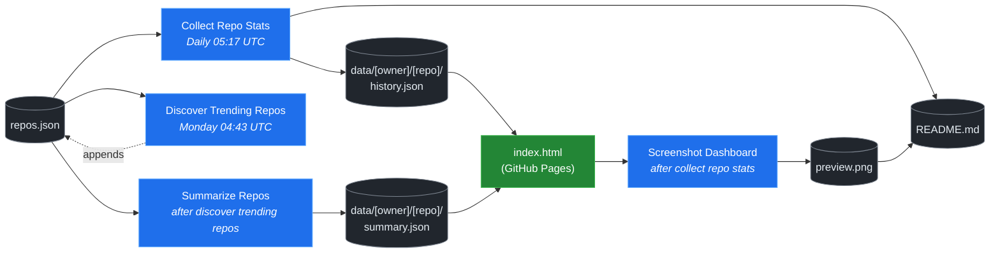

# 🚀 Rising Repos Tracker

> Automatically tracks daily GitHub stats (stars, forks, issues, velocity) for rising open source repos.

[](https://www.telosignal.com/)


**[→ View Live Dashboard](https://patrick-creates.github.io/rising-repos-tracker/)**

Built and maintained by [Telosignal](https://www.telosignal.com/).


<!-- AUTOGEN-STATS-START -->
## 📊 Current snapshot

> Auto-updated daily — last refreshed 2026-08-21

| Metric | Value |
|---|---|
| Repos tracked | **184** |
| Total stars | **8,875,903** |
| Total forks | **1,319,614** |
| Fastest growing | **ai-agent-book** (+1015.2/day) |

### 🔥 Top 5 by velocity

| # | Repo | Stars | Stars/day |
|---|---|---:|---:|
| 1 | [bojieli/ai-agent-book](https://github.com/bojieli/ai-agent-book) | 40,438 | +1015.2 |
| 2 | [DietrichGebert/ponytail](https://github.com/DietrichGebert/ponytail) | 106,879 | +981.0 |
| 3 | [diegosouzapw/OmniRoute](https://github.com/diegosouzapw/OmniRoute) | 52,085 | +868.1 |
| 4 | [NousResearch/hermes-agent](https://github.com/NousResearch/hermes-agent) | 233,637 | +855.9 |
| 5 | [stablyai/orca](https://github.com/stablyai/orca) | 50,208 | +817.9 |

### 🆕 Recently added

- [holaboss-ai/holaOS](https://github.com/holaboss-ai/holaOS) — added 2026-08-17 — Open-source All in One AI agent workspace. Run any agent — Claude Code, Codex — across your tools (100+ integrations + MCP), apps, browser, and files, with shared memory. Built-in models or BYOK.
- [pascalorg/editor](https://github.com/pascalorg/editor) — added 2026-08-10 — Create and share 3D architectural projects.
- [jlcodes99/cockpit-tools](https://github.com/jlcodes99/cockpit-tools) — added 2026-08-10 —  🚀 通用 AI IDE 账号管理工具：支持 Antigravity / Codex / GitHub Copilot / Windsurf / Kiro / Cursor / Gemini-cli / CodeBuddy，多账号切换、配额监控、自动唤醒与多开实例管理。 🚀 Universal AI IDE account manager for Antigravity / Codex / GitHub Copilot / Windsurf / Kiro / Cursor / Gemini-cli / CodeBuddy, with multi-account switching, quota monitoring, wake-up automation, and multi-insta
<!-- AUTOGEN-STATS-END -->

<!-- AUTOGEN-DIAGRAM-START -->
## 🔄 How it works


```mermaid
graph LR
    repos[("repos.json")]:::data
    history[("data/[owner]/[repo]/<br/>history.json")]:::data
    summary[("data/[owner]/[repo]/<br/>summary.json")]:::data
    readme[("README.md")]:::data
    preview[("preview.png")]:::data
    dashboard["index.html<br/>(GitHub Pages)"]:::output
    collect_yml["Collect Repo Stats<br/><i>Daily 05:17 UTC</i>"]:::workflow
    discover_yml["Discover Trending Repos<br/><i>Monday 04:43 UTC</i>"]:::workflow
    screenshot_yml["Screenshot Dashboard<br/><i>after collect repo stats</i>"]:::workflow
    summarize_yml["Summarize Repos<br/><i>after discover trending repos</i>"]:::workflow
    repos --> collect_yml
    collect_yml --> history
    collect_yml --> readme
    repos --> discover_yml
    discover_yml -.->|appends| repos
    dashboard --> screenshot_yml
    screenshot_yml --> preview
    repos --> summarize_yml
    summarize_yml --> summary
    history --> dashboard
    summary --> dashboard
    preview --> readme
    classDef workflow fill:#1f6feb,stroke:#58a6ff,color:#fff
    classDef data fill:#21262d,stroke:#7d8590,color:#e6edf3
    classDef output fill:#238636,stroke:#3fb950,color:#fff
```
<!-- AUTOGEN-DIAGRAM-END -->

<!-- AUTOGEN-WORKFLOWS-START -->
## ⚙️ Workflows

| File | Schedule | Name |
|---|---|---|
| `collect.yml` | Daily 05:17 UTC | Collect Repo Stats |
| `discover.yml` | Monday 04:43 UTC | Discover Trending Repos |
| `screenshot.yml` | After Collect Repo Stats | Screenshot Dashboard |
| `summarize.yml` | After Discover Trending Repos | Summarize Repos |

> All workflows commit results directly back to the repo. Schedules are best-effort — GitHub Actions cron can drift by a few minutes.
<!-- AUTOGEN-WORKFLOWS-END -->

<!-- AUTOGEN-REPOS-START -->
## 📋 All tracked repos

| Repo | Stars | Forks | Stars/day |
|---|---:|---:|---:|
| [openclaw/openclaw](https://github.com/openclaw/openclaw) | 386,944 | 81,277 | +154.7 |
| [obra/superpowers](https://github.com/obra/superpowers) | 275,098 | 24,618 | +658.7 |
| [affaan-m/everything-claude-code](https://github.com/affaan-m/everything-claude-code) | 241,518 | 36,621 | +604.7 |
| [affaan-m/ECC](https://github.com/affaan-m/ECC) | 241,518 | 36,621 | +560.1 |
| [NousResearch/hermes-agent](https://github.com/NousResearch/hermes-agent) | 233,637 | 46,839 | +855.9 |
| [Significant-Gravitas/AutoGPT](https://github.com/Significant-Gravitas/AutoGPT) | 186,692 | 46,043 | +24.1 |
| [microsoft/markitdown](https://github.com/microsoft/markitdown) | 175,032 | 12,791 | +520.2 |
| [f/prompts.chat](https://github.com/f/prompts.chat) | 167,671 | 21,646 | +55.0 |
| [langgenius/dify](https://github.com/langgenius/dify) | 153,083 | 24,166 | +118.6 |
| [open-webui/open-webui](https://github.com/open-webui/open-webui) | 149,415 | 21,788 | +125.2 |
| [langchain-ai/langchain](https://github.com/langchain-ai/langchain) | 144,680 | 24,102 | +80.5 |
| [github/spec-kit](https://github.com/github/spec-kit) | 130,558 | 11,720 | +327.0 |
| [farion1231/cc-switch](https://github.com/farion1231/cc-switch) | 128,559 | 8,792 | +573.8 |
| [nextlevelbuilder/ui-ux-pro-max-skill](https://github.com/nextlevelbuilder/ui-ux-pro-max-skill) | 118,931 | 12,776 | +410.4 |
| [microsoft/generative-ai-for-beginners](https://github.com/microsoft/generative-ai-for-beginners) | 118,237 | 62,324 | +74.8 |
| [Graphify-Labs/graphify](https://github.com/Graphify-Labs/graphify) | 108,776 | 10,565 | +483.1 |
| [DietrichGebert/ponytail](https://github.com/DietrichGebert/ponytail) | 106,879 | 5,902 | +981.0 |
| [JuliusBrussee/caveman](https://github.com/JuliusBrussee/caveman) | 99,749 | 5,778 | +402.5 |
| [thedotmack/claude-mem](https://github.com/thedotmack/claude-mem) | 91,380 | 7,997 | +160.0 |
| [ruvnet/RuView](https://github.com/ruvnet/RuView) | 91,119 | 12,112 | +286.7 |
| [nexu-io/open-design](https://github.com/nexu-io/open-design) | 89,861 | 10,365 | +480.9 |
| [vllm-project/vllm](https://github.com/vllm-project/vllm) | 89,591 | 20,980 | +97.1 |
| [ChatGPTNextWeb/NextChat](https://github.com/ChatGPTNextWeb/NextChat) | 88,632 | 59,212 | +6.3 |
| [OpenHands/OpenHands](https://github.com/OpenHands/OpenHands) | 84,653 | 11,029 | +112.9 |
| [koala73/worldmonitor](https://github.com/koala73/worldmonitor) | 83,545 | 12,453 | +307.1 |
| [lobehub/lobehub](https://github.com/lobehub/lobehub) | 81,875 | 15,811 | +48.8 |
| [Leonxlnx/taste-skill](https://github.com/Leonxlnx/taste-skill) | 78,716 | 5,373 | +596.3 |
| [dair-ai/Prompt-Engineering-Guide](https://github.com/dair-ai/Prompt-Engineering-Guide) | 77,649 | 8,531 | +31.0 |
| [rtk-ai/rtk](https://github.com/rtk-ai/rtk) | 76,858 | 4,831 | +287.2 |
| [openai/openai-cookbook](https://github.com/openai/openai-cookbook) | 75,427 | 12,748 | +19.1 |
| [shareAI-lab/learn-claude-code](https://github.com/shareAI-lab/learn-claude-code) | 74,836 | 12,082 | +144.8 |
| [unslothai/unsloth](https://github.com/unslothai/unsloth) | 74,137 | 6,701 | +101.4 |
| [datawhalechina/hello-agents](https://github.com/datawhalechina/hello-agents) | 74,001 | 9,195 | +245.7 |
| [Panniantong/Agent-Reach](https://github.com/Panniantong/Agent-Reach) | 73,560 | 6,260 | +676.8 |
| [ComposioHQ/awesome-claude-skills](https://github.com/ComposioHQ/awesome-claude-skills) | 72,921 | 8,337 | +131.9 |
| [code-yeongyu/oh-my-openagent](https://github.com/code-yeongyu/oh-my-openagent) | 68,179 | 5,572 | +103.7 |
| [chopratejas/headroom](https://github.com/chopratejas/headroom) | 67,028 | 5,166 | +580.1 |
| [headroomlabs-ai/headroom](https://github.com/headroomlabs-ai/headroom) | 67,028 | 5,166 | +352.1 |
| [santifer/career-ops](https://github.com/santifer/career-ops) | 66,886 | 12,834 | +227.8 |
| [xtekky/gpt4free](https://github.com/xtekky/gpt4free) | 66,572 | 13,516 | +3.5 |
| [Fission-AI/OpenSpec](https://github.com/Fission-AI/OpenSpec) | 65,729 | 4,522 | +178.3 |
| [shanraisshan/claude-code-best-practice](https://github.com/shanraisshan/claude-code-best-practice) | 64,806 | 6,444 | +119.0 |
| [ZhuLinsen/daily_stock_analysis](https://github.com/ZhuLinsen/daily_stock_analysis) | 63,531 | 53,355 | +280.6 |
| [asgeirtj/system_prompts_leaks](https://github.com/asgeirtj/system_prompts_leaks) | 63,277 | 10,386 | +241.0 |
| [tw93/Pake](https://github.com/tw93/Pake) | 60,939 | 12,495 | +128.0 |
| [mvanhorn/last30days-skill](https://github.com/mvanhorn/last30days-skill) | 58,827 | 5,139 | +353.5 |
| [MemPalace/mempalace](https://github.com/MemPalace/mempalace) | 58,508 | 7,503 | +64.3 |
| [BerriAI/litellm](https://github.com/BerriAI/litellm) | 56,887 | 10,771 | +100.0 |
| [usestrix/strix](https://github.com/usestrix/strix) | 56,314 | 6,056 | +377.8 |
| [FlowiseAI/Flowise](https://github.com/FlowiseAI/Flowise) | 55,384 | 24,929 | +26.1 |
| [ggml-org/whisper.cpp](https://github.com/ggml-org/whisper.cpp) | 53,067 | 6,083 | +34.1 |
| [hesreallyhim/awesome-claude-code](https://github.com/hesreallyhim/awesome-claude-code) | 52,735 | 4,605 | +90.9 |
| [diegosouzapw/OmniRoute](https://github.com/diegosouzapw/OmniRoute) | 52,085 | 7,104 | +868.1 |
| [jamiepine/voicebox](https://github.com/jamiepine/voicebox) | 50,990 | 6,350 | +271.2 |
| [stablyai/orca](https://github.com/stablyai/orca) | 50,208 | 3,467 | +817.9 |
| [ChromeDevTools/chrome-devtools-mcp](https://github.com/ChromeDevTools/chrome-devtools-mcp) | 49,513 | 3,456 | +101.4 |
| [calesthio/OpenMontage](https://github.com/calesthio/OpenMontage) | 49,152 | 6,167 | +401.9 |
| [Aider-AI/aider](https://github.com/Aider-AI/aider) | 48,370 | 4,865 | +35.9 |
| [router-for-me/CLIProxyAPI](https://github.com/router-for-me/CLIProxyAPI) | 48,125 | 7,421 | +152.1 |
| [rohitg00/ai-engineering-from-scratch](https://github.com/rohitg00/ai-engineering-from-scratch) | 47,423 | 8,339 | +260.0 |
| [HKUDS/nanobot](https://github.com/HKUDS/nanobot) | 47,239 | 8,340 | +48.0 |
| [elder-plinius/CL4R1T4S](https://github.com/elder-plinius/CL4R1T4S) | 47,068 | 9,550 | +122.0 |
| [kepano/obsidian-skills](https://github.com/kepano/obsidian-skills) | 46,933 | 3,373 | +161.1 |
| [zhayujie/CowAgent](https://github.com/zhayujie/CowAgent) | 46,609 | 10,322 | +21.6 |
| [QuantumNous/new-api](https://github.com/QuantumNous/new-api) | 45,782 | 10,859 | +118.5 |
| [sickn33/antigravity-awesome-skills](https://github.com/sickn33/antigravity-awesome-skills) | 45,203 | 6,620 | +74.1 |
| [sickn33/agentic-awesome-skills](https://github.com/sickn33/agentic-awesome-skills) | 45,203 | 6,620 | +55.4 |
| [coreyhaines31/marketingskills](https://github.com/coreyhaines31/marketingskills) | 45,102 | 7,085 | +168.7 |
| [Imbad0202/academic-research-skills](https://github.com/Imbad0202/academic-research-skills) | 43,186 | 3,424 | +139.7 |
| [danny-avila/LibreChat](https://github.com/danny-avila/LibreChat) | 42,292 | 8,759 | +54.8 |
| [heygen-com/hyperframes](https://github.com/heygen-com/hyperframes) | 41,877 | 4,014 | +220.5 |
| [chatboxai/chatbox](https://github.com/chatboxai/chatbox) | 41,499 | 4,207 | +15.8 |
| [Hmbown/CodeWhale](https://github.com/Hmbown/CodeWhale) | 40,830 | 3,534 | +70.0 |
| [chatanywhere/GPT_API_free](https://github.com/chatanywhere/GPT_API_free) | 40,804 | 2,696 | +30.1 |
| [bojieli/ai-agent-book](https://github.com/bojieli/ai-agent-book) | 40,438 | 4,451 | +1015.2 |
| [langchain-ai/langgraph](https://github.com/langchain-ai/langgraph) | 40,142 | 6,752 | +78.7 |
| [DeusData/codebase-memory-mcp](https://github.com/DeusData/codebase-memory-mcp) | 39,731 | 3,194 | +360.4 |
| [mindsdb/mindshub](https://github.com/mindsdb/mindshub) | 39,618 | 6,231 | +5.6 |
| [AstrBotDevs/AstrBot](https://github.com/AstrBotDevs/AstrBot) | 39,439 | 2,822 | +72.2 |
| [wshobson/agents](https://github.com/wshobson/agents) | 38,972 | 4,149 | +34.5 |
| [Yeachan-Heo/oh-my-claudecode](https://github.com/Yeachan-Heo/oh-my-claudecode) | 38,700 | 3,474 | +44.0 |
| [google/langextract](https://github.com/google/langextract) | 38,458 | 2,698 | +21.6 |
| [github/awesome-copilot](https://github.com/github/awesome-copilot) | 38,085 | 4,810 | +48.6 |
| [songquanpeng/one-api](https://github.com/songquanpeng/one-api) | 36,504 | 6,821 | +26.1 |
| [PDFMathTranslate/PDFMathTranslate](https://github.com/PDFMathTranslate/PDFMathTranslate) | 36,249 | 3,235 | +25.4 |
| [esengine/DeepSeek-Reasonix](https://github.com/esengine/DeepSeek-Reasonix) | 34,970 | 2,320 | +208.7 |
| [agentscope-ai/QwenPaw](https://github.com/agentscope-ai/QwenPaw) | 34,251 | 3,009 | +245.9 |
| [anthropics/claude-plugins-official](https://github.com/anthropics/claude-plugins-official) | 33,760 | 3,840 | +58.6 |
| [AlexsJones/llmfit](https://github.com/AlexsJones/llmfit) | 33,320 | 2,065 | +78.0 |
| [zeroclaw-labs/zeroclaw](https://github.com/zeroclaw-labs/zeroclaw) | 32,625 | 4,905 | +11.7 |
| [MadsLorentzen/ai-job-search](https://github.com/MadsLorentzen/ai-job-search) | 32,625 | 11,480 | +283.1 |
| [JCodesMore/ai-website-cloner-template](https://github.com/JCodesMore/ai-website-cloner-template) | 32,559 | 4,743 | +232.3 |
| [iOfficeAI/AionUi](https://github.com/iOfficeAI/AionUi) | 32,153 | 3,295 | +59.3 |
| [HKUDS/Vibe-Trading](https://github.com/HKUDS/Vibe-Trading) | 31,368 | 5,095 | +313.8 |
| [volcengine/OpenViking](https://github.com/volcengine/OpenViking) | 31,184 | 2,404 | +79.1 |
| [ogulcancelik/herdr](https://github.com/ogulcancelik/herdr) | 31,114 | 2,225 | +406.9 |
| [herdrdev/herdr](https://github.com/herdrdev/herdr) | 31,114 | 2,225 | +406.9 |
| [Gitlawb/openclaude](https://github.com/Gitlawb/openclaude) | 30,778 | 8,918 | +32.6 |
| [tirth8205/code-review-graph](https://github.com/tirth8205/code-review-graph) | 30,644 | 2,791 | +181.0 |
| [googleworkspace/cli](https://github.com/googleworkspace/cli) | 30,491 | 1,783 | +46.6 |
| [mukul975/Anthropic-Cybersecurity-Skills](https://github.com/mukul975/Anthropic-Cybersecurity-Skills) | 30,418 | 3,616 | +204.9 |
| [iOfficeAI/OfficeCLI](https://github.com/iOfficeAI/OfficeCLI) | 28,967 | 1,973 | +447.2 |
| [voideditor/void](https://github.com/voideditor/void) | 28,834 | 2,635 | +0.4 |
| [alibaba/page-agent](https://github.com/alibaba/page-agent) | 28,779 | 2,572 | +152.6 |
| [jackwener/OpenCLI](https://github.com/jackwener/OpenCLI) | 28,409 | 2,786 | +62.3 |
| [langchain-ai/deepagents](https://github.com/langchain-ai/deepagents) | 28,020 | 3,917 | +52.2 |
| [p-e-w/heretic](https://github.com/p-e-w/heretic) | 27,931 | 3,025 | +53.5 |
| [BloopAI/vibe-kanban](https://github.com/BloopAI/vibe-kanban) | 27,871 | 2,979 | +14.3 |
| [jarrodwatts/claude-hud](https://github.com/jarrodwatts/claude-hud) | 27,526 | 1,277 | +38.3 |
| [rohitg00/agentmemory](https://github.com/rohitg00/agentmemory) | 27,230 | 2,327 | +73.0 |
| [manaflow-ai/cmux](https://github.com/manaflow-ai/cmux) | 26,302 | 2,242 | +49.9 |
| [can1357/oh-my-pi](https://github.com/can1357/oh-my-pi) | 26,155 | 2,531 | +202.7 |
| [zai-org/Open-AutoGLM](https://github.com/zai-org/Open-AutoGLM) | 26,056 | 4,021 | +8.0 |
| [decolua/9router](https://github.com/decolua/9router) | 25,940 | 4,671 | +124.9 |
| [toon-format/toon](https://github.com/toon-format/toon) | 25,215 | 1,117 | +9.7 |
| [TencentCloud/TencentDB-Agent-Memory](https://github.com/TencentCloud/TencentDB-Agent-Memory) | 23,531 | 2,171 | +379.8 |
| [winfunc/opcode](https://github.com/winfunc/opcode) | 22,381 | 1,728 | +5.1 |
| [pascalorg/editor](https://github.com/pascalorg/editor) | 21,613 | 2,773 | +33.0 |
| [pranshuparmar/witr](https://github.com/pranshuparmar/witr) | 21,595 | 752 | +67.2 |
| [coze-dev/coze-studio](https://github.com/coze-dev/coze-studio) | 21,485 | 3,119 | +7.3 |
| [NirDiamant/agents-towards-production](https://github.com/NirDiamant/agents-towards-production) | 21,315 | 2,829 | +9.2 |
| [alibaba/open-code-review](https://github.com/alibaba/open-code-review) | 21,000 | 1,517 | +239.4 |
| [steipete/CodexBar](https://github.com/steipete/CodexBar) | 20,406 | 1,756 | +86.7 |
| [Tencent/WeKnora](https://github.com/Tencent/WeKnora) | 20,211 | 2,913 | +58.5 |
| [jundot/omlx](https://github.com/jundot/omlx) | 20,142 | 1,712 | +52.4 |
| [mksglu/context-mode](https://github.com/mksglu/context-mode) | 20,029 | 1,444 | +38.2 |
| [KKKKhazix/khazix-skills](https://github.com/KKKKhazix/khazix-skills) | 19,898 | 2,154 | +76.3 |
| [jnMetaCode/agency-agents-zh](https://github.com/jnMetaCode/agency-agents-zh) | 19,669 | 3,205 | +71.0 |
| [tanweai/pua](https://github.com/tanweai/pua) | 19,471 | 1,187 | +18.3 |
| [datawhalechina/easy-vibe](https://github.com/datawhalechina/easy-vibe) | 19,026 | 1,825 | +31.1 |
| [danielmiessler/LifeOS](https://github.com/danielmiessler/LifeOS) | 18,640 | 2,426 | +42.9 |
| [RightNow-AI/openfang](https://github.com/RightNow-AI/openfang) | 18,126 | 2,286 | +4.5 |
| [1jehuang/jcode](https://github.com/1jehuang/jcode) | 18,124 | 2,032 | +251.8 |
| [microsoft/agent-lightning](https://github.com/microsoft/agent-lightning) | 17,580 | 1,552 | +4.0 |
| [nesquena/hermes-webui](https://github.com/nesquena/hermes-webui) | 17,571 | 2,429 | +45.5 |
| [browser-use/browser-harness](https://github.com/browser-use/browser-harness) | 16,916 | 1,611 | +27.1 |
| [cft0808/edict](https://github.com/cft0808/edict) | 16,394 | 1,720 | +5.0 |
| [jlcodes99/cockpit-tools](https://github.com/jlcodes99/cockpit-tools) | 16,242 | 1,429 | +70.0 |
| [MemoriLabs/Memori](https://github.com/MemoriLabs/Memori) | 16,162 | 3,208 | +13.7 |
| [t8y2/dbx](https://github.com/t8y2/dbx) | 16,093 | 1,589 | +170.2 |
| [composio-community/awesome-codex-skills](https://github.com/composio-community/awesome-codex-skills) | 15,967 | 1,556 | +22.3 |
| [xbtlin/ai-berkshire](https://github.com/xbtlin/ai-berkshire) | 15,726 | 2,351 | +107.6 |
| [Anionex/banana-slides](https://github.com/Anionex/banana-slides) | 15,484 | 1,773 | +6.0 |
| [xpzouying/xiaohongshu-mcp](https://github.com/xpzouying/xiaohongshu-mcp) | 15,393 | 2,269 | +18.4 |
| [wanshuiyin/Auto-claude-code-research-in-sleep](https://github.com/wanshuiyin/Auto-claude-code-research-in-sleep) | 14,961 | 1,313 | +41.3 |
| [kyegomez/OpenMythos](https://github.com/kyegomez/OpenMythos) | 14,799 | 3,293 | +10.7 |
| [yusufkaraaslan/Skill_Seekers](https://github.com/yusufkaraaslan/Skill_Seekers) | 14,792 | 1,507 | +9.4 |
| [NevaMind-AI/memU](https://github.com/NevaMind-AI/memU) | 14,326 | 1,062 | +7.1 |
| [NanmiCoder/cc-haha](https://github.com/NanmiCoder/cc-haha) | 14,175 | 8,539 | +16.6 |
| [walkinglabs/learn-harness-engineering](https://github.com/walkinglabs/learn-harness-engineering) | 13,356 | 1,353 | +75.5 |
| [superset-sh/superset](https://github.com/superset-sh/superset) | 13,168 | 1,203 | +19.0 |
| [XiaomiMiMo/MiMo-Code](https://github.com/XiaomiMiMo/MiMo-Code) | 12,820 | 1,314 | +33.9 |
| [sirmalloc/ccstatusline](https://github.com/sirmalloc/ccstatusline) | 12,499 | 545 | +23.0 |
| [EverMind-AI/EverOS](https://github.com/EverMind-AI/EverOS) | 12,281 | 899 | +48.4 |
| [0x4m4/hexstrike-ai](https://github.com/0x4m4/hexstrike-ai) | 11,247 | 2,351 | +23.3 |
| [ifixai-ai/iFixAi](https://github.com/ifixai-ai/iFixAi) | 11,076 | 980 | +263.9 |
| [ValueCell-ai/valuecell](https://github.com/ValueCell-ai/valuecell) | 11,003 | 1,810 | +2.5 |
| [aden-hive/hive](https://github.com/aden-hive/hive) | 10,936 | 5,670 | +6.1 |
| [brokermr810/QuantDinger](https://github.com/brokermr810/QuantDinger) | 10,898 | 2,303 | +35.1 |
| [OpenByteInc/QuantDinger](https://github.com/OpenByteInc/QuantDinger) | 10,898 | 2,303 | +34.3 |
| [MemTensor/MemOS](https://github.com/MemTensor/MemOS) | 10,859 | 1,000 | +15.7 |
| [holaboss-ai/holaOS](https://github.com/holaboss-ai/holaOS) | 10,489 | 714 | +529.5 |
| [EKKOLearnAI/hermes-studio](https://github.com/EKKOLearnAI/hermes-studio) | 10,470 | 1,276 | +35.0 |
| [ConardLi/garden-skills](https://github.com/ConardLi/garden-skills) | 10,468 | 1,366 | +28.0 |
| [Kuberwastaken/claurst](https://github.com/Kuberwastaken/claurst) | 10,257 | 7,769 | +7.4 |
| [openai/codex-security](https://github.com/openai/codex-security) | 10,020 | 708 | +96.6 |
| [ykdojo/claude-code-tips](https://github.com/ykdojo/claude-code-tips) | 9,827 | 789 | +17.6 |
| [StarTrail-org/PixelRAG](https://github.com/StarTrail-org/PixelRAG) | 9,642 | 827 | +78.4 |
| [frankbria/ralph-claude-code](https://github.com/frankbria/ralph-claude-code) | 9,603 | 723 | +4.9 |
| [getagentseal/codeburn](https://github.com/getagentseal/codeburn) | 9,571 | 765 | +23.9 |
| [EvoMap/evolver](https://github.com/EvoMap/evolver) | 8,985 | 837 | +2.8 |
| [iflytek/astron-agent](https://github.com/iflytek/astron-agent) | 8,953 | 858 | +7.5 |
| [modem-dev/hunk](https://github.com/modem-dev/hunk) | 8,649 | 265 | +49.8 |
| [MiroMindAI/MiroThinker](https://github.com/MiroMindAI/MiroThinker) | 8,357 | 642 | +0.7 |
| [mmulet/term.everything](https://github.com/mmulet/term.everything) | 8,081 | 194 | +1.3 |
| [ValueCell-ai/ClawX](https://github.com/ValueCell-ai/ClawX) | 7,597 | 1,143 | +1.4 |
| [opensquilla/opensquilla](https://github.com/opensquilla/opensquilla) | 6,630 | 519 | +13.2 |
| [1weiho/open-slide](https://github.com/1weiho/open-slide) | 6,597 | 477 | +43.5 |
| [steipete/summarize](https://github.com/steipete/summarize) | 6,567 | 441 | +4.0 |
| [Andyyyy64/whichllm](https://github.com/Andyyyy64/whichllm) | 6,376 | 346 | +15.9 |
| [Arthur-Ficial/apfel](https://github.com/Arthur-Ficial/apfel) | 6,305 | 242 | +4.9 |
| [microsoft/fara](https://github.com/microsoft/fara) | 6,142 | 601 | +3.7 |
| [UfoMiao/zcf](https://github.com/UfoMiao/zcf) | 6,077 | 422 | +0.2 |
| [re4/LibreCode](https://github.com/re4/LibreCode) | 83 | 5 | — |
<!-- AUTOGEN-REPOS-END -->

---

## What it does

- Collects daily snapshots of stars, forks, watchers and open issues for every tracked repo
- Discovers new trending repos automatically every Monday using the GitHub Search API
- Generates AI summaries (use cases, similar tools, tags) for each tracked repo via GitHub Models
- Stores all history as plain JSON — no database, no backend
- Renders a live dashboard via GitHub Pages — updates daily, zero maintenance

## Tracked repos

Data lives in [`data/`](./data) — one folder per repo, one `history.json` per entry.  
The full watch list is in [`repos.json`](./repos.json).

## Fork & use it for yourself

This is my personal tracker — the watch list reflects what I find interesting. If you want to track different repos, the best path is to **fork this repo and run your own**.

### Setup

1. Fork this repo to your account
2. Replace the contents of [`repos.json`](./repos.json) with the repos you want to track (or just leave one entry — `discover.yml` will auto-add more every Monday)
3. Go to **Settings → Pages** and enable GitHub Pages from the `main` branch
4. Go to **Actions** and run **Collect Repo Stats** once manually to seed your first data point
5. Your dashboard will be live at `https://YOUR-USERNAME.github.io/rising-repos-tracker/`

That's it — daily collection and weekly discovery run automatically on schedule. Zero ongoing maintenance.

### Customizing what gets discovered

Edit [`scripts/discover.js`](./scripts/discover.js) to change:

- `MIN_STARS` — minimum star threshold for candidates
- `MAX_AGE_DAYS` — how recent a repo must be
- `MAX_NEW_REPOS` — how many to add per discovery run
- The `queries` array — GitHub Search API queries that define what "trending" means to you

### Adding a repo manually

Just edit `repos.json` directly:

```json
{
  "owner": "OWNER",
  "repo": "REPO",
  "added": "YYYY-MM-DD",
  "notes": "why you're tracking this"
}
```

The next daily collect run picks it up automatically.

## Stack

- **GitHub Actions** — scheduling and automation
- **GitHub Pages** — dashboard hosting
- **GitHub API** — data source
- **GitHub Models** — free AI summaries (gpt-4o-mini)
- **Chart.js** — star growth visualization
- **Mermaid** — architecture diagram (rendered by GitHub)
- No dependencies, no build step, no database

## License

MIT
