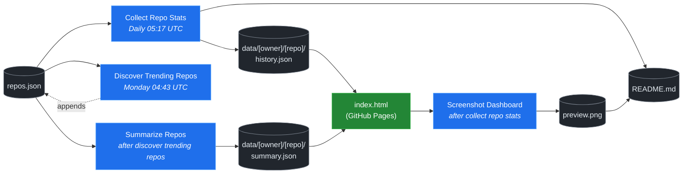

# 🚀 Rising Repos Tracker

> Automatically tracks daily GitHub stats (stars, forks, issues, velocity) for rising open source repos.

[](https://www.telosignal.com/)


**[→ View Live Dashboard](https://patrick-creates.github.io/rising-repos-tracker/)**

Built and maintained by [Telosignal](https://www.telosignal.com/).


<!-- AUTOGEN-STATS-START -->
## 📊 Current snapshot

> Auto-updated daily — last refreshed 2026-09-09

| Metric | Value |
|---|---|
| Repos tracked | **194** |
| Total stars | **9,528,251** |
| Total forks | **1,399,347** |
| Fastest growing | **ponytail** (+1072.6/day) |

### 🔥 Top 5 by velocity

| # | Repo | Stars | Stars/day |
|---|---|---:|---:|
| 1 | [DietrichGebert/ponytail](https://github.com/DietrichGebert/ponytail) | 132,756 | +1072.6 |
| 2 | [NousResearch/hermes-agent](https://github.com/NousResearch/hermes-agent) | 243,624 | +803.2 |
| 3 | [stablyai/orca](https://github.com/stablyai/orca) | 64,658 | +801.2 |
| 4 | [diegosouzapw/OmniRoute](https://github.com/diegosouzapw/OmniRoute) | 63,162 | +784.8 |
| 5 | [bojieli/ai-agent-book](https://github.com/bojieli/ai-agent-book) | 45,384 | +733.9 |

### 🆕 Recently added

- [career-ops-hq/career-ops](https://github.com/career-ops-hq/career-ops) — added 2026-09-07 — Open-source AI job search: scan job portals, evaluate listings into a structured A-H report with a global 1-5 score, tailor your CV, track applications — runs locally in your AI coding CLI (Claude Code, Codex, OpenCode, Antigravity…)
- [K-Dense-AI/scientific-agent-skills](https://github.com/K-Dense-AI/scientific-agent-skills) — added 2026-09-07 — Turn any AI agent into an AI Scientist. The #1 Agent Skills library for science, used by 190,000+ scientists worldwide. 165 ready-to-use validated skills plus 100+ scientific databases covering biology, chemistry, medicine, and drug discovery. Compatible with Cursor, Claude Code, Codex, Pi, Antigravity, and the open Agent Skills standard.
- [Hmbown/Codewhale](https://github.com/Hmbown/Codewhale) — added 2026-09-07 — Open-source coding agent for your terminal, built in Rust and on a journey of continuous community improvement. Issues and PRs welcome.
<!-- AUTOGEN-STATS-END -->

<!-- AUTOGEN-DIAGRAM-START -->
## 🔄 How it works


```mermaid
graph LR
    repos[("repos.json")]:::data
    history[("data/[owner]/[repo]/<br/>history.json")]:::data
    summary[("data/[owner]/[repo]/<br/>summary.json")]:::data
    readme[("README.md")]:::data
    preview[("preview.png")]:::data
    dashboard["index.html<br/>(GitHub Pages)"]:::output
    collect_yml["Collect Repo Stats<br/><i>Daily 05:17 UTC</i>"]:::workflow
    discover_yml["Discover Trending Repos<br/><i>Monday 04:43 UTC</i>"]:::workflow
    screenshot_yml["Screenshot Dashboard<br/><i>after collect repo stats</i>"]:::workflow
    summarize_yml["Summarize Repos<br/><i>after discover trending repos</i>"]:::workflow
    repos --> collect_yml
    collect_yml --> history
    collect_yml --> readme
    repos --> discover_yml
    discover_yml -.->|appends| repos
    dashboard --> screenshot_yml
    screenshot_yml --> preview
    repos --> summarize_yml
    summarize_yml --> summary
    history --> dashboard
    summary --> dashboard
    preview --> readme
    classDef workflow fill:#1f6feb,stroke:#58a6ff,color:#fff
    classDef data fill:#21262d,stroke:#7d8590,color:#e6edf3
    classDef output fill:#238636,stroke:#3fb950,color:#fff
```
<!-- AUTOGEN-DIAGRAM-END -->

<!-- AUTOGEN-WORKFLOWS-START -->
## ⚙️ Workflows

| File | Schedule | Name |
|---|---|---|
| `collect.yml` | Daily 05:17 UTC | Collect Repo Stats |
| `discover.yml` | Monday 04:43 UTC | Discover Trending Repos |
| `screenshot.yml` | After Collect Repo Stats | Screenshot Dashboard |
| `summarize.yml` | After Discover Trending Repos | Summarize Repos |

> All workflows commit results directly back to the repo. Schedules are best-effort — GitHub Actions cron can drift by a few minutes.
<!-- AUTOGEN-WORKFLOWS-END -->

<!-- AUTOGEN-REPOS-START -->
## 📋 All tracked repos

| Repo | Stars | Forks | Stars/day |
|---|---:|---:|---:|
| [openclaw/openclaw](https://github.com/openclaw/openclaw) | 389,272 | 81,806 | +149.6 |
| [obra/superpowers](https://github.com/obra/superpowers) | 283,644 | 25,391 | +608.4 |
| [affaan-m/everything-claude-code](https://github.com/affaan-m/everything-claude-code) | 254,683 | 38,153 | +618.8 |
| [affaan-m/ECC](https://github.com/affaan-m/ECC) | 254,683 | 38,154 | +583.7 |
| [NousResearch/hermes-agent](https://github.com/NousResearch/hermes-agent) | 243,624 | 50,248 | +803.2 |
| [Significant-Gravitas/AutoGPT](https://github.com/Significant-Gravitas/AutoGPT) | 187,216 | 46,028 | +24.7 |
| [microsoft/markitdown](https://github.com/microsoft/markitdown) | 182,025 | 13,369 | +495.9 |
| [f/prompts.chat](https://github.com/f/prompts.chat) | 169,753 | 21,843 | +63.7 |
| [langgenius/dify](https://github.com/langgenius/dify) | 155,164 | 24,504 | +117.1 |
| [open-webui/open-webui](https://github.com/open-webui/open-webui) | 151,418 | 22,137 | +122.1 |
| [langchain-ai/langchain](https://github.com/langchain-ai/langchain) | 145,994 | 24,387 | +78.6 |
| [github/spec-kit](https://github.com/github/spec-kit) | 134,324 | 12,092 | +306.4 |
| [DietrichGebert/ponytail](https://github.com/DietrichGebert/ponytail) | 132,756 | 7,099 | +1072.6 |
| [farion1231/cc-switch](https://github.com/farion1231/cc-switch) | 131,880 | 9,081 | +507.3 |
| [nextlevelbuilder/ui-ux-pro-max-skill](https://github.com/nextlevelbuilder/ui-ux-pro-max-skill) | 126,265 | 13,494 | +406.5 |
| [microsoft/generative-ai-for-beginners](https://github.com/microsoft/generative-ai-for-beginners) | 119,444 | 62,887 | +73.0 |
| [Graphify-Labs/graphify](https://github.com/Graphify-Labs/graphify) | 116,193 | 11,269 | +443.1 |
| [JuliusBrussee/caveman](https://github.com/JuliusBrussee/caveman) | 104,439 | 6,056 | +376.6 |
| [nexu-io/open-design](https://github.com/nexu-io/open-design) | 95,030 | 10,992 | +446.1 |
| [thedotmack/claude-mem](https://github.com/thedotmack/claude-mem) | 93,548 | 8,220 | +152.7 |
| [ruvnet/RuView](https://github.com/ruvnet/RuView) | 92,863 | 12,321 | +252.1 |
| [vllm-project/vllm](https://github.com/vllm-project/vllm) | 91,326 | 21,944 | +96.2 |
| [ChatGPTNextWeb/NextChat](https://github.com/ChatGPTNextWeb/NextChat) | 88,716 | 59,107 | +6.0 |
| [OpenHands/OpenHands](https://github.com/OpenHands/OpenHands) | 87,003 | 11,396 | +114.7 |
| [koala73/worldmonitor](https://github.com/koala73/worldmonitor) | 85,880 | 12,983 | +276.4 |
| [Leonxlnx/taste-skill](https://github.com/Leonxlnx/taste-skill) | 85,605 | 5,855 | +551.9 |
| [lobehub/lobehub](https://github.com/lobehub/lobehub) | 82,345 | 15,865 | +44.9 |
| [rtk-ai/rtk](https://github.com/rtk-ai/rtk) | 79,591 | 5,034 | +263.3 |
| [Panniantong/Agent-Reach](https://github.com/Panniantong/Agent-Reach) | 78,947 | 6,799 | +596.5 |
| [dair-ai/Prompt-Engineering-Guide](https://github.com/dair-ai/Prompt-Engineering-Guide) | 78,125 | 8,573 | +30.0 |
| [datawhalechina/hello-agents](https://github.com/datawhalechina/hello-agents) | 77,940 | 9,690 | +239.3 |
| [shareAI-lab/learn-claude-code](https://github.com/shareAI-lab/learn-claude-code) | 76,389 | 12,293 | +134.3 |
| [unslothai/unsloth](https://github.com/unslothai/unsloth) | 75,919 | 6,904 | +100.2 |
| [openai/openai-cookbook](https://github.com/openai/openai-cookbook) | 75,861 | 12,833 | +19.8 |
| [ComposioHQ/awesome-claude-skills](https://github.com/ComposioHQ/awesome-claude-skills) | 74,721 | 8,625 | +125.7 |
| [chopratejas/headroom](https://github.com/chopratejas/headroom) | 70,918 | 5,437 | +497.2 |
| [headroomlabs-ai/headroom](https://github.com/headroomlabs-ai/headroom) | 70,918 | 5,437 | +316.6 |
| [career-ops-hq/career-ops](https://github.com/career-ops-hq/career-ops) | 70,685 | 13,343 | +151.5 |
| [santifer/career-ops](https://github.com/santifer/career-ops) | 70,684 | 13,343 | +223.1 |
| [code-yeongyu/oh-my-openagent](https://github.com/code-yeongyu/oh-my-openagent) | 68,838 | 5,656 | +92.2 |
| [Fission-AI/OpenSpec](https://github.com/Fission-AI/OpenSpec) | 67,725 | 4,654 | +166.1 |
| [xtekky/gpt4free](https://github.com/xtekky/gpt4free) | 66,666 | 13,511 | +3.7 |
| [shanraisshan/claude-code-best-practice](https://github.com/shanraisshan/claude-code-best-practice) | 65,788 | 6,533 | +107.8 |
| [ZhuLinsen/daily_stock_analysis](https://github.com/ZhuLinsen/daily_stock_analysis) | 64,829 | 54,329 | +242.9 |
| [stablyai/orca](https://github.com/stablyai/orca) | 64,658 | 4,281 | +801.2 |
| [asgeirtj/system_prompts_leaks](https://github.com/asgeirtj/system_prompts_leaks) | 64,516 | 10,574 | +211.7 |
| [diegosouzapw/OmniRoute](https://github.com/diegosouzapw/OmniRoute) | 63,162 | 8,823 | +784.8 |
| [mvanhorn/last30days-skill](https://github.com/mvanhorn/last30days-skill) | 61,645 | 5,373 | +311.5 |
| [usestrix/strix](https://github.com/usestrix/strix) | 61,445 | 6,723 | +357.4 |
| [tw93/Pake](https://github.com/tw93/Pake) | 61,355 | 12,633 | +110.3 |
| [MemPalace/mempalace](https://github.com/MemPalace/mempalace) | 58,956 | 7,553 | +57.5 |
| [BerriAI/litellm](https://github.com/BerriAI/litellm) | 58,348 | 11,295 | +96.1 |
| [calesthio/OpenMontage](https://github.com/calesthio/OpenMontage) | 56,764 | 7,152 | +401.6 |
| [FlowiseAI/Flowise](https://github.com/FlowiseAI/Flowise) | 55,446 | 24,988 | +22.3 |
| [hesreallyhim/awesome-claude-code](https://github.com/hesreallyhim/awesome-claude-code) | 53,738 | 4,684 | +84.6 |
| [ggml-org/whisper.cpp](https://github.com/ggml-org/whisper.cpp) | 53,542 | 6,133 | +32.6 |
| [rohitg00/ai-engineering-from-scratch](https://github.com/rohitg00/ai-engineering-from-scratch) | 53,296 | 9,337 | +269.3 |
| [jamiepine/voicebox](https://github.com/jamiepine/voicebox) | 52,748 | 6,583 | +237.3 |
| [ChromeDevTools/chrome-devtools-mcp](https://github.com/ChromeDevTools/chrome-devtools-mcp) | 51,416 | 3,614 | +101.2 |
| [router-for-me/CLIProxyAPI](https://github.com/router-for-me/CLIProxyAPI) | 51,088 | 7,749 | +152.7 |
| [elder-plinius/CL4R1T4S](https://github.com/elder-plinius/CL4R1T4S) | 49,210 | 10,119 | +120.0 |
| [coreyhaines31/marketingskills](https://github.com/coreyhaines31/marketingskills) | 49,091 | 7,509 | +176.5 |
| [Aider-AI/aider](https://github.com/Aider-AI/aider) | 48,844 | 4,935 | +34.1 |
| [heygen-com/hyperframes](https://github.com/heygen-com/hyperframes) | 48,157 | 4,420 | +243.0 |
| [kepano/obsidian-skills](https://github.com/kepano/obsidian-skills) | 48,064 | 3,436 | +141.8 |
| [HKUDS/nanobot](https://github.com/HKUDS/nanobot) | 47,927 | 8,462 | +46.0 |
| [QuantumNous/new-api](https://github.com/QuantumNous/new-api) | 47,689 | 11,400 | +115.3 |
| [Imbad0202/academic-research-skills](https://github.com/Imbad0202/academic-research-skills) | 47,171 | 3,691 | +169.9 |
| [zhayujie/CowAgent](https://github.com/zhayujie/CowAgent) | 46,850 | 10,346 | +20.1 |
| [sickn33/antigravity-awesome-skills](https://github.com/sickn33/antigravity-awesome-skills) | 46,184 | 6,742 | +70.1 |
| [sickn33/agentic-awesome-skills](https://github.com/sickn33/agentic-awesome-skills) | 46,184 | 6,742 | +54.2 |
| [bojieli/ai-agent-book](https://github.com/bojieli/ai-agent-book) | 45,384 | 5,045 | +733.9 |
| [K-Dense-AI/scientific-agent-skills](https://github.com/K-Dense-AI/scientific-agent-skills) | 44,010 | 3,994 | +267.0 |
| [danny-avila/LibreChat](https://github.com/danny-avila/LibreChat) | 42,952 | 8,903 | +51.2 |
| [DeusData/codebase-memory-mcp](https://github.com/DeusData/codebase-memory-mcp) | 42,733 | 3,481 | +307.0 |
| [chatanywhere/GPT_API_free](https://github.com/chatanywhere/GPT_API_free) | 42,127 | 2,719 | +37.1 |
| [chatboxai/chatbox](https://github.com/chatboxai/chatbox) | 41,699 | 4,241 | +14.9 |
| [MadsLorentzen/ai-job-search](https://github.com/MadsLorentzen/ai-job-search) | 41,520 | 14,251 | +343.7 |
| [langchain-ai/langgraph](https://github.com/langchain-ai/langgraph) | 41,306 | 6,979 | +74.5 |
| [Hmbown/CodeWhale](https://github.com/Hmbown/CodeWhale) | 40,936 | 3,555 | +58.6 |
| [Hmbown/Codewhale](https://github.com/Hmbown/Codewhale) | 40,936 | 3,555 | +10.0 |
| [AstrBotDevs/AstrBot](https://github.com/AstrBotDevs/AstrBot) | 40,263 | 2,900 | +66.7 |
| [mindsdb/mindshub](https://github.com/mindsdb/mindshub) | 39,718 | 6,241 | +5.5 |
| [tinyhumansai/openhuman](https://github.com/tinyhumansai/openhuman) | 39,547 | 3,900 | +29.0 |
| [wshobson/agents](https://github.com/wshobson/agents) | 39,517 | 4,212 | +33.5 |
| [Yeachan-Heo/oh-my-claudecode](https://github.com/Yeachan-Heo/oh-my-claudecode) | 39,065 | 3,497 | +39.6 |
| [github/awesome-copilot](https://github.com/github/awesome-copilot) | 38,797 | 4,916 | +46.6 |
| [google/langextract](https://github.com/google/langextract) | 38,555 | 2,705 | +18.7 |
| [ogulcancelik/herdr](https://github.com/ogulcancelik/herdr) | 36,919 | 2,706 | +377.3 |
| [herdrdev/herdr](https://github.com/herdrdev/herdr) | 36,919 | 2,706 | +354.9 |
| [songquanpeng/one-api](https://github.com/songquanpeng/one-api) | 36,801 | 6,852 | +24.2 |
| [PDFMathTranslate/PDFMathTranslate](https://github.com/PDFMathTranslate/PDFMathTranslate) | 36,800 | 3,307 | +26.0 |
| [volcengine/OpenViking](https://github.com/volcengine/OpenViking) | 36,196 | 2,761 | +116.9 |
| [anthropics/claude-plugins-official](https://github.com/anthropics/claude-plugins-official) | 36,071 | 4,041 | +70.6 |
| [esengine/DeepSeek-Reasonix](https://github.com/esengine/DeepSeek-Reasonix) | 35,460 | 2,382 | +171.3 |
| [AlexsJones/llmfit](https://github.com/AlexsJones/llmfit) | 35,222 | 2,225 | +82.2 |
| [agentscope-ai/QwenPaw](https://github.com/agentscope-ai/QwenPaw) | 35,090 | 3,076 | +201.3 |
| [JCodesMore/ai-website-cloner-template](https://github.com/JCodesMore/ai-website-cloner-template) | 34,090 | 4,974 | +198.8 |
| [HKUDS/Vibe-Trading](https://github.com/HKUDS/Vibe-Trading) | 33,085 | 5,385 | +254.8 |
| [Gitlawb/openclaude](https://github.com/Gitlawb/openclaude) | 33,027 | 9,067 | +48.9 |
| [zeroclaw-labs/zeroclaw](https://github.com/zeroclaw-labs/zeroclaw) | 32,752 | 4,936 | +10.8 |
| [iOfficeAI/AionUi](https://github.com/iOfficeAI/AionUi) | 32,706 | 3,370 | +53.6 |
| [mukul975/Anthropic-Cybersecurity-Skills](https://github.com/mukul975/Anthropic-Cybersecurity-Skills) | 32,462 | 3,912 | +181.5 |
| [tirth8205/code-review-graph](https://github.com/tirth8205/code-review-graph) | 31,273 | 2,848 | +148.4 |
| [p-e-w/heretic](https://github.com/p-e-w/heretic) | 30,984 | 3,453 | +75.4 |
| [googleworkspace/cli](https://github.com/googleworkspace/cli) | 30,800 | 1,806 | +40.8 |
| [iOfficeAI/OfficeCLI](https://github.com/iOfficeAI/OfficeCLI) | 30,352 | 2,066 | +337.8 |
| [can1357/oh-my-pi](https://github.com/can1357/oh-my-pi) | 30,286 | 3,101 | +206.2 |
| [virgiliojr94/book-to-skill](https://github.com/virgiliojr94/book-to-skill) | 29,217 | 3,041 | +274.3 |
| [langchain-ai/deepagents](https://github.com/langchain-ai/deepagents) | 29,186 | 4,096 | +54.1 |
| [jackwener/OpenCLI](https://github.com/jackwener/OpenCLI) | 29,126 | 2,852 | +57.3 |
| [alibaba/page-agent](https://github.com/alibaba/page-agent) | 29,017 | 2,595 | +121.6 |
| [voideditor/void](https://github.com/voideditor/void) | 28,806 | 2,648 | +0.0 |
| [rohitg00/agentmemory](https://github.com/rohitg00/agentmemory) | 28,196 | 2,441 | +68.5 |
| [decolua/9router](https://github.com/decolua/9router) | 28,092 | 5,089 | +122.3 |
| [BloopAI/vibe-kanban](https://github.com/BloopAI/vibe-kanban) | 28,039 | 3,005 | +13.3 |
| [jarrodwatts/claude-hud](https://github.com/jarrodwatts/claude-hud) | 27,891 | 1,295 | +34.4 |
| [manaflow-ai/cmux](https://github.com/manaflow-ai/cmux) | 26,926 | 2,335 | +44.3 |
| [TencentCloud/TencentDB-Agent-Memory](https://github.com/TencentCloud/TencentDB-Agent-Memory) | 26,220 | 2,454 | +301.8 |
| [zai-org/Open-AutoGLM](https://github.com/zai-org/Open-AutoGLM) | 26,195 | 4,031 | +7.9 |
| [toon-format/toon](https://github.com/toon-format/toon) | 25,344 | 1,118 | +9.1 |
| [pascalorg/editor](https://github.com/pascalorg/editor) | 22,634 | 2,883 | +46.1 |
| [winfunc/opcode](https://github.com/winfunc/opcode) | 22,397 | 1,723 | +4.2 |
| [pranshuparmar/witr](https://github.com/pranshuparmar/witr) | 22,139 | 772 | +57.0 |
| [alibaba/open-code-review](https://github.com/alibaba/open-code-review) | 22,136 | 1,651 | +186.9 |
| [Tencent/WeKnora](https://github.com/Tencent/WeKnora) | 21,913 | 3,167 | +65.4 |
| [debpalash/VoiceStudio](https://github.com/debpalash/VoiceStudio) | 21,593 | 2,667 | +687.0 |
| [coze-dev/coze-studio](https://github.com/coze-dev/coze-studio) | 21,570 | 3,115 | +6.7 |
| [mksglu/context-mode](https://github.com/mksglu/context-mode) | 21,563 | 1,552 | +47.6 |
| [jundot/omlx](https://github.com/jundot/omlx) | 21,545 | 1,840 | +57.1 |
| [guillaumemeyer/watermarks-remover](https://github.com/guillaumemeyer/watermarks-remover) | 21,460 | 2,469 | +244.3 |
| [NirDiamant/agents-towards-production](https://github.com/NirDiamant/agents-towards-production) | 21,431 | 2,845 | +8.6 |
| [steipete/CodexBar](https://github.com/steipete/CodexBar) | 21,146 | 1,870 | +75.2 |
| [KKKKhazix/khazix-skills](https://github.com/KKKKhazix/khazix-skills) | 20,544 | 2,195 | +60.5 |
| [jnMetaCode/agency-agents-zh](https://github.com/jnMetaCode/agency-agents-zh) | 20,446 | 3,309 | +63.8 |
| [tanweai/pua](https://github.com/tanweai/pua) | 19,607 | 1,195 | +15.8 |
| [1jehuang/jcode](https://github.com/1jehuang/jcode) | 19,373 | 2,227 | +190.8 |
| [datawhalechina/easy-vibe](https://github.com/datawhalechina/easy-vibe) | 19,329 | 1,853 | +27.8 |
| [danielmiessler/LifeOS](https://github.com/danielmiessler/LifeOS) | 18,954 | 2,454 | +36.6 |
| [t8y2/dbx](https://github.com/t8y2/dbx) | 18,592 | 1,807 | +153.5 |
| [nesquena/hermes-webui](https://github.com/nesquena/hermes-webui) | 18,201 | 2,556 | +42.6 |
| [RightNow-AI/openfang](https://github.com/RightNow-AI/openfang) | 18,171 | 2,293 | +4.0 |
| [microsoft/agent-lightning](https://github.com/microsoft/agent-lightning) | 18,032 | 1,579 | +8.4 |
| [browser-use/browser-harness](https://github.com/browser-use/browser-harness) | 17,443 | 1,703 | +27.3 |
| [jlcodes99/cockpit-tools](https://github.com/jlcodes99/cockpit-tools) | 17,375 | 1,533 | +63.4 |
| [cft0808/edict](https://github.com/cft0808/edict) | 16,857 | 1,766 | +9.2 |
| [MemoriLabs/Memori](https://github.com/MemoriLabs/Memori) | 16,518 | 3,367 | +14.9 |
| [composio-community/awesome-codex-skills](https://github.com/composio-community/awesome-codex-skills) | 16,341 | 1,599 | +21.0 |
| [xbtlin/ai-berkshire](https://github.com/xbtlin/ai-berkshire) | 16,257 | 2,425 | +84.3 |
| [wanshuiyin/Auto-claude-code-research-in-sleep](https://github.com/wanshuiyin/Auto-claude-code-research-in-sleep) | 15,913 | 1,373 | +43.6 |
| [xpzouying/xiaohongshu-mcp](https://github.com/xpzouying/xiaohongshu-mcp) | 15,707 | 2,311 | +18.0 |
| [Anionex/banana-slides](https://github.com/Anionex/banana-slides) | 15,575 | 1,784 | +5.5 |
| [walkinglabs/learn-harness-engineering](https://github.com/walkinglabs/learn-harness-engineering) | 15,004 | 1,497 | +78.8 |
| [yusufkaraaslan/Skill_Seekers](https://github.com/yusufkaraaslan/Skill_Seekers) | 14,940 | 1,520 | +9.0 |
| [kyegomez/OpenMythos](https://github.com/kyegomez/OpenMythos) | 14,895 | 3,292 | +9.4 |
| [NevaMind-AI/memU](https://github.com/NevaMind-AI/memU) | 14,396 | 1,064 | +6.3 |
| [NanmiCoder/cc-haha](https://github.com/NanmiCoder/cc-haha) | 14,313 | 8,538 | +11.8 |
| [superset-sh/superset](https://github.com/superset-sh/superset) | 13,970 | 1,257 | +25.1 |
| [ifixai-ai/iFixAi](https://github.com/ifixai-ai/iFixAi) | 13,379 | 1,290 | +173.5 |
| [XiaomiMiMo/MiMo-Code](https://github.com/XiaomiMiMo/MiMo-Code) | 12,996 | 1,338 | +27.4 |
| [sirmalloc/ccstatusline](https://github.com/sirmalloc/ccstatusline) | 12,811 | 561 | +21.3 |
| [EverMind-AI/EverOS](https://github.com/EverMind-AI/EverOS) | 12,811 | 913 | +43.0 |
| [ConardLi/garden-skills](https://github.com/ConardLi/garden-skills) | 12,286 | 1,485 | +47.8 |
| [0x4m4/hexstrike-ai](https://github.com/0x4m4/hexstrike-ai) | 11,734 | 2,425 | +23.9 |
| [brokermr810/QuantDinger](https://github.com/brokermr810/QuantDinger) | 11,438 | 2,386 | +33.2 |
| [OpenByteInc/QuantDinger](https://github.com/OpenByteInc/QuantDinger) | 11,438 | 2,386 | +32.1 |
| [MemTensor/MemOS](https://github.com/MemTensor/MemOS) | 11,242 | 1,029 | +16.9 |
| [holaboss-ai/holaOS](https://github.com/holaboss-ai/holaOS) | 11,191 | 721 | +122.6 |
| [aden-hive/hive](https://github.com/aden-hive/hive) | 11,022 | 5,665 | +5.7 |
| [ValueCell-ai/valuecell](https://github.com/ValueCell-ai/valuecell) | 11,004 | 1,801 | +1.8 |
| [EKKOLearnAI/hermes-studio](https://github.com/EKKOLearnAI/hermes-studio) | 10,963 | 1,318 | +32.4 |
| [getagentseal/codeburn](https://github.com/getagentseal/codeburn) | 10,918 | 815 | +37.6 |
| [openai/codex-security](https://github.com/openai/codex-security) | 10,587 | 771 | +62.3 |
| [Kuberwastaken/claurst](https://github.com/Kuberwastaken/claurst) | 10,296 | 7,750 | +6.0 |
| [ykdojo/claude-code-tips](https://github.com/ykdojo/claude-code-tips) | 10,061 | 810 | +16.1 |
| [StarTrail-org/PixelRAG](https://github.com/StarTrail-org/PixelRAG) | 9,908 | 855 | +57.3 |
| [frankbria/ralph-claude-code](https://github.com/frankbria/ralph-claude-code) | 9,623 | 719 | +4.3 |
| [modem-dev/hunk](https://github.com/modem-dev/hunk) | 9,187 | 286 | +42.8 |
| [EvoMap/evolver](https://github.com/EvoMap/evolver) | 9,074 | 842 | +3.4 |
| [iflytek/astron-agent](https://github.com/iflytek/astron-agent) | 8,957 | 873 | +5.3 |
| [MiroMindAI/MiroThinker](https://github.com/MiroMindAI/MiroThinker) | 8,370 | 643 | +0.7 |
| [mmulet/term.everything](https://github.com/mmulet/term.everything) | 8,095 | 193 | +1.1 |
| [ValueCell-ai/ClawX](https://github.com/ValueCell-ai/ClawX) | 7,617 | 1,146 | +1.3 |
| [1weiho/open-slide](https://github.com/1weiho/open-slide) | 7,481 | 533 | +45.4 |
| [rorkai/App-Store-Connect-CLI](https://github.com/rorkai/App-Store-Connect-CLI) | 7,112 | 591 | +107.0 |
| [opensquilla/opensquilla](https://github.com/opensquilla/opensquilla) | 6,993 | 561 | +15.4 |
| [TokenRhythm/opensquilla](https://github.com/TokenRhythm/opensquilla) | 6,993 | 561 | +12.5 |
| [WenyuChiou/awesome-agentic-ai-zh](https://github.com/WenyuChiou/awesome-agentic-ai-zh) | 6,730 | 913 | +19.9 |
| [steipete/summarize](https://github.com/steipete/summarize) | 6,605 | 444 | +3.4 |
| [Andyyyy64/whichllm](https://github.com/Andyyyy64/whichllm) | 6,603 | 361 | +14.4 |
| [Arthur-Ficial/apfel](https://github.com/Arthur-Ficial/apfel) | 6,359 | 243 | +4.2 |
| [microsoft/fara](https://github.com/microsoft/fara) | 6,172 | 602 | +3.0 |
| [UfoMiao/zcf](https://github.com/UfoMiao/zcf) | 6,082 | 422 | +0.2 |
| [re4/LibreCode](https://github.com/re4/LibreCode) | 87 | 4 | — |
<!-- AUTOGEN-REPOS-END -->

---

## What it does

- Collects daily snapshots of stars, forks, watchers and open issues for every tracked repo
- Discovers new trending repos automatically every Monday using the GitHub Search API
- Generates AI summaries (use cases, similar tools, tags) for each tracked repo via GitHub Models
- Stores all history as plain JSON — no database, no backend
- Renders a live dashboard via GitHub Pages — updates daily, zero maintenance

## Tracked repos

Data lives in [`data/`](./data) — one folder per repo, one `history.json` per entry.  
The full watch list is in [`repos.json`](./repos.json).

## Fork & use it for yourself

This is my personal tracker — the watch list reflects what I find interesting. If you want to track different repos, the best path is to **fork this repo and run your own**.

### Setup

1. Fork this repo to your account
2. Replace the contents of [`repos.json`](./repos.json) with the repos you want to track (or just leave one entry — `discover.yml` will auto-add more every Monday)
3. Go to **Settings → Pages** and enable GitHub Pages from the `main` branch
4. Go to **Actions** and run **Collect Repo Stats** once manually to seed your first data point
5. Your dashboard will be live at `https://YOUR-USERNAME.github.io/rising-repos-tracker/`

That's it — daily collection and weekly discovery run automatically on schedule. Zero ongoing maintenance.

### Customizing what gets discovered

Edit [`scripts/discover.js`](./scripts/discover.js) to change:

- `MIN_STARS` — minimum star threshold for candidates
- `MAX_AGE_DAYS` — how recent a repo must be
- `MAX_NEW_REPOS` — how many to add per discovery run
- The `queries` array — GitHub Search API queries that define what "trending" means to you

### Adding a repo manually

Just edit `repos.json` directly:

```json
{
  "owner": "OWNER",
  "repo": "REPO",
  "added": "YYYY-MM-DD",
  "notes": "why you're tracking this"
}
```

The next daily collect run picks it up automatically.

## Stack

- **GitHub Actions** — scheduling and automation
- **GitHub Pages** — dashboard hosting
- **GitHub API** — data source
- **GitHub Models** — free AI summaries (gpt-4o-mini)
- **Chart.js** — star growth visualization
- **Mermaid** — architecture diagram (rendered by GitHub)
- No dependencies, no build step, no database

## License

MIT
