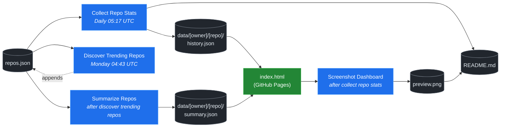

# 🚀 Rising Repos Tracker

> Automatically tracks daily GitHub stats (stars, forks, issues, velocity) for rising open source repos.

[](https://www.telosignal.com/)


**[→ View Live Dashboard](https://patrick-creates.github.io/rising-repos-tracker/)**

Built and maintained by [Telosignal](https://www.telosignal.com/).


<!-- AUTOGEN-STATS-START -->
## 📊 Current snapshot

> Auto-updated daily — last refreshed 2026-09-20

| Metric | Value |
|---|---|
| Repos tracked | **199** |
| Total stars | **9,826,348** |
| Total forks | **1,435,024** |
| Fastest growing | **ponytail** (+1052.6/day) |

### 🔥 Top 5 by velocity

| # | Repo | Stars | Stars/day |
|---|---|---:|---:|
| 1 | [DietrichGebert/ponytail](https://github.com/DietrichGebert/ponytail) | 142,757 | +1052.6 |
| 2 | [debpalash/VoiceStudio](https://github.com/debpalash/VoiceStudio) | 33,318 | +1007.6 |
| 3 | [stablyai/orca](https://github.com/stablyai/orca) | 73,057 | +795.7 |
| 4 | [NousResearch/hermes-agent](https://github.com/NousResearch/hermes-agent) | 247,298 | +763.5 |
| 5 | [diegosouzapw/OmniRoute](https://github.com/diegosouzapw/OmniRoute) | 68,387 | +739.9 |

### 🆕 Recently added

- [every-app/open-seo](https://github.com/every-app/open-seo) — added 2026-09-14 — Open source alternative to Semrush and Ahrefs
- [NVIDIA/SkillSpector](https://github.com/NVIDIA/SkillSpector) — added 2026-09-14 — Security scanner for AI agent skills. Detect vulnerabilities, malicious patterns, security risks, prompt injection, data exfiltration, and supply-chain risks in Claude Code, Codex, and MCP skills before you install them.
- [AgriciDaniel/claude-seo](https://github.com/AgriciDaniel/claude-seo) — added 2026-09-14 — Universal SEO skill for Claude Code. 25 sub-skills + 18 sub-agents covering technical SEO, E-E-A-T, schema, GEO/AEO, backlinks, local SEO, maps intelligence, semantic clustering, e-commerce SEO, international SEO, Google APIs, and PDF/Excel reporting. Optional DataForSEO, Firecrawl, and Banana extensions.
<!-- AUTOGEN-STATS-END -->

<!-- AUTOGEN-DIAGRAM-START -->
## 🔄 How it works


```mermaid
graph LR
    repos[("repos.json")]:::data
    history[("data/[owner]/[repo]/<br/>history.json")]:::data
    summary[("data/[owner]/[repo]/<br/>summary.json")]:::data
    readme[("README.md")]:::data
    preview[("preview.png")]:::data
    dashboard["index.html<br/>(GitHub Pages)"]:::output
    collect_yml["Collect Repo Stats<br/><i>Daily 05:17 UTC</i>"]:::workflow
    discover_yml["Discover Trending Repos<br/><i>Monday 04:43 UTC</i>"]:::workflow
    screenshot_yml["Screenshot Dashboard<br/><i>after collect repo stats</i>"]:::workflow
    summarize_yml["Summarize Repos<br/><i>after discover trending repos</i>"]:::workflow
    repos --> collect_yml
    collect_yml --> history
    collect_yml --> readme
    repos --> discover_yml
    discover_yml -.->|appends| repos
    dashboard --> screenshot_yml
    screenshot_yml --> preview
    repos --> summarize_yml
    summarize_yml --> summary
    history --> dashboard
    summary --> dashboard
    preview --> readme
    classDef workflow fill:#1f6feb,stroke:#58a6ff,color:#fff
    classDef data fill:#21262d,stroke:#7d8590,color:#e6edf3
    classDef output fill:#238636,stroke:#3fb950,color:#fff
```
<!-- AUTOGEN-DIAGRAM-END -->

<!-- AUTOGEN-WORKFLOWS-START -->
## ⚙️ Workflows

| File | Schedule | Name |
|---|---|---|
| `collect.yml` | Daily 05:17 UTC | Collect Repo Stats |
| `discover.yml` | Monday 04:43 UTC | Discover Trending Repos |
| `screenshot.yml` | After Collect Repo Stats | Screenshot Dashboard |
| `summarize.yml` | After Discover Trending Repos | Summarize Repos |

> All workflows commit results directly back to the repo. Schedules are best-effort — GitHub Actions cron can drift by a few minutes.
<!-- AUTOGEN-WORKFLOWS-END -->

<!-- AUTOGEN-REPOS-START -->
## 📋 All tracked repos

| Repo | Stars | Forks | Stars/day |
|---|---:|---:|---:|
| [openclaw/openclaw](https://github.com/openclaw/openclaw) | 390,118 | 82,036 | +143.4 |
| [obra/superpowers](https://github.com/obra/superpowers) | 288,984 | 25,853 | +593.4 |
| [affaan-m/everything-claude-code](https://github.com/affaan-m/everything-claude-code) | 263,176 | 39,379 | +631.8 |
| [affaan-m/ECC](https://github.com/affaan-m/ECC) | 263,176 | 39,379 | +601.2 |
| [NousResearch/hermes-agent](https://github.com/NousResearch/hermes-agent) | 247,298 | 51,987 | +763.5 |
| [Significant-Gravitas/AutoGPT](https://github.com/Significant-Gravitas/AutoGPT) | 187,453 | 46,009 | +24.4 |
| [microsoft/markitdown](https://github.com/microsoft/markitdown) | 185,789 | 13,683 | +482.9 |
| [f/prompts.chat](https://github.com/f/prompts.chat) | 170,794 | 21,944 | +66.3 |
| [langgenius/dify](https://github.com/langgenius/dify) | 156,550 | 24,690 | +117.9 |
| [open-webui/open-webui](https://github.com/open-webui/open-webui) | 152,598 | 22,329 | +120.8 |
| [langchain-ai/langchain](https://github.com/langchain-ai/langchain) | 146,710 | 24,535 | +77.5 |
| [DietrichGebert/ponytail](https://github.com/DietrichGebert/ponytail) | 142,757 | 7,655 | +1052.6 |
| [github/spec-kit](https://github.com/github/spec-kit) | 138,016 | 12,364 | +308.9 |
| [farion1231/cc-switch](https://github.com/farion1231/cc-switch) | 133,772 | 9,232 | +477.8 |
| [nextlevelbuilder/ui-ux-pro-max-skill](https://github.com/nextlevelbuilder/ui-ux-pro-max-skill) | 129,176 | 13,765 | +394.5 |
| [microsoft/generative-ai-for-beginners](https://github.com/microsoft/generative-ai-for-beginners) | 120,112 | 63,236 | +72.0 |
| [Graphify-Labs/graphify](https://github.com/Graphify-Labs/graphify) | 119,739 | 11,572 | +418.9 |
| [JuliusBrussee/caveman](https://github.com/JuliusBrussee/caveman) | 106,870 | 6,182 | +362.9 |
| [nexu-io/open-design](https://github.com/nexu-io/open-design) | 97,189 | 11,290 | +424.1 |
| [ruvnet/RuView](https://github.com/ruvnet/RuView) | 94,519 | 12,506 | +242.6 |
| [thedotmack/claude-mem](https://github.com/thedotmack/claude-mem) | 94,308 | 8,322 | +145.6 |
| [vllm-project/vllm](https://github.com/vllm-project/vllm) | 92,214 | 22,438 | +94.8 |
| [ChatGPTNextWeb/NextChat](https://github.com/ChatGPTNextWeb/NextChat) | 88,791 | 59,033 | +6.0 |
| [Leonxlnx/taste-skill](https://github.com/Leonxlnx/taste-skill) | 88,624 | 6,032 | +524.4 |
| [OpenHands/OpenHands](https://github.com/OpenHands/OpenHands) | 88,587 | 11,646 | +117.2 |
| [koala73/worldmonitor](https://github.com/koala73/worldmonitor) | 87,061 | 13,225 | +261.5 |
| [Panniantong/Agent-Reach](https://github.com/Panniantong/Agent-Reach) | 83,622 | 7,331 | +578.3 |
| [lobehub/lobehub](https://github.com/lobehub/lobehub) | 82,668 | 15,897 | +43.6 |
| [rtk-ai/rtk](https://github.com/rtk-ai/rtk) | 81,078 | 5,141 | +252.0 |
| [datawhalechina/hello-agents](https://github.com/datawhalechina/hello-agents) | 80,019 | 9,958 | +234.9 |
| [dair-ai/Prompt-Engineering-Guide](https://github.com/dair-ai/Prompt-Engineering-Guide) | 78,488 | 8,630 | +30.3 |
| [shareAI-lab/learn-claude-code](https://github.com/shareAI-lab/learn-claude-code) | 77,241 | 12,425 | +129.3 |
| [unslothai/unsloth](https://github.com/unslothai/unsloth) | 76,466 | 6,985 | +95.7 |
| [openai/openai-cookbook](https://github.com/openai/openai-cookbook) | 76,087 | 12,879 | +19.8 |
| [ComposioHQ/awesome-claude-skills](https://github.com/ComposioHQ/awesome-claude-skills) | 75,365 | 8,734 | +119.8 |
| [chopratejas/headroom](https://github.com/chopratejas/headroom) | 73,171 | 5,628 | +464.0 |
| [headroomlabs-ai/headroom](https://github.com/headroomlabs-ai/headroom) | 73,171 | 5,628 | +303.0 |
| [stablyai/orca](https://github.com/stablyai/orca) | 73,057 | 4,777 | +795.7 |
| [santifer/career-ops](https://github.com/santifer/career-ops) | 72,208 | 13,604 | +215.7 |
| [career-ops-hq/career-ops](https://github.com/career-ops-hq/career-ops) | 72,208 | 13,604 | +140.5 |
| [Fission-AI/OpenSpec](https://github.com/Fission-AI/OpenSpec) | 69,622 | 4,769 | +166.7 |
| [code-yeongyu/oh-my-openagent](https://github.com/code-yeongyu/oh-my-openagent) | 69,216 | 5,702 | +87.1 |
| [diegosouzapw/OmniRoute](https://github.com/diegosouzapw/OmniRoute) | 68,387 | 9,673 | +739.9 |
| [asgeirtj/system_prompts_leaks](https://github.com/asgeirtj/system_prompts_leaks) | 67,772 | 11,014 | +219.1 |
| [xtekky/gpt4free](https://github.com/xtekky/gpt4free) | 66,699 | 13,505 | +3.7 |
| [shanraisshan/claude-code-best-practice](https://github.com/shanraisshan/claude-code-best-practice) | 66,121 | 6,562 | +101.0 |
| [ZhuLinsen/daily_stock_analysis](https://github.com/ZhuLinsen/daily_stock_analysis) | 65,361 | 54,663 | +224.8 |
| [usestrix/strix](https://github.com/usestrix/strix) | 63,770 | 6,977 | +342.9 |
| [mvanhorn/last30days-skill](https://github.com/mvanhorn/last30days-skill) | 62,387 | 5,437 | +285.7 |
| [tw93/Pake](https://github.com/tw93/Pake) | 61,539 | 12,685 | +102.1 |
| [calesthio/OpenMontage](https://github.com/calesthio/OpenMontage) | 60,283 | 7,634 | +390.7 |
| [BerriAI/litellm](https://github.com/BerriAI/litellm) | 59,208 | 11,596 | +94.6 |
| [MemPalace/mempalace](https://github.com/MemPalace/mempalace) | 59,170 | 7,564 | +54.2 |
| [FlowiseAI/Flowise](https://github.com/FlowiseAI/Flowise) | 55,465 | 25,034 | +20.5 |
| [jamiepine/voicebox](https://github.com/jamiepine/voicebox) | 55,243 | 6,891 | +236.2 |
| [rohitg00/ai-engineering-from-scratch](https://github.com/rohitg00/ai-engineering-from-scratch) | 55,059 | 9,683 | +258.5 |
| [hesreallyhim/awesome-claude-code](https://github.com/hesreallyhim/awesome-claude-code) | 54,338 | 4,736 | +81.9 |
| [ggml-org/whisper.cpp](https://github.com/ggml-org/whisper.cpp) | 53,787 | 6,181 | +31.7 |
| [router-for-me/CLIProxyAPI](https://github.com/router-for-me/CLIProxyAPI) | 52,578 | 7,938 | +151.1 |
| [ChromeDevTools/chrome-devtools-mcp](https://github.com/ChromeDevTools/chrome-devtools-mcp) | 52,346 | 4,282 | +99.7 |
| [heygen-com/hyperframes](https://github.com/heygen-com/hyperframes) | 51,767 | 4,719 | +252.0 |
| [coreyhaines31/marketingskills](https://github.com/coreyhaines31/marketingskills) | 50,960 | 7,716 | +175.9 |
| [elder-plinius/CL4R1T4S](https://github.com/elder-plinius/CL4R1T4S) | 50,066 | 10,280 | +115.2 |
| [Aider-AI/aider](https://github.com/Aider-AI/aider) | 49,077 | 4,980 | +32.9 |
| [bojieli/ai-agent-book](https://github.com/bojieli/ai-agent-book) | 48,815 | 5,481 | +659.1 |
| [Imbad0202/academic-research-skills](https://github.com/Imbad0202/academic-research-skills) | 48,809 | 3,789 | +165.7 |
| [kepano/obsidian-skills](https://github.com/kepano/obsidian-skills) | 48,630 | 3,464 | +132.8 |
| [QuantumNous/new-api](https://github.com/QuantumNous/new-api) | 48,501 | 11,626 | +111.4 |
| [HKUDS/nanobot](https://github.com/HKUDS/nanobot) | 48,390 | 8,548 | +45.7 |
| [zhayujie/CowAgent](https://github.com/zhayujie/CowAgent) | 47,047 | 10,366 | +19.9 |
| [sickn33/antigravity-awesome-skills](https://github.com/sickn33/antigravity-awesome-skills) | 46,620 | 6,802 | +67.3 |
| [sickn33/agentic-awesome-skills](https://github.com/sickn33/agentic-awesome-skills) | 46,620 | 6,802 | +51.9 |
| [K-Dense-AI/scientific-agent-skills](https://github.com/K-Dense-AI/scientific-agent-skills) | 45,706 | 4,149 | +171.5 |
| [danny-avila/LibreChat](https://github.com/danny-avila/LibreChat) | 44,444 | 9,128 | +59.1 |
| [DeusData/codebase-memory-mcp](https://github.com/DeusData/codebase-memory-mcp) | 43,855 | 3,574 | +279.8 |
| [MadsLorentzen/ai-job-search](https://github.com/MadsLorentzen/ai-job-search) | 43,400 | 14,901 | +316.2 |
| [chatanywhere/GPT_API_free](https://github.com/chatanywhere/GPT_API_free) | 42,901 | 2,724 | +40.2 |
| [langchain-ai/langgraph](https://github.com/langchain-ai/langgraph) | 41,995 | 7,088 | +73.1 |
| [chatboxai/chatbox](https://github.com/chatboxai/chatbox) | 41,811 | 4,252 | +14.5 |
| [Hmbown/CodeWhale](https://github.com/Hmbown/CodeWhale) | 41,004 | 3,562 | +53.7 |
| [Hmbown/Codewhale](https://github.com/Hmbown/Codewhale) | 41,004 | 3,562 | +6.8 |
| [AstrBotDevs/AstrBot](https://github.com/AstrBotDevs/AstrBot) | 40,725 | 2,942 | +64.3 |
| [tinyhumansai/openhuman](https://github.com/tinyhumansai/openhuman) | 39,915 | 3,942 | +32.8 |
| [wshobson/agents](https://github.com/wshobson/agents) | 39,826 | 4,246 | +33.0 |
| [mindsdb/mindshub](https://github.com/mindsdb/mindshub) | 39,758 | 6,241 | +5.2 |
| [ogulcancelik/herdr](https://github.com/ogulcancelik/herdr) | 39,746 | 2,995 | +359.9 |
| [herdrdev/herdr](https://github.com/herdrdev/herdr) | 39,746 | 2,995 | +332.4 |
| [Yeachan-Heo/oh-my-claudecode](https://github.com/Yeachan-Heo/oh-my-claudecode) | 39,264 | 3,512 | +37.6 |
| [github/awesome-copilot](https://github.com/github/awesome-copilot) | 39,182 | 4,978 | +45.6 |
| [google/langextract](https://github.com/google/langextract) | 38,622 | 2,704 | +17.5 |
| [volcengine/OpenViking](https://github.com/volcengine/OpenViking) | 38,141 | 2,959 | +123.2 |
| [alibaba/open-code-review](https://github.com/alibaba/open-code-review) | 38,021 | 2,706 | +368.9 |
| [PDFMathTranslate/PDFMathTranslate](https://github.com/PDFMathTranslate/PDFMathTranslate) | 37,093 | 3,330 | +26.1 |
| [songquanpeng/one-api](https://github.com/songquanpeng/one-api) | 36,967 | 6,867 | +23.4 |
| [AlexsJones/llmfit](https://github.com/AlexsJones/llmfit) | 36,849 | 2,340 | +88.7 |
| [anthropics/claude-plugins-official](https://github.com/anthropics/claude-plugins-official) | 36,525 | 4,104 | +67.7 |
| [esengine/DeepSeek-Reasonix](https://github.com/esengine/DeepSeek-Reasonix) | 35,642 | 2,411 | +155.0 |
| [agentscope-ai/QwenPaw](https://github.com/agentscope-ai/QwenPaw) | 35,143 | 3,119 | +179.0 |
| [JCodesMore/ai-website-cloner-template](https://github.com/JCodesMore/ai-website-cloner-template) | 34,671 | 5,050 | +182.2 |
| [HKUDS/Vibe-Trading](https://github.com/HKUDS/Vibe-Trading) | 33,716 | 5,502 | +228.7 |
| [Gitlawb/openclaude](https://github.com/Gitlawb/openclaude) | 33,443 | 9,099 | +47.8 |
| [debpalash/VoiceStudio](https://github.com/debpalash/VoiceStudio) | 33,318 | 3,936 | +1007.6 |
| [mukul975/Anthropic-Cybersecurity-Skills](https://github.com/mukul975/Anthropic-Cybersecurity-Skills) | 33,011 | 3,994 | +165.4 |
| [iOfficeAI/AionUi](https://github.com/iOfficeAI/AionUi) | 32,973 | 3,412 | +50.7 |
| [zeroclaw-labs/zeroclaw](https://github.com/zeroclaw-labs/zeroclaw) | 32,843 | 4,953 | +10.5 |
| [can1357/oh-my-pi](https://github.com/can1357/oh-my-pi) | 32,048 | 3,395 | +200.6 |
| [p-e-w/heretic](https://github.com/p-e-w/heretic) | 31,923 | 3,583 | +76.5 |
| [tirth8205/code-review-graph](https://github.com/tirth8205/code-review-graph) | 31,630 | 2,879 | +135.2 |
| [virgiliojr94/book-to-skill](https://github.com/virgiliojr94/book-to-skill) | 31,484 | 3,268 | +246.5 |
| [googleworkspace/cli](https://github.com/googleworkspace/cli) | 31,068 | 1,845 | +39.2 |
| [iOfficeAI/OfficeCLI](https://github.com/iOfficeAI/OfficeCLI) | 30,867 | 2,105 | +295.7 |
| [langchain-ai/deepagents](https://github.com/langchain-ai/deepagents) | 29,588 | 4,159 | +52.2 |
| [jackwener/OpenCLI](https://github.com/jackwener/OpenCLI) | 29,481 | 2,883 | +54.6 |
| [decolua/9router](https://github.com/decolua/9router) | 29,410 | 5,475 | +122.1 |
| [alibaba/page-agent](https://github.com/alibaba/page-agent) | 29,129 | 2,615 | +109.0 |
| [voideditor/void](https://github.com/voideditor/void) | 28,798 | 2,651 | — |
| [rohitg00/agentmemory](https://github.com/rohitg00/agentmemory) | 28,629 | 2,478 | +65.4 |
| [BloopAI/vibe-kanban](https://github.com/BloopAI/vibe-kanban) | 28,137 | 3,013 | +12.9 |
| [jarrodwatts/claude-hud](https://github.com/jarrodwatts/claude-hud) | 28,069 | 1,302 | +32.5 |
| [Tencent/WeKnora](https://github.com/Tencent/WeKnora) | 27,766 | 3,737 | +118.3 |
| [manaflow-ai/cmux](https://github.com/manaflow-ai/cmux) | 27,273 | 2,380 | +42.3 |
| [TencentCloud/TencentDB-Agent-Memory](https://github.com/TencentCloud/TencentDB-Agent-Memory) | 27,022 | 2,585 | +265.3 |
| [zai-org/Open-AutoGLM](https://github.com/zai-org/Open-AutoGLM) | 26,266 | 4,032 | +7.7 |
| [toon-format/toon](https://github.com/toon-format/toon) | 25,399 | 1,123 | +8.7 |
| [pascalorg/editor](https://github.com/pascalorg/editor) | 24,161 | 3,007 | +71.0 |
| [mksglu/context-mode](https://github.com/mksglu/context-mode) | 23,718 | 1,711 | +64.4 |
| [guillaumemeyer/watermarks-remover](https://github.com/guillaumemeyer/watermarks-remover) | 22,412 | 2,589 | +180.0 |
| [pranshuparmar/witr](https://github.com/pranshuparmar/witr) | 22,409 | 783 | +52.7 |
| [winfunc/opcode](https://github.com/winfunc/opcode) | 22,408 | 1,720 | +3.9 |
| [jundot/omlx](https://github.com/jundot/omlx) | 21,941 | 1,899 | +54.7 |
| [steipete/CodexBar](https://github.com/steipete/CodexBar) | 21,658 | 1,973 | +71.7 |
| [coze-dev/coze-studio](https://github.com/coze-dev/coze-studio) | 21,619 | 3,119 | +6.5 |
| [NirDiamant/agents-towards-production](https://github.com/NirDiamant/agents-towards-production) | 21,482 | 2,849 | +8.2 |
| [KKKKhazix/khazix-skills](https://github.com/KKKKhazix/khazix-skills) | 20,826 | 2,209 | +54.3 |
| [jnMetaCode/agency-agents-zh](https://github.com/jnMetaCode/agency-agents-zh) | 20,814 | 3,361 | +60.1 |
| [t8y2/dbx](https://github.com/t8y2/dbx) | 20,177 | 1,959 | +151.6 |
| [1jehuang/jcode](https://github.com/1jehuang/jcode) | 19,925 | 2,316 | +168.4 |
| [tanweai/pua](https://github.com/tanweai/pua) | 19,664 | 1,199 | +14.6 |
| [every-app/open-seo](https://github.com/every-app/open-seo) | 19,591 | 2,519 | +155.8 |
| [datawhalechina/easy-vibe](https://github.com/datawhalechina/easy-vibe) | 19,475 | 1,868 | +26.1 |
| [danielmiessler/LifeOS](https://github.com/danielmiessler/LifeOS) | 19,066 | 2,470 | +33.3 |
| [nesquena/hermes-webui](https://github.com/nesquena/hermes-webui) | 18,464 | 2,609 | +40.3 |
| [microsoft/agent-lightning](https://github.com/microsoft/agent-lightning) | 18,399 | 1,624 | +11.2 |
| [RightNow-AI/openfang](https://github.com/RightNow-AI/openfang) | 18,204 | 2,290 | +3.9 |
| [jlcodes99/cockpit-tools](https://github.com/jlcodes99/cockpit-tools) | 18,009 | 1,591 | +61.9 |
| [NVIDIA/SkillSpector](https://github.com/NVIDIA/SkillSpector) | 17,875 | 1,540 | +122.5 |
| [browser-use/browser-harness](https://github.com/browser-use/browser-harness) | 17,814 | 1,748 | +28.1 |
| [AgriciDaniel/claude-seo](https://github.com/AgriciDaniel/claude-seo) | 17,270 | 2,526 | +64.2 |
| [cft0808/edict](https://github.com/cft0808/edict) | 16,904 | 1,770 | +8.7 |
| [MemoriLabs/Memori](https://github.com/MemoriLabs/Memori) | 16,847 | 3,515 | +16.7 |
| [composio-community/awesome-codex-skills](https://github.com/composio-community/awesome-codex-skills) | 16,553 | 1,627 | +20.6 |
| [xbtlin/ai-berkshire](https://github.com/xbtlin/ai-berkshire) | 16,456 | 2,455 | +74.7 |
| [wanshuiyin/Auto-claude-code-research-in-sleep](https://github.com/wanshuiyin/Auto-claude-code-research-in-sleep) | 16,393 | 1,396 | +43.6 |
| [xpzouying/xiaohongshu-mcp](https://github.com/xpzouying/xiaohongshu-mcp) | 15,885 | 2,341 | +17.8 |
| [Anionex/banana-slides](https://github.com/Anionex/banana-slides) | 15,628 | 1,784 | +5.4 |
| [ifixai-ai/iFixAi](https://github.com/ifixai-ai/iFixAi) | 15,620 | 1,335 | +181.6 |
| [walkinglabs/learn-harness-engineering](https://github.com/walkinglabs/learn-harness-engineering) | 15,414 | 1,544 | +72.8 |
| [yusufkaraaslan/Skill_Seekers](https://github.com/yusufkaraaslan/Skill_Seekers) | 15,011 | 1,530 | +8.7 |
| [kyegomez/OpenMythos](https://github.com/kyegomez/OpenMythos) | 14,902 | 3,297 | +8.3 |
| [NanmiCoder/cc-haha](https://github.com/NanmiCoder/cc-haha) | 14,652 | 8,572 | +16.2 |
| [NevaMind-AI/memU](https://github.com/NevaMind-AI/memU) | 14,418 | 1,071 | +5.8 |
| [superset-sh/superset](https://github.com/superset-sh/superset) | 14,409 | 1,285 | +27.1 |
| [XiaomiMiMo/MiMo-Code](https://github.com/XiaomiMiMo/MiMo-Code) | 13,208 | 1,368 | +26.3 |
| [EverMind-AI/EverOS](https://github.com/EverMind-AI/EverOS) | 13,087 | 925 | +40.6 |
| [sirmalloc/ccstatusline](https://github.com/sirmalloc/ccstatusline) | 12,957 | 572 | +20.2 |
| [ConardLi/garden-skills](https://github.com/ConardLi/garden-skills) | 12,532 | 1,512 | +44.1 |
| [0x4m4/hexstrike-ai](https://github.com/0x4m4/hexstrike-ai) | 11,991 | 2,459 | +23.9 |
| [brokermr810/QuantDinger](https://github.com/brokermr810/QuantDinger) | 11,786 | 2,438 | +32.9 |
| [OpenByteInc/QuantDinger](https://github.com/OpenByteInc/QuantDinger) | 11,786 | 2,438 | +32.0 |
| [MemTensor/MemOS](https://github.com/MemTensor/MemOS) | 11,479 | 1,051 | +17.5 |
| [holaboss-ai/holaOS](https://github.com/holaboss-ai/holaOS) | 11,325 | 723 | +86.9 |
| [EKKOLearnAI/hermes-studio](https://github.com/EKKOLearnAI/hermes-studio) | 11,142 | 1,365 | +30.0 |
| [getagentseal/codeburn](https://github.com/getagentseal/codeburn) | 11,115 | 843 | +34.8 |
| [aden-hive/hive](https://github.com/aden-hive/hive) | 11,058 | 5,661 | +5.4 |
| [ValueCell-ai/valuecell](https://github.com/ValueCell-ai/valuecell) | 11,008 | 1,802 | +1.6 |
| [openai/codex-security](https://github.com/openai/codex-security) | 10,803 | 802 | +52.5 |
| [Kuberwastaken/claurst](https://github.com/Kuberwastaken/claurst) | 10,300 | 7,737 | +5.2 |
| [ykdojo/claude-code-tips](https://github.com/ykdojo/claude-code-tips) | 10,117 | 815 | +14.5 |
| [StarTrail-org/PixelRAG](https://github.com/StarTrail-org/PixelRAG) | 10,031 | 863 | +49.9 |
| [frankbria/ralph-claude-code](https://github.com/frankbria/ralph-claude-code) | 9,639 | 719 | +4.1 |
| [modem-dev/hunk](https://github.com/modem-dev/hunk) | 9,344 | 304 | +38.2 |
| [EvoMap/evolver](https://github.com/EvoMap/evolver) | 9,104 | 847 | +3.3 |
| [iflytek/astron-agent](https://github.com/iflytek/astron-agent) | 9,017 | 888 | +5.4 |
| [trailhq/Graft](https://github.com/trailhq/Graft) | 8,735 | 796 | +191.0 |
| [MiroMindAI/MiroThinker](https://github.com/MiroMindAI/MiroThinker) | 8,411 | 646 | +1.1 |
| [mmulet/term.everything](https://github.com/mmulet/term.everything) | 8,098 | 194 | +1.0 |
| [dataelement/dsh-desktop](https://github.com/dataelement/dsh-desktop) | 7,892 | 336 | +279.7 |
| [1weiho/open-slide](https://github.com/1weiho/open-slide) | 7,619 | 548 | +36.6 |
| [ValueCell-ai/ClawX](https://github.com/ValueCell-ai/ClawX) | 7,616 | 1,142 | +1.1 |
| [rorkai/App-Store-Connect-CLI](https://github.com/rorkai/App-Store-Connect-CLI) | 7,298 | 614 | +30.8 |
| [WenyuChiou/awesome-agentic-ai-zh](https://github.com/WenyuChiou/awesome-agentic-ai-zh) | 7,102 | 964 | +27.6 |
| [opensquilla/opensquilla](https://github.com/opensquilla/opensquilla) | 7,031 | 568 | +13.3 |
| [TokenRhythm/opensquilla](https://github.com/TokenRhythm/opensquilla) | 7,031 | 568 | +4.8 |
| [Andyyyy64/whichllm](https://github.com/Andyyyy64/whichllm) | 6,668 | 368 | +12.9 |
| [steipete/summarize](https://github.com/steipete/summarize) | 6,633 | 445 | +3.2 |
| [Arthur-Ficial/apfel](https://github.com/Arthur-Ficial/apfel) | 6,423 | 246 | +4.5 |
| [microsoft/fara](https://github.com/microsoft/fara) | 6,186 | 603 | +2.7 |
| [UfoMiao/zcf](https://github.com/UfoMiao/zcf) | 6,084 | 421 | +0.2 |
| [re4/LibreCode](https://github.com/re4/LibreCode) | 89 | 5 | — |
<!-- AUTOGEN-REPOS-END -->

---

## What it does

- Collects daily snapshots of stars, forks, watchers and open issues for every tracked repo
- Discovers new trending repos automatically every Monday using the GitHub Search API
- Generates AI summaries (use cases, similar tools, tags) for each tracked repo via GitHub Models
- Stores all history as plain JSON — no database, no backend
- Renders a live dashboard via GitHub Pages — updates daily, zero maintenance

## Tracked repos

Data lives in [`data/`](./data) — one folder per repo, one `history.json` per entry.  
The full watch list is in [`repos.json`](./repos.json).

## Fork & use it for yourself

This is my personal tracker — the watch list reflects what I find interesting. If you want to track different repos, the best path is to **fork this repo and run your own**.

### Setup

1. Fork this repo to your account
2. Replace the contents of [`repos.json`](./repos.json) with the repos you want to track (or just leave one entry — `discover.yml` will auto-add more every Monday)
3. Go to **Settings → Pages** and enable GitHub Pages from the `main` branch
4. Go to **Actions** and run **Collect Repo Stats** once manually to seed your first data point
5. Your dashboard will be live at `https://YOUR-USERNAME.github.io/rising-repos-tracker/`

That's it — daily collection and weekly discovery run automatically on schedule. Zero ongoing maintenance.

### Customizing what gets discovered

Edit [`scripts/discover.js`](./scripts/discover.js) to change:

- `MIN_STARS` — minimum star threshold for candidates
- `MAX_AGE_DAYS` — how recent a repo must be
- `MAX_NEW_REPOS` — how many to add per discovery run
- The `queries` array — GitHub Search API queries that define what "trending" means to you

### Adding a repo manually

Just edit `repos.json` directly:

```json
{
  "owner": "OWNER",
  "repo": "REPO",
  "added": "YYYY-MM-DD",
  "notes": "why you're tracking this"
}
```

The next daily collect run picks it up automatically.

## Stack

- **GitHub Actions** — scheduling and automation
- **GitHub Pages** — dashboard hosting
- **GitHub API** — data source
- **GitHub Models** — free AI summaries (gpt-4o-mini)
- **Chart.js** — star growth visualization
- **Mermaid** — architecture diagram (rendered by GitHub)
- No dependencies, no build step, no database

## License

MIT
