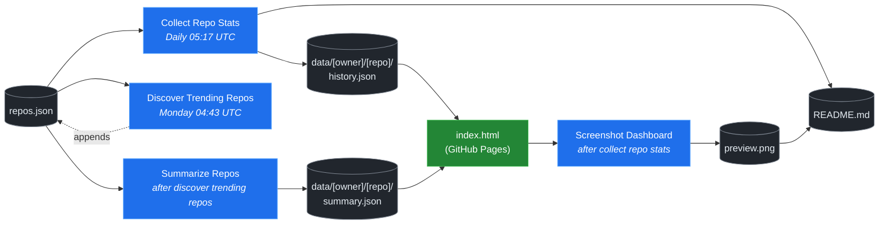

# 🚀 Rising Repos Tracker

> Automatically tracks daily GitHub stats (stars, forks, issues, velocity) for rising open source repos.

[](https://www.telosignal.com/)


**[→ View Live Dashboard](https://patrick-creates.github.io/rising-repos-tracker/)**

Built and maintained by [Telosignal](https://www.telosignal.com/).


<!-- AUTOGEN-STATS-START -->
## 📊 Current snapshot

> Auto-updated daily — last refreshed 2026-08-29

| Metric | Value |
|---|---|
| Repos tracked | **186** |
| Total stars | **9,073,432** |
| Total forks | **1,344,136** |
| Fastest growing | **ponytail** (+998.3/day) |

### 🔥 Top 5 by velocity

| # | Repo | Stars | Stars/day |
|---|---|---:|---:|
| 1 | [DietrichGebert/ponytail](https://github.com/DietrichGebert/ponytail) | 115,903 | +998.3 |
| 2 | [bojieli/ai-agent-book](https://github.com/bojieli/ai-agent-book) | 43,112 | +879.0 |
| 3 | [diegosouzapw/OmniRoute](https://github.com/diegosouzapw/OmniRoute) | 57,790 | +845.1 |
| 4 | [NousResearch/hermes-agent](https://github.com/NousResearch/hermes-agent) | 237,915 | +832.1 |
| 5 | [stablyai/orca](https://github.com/stablyai/orca) | 56,491 | +813.1 |

### 🆕 Recently added

- [virgiliojr94/book-to-skill](https://github.com/virgiliojr94/book-to-skill) — added 2026-08-24 — Turn any technical book PDF into a Claude Code skill — ready to study, reference, and use while you work.
- [guillaumemeyer/watermarks-remover](https://github.com/guillaumemeyer/watermarks-remover) — added 2026-08-24 — Strip multi-vendor AI provenance marks: Unicode text hygiene, statistical rewrite hooks, and C2PA/metadata from PNG/JPEG/SVG/PDF/DOCX/HTML/MD
- [holaboss-ai/holaOS](https://github.com/holaboss-ai/holaOS) — added 2026-08-17 — Open-source All in One AI agent workspace. Run any agent — Claude Code, Codex — across your tools (100+ integrations + MCP), apps, browser, and files, with shared memory. Built-in models or BYOK.
<!-- AUTOGEN-STATS-END -->

<!-- AUTOGEN-DIAGRAM-START -->
## 🔄 How it works


```mermaid
graph LR
    repos[("repos.json")]:::data
    history[("data/[owner]/[repo]/<br/>history.json")]:::data
    summary[("data/[owner]/[repo]/<br/>summary.json")]:::data
    readme[("README.md")]:::data
    preview[("preview.png")]:::data
    dashboard["index.html<br/>(GitHub Pages)"]:::output
    collect_yml["Collect Repo Stats<br/><i>Daily 05:17 UTC</i>"]:::workflow
    discover_yml["Discover Trending Repos<br/><i>Monday 04:43 UTC</i>"]:::workflow
    screenshot_yml["Screenshot Dashboard<br/><i>after collect repo stats</i>"]:::workflow
    summarize_yml["Summarize Repos<br/><i>after discover trending repos</i>"]:::workflow
    repos --> collect_yml
    collect_yml --> history
    collect_yml --> readme
    repos --> discover_yml
    discover_yml -.->|appends| repos
    dashboard --> screenshot_yml
    screenshot_yml --> preview
    repos --> summarize_yml
    summarize_yml --> summary
    history --> dashboard
    summary --> dashboard
    preview --> readme
    classDef workflow fill:#1f6feb,stroke:#58a6ff,color:#fff
    classDef data fill:#21262d,stroke:#7d8590,color:#e6edf3
    classDef output fill:#238636,stroke:#3fb950,color:#fff
```
<!-- AUTOGEN-DIAGRAM-END -->

<!-- AUTOGEN-WORKFLOWS-START -->
## ⚙️ Workflows

| File | Schedule | Name |
|---|---|---|
| `collect.yml` | Daily 05:17 UTC | Collect Repo Stats |
| `discover.yml` | Monday 04:43 UTC | Discover Trending Repos |
| `screenshot.yml` | After Collect Repo Stats | Screenshot Dashboard |
| `summarize.yml` | After Discover Trending Repos | Summarize Repos |

> All workflows commit results directly back to the repo. Schedules are best-effort — GitHub Actions cron can drift by a few minutes.
<!-- AUTOGEN-WORKFLOWS-END -->

<!-- AUTOGEN-REPOS-START -->
## 📋 All tracked repos

| Repo | Stars | Forks | Stars/day |
|---|---:|---:|---:|
| [openclaw/openclaw](https://github.com/openclaw/openclaw) | 387,956 | 81,465 | +152.6 |
| [obra/superpowers](https://github.com/obra/superpowers) | 279,215 | 25,004 | +641.7 |
| [affaan-m/everything-claude-code](https://github.com/affaan-m/everything-claude-code) | 244,062 | 36,914 | +583.5 |
| [affaan-m/ECC](https://github.com/affaan-m/ECC) | 244,062 | 36,914 | +539.9 |
| [NousResearch/hermes-agent](https://github.com/NousResearch/hermes-agent) | 237,915 | 48,355 | +832.1 |
| [Significant-Gravitas/AutoGPT](https://github.com/Significant-Gravitas/AutoGPT) | 186,969 | 46,050 | +24.9 |
| [microsoft/markitdown](https://github.com/microsoft/markitdown) | 176,933 | 13,009 | +499.3 |
| [f/prompts.chat](https://github.com/f/prompts.chat) | 168,147 | 21,683 | +55.3 |
| [langgenius/dify](https://github.com/langgenius/dify) | 153,805 | 24,310 | +116.5 |
| [open-webui/open-webui](https://github.com/open-webui/open-webui) | 150,290 | 21,941 | +124.1 |
| [langchain-ai/langchain](https://github.com/langchain-ai/langchain) | 145,232 | 24,236 | +79.6 |
| [github/spec-kit](https://github.com/github/spec-kit) | 132,119 | 11,880 | +317.2 |
| [farion1231/cc-switch](https://github.com/farion1231/cc-switch) | 130,024 | 8,918 | +543.5 |
| [nextlevelbuilder/ui-ux-pro-max-skill](https://github.com/nextlevelbuilder/ui-ux-pro-max-skill) | 122,742 | 13,151 | +415.3 |
| [microsoft/generative-ai-for-beginners](https://github.com/microsoft/generative-ai-for-beginners) | 118,732 | 62,603 | +73.9 |
| [DietrichGebert/ponytail](https://github.com/DietrichGebert/ponytail) | 115,903 | 6,330 | +998.3 |
| [Graphify-Labs/graphify](https://github.com/Graphify-Labs/graphify) | 112,146 | 10,906 | +468.1 |
| [JuliusBrussee/caveman](https://github.com/JuliusBrussee/caveman) | 101,697 | 5,912 | +390.1 |
| [thedotmack/claude-mem](https://github.com/thedotmack/claude-mem) | 92,543 | 8,138 | +158.9 |
| [nexu-io/open-design](https://github.com/nexu-io/open-design) | 92,514 | 10,663 | +469.3 |
| [ruvnet/RuView](https://github.com/ruvnet/RuView) | 91,966 | 12,209 | +271.6 |
| [vllm-project/vllm](https://github.com/vllm-project/vllm) | 90,381 | 21,392 | +97.2 |
| [ChatGPTNextWeb/NextChat](https://github.com/ChatGPTNextWeb/NextChat) | 88,662 | 59,176 | +6.1 |
| [OpenHands/OpenHands](https://github.com/OpenHands/OpenHands) | 85,513 | 11,190 | +112.4 |
| [koala73/worldmonitor](https://github.com/koala73/worldmonitor) | 84,746 | 12,732 | +294.9 |
| [lobehub/lobehub](https://github.com/lobehub/lobehub) | 82,084 | 15,840 | +47.1 |
| [Leonxlnx/taste-skill](https://github.com/Leonxlnx/taste-skill) | 82,025 | 5,616 | +579.9 |
| [dair-ai/Prompt-Engineering-Guide](https://github.com/dair-ai/Prompt-Engineering-Guide) | 77,879 | 8,557 | +30.9 |
| [rtk-ai/rtk](https://github.com/rtk-ai/rtk) | 77,775 | 4,904 | +273.8 |
| [Panniantong/Agent-Reach](https://github.com/Panniantong/Agent-Reach) | 76,455 | 6,537 | +646.1 |
| [openai/openai-cookbook](https://github.com/openai/openai-cookbook) | 75,599 | 12,779 | +19.3 |
| [shareAI-lab/learn-claude-code](https://github.com/shareAI-lab/learn-claude-code) | 75,584 | 12,188 | +140.8 |
| [datawhalechina/hello-agents](https://github.com/datawhalechina/hello-agents) | 75,453 | 9,386 | +240.7 |
| [unslothai/unsloth](https://github.com/unslothai/unsloth) | 75,116 | 6,814 | +103.1 |
| [ComposioHQ/awesome-claude-skills](https://github.com/ComposioHQ/awesome-claude-skills) | 73,847 | 8,461 | +130.7 |
| [santifer/career-ops](https://github.com/santifer/career-ops) | 69,156 | 13,068 | +232.1 |
| [code-yeongyu/oh-my-openagent](https://github.com/code-yeongyu/oh-my-openagent) | 68,488 | 5,611 | +98.6 |
| [chopratejas/headroom](https://github.com/chopratejas/headroom) | 67,968 | 5,257 | +530.7 |
| [headroomlabs-ai/headroom](https://github.com/headroomlabs-ai/headroom) | 67,968 | 5,257 | +324.5 |
| [xtekky/gpt4free](https://github.com/xtekky/gpt4free) | 66,610 | 13,514 | +3.6 |
| [Fission-AI/OpenSpec](https://github.com/Fission-AI/OpenSpec) | 66,609 | 4,586 | +173.0 |
| [shanraisshan/claude-code-best-practice](https://github.com/shanraisshan/claude-code-best-practice) | 65,325 | 6,512 | +114.8 |
| [ZhuLinsen/daily_stock_analysis](https://github.com/ZhuLinsen/daily_stock_analysis) | 64,241 | 53,876 | +264.6 |
| [asgeirtj/system_prompts_leaks](https://github.com/asgeirtj/system_prompts_leaks) | 63,777 | 10,459 | +227.1 |
| [tw93/Pake](https://github.com/tw93/Pake) | 61,119 | 12,562 | +119.8 |
| [mvanhorn/last30days-skill](https://github.com/mvanhorn/last30days-skill) | 60,075 | 5,259 | +334.2 |
| [usestrix/strix](https://github.com/usestrix/strix) | 59,200 | 6,467 | +376.3 |
| [MemPalace/mempalace](https://github.com/MemPalace/mempalace) | 58,717 | 7,534 | +61.3 |
| [diegosouzapw/OmniRoute](https://github.com/diegosouzapw/OmniRoute) | 57,790 | 7,964 | +845.1 |
| [BerriAI/litellm](https://github.com/BerriAI/litellm) | 57,522 | 11,004 | +98.4 |
| [stablyai/orca](https://github.com/stablyai/orca) | 56,491 | 3,843 | +813.1 |
| [FlowiseAI/Flowise](https://github.com/FlowiseAI/Flowise) | 55,399 | 24,964 | +24.3 |
| [calesthio/OpenMontage](https://github.com/calesthio/OpenMontage) | 53,660 | 6,676 | +423.1 |
| [ggml-org/whisper.cpp](https://github.com/ggml-org/whisper.cpp) | 53,270 | 6,106 | +33.4 |
| [hesreallyhim/awesome-claude-code](https://github.com/hesreallyhim/awesome-claude-code) | 53,162 | 4,634 | +88.0 |
| [jamiepine/voicebox](https://github.com/jamiepine/voicebox) | 51,761 | 6,445 | +255.5 |
| [rohitg00/ai-engineering-from-scratch](https://github.com/rohitg00/ai-engineering-from-scratch) | 50,782 | 8,798 | +274.4 |
| [ChromeDevTools/chrome-devtools-mcp](https://github.com/ChromeDevTools/chrome-devtools-mcp) | 50,059 | 3,510 | +98.8 |
| [router-for-me/CLIProxyAPI](https://github.com/router-for-me/CLIProxyAPI) | 49,144 | 7,549 | +150.0 |
| [Aider-AI/aider](https://github.com/Aider-AI/aider) | 48,567 | 4,898 | +35.0 |
| [HKUDS/nanobot](https://github.com/HKUDS/nanobot) | 47,518 | 8,383 | +47.0 |
| [kepano/obsidian-skills](https://github.com/kepano/obsidian-skills) | 47,483 | 3,412 | +152.8 |
| [elder-plinius/CL4R1T4S](https://github.com/elder-plinius/CL4R1T4S) | 47,197 | 9,558 | +110.7 |
| [QuantumNous/new-api](https://github.com/QuantumNous/new-api) | 46,726 | 11,113 | +118.4 |
| [zhayujie/CowAgent](https://github.com/zhayujie/CowAgent) | 46,716 | 10,327 | +21.0 |
| [coreyhaines31/marketingskills](https://github.com/coreyhaines31/marketingskills) | 46,036 | 7,195 | +164.0 |
| [sickn33/antigravity-awesome-skills](https://github.com/sickn33/antigravity-awesome-skills) | 45,624 | 6,678 | +72.4 |
| [sickn33/agentic-awesome-skills](https://github.com/sickn33/agentic-awesome-skills) | 45,624 | 6,678 | +54.9 |
| [Imbad0202/academic-research-skills](https://github.com/Imbad0202/academic-research-skills) | 44,139 | 3,500 | +134.7 |
| [bojieli/ai-agent-book](https://github.com/bojieli/ai-agent-book) | 43,112 | 4,770 | +879.0 |
| [heygen-com/hyperframes](https://github.com/heygen-com/hyperframes) | 43,033 | 4,137 | +213.1 |
| [danny-avila/LibreChat](https://github.com/danny-avila/LibreChat) | 42,586 | 8,818 | +53.3 |
| [chatboxai/chatbox](https://github.com/chatboxai/chatbox) | 41,605 | 4,218 | +15.6 |
| [chatanywhere/GPT_API_free](https://github.com/chatanywhere/GPT_API_free) | 41,365 | 2,706 | +33.4 |
| [DeusData/codebase-memory-mcp](https://github.com/DeusData/codebase-memory-mcp) | 41,056 | 3,342 | +334.9 |
| [Hmbown/CodeWhale](https://github.com/Hmbown/CodeWhale) | 40,864 | 3,540 | +64.5 |
| [langchain-ai/langgraph](https://github.com/langchain-ai/langgraph) | 40,652 | 6,852 | +76.9 |
| [AstrBotDevs/AstrBot](https://github.com/AstrBotDevs/AstrBot) | 39,755 | 2,849 | +69.3 |
| [mindsdb/mindshub](https://github.com/mindsdb/mindshub) | 39,660 | 6,238 | +5.5 |
| [wshobson/agents](https://github.com/wshobson/agents) | 39,240 | 4,190 | +34.4 |
| [Yeachan-Heo/oh-my-claudecode](https://github.com/Yeachan-Heo/oh-my-claudecode) | 38,860 | 3,488 | +42.0 |
| [google/langextract](https://github.com/google/langextract) | 38,502 | 2,707 | +20.3 |
| [github/awesome-copilot](https://github.com/github/awesome-copilot) | 38,398 | 4,850 | +47.8 |
| [MadsLorentzen/ai-job-search](https://github.com/MadsLorentzen/ai-job-search) | 37,896 | 12,838 | +347.1 |
| [songquanpeng/one-api](https://github.com/songquanpeng/one-api) | 36,640 | 6,839 | +25.3 |
| [PDFMathTranslate/PDFMathTranslate](https://github.com/PDFMathTranslate/PDFMathTranslate) | 36,467 | 3,255 | +25.6 |
| [esengine/DeepSeek-Reasonix](https://github.com/esengine/DeepSeek-Reasonix) | 35,239 | 2,355 | +191.6 |
| [anthropics/claude-plugins-official](https://github.com/anthropics/claude-plugins-official) | 35,185 | 3,944 | +69.4 |
| [agentscope-ai/QwenPaw](https://github.com/agentscope-ai/QwenPaw) | 34,635 | 3,044 | +224.8 |
| [AlexsJones/llmfit](https://github.com/AlexsJones/llmfit) | 34,476 | 2,157 | +84.0 |
| [volcengine/OpenViking](https://github.com/volcengine/OpenViking) | 34,217 | 2,600 | +108.4 |
| [JCodesMore/ai-website-cloner-template](https://github.com/JCodesMore/ai-website-cloner-template) | 33,333 | 4,865 | +217.9 |
| [ogulcancelik/herdr](https://github.com/ogulcancelik/herdr) | 33,292 | 2,417 | +386.9 |
| [herdrdev/herdr](https://github.com/herdrdev/herdr) | 33,292 | 2,417 | +365.5 |
| [zeroclaw-labs/zeroclaw](https://github.com/zeroclaw-labs/zeroclaw) | 32,670 | 4,916 | +11.2 |
| [iOfficeAI/AionUi](https://github.com/iOfficeAI/AionUi) | 32,389 | 3,327 | +56.6 |
| [HKUDS/Vibe-Trading](https://github.com/HKUDS/Vibe-Trading) | 32,013 | 5,224 | +283.2 |
| [mukul975/Anthropic-Cybersecurity-Skills](https://github.com/mukul975/Anthropic-Cybersecurity-Skills) | 31,569 | 3,791 | +197.8 |
| [tirth8205/code-review-graph](https://github.com/tirth8205/code-review-graph) | 30,986 | 2,822 | +166.3 |
| [Gitlawb/openclaude](https://github.com/Gitlawb/openclaude) | 30,874 | 8,924 | +30.8 |
| [googleworkspace/cli](https://github.com/googleworkspace/cli) | 30,634 | 1,796 | +44.0 |
| [iOfficeAI/OfficeCLI](https://github.com/iOfficeAI/OfficeCLI) | 29,481 | 2,007 | +390.4 |
| [alibaba/page-agent](https://github.com/alibaba/page-agent) | 28,898 | 2,589 | +137.9 |
| [voideditor/void](https://github.com/voideditor/void) | 28,819 | 2,643 | +0.2 |
| [jackwener/OpenCLI](https://github.com/jackwener/OpenCLI) | 28,703 | 2,816 | +59.8 |
| [langchain-ai/deepagents](https://github.com/langchain-ai/deepagents) | 28,681 | 4,023 | +55.2 |
| [p-e-w/heretic](https://github.com/p-e-w/heretic) | 28,564 | 3,143 | +56.0 |
| [can1357/oh-my-pi](https://github.com/can1357/oh-my-pi) | 28,214 | 2,824 | +209.1 |
| [BloopAI/vibe-kanban](https://github.com/BloopAI/vibe-kanban) | 27,949 | 2,997 | +13.9 |
| [jarrodwatts/claude-hud](https://github.com/jarrodwatts/claude-hud) | 27,719 | 1,281 | +36.9 |
| [rohitg00/agentmemory](https://github.com/rohitg00/agentmemory) | 27,708 | 2,387 | +71.7 |
| [virgiliojr94/book-to-skill](https://github.com/virgiliojr94/book-to-skill) | 26,848 | 2,777 | +403.8 |
| [decolua/9router](https://github.com/decolua/9router) | 26,601 | 4,828 | +120.4 |
| [manaflow-ai/cmux](https://github.com/manaflow-ai/cmux) | 26,570 | 2,276 | +47.1 |
| [zai-org/Open-AutoGLM](https://github.com/zai-org/Open-AutoGLM) | 26,122 | 4,021 | +8.0 |
| [toon-format/toon](https://github.com/toon-format/toon) | 25,271 | 1,123 | +9.5 |
| [TencentCloud/TencentDB-Agent-Memory](https://github.com/TencentCloud/TencentDB-Agent-Memory) | 25,105 | 2,334 | +348.7 |
| [winfunc/opcode](https://github.com/winfunc/opcode) | 22,383 | 1,727 | +4.6 |
| [pranshuparmar/witr](https://github.com/pranshuparmar/witr) | 21,797 | 760 | +61.7 |
| [pascalorg/editor](https://github.com/pascalorg/editor) | 21,748 | 2,793 | +26.2 |
| [alibaba/open-code-review](https://github.com/alibaba/open-code-review) | 21,601 | 1,592 | +215.1 |
| [coze-dev/coze-studio](https://github.com/coze-dev/coze-studio) | 21,514 | 3,123 | +6.9 |
| [NirDiamant/agents-towards-production](https://github.com/NirDiamant/agents-towards-production) | 21,346 | 2,838 | +8.7 |
| [jundot/omlx](https://github.com/jundot/omlx) | 20,920 | 1,773 | +57.2 |
| [Tencent/WeKnora](https://github.com/Tencent/WeKnora) | 20,883 | 3,003 | +61.2 |
| [steipete/CodexBar](https://github.com/steipete/CodexBar) | 20,697 | 1,793 | +80.8 |
| [mksglu/context-mode](https://github.com/mksglu/context-mode) | 20,239 | 1,470 | +36.9 |
| [KKKKhazix/khazix-skills](https://github.com/KKKKhazix/khazix-skills) | 20,233 | 2,169 | +69.4 |
| [jnMetaCode/agency-agents-zh](https://github.com/jnMetaCode/agency-agents-zh) | 20,063 | 3,253 | +68.5 |
| [tanweai/pua](https://github.com/tanweai/pua) | 19,551 | 1,191 | +17.4 |
| [datawhalechina/easy-vibe](https://github.com/datawhalechina/easy-vibe) | 19,170 | 1,831 | +29.7 |
| [guillaumemeyer/watermarks-remover](https://github.com/guillaumemeyer/watermarks-remover) | 19,155 | 2,228 | +320.6 |
| [danielmiessler/LifeOS](https://github.com/danielmiessler/LifeOS) | 18,782 | 2,440 | +39.9 |
| [1jehuang/jcode](https://github.com/1jehuang/jcode) | 18,767 | 2,131 | +222.6 |
| [RightNow-AI/openfang](https://github.com/RightNow-AI/openfang) | 18,147 | 2,288 | +4.3 |
| [microsoft/agent-lightning](https://github.com/microsoft/agent-lightning) | 17,898 | 1,570 | +7.8 |
| [nesquena/hermes-webui](https://github.com/nesquena/hermes-webui) | 17,852 | 2,477 | +44.3 |
| [t8y2/dbx](https://github.com/t8y2/dbx) | 17,346 | 1,688 | +166.9 |
| [browser-use/browser-harness](https://github.com/browser-use/browser-harness) | 17,219 | 1,664 | +28.5 |
| [cft0808/edict](https://github.com/cft0808/edict) | 16,730 | 1,750 | +8.9 |
| [jlcodes99/cockpit-tools](https://github.com/jlcodes99/cockpit-tools) | 16,719 | 1,461 | +65.6 |
| [MemoriLabs/Memori](https://github.com/MemoriLabs/Memori) | 16,262 | 3,265 | +13.5 |
| [composio-community/awesome-codex-skills](https://github.com/composio-community/awesome-codex-skills) | 16,105 | 1,573 | +20.8 |
| [xbtlin/ai-berkshire](https://github.com/xbtlin/ai-berkshire) | 15,965 | 2,393 | +96.1 |
| [xpzouying/xiaohongshu-mcp](https://github.com/xpzouying/xiaohongshu-mcp) | 15,539 | 2,285 | +18.4 |
| [Anionex/banana-slides](https://github.com/Anionex/banana-slides) | 15,516 | 1,778 | +5.5 |
| [wanshuiyin/Auto-claude-code-research-in-sleep](https://github.com/wanshuiyin/Auto-claude-code-research-in-sleep) | 15,411 | 1,346 | +43.2 |
| [yusufkaraaslan/Skill_Seekers](https://github.com/yusufkaraaslan/Skill_Seekers) | 14,853 | 1,515 | +9.2 |
| [kyegomez/OpenMythos](https://github.com/kyegomez/OpenMythos) | 14,853 | 3,295 | +10.3 |
| [walkinglabs/learn-harness-engineering](https://github.com/walkinglabs/learn-harness-engineering) | 14,476 | 1,433 | +85.0 |
| [NevaMind-AI/memU](https://github.com/NevaMind-AI/memU) | 14,357 | 1,063 | +6.7 |
| [NanmiCoder/cc-haha](https://github.com/NanmiCoder/cc-haha) | 14,243 | 8,546 | +14.1 |
| [superset-sh/superset](https://github.com/superset-sh/superset) | 13,480 | 1,228 | +21.6 |
| [XiaomiMiMo/MiMo-Code](https://github.com/XiaomiMiMo/MiMo-Code) | 12,896 | 1,333 | +30.7 |
| [sirmalloc/ccstatusline](https://github.com/sirmalloc/ccstatusline) | 12,656 | 553 | +22.6 |
| [EverMind-AI/EverOS](https://github.com/EverMind-AI/EverOS) | 12,532 | 906 | +46.2 |
| [ConardLi/garden-skills](https://github.com/ConardLi/garden-skills) | 11,613 | 1,444 | +45.0 |
| [0x4m4/hexstrike-ai](https://github.com/0x4m4/hexstrike-ai) | 11,419 | 2,381 | +23.1 |
| [ifixai-ai/iFixAi](https://github.com/ifixai-ai/iFixAi) | 11,352 | 1,222 | +167.3 |
| [brokermr810/QuantDinger](https://github.com/brokermr810/QuantDinger) | 11,185 | 2,341 | +35.2 |
| [OpenByteInc/QuantDinger](https://github.com/OpenByteInc/QuantDinger) | 11,185 | 2,341 | +34.6 |
| [MemTensor/MemOS](https://github.com/MemTensor/MemOS) | 11,076 | 1,011 | +17.2 |
| [holaboss-ai/holaOS](https://github.com/holaboss-ai/holaOS) | 11,018 | 717 | +220.6 |
| [ValueCell-ai/valuecell](https://github.com/ValueCell-ai/valuecell) | 11,007 | 1,808 | +2.2 |
| [aden-hive/hive](https://github.com/aden-hive/hive) | 10,986 | 5,672 | +6.1 |
| [EKKOLearnAI/hermes-studio](https://github.com/EKKOLearnAI/hermes-studio) | 10,670 | 1,293 | +33.5 |
| [Kuberwastaken/claurst](https://github.com/Kuberwastaken/claurst) | 10,279 | 7,757 | +6.8 |
| [openai/codex-security](https://github.com/openai/codex-security) | 10,253 | 743 | +75.8 |
| [ykdojo/claude-code-tips](https://github.com/ykdojo/claude-code-tips) | 9,966 | 803 | +17.6 |
| [StarTrail-org/PixelRAG](https://github.com/StarTrail-org/PixelRAG) | 9,786 | 836 | +68.1 |
| [getagentseal/codeburn](https://github.com/getagentseal/codeburn) | 9,713 | 771 | +23.0 |
| [frankbria/ralph-claude-code](https://github.com/frankbria/ralph-claude-code) | 9,612 | 722 | +4.6 |
| [EvoMap/evolver](https://github.com/EvoMap/evolver) | 9,017 | 840 | +3.0 |
| [iflytek/astron-agent](https://github.com/iflytek/astron-agent) | 8,904 | 865 | +5.4 |
| [modem-dev/hunk](https://github.com/modem-dev/hunk) | 8,890 | 278 | +46.5 |
| [MiroMindAI/MiroThinker](https://github.com/MiroMindAI/MiroThinker) | 8,362 | 644 | +0.7 |
| [mmulet/term.everything](https://github.com/mmulet/term.everything) | 8,083 | 195 | +1.1 |
| [ValueCell-ai/ClawX](https://github.com/ValueCell-ai/ClawX) | 7,597 | 1,142 | +1.2 |
| [1weiho/open-slide](https://github.com/1weiho/open-slide) | 7,269 | 517 | +60.6 |
| [opensquilla/opensquilla](https://github.com/opensquilla/opensquilla) | 6,763 | 534 | +13.8 |
| [steipete/summarize](https://github.com/steipete/summarize) | 6,585 | 442 | +3.7 |
| [Andyyyy64/whichllm](https://github.com/Andyyyy64/whichllm) | 6,517 | 357 | +16.3 |
| [Arthur-Ficial/apfel](https://github.com/Arthur-Ficial/apfel) | 6,334 | 243 | +4.7 |
| [microsoft/fara](https://github.com/microsoft/fara) | 6,161 | 602 | +3.4 |
| [UfoMiao/zcf](https://github.com/UfoMiao/zcf) | 6,079 | 420 | +0.2 |
| [re4/LibreCode](https://github.com/re4/LibreCode) | 85 | 5 | — |
<!-- AUTOGEN-REPOS-END -->

---

## What it does

- Collects daily snapshots of stars, forks, watchers and open issues for every tracked repo
- Discovers new trending repos automatically every Monday using the GitHub Search API
- Generates AI summaries (use cases, similar tools, tags) for each tracked repo via GitHub Models
- Stores all history as plain JSON — no database, no backend
- Renders a live dashboard via GitHub Pages — updates daily, zero maintenance

## Tracked repos

Data lives in [`data/`](./data) — one folder per repo, one `history.json` per entry.  
The full watch list is in [`repos.json`](./repos.json).

## Fork & use it for yourself

This is my personal tracker — the watch list reflects what I find interesting. If you want to track different repos, the best path is to **fork this repo and run your own**.

### Setup

1. Fork this repo to your account
2. Replace the contents of [`repos.json`](./repos.json) with the repos you want to track (or just leave one entry — `discover.yml` will auto-add more every Monday)
3. Go to **Settings → Pages** and enable GitHub Pages from the `main` branch
4. Go to **Actions** and run **Collect Repo Stats** once manually to seed your first data point
5. Your dashboard will be live at `https://YOUR-USERNAME.github.io/rising-repos-tracker/`

That's it — daily collection and weekly discovery run automatically on schedule. Zero ongoing maintenance.

### Customizing what gets discovered

Edit [`scripts/discover.js`](./scripts/discover.js) to change:

- `MIN_STARS` — minimum star threshold for candidates
- `MAX_AGE_DAYS` — how recent a repo must be
- `MAX_NEW_REPOS` — how many to add per discovery run
- The `queries` array — GitHub Search API queries that define what "trending" means to you

### Adding a repo manually

Just edit `repos.json` directly:

```json
{
  "owner": "OWNER",
  "repo": "REPO",
  "added": "YYYY-MM-DD",
  "notes": "why you're tracking this"
}
```

The next daily collect run picks it up automatically.

## Stack

- **GitHub Actions** — scheduling and automation
- **GitHub Pages** — dashboard hosting
- **GitHub API** — data source
- **GitHub Models** — free AI summaries (gpt-4o-mini)
- **Chart.js** — star growth visualization
- **Mermaid** — architecture diagram (rendered by GitHub)
- No dependencies, no build step, no database

## License

MIT
