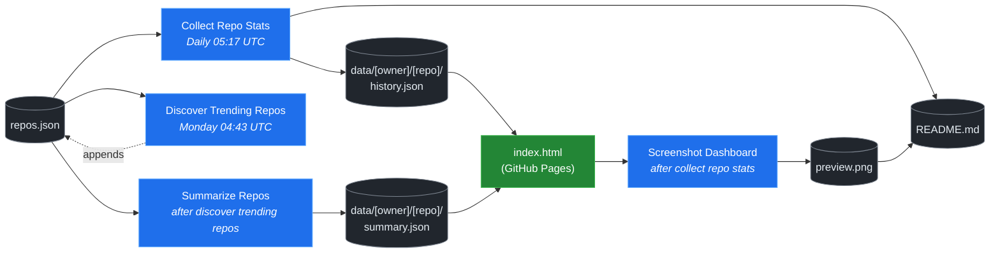

# 🚀 Rising Repos Tracker

> Automatically tracks daily GitHub stats (stars, forks, issues, velocity) for rising open source repos.

[](https://www.telosignal.com/)


**[→ View Live Dashboard](https://patrick-creates.github.io/rising-repos-tracker/)**

Built and maintained by [Telosignal](https://www.telosignal.com/).


<!-- AUTOGEN-STATS-START -->
## 📊 Current snapshot

> Auto-updated daily — last refreshed 2026-09-13

| Metric | Value |
|---|---|
| Repos tracked | **194** |
| Total stars | **9,602,570** |
| Total forks | **1,408,626** |
| Fastest growing | **ponytail** (+1070.8/day) |

### 🔥 Top 5 by velocity

| # | Repo | Stars | Stars/day |
|---|---|---:|---:|
| 1 | [DietrichGebert/ponytail](https://github.com/DietrichGebert/ponytail) | 136,896 | +1070.8 |
| 2 | [debpalash/VoiceStudio](https://github.com/debpalash/VoiceStudio) | 25,209 | +831.7 |
| 3 | [stablyai/orca](https://github.com/stablyai/orca) | 67,472 | +795.5 |
| 4 | [NousResearch/hermes-agent](https://github.com/NousResearch/hermes-agent) | 245,004 | +788.3 |
| 5 | [diegosouzapw/OmniRoute](https://github.com/diegosouzapw/OmniRoute) | 65,463 | +772.6 |

### 🆕 Recently added

- [career-ops-hq/career-ops](https://github.com/career-ops-hq/career-ops) — added 2026-09-07 — Open-source AI job search: scan job portals, evaluate listings into a structured A-H report with a global 1-5 score, tailor your CV, track applications — runs locally in your AI coding CLI (Claude Code, Codex, OpenCode, Antigravity…)
- [K-Dense-AI/scientific-agent-skills](https://github.com/K-Dense-AI/scientific-agent-skills) — added 2026-09-07 — Turn any AI agent into an AI Scientist. The #1 Agent Skills library for science, used by 190,000+ scientists worldwide. 165 ready-to-use validated skills plus 100+ scientific databases covering biology, chemistry, medicine, and drug discovery. Compatible with Cursor, Claude Code, Codex, Pi, Antigravity, and the open Agent Skills standard.
- [Hmbown/Codewhale](https://github.com/Hmbown/Codewhale) — added 2026-09-07 — Open-source coding agent for your terminal, built in Rust and on a journey of continuous community improvement. Issues and PRs welcome.
<!-- AUTOGEN-STATS-END -->

<!-- AUTOGEN-DIAGRAM-START -->
## 🔄 How it works


```mermaid
graph LR
    repos[("repos.json")]:::data
    history[("data/[owner]/[repo]/<br/>history.json")]:::data
    summary[("data/[owner]/[repo]/<br/>summary.json")]:::data
    readme[("README.md")]:::data
    preview[("preview.png")]:::data
    dashboard["index.html<br/>(GitHub Pages)"]:::output
    collect_yml["Collect Repo Stats<br/><i>Daily 05:17 UTC</i>"]:::workflow
    discover_yml["Discover Trending Repos<br/><i>Monday 04:43 UTC</i>"]:::workflow
    screenshot_yml["Screenshot Dashboard<br/><i>after collect repo stats</i>"]:::workflow
    summarize_yml["Summarize Repos<br/><i>after discover trending repos</i>"]:::workflow
    repos --> collect_yml
    collect_yml --> history
    collect_yml --> readme
    repos --> discover_yml
    discover_yml -.->|appends| repos
    dashboard --> screenshot_yml
    screenshot_yml --> preview
    repos --> summarize_yml
    summarize_yml --> summary
    history --> dashboard
    summary --> dashboard
    preview --> readme
    classDef workflow fill:#1f6feb,stroke:#58a6ff,color:#fff
    classDef data fill:#21262d,stroke:#7d8590,color:#e6edf3
    classDef output fill:#238636,stroke:#3fb950,color:#fff
```
<!-- AUTOGEN-DIAGRAM-END -->

<!-- AUTOGEN-WORKFLOWS-START -->
## ⚙️ Workflows

| File | Schedule | Name |
|---|---|---|
| `collect.yml` | Daily 05:17 UTC | Collect Repo Stats |
| `discover.yml` | Monday 04:43 UTC | Discover Trending Repos |
| `screenshot.yml` | After Collect Repo Stats | Screenshot Dashboard |
| `summarize.yml` | After Discover Trending Repos | Summarize Repos |

> All workflows commit results directly back to the repo. Schedules are best-effort — GitHub Actions cron can drift by a few minutes.
<!-- AUTOGEN-WORKFLOWS-END -->

<!-- AUTOGEN-REPOS-START -->
## 📋 All tracked repos

| Repo | Stars | Forks | Stars/day |
|---|---:|---:|---:|
| [openclaw/openclaw](https://github.com/openclaw/openclaw) | 389,561 | 81,891 | +147.1 |
| [obra/superpowers](https://github.com/obra/superpowers) | 285,955 | 25,588 | +607.0 |
| [affaan-m/everything-claude-code](https://github.com/affaan-m/everything-claude-code) | 257,350 | 38,502 | +620.3 |
| [affaan-m/ECC](https://github.com/affaan-m/ECC) | 257,350 | 38,502 | +586.7 |
| [NousResearch/hermes-agent](https://github.com/NousResearch/hermes-agent) | 245,004 | 50,885 | +788.3 |
| [Significant-Gravitas/AutoGPT](https://github.com/Significant-Gravitas/AutoGPT) | 187,297 | 46,019 | +24.5 |
| [microsoft/markitdown](https://github.com/microsoft/markitdown) | 183,387 | 13,490 | +490.9 |
| [f/prompts.chat](https://github.com/f/prompts.chat) | 170,193 | 21,893 | +65.2 |
| [langgenius/dify](https://github.com/langgenius/dify) | 155,570 | 24,573 | +116.6 |
| [open-webui/open-webui](https://github.com/open-webui/open-webui) | 151,824 | 22,203 | +121.4 |
| [langchain-ai/langchain](https://github.com/langchain-ai/langchain) | 146,213 | 24,431 | +77.9 |
| [DietrichGebert/ponytail](https://github.com/DietrichGebert/ponytail) | 136,896 | 7,347 | +1070.8 |
| [github/spec-kit](https://github.com/github/spec-kit) | 136,133 | 12,233 | +311.2 |
| [farion1231/cc-switch](https://github.com/farion1231/cc-switch) | 132,597 | 9,142 | +496.2 |
| [nextlevelbuilder/ui-ux-pro-max-skill](https://github.com/nextlevelbuilder/ui-ux-pro-max-skill) | 127,233 | 13,582 | +401.1 |
| [microsoft/generative-ai-for-beginners](https://github.com/microsoft/generative-ai-for-beginners) | 119,627 | 63,005 | +72.2 |
| [Graphify-Labs/graphify](https://github.com/Graphify-Labs/graphify) | 116,314 | 11,365 | +408.7 |
| [JuliusBrussee/caveman](https://github.com/JuliusBrussee/caveman) | 105,287 | 6,096 | +371.0 |
| [nexu-io/open-design](https://github.com/nexu-io/open-design) | 95,841 | 11,110 | +437.9 |
| [thedotmack/claude-mem](https://github.com/thedotmack/claude-mem) | 93,772 | 8,250 | +149.5 |
| [ruvnet/RuView](https://github.com/ruvnet/RuView) | 93,254 | 12,347 | +246.5 |
| [vllm-project/vllm](https://github.com/vllm-project/vllm) | 91,611 | 22,126 | +95.3 |
| [ChatGPTNextWeb/NextChat](https://github.com/ChatGPTNextWeb/NextChat) | 88,751 | 59,090 | +6.1 |
| [OpenHands/OpenHands](https://github.com/OpenHands/OpenHands) | 87,721 | 11,489 | +116.9 |
| [Leonxlnx/taste-skill](https://github.com/Leonxlnx/taste-skill) | 86,703 | 5,914 | +541.3 |
| [koala73/worldmonitor](https://github.com/koala73/worldmonitor) | 86,159 | 13,068 | +269.4 |
| [lobehub/lobehub](https://github.com/lobehub/lobehub) | 82,438 | 15,879 | +44.2 |
| [rtk-ai/rtk](https://github.com/rtk-ai/rtk) | 80,123 | 5,074 | +258.9 |
| [Panniantong/Agent-Reach](https://github.com/Panniantong/Agent-Reach) | 80,060 | 6,942 | +583.3 |
| [datawhalechina/hello-agents](https://github.com/datawhalechina/hello-agents) | 78,656 | 9,768 | +237.3 |
| [dair-ai/Prompt-Engineering-Guide](https://github.com/dair-ai/Prompt-Engineering-Guide) | 78,264 | 8,595 | +30.2 |
| [shareAI-lab/learn-claude-code](https://github.com/shareAI-lab/learn-claude-code) | 76,662 | 12,329 | +132.1 |
| [unslothai/unsloth](https://github.com/unslothai/unsloth) | 76,086 | 6,932 | +98.2 |
| [openai/openai-cookbook](https://github.com/openai/openai-cookbook) | 75,948 | 12,860 | +19.8 |
| [ComposioHQ/awesome-claude-skills](https://github.com/ComposioHQ/awesome-claude-skills) | 74,934 | 8,652 | +123.3 |
| [chopratejas/headroom](https://github.com/chopratejas/headroom) | 71,806 | 5,500 | +484.9 |
| [headroomlabs-ai/headroom](https://github.com/headroomlabs-ai/headroom) | 71,806 | 5,500 | +312.1 |
| [santifer/career-ops](https://github.com/santifer/career-ops) | 71,405 | 13,475 | +221.7 |
| [career-ops-hq/career-ops](https://github.com/career-ops-hq/career-ops) | 71,405 | 13,475 | +170.5 |
| [code-yeongyu/oh-my-openagent](https://github.com/code-yeongyu/oh-my-openagent) | 68,990 | 5,670 | +90.4 |
| [Fission-AI/OpenSpec](https://github.com/Fission-AI/OpenSpec) | 68,108 | 4,680 | +163.7 |
| [stablyai/orca](https://github.com/stablyai/orca) | 67,472 | 4,421 | +795.5 |
| [xtekky/gpt4free](https://github.com/xtekky/gpt4free) | 66,682 | 13,514 | +3.7 |
| [shanraisshan/claude-code-best-practice](https://github.com/shanraisshan/claude-code-best-practice) | 65,884 | 6,544 | +105.0 |
| [asgeirtj/system_prompts_leaks](https://github.com/asgeirtj/system_prompts_leaks) | 65,678 | 10,774 | +214.3 |
| [diegosouzapw/OmniRoute](https://github.com/diegosouzapw/OmniRoute) | 65,463 | 9,159 | +772.6 |
| [ZhuLinsen/daily_stock_analysis](https://github.com/ZhuLinsen/daily_stock_analysis) | 64,990 | 54,443 | +235.6 |
| [usestrix/strix](https://github.com/usestrix/strix) | 62,158 | 6,807 | +350.5 |
| [mvanhorn/last30days-skill](https://github.com/mvanhorn/last30days-skill) | 61,936 | 5,407 | +301.7 |
| [tw93/Pake](https://github.com/tw93/Pake) | 61,406 | 12,641 | +107.0 |
| [MemPalace/mempalace](https://github.com/MemPalace/mempalace) | 59,029 | 7,565 | +56.2 |
| [BerriAI/litellm](https://github.com/BerriAI/litellm) | 58,612 | 11,397 | +95.1 |
| [calesthio/OpenMontage](https://github.com/calesthio/OpenMontage) | 58,028 | 7,315 | +397.1 |
| [FlowiseAI/Flowise](https://github.com/FlowiseAI/Flowise) | 55,456 | 25,002 | +21.7 |
| [rohitg00/ai-engineering-from-scratch](https://github.com/rohitg00/ai-engineering-from-scratch) | 54,396 | 9,509 | +269.5 |
| [hesreallyhim/awesome-claude-code](https://github.com/hesreallyhim/awesome-claude-code) | 53,954 | 4,697 | +83.6 |
| [ggml-org/whisper.cpp](https://github.com/ggml-org/whisper.cpp) | 53,638 | 6,144 | +32.3 |
| [jamiepine/voicebox](https://github.com/jamiepine/voicebox) | 53,092 | 6,637 | +231.4 |
| [ChromeDevTools/chrome-devtools-mcp](https://github.com/ChromeDevTools/chrome-devtools-mcp) | 51,789 | 3,641 | +100.9 |
| [router-for-me/CLIProxyAPI](https://github.com/router-for-me/CLIProxyAPI) | 51,605 | 7,826 | +151.9 |
| [coreyhaines31/marketingskills](https://github.com/coreyhaines31/marketingskills) | 49,887 | 7,576 | +177.4 |
| [elder-plinius/CL4R1T4S](https://github.com/elder-plinius/CL4R1T4S) | 49,689 | 10,220 | +120.0 |
| [heygen-com/hyperframes](https://github.com/heygen-com/hyperframes) | 49,291 | 4,497 | +244.6 |
| [Aider-AI/aider](https://github.com/Aider-AI/aider) | 48,922 | 4,942 | +33.6 |
| [kepano/obsidian-skills](https://github.com/kepano/obsidian-skills) | 48,249 | 3,437 | +138.1 |
| [HKUDS/nanobot](https://github.com/HKUDS/nanobot) | 48,074 | 8,499 | +45.7 |
| [QuantumNous/new-api](https://github.com/QuantumNous/new-api) | 47,986 | 11,490 | +113.8 |
| [Imbad0202/academic-research-skills](https://github.com/Imbad0202/academic-research-skills) | 47,816 | 3,728 | +169.2 |
| [zhayujie/CowAgent](https://github.com/zhayujie/CowAgent) | 46,939 | 10,349 | +20.2 |
| [sickn33/antigravity-awesome-skills](https://github.com/sickn33/antigravity-awesome-skills) | 46,347 | 6,752 | +69.1 |
| [sickn33/agentic-awesome-skills](https://github.com/sickn33/agentic-awesome-skills) | 46,347 | 6,752 | +53.3 |
| [bojieli/ai-agent-book](https://github.com/bojieli/ai-agent-book) | 46,111 | 5,165 | +693.8 |
| [K-Dense-AI/scientific-agent-skills](https://github.com/K-Dense-AI/scientific-agent-skills) | 44,677 | 4,052 | +200.2 |
| [danny-avila/LibreChat](https://github.com/danny-avila/LibreChat) | 43,087 | 8,946 | +50.6 |
| [DeusData/codebase-memory-mcp](https://github.com/DeusData/codebase-memory-mcp) | 43,074 | 3,508 | +295.3 |
| [chatanywhere/GPT_API_free](https://github.com/chatanywhere/GPT_API_free) | 42,423 | 2,719 | +38.4 |
| [MadsLorentzen/ai-job-search](https://github.com/MadsLorentzen/ai-job-search) | 42,047 | 14,465 | +330.1 |
| [chatboxai/chatbox](https://github.com/chatboxai/chatbox) | 41,738 | 4,249 | +14.8 |
| [langchain-ai/langgraph](https://github.com/langchain-ai/langgraph) | 41,550 | 7,018 | +73.9 |
| [Hmbown/CodeWhale](https://github.com/Hmbown/CodeWhale) | 40,963 | 3,561 | +56.7 |
| [Hmbown/Codewhale](https://github.com/Hmbown/Codewhale) | 40,963 | 3,561 | +7.8 |
| [AstrBotDevs/AstrBot](https://github.com/AstrBotDevs/AstrBot) | 40,416 | 2,914 | +65.6 |
| [mindsdb/mindshub](https://github.com/mindsdb/mindshub) | 39,732 | 6,243 | +5.3 |
| [tinyhumansai/openhuman](https://github.com/tinyhumansai/openhuman) | 39,726 | 3,918 | +39.5 |
| [wshobson/agents](https://github.com/wshobson/agents) | 39,611 | 4,221 | +33.1 |
| [Yeachan-Heo/oh-my-claudecode](https://github.com/Yeachan-Heo/oh-my-claudecode) | 39,125 | 3,501 | +38.7 |
| [github/awesome-copilot](https://github.com/github/awesome-copilot) | 38,953 | 4,942 | +46.4 |
| [google/langextract](https://github.com/google/langextract) | 38,574 | 2,705 | +18.2 |
| [ogulcancelik/herdr](https://github.com/ogulcancelik/herdr) | 38,084 | 2,821 | +372.3 |
| [herdrdev/herdr](https://github.com/herdrdev/herdr) | 38,084 | 2,821 | +348.7 |
| [volcengine/OpenViking](https://github.com/volcengine/OpenViking) | 36,908 | 2,830 | +119.4 |
| [PDFMathTranslate/PDFMathTranslate](https://github.com/PDFMathTranslate/PDFMathTranslate) | 36,886 | 3,316 | +25.9 |
| [songquanpeng/one-api](https://github.com/songquanpeng/one-api) | 36,868 | 6,856 | +23.9 |
| [AlexsJones/llmfit](https://github.com/AlexsJones/llmfit) | 36,348 | 2,298 | +89.9 |
| [anthropics/claude-plugins-official](https://github.com/anthropics/claude-plugins-official) | 36,191 | 4,063 | +69.0 |
| [esengine/DeepSeek-Reasonix](https://github.com/esengine/DeepSeek-Reasonix) | 35,522 | 2,393 | +164.9 |
| [agentscope-ai/QwenPaw](https://github.com/agentscope-ai/QwenPaw) | 34,869 | 3,095 | +189.9 |
| [JCodesMore/ai-website-cloner-template](https://github.com/JCodesMore/ai-website-cloner-template) | 34,305 | 5,002 | +192.4 |
| [HKUDS/Vibe-Trading](https://github.com/HKUDS/Vibe-Trading) | 33,337 | 5,431 | +244.7 |
| [Gitlawb/openclaude](https://github.com/Gitlawb/openclaude) | 33,217 | 9,081 | +48.9 |
| [iOfficeAI/AionUi](https://github.com/iOfficeAI/AionUi) | 32,782 | 3,382 | +52.3 |
| [zeroclaw-labs/zeroclaw](https://github.com/zeroclaw-labs/zeroclaw) | 32,780 | 4,938 | +10.6 |
| [mukul975/Anthropic-Cybersecurity-Skills](https://github.com/mukul975/Anthropic-Cybersecurity-Skills) | 32,699 | 3,943 | +175.6 |
| [tirth8205/code-review-graph](https://github.com/tirth8205/code-review-graph) | 31,364 | 2,851 | +142.8 |
| [p-e-w/heretic](https://github.com/p-e-w/heretic) | 31,260 | 3,496 | +75.1 |
| [googleworkspace/cli](https://github.com/googleworkspace/cli) | 30,974 | 1,829 | +40.9 |
| [can1357/oh-my-pi](https://github.com/can1357/oh-my-pi) | 30,890 | 3,212 | +203.5 |
| [iOfficeAI/OfficeCLI](https://github.com/iOfficeAI/OfficeCLI) | 30,498 | 2,084 | +320.3 |
| [virgiliojr94/book-to-skill](https://github.com/virgiliojr94/book-to-skill) | 30,358 | 3,149 | +276.4 |
| [langchain-ai/deepagents](https://github.com/langchain-ai/deepagents) | 29,354 | 4,112 | +53.6 |
| [jackwener/OpenCLI](https://github.com/jackwener/OpenCLI) | 29,231 | 2,858 | +56.0 |
| [alibaba/page-agent](https://github.com/alibaba/page-agent) | 29,060 | 2,597 | +116.7 |
| [voideditor/void](https://github.com/voideditor/void) | 28,801 | 2,650 | — |
| [decolua/9router](https://github.com/decolua/9router) | 28,589 | 5,210 | +122.4 |
| [rohitg00/agentmemory](https://github.com/rohitg00/agentmemory) | 28,390 | 2,458 | +67.7 |
| [BloopAI/vibe-kanban](https://github.com/BloopAI/vibe-kanban) | 28,070 | 3,006 | +13.1 |
| [jarrodwatts/claude-hud](https://github.com/jarrodwatts/claude-hud) | 27,945 | 1,298 | +33.6 |
| [manaflow-ai/cmux](https://github.com/manaflow-ai/cmux) | 27,058 | 2,346 | +43.6 |
| [TencentCloud/TencentDB-Agent-Memory](https://github.com/TencentCloud/TencentDB-Agent-Memory) | 26,534 | 2,498 | +287.4 |
| [zai-org/Open-AutoGLM](https://github.com/zai-org/Open-AutoGLM) | 26,214 | 4,029 | +7.8 |
| [toon-format/toon](https://github.com/toon-format/toon) | 25,364 | 1,120 | +8.9 |
| [debpalash/VoiceStudio](https://github.com/debpalash/VoiceStudio) | 25,209 | 3,117 | +831.7 |
| [pascalorg/editor](https://github.com/pascalorg/editor) | 23,862 | 2,958 | +76.8 |
| [alibaba/open-code-review](https://github.com/alibaba/open-code-review) | 22,836 | 1,693 | +186.2 |
| [Tencent/WeKnora](https://github.com/Tencent/WeKnora) | 22,752 | 3,261 | +71.8 |
| [mksglu/context-mode](https://github.com/mksglu/context-mode) | 22,477 | 1,617 | +55.7 |
| [winfunc/opcode](https://github.com/winfunc/opcode) | 22,400 | 1,721 | +4.1 |
| [pranshuparmar/witr](https://github.com/pranshuparmar/witr) | 22,246 | 774 | +55.4 |
| [guillaumemeyer/watermarks-remover](https://github.com/guillaumemeyer/watermarks-remover) | 21,863 | 2,513 | +215.6 |
| [jundot/omlx](https://github.com/jundot/omlx) | 21,674 | 1,872 | +56.0 |
| [coze-dev/coze-studio](https://github.com/coze-dev/coze-studio) | 21,582 | 3,115 | +6.5 |
| [NirDiamant/agents-towards-production](https://github.com/NirDiamant/agents-towards-production) | 21,446 | 2,849 | +8.4 |
| [steipete/CodexBar](https://github.com/steipete/CodexBar) | 21,318 | 1,902 | +73.7 |
| [KKKKhazix/khazix-skills](https://github.com/KKKKhazix/khazix-skills) | 20,630 | 2,197 | +57.7 |
| [jnMetaCode/agency-agents-zh](https://github.com/jnMetaCode/agency-agents-zh) | 20,621 | 3,330 | +62.8 |
| [tanweai/pua](https://github.com/tanweai/pua) | 19,635 | 1,196 | +15.4 |
| [1jehuang/jcode](https://github.com/1jehuang/jcode) | 19,588 | 2,264 | +182.0 |
| [datawhalechina/easy-vibe](https://github.com/datawhalechina/easy-vibe) | 19,387 | 1,859 | +27.2 |
| [t8y2/dbx](https://github.com/t8y2/dbx) | 19,298 | 1,872 | +155.4 |
| [danielmiessler/LifeOS](https://github.com/danielmiessler/LifeOS) | 19,000 | 2,465 | +35.3 |
| [nesquena/hermes-webui](https://github.com/nesquena/hermes-webui) | 18,301 | 2,571 | +41.7 |
| [RightNow-AI/openfang](https://github.com/RightNow-AI/openfang) | 18,176 | 2,294 | +3.9 |
| [microsoft/agent-lightning](https://github.com/microsoft/agent-lightning) | 18,077 | 1,584 | +8.5 |
| [jlcodes99/cockpit-tools](https://github.com/jlcodes99/cockpit-tools) | 17,564 | 1,557 | +61.5 |
| [browser-use/browser-harness](https://github.com/browser-use/browser-harness) | 17,510 | 1,713 | +26.7 |
| [cft0808/edict](https://github.com/cft0808/edict) | 16,871 | 1,767 | +9.0 |
| [MemoriLabs/Memori](https://github.com/MemoriLabs/Memori) | 16,680 | 3,439 | +16.1 |
| [composio-community/awesome-codex-skills](https://github.com/composio-community/awesome-codex-skills) | 16,411 | 1,614 | +20.6 |
| [xbtlin/ai-berkshire](https://github.com/xbtlin/ai-berkshire) | 16,309 | 2,434 | +80.2 |
| [wanshuiyin/Auto-claude-code-research-in-sleep](https://github.com/wanshuiyin/Auto-claude-code-research-in-sleep) | 16,067 | 1,376 | +43.3 |
| [xpzouying/xiaohongshu-mcp](https://github.com/xpzouying/xiaohongshu-mcp) | 15,758 | 2,316 | +17.7 |
| [Anionex/banana-slides](https://github.com/Anionex/banana-slides) | 15,594 | 1,783 | +5.4 |
| [walkinglabs/learn-harness-engineering](https://github.com/walkinglabs/learn-harness-engineering) | 15,148 | 1,510 | +76.3 |
| [yusufkaraaslan/Skill_Seekers](https://github.com/yusufkaraaslan/Skill_Seekers) | 14,961 | 1,523 | +8.9 |
| [kyegomez/OpenMythos](https://github.com/kyegomez/OpenMythos) | 14,896 | 3,295 | +8.9 |
| [NevaMind-AI/memU](https://github.com/NevaMind-AI/memU) | 14,402 | 1,066 | +6.0 |
| [NanmiCoder/cc-haha](https://github.com/NanmiCoder/cc-haha) | 14,363 | 8,538 | +11.9 |
| [ifixai-ai/iFixAi](https://github.com/ifixai-ai/iFixAi) | 14,193 | 1,319 | +177.1 |
| [superset-sh/superset](https://github.com/superset-sh/superset) | 14,133 | 1,262 | +26.0 |
| [XiaomiMiMo/MiMo-Code](https://github.com/XiaomiMiMo/MiMo-Code) | 13,094 | 1,353 | +27.2 |
| [EverMind-AI/EverOS](https://github.com/EverMind-AI/EverOS) | 12,917 | 921 | +42.1 |
| [sirmalloc/ccstatusline](https://github.com/sirmalloc/ccstatusline) | 12,857 | 566 | +20.8 |
| [ConardLi/garden-skills](https://github.com/ConardLi/garden-skills) | 12,379 | 1,497 | +46.3 |
| [0x4m4/hexstrike-ai](https://github.com/0x4m4/hexstrike-ai) | 11,852 | 2,437 | +24.2 |
| [brokermr810/QuantDinger](https://github.com/brokermr810/QuantDinger) | 11,582 | 2,405 | +33.3 |
| [OpenByteInc/QuantDinger](https://github.com/OpenByteInc/QuantDinger) | 11,582 | 2,405 | +32.4 |
| [MemTensor/MemOS](https://github.com/MemTensor/MemOS) | 11,303 | 1,037 | +16.8 |
| [holaboss-ai/holaOS](https://github.com/holaboss-ai/holaOS) | 11,240 | 722 | +106.3 |
| [EKKOLearnAI/hermes-studio](https://github.com/EKKOLearnAI/hermes-studio) | 11,044 | 1,338 | +31.7 |
| [aden-hive/hive](https://github.com/aden-hive/hive) | 11,040 | 5,664 | +5.6 |
| [ValueCell-ai/valuecell](https://github.com/ValueCell-ai/valuecell) | 11,008 | 1,801 | +1.8 |
| [getagentseal/codeburn](https://github.com/getagentseal/codeburn) | 10,987 | 825 | +36.5 |
| [openai/codex-security](https://github.com/openai/codex-security) | 10,673 | 785 | +58.3 |
| [Kuberwastaken/claurst](https://github.com/Kuberwastaken/claurst) | 10,302 | 7,744 | +5.7 |
| [ykdojo/claude-code-tips](https://github.com/ykdojo/claude-code-tips) | 10,078 | 814 | +15.4 |
| [StarTrail-org/PixelRAG](https://github.com/StarTrail-org/PixelRAG) | 9,943 | 854 | +54.2 |
| [frankbria/ralph-claude-code](https://github.com/frankbria/ralph-claude-code) | 9,625 | 719 | +4.2 |
| [modem-dev/hunk](https://github.com/modem-dev/hunk) | 9,245 | 293 | +41.0 |
| [EvoMap/evolver](https://github.com/EvoMap/evolver) | 9,070 | 845 | +3.1 |
| [iflytek/astron-agent](https://github.com/iflytek/astron-agent) | 8,994 | 878 | +5.6 |
| [MiroMindAI/MiroThinker](https://github.com/MiroMindAI/MiroThinker) | 8,384 | 644 | +0.8 |
| [mmulet/term.everything](https://github.com/mmulet/term.everything) | 8,101 | 193 | +1.1 |
| [ValueCell-ai/ClawX](https://github.com/ValueCell-ai/ClawX) | 7,615 | 1,145 | +1.2 |
| [1weiho/open-slide](https://github.com/1weiho/open-slide) | 7,569 | 541 | +42.7 |
| [rorkai/App-Store-Connect-CLI](https://github.com/rorkai/App-Store-Connect-CLI) | 7,221 | 605 | +53.8 |
| [opensquilla/opensquilla](https://github.com/opensquilla/opensquilla) | 7,017 | 564 | +14.7 |
| [TokenRhythm/opensquilla](https://github.com/TokenRhythm/opensquilla) | 7,017 | 564 | +8.2 |
| [WenyuChiou/awesome-agentic-ai-zh](https://github.com/WenyuChiou/awesome-agentic-ai-zh) | 6,916 | 937 | +28.1 |
| [Andyyyy64/whichllm](https://github.com/Andyyyy64/whichllm) | 6,625 | 362 | +13.8 |
| [steipete/summarize](https://github.com/steipete/summarize) | 6,619 | 442 | +3.4 |
| [Arthur-Ficial/apfel](https://github.com/Arthur-Ficial/apfel) | 6,375 | 244 | +4.2 |
| [microsoft/fara](https://github.com/microsoft/fara) | 6,176 | 603 | +2.9 |
| [UfoMiao/zcf](https://github.com/UfoMiao/zcf) | 6,083 | 421 | +0.2 |
| [re4/LibreCode](https://github.com/re4/LibreCode) | 86 | 4 | — |
<!-- AUTOGEN-REPOS-END -->

---

## What it does

- Collects daily snapshots of stars, forks, watchers and open issues for every tracked repo
- Discovers new trending repos automatically every Monday using the GitHub Search API
- Generates AI summaries (use cases, similar tools, tags) for each tracked repo via GitHub Models
- Stores all history as plain JSON — no database, no backend
- Renders a live dashboard via GitHub Pages — updates daily, zero maintenance

## Tracked repos

Data lives in [`data/`](./data) — one folder per repo, one `history.json` per entry.  
The full watch list is in [`repos.json`](./repos.json).

## Fork & use it for yourself

This is my personal tracker — the watch list reflects what I find interesting. If you want to track different repos, the best path is to **fork this repo and run your own**.

### Setup

1. Fork this repo to your account
2. Replace the contents of [`repos.json`](./repos.json) with the repos you want to track (or just leave one entry — `discover.yml` will auto-add more every Monday)
3. Go to **Settings → Pages** and enable GitHub Pages from the `main` branch
4. Go to **Actions** and run **Collect Repo Stats** once manually to seed your first data point
5. Your dashboard will be live at `https://YOUR-USERNAME.github.io/rising-repos-tracker/`

That's it — daily collection and weekly discovery run automatically on schedule. Zero ongoing maintenance.

### Customizing what gets discovered

Edit [`scripts/discover.js`](./scripts/discover.js) to change:

- `MIN_STARS` — minimum star threshold for candidates
- `MAX_AGE_DAYS` — how recent a repo must be
- `MAX_NEW_REPOS` — how many to add per discovery run
- The `queries` array — GitHub Search API queries that define what "trending" means to you

### Adding a repo manually

Just edit `repos.json` directly:

```json
{
  "owner": "OWNER",
  "repo": "REPO",
  "added": "YYYY-MM-DD",
  "notes": "why you're tracking this"
}
```

The next daily collect run picks it up automatically.

## Stack

- **GitHub Actions** — scheduling and automation
- **GitHub Pages** — dashboard hosting
- **GitHub API** — data source
- **GitHub Models** — free AI summaries (gpt-4o-mini)
- **Chart.js** — star growth visualization
- **Mermaid** — architecture diagram (rendered by GitHub)
- No dependencies, no build step, no database

## License

MIT
