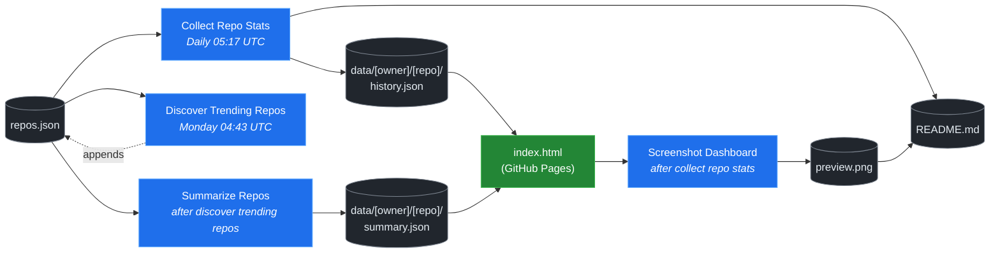

# 🚀 Rising Repos Tracker

> Automatically tracks daily GitHub stats (stars, forks, issues, velocity) for rising open source repos.

[](https://www.telosignal.com/)


**[→ View Live Dashboard](https://patrick-creates.github.io/rising-repos-tracker/)**

Built and maintained by [Telosignal](https://www.telosignal.com/).


<!-- AUTOGEN-STATS-START -->
## 📊 Current snapshot

> Auto-updated daily — last refreshed 2026-08-23

| Metric | Value |
|---|---|
| Repos tracked | **184** |
| Total stars | **8,907,991** |
| Total forks | **1,323,811** |
| Fastest growing | **ponytail** (+972.8/day) |

### 🔥 Top 5 by velocity

| # | Repo | Stars | Stars/day |
|---|---|---:|---:|
| 1 | [DietrichGebert/ponytail](https://github.com/DietrichGebert/ponytail) | 108,335 | +972.8 |
| 2 | [bojieli/ai-agent-book](https://github.com/bojieli/ai-agent-book) | 40,998 | +971.9 |
| 3 | [diegosouzapw/OmniRoute](https://github.com/diegosouzapw/OmniRoute) | 53,347 | +858.2 |
| 4 | [NousResearch/hermes-agent](https://github.com/NousResearch/hermes-agent) | 234,459 | +847.2 |
| 5 | [stablyai/orca](https://github.com/stablyai/orca) | 51,377 | +808.2 |

### 🆕 Recently added

- [holaboss-ai/holaOS](https://github.com/holaboss-ai/holaOS) — added 2026-08-17 — Open-source All in One AI agent workspace. Run any agent — Claude Code, Codex — across your tools (100+ integrations + MCP), apps, browser, and files, with shared memory. Built-in models or BYOK.
- [pascalorg/editor](https://github.com/pascalorg/editor) — added 2026-08-10 — Create and share 3D architectural projects.
- [jlcodes99/cockpit-tools](https://github.com/jlcodes99/cockpit-tools) — added 2026-08-10 —  🚀 通用 AI IDE 账号管理工具：支持 Antigravity / Codex / GitHub Copilot / Windsurf / Kiro / Cursor / Gemini-cli / CodeBuddy，多账号切换、配额监控、自动唤醒与多开实例管理。 🚀 Universal AI IDE account manager for Antigravity / Codex / GitHub Copilot / Windsurf / Kiro / Cursor / Gemini-cli / CodeBuddy, with multi-account switching, quota monitoring, wake-up automation, and multi-insta
<!-- AUTOGEN-STATS-END -->

<!-- AUTOGEN-DIAGRAM-START -->
## 🔄 How it works


```mermaid
graph LR
    repos[("repos.json")]:::data
    history[("data/[owner]/[repo]/<br/>history.json")]:::data
    summary[("data/[owner]/[repo]/<br/>summary.json")]:::data
    readme[("README.md")]:::data
    preview[("preview.png")]:::data
    dashboard["index.html<br/>(GitHub Pages)"]:::output
    collect_yml["Collect Repo Stats<br/><i>Daily 05:17 UTC</i>"]:::workflow
    discover_yml["Discover Trending Repos<br/><i>Monday 04:43 UTC</i>"]:::workflow
    screenshot_yml["Screenshot Dashboard<br/><i>after collect repo stats</i>"]:::workflow
    summarize_yml["Summarize Repos<br/><i>after discover trending repos</i>"]:::workflow
    repos --> collect_yml
    collect_yml --> history
    collect_yml --> readme
    repos --> discover_yml
    discover_yml -.->|appends| repos
    dashboard --> screenshot_yml
    screenshot_yml --> preview
    repos --> summarize_yml
    summarize_yml --> summary
    history --> dashboard
    summary --> dashboard
    preview --> readme
    classDef workflow fill:#1f6feb,stroke:#58a6ff,color:#fff
    classDef data fill:#21262d,stroke:#7d8590,color:#e6edf3
    classDef output fill:#238636,stroke:#3fb950,color:#fff
```
<!-- AUTOGEN-DIAGRAM-END -->

<!-- AUTOGEN-WORKFLOWS-START -->
## ⚙️ Workflows

| File | Schedule | Name |
|---|---|---|
| `collect.yml` | Daily 05:17 UTC | Collect Repo Stats |
| `discover.yml` | Monday 04:43 UTC | Discover Trending Repos |
| `screenshot.yml` | After Collect Repo Stats | Screenshot Dashboard |
| `summarize.yml` | After Discover Trending Repos | Summarize Repos |

> All workflows commit results directly back to the repo. Schedules are best-effort — GitHub Actions cron can drift by a few minutes.
<!-- AUTOGEN-WORKFLOWS-END -->

<!-- AUTOGEN-REPOS-START -->
## 📋 All tracked repos

| Repo | Stars | Forks | Stars/day |
|---|---:|---:|---:|
| [openclaw/openclaw](https://github.com/openclaw/openclaw) | 387,172 | 81,311 | +153.9 |
| [obra/superpowers](https://github.com/obra/superpowers) | 276,291 | 24,714 | +656.7 |
| [affaan-m/everything-claude-code](https://github.com/affaan-m/everything-claude-code) | 242,248 | 36,707 | +600.0 |
| [affaan-m/ECC](https://github.com/affaan-m/ECC) | 242,248 | 36,707 | +555.8 |
| [NousResearch/hermes-agent](https://github.com/NousResearch/hermes-agent) | 234,459 | 47,186 | +847.2 |
| [Significant-Gravitas/AutoGPT](https://github.com/Significant-Gravitas/AutoGPT) | 186,786 | 46,047 | +24.6 |
| [microsoft/markitdown](https://github.com/microsoft/markitdown) | 175,550 | 12,835 | +515.1 |
| [f/prompts.chat](https://github.com/f/prompts.chat) | 167,779 | 21,655 | +55.0 |
| [langgenius/dify](https://github.com/langgenius/dify) | 153,240 | 24,194 | +117.8 |
| [open-webui/open-webui](https://github.com/open-webui/open-webui) | 149,609 | 21,820 | +124.7 |
| [langchain-ai/langchain](https://github.com/langchain-ai/langchain) | 144,806 | 24,130 | +80.1 |
| [github/spec-kit](https://github.com/github/spec-kit) | 130,854 | 11,752 | +323.5 |
| [farion1231/cc-switch](https://github.com/farion1231/cc-switch) | 128,878 | 8,831 | +565.3 |
| [nextlevelbuilder/ui-ux-pro-max-skill](https://github.com/nextlevelbuilder/ui-ux-pro-max-skill) | 119,943 | 12,873 | +412.3 |
| [microsoft/generative-ai-for-beginners](https://github.com/microsoft/generative-ai-for-beginners) | 118,367 | 62,400 | +74.7 |
| [Graphify-Labs/graphify](https://github.com/Graphify-Labs/graphify) | 109,626 | 10,656 | +478.8 |
| [DietrichGebert/ponytail](https://github.com/DietrichGebert/ponytail) | 108,335 | 5,978 | +972.8 |
| [JuliusBrussee/caveman](https://github.com/JuliusBrussee/caveman) | 100,370 | 5,828 | +400.6 |
| [thedotmack/claude-mem](https://github.com/thedotmack/claude-mem) | 91,543 | 8,018 | +158.5 |
| [ruvnet/RuView](https://github.com/ruvnet/RuView) | 91,325 | 12,135 | +282.6 |
| [nexu-io/open-design](https://github.com/nexu-io/open-design) | 90,511 | 10,435 | +477.7 |
| [vllm-project/vllm](https://github.com/vllm-project/vllm) | 89,739 | 21,067 | +96.6 |
| [ChatGPTNextWeb/NextChat](https://github.com/ChatGPTNextWeb/NextChat) | 88,639 | 59,207 | +6.2 |
| [OpenHands/OpenHands](https://github.com/OpenHands/OpenHands) | 84,821 | 11,060 | +112.3 |
| [koala73/worldmonitor](https://github.com/koala73/worldmonitor) | 83,826 | 12,519 | +303.7 |
| [lobehub/lobehub](https://github.com/lobehub/lobehub) | 81,938 | 15,814 | +48.4 |
| [Leonxlnx/taste-skill](https://github.com/Leonxlnx/taste-skill) | 79,399 | 5,433 | +590.2 |
| [dair-ai/Prompt-Engineering-Guide](https://github.com/dair-ai/Prompt-Engineering-Guide) | 77,705 | 8,534 | +31.0 |
| [rtk-ai/rtk](https://github.com/rtk-ai/rtk) | 77,097 | 4,846 | +283.7 |
| [openai/openai-cookbook](https://github.com/openai/openai-cookbook) | 75,481 | 12,755 | +19.3 |
| [shareAI-lab/learn-claude-code](https://github.com/shareAI-lab/learn-claude-code) | 74,972 | 12,101 | +143.2 |
| [unslothai/unsloth](https://github.com/unslothai/unsloth) | 74,428 | 6,735 | +102.4 |
| [datawhalechina/hello-agents](https://github.com/datawhalechina/hello-agents) | 74,248 | 9,223 | +243.2 |
| [Panniantong/Agent-Reach](https://github.com/Panniantong/Agent-Reach) | 74,232 | 6,329 | +667.8 |
| [ComposioHQ/awesome-claude-skills](https://github.com/ComposioHQ/awesome-claude-skills) | 73,053 | 8,372 | +130.6 |
| [code-yeongyu/oh-my-openagent](https://github.com/code-yeongyu/oh-my-openagent) | 68,258 | 5,581 | +102.4 |
| [santifer/career-ops](https://github.com/santifer/career-ops) | 67,818 | 12,903 | +232.7 |
| [chopratejas/headroom](https://github.com/chopratejas/headroom) | 67,221 | 5,179 | +566.1 |
| [headroomlabs-ai/headroom](https://github.com/headroomlabs-ai/headroom) | 67,221 | 5,179 | +343.8 |
| [xtekky/gpt4free](https://github.com/xtekky/gpt4free) | 66,581 | 13,514 | +3.5 |
| [Fission-AI/OpenSpec](https://github.com/Fission-AI/OpenSpec) | 65,937 | 4,536 | +176.8 |
| [shanraisshan/claude-code-best-practice](https://github.com/shanraisshan/claude-code-best-practice) | 64,873 | 6,453 | +117.3 |
| [ZhuLinsen/daily_stock_analysis](https://github.com/ZhuLinsen/daily_stock_analysis) | 63,651 | 53,484 | +275.7 |
| [asgeirtj/system_prompts_leaks](https://github.com/asgeirtj/system_prompts_leaks) | 63,379 | 10,401 | +237.1 |
| [tw93/Pake](https://github.com/tw93/Pake) | 60,989 | 12,508 | +125.9 |
| [mvanhorn/last30days-skill](https://github.com/mvanhorn/last30days-skill) | 59,007 | 5,158 | +346.5 |
| [MemPalace/mempalace](https://github.com/MemPalace/mempalace) | 58,563 | 7,510 | +63.5 |
| [usestrix/strix](https://github.com/usestrix/strix) | 57,154 | 6,179 | +378.8 |
| [BerriAI/litellm](https://github.com/BerriAI/litellm) | 57,033 | 10,823 | +99.4 |
| [FlowiseAI/Flowise](https://github.com/FlowiseAI/Flowise) | 55,383 | 24,939 | +25.6 |
| [diegosouzapw/OmniRoute](https://github.com/diegosouzapw/OmniRoute) | 53,347 | 7,289 | +858.2 |
| [ggml-org/whisper.cpp](https://github.com/ggml-org/whisper.cpp) | 53,107 | 6,086 | +33.8 |
| [hesreallyhim/awesome-claude-code](https://github.com/hesreallyhim/awesome-claude-code) | 52,839 | 4,610 | +90.1 |
| [stablyai/orca](https://github.com/stablyai/orca) | 51,377 | 3,554 | +808.2 |
| [jamiepine/voicebox](https://github.com/jamiepine/voicebox) | 51,157 | 6,379 | +266.7 |
| [ChromeDevTools/chrome-devtools-mcp](https://github.com/ChromeDevTools/chrome-devtools-mcp) | 49,588 | 3,470 | +100.0 |
| [calesthio/OpenMontage](https://github.com/calesthio/OpenMontage) | 49,537 | 6,220 | +394.3 |
| [Aider-AI/aider](https://github.com/Aider-AI/aider) | 48,407 | 4,868 | +35.5 |
| [router-for-me/CLIProxyAPI](https://github.com/router-for-me/CLIProxyAPI) | 48,387 | 7,452 | +151.6 |
| [rohitg00/ai-engineering-from-scratch](https://github.com/rohitg00/ai-engineering-from-scratch) | 47,664 | 8,396 | +256.6 |
| [HKUDS/nanobot](https://github.com/HKUDS/nanobot) | 47,288 | 8,347 | +47.5 |
| [elder-plinius/CL4R1T4S](https://github.com/elder-plinius/CL4R1T4S) | 47,113 | 9,552 | +119.2 |
| [kepano/obsidian-skills](https://github.com/kepano/obsidian-skills) | 47,076 | 3,382 | +158.9 |
| [zhayujie/CowAgent](https://github.com/zhayujie/CowAgent) | 46,635 | 10,322 | +21.4 |
| [QuantumNous/new-api](https://github.com/QuantumNous/new-api) | 45,951 | 10,908 | +117.7 |
| [coreyhaines31/marketingskills](https://github.com/coreyhaines31/marketingskills) | 45,303 | 7,107 | +167.0 |
| [sickn33/antigravity-awesome-skills](https://github.com/sickn33/antigravity-awesome-skills) | 45,284 | 6,629 | +73.4 |
| [sickn33/agentic-awesome-skills](https://github.com/sickn33/agentic-awesome-skills) | 45,284 | 6,629 | +54.7 |
| [Imbad0202/academic-research-skills](https://github.com/Imbad0202/academic-research-skills) | 43,367 | 3,439 | +136.0 |
| [danny-avila/LibreChat](https://github.com/danny-avila/LibreChat) | 42,345 | 8,777 | +54.2 |
| [heygen-com/hyperframes](https://github.com/heygen-com/hyperframes) | 42,141 | 4,037 | +218.2 |
| [chatboxai/chatbox](https://github.com/chatboxai/chatbox) | 41,528 | 4,207 | +15.8 |
| [bojieli/ai-agent-book](https://github.com/bojieli/ai-agent-book) | 40,998 | 4,526 | +971.9 |
| [chatanywhere/GPT_API_free](https://github.com/chatanywhere/GPT_API_free) | 40,923 | 2,698 | +30.7 |
| [Hmbown/CodeWhale](https://github.com/Hmbown/CodeWhale) | 40,842 | 3,538 | +68.6 |
| [langchain-ai/langgraph](https://github.com/langchain-ai/langgraph) | 40,262 | 6,780 | +78.1 |
| [DeusData/codebase-memory-mcp](https://github.com/DeusData/codebase-memory-mcp) | 39,951 | 3,220 | +351.3 |
| [mindsdb/mindshub](https://github.com/mindsdb/mindshub) | 39,635 | 6,234 | +5.7 |
| [AstrBotDevs/AstrBot](https://github.com/AstrBotDevs/AstrBot) | 39,506 | 2,829 | +71.3 |
| [wshobson/agents](https://github.com/wshobson/agents) | 39,034 | 4,160 | +34.4 |
| [Yeachan-Heo/oh-my-claudecode](https://github.com/Yeachan-Heo/oh-my-claudecode) | 38,743 | 3,477 | +43.5 |
| [google/langextract](https://github.com/google/langextract) | 38,472 | 2,699 | +21.3 |
| [github/awesome-copilot](https://github.com/github/awesome-copilot) | 38,136 | 4,821 | +48.1 |
| [songquanpeng/one-api](https://github.com/songquanpeng/one-api) | 36,528 | 6,825 | +25.8 |
| [PDFMathTranslate/PDFMathTranslate](https://github.com/PDFMathTranslate/PDFMathTranslate) | 36,297 | 3,239 | +25.4 |
| [esengine/DeepSeek-Reasonix](https://github.com/esengine/DeepSeek-Reasonix) | 35,051 | 2,333 | +204.3 |
| [agentscope-ai/QwenPaw](https://github.com/agentscope-ai/QwenPaw) | 34,339 | 3,019 | +240.0 |
| [anthropics/claude-plugins-official](https://github.com/anthropics/claude-plugins-official) | 33,835 | 3,844 | +58.1 |
| [AlexsJones/llmfit](https://github.com/AlexsJones/llmfit) | 33,603 | 2,101 | +79.5 |
| [MadsLorentzen/ai-job-search](https://github.com/MadsLorentzen/ai-job-search) | 32,938 | 11,581 | +277.0 |
| [JCodesMore/ai-website-cloner-template](https://github.com/JCodesMore/ai-website-cloner-template) | 32,833 | 4,791 | +229.6 |
| [zeroclaw-labs/zeroclaw](https://github.com/zeroclaw-labs/zeroclaw) | 32,635 | 4,904 | +11.6 |
| [iOfficeAI/AionUi](https://github.com/iOfficeAI/AionUi) | 32,213 | 3,306 | +58.6 |
| [volcengine/OpenViking](https://github.com/volcengine/OpenViking) | 32,153 | 2,453 | +89.8 |
| [ogulcancelik/herdr](https://github.com/ogulcancelik/herdr) | 31,636 | 2,261 | +400.8 |
| [herdrdev/herdr](https://github.com/herdrdev/herdr) | 31,636 | 2,261 | +392.4 |
| [HKUDS/Vibe-Trading](https://github.com/HKUDS/Vibe-Trading) | 31,490 | 5,116 | +304.6 |
| [Gitlawb/openclaude](https://github.com/Gitlawb/openclaude) | 30,804 | 8,921 | +32.2 |
| [tirth8205/code-review-graph](https://github.com/tirth8205/code-review-graph) | 30,708 | 2,793 | +176.7 |
| [mukul975/Anthropic-Cybersecurity-Skills](https://github.com/mukul975/Anthropic-Cybersecurity-Skills) | 30,698 | 3,651 | +202.8 |
| [googleworkspace/cli](https://github.com/googleworkspace/cli) | 30,515 | 1,785 | +45.7 |
| [iOfficeAI/OfficeCLI](https://github.com/iOfficeAI/OfficeCLI) | 29,063 | 1,982 | +430.5 |
| [voideditor/void](https://github.com/voideditor/void) | 28,831 | 2,636 | +0.3 |
| [alibaba/page-agent](https://github.com/alibaba/page-agent) | 28,795 | 2,575 | +148.4 |
| [jackwener/OpenCLI](https://github.com/jackwener/OpenCLI) | 28,461 | 2,795 | +61.3 |
| [langchain-ai/deepagents](https://github.com/langchain-ai/deepagents) | 28,086 | 3,927 | +51.7 |
| [p-e-w/heretic](https://github.com/p-e-w/heretic) | 28,024 | 3,036 | +53.3 |
| [BloopAI/vibe-kanban](https://github.com/BloopAI/vibe-kanban) | 27,887 | 2,981 | +14.2 |
| [jarrodwatts/claude-hud](https://github.com/jarrodwatts/claude-hud) | 27,567 | 1,275 | +37.9 |
| [rohitg00/agentmemory](https://github.com/rohitg00/agentmemory) | 27,283 | 2,335 | +71.8 |
| [can1357/oh-my-pi](https://github.com/can1357/oh-my-pi) | 26,576 | 2,587 | +202.9 |
| [manaflow-ai/cmux](https://github.com/manaflow-ai/cmux) | 26,357 | 2,248 | +48.8 |
| [decolua/9router](https://github.com/decolua/9router) | 26,097 | 4,710 | +123.6 |
| [zai-org/Open-AutoGLM](https://github.com/zai-org/Open-AutoGLM) | 26,070 | 4,020 | +8.0 |
| [toon-format/toon](https://github.com/toon-format/toon) | 25,229 | 1,119 | +9.6 |
| [TencentCloud/TencentDB-Agent-Memory](https://github.com/TencentCloud/TencentDB-Agent-Memory) | 23,888 | 2,204 | +370.0 |
| [winfunc/opcode](https://github.com/winfunc/opcode) | 22,388 | 1,729 | +5.0 |
| [pranshuparmar/witr](https://github.com/pranshuparmar/witr) | 21,651 | 756 | +65.8 |
| [pascalorg/editor](https://github.com/pascalorg/editor) | 21,641 | 2,778 | +30.1 |
| [coze-dev/coze-studio](https://github.com/coze-dev/coze-studio) | 21,494 | 3,118 | +7.2 |
| [NirDiamant/agents-towards-production](https://github.com/NirDiamant/agents-towards-production) | 21,321 | 2,832 | +9.0 |
| [alibaba/open-code-review](https://github.com/alibaba/open-code-review) | 21,161 | 1,543 | +232.8 |
| [steipete/CodexBar](https://github.com/steipete/CodexBar) | 20,477 | 1,765 | +85.1 |
| [Tencent/WeKnora](https://github.com/Tencent/WeKnora) | 20,376 | 2,927 | +59.2 |
| [jundot/omlx](https://github.com/jundot/omlx) | 20,367 | 1,724 | +54.1 |
| [mksglu/context-mode](https://github.com/mksglu/context-mode) | 20,095 | 1,449 | +38.1 |
| [KKKKhazix/khazix-skills](https://github.com/KKKKhazix/khazix-skills) | 19,965 | 2,157 | +73.7 |
| [jnMetaCode/agency-agents-zh](https://github.com/jnMetaCode/agency-agents-zh) | 19,780 | 3,218 | +70.5 |
| [tanweai/pua](https://github.com/tanweai/pua) | 19,478 | 1,187 | +17.9 |
| [datawhalechina/easy-vibe](https://github.com/datawhalechina/easy-vibe) | 19,062 | 1,826 | +30.7 |
| [danielmiessler/LifeOS](https://github.com/danielmiessler/LifeOS) | 18,670 | 2,432 | +42.0 |
| [1jehuang/jcode](https://github.com/1jehuang/jcode) | 18,264 | 2,054 | +242.9 |
| [RightNow-AI/openfang](https://github.com/RightNow-AI/openfang) | 18,129 | 2,286 | +4.4 |
| [nesquena/hermes-webui](https://github.com/nesquena/hermes-webui) | 17,638 | 2,441 | +45.2 |
| [microsoft/agent-lightning](https://github.com/microsoft/agent-lightning) | 17,606 | 1,555 | +4.3 |
| [browser-use/browser-harness](https://github.com/browser-use/browser-harness) | 17,033 | 1,629 | +28.3 |
| [cft0808/edict](https://github.com/cft0808/edict) | 16,397 | 1,721 | +4.9 |
| [jlcodes99/cockpit-tools](https://github.com/jlcodes99/cockpit-tools) | 16,351 | 1,438 | +67.6 |
| [t8y2/dbx](https://github.com/t8y2/dbx) | 16,282 | 1,605 | +164.6 |
| [MemoriLabs/Memori](https://github.com/MemoriLabs/Memori) | 16,198 | 3,229 | +13.8 |
| [composio-community/awesome-codex-skills](https://github.com/composio-community/awesome-codex-skills) | 15,995 | 1,556 | +21.5 |
| [xbtlin/ai-berkshire](https://github.com/xbtlin/ai-berkshire) | 15,772 | 2,361 | +104.1 |
| [Anionex/banana-slides](https://github.com/Anionex/banana-slides) | 15,490 | 1,773 | +5.8 |
| [xpzouying/xiaohongshu-mcp](https://github.com/xpzouying/xiaohongshu-mcp) | 15,429 | 2,274 | +18.4 |
| [wanshuiyin/Auto-claude-code-research-in-sleep](https://github.com/wanshuiyin/Auto-claude-code-research-in-sleep) | 15,019 | 1,322 | +40.8 |
| [yusufkaraaslan/Skill_Seekers](https://github.com/yusufkaraaslan/Skill_Seekers) | 14,802 | 1,511 | +9.3 |
| [kyegomez/OpenMythos](https://github.com/kyegomez/OpenMythos) | 14,799 | 3,292 | +10.4 |
| [NevaMind-AI/memU](https://github.com/NevaMind-AI/memU) | 14,336 | 1,062 | +7.0 |
| [NanmiCoder/cc-haha](https://github.com/NanmiCoder/cc-haha) | 14,187 | 8,543 | +15.6 |
| [walkinglabs/learn-harness-engineering](https://github.com/walkinglabs/learn-harness-engineering) | 13,770 | 1,378 | +80.9 |
| [superset-sh/superset](https://github.com/superset-sh/superset) | 13,236 | 1,211 | +19.6 |
| [XiaomiMiMo/MiMo-Code](https://github.com/XiaomiMiMo/MiMo-Code) | 12,847 | 1,317 | +33.1 |
| [sirmalloc/ccstatusline](https://github.com/sirmalloc/ccstatusline) | 12,525 | 548 | +22.6 |
| [EverMind-AI/EverOS](https://github.com/EverMind-AI/EverOS) | 12,344 | 901 | +47.8 |
| [0x4m4/hexstrike-ai](https://github.com/0x4m4/hexstrike-ai) | 11,296 | 2,361 | +23.4 |
| [ifixai-ai/iFixAi](https://github.com/ifixai-ai/iFixAi) | 11,253 | 1,140 | +236.9 |
| [ValueCell-ai/valuecell](https://github.com/ValueCell-ai/valuecell) | 11,003 | 1,810 | +2.4 |
| [brokermr810/QuantDinger](https://github.com/brokermr810/QuantDinger) | 10,959 | 2,313 | +34.9 |
| [OpenByteInc/QuantDinger](https://github.com/OpenByteInc/QuantDinger) | 10,959 | 2,313 | +34.0 |
| [aden-hive/hive](https://github.com/aden-hive/hive) | 10,949 | 5,671 | +6.1 |
| [MemTensor/MemOS](https://github.com/MemTensor/MemOS) | 10,927 | 1,002 | +16.4 |
| [holaboss-ai/holaOS](https://github.com/holaboss-ai/holaOS) | 10,673 | 710 | +383.7 |
| [EKKOLearnAI/hermes-studio](https://github.com/EKKOLearnAI/hermes-studio) | 10,524 | 1,280 | +34.7 |
| [ConardLi/garden-skills](https://github.com/ConardLi/garden-skills) | 10,497 | 1,367 | +27.4 |
| [Kuberwastaken/claurst](https://github.com/Kuberwastaken/claurst) | 10,264 | 7,767 | +7.2 |
| [openai/codex-security](https://github.com/openai/codex-security) | 10,083 | 719 | +90.0 |
| [ykdojo/claude-code-tips](https://github.com/ykdojo/claude-code-tips) | 9,853 | 789 | +17.4 |
| [StarTrail-org/PixelRAG](https://github.com/StarTrail-org/PixelRAG) | 9,665 | 826 | +75.1 |
| [getagentseal/codeburn](https://github.com/getagentseal/codeburn) | 9,609 | 767 | +23.7 |
| [frankbria/ralph-claude-code](https://github.com/frankbria/ralph-claude-code) | 9,604 | 721 | +4.8 |
| [EvoMap/evolver](https://github.com/EvoMap/evolver) | 8,988 | 838 | +2.8 |
| [iflytek/astron-agent](https://github.com/iflytek/astron-agent) | 8,947 | 858 | +7.0 |
| [modem-dev/hunk](https://github.com/modem-dev/hunk) | 8,685 | 266 | +48.3 |
| [MiroMindAI/MiroThinker](https://github.com/MiroMindAI/MiroThinker) | 8,359 | 642 | +0.7 |
| [mmulet/term.everything](https://github.com/mmulet/term.everything) | 8,080 | 194 | +1.2 |
| [ValueCell-ai/ClawX](https://github.com/ValueCell-ai/ClawX) | 7,597 | 1,143 | +1.4 |
| [opensquilla/opensquilla](https://github.com/opensquilla/opensquilla) | 6,645 | 518 | +12.8 |
| [1weiho/open-slide](https://github.com/1weiho/open-slide) | 6,641 | 483 | +40.2 |
| [steipete/summarize](https://github.com/steipete/summarize) | 6,572 | 440 | +4.0 |
| [Andyyyy64/whichllm](https://github.com/Andyyyy64/whichllm) | 6,428 | 347 | +16.5 |
| [Arthur-Ficial/apfel](https://github.com/Arthur-Ficial/apfel) | 6,309 | 242 | +4.7 |
| [microsoft/fara](https://github.com/microsoft/fara) | 6,146 | 600 | +3.6 |
| [UfoMiao/zcf](https://github.com/UfoMiao/zcf) | 6,078 | 421 | +0.2 |
| [re4/LibreCode](https://github.com/re4/LibreCode) | 84 | 5 | — |
<!-- AUTOGEN-REPOS-END -->

---

## What it does

- Collects daily snapshots of stars, forks, watchers and open issues for every tracked repo
- Discovers new trending repos automatically every Monday using the GitHub Search API
- Generates AI summaries (use cases, similar tools, tags) for each tracked repo via GitHub Models
- Stores all history as plain JSON — no database, no backend
- Renders a live dashboard via GitHub Pages — updates daily, zero maintenance

## Tracked repos

Data lives in [`data/`](./data) — one folder per repo, one `history.json` per entry.  
The full watch list is in [`repos.json`](./repos.json).

## Fork & use it for yourself

This is my personal tracker — the watch list reflects what I find interesting. If you want to track different repos, the best path is to **fork this repo and run your own**.

### Setup

1. Fork this repo to your account
2. Replace the contents of [`repos.json`](./repos.json) with the repos you want to track (or just leave one entry — `discover.yml` will auto-add more every Monday)
3. Go to **Settings → Pages** and enable GitHub Pages from the `main` branch
4. Go to **Actions** and run **Collect Repo Stats** once manually to seed your first data point
5. Your dashboard will be live at `https://YOUR-USERNAME.github.io/rising-repos-tracker/`

That's it — daily collection and weekly discovery run automatically on schedule. Zero ongoing maintenance.

### Customizing what gets discovered

Edit [`scripts/discover.js`](./scripts/discover.js) to change:

- `MIN_STARS` — minimum star threshold for candidates
- `MAX_AGE_DAYS` — how recent a repo must be
- `MAX_NEW_REPOS` — how many to add per discovery run
- The `queries` array — GitHub Search API queries that define what "trending" means to you

### Adding a repo manually

Just edit `repos.json` directly:

```json
{
  "owner": "OWNER",
  "repo": "REPO",
  "added": "YYYY-MM-DD",
  "notes": "why you're tracking this"
}
```

The next daily collect run picks it up automatically.

## Stack

- **GitHub Actions** — scheduling and automation
- **GitHub Pages** — dashboard hosting
- **GitHub API** — data source
- **GitHub Models** — free AI summaries (gpt-4o-mini)
- **Chart.js** — star growth visualization
- **Mermaid** — architecture diagram (rendered by GitHub)
- No dependencies, no build step, no database

## License

MIT
